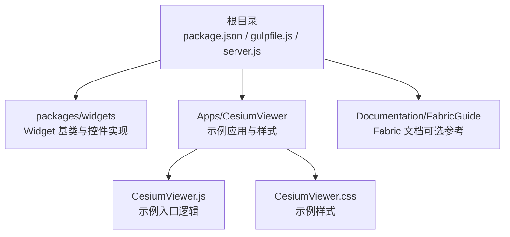
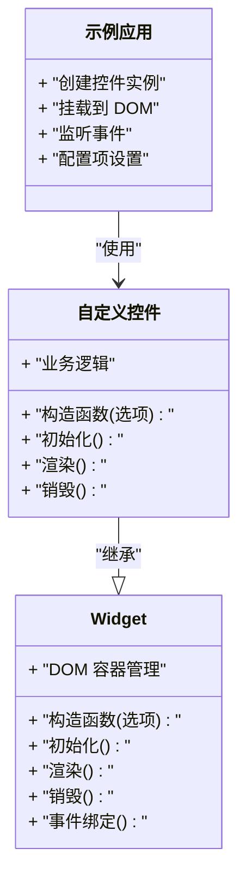
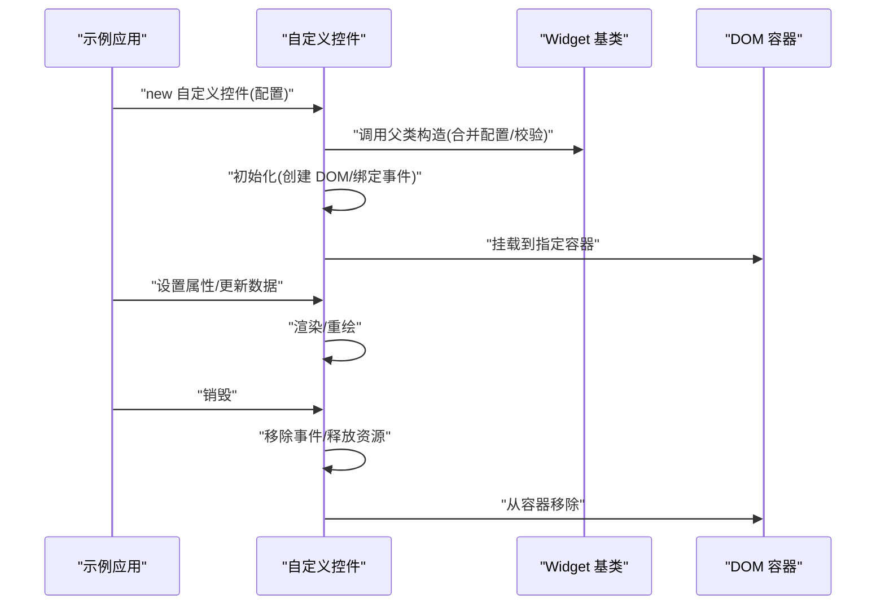
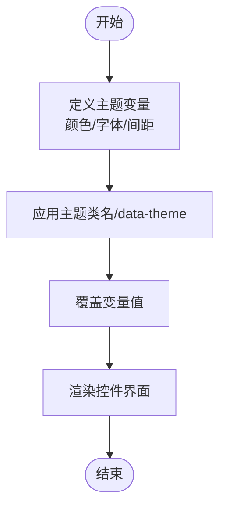
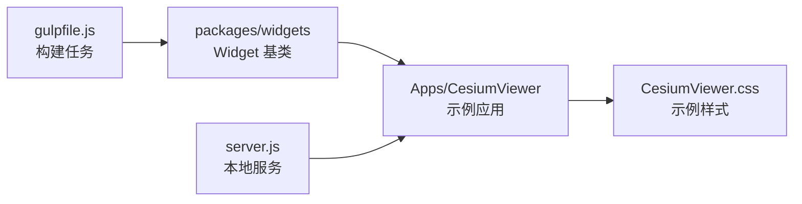

# 自定义控件开发

<cite>
**本文引用的文件**   
- [README.md](file://README.md)
- [package.json](file://package.json)
- [gulpfile.js](file://gulpfile.js)
- [server.js](file://server.js)
- [index.html](file://index.html)
- [Apps/CesiumViewer/CesiumViewer.js](file://Apps/CesiumViewer/CesiumViewer.js)
- [Apps/CesiumViewer/CesiumViewer.css](file://Apps/CesiumViewer/CesiumViewer.css)
- [Documentation/FabricGuide/README.md](file://Documentation/FabricGuide/README.md)
- [packages/widgets/src/Widget.js](file://packages/widgets/src/Widget.js)
</cite>

## 目录
1. [简介](#简介)
2. [项目结构](#项目结构)
3. [核心组件](#核心组件)
4. [架构总览](#架构总览)
5. [详细组件分析](#详细组件分析)
6. [依赖分析](#依赖分析)
7. [性能考虑](#性能考虑)
8. [故障排查指南](#故障排查指南)
9. [结论](#结论)
10. [附录](#附录)

## 简介
本指南面向希望基于 Widget 基类开发自定义控件的工程师，围绕 CesiumJS 工程中的 widgets 包与示例应用，系统阐述：
- 基于 Widget 基类的类结构设计、DOM 操作规范、事件处理机制与生命周期管理
- 样式系统与 CSS 架构，如何实现可主题化的控件界面
- 配置系统、属性定义与验证机制
- 从需求分析到测试部署的完整开发流程
- 异步加载、缓存机制、错误处理与性能优化等高级特性
- 数据驱动控件、交互式工具控件、集成第三方库控件等实战案例

## 项目结构
仓库采用多包组织方式，widgets 相关源码位于 packages/widgets 目录；示例应用位于 Apps/CesiumViewer；构建与运行脚本位于根目录 gulpfile.js 与 server.js。

图表来源
- [package.json](file://package.json)
- [gulpfile.js](file://gulpfile.js)
- [server.js](file://server.js)
- [Apps/CesiumViewer/CesiumViewer.js](file://Apps/CesiumViewer/CesiumViewer.js)
- [Apps/CesiumViewer/CesiumViewer.css](file://Apps/CesiumViewer/CesiumViewer.css)

章节来源
- [README.md](file://README.md)
- [package.json](file://package.json)
- [gulpfile.js](file://gulpfile.js)
- [server.js](file://server.js)
- [Apps/CesiumViewer/CesiumViewer.js](file://Apps/CesiumViewer/CesiumViewer.js)
- [Apps/CesiumViewer/CesiumViewer.css](file://Apps/CesiumViewer/CesiumViewer.css)

## 核心组件
- Widget 基类：提供控件的生命周期钩子、DOM 容器管理、事件绑定与销毁清理等通用能力。自定义控件应继承该基类，并在相应生命周期中完成初始化、渲染与资源释放。
- 示例应用：演示如何引入并实例化控件，挂载到 DOM，以及通过配置项控制行为。
- 构建与运行：通过 gulp 任务进行打包与调试，本地服务器用于静态资源服务与热更新。

章节来源
- [packages/widgets/src/Widget.js](file://packages/widgets/src/Widget.js)
- [Apps/CesiumViewer/CesiumViewer.js](file://Apps/CesiumViewer/CesiumViewer.js)
- [gulpfile.js](file://gulpfile.js)
- [server.js](file://server.js)

## 架构总览
下图展示“示例应用 -> 自定义控件 -> Widget 基类”的调用关系与职责边界。

图表来源
- [packages/widgets/src/Widget.js](file://packages/widgets/src/Widget.js)
- [Apps/CesiumViewer/CesiumViewer.js](file://Apps/CesiumViewer/CesiumViewer.js)

## 详细组件分析

### Widget 基类与自定义控件
- 类结构设计
  - 建议将控件拆分为“基础能力层（Widget）+ 业务扩展层（自定义控件）”，遵循单一职责原则。
  - 在构造函数中接收配置对象，并进行参数校验与默认值合并。
- 生命周期管理
  - 初始化阶段：创建 DOM 节点、注册事件、准备资源。
  - 渲染阶段：根据状态更新 UI、同步外部数据源。
  - 销毁阶段：移除事件监听、释放资源、清空引用，避免内存泄漏。
- DOM 操作规范
  - 统一通过容器节点进行增删改查，避免直接操作全局 document。
  - 对动态内容使用安全的插入方法，防止 XSS。
- 事件处理机制
  - 集中式事件总线或委托模式，减少重复绑定。
  - 事件命名空间化，便于批量解绑与调试。
- 配置系统与属性验证
  - 定义属性元信息（类型、默认值、是否必填、校验函数）。
  - 在 setter 中进行变更检测与副作用触发（如重新渲染）。

图表来源
- [packages/widgets/src/Widget.js](file://packages/widgets/src/Widget.js)
- [Apps/CesiumViewer/CesiumViewer.js](file://Apps/CesiumViewer/CesiumViewer.js)

章节来源
- [packages/widgets/src/Widget.js](file://packages/widgets/src/Widget.js)
- [Apps/CesiumViewer/CesiumViewer.js](file://Apps/CesiumViewer/CesiumViewer.js)

### 样式系统与 CSS 架构
- 样式组织
  - 按功能域拆分 CSS 文件，使用命名空间前缀避免冲突。
  - 将主题变量抽离为 CSS 变量，支持运行时切换。
- 主题化实现
  - 通过 data-theme 或 class 切换主题，CSS 变量覆盖默认值。
  - 提供明暗两套主题，确保对比度与可访问性。
- 示例样式
  - 示例应用的样式文件展示了如何为控件区域定义布局与交互态。

章节来源
- [Apps/CesiumViewer/CesiumViewer.css](file://Apps/CesiumViewer/CesiumViewer.css)

### 配置系统、属性定义与验证机制
- 属性定义
  - 以声明式方式定义属性元信息，包括类型、默认值、范围、枚举等。
- 验证机制
  - 在赋值时执行校验，失败抛出明确错误信息。
  - 支持异步校验（如远程可用性检查），返回 Promise。
- 变更响应
  - 属性变更后触发回调或事件，通知视图层刷新。

章节来源
- [packages/widgets/src/Widget.js](file://packages/widgets/src/Widget.js)

### 开发流程（从需求到部署）
- 需求分析
  - 明确控件目标用户、交互模型、数据源与性能要求。
- 设计阶段
  - 输出类图、时序图与状态图，确定 API 契约。
- 实现阶段
  - 基于 Widget 基类实现，优先保证生命周期正确性与资源释放。
- 测试阶段
  - 单元测试覆盖关键路径；E2E 场景模拟用户交互。
- 构建与发布
  - 使用 gulp 任务打包，生成产物并上传 CDN。

章节来源
- [gulpfile.js](file://gulpfile.js)
- [server.js](file://server.js)

## 依赖分析
widgets 包与示例应用之间的依赖关系如下：

图表来源
- [packages/widgets/src/Widget.js](file://packages/widgets/src/Widget.js)
- [Apps/CesiumViewer/CesiumViewer.js](file://Apps/CesiumViewer/CesiumViewer.js)
- [Apps/CesiumViewer/CesiumViewer.css](file://Apps/CesiumViewer/CesiumViewer.css)
- [gulpfile.js](file://gulpfile.js)
- [server.js](file://server.js)

章节来源
- [package.json](file://package.json)
- [gulpfile.js](file://gulpfile.js)
- [server.js](file://server.js)

## 性能考虑
- 渲染优化
  - 批量更新 DOM，避免频繁回流与重绘。
  - 使用虚拟列表或分页策略处理大数据集。
- 事件优化
  - 事件委托降低监听器数量。
  - 防抖/节流高频事件（滚动、拖拽）。
- 资源管理
  - 延迟加载非关键资源，按需引入模块。
  - 及时销毁与释放，避免内存泄漏。
- 主题切换
  - 预编译主题变量，减少运行时计算开销。

[本节为通用指导，不直接分析具体文件]

## 故障排查指南
- 常见问题
  - 控件未显示：检查容器是否存在、样式是否被覆盖、DOM 挂载是否正确。
  - 事件无响应：确认事件绑定时机与命名空间，避免重复绑定或未解绑。
  - 内存泄漏：确保销毁流程完整，清除定时器与监听器。
- 定位手段
  - 使用浏览器开发者工具监控 DOM 变化与事件流。
  - 在关键生命周期添加日志，观察初始化与销毁顺序。
- 构建与运行
  - 若构建失败，检查 gulp 任务与依赖版本。
  - 本地服务无法启动，检查端口占用与权限。

章节来源
- [gulpfile.js](file://gulpfile.js)
- [server.js](file://server.js)

## 结论
通过继承 Widget 基类，结合规范的 DOM 操作、事件处理与生命周期管理，可以高效地构建可复用、可维护的自定义控件。配合清晰的样式架构与配置验证机制，能够显著提升控件的可主题化与可扩展性。遵循本文的开发流程与性能优化建议，可在复杂场景中稳定交付高质量的控件产品。

[本节为总结，不直接分析具体文件]

## 附录
- 参考文档
  - Fabric 指南：了解组件描述与声明式配置思路（可选参考）。
- 示例入口
  - 示例应用入口 HTML 与 JS 文件可用于快速上手与对照实现。

章节来源
- [Documentation/FabricGuide/README.md](file://Documentation/FabricGuide/README.md)
- [index.html](file://index.html)
- [Apps/CesiumViewer/CesiumViewer.js](file://Apps/CesiumViewer/CesiumViewer.js)