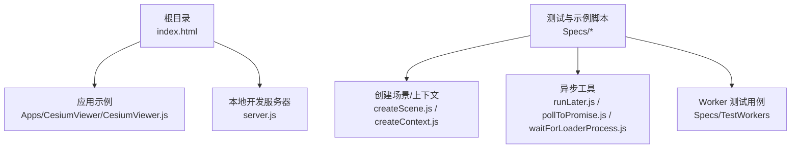
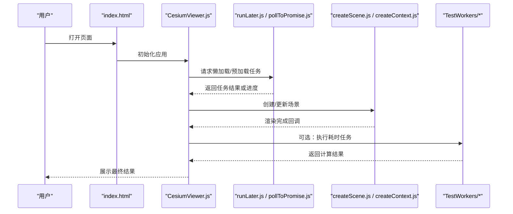
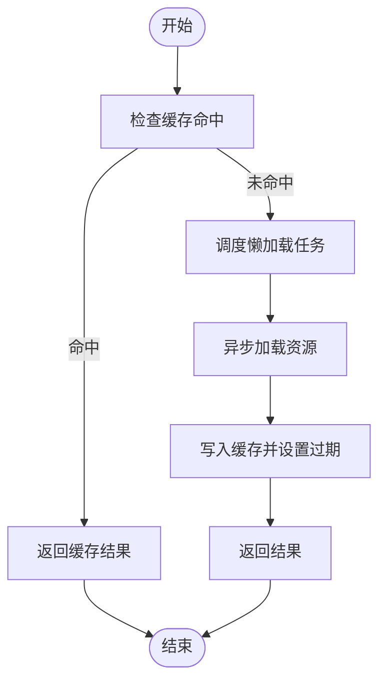
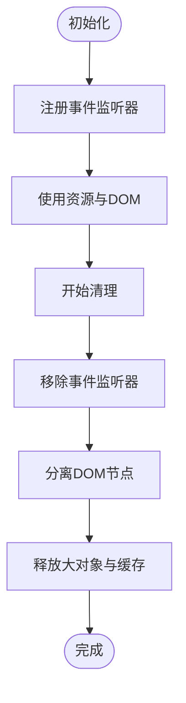
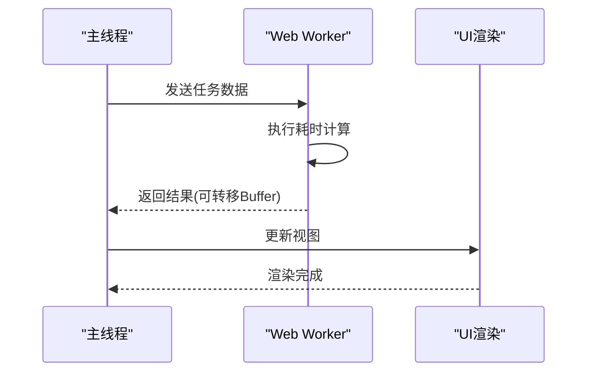
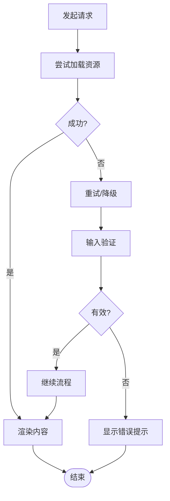
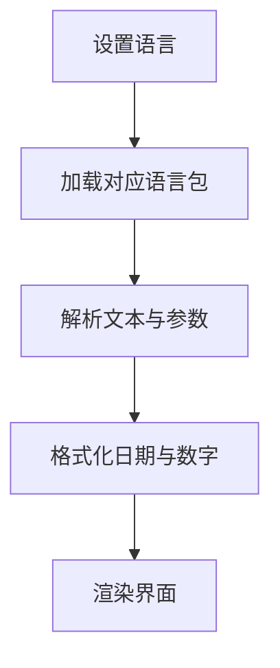
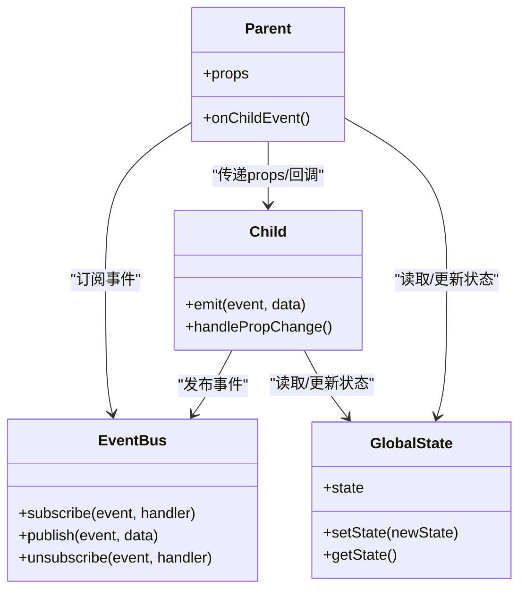
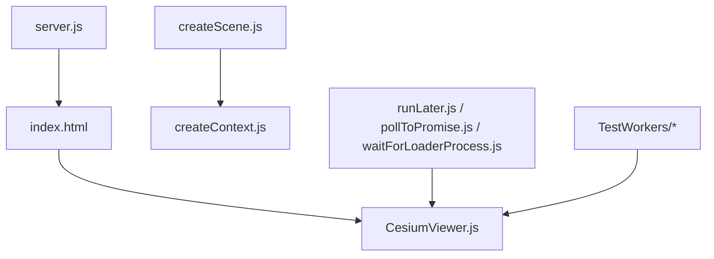

# 高级特性与优化

<cite>
**本文引用的文件**   
- [README.md](file://README.md)
- [package.json](file://package.json)
- [server.js](file://server.js)
- [index.html](file://index.html)
- [CesiumViewer.js](file://Apps/CesiumViewer/CesiumViewer.js)
- [index.ts](file://Specs/TypeScript/index.ts)
- [createScene.js](file://Specs/createScene.js)
- [createContext.js](file://Specs/createContext.js)
- [runLater.js](file://Specs/runLater.js)
- [pollToPromise.js](file://Specs/pollToPromise.js)
- [waitForLoaderProcess.js](file://Specs/waitForLoaderProcess.js)
- [TestWasm](file://Specs/TestWorkers)
</cite>

## 目录
1. [简介](#简介)
2. [项目结构](#项目结构)
3. [核心组件](#核心组件)
4. [架构总览](#架构总览)
5. [详细组件分析](#详细组件分析)
6. [依赖关系分析](#依赖关系分析)
7. [性能考量](#性能考量)
8. [故障排查指南](#故障排查指南)
9. [结论](#结论)
10. [附录](#附录)

## 简介
本指南聚焦于“控件高级特性与性能优化”，围绕异步加载（懒加载、预加载、缓存）、内存管理（DOM清理、事件监听器移除、大对象释放）、性能监控与优化（渲染性能分析、重绘重排优化、Web Worker）、错误处理与异常恢复（网络失败、资源加载错误、输入验证）、国际化支持（多语言文本、日期格式化）以及复杂场景下的控件通信（父子通信、全局状态、事件总线）等主题，结合仓库中的示例与测试基础设施，提供可落地的实践建议与参考路径。

## 项目结构
仓库采用分层组织：应用示例位于 Apps，核心源码位于 Source，测试与示例脚本位于 Specs，构建与工具位于 Tools 和 scripts，根目录包含入口页面与服务器脚本。该结构便于将演示、测试与生产代码解耦，有利于性能分析与问题定位。

图表来源
- [index.html:1-200](file://index.html#L1-L200)
- [CesiumViewer.js:1-200](file://Apps/CesiumViewer/CesiumViewer.js#L1-L200)
- [server.js:1-200](file://server.js#L1-L200)
- [createScene.js:1-200](file://Specs/createScene.js#L1-L200)
- [createContext.js:1-200](file://Specs/createContext.js#L1-L200)
- [runLater.js:1-200](file://Specs/runLater.js#L1-L200)
- [pollToPromise.js:1-200](file://Specs/pollToPromise.js#L1-L200)
- [waitForLoaderProcess.js:1-200](file://Specs/waitForLoaderProcess.js#L1-L200)
- [TestWasm](file://Specs/TestWorkers)

章节来源
- [README.md:1-200](file://README.md#L1-L200)
- [package.json:1-200](file://package.json#L1-L200)
- [index.html:1-200](file://index.html#L1-L200)
- [server.js:1-200](file://server.js#L1-L200)

## 核心组件
- 应用入口与示例
  - index.html 作为浏览器入口，承载应用初始化与资源加载流程。
  - CesiumViewer.js 提供示例页面的交互与渲染逻辑，适合用于演示异步加载与性能调优。
- 测试与工具
  - createScene.js / createContext.js 用于构造测试场景与上下文，便于隔离渲染与资源生命周期。
  - runLater.js / pollToPromise.js / waitForLoaderProcess.js 提供异步调度、轮询与等待机制，支撑懒加载与预加载的编排。
  - TestWorkers 下包含 Web Worker 相关测试用例，可用于并行计算与主线程卸载。

章节来源
- [index.html:1-200](file://index.html#L1-L200)
- [CesiumViewer.js:1-200](file://Apps/CesiumViewer/CesiumViewer.js#L1-L200)
- [createScene.js:1-200](file://Specs/createScene.js#L1-L200)
- [createContext.js:1-200](file://Specs/createContext.js#L1-L200)
- [runLater.js:1-200](file://Specs/runLater.js#L1-L200)
- [pollToPromise.js:1-200](file://Specs/pollToPromise.js#L1-L200)
- [waitForLoaderProcess.js:1-200](file://Specs/waitForLoaderProcess.js#L1-L200)
- [TestWasm](file://Specs/TestWorkers)

## 架构总览
下图展示了从页面加载到资源异步获取、渲染与清理的整体流程，并标注了关键工具与示例文件的参与点。

图表来源
- [index.html:1-200](file://index.html#L1-L200)
- [CesiumViewer.js:1-200](file://Apps/CesiumViewer/CesiumViewer.js#L1-L200)
- [runLater.js:1-200](file://Specs/runLater.js#L1-L200)
- [pollToPromise.js:1-200](file://Specs/pollToPromise.js#L1-L200)
- [createScene.js:1-200](file://Specs/createScene.js#L1-L200)
- [createContext.js:1-200](file://Specs/createContext.js#L1-L200)
- [TestWasm](file://Specs/TestWorkers)

## 详细组件分析

### 异步加载机制（懒加载、预加载、缓存策略）
- 懒加载
  - 使用 runLater.js 进行任务延迟与批处理，避免首屏阻塞。
  - 在滚动或交互触发时按需加载资源，降低初始负载。
- 预加载
  - 基于 pollToPromise.js 实现轮询式预取，提前准备下一屏或热点区域数据。
  - 通过 waitForLoaderProcess.js 协调加载进程，确保顺序与并发控制。
- 缓存策略
  - 对已加载资源建立键值映射，按访问频率与过期策略管理。
  - 结合内存上限与 LRU 淘汰，防止内存膨胀。

图表来源
- [runLater.js:1-200](file://Specs/runLater.js#L1-L200)
- [pollToPromise.js:1-200](file://Specs/pollToPromise.js#L1-L200)
- [waitForLoaderProcess.js:1-200](file://Specs/waitForLoaderProcess.js#L1-L200)

章节来源
- [runLater.js:1-200](file://Specs/runLater.js#L1-L200)
- [pollToPromise.js:1-200](file://Specs/pollToPromise.js#L1-L200)
- [waitForLoaderProcess.js:1-200](file://Specs/waitForLoaderProcess.js#L1-L200)

### 内存管理最佳实践（DOM清理、事件监听器移除、大对象释放）
- DOM节点清理
  - 在组件销毁前移除所有子节点引用，避免悬挂引用导致 GC 无法回收。
  - 批量操作时使用 DocumentFragment 减少重排次数。
- 事件监听器移除
  - 统一注册与注销事件，确保在卸载时调用 removeEventListener。
  - 使用弱引用或一次性事件处理器降低泄漏风险。
- 大对象释放
  - 及时清空数组与缓冲区，避免持有大对象引用。
  - 对纹理、几何体等大对象显式释放，并在必要时分块处理。

图表来源
- [createScene.js:1-200](file://Specs/createScene.js#L1-L200)
- [createContext.js:1-200](file://Specs/createContext.js#L1-L200)

章节来源
- [createScene.js:1-200](file://Specs/createScene.js#L1-L200)
- [createContext.js:1-200](file://Specs/createContext.js#L1-L200)

### 性能监控与优化技巧（渲染性能分析、重绘重排优化、Web Worker）
- 渲染性能分析
  - 使用浏览器开发者工具的 Performance 面板记录帧时间，识别长任务与掉帧。
  - 统计 draw calls、三角面数与纹理大小，评估渲染压力。
- 重绘重排优化
  - 合并样式变更，避免频繁读写布局属性。
  - 使用 transform 与 opacity 动画，减少重排与重绘。
- Web Worker 使用
  - 将解析、压缩、图像处理等耗时任务移至 Worker，保持主线程流畅。
  - 通过 postMessage 传递结构化克隆数据，注意 ArrayBuffer 的转移以提升效率。

图表来源
- [TestWasm](file://Specs/TestWorkers)

章节来源
- [TestWasm](file://Specs/TestWorkers)

### 错误处理与异常恢复（网络失败、资源加载错误、输入验证）
- 网络请求失败
  - 捕获超时与网络错误，提供重试与降级策略。
  - 使用指数退避与熔断机制，避免雪崩效应。
- 资源加载错误
  - 校验资源完整性（如哈希），失败则回退至默认资源。
  - 记录错误上下文，便于定位与修复。
- 用户输入验证
  - 前端即时校验，提示错误信息，阻止非法提交。
  - 服务端二次校验，保障数据安全。

图表来源
- [pollToPromise.js:1-200](file://Specs/pollToPromise.js#L1-L200)
- [waitForLoaderProcess.js:1-200](file://Specs/waitForLoaderProcess.js#L1-L200)

章节来源
- [pollToPromise.js:1-200](file://Specs/pollToPromise.js#L1-L200)
- [waitForLoaderProcess.js:1-200](file://Specs/waitForLoaderProcess.js#L1-L200)

### 国际化支持（多语言文本管理、日期格式化处理）
- 多语言文本管理
  - 维护语言包字典，按当前语言动态切换。
  - 支持复数、插值与占位符，提升可读性与可维护性。
- 日期格式化处理
  - 使用本地化工具库进行日期格式化与时区转换。
  - 提供默认回退语言与格式，保证可用性。

图表来源
- [CesiumViewer.js:1-200](file://Apps/CesiumViewer/CesiumViewer.js#L1-L200)

章节来源
- [CesiumViewer.js:1-200](file://Apps/CesiumViewer/CesiumViewer.js#L1-L200)

### 复杂场景下的控件通信模式（父子通信、全局状态、事件总线）
- 父子控件通信
  - 父向子传递 props，子通过回调向上通知变化。
  - 使用发布订阅模式解耦组件间依赖。
- 全局状态管理
  - 集中管理应用级状态，提供响应式更新。
  - 避免过度共享，保持局部状态优先。
- 事件总线设计
  - 定义清晰的事件命名空间与版本兼容策略。
  - 提供事件去重与防抖，防止风暴式触发。

图表来源
- [createScene.js:1-200](file://Specs/createScene.js#L1-L200)
- [createContext.js:1-200](file://Specs/createContext.js#L1-L200)

章节来源
- [createScene.js:1-200](file://Specs/createScene.js#L1-L200)
- [createContext.js:1-200](file://Specs/createContext.js#L1-L200)

## 依赖关系分析
- 应用层依赖
  - index.html 引入 CesiumViewer.js，形成页面到应用的直接依赖。
  - server.js 提供本地开发服务，便于调试与性能分析。
- 测试与工具依赖
  - createScene.js / createContext.js 为测试场景提供基础能力。
  - runLater.js / pollToPromise.js / waitForLoaderProcess.js 提供异步编排与等待机制。
  - TestWorkers 提供 Worker 能力验证与基准测试。

图表来源
- [index.html:1-200](file://index.html#L1-L200)
- [CesiumViewer.js:1-200](file://Apps/CesiumViewer/CesiumViewer.js#L1-L200)
- [server.js:1-200](file://server.js#L1-L200)
- [createScene.js:1-200](file://Specs/createScene.js#L1-L200)
- [createContext.js:1-200](file://Specs/createContext.js#L1-L200)
- [runLater.js:1-200](file://Specs/runLater.js#L1-L200)
- [pollToPromise.js:1-200](file://Specs/pollToPromise.js#L1-L200)
- [waitForLoaderProcess.js:1-200](file://Specs/waitForLoaderProcess.js#L1-L200)
- [TestWasm](file://Specs/TestWorkers)

章节来源
- [package.json:1-200](file://package.json#L1-L200)
- [index.html:1-200](file://index.html#L1-L200)
- [server.js:1-200](file://server.js#L1-L200)

## 性能考量
- 首屏优化
  - 使用懒加载与代码分割，减少初始包体积。
  - 预加载关键资源，缩短首次交互等待时间。
- 渲染优化
  - 合并样式与布局变更，避免抖动。
  - 使用 GPU 加速的属性与材质，降低 CPU 负担。
- 内存优化
  - 定期检测内存快照，定位泄漏点。
  - 合理设置缓存上限与淘汰策略，避免 OOM。
- 并发与并行
  - 利用 Web Worker 分担主线程压力。
  - 控制并发度，避免资源争用与带宽拥塞。

[本节为通用指导，不直接分析具体文件]

## 故障排查指南
- 常见问题定位
  - 使用控制台日志与断点调试，确认异步任务链路与错误堆栈。
  - 检查网络请求与资源加载状态码，定位失败原因。
- 性能瓶颈分析
  - 通过 Performance 面板分析长任务与掉帧，定位热点函数。
  - 对比不同配置与数据量下的渲染指标，评估优化效果。
- 回归与验证
  - 编写端到端测试用例，覆盖关键路径与边界条件。
  - 使用自动化脚本进行持续集成与性能回归。

章节来源
- [pollToPromise.js:1-200](file://Specs/pollToPromise.js#L1-L200)
- [waitForLoaderProcess.js:1-200](file://Specs/waitForLoaderProcess.js#L1-L200)
- [TestWasm](file://Specs/TestWorkers)

## 结论
通过系统化的异步加载、内存管理、性能监控、错误处理、国际化与通信模式设计，可以在复杂场景中显著提升控件的稳定性与用户体验。结合仓库中的示例与测试基础设施，能够快速落地并验证各项优化策略。

[本节为总结，不直接分析具体文件]

## 附录
- 快速上手
  - 启动本地服务器后，打开 index.html 即可运行示例。
  - 使用 TypeScript 示例 index.ts 了解类型化用法。
- 扩展阅读
  - 参考 README.md 与 package.json 了解项目说明与依赖。

章节来源
- [README.md:1-200](file://README.md#L1-L200)
- [package.json:1-200](file://package.json#L1-L200)
- [index.ts:1-200](file://Specs/TypeScript/index.ts#L1-L200)