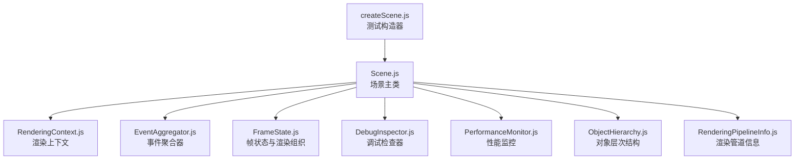
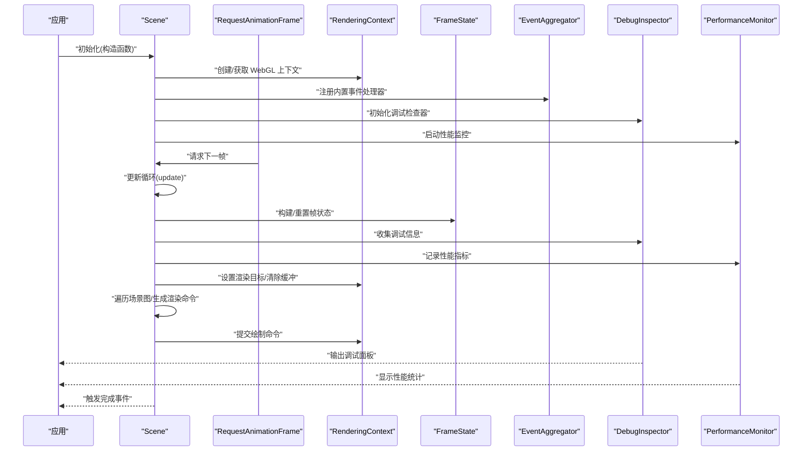
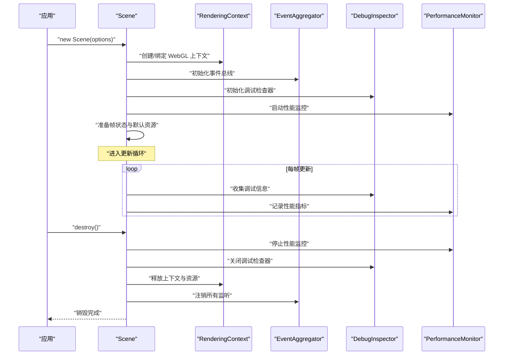
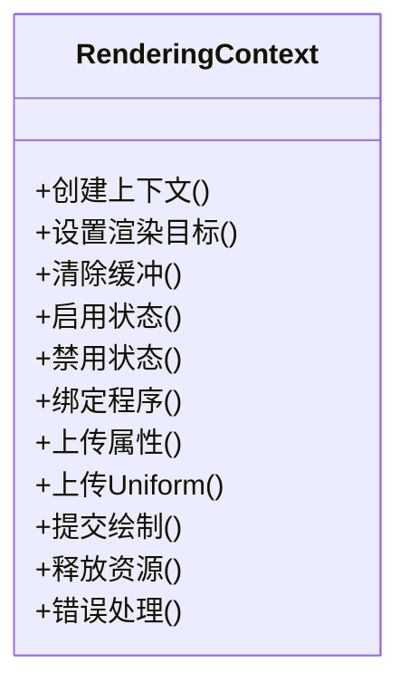
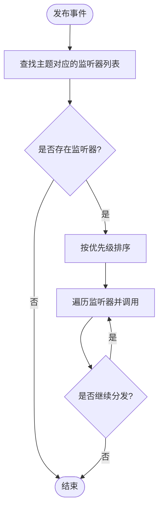
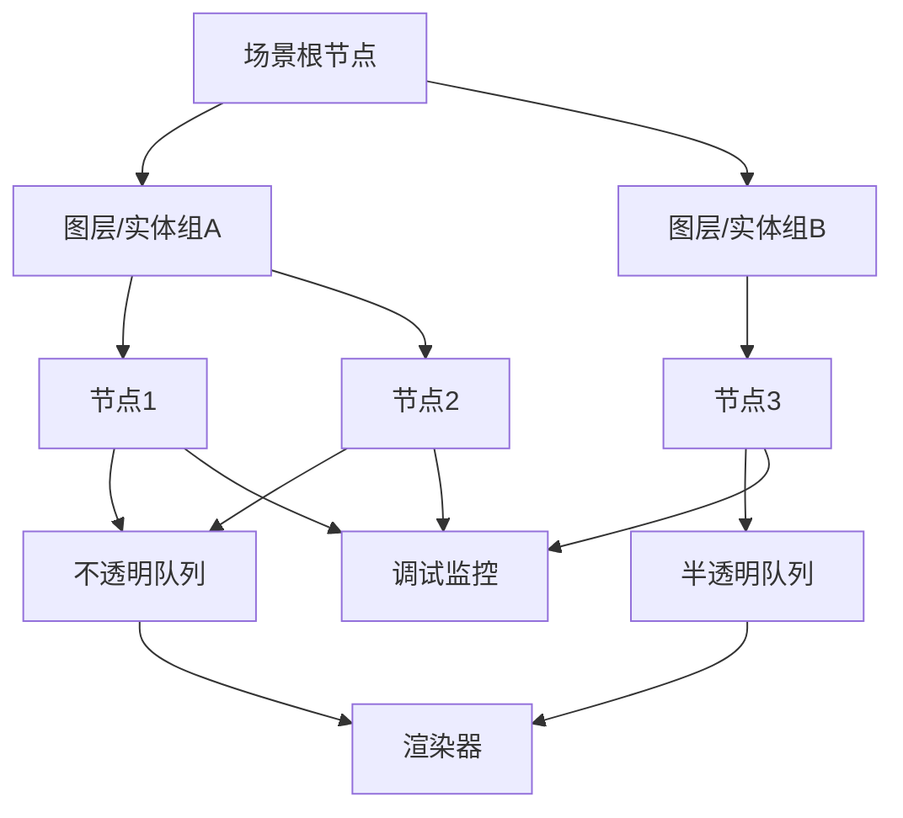
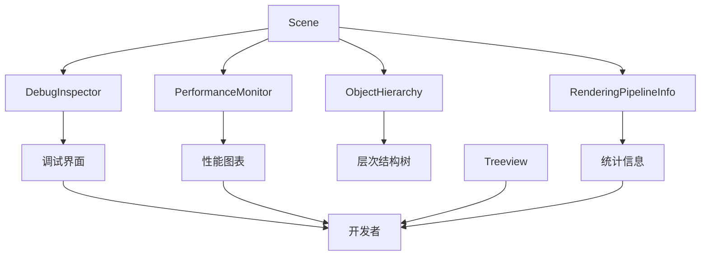
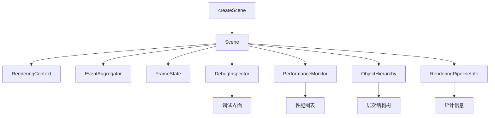

# 场景核心架构

<cite>
**本文引用的文件**   
- [Scene.js](file://Source/Core/Scene.js)
- [RenderingContext.js](file://Source/Renderer/RenderingContext.js)
- [EventAggregator.js](file://Source/Core/EventAggregator.js)
- [FrameState.js](file://Source/Scene/FrameState.js)
- [createScene.js](file://Specs/createScene.js)
- [DebugInspector.js](file://Source/Scene/DebugInspector.js)
- [PerformanceMonitor.js](file://Source/Scene/PerformanceMonitor.js)
- [ObjectHierarchy.js](file://Source/Scene/ObjectHierarchy.js)
- [RenderingPipelineInfo.js](file://Source/Scene/RenderingPipelineInfo.js)
</cite>

## 更新摘要
**变更内容**   
- 新增调试基础设施章节，详细介绍调试检查器(Debug Inspector)的实现与使用
- 扩展性能监控模块，包含帧率统计、内存使用分析和渲染管线信息
- 增强对象层次结构可视化功能，支持场景图实时查看和节点状态监控
- 完善渲染管道信息收集，提供绘制调用统计和着色器使用情况分析
- 更新故障排查指南，集成新的调试工具和诊断方法

## 目录
1. [简介](#简介)
2. [项目结构](#项目结构)
3. [核心组件](#核心组件)
4. [架构总览](#架构总览)
5. [详细组件分析](#详细组件分析)
6. [调试基础设施](#调试基础设施)
7. [依赖关系分析](#依赖关系分析)
8. [性能考量](#性能考量)
9. [故障排查指南](#故障排查指南)
10. [结论](#结论)
11. [附录：示例与最佳实践](#附录示例与最佳实践)

## 简介
本技术文档聚焦于 Cesium 渲染引擎中的"场景"子系统，围绕 Scene 类的设计模式与生命周期管理展开，深入解析渲染上下文（RenderingContext）的创建、状态管理与资源分配策略，阐述事件聚合器（EventAggregator）的实现原理与事件分发机制，并说明场景图结构、节点管理与渲染队列的组织方式。同时提供场景配置选项的说明与最佳实践，以及基于源码路径的实际使用指引。**最新更新**包含了完整的调试基础设施，通过调试检查器实现场景状态可视化、性能指标监控、对象层次结构展示和渲染管道信息分析。

## 项目结构
Cesium 的核心渲染能力位于 Source 目录下，其中与场景相关的核心模块包括：
- 场景入口与主循环：Source/Core/Scene.js
- 渲染上下文封装：Source/Renderer/RenderingContext.js
- 事件系统：Source/Core/EventAggregator.js
- 帧状态与渲染组织：Source/Scene/FrameState.js
- 测试与示例构造：Specs/createScene.js
- **新增** 调试基础设施：Source/Scene/DebugInspector.js
- **新增** 性能监控：Source/Scene/PerformanceMonitor.js
- **新增** 对象层次结构：Source/Scene/ObjectHierarchy.js
- **新增** 渲染管道信息：Source/Scene/RenderingPipelineInfo.js

**图表来源**
- [Scene.js](file://Source/Core/Scene.js)
- [RenderingContext.js](file://Source/Renderer/RenderingContext.js)
- [EventAggregator.js](file://Source/Core/EventAggregator.js)
- [FrameState.js](file://Source/Scene/FrameState.js)
- [createScene.js](file://Specs/createScene.js)
- [DebugInspector.js](file://Source/Scene/DebugInspector.js)
- [PerformanceMonitor.js](file://Source/Scene/PerformanceMonitor.js)
- [ObjectHierarchy.js](file://Source/Scene/ObjectHierarchy.js)
- [RenderingPipelineInfo.js](file://Source/Scene/RenderingPipelineInfo.js)

**章节来源**
- [Scene.js](file://Source/Core/Scene.js)
- [RenderingContext.js](file://Source/Renderer/RenderingContext.js)
- [EventAggregator.js](file://Source/Core/EventAggregator.js)
- [FrameState.js](file://Source/Scene/FrameState.js)
- [createScene.js](file://Specs/createScene.js)
- [DebugInspector.js](file://Source/Scene/DebugInspector.js)
- [PerformanceMonitor.js](file://Source/Scene/PerformanceMonitor.js)
- [ObjectHierarchy.js](file://Source/Scene/ObjectHierarchy.js)
- [RenderingPipelineInfo.js](file://Source/Scene/RenderingPipelineInfo.js)

## 核心组件
本节对 Scene、RenderingContext、EventAggregator、FrameState 的职责与交互进行概述，为后续深入分析奠定基础。

- Scene：场景的顶层协调者，负责初始化、更新循环、销毁；维护相机、光照、地形、影像、实体等高层对象；驱动渲染管线。
- RenderingContext：WebGL 上下文的封装，负责上下文创建、状态切换、资源分配与释放、错误处理。
- EventAggregator：轻量级事件总线，支持订阅/发布、批量分发与优先级控制。
- FrameState：每帧的状态容器，包含视锥体、深度范围、渲染目标、命令队列等，用于在帧内传递上下文信息。
- **新增** DebugInspector：调试检查器，提供场景状态可视化、性能指标收集和渲染管道信息展示。
- **新增** PerformanceMonitor：性能监控器，实时统计帧率、内存使用、绘制调用次数等关键指标。
- **新增** ObjectHierarchy：对象层次结构管理器，支持场景图的树形展示和节点状态监控。
- **新增** RenderingPipelineInfo：渲染管道信息收集器，记录着色器使用情况、纹理绑定和绘制调用统计。

**章节来源**
- [Scene.js](file://Source/Core/Scene.js)
- [RenderingContext.js](file://Source/Renderer/RenderingContext.js)
- [EventAggregator.js](file://Source/Core/EventAggregator.js)
- [FrameState.js](file://Source/Scene/FrameState.js)
- [DebugInspector.js](file://Source/Scene/DebugInspector.js)
- [PerformanceMonitor.js](file://Source/Scene/PerformanceMonitor.js)
- [ObjectHierarchy.js](file://Source/Scene/ObjectHierarchy.js)
- [RenderingPipelineInfo.js](file://Source/Scene/RenderingPipelineInfo.js)

## 架构总览
下图展示了场景在单帧内的主要调用链路与数据流，从外部驱动到内部渲染组织的整体流程，**新增了调试基础设施的集成**。

**图表来源**
- [Scene.js](file://Source/Core/Scene.js)
- [RenderingContext.js](file://Source/Renderer/RenderingContext.js)
- [EventAggregator.js](file://Source/Core/EventAggregator.js)
- [FrameState.js](file://Source/Scene/FrameState.js)
- [DebugInspector.js](file://Source/Scene/DebugInspector.js)
- [PerformanceMonitor.js](file://Source/Scene/PerformanceMonitor.js)

## 详细组件分析

### Scene 类：设计模式与生命周期
- 设计模式
  - 组合与委托：Scene 组合相机、光源、地形、影像、实体等子系统，并将具体渲染任务委托给底层渲染器与命令队列。
  - 观察者模式：通过 EventAggregator 实现松耦合的事件通知，如帧开始/结束、资源加载完成等。
  - 工厂/构建器：通过配置对象构建场景实例，统一参数校验与默认值填充。
- 生命周期
  - 初始化：创建渲染上下文、初始化事件系统、准备帧状态、注册动画循环、**启动调试基础设施**。
  - 更新循环：每帧更新相机与时间、重建视锥体、收集渲染命令、提交绘制、**收集调试信息和性能指标**。
  - 销毁：释放 WebGL 资源、移除事件监听、停止动画循环、清理帧状态、**关闭调试检查和性能监控**。
- 关键职责
  - 管理全局渲染状态（深度、混合、剔除等）。
  - 组织场景图与渲染队列，确保正确的绘制顺序与批处理。
  - 暴露 API 供上层应用添加/移除实体、图层、模型等。
  - **集成调试工具，提供运行时诊断和性能分析能力**。

**章节来源**
- [Scene.js](file://Source/Core/Scene.js)
- [DebugInspector.js](file://Source/Scene/DebugInspector.js)
- [PerformanceMonitor.js](file://Source/Scene/PerformanceMonitor.js)

#### 场景生命周期时序图

**图表来源**
- [Scene.js](file://Source/Core/Scene.js)
- [RenderingContext.js](file://Source/Renderer/RenderingContext.js)
- [EventAggregator.js](file://Source/Core/EventAggregator.js)
- [DebugInspector.js](file://Source/Scene/DebugInspector.js)
- [PerformanceMonitor.js](file://Source/Scene/PerformanceMonitor.js)

### RenderingContext：渲染上下文管理
- 上下文创建与选择
  - 根据配置选择 WebGL/WebGL2，处理兼容性降级与特性检测。
  - 捕获上下文丢失与恢复事件，保证稳定性。
- 状态管理
  - 统一管理深度测试、混合、剔除、模板测试等状态切换。
  - 提供统一的着色器程序绑定与属性/Uniform 设置接口。
- 资源分配与释放
  - 纹理、缓冲区、渲染目标的创建、复用与释放。
  - 提供资源容量监控与告警，避免内存泄漏。
- 错误处理
  - 包装 WebGL 错误码，转换为可读的错误信息。
  - 在调试模式下输出详细的上下文状态快照。

**章节来源**
- [RenderingContext.js](file://Source/Renderer/RenderingContext.js)

#### 渲染上下文类图

**图表来源**
- [RenderingContext.js](file://Source/Renderer/RenderingContext.js)

### EventAggregator：事件聚合器与分发机制
- 实现原理
  - 基于主题（topic）的键值映射，将事件名与监听器列表关联。
  - 支持一次性监听、带优先级的监听器排序、批量分发。
- 分发机制
  - 发布时按优先级依次调用监听器，允许监听器中断或修改事件上下文。
  - 提供节流/去抖工具方法，降低高频事件带来的开销。
- 典型用途
  - 场景级事件：帧开始/结束、相机变化、资源加载进度。
  - 用户交互事件：点击、拖拽、滚轮等输入事件的统一派发。
  - **调试事件：性能指标收集、渲染状态变化、错误报告等**。

**章节来源**
- [EventAggregator.js](file://Source/Core/EventAggregator.js)

#### 事件分发流程图

**图表来源**
- [EventAggregator.js](file://Source/Core/EventAggregator.js)

### 场景图结构与渲染队列组织
- 场景图
  - 以根节点为起点，组织实体、模型、点云、地形、影像等子节点。
  - 每个节点维护变换矩阵、可见性、LOD、裁剪体积等信息。
- 渲染队列
  - 按渲染阶段划分队列（不透明、半透明、后处理等），确保正确绘制顺序。
  - 同一队列内按材质/程序分组，减少状态切换，提升批处理能力。
- 帧状态（FrameState）
  - 每帧构建视锥体、深度范围、渲染目标、命令集合。
  - 作为跨子系统的数据载体，避免重复计算与状态不一致。
- **调试集成**
  - 支持场景图的实时可视化和节点状态监控。
  - 提供渲染队列的详细统计和分析信息。

**章节来源**
- [Scene.js](file://Source/Core/Scene.js)
- [FrameState.js](file://Source/Scene/FrameState.js)
- [ObjectHierarchy.js](file://Source/Scene/ObjectHierarchy.js)

#### 场景图与渲染队列关系图

**图表来源**
- [Scene.js](file://Source/Core/Scene.js)
- [FrameState.js](file://Source/Scene/FrameState.js)
- [ObjectHierarchy.js](file://Source/Scene/ObjectHierarchy.js)

## 调试基础设施

### DebugInspector：调试检查器
调试检查器是 Cesium 场景系统的核心调试工具，提供全面的运行时诊断和可视化功能。

- 核心功能
  - 场景状态可视化：实时显示场景图结构、节点属性和变换矩阵。
  - 性能指标监控：收集帧率、内存使用、绘制调用次数等关键指标。
  - 渲染管道信息：记录着色器使用情况、纹理绑定和渲染状态。
  - 错误诊断：捕获渲染错误、警告信息和异常堆栈。
- 集成方式
  - 通过 Scene 配置选项启用：`debug: true`
  - 支持独立窗口或内嵌面板显示
  - 提供 API 进行自定义调试信息的输出
- 性能影响
  - 可选的性能优化模式，减少调试开销
  - 按需收集信息，避免不必要的性能损耗

**章节来源**
- [DebugInspector.js](file://Source/Scene/DebugInspector.js)

### PerformanceMonitor：性能监控器
性能监控器专注于收集和分析渲染性能相关的关键指标。

- 监控指标
  - 帧率统计：FPS、帧时间分布、卡顿检测
  - 内存使用：GPU 内存、CPU 内存、纹理内存占用
  - 渲染统计：绘制调用次数、顶点数量、三角形数量
  - 资源加载：纹理加载时间、模型解析耗时、网络请求统计
- 数据分析
  - 实时图表显示趋势变化
  - 性能瓶颈识别和优化建议
  - 历史数据导出和分析报告
- 集成接口
  - 事件驱动的指标收集机制
  - 自定义监控点的注册和查询
  - 与其他调试工具的协同工作

**章节来源**
- [PerformanceMonitor.js](file://Source/Scene/PerformanceMonitor.js)

### ObjectHierarchy：对象层次结构管理器
对象层次结构管理器提供场景图的树形可视化和节点状态监控。

- 层次结构展示
  - 动态生成的场景图树形视图
  - 节点属性的实时编辑和修改
  - 父子关系的可视化连接
- 节点状态监控
  - 可见性、变换矩阵、LOD 状态的实时监控
  - 碰撞检测和裁剪体积的可视化
  - 材质和着色器状态的显示
- 交互功能
  - 节点的搜索和过滤
  - 批量操作和属性同步
  - 与渲染视图的联动高亮

**章节来源**
- [ObjectHierarchy.js](file://Source/Scene/ObjectHierarchy.js)

### RenderingPipelineInfo：渲染管道信息收集器
渲染管道信息收集器负责记录和统计渲染过程中的各种信息。

- 信息收集
  - 着色器编译和使用统计
  - 纹理绑定和采样信息
  - 渲染状态切换和批次合并
  - 绘制调用的详细信息
- 统计分析
  - 渲染瓶颈识别和优化建议
  - 资源使用效率分析
  - 不同渲染阶段的性能对比
- 调试输出
  - 结构化的调试日志
  - 可视化的渲染管道图
  - 性能热点的自动检测

**章节来源**
- [RenderingPipelineInfo.js](file://Source/Scene/RenderingPipelineInfo.js)

#### 调试基础设施架构图

**图表来源**
- [DebugInspector.js](file://Source/Scene/DebugInspector.js)
- [PerformanceMonitor.js](file://Source/Scene/PerformanceMonitor.js)
- [ObjectHierarchy.js](file://Source/Scene/ObjectHierarchy.js)
- [RenderingPipelineInfo.js](file://Source/Scene/RenderingPipelineInfo.js)

## 依赖关系分析
- 直接依赖
  - Scene 依赖 RenderingContext 进行底层渲染操作。
  - Scene 依赖 EventAggregator 进行事件通信。
  - Scene 依赖 FrameState 组织每帧的渲染数据。
  - **Scene 依赖调试基础设施组件进行运行时诊断**。
- 间接依赖
  - 上层应用通过 createScene 等辅助函数创建场景实例，注入配置与宿主元素。
  - **调试工具通过事件系统与场景进行解耦通信**。
- 潜在环依赖
  - 通过事件解耦与分层职责，避免 Scene 与子系统之间的循环引用。
  - **调试组件采用观察者模式，避免与场景的直接耦合**。

**图表来源**
- [Scene.js](file://Source/Core/Scene.js)
- [RenderingContext.js](file://Source/Renderer/RenderingContext.js)
- [EventAggregator.js](file://Source/Core/EventAggregator.js)
- [FrameState.js](file://Source/Scene/FrameState.js)
- [createScene.js](file://Specs/createScene.js)
- [DebugInspector.js](file://Source/Scene/DebugInspector.js)
- [PerformanceMonitor.js](file://Source/Scene/PerformanceMonitor.js)
- [ObjectHierarchy.js](file://Source/Scene/ObjectHierarchy.js)
- [RenderingPipelineInfo.js](file://Source/Scene/RenderingPipelineInfo.js)

**章节来源**
- [Scene.js](file://Source/Core/Scene.js)
- [RenderingContext.js](file://Source/Renderer/RenderingContext.js)
- [EventAggregator.js](file://Source/Core/EventAggregator.js)
- [FrameState.js](file://Source/Scene/FrameState.js)
- [createScene.js](file://Specs/createScene.js)
- [DebugInspector.js](file://Source/Scene/DebugInspector.js)
- [PerformanceMonitor.js](file://Source/Scene/PerformanceMonitor.js)
- [ObjectHierarchy.js](file://Source/Scene/ObjectHierarchy.js)
- [RenderingPipelineInfo.js](file://Source/Scene/RenderingPipelineInfo.js)

## 性能考量
- 减少状态切换
  - 合并相同材质/程序的绘制批次，降低 WebGL 状态切换成本。
- 合理组织场景图
  - 使用层级与分组控制可见性与裁剪，避免不必要的节点更新。
- 帧状态复用
  - 复用 FrameState 对象与中间缓冲区，减少 GC 压力。
- 事件优化
  - 对高频事件使用节流/去抖，避免阻塞主线程。
- 资源管理
  - 及时释放不再使用的纹理、缓冲区与模型资源，防止内存泄漏。
- **调试性能优化**
  - 调试模式下的性能开销控制，支持按需启用功能。
  - 性能监控的异步处理和批量上报。
  - 调试信息的智能缓存和增量更新。

**章节来源**
- [PerformanceMonitor.js](file://Source/Scene/PerformanceMonitor.js)
- [DebugInspector.js](file://Source/Scene/DebugInspector.js)

## 故障排查指南
- 常见问题
  - WebGL 上下文丢失：检查浏览器兼容性与硬件加速，确认上下文恢复逻辑。
  - 渲染异常（黑屏/闪烁）：核对视锥体与深度范围设置，检查剔除与混合状态。
  - 事件未触发：确认事件主题名称一致，监听器未被提前移除。
  - **性能问题：使用性能监控器分析帧率瓶颈和资源占用**。
  - **内存泄漏：通过调试检查器的内存监控功能定位泄漏源**。
- 定位手段
  - 开启调试模式，查看上下文状态快照与错误日志。
  - 使用最小化场景复现问题，逐步排除子系统影响。
  - 针对事件问题，打印事件分发链路，验证优先级与中断逻辑。
  - **利用调试检查器的场景图可视化功能，快速定位渲染问题**。
  - **通过性能监控的历史数据，分析性能退化趋势**。
- **调试工具使用**
  - 启用调试检查器：在 Scene 配置中设置 `debug: true`
  - 查看性能图表：访问 `/performance` 路由或使用 API 获取数据
  - 分析渲染管道：使用渲染管道信息收集器生成分析报告
  - 监控对象层次：通过层次结构管理器实时查看场景图状态

**章节来源**
- [RenderingContext.js](file://Source/Renderer/RenderingContext.js)
- [EventAggregator.js](file://Source/Core/EventAggregator.js)
- [Scene.js](file://Source/Core/Scene.js)
- [DebugInspector.js](file://Source/Scene/DebugInspector.js)
- [PerformanceMonitor.js](file://Source/Scene/PerformanceMonitor.js)

## 结论
Scene 作为 Cesium 渲染引擎的核心协调者，通过清晰的职责划分与松耦合的事件机制，实现了高内聚、低耦合的场景管理。结合 RenderingContext 的稳健上下文管理、EventAggregator 的高效事件分发与 FrameState 的帧内状态组织，场景子系统能够在复杂三维场景中保持高性能与可维护性。**最新的调试基础设施进一步增强了开发体验和问题诊断能力**，通过调试检查器、性能监控器、对象层次结构管理器和渲染管道信息收集器，为开发者提供了全面的运行时诊断工具。遵循本文的最佳实践与排障建议，有助于在实际项目中稳定高效地使用场景能力，并利用强大的调试工具快速定位和解决性能问题。

## 附录：示例与最佳实践

### 场景创建与基本操作（基于源码路径）
- 参考测试构造器，了解如何传入配置项、绑定宿主元素、启动更新循环与销毁场景。
  - 参考路径：[createScene.js](file://Specs/createScene.js)
- 常见步骤
  - 创建场景实例并传入配置对象。
  - 注册必要的监听器（如帧事件、相机事件）。
  - 在更新循环中执行必要操作（如移动相机、添加/移除实体）。
  - 在页面卸载或场景切换时调用销毁方法，释放资源。
- **调试模式启用**
  - 在配置中添加 `debug: true` 启用调试检查器
  - 使用 `scene.debug.showPerformanceMonitor()` 显示性能监控面板
  - 通过 `scene.debug.inspectObject(object)` 检查特定对象状态

**章节来源**
- [createScene.js](file://Specs/createScene.js)
- [DebugInspector.js](file://Source/Scene/DebugInspector.js)
- [PerformanceMonitor.js](file://Source/Scene/PerformanceMonitor.js)

### 场景配置选项与最佳实践
- 渲染相关
  - 选择 WebGL/WebGL2，依据目标平台与功能需求权衡。
  - 合理设置抗锯齿、阴影、雾效等开关，平衡画质与性能。
- 资源相关
  - 预加载常用纹理与模型，避免运行时卡顿。
  - 使用纹理压缩与 Draco 压缩格式，减小网络传输与内存占用。
- 事件相关
  - 对高频事件采用节流/去抖，避免主线程阻塞。
  - 将业务逻辑与渲染逻辑解耦，通过事件桥接。
- **调试相关**
  - 开发环境启用完整调试功能，生产环境仅保留必要的性能监控。
  - 合理使用调试检查器的各个模块，避免不必要的性能开销。
  - 利用性能监控数据进行持续的性能优化和回归测试。

**章节来源**
- [DebugInspector.js](file://Source/Scene/DebugInspector.js)
- [PerformanceMonitor.js](file://Source/Scene/PerformanceMonitor.js)

### 调试工具使用指南
- **调试检查器**
  - 启用：`scene.debug.enabled = true`
  - 查看场景图：`scene.debug.showHierarchy()`
  - 检查对象：`scene.debug.inspectObject(object)`
  - 查看渲染状态：`scene.debug.showRenderInfo()`
- **性能监控**
  - 启动监控：`scene.performance.startMonitoring()`
  - 查看统计数据：`scene.performance.getStatistics()`
  - 导出数据：`scene.performance.exportData()`
  - 停止监控：`scene.performance.stopMonitoring()`
- **对象层次结构**
  - 显示树形视图：`scene.hierarchy.showTreeView()`
  - 搜索节点：`scene.hierarchy.search(keyword)`
  - 监控节点状态：`scene.hierarchy.monitorNode(node)`
- **渲染管道分析**
  - 收集管道信息：`scene.pipeline.collectInfo()`
  - 生成报告：`scene.pipeline.generateReport()`
  - 分析瓶颈：`scene.pipeline.analyzeBottlenecks()`

**章节来源**
- [DebugInspector.js](file://Source/Scene/DebugInspector.js)
- [PerformanceMonitor.js](file://Source/Scene/PerformanceMonitor.js)
- [ObjectHierarchy.js](file://Source/Scene/ObjectHierarchy.js)
- [RenderingPipelineInfo.js](file://Source/Scene/RenderingPipelineInfo.js)