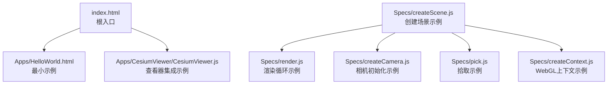
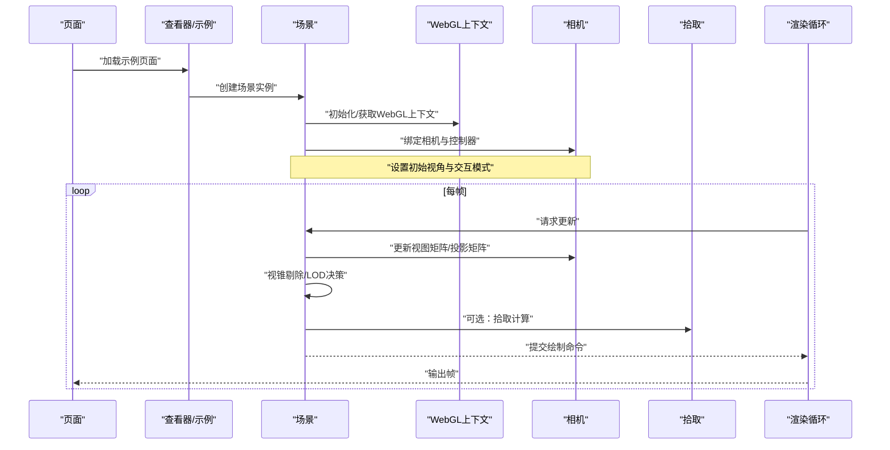
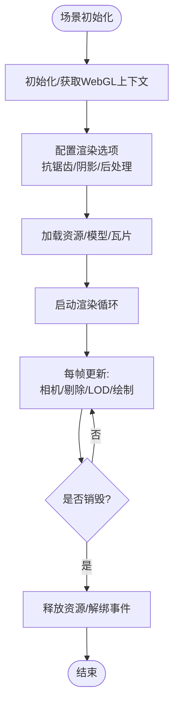
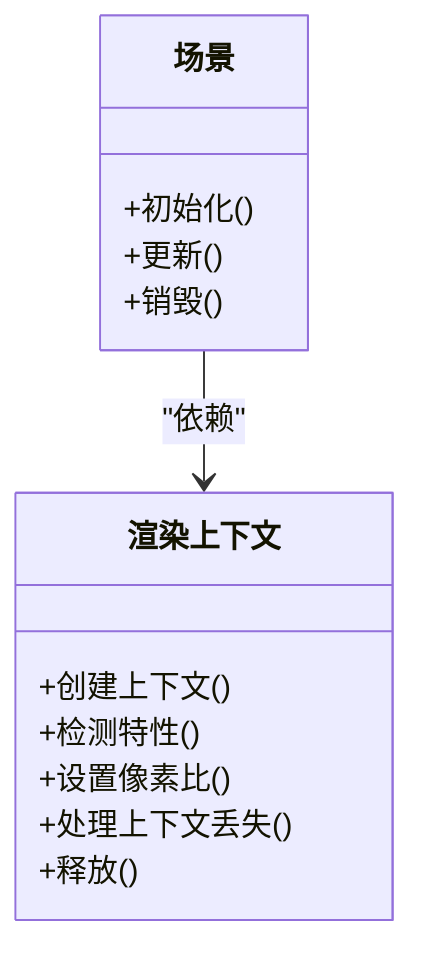
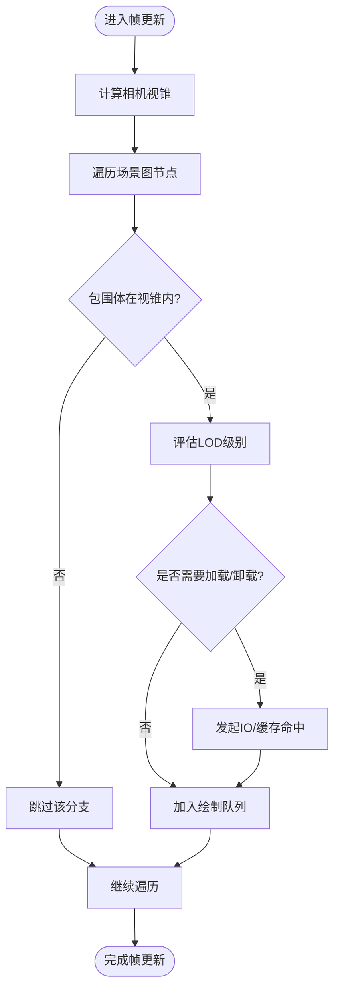
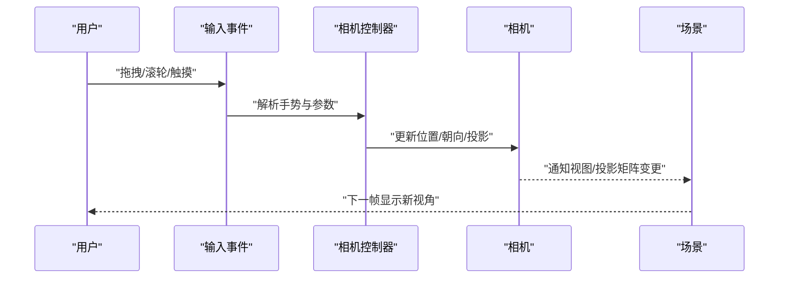
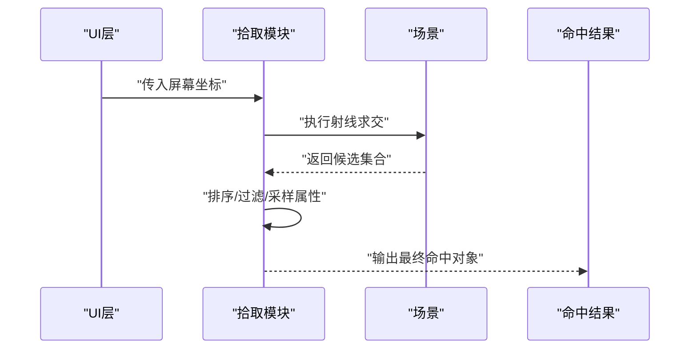
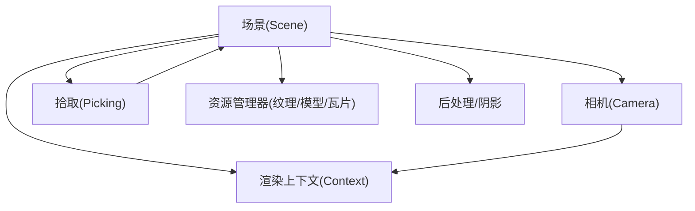

# 场景管理

<cite>
**本文引用的文件**   
- [index.html](file://index.html)
- [HelloWorld.html](file://Apps/HelloWorld.html)
- [CesiumViewer.js](file://Apps/CesiumViewer/CesiumViewer.js)
- [createScene.js](file://Specs/createScene.js)
- [createCamera.js](file://Specs/createCamera.js)
- [pick.js](file://Specs/pick.js)
- [render.js](file://Specs/render.js)
- [createContext.js](file://Specs/createContext.js)
</cite>

## 目录
1. [简介](#简介)
2. [项目结构](#项目结构)
3. [核心组件](#核心组件)
4. [架构总览](#架构总览)
5. [详细组件分析](#详细组件分析)
6. [依赖关系分析](#依赖关系分析)
7. [性能考虑](#性能考虑)
8. [故障排查指南](#故障排查指南)
9. [结论](#结论)
10. [附录](#附录)

## 简介
本技术文档聚焦于 Cesium 的“场景管理系统”，围绕 Scene 类的架构设计与生命周期、渲染上下文管理、视锥剔除与 LOD 策略、相机控制与交互、拾取系统与用户交互处理，以及性能优化最佳实践进行系统化阐述。文档同时提供基于仓库中示例与测试脚本的实际使用路径，帮助读者快速落地场景配置、相机控制与交互处理的实现方法。

## 项目结构
仓库采用多包组织方式：
- Source：引擎源码（未在本仓库直接展示）
- Apps：应用示例与演示页面
- Specs：测试与示例脚本，包含创建场景、相机、渲染、拾取等关键流程
- Documentation：开发者文档与规范
- Tools：构建与文档生成工具链

为便于理解场景管理相关能力，以下图示给出与本主题密切相关的入口与示例位置。

图表来源
- [index.html:1-200](file://index.html#L1-L200)
- [HelloWorld.html:1-200](file://Apps/HelloWorld.html#L1-L200)
- [CesiumViewer.js:1-200](file://Apps/CesiumViewer/CesiumViewer.js#L1-L200)
- [createScene.js:1-200](file://Specs/createScene.js#L1-L200)
- [render.js:1-200](file://Specs/render.js#L1-L200)
- [createCamera.js:1-200](file://Specs/createCamera.js#L1-L200)
- [pick.js:1-200](file://Specs/pick.js#L1-L200)
- [createContext.js:1-200](file://Specs/createContext.js#L1-L200)

章节来源
- [index.html:1-200](file://index.html#L1-L200)
- [HelloWorld.html:1-200](file://Apps/HelloWorld.html#L1-L200)
- [CesiumViewer.js:1-200](file://Apps/CesiumViewer/CesiumViewer.js#L1-L200)
- [createScene.js:1-200](file://Specs/createScene.js#L1-L200)
- [render.js:1-200](file://Specs/render.js#L1-L200)
- [createCamera.js:1-200](file://Specs/createCamera.js#L1-L200)
- [pick.js:1-200](file://Specs/pick.js#L1-L200)
- [createContext.js:1-200](file://Specs/createContext.js#L1-L200)

## 核心组件
本节从系统视角梳理与“场景管理”强相关的核心组件及其职责：
- 场景（Scene）：负责场景图、渲染管线、资源调度、LOD/视锥剔除、阴影、后处理等综合协调。
- 渲染上下文（WebGL Context）：封装底层 WebGL 状态与特性，提供设备能力探测与上下文切换。
- 相机（Camera）：提供多种视角模式（透视/正交）、导航交互（旋转、平移、缩放、飞行）。
- 拾取（Picking）：将屏幕坐标映射到三维空间，返回命中对象与属性。
- 渲染循环（Render Loop）：驱动帧更新、事件分发、绘制调用。

章节来源
- [createScene.js:1-200](file://Specs/createScene.js#L1-L200)
- [createContext.js:1-200](file://Specs/createContext.js#L1-L200)
- [createCamera.js:1-200](file://Specs/createCamera.js#L1-L200)
- [pick.js:1-200](file://Specs/pick.js#L1-L200)
- [render.js:1-200](file://Specs/render.js#L1-L200)

## 架构总览
下图展示了场景管理的整体架构与数据流，涵盖从页面加载到渲染输出的关键阶段，并标注了与具体文件的对应关系。

图表来源
- [HelloWorld.html:1-200](file://Apps/HelloWorld.html#L1-L200)
- [CesiumViewer.js:1-200](file://Apps/CesiumViewer/CesiumViewer.js#L1-L200)
- [createScene.js:1-200](file://Specs/createScene.js#L1-L200)
- [createContext.js:1-200](file://Specs/createContext.js#L1-L200)
- [createCamera.js:1-200](file://Specs/createCamera.js#L1-L200)
- [pick.js:1-200](file://Specs/pick.js#L1-L200)
- [render.js:1-200](file://Specs/render.js#L1-L200)

## 详细组件分析

### 场景（Scene）类与生命周期
- 设计要点
  - 场景作为全局协调者，维护场景图、资源池、渲染队列、时间步长、阴影、后处理等子系统。
  - 生命周期通常包括：构造与配置、上下文准备、资源加载、主循环更新、销毁与清理。
- 关键流程
  - 初始化：创建或复用 WebGL 上下文，配置抗锯齿、深度模板、阴影参数等。
  - 启动：注册事件监听（窗口大小变化、指针事件），启动渲染循环。
  - 更新：每帧执行视锥剔除、LOD 评估、几何合并、材质编译、绘制调用。
  - 销毁：释放纹理/缓冲、取消定时器、解绑事件。
- 代码片段路径
  - 场景创建与基础配置参考：[createScene.js:1-200](file://Specs/createScene.js#L1-L200)
  - 渲染循环驱动参考：[render.js:1-200](file://Specs/render.js#L1-L200)

图表来源
- [createScene.js:1-200](file://Specs/createScene.js#L1-L200)
- [render.js:1-200](file://Specs/render.js#L1-L200)

章节来源
- [createScene.js:1-200](file://Specs/createScene.js#L1-L200)
- [render.js:1-200](file://Specs/render.js#L1-L200)

### 渲染上下文管理
- 职责
  - 封装 WebGL 上下文创建、特性检测、上下文丢失恢复、像素比与尺寸适配。
- 关键点
  - 根据设备能力选择合适的光栅化与着色器特性。
  - 支持高 DPI 屏幕下的像素比调整，平衡清晰度与性能。
- 代码片段路径
  - 上下文创建与配置参考：[createContext.js:1-200](file://Specs/createContext.js#L1-L200)

图表来源
- [createContext.js:1-200](file://Specs/createContext.js#L1-L200)
- [createScene.js:1-200](file://Specs/createScene.js#L1-L200)

章节来源
- [createContext.js:1-200](file://Specs/createContext.js#L1-L200)

### 视锥剔除与 LOD 策略
- 视锥剔除
  - 基于相机视锥对场景图节点进行包围体测试，剔除不可见子树，减少绘制调用。
- LOD 策略
  - 依据距离、几何误差、内存预算动态选择不同细节级别的资源。
  - 结合瓦片集（如 3DTiles）的几何误差与层级结构进行渐进式加载。
- 典型流程
  - 计算相机视锥 → 遍历场景图 → 包围体相交测试 → 标记可见性 → 触发 LOD 评估 → 按需加载/卸载。
- 代码片段路径
  - 场景更新与渲染流程参考：[render.js:1-200](file://Specs/render.js#L1-L200)
  - 场景创建与配置参考：[createScene.js:1-200](file://Specs/createScene.js#L1-L200)

图表来源
- [render.js:1-200](file://Specs/render.js#L1-L200)
- [createScene.js:1-200](file://Specs/createScene.js#L1-L200)

章节来源
- [render.js:1-200](file://Specs/render.js#L1-L200)
- [createScene.js:1-200](file://Specs/createScene.js#L1-L200)

### 相机控制系统与导航交互
- 视角模式
  - 透视相机：模拟人眼视觉，适合大场景漫游。
  - 正交相机：保持平行投影，适合工程测量与对齐。
- 导航交互
  - 旋转、平移、缩放、飞行（flyTo）等常用操作。
  - 支持触摸、鼠标、键盘等多输入源。
- 代码片段路径
  - 相机初始化与基本控制参考：[createCamera.js:1-200](file://Specs/createCamera.js#L1-L200)
  - 示例页面集成参考：[HelloWorld.html:1-200](file://Apps/HelloWorld.html#L1-L200)、[CesiumViewer.js:1-200](file://Apps/CesiumViewer/CesiumViewer.js#L1-L200)

图表来源
- [createCamera.js:1-200](file://Specs/createCamera.js#L1-L200)
- [HelloWorld.html:1-200](file://Apps/HelloWorld.html#L1-L200)
- [CesiumViewer.js:1-200](file://Apps/CesiumViewer/CesiumViewer.js#L1-L200)

章节来源
- [createCamera.js:1-200](file://Specs/createCamera.js#L1-L200)
- [HelloWorld.html:1-200](file://Apps/HelloWorld.html#L1-L200)
- [CesiumViewer.js:1-200](file://Apps/CesiumViewer/CesiumViewer.js#L1-L200)

### 拾取系统与用户交互处理
- 拾取原理
  - 将屏幕坐标转换为射线，与场景中的几何体/实体进行相交测试，返回命中结果与属性。
- 常见用法
  - 点击选中要素、悬停高亮、右键菜单、信息面板联动。
- 代码片段路径
  - 拾取示例参考：[pick.js:1-200](file://Specs/pick.js#L1-L200)
  - 场景与渲染流程参考：[createScene.js:1-200](file://Specs/createScene.js#L1-L200)、[render.js:1-200](file://Specs/render.js#L1-L200)

图表来源
- [pick.js:1-200](file://Specs/pick.js#L1-L200)
- [createScene.js:1-200](file://Specs/createScene.js#L1-L200)

章节来源
- [pick.js:1-200](file://Specs/pick.js#L1-L200)
- [createScene.js:1-200](file://Specs/createScene.js#L1-L200)

### 实际示例与使用路径
- 最小可用示例
  - 打开最小示例页面以快速验证场景运行：[HelloWorld.html:1-200](file://Apps/HelloWorld.html#L1-L200)
- 查看器集成示例
  - 通过查看器示例了解场景与 UI 的集成方式：[CesiumViewer.js:1-200](file://Apps/CesiumViewer/CesiumViewer.js#L1-L200)
- 场景与渲染
  - 场景创建与渲染循环参考：[createScene.js:1-200](file://Specs/createScene.js#L1-L200)、[render.js:1-200](file://Specs/render.js#L1-L200)
- 相机与拾取
  - 相机初始化与拾取逻辑参考：[createCamera.js:1-200](file://Specs/createCamera.js#L1-L200)、[pick.js:1-200](file://Specs/pick.js#L1-L200)

章节来源
- [HelloWorld.html:1-200](file://Apps/HelloWorld.html#L1-L200)
- [CesiumViewer.js:1-200](file://Apps/CesiumViewer/CesiumViewer.js#L1-L200)
- [createScene.js:1-200](file://Specs/createScene.js#L1-L200)
- [render.js:1-200](file://Specs/render.js#L1-L200)
- [createCamera.js:1-200](file://Specs/createCamera.js#L1-L200)
- [pick.js:1-200](file://Specs/pick.js#L1-L200)

## 依赖关系分析
场景管理涉及多个子系统之间的协作，下图展示主要依赖关系与耦合点。

图表来源
- [createScene.js:1-200](file://Specs/createScene.js#L1-L200)
- [createContext.js:1-200](file://Specs/createContext.js#L1-L200)
- [createCamera.js:1-200](file://Specs/createCamera.js#L1-L200)
- [pick.js:1-200](file://Specs/pick.js#L1-L200)

章节来源
- [createScene.js:1-200](file://Specs/createScene.js#L1-L200)
- [createContext.js:1-200](file://Specs/createContext.js#L1-L200)
- [createCamera.js:1-200](file://Specs/createCamera.js#L1-L200)
- [pick.js:1-200](file://Specs/pick.js#L1-L200)

## 性能考虑
- 资源管理
  - 合理设置像素比，避免在高 DPI 设备上过度消耗带宽与显存。
  - 使用纹理压缩与 Draco/glTF 优化，降低网络传输与解码开销。
  - 利用瓦片集与隐式瓦片机制，按需加载与卸载，控制内存峰值。
- 渲染优化
  - 启用视锥剔除与遮挡剔除，减少无效绘制。
  - 合并静态几何体，减少 draw call；合理使用实例化渲染。
  - 谨慎开启阴影与后处理，根据目标平台调优质量与性能。
- 交互与拾取
  - 限制拾取范围与频率，仅在必要时执行射线求交。
  - 对大规模场景采用分层/分块拾取，避免单帧耗时过长。
- 相机与导航
  - 在移动设备上限制最大缩放速度，避免频繁重绘。
  - 使用平滑过渡与插值，提升用户体验的同时降低抖动。

[本节为通用指导，不直接分析具体文件]

## 故障排查指南
- 常见问题
  - 黑屏或无输出：检查 WebGL 上下文创建与特性支持。
  - 卡顿或掉帧：定位高负载绘制、过多纹理上传、频繁重建几何体。
  - 拾取不准确：确认坐标系转换、射线起点与方向、命中阈值设置。
- 排查步骤
  - 使用浏览器开发者工具观察 GPU/CPU 占用与网络请求。
  - 逐步关闭特效（阴影/后处理）与复杂模型，定位瓶颈。
  - 在关键路径添加日志，记录帧时长、绘制调用次数、内存增长。
- 参考路径
  - 上下文创建与错误处理参考：[createContext.js:1-200](file://Specs/createContext.js#L1-L200)
  - 渲染循环与异常捕获参考：[render.js:1-200](file://Specs/render.js#L1-L200)

章节来源
- [createContext.js:1-200](file://Specs/createContext.js#L1-L200)
- [render.js:1-200](file://Specs/render.js#L1-L200)

## 结论
场景管理是 Cesium 的核心中枢，贯穿渲染上下文、相机控制、视锥剔除与 LOD、拾取与交互等关键环节。通过合理的架构设计与资源/渲染优化策略，可以在保证视觉效果的同时获得稳定流畅的性能表现。建议在实际项目中结合示例与测试脚本的路径，逐步搭建与调优自己的场景系统。

## 附录
- 快速上手路径
  - 打开最小示例页面：[HelloWorld.html:1-200](file://Apps/HelloWorld.html#L1-L200)
  - 查看查看器集成示例：[CesiumViewer.js:1-200](file://Apps/CesiumViewer/CesiumViewer.js#L1-L200)
  - 学习场景与渲染流程：[createScene.js:1-200](file://Specs/createScene.js#L1-L200)、[render.js:1-200](file://Specs/render.js#L1-L200)
  - 掌握相机与拾取：[createCamera.js:1-200](file://Specs/createCamera.js#L1-L200)、[pick.js:1-200](file://Specs/pick.js#L1-L200)