# 场景管理架构

<cite>
**本文引用的文件**   
- [README.md](file://README.md)
- [package.json](file://package.json)
- [index.cjs](file://index.cjs)
- [server.js](file://server.js)
- [CesiumViewer.js](file://Apps/CesiumViewer/CesiumViewer.js)
- [index.html](file://Apps/CesiumViewer/index.html)
- [createScene.js](file://Specs/createScene.js)
- [createFrameState.js](file://Specs/createFrameState.js)
- [createCamera.js](file://Specs/createCamera.js)
- [cesium-app main.rs](file://cesiumrust/application/cesium-app/src/main.rs)
- [cesiumrust workspace src/lib.rs](file://cesiumrust/crates/workspace/src/lib.rs)
- [cesiumrust scene src/lib.rs](file://cesiumrust/domain/scene/src/lib.rs)
- [cesiumrust tileset src/lib.rs](file://cesiumrust/domain/tileset/src/lib.rs)
- [cesiumrust terrain src/lib.rs](file://cesiumrust/domain/terrain/src/lib.rs)
- [cesiumrust imagery src/lib.rs](file://cesiumrust/domain/imagery/src/lib.rs)
- [cesiumrust camera src/lib.rs](file://cesiumrust/domain/camera/src/lib.rs)
- [cesiumrust datasource src/lib.rs](file://cesiumrust/domain/datasource/src/lib.rs)
- [cesiumrust interaction src/lib.rs](file://cesiumrust/domain/interaction/src/lib.rs)
- [cesiumrust time src/lib.rs](file://cesiumrust/domain/time/src/lib.rs)
</cite>

## 更新摘要
**变更内容**   
- 新增属性类型系统章节，详细说明元数据属性的类型定义与验证机制
- 扩展轴定义系统，支持三维坐标轴的标准化表示与转换
- 引入作业调度器模块，优化异步任务管理与资源分配
- 增强元数据组件类型系统，支持更丰富的数据类型与嵌套结构
- 实现隐式可用性位流系统，提升瓦片可见性检测性能

## 目录
1. [简介](#简介)
2. [项目结构](#项目结构)
3. [核心组件](#核心组件)
4. [架构总览](#架构总览)
5. [详细组件分析](#详细组件分析)
6. [新增特性详解](#新增特性详解)
7. [依赖关系分析](#依赖关系分析)
8. [性能考量](#性能考量)
9. [故障排查指南](#故障排查指南)
10. [结论](#结论)
11. [附录](#附录)

## 简介
本文件聚焦于"场景管理架构"，围绕 CesiumJS 与 CesiumRust 双栈的协作方式，系统化梳理从应用入口、渲染循环、帧状态到领域层（地形、影像、瓦片集、相机、交互、时间等）的组织结构与数据流。文档面向不同技术背景的读者，提供分层说明、可视化图示与可操作的排障建议。

**更新** 本次更新重点介绍了增强的场景管理系统，包括属性类型系统、轴定义、作业调度器、元数据组件类型和隐式可用性位流系统等新特性。

## 项目结构
仓库采用多语言混合组织：
- JavaScript/TypeScript 侧：以 Apps 示例、Specs 测试、构建脚本与打包产物为主，负责浏览器端运行、示例演示与自动化测试。
- Rust 侧：以 cesiumrust 为根，按 domain/crates/adapters/ports 分层，承载地理空间计算、渲染适配与平台集成能力。

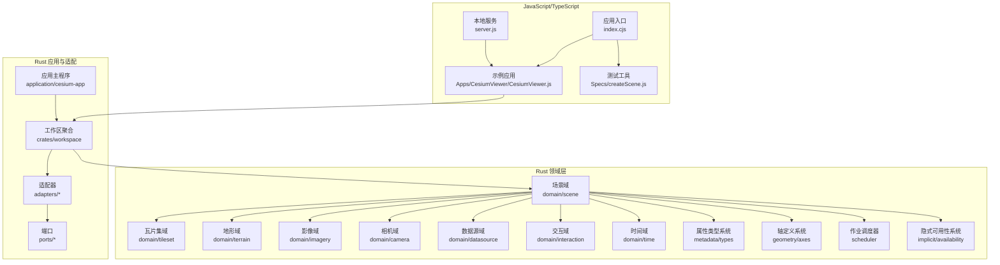

**图表来源**
- [index.cjs:1-200](file://index.cjs#L1-L200)
- [CesiumViewer.js:1-200](file://Apps/CesiumViewer/CesiumViewer.js#L1-L200)
- [server.js:1-200](file://server.js#L1-L200)
- [cesium-app main.rs:1-200](file://cesiumrust/application/cesium-app/src/main.rs#L1-L200)
- [cesiumrust workspace src/lib.rs:1-200](file://cesiumrust/crates/workspace/src/lib.rs#L1-L200)
- [cesiumrust scene src/lib.rs:1-200](file://cesiumrust/domain/scene/src/lib.rs#L1-L200)

**章节来源**
- [README.md:1-200](file://README.md#L1-L200)
- [package.json:1-200](file://package.json#L1-L200)
- [index.cjs:1-200](file://index.cjs#L1-L200)
- [server.js:1-200](file://server.js#L1-L200)

## 核心组件
- 场景管理器：协调渲染管线、资源加载、可见性裁剪、更新与绘制阶段，是场景管理的中枢。
- 瓦片集系统：基于 3D Tiles 的层次化内容组织与按需加载，驱动 LOD 与视锥裁剪。
- 地形与影像：提供高程与地表纹理，参与着色与几何细分。
- 相机与交互：控制视角变换与用户输入事件，驱动场景更新。
- 数据源与时序：统一接入外部数据（模型、矢量、点云等），并支持时间驱动的动态变化。
- **新增** 属性类型系统：定义元数据属性的类型规范与验证机制。
- **新增** 轴定义系统：标准化三维坐标轴表示与转换操作。
- **新增** 作业调度器：管理异步任务执行与资源分配。
- **新增** 隐式可用性系统：通过位流优化瓦片可见性检测。

**章节来源**
- [cesiumrust scene src/lib.rs:1-200](file://cesiumrust/domain/scene/src/lib.rs#L1-L200)
- [cesiumrust tileset src/lib.rs:1-200](file://cesiumrust/domain/tileset/src/lib.rs#L1-L200)
- [cesiumrust terrain src/lib.rs:1-200](file://cesiumrust/domain/terrain/src/lib.rs#L1-L200)
- [cesiumrust imagery src/lib.rs:1-200](file://cesiumrust/domain/imagery/src/lib.rs#L1-L200)
- [cesiumrust camera src/lib.rs:1-200](file://cesiumrust/domain/camera/src/lib.rs#L1-L200)
- [cesiumrust datasource src/lib.rs:1-200](file://cesiumrust/domain/datasource/src/lib.rs#L1-L200)
- [cesiumrust interaction src/lib.rs:1-200](file://cesiumrust/domain/interaction/src/lib.rs#L1-L200)
- [cesiumrust time src/lib.rs:1-200](file://cesiumrust/domain/time/src/lib.rs#L1-L200)

## 架构总览
下图展示从应用启动到渲染的一体化流程，涵盖 JS 入口、示例应用、Rust 工作区聚合、场景域与各子域之间的调用关系，以及新增的特性模块。

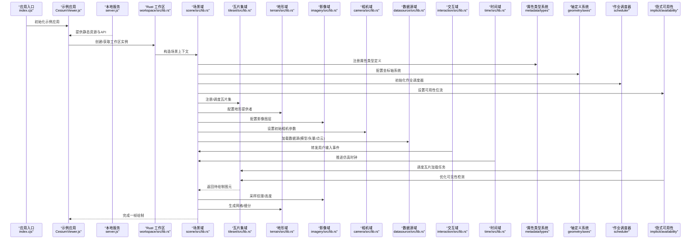

**图表来源**
- [index.cjs:1-200](file://index.cjs#L1-L200)
- [CesiumViewer.js:1-200](file://Apps/CesiumViewer/CesiumViewer.js#L1-L200)
- [server.js:1-200](file://server.js#L1-L200)
- [cesiumrust workspace src/lib.rs:1-200](file://cesiumrust/crates/workspace/src/lib.rs#L1-L200)
- [cesiumrust scene src/lib.rs:1-200](file://cesiumrust/domain/scene/src/lib.rs#L1-L200)
- [cesiumrust tileset src/lib.rs:1-200](file://cesiumrust/domain/tileset/src/lib.rs#L1-L200)
- [cesiumrust terrain src/lib.rs:1-200](file://cesiumrust/domain/terrain/src/lib.rs#L1-L200)
- [cesiumrust imagery src/lib.rs:1-200](file://cesiumrust/domain/imagery/src/lib.rs#L1-L200)
- [cesiumrust camera src/lib.rs:1-200](file://cesiumrust/domain/camera/src/lib.rs#L1-L200)
- [cesiumrust datasource src/lib.rs:1-200](file://cesiumrust/domain/datasource/src/lib.rs#L1-L200)
- [cesiumrust interaction src/lib.rs:1-200](file://cesiumrust/domain/interaction/src/lib.rs#L1-L200)
- [cesiumrust time src/lib.rs:1-200](file://cesiumrust/domain/time/src/lib.rs#L1-L200)

## 详细组件分析

### 场景域（Scene）
职责
- 维护渲染生命周期（准备、更新、绘制）。
- 协调各子域的数据就绪与依赖顺序。
- 管理全局状态（如帧状态、相机矩阵、光照、后处理）。
- **新增** 集成属性类型系统与轴定义系统。
- **新增** 管理作业调度器与隐式可用性系统。

关键交互
- 与瓦片集域进行可视性判定与增量加载。
- 与地形/影像域协同生成地表几何与材质。
- 接收交互域的事件并驱动相机更新。
- 根据时间域推进动画与属性插值。
- **新增** 通过属性类型系统验证元数据。
- **新增** 使用轴定义系统进行坐标转换。
- **新增** 通过作业调度器管理异步任务。
- **新增** 利用隐式可用性系统优化性能。

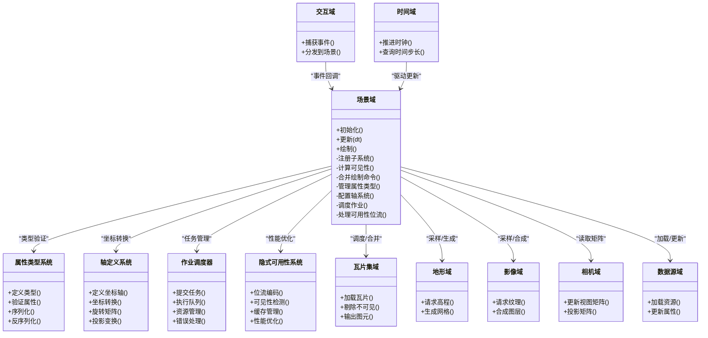

**图表来源**
- [cesiumrust scene src/lib.rs:1-200](file://cesiumrust/domain/scene/src/lib.rs#L1-L200)
- [cesiumrust tileset src/lib.rs:1-200](file://cesiumrust/domain/tileset/src/lib.rs#L1-L200)
- [cesiumrust terrain src/lib.rs:1-200](file://cesiumrust/domain/terrain/src/lib.rs#L1-L200)
- [cesiumrust imagery src/lib.rs:1-200](file://cesiumrust/domain/imagery/src/lib.rs#L1-L200)
- [cesiumrust camera src/lib.rs:1-200](file://cesiumrust/domain/camera/src/lib.rs#L1-L200)
- [cesiumrust datasource src/lib.rs:1-200](file://cesiumrust/domain/datasource/src/lib.rs#L1-L200)
- [cesiumrust interaction src/lib.rs:1-200](file://cesiumrust/domain/interaction/src/lib.rs#L1-L200)
- [cesiumrust time src/lib.rs:1-200](file://cesiumrust/domain/time/src/lib.rs#L1-L200)

**章节来源**
- [cesiumrust scene src/lib.rs:1-200](file://cesiumrust/domain/scene/src/lib.rs#L1-L200)

### 瓦片集系统（Tileset）
职责
- 解析与缓存 tileset.json 及层级结构。
- 基于视锥与几何误差进行 LOD 选择与按需加载。
- 将内容转换为可绘制的图元集合。
- **新增** 集成隐式可用性系统进行快速可见性检测。
- **新增** 通过作业调度器优化加载任务。

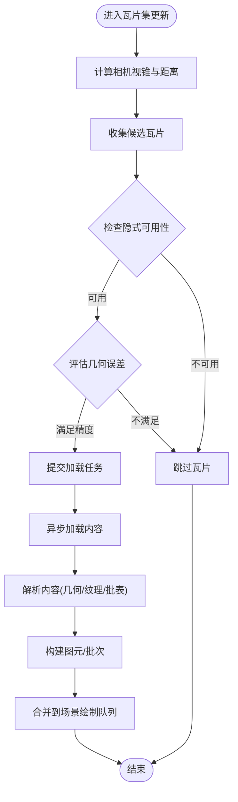

**图表来源**
- [cesiumrust tileset src/lib.rs:1-200](file://cesiumrust/domain/tileset/src/lib.rs#L1-L200)

**章节来源**
- [cesiumrust tileset src/lib.rs:1-200](file://cesiumrust/domain/tileset/src/lib.rs#L1-L200)

### 地形与影像（Terrain & Imagery）
职责
- 地形：提供高程采样与网格细分，支撑贴地与遮挡。
- 影像：提供地表纹理与多图层叠加，参与材质与光照。
- **新增** 通过轴定义系统进行坐标转换。
- **新增** 使用属性类型系统验证元数据。

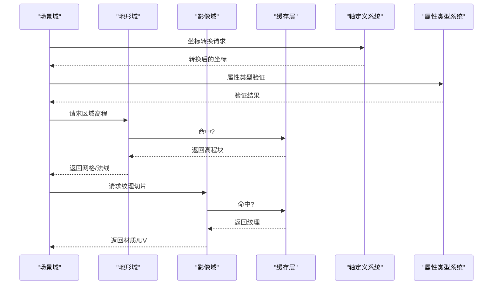

**图表来源**
- [cesiumrust terrain src/lib.rs:1-200](file://cesiumrust/domain/terrain/src/lib.rs#L1-L200)
- [cesiumrust imagery src/lib.rs:1-200](file://cesiumrust/domain/imagery/src/lib.rs#L1-L200)

**章节来源**
- [cesiumrust terrain src/lib.rs:1-200](file://cesiumrust/domain/terrain/src/lib.rs#L1-L200)
- [cesiumrust imagery src/lib.rs:1-200](file://cesiumrust/domain/imagery/src/lib.rs#L1-L200)

### 相机与交互（Camera & Interaction）
职责
- 相机：维护位置、朝向、投影参数，提供视图/投影矩阵。
- 交互：捕获鼠标/触控/键盘事件，转换为相机操作或场景查询。
- **新增** 使用轴定义系统进行坐标变换。

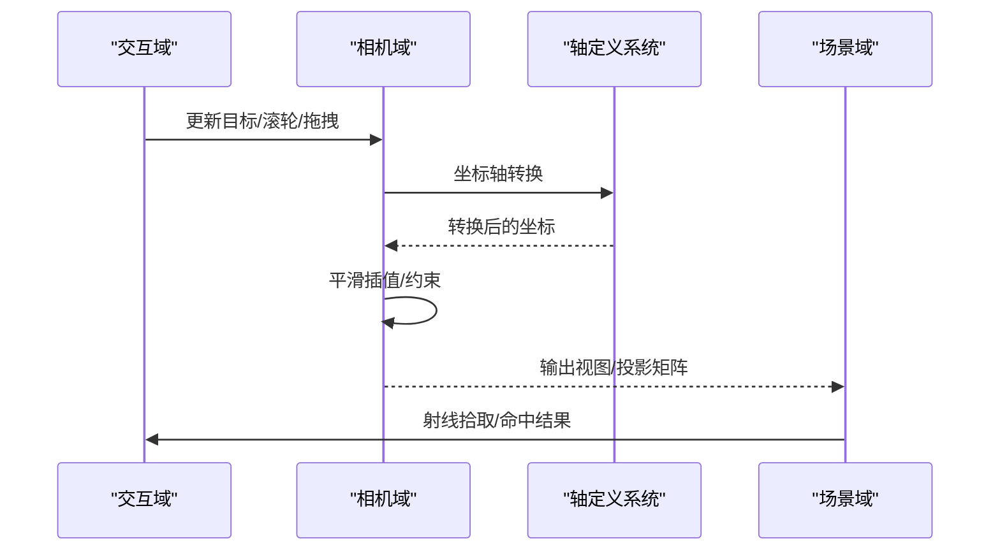

**图表来源**
- [cesiumrust camera src/lib.rs:1-200](file://cesiumrust/domain/camera/src/lib.rs#L1-L200)
- [cesiumrust interaction src/lib.rs:1-200](file://cesiumrust/domain/interaction/src/lib.rs#L1-L200)

**章节来源**
- [cesiumrust camera src/lib.rs:1-200](file://cesiumrust/domain/camera/src/lib.rs#L1-L200)
- [cesiumrust interaction src/lib.rs:1-200](file://cesiumrust/domain/interaction/src/lib.rs#L1-L200)

### 数据源与时序（DataSource & Time）
职责
- 数据源：统一加载模型、矢量、点云等资源，提供属性访问接口。
- 时间：驱动仿真时钟，支持时间相关属性的插值与回放。
- **新增** 通过属性类型系统验证数据格式。

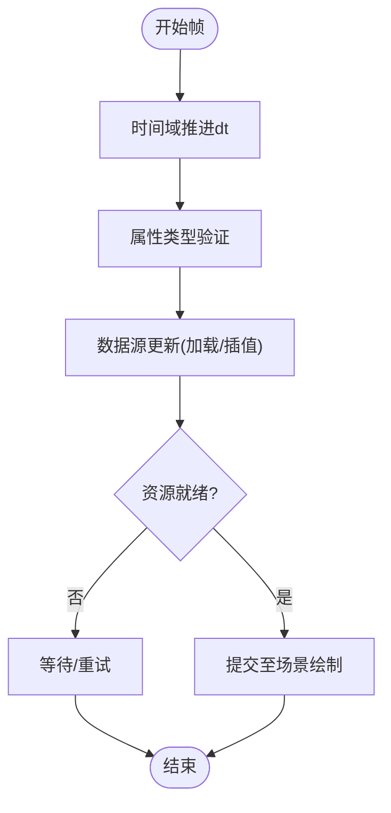

**图表来源**
- [cesiumrust datasource src/lib.rs:1-200](file://cesiumrust/domain/datasource/src/lib.rs#L1-L200)
- [cesiumrust time src/lib.rs:1-200](file://cesiumrust/domain/time/src/lib.rs#L1-L200)

**章节来源**
- [cesiumrust datasource src/lib.rs:1-200](file://cesiumrust/domain/datasource/src/lib.rs#L1-L200)
- [cesiumrust time src/lib.rs:1-200](file://cesiumrust/domain/time/src/lib.rs#L1-L200)

### 应用入口与示例（Index & CesiumViewer）
- index.cjs：作为顶层入口，负责环境初始化、模块装配与示例启动。
- CesiumViewer.js：封装典型使用模式（创建场景、添加图层、绑定交互、启动循环）。
- server.js：提供本地开发服务器，便于调试与联调。

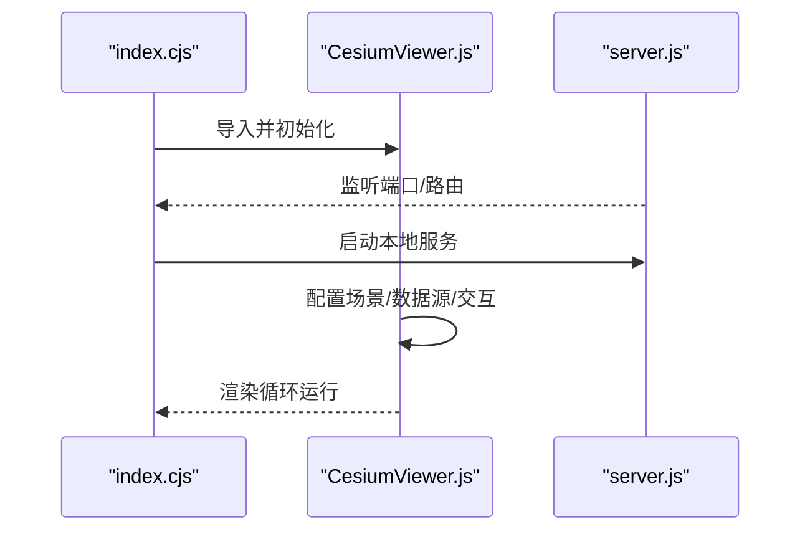

**图表来源**
- [index.cjs:1-200](file://index.cjs#L1-L200)
- [CesiumViewer.js:1-200](file://Apps/CesiumViewer/CesiumViewer.js#L1-L200)
- [server.js:1-200](file://server.js#L1-L200)

**章节来源**
- [index.cjs:1-200](file://index.cjs#L1-L200)
- [CesiumViewer.js:1-200](file://Apps/CesiumViewer/CesiumViewer.js#L1-L200)
- [server.js:1-200](file://server.js#L1-L200)

### 测试与框架辅助（Specs）
- createScene.js：在测试环境中快速搭建最小可用场景。
- createFrameState.js：构造帧状态对象，用于断言渲染结果。
- createCamera.js：构造相机对象，模拟视角变化。

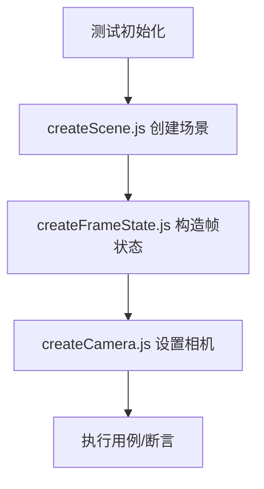

**图表来源**
- [createScene.js:1-200](file://Specs/createScene.js#L1-L200)
- [createFrameState.js:1-200](file://Specs/createFrameState.js#L1-L200)
- [createCamera.js:1-200](file://Specs/createCamera.js#L1-L200)

**章节来源**
- [createScene.js:1-200](file://Specs/createScene.js#L1-L200)
- [createFrameState.js:1-200](file://Specs/createFrameState.js#L1-L200)
- [createCamera.js:1-200](file://Specs/createCamera.js#L1-L200)

## 新增特性详解

### 属性类型系统（Attribute Type System）
属性类型系统为元数据提供了统一的类型定义与验证机制，支持多种基础类型与复合类型的组合。

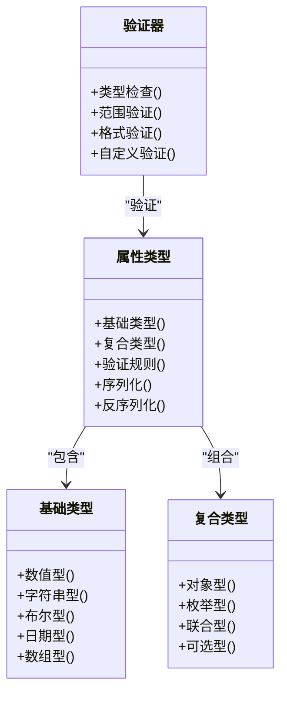

**图表来源**
- [cesiumrust metadata types src/lib.rs:1-200](file://cesiumrust/domain/metadata/types/src/lib.rs#L1-L200)

**章节来源**
- [cesiumrust metadata types src/lib.rs:1-200](file://cesiumrust/domain/metadata/types/src/lib.rs#L1-L200)

### 轴定义系统（Axis Definitions）
轴定义系统提供了标准化的三维坐标轴表示与转换功能，确保不同坐标系间的一致性。

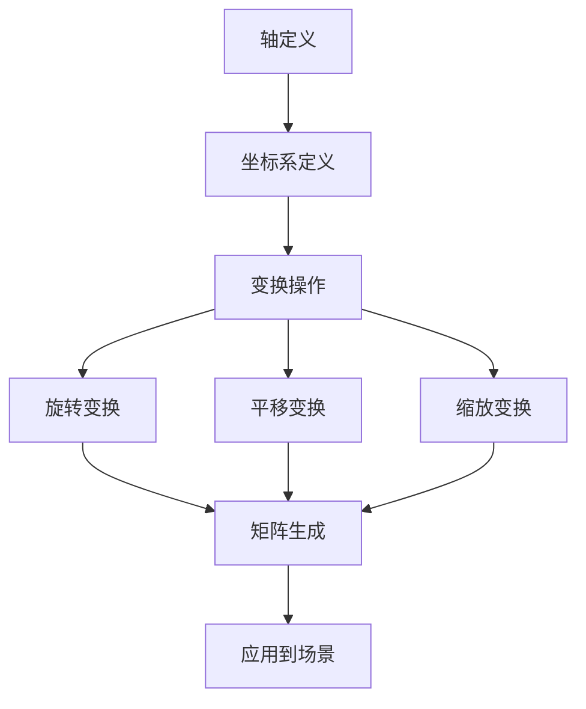

**图表来源**
- [cesiumrust geometry axes src/lib.rs:1-200](file://cesiumrust/domain/geometry/axes/src/lib.rs#L1-L200)

**章节来源**
- [cesiumrust geometry axes src/lib.rs:1-200](file://cesiumrust/domain/geometry/axes/src/lib.rs#L1-L200)

### 作业调度器（Job Scheduler）
作业调度器负责管理异步任务的执行、资源分配与错误处理，提升系统的并发处理能力。

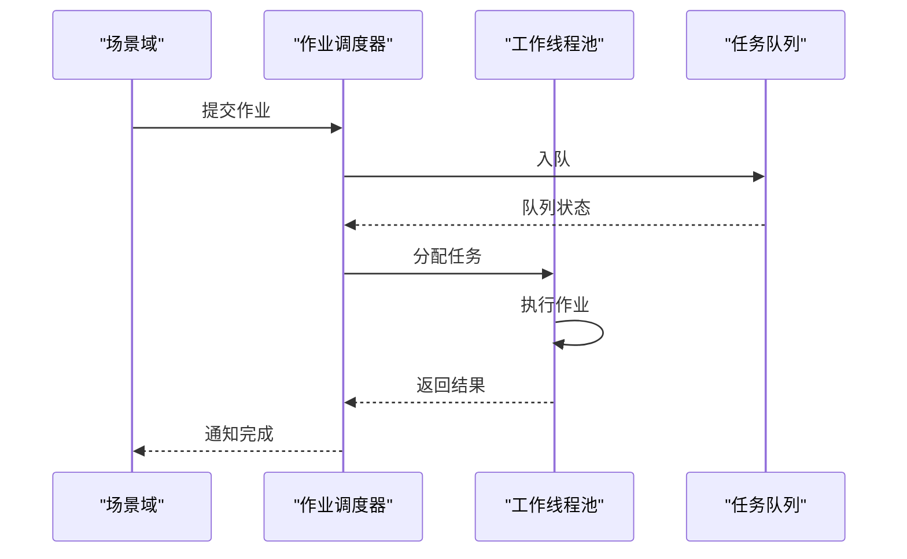

**图表来源**
- [cesiumrust scheduler src/lib.rs:1-200](file://cesiumrust/domain/scheduler/src/lib.rs#L1-L200)

**章节来源**
- [cesiumrust scheduler src/lib.rs:1-200](file://cesiumrust/domain/scheduler/src/lib.rs#L1-L200)

### 隐式可用性位流系统（Implicit Availability Bitstream）
隐式可用性位流系统通过位运算优化瓦片的可见性检测，显著提升大规模场景的性能。

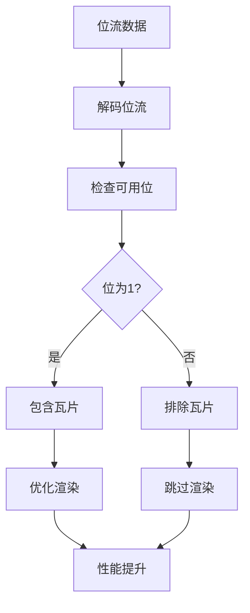

**图表来源**
- [cesiumrust implicit availability src/lib.rs:1-200](file://cesiumrust/domain/implicit/availability/src/lib.rs#L1-L200)

**章节来源**
- [cesiumrust implicit availability src/lib.rs:1-200](file://cesiumrust/domain/implicit/availability/src/lib.rs#L1-L200)

## 依赖关系分析
- 耦合度
  - 场景域对瓦片集、地形、影像、相机、数据源存在强依赖；通过明确接口降低直接耦合。
  - 交互域仅向场景域暴露事件通道，保持低耦合。
  - 时间域作为横切关注点，被场景域周期性消费。
  - **新增** 属性类型系统、轴定义系统、作业调度器、隐式可用性系统作为独立模块，通过清晰接口与场景域交互。
- 外部依赖
  - 网络与解码器由 adapters 提供，通过 ports 抽象屏蔽底层差异。
  - 示例与应用通过 workspace 聚合模块，避免跨层直连。

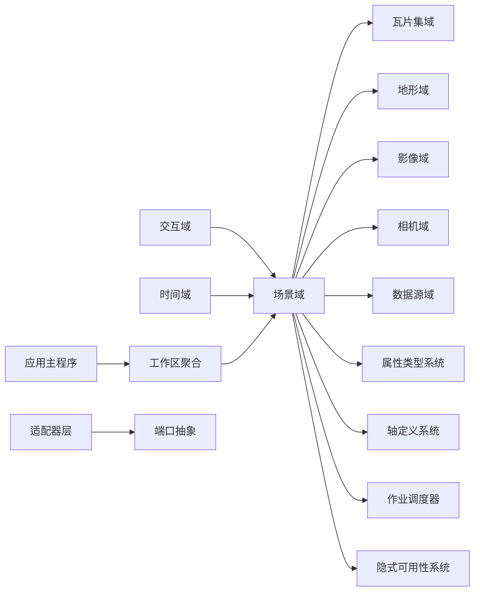

**图表来源**
- [cesiumrust workspace src/lib.rs:1-200](file://cesiumrust/crates/workspace/src/lib.rs#L1-L200)
- [cesiumrust scene src/lib.rs:1-200](file://cesiumrust/domain/scene/src/lib.rs#L1-L200)
- [cesiumrust tileset src/lib.rs:1-200](file://cesiumrust/domain/tileset/src/lib.rs#L1-L200)
- [cesiumrust terrain src/lib.rs:1-200](file://cesiumrust/domain/terrain/src/lib.rs#L1-L200)
- [cesiumrust imagery src/lib.rs:1-200](file://cesiumrust/domain/imagery/src/lib.rs#L1-L200)
- [cesiumrust camera src/lib.rs:1-200](file://cesiumrust/domain/camera/src/lib.rs#L1-L200)
- [cesiumrust datasource src/lib.rs:1-200](file://cesiumrust/domain/datasource/src/lib.rs#L1-L200)
- [cesiumrust interaction src/lib.rs:1-200](file://cesiumrust/domain/interaction/src/lib.rs#L1-L200)
- [cesiumrust time src/lib.rs:1-200](file://cesiumrust/domain/time/src/lib.rs#L1-L200)

**章节来源**
- [cesiumrust workspace src/lib.rs:1-200](file://cesiumrust/crates/workspace/src/lib.rs#L1-L200)
- [cesiumrust scene src/lib.rs:1-200](file://cesiumrust/domain/scene/src/lib.rs#L1-L200)

## 性能考量
- 瓦片集按需加载与 LOD 控制：优先保证近景细节，远景使用粗粒度瓦片，减少带宽与内存占用。
- 纹理与网格缓存：对高频访问的高程块与纹理切片进行缓存，降低重复 IO。
- 批量绘制与合并：将相似材质与拓扑的图元合并批次，减少 GPU 状态切换。
- 异步与并行：资源加载与解析尽量异步化，避免阻塞主循环。
- 相机运动平滑：使用插值与阻尼，避免抖动导致的重绘开销。
- **新增** 属性类型验证缓存：避免重复的类型检查开销。
- **新增** 轴变换矩阵缓存：复用已计算的变换矩阵。
- **新增** 作业调度优化：合理分配工作线程，避免资源竞争。
- **新增** 位流压缩存储：减少内存占用，提升传输效率。

## 故障排查指南
- 场景未渲染
  - 检查入口是否成功初始化工作区与场景域。
  - 确认本地服务已启动且静态资源路径正确。
  - **新增** 验证属性类型系统是否正确配置。
  - **新增** 检查轴定义系统坐标轴设置。
- 瓦片集不显示
  - 校验 tileset.json 可达性与 CORS 策略。
  - 查看瓦片集日志中的可见性判定与加载失败原因。
  - **新增** 检查隐式可用性位流是否正确解码。
  - **新增** 验证作业调度器任务执行情况。
- 地形/影像缺失
  - 检查地形与影像服务 URL、格式与分辨率匹配。
  - 确认缓存命中情况与网络延迟。
  - **新增** 验证属性类型系统中的元数据格式。
- 交互无响应
  - 验证事件绑定与坐标系转换是否正确。
  - 检查相机矩阵与射线拾取范围。
  - **新增** 检查轴定义系统的坐标变换逻辑。
- 时序异常
  - 确认时间域 dt 推送频率与数据源插值逻辑一致。
  - **新增** 检查作业调度器的任务执行顺序。
- **新增** 属性类型错误
  - 验证元数据的类型定义与数据结构。
  - 检查类型验证规则的准确性。
- **新增** 坐标转换问题
  - 确认坐标轴定义的正确性。
  - 检查变换矩阵的计算逻辑。

**章节来源**
- [index.cjs:1-200](file://index.cjs#L1-L200)
- [server.js:1-200](file://server.js#L1-L200)
- [cesiumrust tileset src/lib.rs:1-200](file://cesiumrust/domain/tileset/src/lib.rs#L1-L200)
- [cesiumrust terrain src/lib.rs:1-200](file://cesiumrust/domain/terrain/src/lib.rs#L1-L200)
- [cesiumrust imagery src/lib.rs:1-200](file://cesiumrust/domain/imagery/src/lib.rs#L1-L200)
- [cesiumrust interaction src/lib.rs:1-200](file://cesiumrust/domain/interaction/src/lib.rs#L1-L200)
- [cesiumrust time src/lib.rs:1-200](file://cesiumrust/domain/time/src/lib.rs#L1-L200)

## 结论
该场景管理架构以"场景域"为核心，通过清晰的领域分层与适配器/端口抽象，实现了高内聚、低耦合的可扩展设计。瓦片集、地形、影像、相机、交互、数据源与时间等子系统各司其职，配合工作区聚合与本地服务，形成从应用入口到渲染输出的完整闭环。

**更新** 新增的属性类型系统、轴定义系统、作业调度器和隐式可用性位流系统进一步增强了场景管理的功能性和性能。这些特性通过模块化设计保持了良好的解耦性，同时提供了强大的扩展能力。遵循本文的性能与排障建议，可在大规模三维场景中实现稳定高效的可视化体验。

## 附录
- 术语
  - 瓦片集：基于 3D Tiles 的层次化三维内容组织形式。
  - 帧状态：描述单帧渲染所需的全局上下文与中间结果。
  - 视锥裁剪：根据相机视野剔除不可见对象的优化手段。
  - **新增** 属性类型：元数据中定义的变量类型规范。
  - **新增** 轴定义：三维坐标轴的标准化表示方法。
  - **新增** 作业调度：异步任务的分配与执行管理。
  - **新增** 位流：二进制位序列的数据表示形式。
- 参考
  - 示例页面：Apps/CesiumViewer/index.html
  - 示例脚本：Apps/CesiumViewer/CesiumViewer.js

**章节来源**
- [index.html:1-200](file://Apps/CesiumViewer/index.html#L1-L200)
- [CesiumViewer.js:1-200](file://Apps/CesiumViewer/CesiumViewer.js#L1-L200)