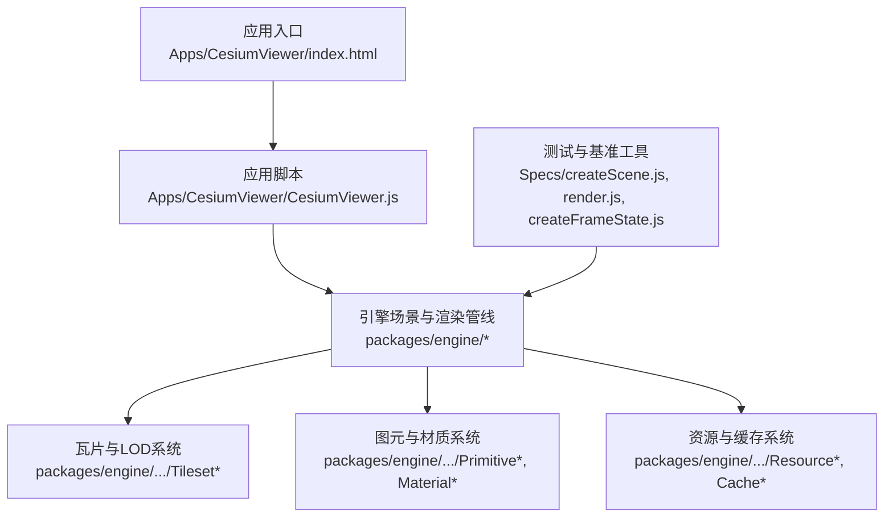
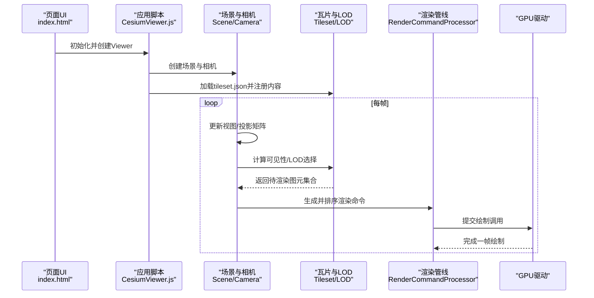
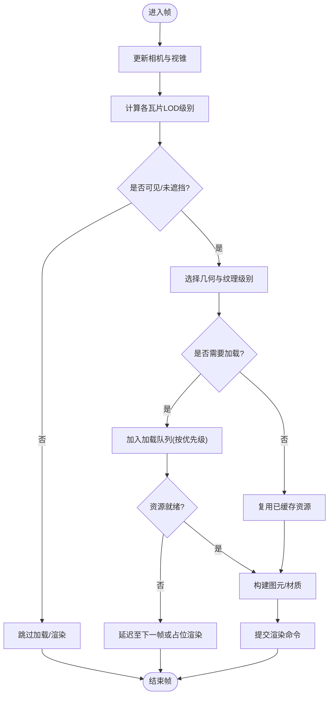
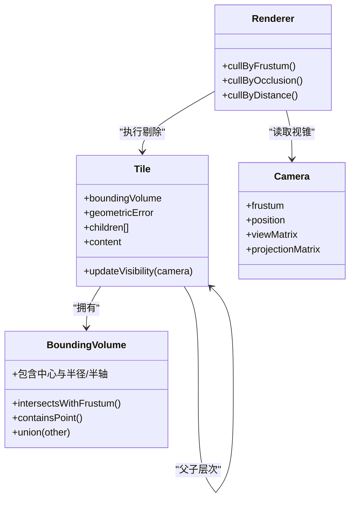
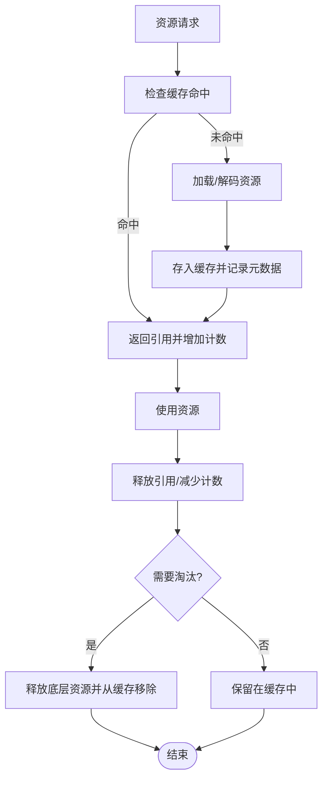
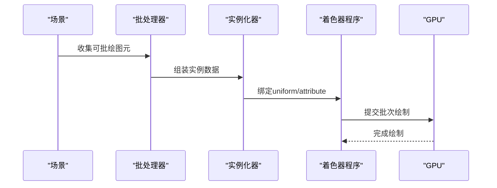
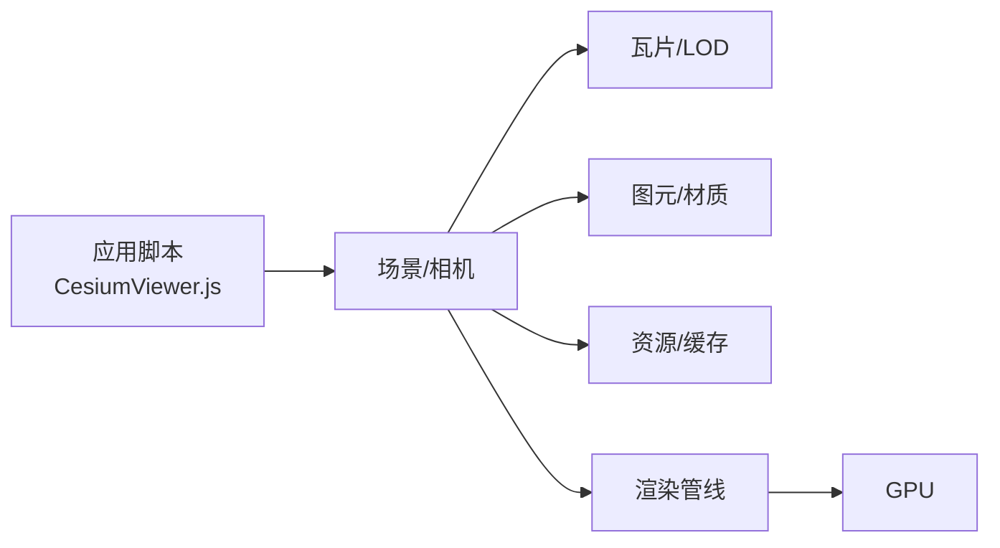

# 性能优化策略

<cite>
**本文引用的文件**   
- [README.md](file://README.md)
- [PerformanceTestingGuide/README.md](file://Documentation/Contributors/PerformanceTestingGuide/README.md)
- [CesiumViewer.js](file://Apps/CesiumViewer/CesiumViewer.js)
- [index.html](file://Apps/CesiumViewer/index.html)
- [createScene.js](file://Specs/createScene.js)
- [render.js](file://Specs/render.js)
- [createFrameState.js](file://Specs/createFrameState.js)
- [ViewportPrimitive.js](file://Specs/ViewportPrimitive.js)
</cite>

## 目录
1. [简介](#简介)
2. [项目结构](#项目结构)
3. [核心组件](#核心组件)
4. [架构总览](#架构总览)
5. [详细组件分析](#详细组件分析)
6. [依赖关系分析](#依赖关系分析)
7. [性能考量](#性能考量)
8. [故障排查指南](#故障排查指南)
9. [结论](#结论)
10. [附录](#附录)

## 简介
本技术文档聚焦于在 Cesium 场景中实现高性能渲染与资源管理的关键策略，涵盖以下主题：
- LOD（细节层次）策略：几何体简化、纹理降级与动态加载
- 包围体积与剔除：视锥剔除、遮挡剔除与距离裁剪
- 资源缓存机制：内存管理、垃圾回收与资源复用
- 渲染优化：批处理渲染、实例化渲染与着色器优化
- 性能监控与分析：FPS 监控、内存使用分析与 GPU 性能分析
- 实战调优技巧与最佳实践示例路径

## 项目结构
仓库采用多包与示例分离的组织方式。与场景性能密切相关的代码主要分布在：
- Source 与 packages 下的引擎核心模块（如 Scene、Tileset、Primitive、Material、Resource 等）
- Apps 中的示例应用（用于演示与验证性能策略）
- Specs 中的测试与基准工具（用于构建场景、帧状态与渲染流程）

图表来源
- [index.html](file://Apps/CesiumViewer/index.html)
- [CesiumViewer.js](file://Apps/CesiumViewer/CesiumViewer.js)
- [createScene.js](file://Specs/createScene.js)
- [render.js](file://Specs/render.js)
- [createFrameState.js](file://Specs/createFrameState.js)

章节来源
- [README.md](file://README.md)
- [CesiumViewer.js](file://Apps/CesiumViewer/CesiumViewer.js)
- [index.html](file://Apps/CesiumViewer/index.html)
- [createScene.js](file://Specs/createScene.js)
- [render.js](file://Specs/render.js)
- [createFrameState.js](file://Specs/createFrameState.js)

## 核心组件
本节概述与性能直接相关的关键子系统及其职责：
- 场景与相机：负责视图矩阵、投影矩阵、视锥定义与更新
- 瓦片与LOD：基于 tileset.json 的层级结构与几何误差控制，驱动按需加载与替换
- 图元与材质：将几何数据与着色器绑定，支持批处理与实例化
- 资源与缓存：统一管理纹理、模型、几何体等资源的生命周期与复用
- 渲染管线：帧循环、命令队列、深度/透明度排序与绘制调用合并

章节来源
- [CesiumViewer.js](file://Apps/CesiumViewer/CesiumViewer.js)
- [createScene.js](file://Specs/createScene.js)
- [render.js](file://Specs/render.js)
- [createFrameState.js](file://Specs/createFrameState.js)

## 架构总览
下图展示了从应用入口到渲染管线的关键交互，以及性能相关子系统的位置与作用点。

图表来源
- [index.html](file://Apps/CesiumViewer/index.html)
- [CesiumViewer.js](file://Apps/CesiumViewer/CesiumViewer.js)
- [createScene.js](file://Specs/createScene.js)
- [render.js](file://Specs/render.js)
- [createFrameState.js](file://Specs/createFrameState.js)

## 详细组件分析

### LOD（细节层次）策略
- 几何体简化
  - 通过 tileset.json 中的 geometricError 与子节点划分，按相机距离与屏幕空间误差选择合适级别
  - 结合视锥与遮挡信息，避免加载不可见或低贡献的细粒度几何
- 纹理降级
  - 根据目标分辨率与带宽限制，选择不同 mip 级别或替代纹理集
  - 对远距离对象优先使用较小尺寸纹理，减少显存占用与带宽压力
- 动态加载
  - 基于请求队列与优先级调度，优先加载近景与高影响区域
  - 利用隐式瓦片与预取策略平滑过渡，降低卡顿

图表来源
- [createScene.js](file://Specs/createScene.js)
- [render.js](file://Specs/render.js)
- [createFrameState.js](file://Specs/createFrameState.js)

章节来源
- [createScene.js](file://Specs/createScene.js)
- [render.js](file://Specs/render.js)
- [createFrameState.js](file://Specs/createFrameState.js)

### 包围体积与剔除
- 包围体积计算
  - 为瓦片与图元维护高效的包围球/轴对齐包围盒，用于快速相交测试
  - 利用层次结构聚合父级包围体积，减少逐元素检测开销
- 视锥剔除
  - 基于相机视锥与包围体积求交，剔除完全在外部的对象
- 遮挡剔除
  - 借助深度缓冲或硬件 occlusion query（若可用），进一步剔除被遮挡的瓦片
- 距离裁剪
  - 根据相机距离与几何误差阈值，提前丢弃远端低贡献瓦片

图表来源
- [createScene.js](file://Specs/createScene.js)
- [render.js](file://Specs/render.js)
- [createFrameState.js](file://Specs/createFrameState.js)

章节来源
- [createScene.js](file://Specs/createScene.js)
- [render.js](file://Specs/render.js)
- [createFrameState.js](file://Specs/createFrameState.js)

### 资源缓存机制
- 内存管理
  - 统一资源句柄与引用计数，避免重复分配
  - 设置最大缓存容量与淘汰策略（LRU/LFU）
- 垃圾回收
  - 在资源不再被引用时释放底层 GPU 资源与内存
  - 提供显式 dispose 接口与自动清理钩子
- 资源复用
  - 共享纹理、几何体与材质实例，减少重复上传与编译
  - 针对批量与实例化渲染，复用顶点缓冲区与索引缓冲区

图表来源
- [createScene.js](file://Specs/createScene.js)
- [render.js](file://Specs/render.js)
- [createFrameState.js](file://Specs/createFrameState.js)

章节来源
- [createScene.js](file://Specs/createScene.js)
- [render.js](file://Specs/render.js)
- [createFrameState.js](file://Specs/createFrameState.js)

### 渲染优化技术
- 批处理渲染
  - 合并相同材质与状态的图元，减少状态切换与绘制调用
  - 利用 batchId 与属性表进行差异化着色
- 实例化渲染
  - 对大量相似对象使用实例化绘制，仅传递变换差异
  - 合理组织实例数据布局以提升缓存命中率
- 着色器优化
  - 减少分支与复杂运算，尽量使用常量表达式
  - 合理使用 uniform 与 attribute，避免频繁更新

图表来源
- [createScene.js](file://Specs/createScene.js)
- [render.js](file://Specs/render.js)
- [createFrameState.js](file://Specs/createFrameState.js)

章节来源
- [createScene.js](file://Specs/createScene.js)
- [render.js](file://Specs/render.js)
- [createFrameState.js](file://Specs/createFrameState.js)

### 性能监控与分析工具
- FPS 监控
  - 统计每帧时间，输出平均/最低/分位数 FPS
  - 在移动端关注掉帧与抖动
- 内存使用分析
  - 跟踪 JS Heap 与 GPU 显存峰值
  - 识别泄漏与异常增长的资源
- GPU 性能分析
  - 使用浏览器开发者工具的 GPU 面板或 WebGL Profiler
  - 分析绘制调用次数、顶点数与带宽占用

章节来源
- [PerformanceTestingGuide/README.md](file://Documentation/Contributors/PerformanceTestingGuide/README.md)
- [ViewportPrimitive.js](file://Specs/ViewportPrimitive.js)

## 依赖关系分析
- 组件耦合
  - 场景与相机强耦合，需保证矩阵更新与视锥一致性
  - 瓦片系统与渲染管线松耦合，通过命令队列解耦
- 外部依赖
  - 浏览器 API（WebGL/WebGPU）、网络请求与文件系统访问
- 潜在循环依赖
  - 应避免在资源加载回调中直接触发同一层级的重新加载，防止循环

图表来源
- [CesiumViewer.js](file://Apps/CesiumViewer/CesiumViewer.js)
- [createScene.js](file://Specs/createScene.js)
- [render.js](file://Specs/render.js)
- [createFrameState.js](file://Specs/createFrameState.js)

章节来源
- [CesiumViewer.js](file://Apps/CesiumViewer/CesiumViewer.js)
- [createScene.js](file://Specs/createScene.js)
- [render.js](file://Specs/render.js)
- [createFrameState.js](file://Specs/createFrameState.js)

## 性能考量
- 控制绘制调用数量
  - 合并材质与状态，减少切换
  - 使用批处理与实例化降低 draw call
- 降低顶点与像素负载
  - 选择合适的 LOD 级别与纹理分辨率
  - 启用合理的抗锯齿与阴影质量
- 减少 CPU-GPU 同步
  - 异步加载与后台解码
  - 批量更新属性，避免每帧频繁修改
- 内存与带宽
  - 限制同时加载的瓦片数量
  - 使用压缩纹理与 Draco/glTF 优化

[本节为通用指导，不直接分析具体文件]

## 故障排查指南
- 常见问题定位
  - 帧率骤降：检查是否有突发的大规模加载或材质切换
  - 内存泄漏：确认资源是否正确释放与引用计数归零
  - 闪烁与重绘：排查瓦片替换时机与占位渲染策略
- 调试建议
  - 开启渲染统计与可视化包围体积
  - 使用最小复现案例隔离问题
  - 对比不同设备与浏览器的表现差异

章节来源
- [PerformanceTestingGuide/README.md](file://Documentation/Contributors/PerformanceTestingGuide/README.md)
- [ViewportPrimitive.js](file://Specs/ViewportPrimitive.js)

## 结论
通过在瓦片与LOD、包围体积与剔除、资源缓存、渲染管线等多层面协同优化，可以显著提升 Cesium 场景的性能与稳定性。建议以数据驱动的方式持续监控关键指标，并结合业务场景调整参数与策略，达到最佳的用户体验。

[本节为总结性内容，不直接分析具体文件]

## 附录
- 实战示例路径（不含代码片段）
  - 场景初始化与基本配置：[createScene.js](file://Specs/createScene.js)
  - 渲染循环与帧状态构建：[render.js](file://Specs/render.js)、[createFrameState.js](file://Specs/createFrameState.js)
  - 示例应用入口与集成：[index.html](file://Apps/CesiumViewer/index.html)、[CesiumViewer.js](file://Apps/CesiumViewer/CesiumViewer.js)
  - 性能测试指南与工具说明：[PerformanceTestingGuide/README.md](file://Documentation/Contributors/PerformanceTestingGuide/README.md)
  - 视口图元与调试辅助：[ViewportPrimitive.js](file://Specs/ViewportPrimitive.js)

章节来源
- [createScene.js](file://Specs/createScene.js)
- [render.js](file://Specs/render.js)
- [createFrameState.js](file://Specs/createFrameState.js)
- [index.html](file://Apps/CesiumViewer/index.html)
- [CesiumViewer.js](file://Apps/CesiumViewer/CesiumViewer.js)
- [PerformanceTestingGuide/README.md](file://Documentation/Contributors/PerformanceTestingGuide/README.md)
- [ViewportPrimitive.js](file://Specs/ViewportPrimitive.js)