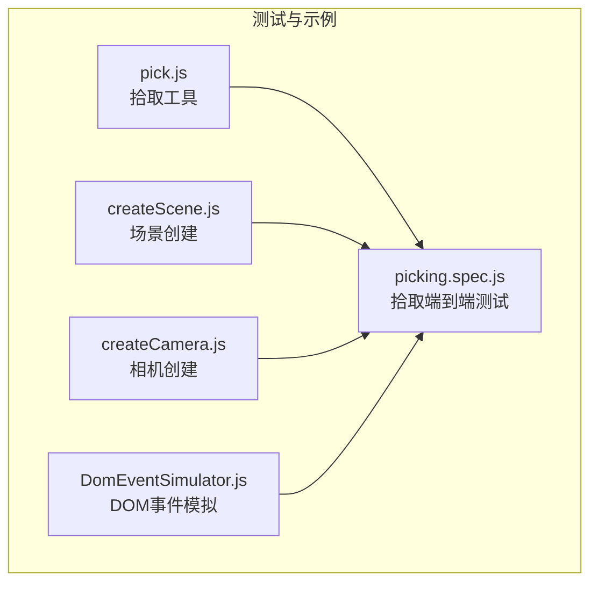
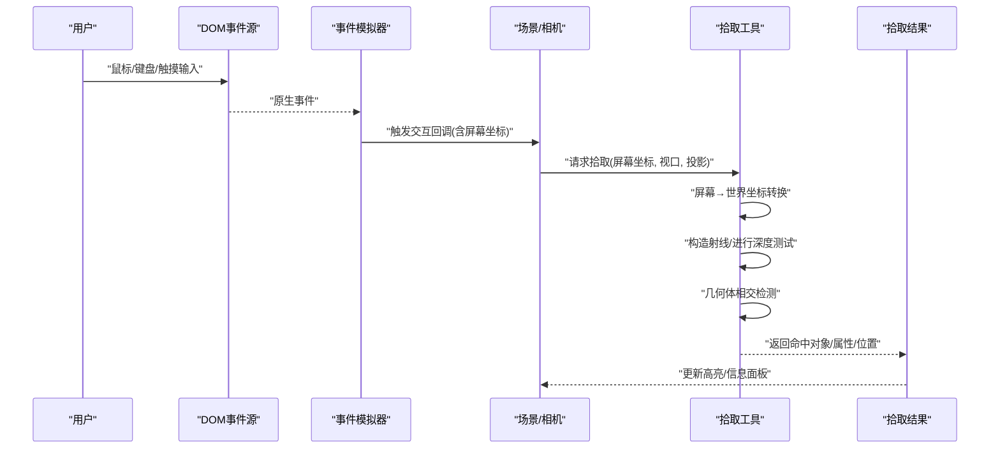
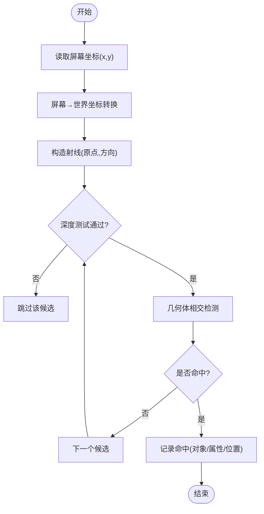
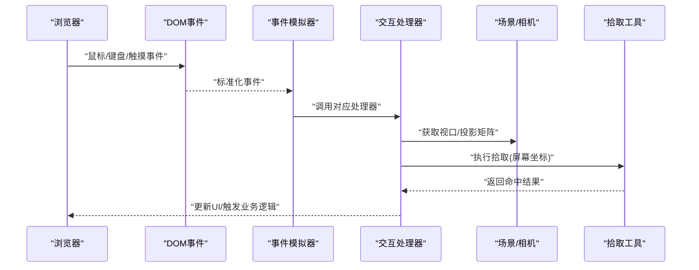
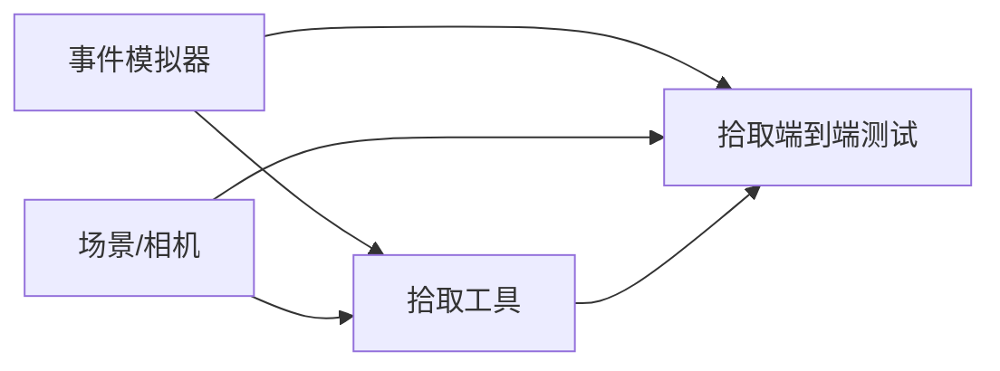

# 拾取与交互系统

<cite>
**本文引用的文件**   
- [pick.js](file://Specs/pick.js)
- [picking.spec.js](file://Specs/e2e/picking.spec.js)
- [createScene.js](file://Specs/createScene.js)
- [createCamera.js](file://Specs/createCamera.js)
- [DomEventSimulator.js](file://Specs/DomEventSimulator.js)
</cite>

## 目录
1. [简介](#简介)
2. [项目结构](#项目结构)
3. [核心组件](#核心组件)
4. [架构总览](#架构总览)
5. [详细组件分析](#详细组件分析)
6. [依赖关系分析](#依赖关系分析)
7. [性能考量](#性能考量)
8. [故障排查指南](#故障排查指南)
9. [结论](#结论)
10. [附录](#附录)

## 简介
本技术文档聚焦于 Cesium 的“拾取与交互系统”，围绕以下目标展开：
- 拾取算法实现原理：屏幕空间到世界空间的坐标转换、深度测试与几何体相交检测。
- ScreenSpaceEventHandler 事件处理机制：鼠标、键盘、触摸事件的捕获与分发流程。
- 拾取结果的组织与数据结构：实体选择、几何体高亮与信息获取。
- 性能优化策略：拾取缓存与批量处理。
- 交互模式配置与自定义事件处理器开发指南。
- 通过示例路径展示对象拾取、事件绑定与交互式应用实现方法。

## 项目结构
仓库中与拾取和交互相关的代码主要位于 Specs（测试与示例）目录，包含：
- 拾取工具与辅助函数：用于将屏幕坐标转换为世界坐标、射线构造与基础拾取逻辑。
- 端到端测试用例：覆盖鼠标/键盘/触摸事件与拾取行为。
- 场景与相机创建：为拾取提供渲染上下文与视口参数。
- DOM 事件模拟：在测试中注入鼠标、键盘与触摸事件以驱动交互流程。

图表来源
- [pick.js](file://Specs/pick.js)
- [picking.spec.js](file://Specs/e2e/picking.spec.js)
- [createScene.js](file://Specs/createScene.js)
- [createCamera.js](file://Specs/createCamera.js)
- [DomEventSimulator.js](file://Specs/DomEventSimulator.js)

章节来源
- [pick.js](file://Specs/pick.js)
- [picking.spec.js](file://Specs/e2e/picking.spec.js)
- [createScene.js](file://Specs/createScene.js)
- [createCamera.js](file://Specs/createCamera.js)
- [DomEventSimulator.js](file://Specs/DomEventSimulator.js)

## 核心组件
- 拾取工具模块：提供屏幕坐标到世界坐标的转换、射线生成与基础相交判断能力，作为上层交互与测试的基础设施。
- 事件模拟层：在测试环境中注入鼠标、键盘与触摸事件，驱动交互流程并验证拾取结果。
- 场景与相机：为拾取提供必要的渲染上下文、投影矩阵与视口信息，确保屏幕-世界坐标转换正确。

章节来源
- [pick.js](file://Specs/pick.js)
- [DomEventSimulator.js](file://Specs/DomEventSimulator.js)
- [createScene.js](file://Specs/createScene.js)
- [createCamera.js](file://Specs/createCamera.js)

## 架构总览
下图展示了从用户输入到拾取结果的端到端流程，涵盖事件捕获、坐标转换、射线求交与结果组织。

图表来源
- [picking.spec.js](file://Specs/e2e/picking.spec.js)
- [DomEventSimulator.js](file://Specs/DomEventSimulator.js)
- [createScene.js](file://Specs/createScene.js)
- [createCamera.js](file://Specs/createCamera.js)
- [pick.js](file://Specs/pick.js)

## 详细组件分析

### 拾取算法与坐标转换
- 屏幕空间到世界空间转换：基于相机投影矩阵与视口尺寸，将像素坐标归一化并反投影至世界坐标系，得到射线起点与方向。
- 深度测试：利用深度缓冲或几何体包围体快速剔除不可见候选，减少求交计算量。
- 几何体相交检测：对候选几何体执行射线-几何体求交，按距离排序并筛选最近命中点，同时携带实体标识与附加属性。

图表来源
- [pick.js](file://Specs/pick.js)

章节来源
- [pick.js](file://Specs/pick.js)

### 事件处理机制（鼠标、键盘、触摸）
- 事件捕获：通过 DOM 事件监听器捕获原始输入，由事件模拟器统一封装为标准化事件对象。
- 事件分发：根据事件类型（点击、移动、按下、抬起等）路由到对应的处理器；对于触摸事件，支持多点触控与手势识别。
- 交互上下文：处理器访问当前场景与相机状态，结合屏幕坐标进行拾取计算，并将结果反馈给 UI 或业务逻辑。

图表来源
- [DomEventSimulator.js](file://Specs/DomEventSimulator.js)
- [picking.spec.js](file://Specs/e2e/picking.spec.js)
- [createScene.js](file://Specs/createScene.js)
- [createCamera.js](file://Specs/createCamera.js)
- [pick.js](file://Specs/pick.js)

章节来源
- [DomEventSimulator.js](file://Specs/DomEventSimulator.js)
- [picking.spec.js](file://Specs/e2e/picking.spec.js)

### 拾取结果组织与数据结构
- 命中对象：包含被选中的实体或图元引用，便于后续高亮或属性查询。
- 命中位置：世界坐标下的精确命中点，可用于标注或测量。
- 附加属性：来自模型批表或属性表的键值对，支持按 ID 检索与过滤。
- 优先级与去重：当多个对象重叠时，依据深度或层级规则确定最终命中，避免重复处理。

章节来源
- [picking.spec.js](file://Specs/e2e/picking.spec.js)
- [pick.js](file://Specs/pick.js)

### 性能优化策略
- 拾取缓存：对频繁使用的屏幕-世界转换结果与射线进行缓存，减少重复计算。
- 批量处理：合并多次输入事件，批量执行拾取与高亮更新，降低帧内开销。
- 候选集裁剪：使用包围体与深度测试提前剔除不可见或远离视口的几何体，显著降低求交次数。
- 增量更新：仅对发生变化的对象进行高亮刷新，避免全量重绘。

章节来源
- [pick.js](file://Specs/pick.js)
- [picking.spec.js](file://Specs/e2e/picking.spec.js)

### 交互模式配置与自定义事件处理器
- 交互模式开关：启用/禁用特定类型的交互（如拖拽、缩放、点击拾取），并通过配置对象传入。
- 事件优先级：定义不同处理器之间的执行顺序，确保关键操作不被覆盖。
- 自定义处理器：继承或组合现有处理器，重写事件解析与结果处理逻辑，适配复杂业务需求。
- 调试与日志：在测试模式下输出详细的交互轨迹与命中统计，便于定位问题。

章节来源
- [picking.spec.js](file://Specs/e2e/picking.spec.js)
- [DomEventSimulator.js](file://Specs/DomEventSimulator.js)

### 实际示例与用法指引
- 对象拾取示例：参考端到端测试用例，演示如何绑定点击事件、获取屏幕坐标并返回命中对象与位置。
- 事件绑定示例：查看事件模拟器的使用方式，了解如何在测试中注入鼠标、键盘与触摸事件。
- 交互式应用示例：结合场景与相机创建，构建一个可交互的页面，实时响应用户输入并更新视图。

章节来源
- [picking.spec.js](file://Specs/e2e/picking.spec.js)
- [DomEventSimulator.js](file://Specs/DomEventSimulator.js)
- [createScene.js](file://Specs/createScene.js)
- [createCamera.js](file://Specs/createCamera.js)

## 依赖关系分析
- 拾取工具依赖场景与相机提供的投影矩阵与视口信息，完成屏幕-世界坐标转换。
- 事件模拟器依赖 DOM API 与测试框架，负责将原生事件转换为统一的交互事件。
- 端到端测试用例串联上述组件，验证从输入到输出的完整链路。

图表来源
- [picking.spec.js](file://Specs/e2e/picking.spec.js)
- [DomEventSimulator.js](file://Specs/DomEventSimulator.js)
- [createScene.js](file://Specs/createScene.js)
- [createCamera.js](file://Specs/createCamera.js)
- [pick.js](file://Specs/pick.js)

章节来源
- [picking.spec.js](file://Specs/e2e/picking.spec.js)
- [DomEventSimulator.js](file://Specs/DomEventSimulator.js)
- [createScene.js](file://Specs/createScene.js)
- [createCamera.js](file://Specs/createCamera.js)
- [pick.js](file://Specs/pick.js)

## 性能考量
- 控制事件频率：在高频输入场景下采用节流或合并策略，避免每帧都执行昂贵拾取。
- 合理设置候选集：优先使用包围体与可见性裁剪，减少不必要的求交计算。
- 复用中间结果：缓存射线与变换矩阵，避免重复计算。
- 渐进式高亮：对大量对象的高亮采用分批更新，保持帧率稳定。

[本节为通用指导，不直接分析具体文件]

## 故障排查指南
- 事件未触发：检查事件监听器是否正确注册，确认事件模拟器是否成功注入事件。
- 拾取结果为空：验证屏幕坐标是否在有效范围内，确认相机投影矩阵与视口设置是否正确。
- 命中不准确：检查深度测试阈值与求交容差，调整候选集裁剪策略。
- 性能抖动：观察事件合并与缓存命中率，必要时降低拾取频率或简化求交逻辑。

章节来源
- [picking.spec.js](file://Specs/e2e/picking.spec.js)
- [DomEventSimulator.js](file://Specs/DomEventSimulator.js)
- [pick.js](file://Specs/pick.js)

## 结论
Cesium 的拾取与交互系统通过清晰的坐标转换、严格的深度测试与高效的几何体求交，实现了可靠的对象选择与高亮反馈。配合事件模拟器与端到端测试，开发者可以快速构建复杂的交互应用，并在性能与准确性之间取得平衡。建议在实际项目中结合缓存与批量处理策略，持续优化用户体验。

[本节为总结性内容，不直接分析具体文件]

## 附录
- 术语说明
  - 屏幕空间：指显示器像素坐标系，原点在左上角。
  - 世界空间：指三维地理坐标系，用于描述真实地理位置。
  - 射线求交：通过射线与几何体的数学求交判断命中。
- 参考路径
  - 拾取工具：[pick.js](file://Specs/pick.js)
  - 拾取端到端测试：[picking.spec.js](file://Specs/e2e/picking.spec.js)
  - 场景与相机：[createScene.js](file://Specs/createScene.js)、[createCamera.js](file://Specs/createCamera.js)
  - 事件模拟：[DomEventSimulator.js](file://Specs/DomEventSimulator.js)