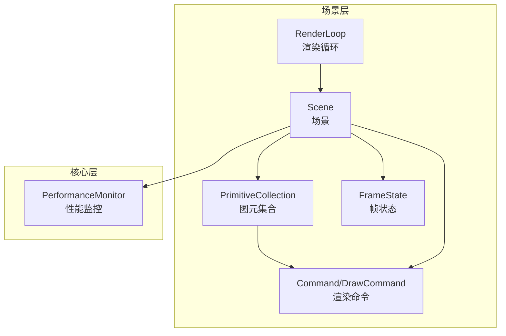
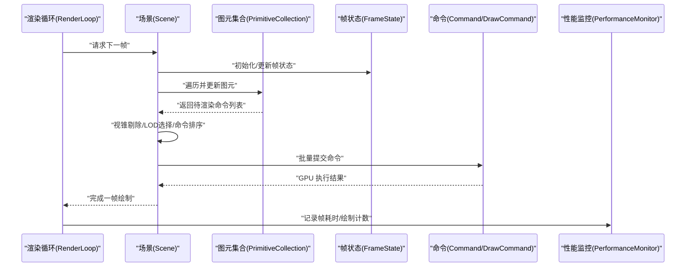
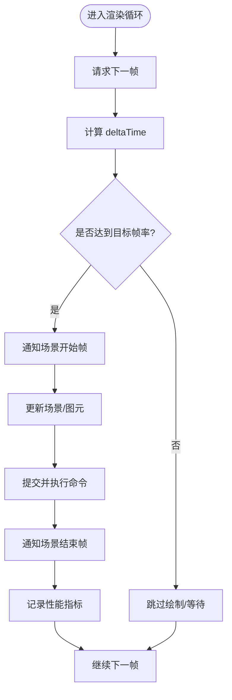
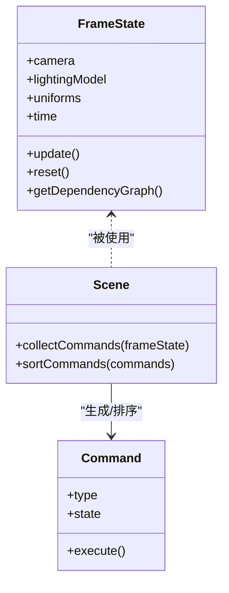
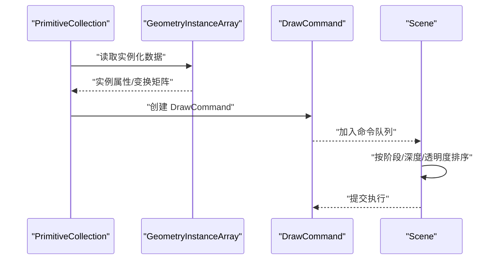
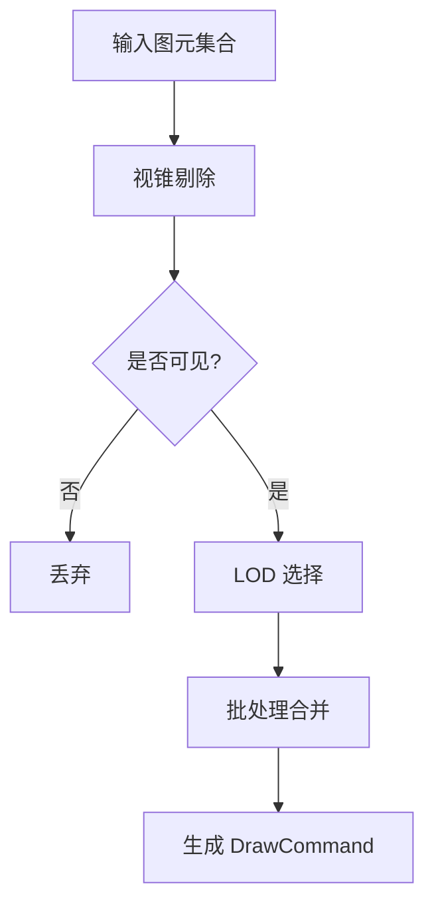
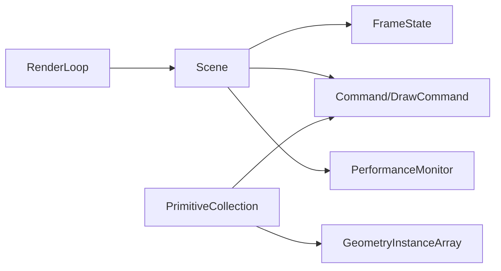

# 渲染管线管理

<cite>
**本文引用的文件**   
- [packages/engine/Source/Scene/RenderLoop.js](file://packages/engine/Source/Scene/RenderLoop.js)
- [packages/engine/Source/Scene/FrameState.js](file://packages/engine/Source/Scene/FrameState.js)
- [packages/engine/Source/Scene/Command.js](file://packages/engine/Source/Scene/Command.js)
- [packages/engine/Source/Scene/Scene.js](file://packages/engine/Source/Scene/Scene.js)
- [packages/engine/Source/Scene/PrimitiveCollection.js](file://packages/engine/Source/Scene/PrimitiveCollection.js)
- [packages/engine/Source/Scene/DrawCommand.js](file://packages/engine/Source/Scene/DrawCommand.js)
- [packages/engine/Source/Scene/GeometryInstanceArray.js](file://packages/engine/Source/Scene/GeometryInstanceArray.js)
- [packages/engine/Source/Core/PerformanceMonitor.js](file://packages/engine/Source/Core/PerformanceMonitor.js)
</cite>

## 目录
1. [简介](#简介)
2. [项目结构](#项目结构)
3. [核心组件](#核心组件)
4. [架构总览](#架构总览)
5. [详细组件分析](#详细组件分析)
6. [依赖关系分析](#依赖关系分析)
7. [性能考量](#性能考量)
8. [故障排查指南](#故障排查指南)
9. [结论](#结论)
10. [附录](#附录)

## 简介
本技术文档聚焦于 Cesium 渲染管线的管理与执行，围绕以下关键主题展开：
- 渲染循环（RenderLoop）的帧率控制、时间管理与调度机制
- 帧状态（FrameState）的状态收集、依赖解析与命令生成流程
- 命令对象（Command/DrawCommand）的创建、分类、排序与优化
- 视锥剔除、LOD 选择与批处理渲染的实现原理
- 渲染性能监控与分析工具的使用建议
- 自定义渲染命令与扩展渲染管线的实践方法

## 项目结构
Cesium 引擎将渲染相关能力集中在 packages/engine 中。与渲染管线直接相关的核心模块包括：
- Scene 层：负责场景级渲染组织、命令收集与提交
- Core 层：提供基础数据结构、性能统计等通用能力
- 具体实现位于 Source/Scene 与 Source/Core 目录下

图表来源
- [packages/engine/Source/Scene/RenderLoop.js](file://packages/engine/Source/Scene/RenderLoop.js)
- [packages/engine/Source/Scene/Scene.js](file://packages/engine/Source/Scene/Scene.js)
- [packages/engine/Source/Scene/PrimitiveCollection.js](file://packages/engine/Source/Scene/PrimitiveCollection.js)
- [packages/engine/Source/Scene/FrameState.js](file://packages/engine/Source/Scene/FrameState.js)
- [packages/engine/Source/Scene/Command.js](file://packages/engine/Source/Scene/Command.js)
- [packages/engine/Source/Scene/DrawCommand.js](file://packages/engine/Source/Scene/DrawCommand.js)
- [packages/engine/Source/Core/PerformanceMonitor.js](file://packages/engine/Source/Core/PerformanceMonitor.js)

章节来源
- [packages/engine/Source/Scene/RenderLoop.js](file://packages/engine/Source/Scene/RenderLoop.js)
- [packages/engine/Source/Scene/Scene.js](file://packages/engine/Source/Scene/Scene.js)
- [packages/engine/Source/Scene/PrimitiveCollection.js](file://packages/engine/Source/Scene/PrimitiveCollection.js)
- [packages/engine/Source/Scene/FrameState.js](file://packages/engine/Source/Scene/FrameState.js)
- [packages/engine/Source/Scene/Command.js](file://packages/engine/Source/Scene/Command.js)
- [packages/engine/Source/Scene/DrawCommand.js](file://packages/engine/Source/Scene/DrawCommand.js)
- [packages/engine/Source/Core/PerformanceMonitor.js](file://packages/engine/Source/Core/PerformanceMonitor.js)

## 核心组件
- 渲染循环（RenderLoop）
  - 职责：驱动主循环、计算帧间隔、触发更新与绘制、协调帧率控制
  - 关键点：requestAnimationFrame 集成、deltaTime 计算、节流策略
- 场景（Scene）
  - 职责：组织渲染阶段、维护可见性、收集并排序命令、提交到 GPU
  - 关键点：视锥剔除、阴影/后处理阶段、命令队列管理
- 帧状态（FrameState）
  - 职责：保存当前帧的全局状态（相机、光照、投影矩阵、时间等），作为各子系统共享上下文
  - 关键点：状态复用与重置、依赖关系标记、命令生成所需参数
- 命令（Command/DrawCommand）
  - 职责：封装一次 GPU 调用所需的绑定、状态与几何信息
  - 关键点：类型化分类、排序键、批合并、深度/透明度处理
- 图元集合（PrimitiveCollection）
  - 职责：聚合 Primitive，按帧更新可见性与实例化数据，生成 DrawCommand
  - 关键点：增量更新、实例化数组（GeometryInstanceArray）、批处理
- 性能监控（PerformanceMonitor）
  - 职责：采集帧率、GPU/CPU 耗时、绘制调用次数等指标
  - 关键点：采样周期、指标导出、可视化面板

章节来源
- [packages/engine/Source/Scene/RenderLoop.js](file://packages/engine/Source/Scene/RenderLoop.js)
- [packages/engine/Source/Scene/Scene.js](file://packages/engine/Source/Scene/Scene.js)
- [packages/engine/Source/Scene/FrameState.js](file://packages/engine/Source/Scene/FrameState.js)
- [packages/engine/Source/Scene/Command.js](file://packages/engine/Source/Scene/Command.js)
- [packages/engine/Source/Scene/DrawCommand.js](file://packages/engine/Source/Scene/DrawCommand.js)
- [packages/engine/Source/Scene/PrimitiveCollection.js](file://packages/engine/Source/Scene/PrimitiveCollection.js)
- [packages/engine/Source/Core/PerformanceMonitor.js](file://packages/engine/Source/Core/PerformanceMonitor.js)

## 架构总览
下图展示了从渲染循环到命令执行的端到端流程，以及关键对象之间的交互。

图表来源
- [packages/engine/Source/Scene/RenderLoop.js](file://packages/engine/Source/Scene/RenderLoop.js)
- [packages/engine/Source/Scene/Scene.js](file://packages/engine/Source/Scene/Scene.js)
- [packages/engine/Source/Scene/PrimitiveCollection.js](file://packages/engine/Source/Scene/PrimitiveCollection.js)
- [packages/engine/Source/Scene/FrameState.js](file://packages/engine/Source/Scene/FrameState.js)
- [packages/engine/Source/Scene/Command.js](file://packages/engine/Source/Scene/Command.js)
- [packages/engine/Source/Scene/DrawCommand.js](file://packages/engine/Source/Scene/DrawCommand.js)
- [packages/engine/Source/Core/PerformanceMonitor.js](file://packages/engine/Source/Core/PerformanceMonitor.js)

## 详细组件分析

### 渲染循环（RenderLoop）工作机制
- 帧率控制
  - 通过 requestAnimationFrame 驱动主循环，结合目标帧率进行节流或加速
  - 当帧间隔小于阈值时跳过绘制，避免过度消耗资源
- 时间管理
  - 计算 deltaTime 用于物理/动画更新；支持固定步长与可变步长混合模式
  - 使用高精度时间戳保证长时间运行的稳定性
- 渲染调度
  - 在每帧开始时通知场景进入“开始帧”阶段，结束时通知“结束帧”
  - 与性能监控联动，记录每帧耗时与绘制统计

图表来源
- [packages/engine/Source/Scene/RenderLoop.js](file://packages/engine/Source/Scene/RenderLoop.js)
- [packages/engine/Source/Scene/Scene.js](file://packages/engine/Source/Scene/Scene.js)
- [packages/engine/Source/Core/PerformanceMonitor.js](file://packages/engine/Source/Core/PerformanceMonitor.js)

章节来源
- [packages/engine/Source/Scene/RenderLoop.js](file://packages/engine/Source/Scene/RenderLoop.js)
- [packages/engine/Source/Core/PerformanceMonitor.js](file://packages/engine/Source/Core/PerformanceMonitor.js)

### 帧状态（FrameState）管理机制
- 状态收集
  - 每帧初始化相机视图/投影矩阵、光照模型、全局材质常量、时间变量等
  - 为后续命令生成提供统一上下文
- 依赖关系解析
  - 根据图元与材质的依赖图，确定需要更新的 Uniforms、纹理与着色器程序
  - 对可复用的状态进行缓存，减少重复计算
- 命令生成
  - 基于 FrameState 提供的矩阵与常量，填充 DrawCommand 的 uniform 与状态字段
  - 维护命令的排序键（如深度、透明度、材质 ID），确保正确绘制顺序

图表来源
- [packages/engine/Source/Scene/FrameState.js](file://packages/engine/Source/Scene/FrameState.js)
- [packages/engine/Source/Scene/Scene.js](file://packages/engine/Source/Scene/Scene.js)
- [packages/engine/Source/Scene/Command.js](file://packages/engine/Source/Scene/Command.js)

章节来源
- [packages/engine/Source/Scene/FrameState.js](file://packages/engine/Source/Scene/FrameState.js)
- [packages/engine/Source/Scene/Scene.js](file://packages/engine/Source/Scene/Scene.js)
- [packages/engine/Source/Scene/Command.js](file://packages/engine/Source/Scene/Command.js)

### 命令对象（Command/DrawCommand）的创建与执行
- 创建流程
  - PrimitiveCollection 遍历可见图元，依据 GeometryInstanceArray 构建 DrawCommand
  - 每个 DrawCommand 包含顶点/索引缓冲、Uniforms、状态（深度测试、混合、剔除等）
- 分类与排序
  - 按渲染阶段（不透明、半透明、线框、点云等）分组
  - 组内按深度、透明度、材质 ID 排序，减少状态切换
- 优化策略
  - 批处理：相同材质/状态的多个实例合并为单次 draw call
  - 延迟绑定：仅在必要时切换状态，降低 GPU 开销
  - 深度预写/模板测试：提升遮挡剔除效率

图表来源
- [packages/engine/Source/Scene/PrimitiveCollection.js](file://packages/engine/Source/Scene/PrimitiveCollection.js)
- [packages/engine/Source/Scene/GeometryInstanceArray.js](file://packages/engine/Source/Scene/GeometryInstanceArray.js)
- [packages/engine/Source/Scene/DrawCommand.js](file://packages/engine/Source/Scene/DrawCommand.js)
- [packages/engine/Source/Scene/Scene.js](file://packages/engine/Source/Scene/Scene.js)

章节来源
- [packages/engine/Source/Scene/PrimitiveCollection.js](file://packages/engine/Source/Scene/PrimitiveCollection.js)
- [packages/engine/Source/Scene/GeometryInstanceArray.js](file://packages/engine/Source/Scene/GeometryInstanceArray.js)
- [packages/engine/Source/Scene/DrawCommand.js](file://packages/engine/Source/Scene/DrawCommand.js)
- [packages/engine/Source/Scene/Scene.js](file://packages/engine/Source/Scene/Scene.js)

### 视锥剔除、LOD 选择与批处理渲染
- 视锥剔除
  - 基于相机视锥体对图元包围体（球体/AABB）进行快速裁剪，仅保留可见图元
  - 层级式剔除：先粗筛再细筛，减少 CPU 计算量
- LOD 选择
  - 根据距离与几何误差阈值动态选择细节级别，平衡质量与性能
  - 与 Tileset 系统协作，按需加载与卸载
- 批处理渲染
  - 将具有相同材质与状态的多个实例合并，减少 draw call 数量
  - 利用实例化属性（位置、缩放、颜色等）在一次调用中渲染大量对象

图表来源
- [packages/engine/Source/Scene/Scene.js](file://packages/engine/Source/Scene/Scene.js)
- [packages/engine/Source/Scene/PrimitiveCollection.js](file://packages/engine/Source/Scene/PrimitiveCollection.js)
- [packages/engine/Source/Scene/DrawCommand.js](file://packages/engine/Source/Scene/DrawCommand.js)

章节来源
- [packages/engine/Source/Scene/Scene.js](file://packages/engine/Source/Scene/Scene.js)
- [packages/engine/Source/Scene/PrimitiveCollection.js](file://packages/engine/Source/Scene/PrimitiveCollection.js)
- [packages/engine/Source/Scene/DrawCommand.js](file://packages/engine/Source/Scene/DrawCommand.js)

### 性能监控与分析工具使用方法
- 启用性能监控
  - 在应用初始化时创建 PerformanceMonitor 实例，并挂载到 UI
  - 设置采样周期与指标阈值，便于观察异常波动
- 关键指标
  - FPS、平均/峰值帧耗时、绘制调用次数、三角形数量、GPU 内存占用
- 分析与定位
  - 结合浏览器开发者工具的 Rendering/GPU 面板，对比 Cesium 内部统计
  - 针对高绘制调用场景，检查批处理是否生效、是否存在频繁状态切换
  - 对 LOD 与视锥剔除效果进行验证，确认剔除率与可见图元规模

章节来源
- [packages/engine/Source/Core/PerformanceMonitor.js](file://packages/engine/Source/Core/PerformanceMonitor.js)

### 自定义渲染命令与管线扩展示例
- 自定义命令类型
  - 继承 Command 基类，定义新的 type 与 execute 逻辑
  - 在 Scene 的命令注册表中注册新类型，使其参与排序与执行
- 扩展命令生成
  - 在 PrimitiveCollection 的更新流程中，检测特定条件并生成自定义 DrawCommand
  - 使用 GeometryInstanceArray 传递实例化数据，确保批处理友好
- 典型用例
  - 自定义后处理通道：在 Scene 的阶段末尾插入命令，叠加特效
  - 特殊材质渲染：为不支持的材质特性编写专用命令路径

章节来源
- [packages/engine/Source/Scene/Command.js](file://packages/engine/Source/Scene/Command.js)
- [packages/engine/Source/Scene/DrawCommand.js](file://packages/engine/Source/Scene/DrawCommand.js)
- [packages/engine/Source/Scene/PrimitiveCollection.js](file://packages/engine/Source/Scene/PrimitiveCollection.js)
- [packages/engine/Source/Scene/Scene.js](file://packages/engine/Source/Scene/Scene.js)

## 依赖关系分析
- 组件耦合
  - RenderLoop 与 Scene 强耦合（帧生命周期）
  - Scene 与 FrameState/Command 紧密协作（状态与命令）
  - PrimitiveCollection 向 Scene 输出命令，依赖 GeometryInstanceArray
- 外部依赖
  - WebGL/WebGPU 后端由底层抽象封装，上层通过 Command.execute 调用
  - 性能监控独立于渲染路径，通过回调或轮询获取指标

图表来源
- [packages/engine/Source/Scene/RenderLoop.js](file://packages/engine/Source/Scene/RenderLoop.js)
- [packages/engine/Source/Scene/Scene.js](file://packages/engine/Source/Scene/Scene.js)
- [packages/engine/Source/Scene/FrameState.js](file://packages/engine/Source/Scene/FrameState.js)
- [packages/engine/Source/Scene/Command.js](file://packages/engine/Source/Scene/Command.js)
- [packages/engine/Source/Scene/DrawCommand.js](file://packages/engine/Source/Scene/DrawCommand.js)
- [packages/engine/Source/Scene/PrimitiveCollection.js](file://packages/engine/Source/Scene/PrimitiveCollection.js)
- [packages/engine/Source/Scene/GeometryInstanceArray.js](file://packages/engine/Source/Scene/GeometryInstanceArray.js)
- [packages/engine/Source/Core/PerformanceMonitor.js](file://packages/engine/Source/Core/PerformanceMonitor.js)

章节来源
- [packages/engine/Source/Scene/RenderLoop.js](file://packages/engine/Source/Scene/RenderLoop.js)
- [packages/engine/Source/Scene/Scene.js](file://packages/engine/Source/Scene/Scene.js)
- [packages/engine/Source/Scene/FrameState.js](file://packages/engine/Source/Scene/FrameState.js)
- [packages/engine/Source/Scene/Command.js](file://packages/engine/Source/Scene/Command.js)
- [packages/engine/Source/Scene/DrawCommand.js](file://packages/engine/Source/Scene/DrawCommand.js)
- [packages/engine/Source/Scene/PrimitiveCollection.js](file://packages/engine/Source/Scene/PrimitiveCollection.js)
- [packages/engine/Source/Scene/GeometryInstanceArray.js](file://packages/engine/Source/Scene/GeometryInstanceArray.js)
- [packages/engine/Source/Core/PerformanceMonitor.js](file://packages/engine/Source/Core/PerformanceMonitor.js)

## 性能考量
- 减少状态切换
  - 尽量合并相同材质/状态的图元，提升批处理比例
  - 避免每帧频繁修改 Uniforms，采用批量更新策略
- 合理配置 LOD 与视锥剔除
  - 调整几何误差阈值与剔除半径，平衡视觉质量与性能
  - 对大规模场景使用分层/分块加载，降低单帧压力
- 监控与调优
  - 关注绘制调用次数与三角形数量，识别热点区域
  - 结合 GPU 分析工具定位瓶颈（着色器复杂度、纹理带宽等）

[本节为通用指导，无需列出章节来源]

## 故障排查指南
- 常见问题
  - 帧率骤降：检查是否存在大量未批处理的图元或频繁状态切换
  - 画面闪烁/错序：确认透明度与深度排序是否正确，避免跨阶段混排
  - 内存泄漏：检查图元与纹理释放，避免残留引用
- 诊断步骤
  - 开启性能监控，观察 FPS、绘制调用与三角形数量变化
  - 逐步关闭功能（阴影、后处理、LOD）以定位问题源
  - 使用浏览器开发者工具录制帧，分析 GPU/CPU 耗时分布

章节来源
- [packages/engine/Source/Core/PerformanceMonitor.js](file://packages/engine/Source/Core/PerformanceMonitor.js)

## 结论
Cesium 的渲染管线以 RenderLoop 为驱动核心，通过 FrameState 统一管理帧上下文，借助 Command/DrawCommand 将场景图元转化为 GPU 可执行的绘制任务。视锥剔除、LOD 选择与批处理共同保障大规模场景的实时渲染性能。通过合理的监控与调优手段，开发者可以持续优化渲染效率，并在需要时扩展自定义命令以满足复杂需求。

[本节为总结性内容，无需列出章节来源]

## 附录
- 术语表
  - 渲染循环：驱动每帧更新与绘制的核心循环
  - 帧状态：保存当前帧全局上下文的数据结构
  - 命令：封装一次 GPU 调用的最小单元
  - 批处理：合并多次绘制为一次调用以提升性能
- 参考路径
  - 渲染循环实现：[packages/engine/Source/Scene/RenderLoop.js](file://packages/engine/Source/Scene/RenderLoop.js)
  - 帧状态管理：[packages/engine/Source/Scene/FrameState.js](file://packages/engine/Source/Scene/FrameState.js)
  - 命令体系：[packages/engine/Source/Scene/Command.js](file://packages/engine/Source/Scene/Command.js)、[packages/engine/Source/Scene/DrawCommand.js](file://packages/engine/Source/Scene/DrawCommand.js)
  - 场景组织与命令提交：[packages/engine/Source/Scene/Scene.js](file://packages/engine/Source/Scene/Scene.js)
  - 图元集合与实例化数据：[packages/engine/Source/Scene/PrimitiveCollection.js](file://packages/engine/Source/Scene/PrimitiveCollection.js)、[packages/engine/Source/Scene/GeometryInstanceArray.js](file://packages/engine/Source/Scene/GeometryInstanceArray.js)
  - 性能监控：[packages/engine/Source/Core/PerformanceMonitor.js](file://packages/engine/Source/Core/PerformanceMonitor.js)