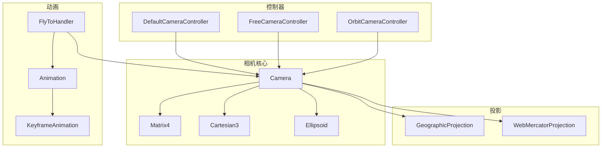
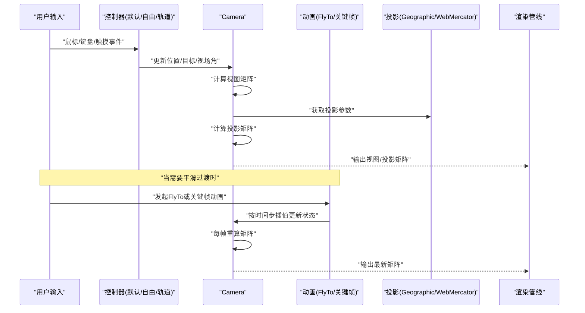
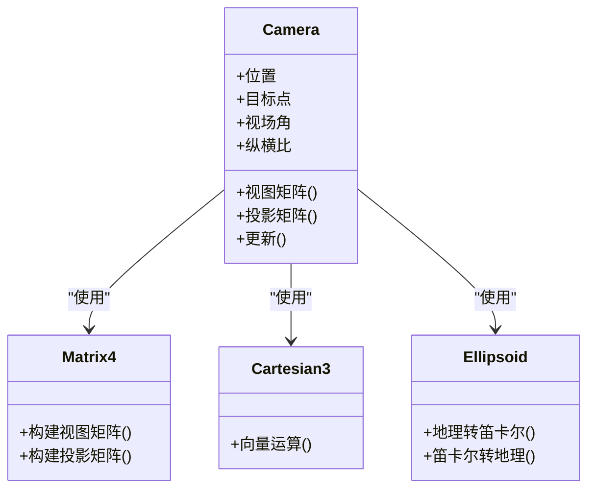
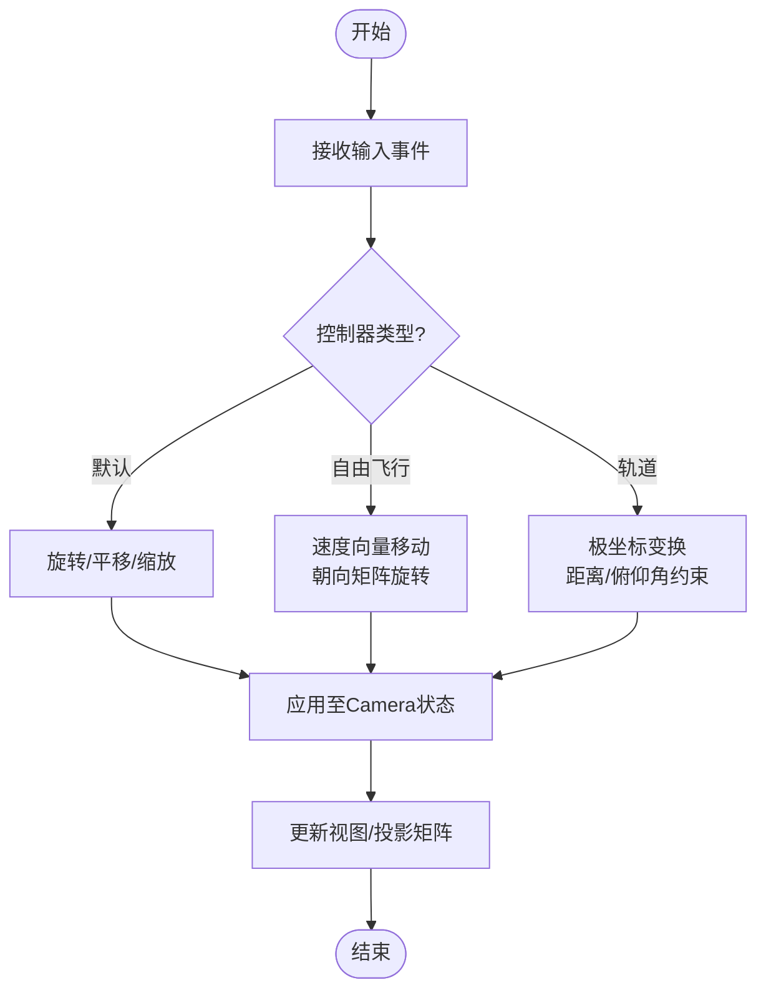
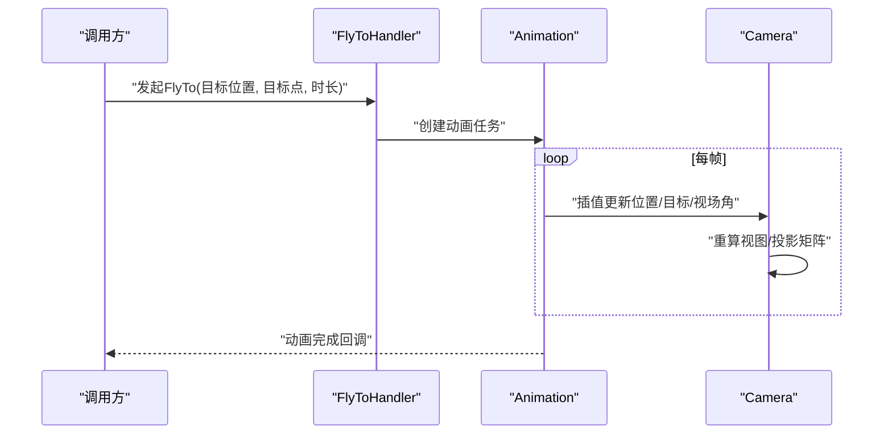
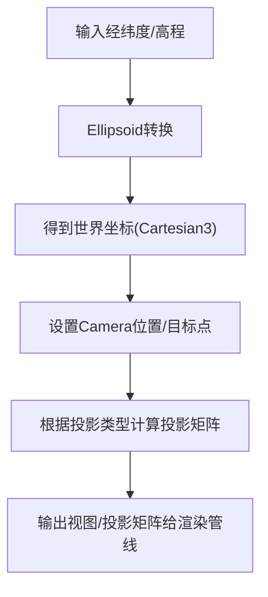
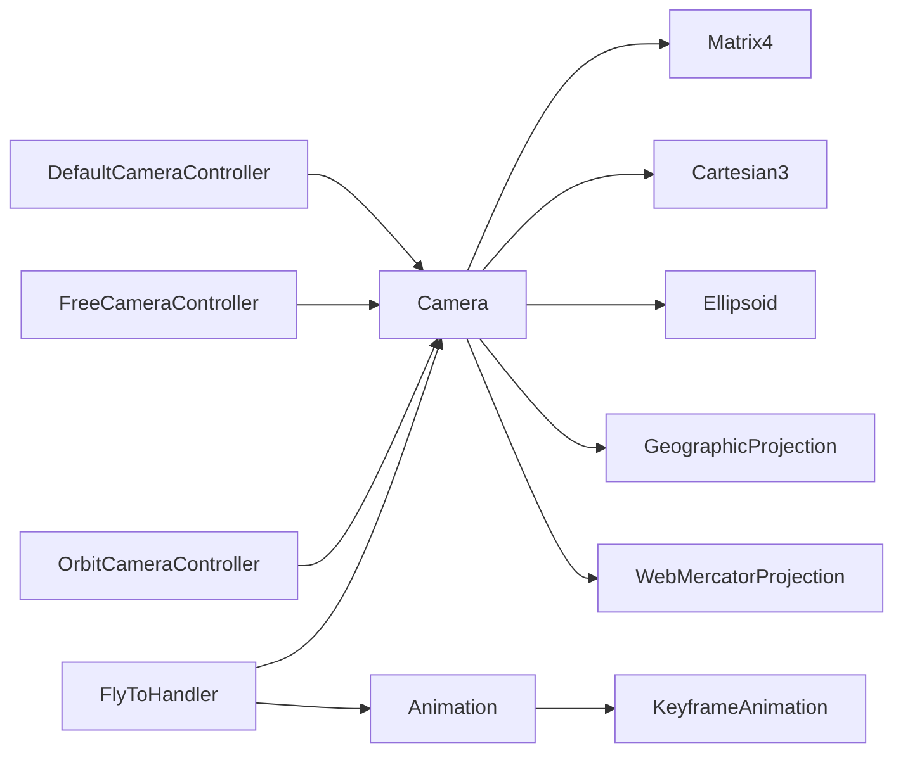

# 相机控制系统

<cite>
**本文引用的文件**   
- [lib.rs](file://cesiumrust/domain/camera/src/lib.rs)
- [mod.rs](file://cesiumrust/adapters/bevy-render/src/camera/mod.rs)
- [controller_system.rs](file://cesiumrust/adapters/bevy-render/src/camera/controller_system.rs)
- [flight_system.rs](file://cesiumrust/adapters/bevy-render/src/camera/flight_system.rs)
- [scene_mode_system.rs](file://cesiumrust/adapters/bevy-render/src/camera/scene_mode_system.rs)
- [components.rs](file://cesiumrust/adapters/bevy-render/src/camera/components.rs)
- [update_system.rs](file://cesiumrust/adapters/bevy-render/src/camera/update_system.rs)
- [orbit_camera.rs](file://cesiumrust/application/cesium-app/src/orbit_camera.rs)
</cite>

## 更新摘要
**所做更改**
- 新增基于 Bevy 的相机系统架构，替代原有的 JavaScript 实现
- 实现轨道控制器、飞行动画和场景模式切换功能
- 添加碰撞检测和平滑过渡动画
- 支持 2D/2.5D/3D 视图之间的无缝切换
- 集成地理坐标系统和椭球体模型

## 目录
1. [简介](#简介)
2. [项目结构](#项目结构)
3. [核心组件](#核心组件)
4. [架构总览](#架构总览)
5. [详细组件分析](#详细组件分析)
6. [依赖关系分析](#依赖关系分析)
7. [性能考量](#性能考量)
8. [故障排查指南](#故障排查指南)
9. [结论](#结论)
10. [附录](#附录)

## 简介
本技术文档聚焦于 CesiumRust 的相机控制系统，基于 Bevy 游戏引擎重新实现了完整的相机管理功能。系统包含 Camera 类的状态管理、多种控制器类型（默认控制器、自由飞行控制器、轨道控制器）、动画系统（平滑过渡、路径动画、关键帧动画），以及与地理坐标系统的转换关系。文档同时提供 API 接口说明、配置选项以及实际使用示例的代码片段路径，帮助开发者快速掌握相机定位、视角切换与自定义控制器的实现方法。

## 项目结构
CesiumRust 将相机相关能力分布在多个模块中：
- 相机核心：Camera 类负责位置、目标点、视场角、投影矩阵等状态与计算
- 控制器：DefaultCameraController、FreeCameraController、OrbitCameraController 分别实现不同交互模式
- 动画：FlyToHandler 驱动 FlyTo 动画；Animation 与 KeyframeAnimation 提供通用动画框架
- 数学与投影：Matrix4、Cartesian3、Ellipsoid 提供基础几何与椭球体支持；GeographicProjection、WebMercatorProjection 提供投影变换
- 测试辅助：Specs/createCamera.js 用于构造测试用相机实例

图表来源
- [lib.rs:134-163](file://cesiumrust/domain/camera/src/lib.rs#L134-L163)
- [controller_system.rs:8-101](file://cesiumrust/adapters/bevy-render/src/camera/controller_system.rs#L8-L101)
- [flight_system.rs:7-47](file://cesiumrust/adapters/bevy-render/src/camera/flight_system.rs#L7-L47)
- [scene_mode_system.rs:11-64](file://cesiumrust/adapters/bevy-render/src/camera/scene_mode_system.rs#L11-L64)

章节来源
- [lib.rs:134-163](file://cesiumrust/domain/camera/src/lib.rs#L134-L163)
- [controller_system.rs:8-101](file://cesiumrust/adapters/bevy-render/src/camera/controller_system.rs#L8-L101)
- [flight_system.rs:7-47](file://cesiumrust/adapters/bevy-render/src/camera/flight_system.rs#L7-L47)
- [scene_mode_system.rs:11-64](file://cesiumrust/adapters/bevy-render/src/camera/scene_mode_system.rs#L11-L64)

## 核心组件
本节深入解析 Camera 类及其与控制器、动画、投影的关系。

- Camera 状态与职责
  - 位置与目标点：维护相机在世界坐标系中的位置与注视目标点
  - 视场角与纵横比：定义透视投影的视野范围与屏幕比例
  - 视图矩阵与投影矩阵：根据当前状态计算视图矩阵和投影矩阵，供渲染管线使用
  - 更新与同步：在每帧或状态变化时触发矩阵重算，确保渲染一致性

- 控制器类型
  - 默认控制器：基于场景交互（鼠标拖拽、滚轮缩放、双击定位等）驱动相机状态
  - 自由飞行控制器：以第一人称方式移动与旋转，适合导航与漫游
  - 轨道控制器：围绕目标点进行旋转、缩放与平移，适合全局浏览

- 动画系统
  - FlyToHandler：封装从当前位置到目标位置的平滑过渡动画
  - Animation 与 KeyframeAnimation：提供时间轴与关键帧插值能力，可用于路径动画与复杂视角序列

- 投影与坐标系统
  - GeographicProjection 与 WebMercatorProjection：将经纬度与平面坐标相互转换
  - Ellipsoid：提供椭球体模型，支撑地理坐标与笛卡尔坐标之间的转换

章节来源
- [lib.rs:134-163](file://cesiumrust/domain/camera/src/lib.rs#L134-L163)
- [controller_system.rs:8-101](file://cesiumrust/adapters/bevy-render/src/camera/controller_system.rs#L8-L101)
- [flight_system.rs:7-47](file://cesiumrust/adapters/bevy-render/src/camera/flight_system.rs#L7-L47)
- [scene_mode_system.rs:11-64](file://cesiumrust/adapters/bevy-render/src/camera/scene_mode_system.rs#L11-L64)

## 架构总览
下图展示了相机控制系统的整体架构与数据流：控制器监听输入事件并修改 Camera 状态；Camera 在状态变化时更新视图矩阵与投影矩阵；FlyToHandler 通过动画系统驱动相机平滑过渡；投影模块负责地理坐标与平面坐标的转换。

图表来源
- [controller_system.rs:8-101](file://cesiumrust/adapters/bevy-render/src/camera/controller_system.rs#L8-L101)
- [flight_system.rs:7-47](file://cesiumrust/adapters/bevy-render/src/camera/flight_system.rs#L7-L47)
- [scene_mode_system.rs:11-64](file://cesiumrust/adapters/bevy-render/src/camera/scene_mode_system.rs#L11-L64)
- [lib.rs:134-163](file://cesiumrust/domain/camera/src/lib.rs#L134-L163)

## 详细组件分析

### Camera 类设计与状态管理
- 状态字段
  - 位置：世界坐标系下的三维向量
  - 目标点：相机注视的中心点
  - 视场角：垂直方向的透视角度
  - 纵横比：屏幕宽度与高度之比
  - 视图矩阵：由位置与朝向推导
  - 投影矩阵：由视场角与纵横比推导
- 计算方法
  - 视图矩阵：根据位置与目标点构建观察变换
  - 投影矩阵：根据视场角与纵横比构建透视投影
  - 更新策略：状态变更时标记脏位，按需重算矩阵
- 与投影模块的协作
  - 读取投影参数（如近远裁剪面、投影类型）
  - 结合地理坐标系统与平面坐标系统进行坐标转换

图表来源
- [lib.rs:134-163](file://cesiumrust/domain/camera/src/lib.rs#L134-L163)

章节来源
- [lib.rs:134-163](file://cesiumrust/domain/camera/src/lib.rs#L134-L163)

### 控制器类型与实现原理
- 默认控制器
  - 行为：鼠标左键旋转、右键平移、滚轮缩放、双击定位
  - 实现：监听输入事件，计算增量并应用到 Camera 的状态
- 自由飞行控制器
  - 行为：WASD 移动、鼠标控制朝向、空格上升、Shift 下降
  - 实现：基于速度向量与朝向矩阵进行位移与旋转
- 轨道控制器
  - 行为：围绕目标点旋转、缩放距离、上下平移
  - 实现：极坐标变换与约束（最小/最大距离、俯仰角限制）

图表来源
- [controller_system.rs:8-101](file://cesiumrust/adapters/bevy-render/src/camera/controller_system.rs#L8-L101)
- [orbit_camera.rs:101-166](file://cesiumrust/application/cesium-app/src/orbit_camera.rs#L101-L166)

章节来源
- [controller_system.rs:8-101](file://cesiumrust/adapters/bevy-render/src/camera/controller_system.rs#L8-L101)
- [orbit_camera.rs:101-166](file://cesiumrust/application/cesium-app/src/orbit_camera.rs#L101-L166)

### 相机动画系统
- FlyToHandler
  - 功能：从当前位置平滑移动到目标位置与目标点
  - 流程：创建动画任务 -> 插值位置与目标 -> 每帧更新 Camera -> 完成回调
- 关键帧动画
  - 功能：定义多个关键帧（位置、目标、视场角），按时间轴插值生成连续动画
  - 适用：路径动画、复杂视角序列、演示视频

图表来源
- [flight_system.rs:7-47](file://cesiumrust/adapters/bevy-render/src/camera/flight_system.rs#L7-L47)

章节来源
- [flight_system.rs:7-47](file://cesiumrust/adapters/bevy-render/src/camera/flight_system.rs#L7-L47)

### 相机与地理坐标系统的转换
- 地理坐标与笛卡尔坐标
  - 经纬度（弧度）与椭球体表面法线方向转换为世界坐标
  - 世界坐标反转为经纬度与高程
- 投影选择
  - GeographicProjection：适用于全球范围的经纬度显示
  - WebMercatorProjection：适用于地图瓦片与平面坐标
- 相机定位
  - 通过投影模块将目标经纬度转换为世界坐标
  - 设置相机位置与目标点，调整视场角以获得合适的观测范围

图表来源
- [lib.rs:232-239](file://cesiumrust/domain/camera/src/lib.rs#L232-L239)

章节来源
- [lib.rs:232-239](file://cesiumrust/domain/camera/src/lib.rs#L232-L239)

### 场景模式切换系统
- 模式支持
  - Scene2D：二维地图投影（俯视）
  - Scene3D：三维地球视图
  - ColumbusView：2.5D 哥伦布视图（平面地图带3D对象）
  - Morphing：模式间过渡状态
- 键盘快捷键
  - 数字键2：切换到2D模式
  - 数字键3：切换到3D模式  
  - 字母键C：切换到哥伦布视图
- 平滑过渡动画
  - 使用缓动函数实现模式间的流畅切换
  - 自动调整投影参数以确保视觉连续性

章节来源
- [scene_mode_system.rs:11-64](file://cesiumrust/adapters/bevy-render/src/camera/scene_mode_system.rs#L11-L64)

## 依赖关系分析
- 组件耦合
  - Camera 对 Matrix4、Cartesian3、Ellipsoid 有强依赖，用于矩阵与向量运算
  - 控制器对 Camera 有直接写入权限，需遵循状态更新契约
  - FlyToHandler 与 Animation 解耦，通过时间步驱动 Camera 更新
- 外部依赖
  - 投影模块提供坐标转换与投影参数
  - 渲染管线消费 Camera 输出的矩阵

图表来源
- [lib.rs:134-163](file://cesiumrust/domain/camera/src/lib.rs#L134-L163)
- [controller_system.rs:8-101](file://cesiumrust/adapters/bevy-render/src/camera/controller_system.rs#L8-L101)
- [flight_system.rs:7-47](file://cesiumrust/adapters/bevy-render/src/camera/flight_system.rs#L7-L47)

章节来源
- [lib.rs:134-163](file://cesiumrust/domain/camera/src/lib.rs#L134-L163)
- [controller_system.rs:8-101](file://cesiumrust/adapters/bevy-render/src/camera/controller_system.rs#L8-L101)
- [flight_system.rs:7-47](file://cesiumrust/adapters/bevy-render/src/camera/flight_system.rs#L7-L47)

## 性能考量
- 矩阵计算频率
  - 仅在状态变化或每帧更新时计算视图/投影矩阵，避免冗余开销
- 动画插值精度
  - 合理设置时间步长与插值函数，平衡流畅性与计算成本
- 控制器输入节流
  - 对高频输入事件进行节流或合并，降低状态抖动与重算次数
- 投影选择
  - 大范围浏览优先使用合适的投影，减少坐标转换误差与额外计算
- 碰撞检测优化
  - 启用碰撞检测时进行距离限制，防止相机穿透地面或过远

## 故障排查指南
- 常见问题
  - 相机位置异常：检查经纬度到世界坐标的转换是否正确，确认椭球体参数
  - 视图矩阵不正确：验证目标点与位置关系，避免共线导致奇异矩阵
  - 投影矩阵失真：核对纵横比与视场角，确保屏幕尺寸更新后重新计算
  - 动画卡顿：检查动画时间步与插值函数，必要时降低复杂度
  - 场景模式切换问题：确认缓动函数配置和投影参数过渡
- 调试建议
  - 打印关键状态（位置、目标点、视场角、纵横比）
  - 分阶段验证控制器输入与 Camera 状态更新
  - 使用测试用例辅助复现问题

章节来源
- [components.rs:15-24](file://cesiumrust/adapters/bevy-render/src/camera/components.rs#L15-L24)
- [lib.rs:134-163](file://cesiumrust/domain/camera/src/lib.rs#L134-L163)

## 结论
CesiumRust 的相机控制系统基于 Bevy 引擎重新设计，提供了完整且高效的相机管理能力。系统包含多种控制器类型、平滑的动画过渡、场景模式切换以及碰撞检测等功能。通过合理的状态管理与矩阵计算策略，系统在交互流畅性与渲染性能之间取得良好平衡。理解控制器行为、动画流程与坐标转换关系，有助于开发者实现高质量的相机定位、视角切换与自定义控制逻辑。

## 附录
- API 接口说明（概览）
  - Camera
    - 属性：位置、目标点、视场角、纵横比、视图矩阵、投影矩阵
    - 方法：更新、计算视图矩阵、计算投影矩阵
  - 控制器
    - 默认控制器：旋转、平移、缩放、双击定位
    - 自由飞行控制器：速度移动、朝向旋转、升降
    - 轨道控制器：围绕目标旋转、距离缩放、俯仰角约束
  - 动画
    - FlyToHandler：发起 FlyTo 动画
    - Animation/KeyframeAnimation：时间轴与关键帧插值
- 配置选项（概览）
  - 视场角范围与默认值
  - 最小/最大距离与俯仰角限制
  - 动画时长与插值函数
  - 碰撞检测开关与距离限制
- 代码示例路径
  - 相机定位与视角切换
    - [lib.rs:167-194](file://cesiumrust/domain/camera/src/lib.rs#L167-L194)
  - 自定义控制器思路
    - [controller_system.rs:8-101](file://cesiumrust/adapters/bevy-render/src/camera/controller_system.rs#L8-L101)
    - [orbit_camera.rs:101-166](file://cesiumrust/application/cesium-app/src/orbit_camera.rs#L101-L166)
  - 路径动画与关键帧
    - [flight_system.rs:7-47](file://cesiumrust/adapters/bevy-render/src/camera/flight_system.rs#L7-L47)
  - 场景模式切换
    - [scene_mode_system.rs:11-64](file://cesiumrust/adapters/bevy-render/src/camera/scene_mode_system.rs#L11-L64)