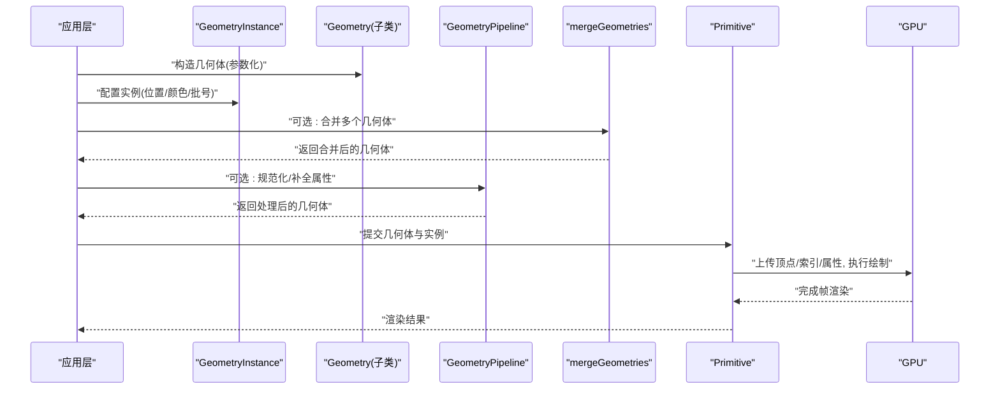
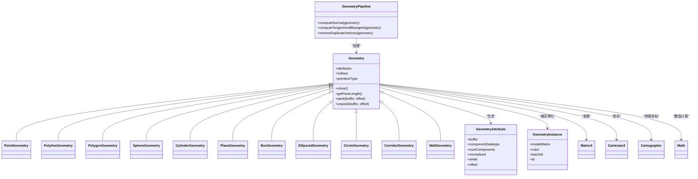

# 几何体类型

<cite>
**本文引用的文件**   
- [Geometry.js](file://Source/Core/Geometry.js)
- [PointGeometry.js](file://Source/Core/PointGeometry.js)
- [PolylineGeometry.js](file://Source/Core/PolylineGeometry.js)
- [PolygonGeometry.js](file://Source/Core/PolygonGeometry.js)
- [SphereGeometry.js](file://Source/Core/SphereGeometry.js)
- [CylinderGeometry.js](file://Source/Core/CylinderGeometry.js)
- [PlaneGeometry.js](file://Source/Core/PlaneGeometry.js)
- [BoxGeometry.js](file://Source/Core/BoxGeometry.js)
- [EllipsoidGeometry.js](file://Source/Core/EllipsoidGeometry.js)
- [CircleGeometry.js](file://Source/Core/CircleGeometry.js)
- [CorridorGeometry.js](file://Source/Core/CorridorGeometry.js)
- [WallGeometry.js](file://Source/Core/WallGeometry.js)
- [GroundPrimitive.js](file://Source/Core/GroundPrimitive.js)
- [Primitive.js](file://Source/Core/Primitive.js)
- [GeometryPipeline.js](file://Source/Core/GeometryPipeline.js)
- [mergeGeometries.js](file://Source/Core/mergeGeometries.js)
- [createGeometry.js](file://Source/Core/createGeometry.js)
- [packGeometry.js](file://Source/Core/packGeometry.js)
- [unpackGeometry.js](file://Source/Core/unpackGeometry.js)
- [GeometryAttribute.js](file://Source/Core/GeometryAttribute.js)
- [GeometryInstance.js](file://Source/Core/GeometryInstance.js)
- [Transforms.js](file://Source/Core/Transforms.js)
- [Matrix4.js](file://Source/Core/Matrix4.js)
- [Cartesian3.js](file://Source/Core/Cartesian3.js)
- [Cartesian2.js](file://Source/Core/Cartesian2.js)
- [Cartographic.js](file://Source/Core/Cartographic.js)
- [Math.js](file://Source/Core/Math.js)
</cite>

## 目录
1. [简介](#简介)
2. [项目结构](#项目结构)
3. [核心组件](#核心组件)
4. [架构总览](#架构总览)
5. [详细组件分析](#详细组件分析)
6. [依赖关系分析](#依赖关系分析)
7. [性能考虑](#性能考虑)
8. [故障排查指南](#故障排查指南)
9. [结论](#结论)
10. [附录](#附录)

## 简介
本技术文档聚焦于 Cesium 的几何体类型体系，系统阐述内置几何体的实现原理与使用方法，包括点、线、多边形、球体、圆柱体、平面等基础几何体。内容覆盖：
- 顶点数据、索引数据与法向量计算
- 变换矩阵应用与坐标系统转换
- 几何体合并优化与批量渲染机制
- 创建、样式设置与动画效果的实践路径
- 自定义几何体开发指南与性能优化建议

## 项目结构
Cesium 的几何体相关代码主要分布在 Source/Core 目录下，采用“按功能域组织”的方式：
- 几何体基类与管线：定义通用接口、打包/解包、合并与管线处理
- 具体几何体实现：每种几何体一个独立模块，提供参数化构造与属性生成
- 实例与属性：GeometryInstance 描述实例化信息；GeometryAttribute 描述顶点属性布局
- 数学与变换：Matrix4、Transforms、Cartesian*、Cartographic 等用于坐标与变换
- 渲染入口：Primitive 将几何体提交到 GPU；GroundPrimitive 支持贴地几何体

```mermaid
graph TB
subgraph "几何体基类与管线"
G["Geometry.js"]
GP["GeometryPipeline.js"]
MG["mergeGeometries.js"]
CG["createGeometry.js"]
PG["packGeometry.js"]
UG["unpackGeometry.js"]
end
subgraph "具体几何体"
PT["PointGeometry.js"]
PL["PolylineGeometry.js"]
PO["PolygonGeometry.js"]
SP["SphereGeometry.js"]
CY["CylinderGeometry.js"]
PLN["PlaneGeometry.js"]
BX["BoxGeometry.js"]
EL["EllipsoidGeometry.js"]
CR["CircleGeometry.js"]
CO["CorridorGeometry.js"]
WA["WallGeometry.js"]
end
subgraph "实例与属性"
GI["GeometryInstance.js"]
GA["GeometryAttribute.js"]
end
subgraph "数学与变换"
M4["Matrix4.js"]
TR["Transforms.js"]
C3["Cartesian3.js"]
C2["Cartesian2.js"]
CT["Cartographic.js"]
MATH["Math.js"]
end
subgraph "渲染入口"
PR["Primitive.js"]
GPR["GroundPrimitive.js"]
end
G --> PT
G --> PL
G --> PO
G --> SP
G --> CY
G --> PLN
G --> BX
G --> EL
G --> CR
G --> CO
G --> WA
GP --> G
MG --> G
CG --> G
PG --> G
UG --> G
GI --> G
GA --> G
PR --> G
GPR --> G
M4 --> G
TR --> G
C3 --> G
C2 --> G
CT --> G
MATH --> G
```

图表来源
- [Geometry.js](file://Source/Core/Geometry.js)
- [GeometryPipeline.js](file://Source/Core/GeometryPipeline.js)
- [mergeGeometries.js](file://Source/Core/mergeGeometries.js)
- [createGeometry.js](file://Source/Core/createGeometry.js)
- [packGeometry.js](file://Source/Core/packGeometry.js)
- [unpackGeometry.js](file://Source/Core/unpackGeometry.js)
- [PointGeometry.js](file://Source/Core/PointGeometry.js)
- [PolylineGeometry.js](file://Source/Core/PolylineGeometry.js)
- [PolygonGeometry.js](file://Source/Core/PolygonGeometry.js)
- [SphereGeometry.js](file://Source/Core/SphereGeometry.js)
- [CylinderGeometry.js](file://Source/Core/CylinderGeometry.js)
- [PlaneGeometry.js](file://Source/Core/PlaneGeometry.js)
- [BoxGeometry.js](file://Source/Core/BoxGeometry.js)
- [EllipsoidGeometry.js](file://Source/Core/EllipsoidGeometry.js)
- [CircleGeometry.js](file://Source/Core/CircleGeometry.js)
- [CorridorGeometry.js](file://Source/Core/CorridorGeometry.js)
- [WallGeometry.js](file://Source/Core/WallGeometry.js)
- [GeometryInstance.js](file://Source/Core/GeometryInstance.js)
- [GeometryAttribute.js](file://Source/Core/GeometryAttribute.js)
- [Matrix4.js](file://Source/Core/Matrix4.js)
- [Transforms.js](file://Source/Core/Transforms.js)
- [Cartesian3.js](file://Source/Core/Cartesian3.js)
- [Cartesian2.js](file://Source/Core/Cartesian2.js)
- [Cartographic.js](file://Source/Core/Cartographic.js)
- [Math.js](file://Source/Core/Math.js)
- [Primitive.js](file://Source/Core/Primitive.js)
- [GroundPrimitive.js](file://Source/Core/GroundPrimitive.js)

章节来源
- [Geometry.js](file://Source/Core/Geometry.js)
- [GeometryPipeline.js](file://Source/Core/GeometryPipeline.js)
- [mergeGeometries.js](file://Source/Core/mergeGeometries.js)
- [createGeometry.js](file://Source/Core/createGeometry.js)
- [packGeometry.js](file://Source/Core/packGeometry.js)
- [unpackGeometry.js](file://Source/Core/unpackGeometry.js)
- [PointGeometry.js](file://Source/Core/PointGeometry.js)
- [PolylineGeometry.js](file://Source/Core/PolylineGeometry.js)
- [PolygonGeometry.js](file://Source/Core/PolygonGeometry.js)
- [SphereGeometry.js](file://Source/Core/SphereGeometry.js)
- [CylinderGeometry.js](file://Source/Core/CylinderGeometry.js)
- [PlaneGeometry.js](file://Source/Core/PlaneGeometry.js)
- [BoxGeometry.js](file://Source/Core/BoxGeometry.js)
- [EllipsoidGeometry.js](file://Source/Core/EllipsoidGeometry.js)
- [CircleGeometry.js](file://Source/Core/CircleGeometry.js)
- [CorridorGeometry.js](file://Source/Core/CorridorGeometry.js)
- [WallGeometry.js](file://Source/Core/WallGeometry.js)
- [GeometryInstance.js](file://Source/Core/GeometryInstance.js)
- [GeometryAttribute.js](file://Source/Core/GeometryAttribute.js)
- [Matrix4.js](file://Source/Core/Matrix4.js)
- [Transforms.js](file://Source/Core/Transforms.js)
- [Cartesian3.js](file://Source/Core/Cartesian3.js)
- [Cartesian2.js](file://Source/Core/Cartesian2.js)
- [Cartographic.js](file://Source/Core/Cartographic.js)
- [Math.js](file://Source/Core/Math.js)
- [Primitive.js](file://Source/Core/Primitive.js)
- [GroundPrimitive.js](file://Source/Core/GroundPrimitive.js)

## 核心组件
- Geometry 基类
  - 职责：定义几何体通用数据结构（attributes、indices、primitiveType）、打包/解包协议、克隆与比较接口
  - 关键概念：attribute 名称与布局、primitiveType（点/线/三角面片）
- GeometryAttribute
  - 职责：描述单个顶点属性的缓冲区、数据类型、步长、偏移、归一化等
- GeometryInstance
  - 职责：为同一几何体提供实例化信息（位置、方向、缩放、颜色、批号等），支撑批量渲染
- GeometryPipeline
  - 职责：对几何体进行标准化处理（如补全法线、切线、纹理坐标、索引重排等）
- mergeGeometries
  - 职责：将多个几何体合并为一个，减少 draw call，提升批量渲染效率
- createGeometry / packGeometry / unpackGeometry
  - 职责：工厂式创建几何体、序列化与反序列化几何体，便于传输与缓存

章节来源
- [Geometry.js](file://Source/Core/Geometry.js)
- [GeometryAttribute.js](file://Source/Core/GeometryAttribute.js)
- [GeometryInstance.js](file://Source/Core/GeometryInstance.js)
- [GeometryPipeline.js](file://Source/Core/GeometryPipeline.js)
- [mergeGeometries.js](file://Source/Core/mergeGeometries.js)
- [createGeometry.js](file://Source/Core/createGeometry.js)
- [packGeometry.js](file://Source/Core/packGeometry.js)
- [unpackGeometry.js](file://Source/Core/unpackGeometry.js)

## 架构总览
下图展示从“几何体定义”到“GPU 渲染”的关键流程，以及各模块间的交互关系。

图表来源
- [Geometry.js](file://Source/Core/Geometry.js)
- [GeometryPipeline.js](file://Source/Core/GeometryPipeline.js)
- [mergeGeometries.js](file://Source/Core/mergeGeometries.js)
- [GeometryInstance.js](file://Source/Core/GeometryInstance.js)
- [Primitive.js](file://Source/Core/Primitive.js)

## 详细组件分析

### 点几何体 PointGeometry
- 用途：在三维空间中绘制离散点
- 顶点与索引：通常每个实例对应一个顶点，无索引或简单索引
- 法向量：点无需法向量
- 变换：通过实例的位置矩阵定位
- 常见用法：标记、散点图、轨迹点

章节来源
- [PointGeometry.js](file://Source/Core/PointGeometry.js)
- [GeometryInstance.js](file://Source/Core/GeometryInstance.js)
- [Matrix4.js](file://Source/Core/Matrix4.js)

### 线几何体 PolylineGeometry
- 用途：绘制折线、曲线段
- 顶点与索引：按线段顺序生成顶点，使用 GL_LINES 或 GL_LINE_STRIP
- 法向量：线不需要法向量；若需宽度/描边效果，由管线扩展
- 变换：整体平移/旋转/缩放
- 常见用法：路径、边界、连线

章节来源
- [PolylineGeometry.js](file://Source/Core/PolylineGeometry.js)
- [GeometryPipeline.js](file://Source/Core/GeometryPipeline.js)

### 多边形几何体 PolygonGeometry
- 用途：绘制带孔洞的多边形区域
- 顶点与索引：三角化后生成三角形索引
- 法向量：根据三角面片计算面法线
- 变换：局部坐标系到世界坐标系的变换
- 常见用法：区域高亮、行政区划、热力区

章节来源
- [PolygonGeometry.js](file://Source/Core/PolygonGeometry.js)
- [GeometryPipeline.js](file://Source/Core/GeometryPipeline.js)

### 球体几何体 SphereGeometry
- 用途：近似球体表面网格
- 顶点与索引：经纬度采样生成球面网格
- 法向量：单位半径下法向即顶点方向；非单位半径需归一化
- 变换：可叠加缩放、旋转、平移
- 常见用法：天体、气泡、体积可视化

章节来源
- [SphereGeometry.js](file://Source/Core/SphereGeometry.js)
- [Matrix4.js](file://Source/Core/Matrix4.js)

### 圆柱体几何体 CylinderGeometry
- 用途：绘制圆柱/圆锥
- 顶点与索引：沿轴向分段采样，顶部/底部扇形三角化
- 法向量：侧面法向垂直于径向；顶/底面法向沿轴向
- 变换：轴向对齐与缩放
- 常见用法：柱状图、管道、塔架

章节来源
- [CylinderGeometry.js](file://Source/Core/CylinderGeometry.js)
- [Matrix4.js](file://Source/Core/Matrix4.js)

### 平面几何体 PlaneGeometry
- 用途：二维平面片元
- 顶点与索引：矩形或指定范围的四边形三角化
- 法向量：固定为平面法向（如 Z 轴）
- 变换：平面法向与尺寸控制
- 常见用法：地面贴图、面板、指示牌

章节来源
- [PlaneGeometry.js](file://Source/Core/PlaneGeometry.js)
- [Matrix4.js](file://Source/Core/Matrix4.js)

### 立方体几何体 BoxGeometry
- 用途：六面体
- 顶点与索引：六个面的三角化索引
- 法向量：每面统一法向
- 变换：各向缩放与旋转
- 常见用法：方块、包围盒、建筑体块

章节来源
- [BoxGeometry.js](file://Source/Core/BoxGeometry.js)
- [Matrix4.js](file://Source/Core/Matrix4.js)

### 椭球体几何体 EllipsoidGeometry
- 用途：任意半轴的椭球
- 顶点与索引：基于球体采样并映射到椭球
- 法向量：需按半轴缩放后归一化
- 变换：可叠加额外变换
- 常见用法：地球模型、椭球体标注

章节来源
- [EllipsoidGeometry.js](file://Source/Core/EllipsoidGeometry.js)
- [Matrix4.js](file://Source/Core/Matrix4.js)

### 圆形几何体 CircleGeometry
- 用途：圆盘或环形
- 顶点与索引：极坐标采样三角化
- 法向量：垂直于圆面
- 变换：中心位置与半径控制
- 常见用法：雷达圈、选择区域

章节来源
- [CircleGeometry.js](file://Source/Core/CircleGeometry.js)
- [Matrix4.js](file://Source/Core/Matrix4.js)

### 走廊几何体 CorridorGeometry
- 用途：沿路径生成的带状区域
- 顶点与索引：路径采样+宽度拉伸三角化
- 法向量：侧壁与顶/底面分别计算
- 变换：路径整体变换
- 常见用法：道路、河流、管廊

章节来源
- [CorridorGeometry.js](file://Source/Core/CorridorGeometry.js)
- [GeometryPipeline.js](file://Source/Core/GeometryPipeline.js)

### 墙体几何体 WallGeometry
- 用途：沿路径生成的竖直墙面
- 顶点与索引：路径采样+高度拉伸三角化
- 法向量：侧墙法向垂直于路径切线与竖直方向
- 变换：路径与高度控制
- 常见用法：围栏、剖面墙

章节来源
- [WallGeometry.js](file://Source/Core/WallGeometry.js)
- [GeometryPipeline.js](file://Source/Core/GeometryPipeline.js)

### 贴地几何体 GroundPrimitive
- 用途：将几何体贴合地形起伏
- 关键点：在管线阶段将平面/多边形投影至地形高程
- 适用场景：大范围面片贴地、避免浮空

章节来源
- [GroundPrimitive.js](file://Source/Core/GroundPrimitive.js)
- [GeometryPipeline.js](file://Source/Core/GeometryPipeline.js)

### 渲染入口 Primitive
- 职责：接收几何体与实例，管理 GPU 资源，执行绘制
- 批量渲染：同材质/着色器的实例可合并批次，减少状态切换

章节来源
- [Primitive.js](file://Source/Core/Primitive.js)
- [GeometryInstance.js](file://Source/Core/GeometryInstance.js)

## 依赖关系分析
几何体模块之间的耦合与协作如下：
- 具体几何体均依赖 Geometry 基类与数学库（Matrix4、Cartesian*、Cartographic、Math）
- 管线与合并工具对几何体进行后处理与优化
- 实例与属性描述几何体如何被实例化与布局
- 渲染入口 Primitive 消费最终几何体数据

图表来源
- [Geometry.js](file://Source/Core/Geometry.js)
- [PointGeometry.js](file://Source/Core/PointGeometry.js)
- [PolylineGeometry.js](file://Source/Core/PolylineGeometry.js)
- [PolygonGeometry.js](file://Source/Core/PolygonGeometry.js)
- [SphereGeometry.js](file://Source/Core/SphereGeometry.js)
- [CylinderGeometry.js](file://Source/Core/CylinderGeometry.js)
- [PlaneGeometry.js](file://Source/Core/PlaneGeometry.js)
- [BoxGeometry.js](file://Source/Core/BoxGeometry.js)
- [EllipsoidGeometry.js](file://Source/Core/EllipsoidGeometry.js)
- [CircleGeometry.js](file://Source/Core/CircleGeometry.js)
- [CorridorGeometry.js](file://Source/Core/CorridorGeometry.js)
- [WallGeometry.js](file://Source/Core/WallGeometry.js)
- [GeometryAttribute.js](file://Source/Core/GeometryAttribute.js)
- [GeometryInstance.js](file://Source/Core/GeometryInstance.js)
- [GeometryPipeline.js](file://Source/Core/GeometryPipeline.js)
- [Matrix4.js](file://Source/Core/Matrix4.js)
- [Cartesian3.js](file://Source/Core/Cartesian3.js)
- [Cartographic.js](file://Source/Core/Cartographic.js)
- [Math.js](file://Source/Core/Math.js)

章节来源
- [Geometry.js](file://Source/Core/Geometry.js)
- [GeometryPipeline.js](file://Source/Core/GeometryPipeline.js)
- [mergeGeometries.js](file://Source/Core/mergeGeometries.js)
- [GeometryAttribute.js](file://Source/Core/GeometryAttribute.js)
- [GeometryInstance.js](file://Source/Core/GeometryInstance.js)
- [Matrix4.js](file://Source/Core/Matrix4.js)
- [Cartesian3.js](file://Source/Core/Cartesian3.js)
- [Cartographic.js](file://Source/Core/Cartographic.js)
- [Math.js](file://Source/Core/Math.js)

## 性能考虑
- 合并几何体
  - 使用合并工具将多个相同材质的几何体合并，显著降低 draw call
  - 注意合并前后索引与属性的连续性
- 批量渲染
  - 合理设置实例的 batchId，使相同材质/着色器状态的实例进入同一批次
  - 避免频繁切换材质或状态
- 属性精简
  - 仅启用必要属性（如不需要法线时关闭）
  - 使用合适的 componentDatatype 与 stride/offset 布局
- 管线优化
  - 利用管线工具自动补全缺失属性，减少运行时开销
- 贴地与地形
  - 大范围贴地几何体优先使用 GroundPrimitive，避免逐点地形查询

[本节为通用性能指导，不直接分析具体文件]

## 故障排查指南
- 几何体未显示
  - 检查 primitiveType 是否与期望一致（点/线/三角面片）
  - 确认 indices 与 attributes 长度匹配
- 法线异常导致光照错误
  - 使用管线工具计算法线
  - 对于非均匀缩放，需重新计算法线或使用切线空间
- 贴地几何体浮空或穿透地形
  - 使用 GroundPrimitive 并确保地形数据可用
- 合并后渲染错位
  - 检查合并前各几何体的局部坐标系与变换矩阵
  - 确保合并后索引连续且无重复顶点冲突

章节来源
- [GeometryPipeline.js](file://Source/Core/GeometryPipeline.js)
- [mergeGeometries.js](file://Source/Core/mergeGeometries.js)
- [GroundPrimitive.js](file://Source/Core/GroundPrimitive.js)

## 结论
Cesium 的几何体体系以 Geometry 基类为核心，结合实例化与管线工具，提供了高效、可扩展的几何构建与渲染能力。通过合理的合并与批量策略、正确的坐标与变换处理，以及必要的法线与属性补全，可以在保证视觉效果的同时获得良好的性能表现。

[本节为总结性内容，不直接分析具体文件]

## 附录

### 坐标系统与变换矩阵
- 常用坐标
  - Cartesian3：笛卡尔三维坐标
  - Cartographic：经纬高地理坐标
- 变换矩阵
  - Matrix4：4x4 齐次变换矩阵，支持平移、旋转、缩放
  - Transforms：提供 WGS84 与 ECEF 等坐标转换工具
- 典型流程
  - 在局部坐标系中生成几何体
  - 通过 modelMatrix 将局部坐标变换到世界坐标
  - 必要时在管线阶段进行法线/切线计算

章节来源
- [Cartesian3.js](file://Source/Core/Cartesian3.js)
- [Cartographic.js](file://Source/Core/Cartographic.js)
- [Matrix4.js](file://Source/Core/Matrix4.js)
- [Transforms.js](file://Source/Core/Transforms.js)

### 示例与实践路径
- 创建几何体
  - 参考各几何体模块的参数化构造方式
- 设置样式
  - 通过实例的颜色、透明度、批号等属性控制外观
- 动画效果
  - 在每一帧更新实例的 modelMatrix 或属性缓冲，触发重绘
- 自定义几何体
  - 继承 Geometry 基类，实现 attributes、indices、primitiveType 与打包/解包方法
  - 使用 GeometryPipeline 工具补全缺失属性
  - 通过 mergeGeometries 与其他几何体合并以提升性能

章节来源
- [PointGeometry.js](file://Source/Core/PointGeometry.js)
- [PolylineGeometry.js](file://Source/Core/PolylineGeometry.js)
- [PolygonGeometry.js](file://Source/Core/PolygonGeometry.js)
- [SphereGeometry.js](file://Source/Core/SphereGeometry.js)
- [CylinderGeometry.js](file://Source/Core/CylinderGeometry.js)
- [PlaneGeometry.js](file://Source/Core/PlaneGeometry.js)
- [BoxGeometry.js](file://Source/Core/BoxGeometry.js)
- [EllipsoidGeometry.js](file://Source/Core/EllipsoidGeometry.js)
- [CircleGeometry.js](file://Source/Core/CircleGeometry.js)
- [CorridorGeometry.js](file://Source/Core/CorridorGeometry.js)
- [WallGeometry.js](file://Source/Core/WallGeometry.js)
- [Geometry.js](file://Source/Core/Geometry.js)
- [GeometryPipeline.js](file://Source/Core/GeometryPipeline.js)
- [mergeGeometries.js](file://Source/Core/mergeGeometries.js)