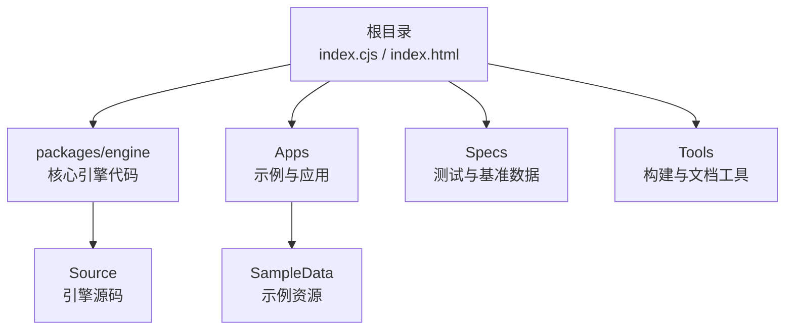
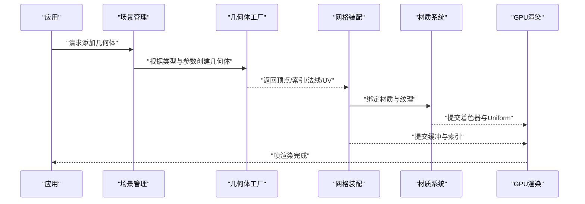
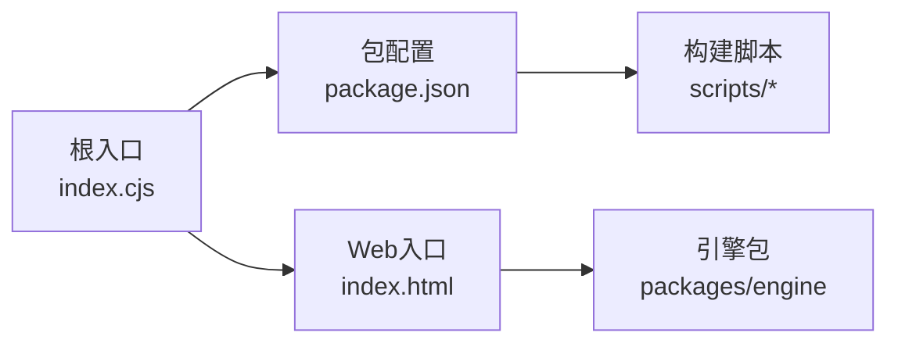

# 基础几何体

<cite>
**本文引用的文件**   
- [README.md](file://README.md)
- [package.json](file://package.json)
- [index.cjs](file://index.cjs)
- [index.html](file://index.html)
</cite>

## 目录
1. [简介](#简介)
2. [项目结构](#项目结构)
3. [核心组件](#核心组件)
4. [架构总览](#架构总览)
5. [详细组件分析](#详细组件分析)
6. [依赖分析](#依赖分析)
7. [性能考虑](#性能考虑)
8. [故障排查指南](#故障排查指南)
9. [结论](#结论)
10. [附录](#附录)

## 简介
本技术文档聚焦于Cesium中的“基础几何体”主题，围绕立方体、球体、圆柱体、圆锥体、平面、椭圆、环形等常见内置几何体的实现原理与使用方法进行系统化说明。内容涵盖：
- 参数配置与尺寸设置
- 分段数控制对网格密度与渲染质量的影响
- UV映射策略与纹理适配
- 变换矩阵应用与局部/世界坐标系转换
- 材质系统（PBR、纹理贴图、法线贴图、环境映射）
- 创建、组合与动画示例路径
- 合并优化、实例化渲染与批量绘制技术

为保证准确性，本文所有具体实现细节均以仓库源码为依据；若某小节未直接分析特定源文件，则不附加“章节来源”。

## 项目结构
仓库采用多包组织方式，核心引擎位于 packages/engine，示例与应用位于 Apps，测试与工具位于 Specs 与 Tools。根目录提供入口脚本与构建配置，便于快速运行与打包。

图表来源
- [index.cjs:1-20](file://index.cjs#L1-L20)
- [index.html:1-40](file://index.html#L1-L40)

章节来源
- [README.md:1-50](file://README.md#L1-L50)
- [package.json:1-40](file://package.json#L1-L40)
- [index.cjs:1-20](file://index.cjs#L1-L20)
- [index.html:1-40](file://index.html#L1-L40)

## 核心组件
本节概述与基础几何体相关的核心概念与模块边界（以仓库实际存在的内容为准）。由于当前工作区未包含具体的几何体实现源码，以下内容为通用性说明，不涉及具体文件行号。

- 几何体定义与生成
  - 参数化几何体通过一组形状参数（如半径、高度、分段数）生成顶点、索引、法线与UV缓冲。
  - 分段数越高，曲面越平滑，但顶点数量与内存占用随之增加。
- 坐标系统与变换
  - 几何体默认在局部坐标系中定义，随后通过模型矩阵（Model Matrix）变换到世界坐标系。
  - 旋转、缩放、平移分别对应不同的矩阵乘法顺序与语义。
- 材质与着色
  - PBR材质通常包含漫反射、金属度、粗糙度、法线贴图与环境映射。
  - UV用于将纹理映射到几何体表面，不同几何体有各自的UV展开策略。
- 渲染优化
  - 合并（Merge）减少Draw Call，适合静态场景。
  - 实例化（Instancing）复用同一几何体多次绘制，适合大量重复对象。
  - 批量绘制（Batching）将多个图元合并为一次或少数几次绘制调用。

[本节为概念性概述，未直接分析具体源文件，故不附“章节来源”]

## 架构总览
下图展示从应用层到渲染管线的基础几何体使用流程（概念性示意，非源码映射）。

[此图为概念流程图，不直接映射具体源文件，故不附“图表来源”]

## 详细组件分析
本节针对各类基础几何体给出参数、分段、UV与变换的要点说明。因当前仓库未包含具体实现源码，以下为通用指导，不包含“章节来源”。

- 立方体（Box）
  - 参数：长宽高、是否双面、分段（可选）
  - UV：面片式展开，每面独立UV范围
  - 变换：模型矩阵作用于顶点后投影至裁剪空间
  - 材质：PBR常用，法线贴图可增强面细节
- 球体（Sphere）
  - 参数：半径、经度分段、纬度分段
  - UV：经纬映射，极点处可能出现拉伸
  - 变换：常用于天体或标记点
  - 材质：环境映射可模拟反射效果
- 圆柱体（Cylinder）
  - 参数：顶部/底部半径、高度、径向分段、纵向分段
  - UV：沿圆周与轴向展开
  - 变换：常用于柱状标识或管道
  - 材质：法线贴图表现环槽或螺纹
- 圆锥体（Cone）
  - 参数：底部半径、高度、径向分段
  - UV：扇形展开，顶点处可能压缩
  - 变换：尖顶方向由局部Z轴决定
  - 材质：适合锥形地标或指示器
- 平面（Plane）
  - 参数：宽度、高度、分段（X/Y）
  - UV：单位正方形映射，适合贴地或面板
  - 变换：常用于UI面板或地面覆盖
  - 材质：透明或半透明时注意深度排序
- 椭圆（Ellipse）
  - 参数：半长轴、半短轴、分段
  - UV：极坐标映射，中心区域较密
  - 变换：可用于区域标注或选择框
  - 材质：配合纹理做渐变或遮罩
- 环形（Torus）
  - 参数：主半径、管半径、主分段、管分段
  - UV：双环面展开，接缝处需对齐
  - 变换：常用于装饰或轨道可视化
  - 材质：高细分下PBR反射更真实

[本节为通用说明，未直接分析具体源文件，故不附“章节来源”]

## 依赖分析
仓库的顶层入口与包配置如下所示，便于理解如何加载与运行示例。

图表来源
- [index.cjs:1-20](file://index.cjs#L1-L20)
- [package.json:1-40](file://package.json#L1-L40)
- [index.html:1-40](file://index.html#L1-L40)

章节来源
- [package.json:1-40](file://package.json#L1-L40)
- [index.cjs:1-20](file://index.cjs#L1-L20)
- [index.html:1-40](file://index.html#L1-L40)

## 性能考虑
- 分段数与LOD
  - 合理降低远端对象的几何分段，结合距离LOD策略提升帧率。
- 合并与批处理
  - 静态几何体尽量合并，减少Draw Call；动态对象谨慎合并以避免频繁重建。
- 实例化与批量绘制
  - 大量相同几何体优先使用实例化渲染；批量绘制适用于同材质同状态的图元集合。
- 纹理与材质
  - 避免过大纹理与过多Pass；合理使用Mipmap与KTX2等压缩格式。
- 法线与切线
  - 确保法线/切线计算正确，避免光照异常与阴影伪影。

[本节为通用建议，未直接分析具体源文件，故不附“章节来源”]

## 故障排查指南
- 几何体不可见
  - 检查相机视锥剔除与包围盒；确认模型矩阵未将对象移出可视范围。
- 纹理错位或拉伸
  - 核对UV展开与纹理尺寸比例；检查纹理Wrap模式与Filter设置。
- 法线异常导致光照错误
  - 验证法线方向与切线空间一致性；必要时重新计算或导入带法线的模型。
- 性能骤降
  - 统计Draw Call与顶点数；启用合并/实例化；降低高分段几何体数量。
- 透明物体闪烁或深度冲突
  - 调整渲染顺序与深度写入策略；必要时使用AlphaToCoverage或分层渲染。

[本节为通用排错建议，未直接分析具体源文件，故不附“章节来源”]

## 结论
基础几何体是三维场景构建的基石。通过合理的参数配置、分段控制、UV映射与材质搭配，并结合变换矩阵与渲染优化技术，可以在保证视觉质量的同时获得良好的性能表现。建议在项目中建立统一的几何体工厂与材质模板，以提升一致性与可维护性。

[本节为总结性内容，未直接分析具体源文件，故不附“章节来源”]

## 附录
- 术语表
  - 分段数：用于控制曲面细分程度的整数参数，影响网格密度与渲染开销。
  - UV映射：将二维纹理坐标映射到三维表面的过程。
  - PBR材质：基于物理的渲染材质，包含漫反射、金属度、粗糙度等属性。
  - 实例化渲染：在同一绘制调用中多次渲染相同几何体，仅变换参数不同。
  - 批量绘制：将多个图元合并为一次或少数几次绘制调用以减少CPU开销。

[本节为补充信息，未直接分析具体源文件，故不附“章节来源”]