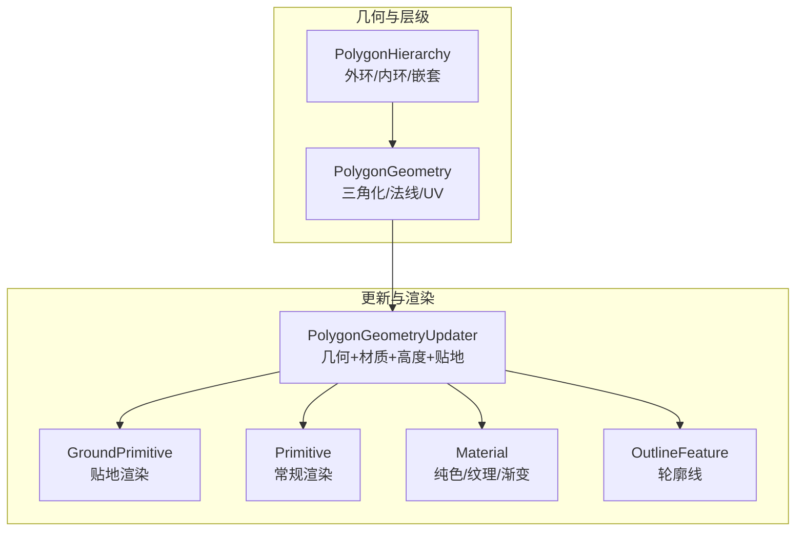
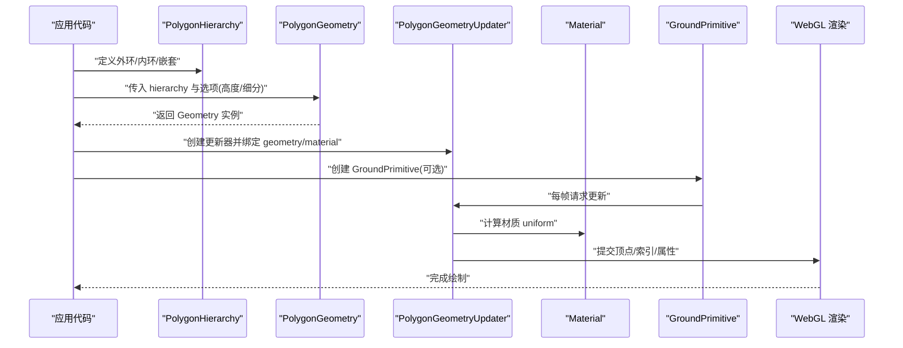
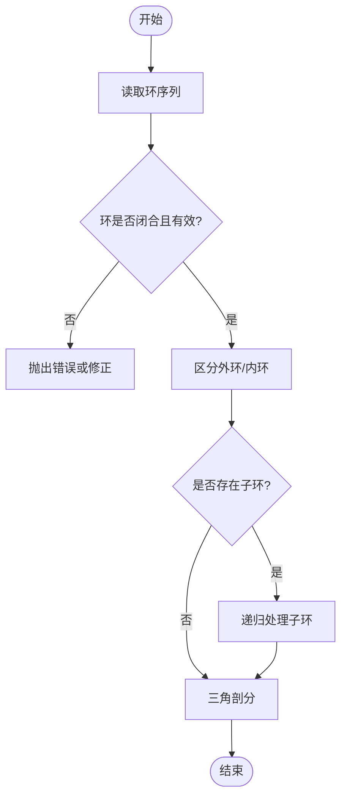
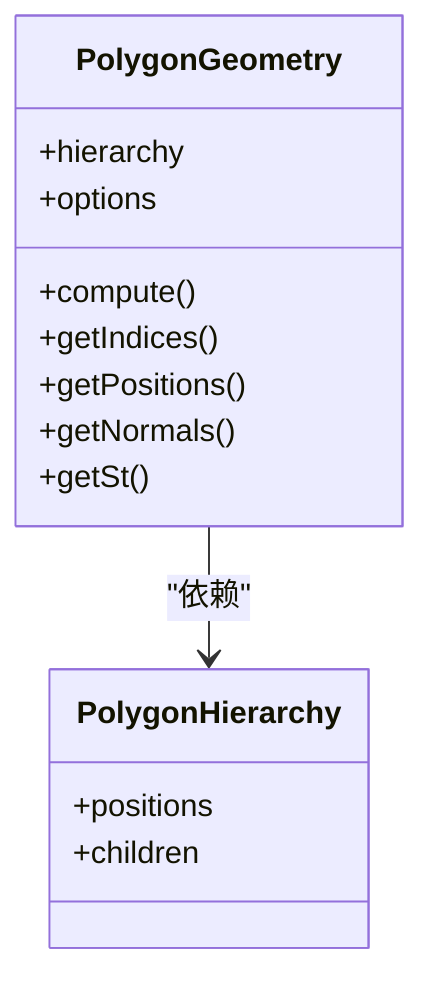
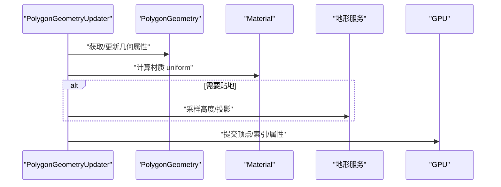
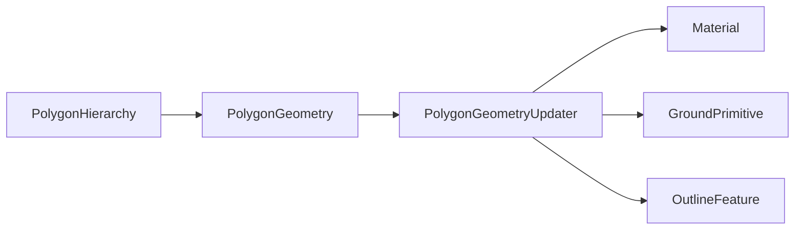

# 多边形几何体

<cite>
**本文引用的文件**   
- [PolygonGeometry.js](file://Source/Core/PolygonGeometry.js)
- [PolygonHierarchy.js](file://Source/Core/PolygonHierarchy.js)
- [GroundPrimitive.js](file://Source/Scene/GroundPrimitive.js)
- [Material.js](file://Source/Scene/Material.js)
- [OutlineFeature.js](file://Source/Scene/OutlineFeature.js)
- [PolygonGeometryUpdater.js](file://Source/Scene/PolygonGeometryUpdater.js)
- [createPolygonGeometry.js](file://Apps/Sandcastle/examples/createPolygonGeometry.js)
- [polygonHoles.js](file://Apps/Sandcastle/examples/polygonHoles.js)
- [polygonExtruded.js](file://Apps/Sandcastle/examples/polygonExtruded.js)
- [polygonClampToGround.js](file://Apps/Sandcastle/examples/polygonClampToGround.js)
</cite>

## 目录
1. [简介](#简介)
2. [项目结构](#项目结构)
3. [核心组件](#核心组件)
4. [架构总览](#架构总览)
5. [详细组件分析](#详细组件分析)
6. [依赖关系分析](#依赖关系分析)
7. [性能考虑](#性能考虑)
8. [故障排查指南](#故障排查指南)
9. [结论](#结论)
10. [附录](#附录)

## 简介
本技术文档聚焦于 Cesium 中的多边形几何体，围绕 PolygonGeometry 与 PolygonHierarchy 的实现原理、数据结构与使用方式展开。内容涵盖：
- 顶点坐标定义、孔洞处理、嵌套多边形与复杂形状构建
- 填充样式：纯色、纹理贴图、渐变与材质属性
- 三维效果：高度拉伸、地形贴合、轮廓线与边框设置
- 丰富示例路径与最佳实践
- 复杂多边形的性能优化与渲染效率提升建议

## 项目结构
Cesium 的多边形相关能力由“几何体定义 + 几何层级描述 + 更新器 + 场景图元”共同构成：
- 几何体定义：PolygonGeometry 负责将平面多边形（含孔洞）转换为可渲染的三角形网格
- 几何层级：PolygonHierarchy 用于表达外环与内环（孔洞）、以及嵌套多边形
- 更新器：PolygonGeometryUpdater 将几何体与材质、高度、贴地等参数绑定到 GPU
- 场景图元：GroundPrimitive 提供贴地渲染能力；普通 Primitive 用于非贴地场景
- 材质系统：Material 提供纯色、纹理、渐变等填充效果
- 轮廓线：OutlineFeature 支持为几何体添加统一风格的轮廓边

图示来源
- [PolygonGeometry.js](file://Source/Core/PolygonGeometry.js)
- [PolygonHierarchy.js](file://Source/Core/PolygonHierarchy.js)
- [PolygonGeometryUpdater.js](file://Source/Scene/PolygonGeometryUpdater.js)
- [GroundPrimitive.js](file://Source/Scene/GroundPrimitive.js)
- [Material.js](file://Source/Scene/Material.js)
- [OutlineFeature.js](file://Source/Scene/OutlineFeature.js)

章节来源
- [PolygonGeometry.js](file://Source/Core/PolygonGeometry.js)
- [PolygonHierarchy.js](file://Source/Core/PolygonHierarchy.js)
- [PolygonGeometryUpdater.js](file://Source/Scene/PolygonGeometryUpdater.js)
- [GroundPrimitive.js](file://Source/Scene/GroundPrimitive.js)
- [Material.js](file://Source/Scene/Material.js)
- [OutlineFeature.js](file://Source/Scene/OutlineFeature.js)

## 核心组件
本节从数据模型、算法流程与渲染管线角度解析多边形几何体的关键实现。

- PolygonHierarchy
  - 作用：描述一个或多个多边形环（外环/内环），支持嵌套与孔洞
  - 关键点：外环逆时针、内环顺时针（或反之，取决于坐标系约定）；通过 children 字段组织嵌套
  - 复杂度：遍历与拓扑校验通常为 O(V+E)，V 为顶点数，E 为边数
  - 典型用法：构造包含多个孔洞与子区域的多边形

- PolygonGeometry
  - 作用：将 PolygonHierarchy 描述的二维多边形三角化为 GPU 可用的索引缓冲与顶点缓冲
  - 关键点：扇形三角化或带孔洞的耳切/蒙版策略；生成法线、纹理坐标、可选的高度拉伸与细分
  - 输出：position、normal、st、indices 等属性；支持 per-instance 高度与厚度
  - 性能：顶点数量与三角面数随顶点数线性增长；孔洞与嵌套会增加三角剖分开销

- PolygonGeometryUpdater
  - 作用：将 PolygonGeometry 与材质、高度、贴地、轮廓线等运行时参数组合并推送到 GPU
  - 关键点：根据 height、extrudedHeight、perPositionHeight、clampToGround 等选项动态更新几何与着色
  - 与材质系统联动：Material 决定填充外观（纯色、纹理、渐变等）

- GroundPrimitive
  - 作用：在地球表面进行贴地渲染，自动处理地形起伏与遮挡
  - 关键点：内部对几何进行地形采样与投影，适合大范围地图覆盖

- Material
  - 作用：定义多边形表面的视觉样式
  - 特性：颜色、透明度、纹理、重复、偏移、旋转、缩放、混合模式、自定义片段逻辑等

- OutlineFeature
  - 作用：为几何体绘制统一的轮廓边，常用于高亮选中状态
  - 特性：颜色、宽度、深度测试行为、抗锯齿等

章节来源
- [PolygonHierarchy.js](file://Source/Core/PolygonHierarchy.js)
- [PolygonGeometry.js](file://Source/Core/PolygonGeometry.js)
- [PolygonGeometryUpdater.js](file://Source/Scene/PolygonGeometryUpdater.js)
- [GroundPrimitive.js](file://Source/Scene/GroundPrimitive.js)
- [Material.js](file://Source/Scene/Material.js)
- [OutlineFeature.js](file://Source/Scene/OutlineFeature.js)

## 架构总览
下图展示了从“多边形层级”到“GPU 渲染”的完整链路，包括几何生成、更新器绑定、材质应用与贴地处理。

图示来源
- [PolygonHierarchy.js](file://Source/Core/PolygonHierarchy.js)
- [PolygonGeometry.js](file://Source/Core/PolygonGeometry.js)
- [PolygonGeometryUpdater.js](file://Source/Scene/PolygonGeometryUpdater.js)
- [GroundPrimitive.js](file://Source/Scene/GroundPrimitive.js)
- [Material.js](file://Source/Scene/Material.js)

## 详细组件分析

### PolygonHierarchy：多边形层级与孔洞
- 数据结构
  - positions：二维点序列，表示一个环
  - children：子环数组，表示嵌套多边形或孔洞
- 规则与约束
  - 外环与内环方向需符合约定（通常外环逆时针、内环顺时针）
  - 自相交或退化环会导致三角剖分失败或异常
- 常见模式
  - 单环：简单多边形
  - 多环：带孔洞
  - 嵌套：children 中再包含 children，形成多层区域

图示来源
- [PolygonHierarchy.js](file://Source/Core/PolygonHierarchy.js)

章节来源
- [PolygonHierarchy.js](file://Source/Core/PolygonHierarchy.js)

### PolygonGeometry：三角化与属性生成
- 输入
  - hierarchy：PolygonHierarchy
  - options：height、extrudedHeight、perPositionHeight、vertexFormat、arcType 等
- 处理流程
  - 验证与规范化环序列
  - 三角剖分（扇形/蒙版/耳切等策略）
  - 生成 position、normal、st、indices
  - 若启用 extrudedHeight，则复制上层顶点生成底部面
- 输出
  - Geometry 对象，供更新器与图元使用

图示来源
- [PolygonGeometry.js](file://Source/Core/PolygonGeometry.js)
- [PolygonHierarchy.js](file://Source/Core/PolygonHierarchy.js)

章节来源
- [PolygonGeometry.js](file://Source/Core/PolygonGeometry.js)

### PolygonGeometryUpdater：几何与材质的运行时绑定
- 职责
  - 将 geometry、material、height、extrudedHeight、perPositionHeight、clampToGround 等参数组合
  - 每帧按需更新 GPU 资源
- 关键点
  - 当 clampToGround 为真时，结合地形服务进行投影
  - 材质变化触发重新编译或更新 uniform
  - 轮廓线通过 OutlineFeature 叠加绘制

图示来源
- [PolygonGeometryUpdater.js](file://Source/Scene/PolygonGeometryUpdater.js)
- [Material.js](file://Source/Scene/Material.js)
- [GroundPrimitive.js](file://Source/Scene/GroundPrimitive.js)

章节来源
- [PolygonGeometryUpdater.js](file://Source/Scene/PolygonGeometryUpdater.js)
- [Material.js](file://Source/Scene/Material.js)
- [GroundPrimitive.js](file://Source/Scene/GroundPrimitive.js)

### 填充样式与材质
- 纯色填充
  - 使用基础颜色与透明度控制
- 纹理贴图
  - 支持重复、偏移、旋转、缩放与混合模式
- 渐变效果
  - 通过材质脚本或内置渐变类型实现
- 材质属性
  - 高光、粗糙度、金属度（PBR 材质）
  - 自定义片段逻辑扩展外观

章节来源
- [Material.js](file://Source/Scene/Material.js)

### 3D 效果：高度拉伸、贴地与轮廓
- 高度拉伸
  - extrudedHeight：整体拉伸厚度
  - perPositionHeight：逐顶点高度，适合不规则地形表面
- 地形贴合
  - clampToGround：使多边形贴合地形起伏
- 轮廓线与边框
  - OutlineFeature：统一风格的高亮边框，支持颜色、宽度、深度测试

章节来源
- [PolygonGeometry.js](file://Source/Core/PolygonGeometry.js)
- [PolygonGeometryUpdater.js](file://Source/Scene/PolygonGeometryUpdater.js)
- [OutlineFeature.js](file://Source/Scene/OutlineFeature.js)
- [GroundPrimitive.js](file://Source/Scene/GroundPrimitive.js)

### 示例与用法路径
以下为仓库中与多边形相关的示例路径，可用于快速上手与参考：
- 基础多边形创建与样式
  - [createPolygonGeometry.js](file://Apps/Sandcastle/examples/createPolygonGeometry.js)
- 带孔洞的多边形
  - [polygonHoles.js](file://Apps/Sandcastle/examples/polygonHoles.js)
- 高度拉伸的多边形
  - [polygonExtruded.js](file://Apps/Sandcastle/examples/polygonExtruded.js)
- 贴地多边形
  - [polygonClampToGround.js](file://Apps/Sandcastle/examples/polygonClampToGround.js)

章节来源
- [createPolygonGeometry.js](file://Apps/Sandcastle/examples/createPolygonGeometry.js)
- [polygonHoles.js](file://Apps/Sandcastle/examples/polygonHoles.js)
- [polygonExtruded.js](file://Apps/Sandcastle/examples/polygonExtruded.js)
- [polygonClampToGround.js](file://Apps/Sandcastle/examples/polygonClampToGround.js)

## 依赖关系分析
- 组件耦合
  - PolygonGeometry 强依赖 PolygonHierarchy 的拓扑信息
  - PolygonGeometryUpdater 聚合 Geometry、Material、地形与轮廓线
  - GroundPrimitive 作为渲染入口，驱动更新器与地形交互
- 外部依赖
  - WebGL 上下文与 GPU 管线
  - 地形服务（如 Cesium World Terrain）
- 潜在循环依赖
  - 更新器与材质之间为单向依赖，避免循环
- 接口契约
  - Geometry 的属性集合（position、normal、st、indices）
  - Material 的 uniform 与 shader 接口

图示来源
- [PolygonGeometry.js](file://Source/Core/PolygonGeometry.js)
- [PolygonHierarchy.js](file://Source/Core/PolygonHierarchy.js)
- [PolygonGeometryUpdater.js](file://Source/Scene/PolygonGeometryUpdater.js)
- [GroundPrimitive.js](file://Source/Scene/GroundPrimitive.js)
- [Material.js](file://Source/Scene/Material.js)
- [OutlineFeature.js](file://Source/Scene/OutlineFeature.js)

章节来源
- [PolygonGeometry.js](file://Source/Core/PolygonGeometry.js)
- [PolygonHierarchy.js](file://Source/Core/PolygonHierarchy.js)
- [PolygonGeometryUpdater.js](file://Source/Scene/PolygonGeometryUpdater.js)
- [GroundPrimitive.js](file://Source/Scene/GroundPrimitive.js)
- [Material.js](file://Source/Scene/Material.js)
- [OutlineFeature.js](file://Source/Scene/OutlineFeature.js)

## 性能考虑
- 几何简化
  - 减少顶点数量，合并相邻小面，避免过细的局部细节
- 三角剖分优化
  - 尽量保证环顺序正确，避免自相交与退化环
- 批量与实例化
  - 大量相似多边形建议使用实例化或批处理，降低 draw call
- 贴地成本
  - clampToGround 会引入地形采样与投影，注意在大范围或多实例时的开销
- 材质与纹理
  - 复用纹理图集，减少纹理切换；合理设置 mipmap 与压缩格式
- 轮廓线
  - OutlineFeature 额外绘制，仅在需要时开启，避免全局高开销
- 更新频率
  - 静态多边形一次性生成几何；动态多边形按需增量更新

[本节为通用指导，不直接分析具体文件]

## 故障排查指南
- 多边形未显示或出现空洞异常
  - 检查环的方向与闭合性；确认无自相交或退化边
  - 参考示例：[polygonHoles.js](file://Apps/Sandcastle/examples/polygonHoles.js)
- 贴地后出现闪烁或穿透
  - 调整贴地容差与深度偏移；检查地形精度与服务可用性
  - 参考示例：[polygonClampToGround.js](file://Apps/Sandcastle/examples/polygonClampToGround.js)
- 拉伸高度不正确
  - 确认 extrudedHeight 与 perPositionHeight 的使用场景与优先级
  - 参考示例：[polygonExtruded.js](file://Apps/Sandcastle/examples/polygonExtruded.js)
- 材质不生效或闪烁
  - 检查材质 uniform 更新时机与纹理加载状态
  - 参考：[Material.js](file://Source/Scene/Material.js)
- 轮廓线缺失或错位
  - 确认 OutlineFeature 配置与深度测试设置
  - 参考：[OutlineFeature.js](file://Source/Scene/OutlineFeature.js)

章节来源
- [polygonHoles.js](file://Apps/Sandcastle/examples/polygonHoles.js)
- [polygonClampToGround.js](file://Apps/Sandcastle/examples/polygonClampToGround.js)
- [polygonExtruded.js](file://Apps/Sandcastle/examples/polygonExtruded.js)
- [Material.js](file://Source/Scene/Material.js)
- [OutlineFeature.js](file://Source/Scene/OutlineFeature.js)

## 结论
Cesium 的多边形几何体系以 PolygonHierarchy 描述拓扑、PolygonGeometry 完成三角化、PolygonGeometryUpdater 负责运行时绑定与渲染。通过合理的层级设计、材质选择与贴地策略，可以在保证视觉效果的同时获得良好的性能表现。对于大规模复杂多边形，建议采用几何简化、实例化与纹理复用等手段进一步优化。

[本节为总结性内容，不直接分析具体文件]

## 附录
- 术语
  - 外环：多边形的外部边界
  - 内环：多边形内部的孔洞边界
  - 贴地：将多边形投影到地形表面
  - 拉伸：沿垂直方向增加厚度
- 参考示例路径
  - [createPolygonGeometry.js](file://Apps/Sandcastle/examples/createPolygonGeometry.js)
  - [polygonHoles.js](file://Apps/Sandcastle/examples/polygonHoles.js)
  - [polygonExtruded.js](file://Apps/Sandcastle/examples/polygonExtruded.js)
  - [polygonClampToGround.js](file://Apps/Sandcastle/examples/polygonClampToGround.js)

[本节为补充说明，不直接分析具体文件]