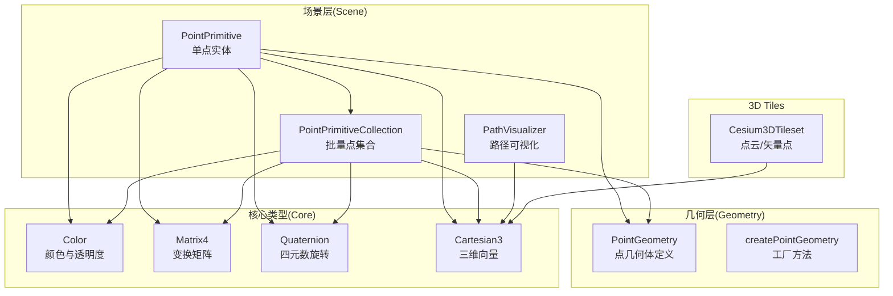
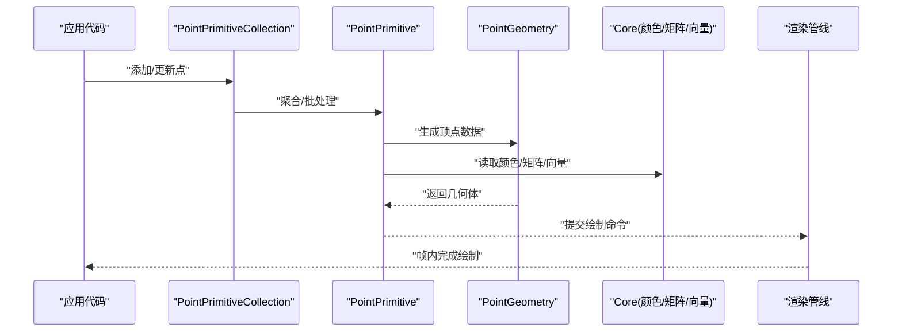
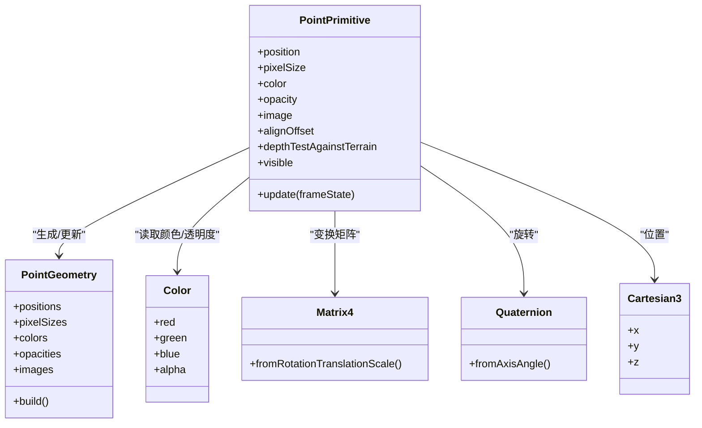
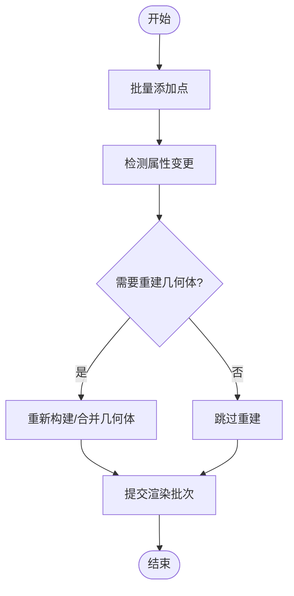
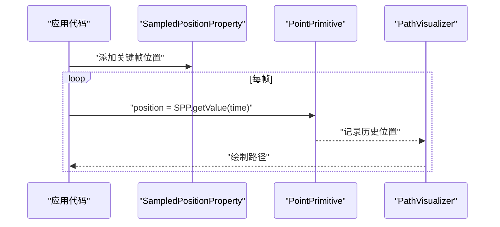
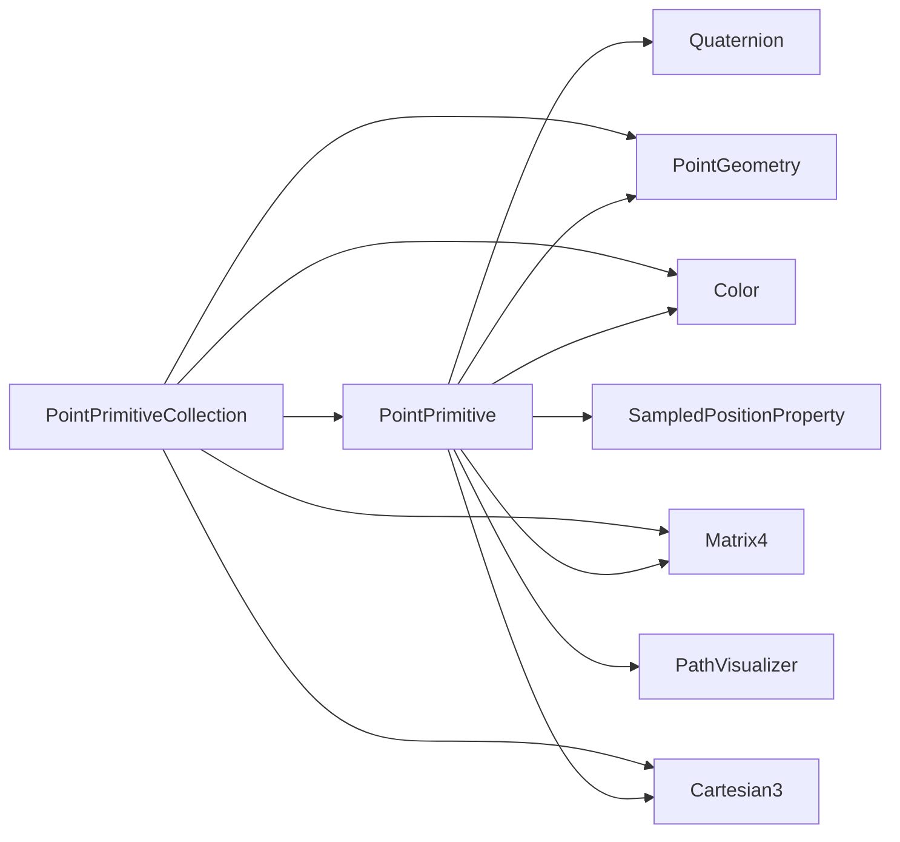

# 点几何体

<cite>
**本文引用的文件**   
- [PointPrimitive.js](file://Source/Scene/PointPrimitive.js)
- [PointPrimitiveCollection.js](file://Source/Scene/PointPrimitiveCollection.js)
- [PointGeometry.js](file://Source/Geometry/PointGeometry.js)
- [createPointGeometry.js](file://Source/Geometry/createPointGeometry.js)
- [Color.js](file://Source/Core/Color.js)
- [Matrix4.js](file://Source/Core/Matrix4.js)
- [Quaternion.js](file://Source/Core/Quaternion.js)
- [Cartesian3.js](file://Source/Core/Cartesian3.js)
- [Cesium3DTileset.js](file://Source/Scene/Cesium3DTileset.js)
- [SampledPositionProperty.js](file://Source/Core/SampledPositionProperty.js)
- [PathVisualizer.js](file://Source/Scene/PathVisualizer.js)
</cite>

## 目录
1. [简介](#简介)
2. [项目结构](#项目结构)
3. [核心组件](#核心组件)
4. [架构总览](#架构总览)
5. [详细组件分析](#详细组件分析)
6. [依赖关系分析](#依赖关系分析)
7. [性能考虑](#性能考虑)
8. [故障排查指南](#故障排查指南)
9. [结论](#结论)
10. [附录](#附录) 

## 简介
本技术文档聚焦于 Cesium 中的“点几何体”能力，围绕 PointPrimitive 与 PointPrimitiveCollection 的实现原理、数据格式、样式系统与动画机制进行深入解析。内容涵盖：
- 点的顶点数据格式与坐标空间
- 大小设置、颜色属性与透明度控制
- 圆形点、方形点、图像纹理点的创建与配置
- 脉冲动画、路径跟随等常见动画模式
- 批量渲染优化与性能调优建议
- 丰富的示例指引（以源码路径引用形式提供）

## 项目结构
与点几何体相关的核心实现位于 Source/Scene 与 Source/Geometry 两个子目录中：
- Scene 层负责运行时绘制、集合管理与批处理
- Geometry 层负责几何体定义与构建

图表来源
- [PointPrimitive.js](file://Source/Scene/PointPrimitive.js)
- [PointPrimitiveCollection.js](file://Source/Scene/PointPrimitiveCollection.js)
- [PointGeometry.js](file://Source/Geometry/PointGeometry.js)
- [createPointGeometry.js](file://Source/Geometry/createPointGeometry.js)
- [Color.js](file://Source/Core/Color.js)
- [Matrix4.js](file://Source/Core/Matrix4.js)
- [Quaternion.js](file://Source/Core/Quaternion.js)
- [Cartesian3.js](file://Source/Core/Cartesian3.js)
- [Cesium3DTileset.js](file://Source/Scene/Cesium3DTileset.js)
- [PathVisualizer.js](file://Source/Scene/PathVisualizer.js)

章节来源
- [PointPrimitive.js](file://Source/Scene/PointPrimitive.js)
- [PointPrimitiveCollection.js](file://Source/Scene/PointPrimitiveCollection.js)
- [PointGeometry.js](file://Source/Geometry/PointGeometry.js)
- [createPointGeometry.js](file://Source/Geometry/createPointGeometry.js)
- [Color.js](file://Source/Core/Color.js)
- [Matrix4.js](file://Source/Core/Matrix4.js)
- [Quaternion.js](file://Source/Core/Quaternion.js)
- [Cartesian3.js](file://Source/Core/Cartesian3.js)
- [Cesium3DTileset.js](file://Source/Scene/Cesium3DTileset.js)
- [PathVisualizer.js](file://Source/Scene/PathVisualizer.js)

## 核心组件
- PointPrimitive：表示单个点，支持位置、大小、颜色、透明度、图像纹理、对齐方式、深度测试、可见性、更新回调等属性；内部通过 PointGeometry 生成顶点数据并交由渲染管线绘制。
- PointPrimitiveCollection：管理大量 PointPrimitive 的集合，提供批量增删改、统一材质与着色策略，显著降低 draw call 数量，提升大规模点渲染性能。
- PointGeometry / createPointGeometry：定义点几何体的数据结构与构建流程，包含位置、像素大小、颜色、透明度等字段，供 Primitive 使用。

章节来源
- [PointPrimitive.js](file://Source/Scene/PointPrimitive.js)
- [PointPrimitiveCollection.js](file://Source/Scene/PointPrimitiveCollection.js)
- [PointGeometry.js](file://Source/Geometry/PointGeometry.js)
- [createPointGeometry.js](file://Source/Geometry/createPointGeometry.js)

## 架构总览
下图展示了从应用侧到渲染层的调用链路与数据流：

图表来源
- [PointPrimitive.js](file://Source/Scene/PointPrimitive.js)
- [PointPrimitiveCollection.js](file://Source/Scene/PointPrimitiveCollection.js)
- [PointGeometry.js](file://Source/Geometry/PointGeometry.js)
- [Color.js](file://Source/Core/Color.js)
- [Matrix4.js](file://Source/Core/Matrix4.js)
- [Cartesian3.js](file://Source/Core/Cartesian3.js)

## 详细组件分析

### PointPrimitive 类图与职责
- 关键职责
  - 维护点的位置（Cartesian3）、像素大小、颜色与透明度（Color）、图像纹理路径、对齐方式、深度测试、可见性等
  - 在每帧根据属性变化重建或更新 PointGeometry
  - 将几何体与材质信息提交给渲染器
- 典型交互
  - 与 Matrix4/Quaternion 配合进行局部变换
  - 与 SampledPositionProperty 结合实现轨迹动画
  - 与 PathVisualizer 联动展示历史路径

图表来源
- [PointPrimitive.js](file://Source/Scene/PointPrimitive.js)
- [PointGeometry.js](file://Source/Geometry/PointGeometry.js)
- [Color.js](file://Source/Core/Color.js)
- [Matrix4.js](file://Source/Core/Matrix4.js)
- [Quaternion.js](file://Source/Core/Quaternion.js)
- [Cartesian3.js](file://Source/Core/Cartesian3.js)

章节来源
- [PointPrimitive.js](file://Source/Scene/PointPrimitive.js)
- [PointGeometry.js](file://Source/Geometry/PointGeometry.js)
- [Color.js](file://Source/Core/Color.js)
- [Matrix4.js](file://Source/Core/Matrix4.js)
- [Quaternion.js](file://Source/Core/Quaternion.js)
- [Cartesian3.js](file://Source/Core/Cartesian3.js)

### PointPrimitiveCollection 批量渲染
- 设计目标
  - 将多个 PointPrimitive 合并为少量批次，减少状态切换与 draw call
  - 提供统一的材质与着色策略，支持按点覆盖颜色/透明度/图像
- 常用操作
  - add/remove/clear 批量增删
  - set/get 批量属性访问
  - 与动态属性（如 SampledPositionProperty）配合实时更新

图表来源
- [PointPrimitiveCollection.js](file://Source/Scene/PointPrimitiveCollection.js)
- [PointGeometry.js](file://Source/Geometry/PointGeometry.js)

章节来源
- [PointPrimitiveCollection.js](file://Source/Scene/PointPrimitiveCollection.js)
- [PointGeometry.js](file://Source/Geometry/PointGeometry.js)

### 顶点数据格式与坐标空间
- 位置坐标
  - 通常使用世界坐标（Cartesian3），也可通过变换矩阵转换为局部坐标
- 像素大小
  - 以屏幕像素为单位，便于在不同缩放级别保持视觉一致
- 颜色与透明度
  - 使用 Color 对象，支持 RGBA 通道；可逐点覆盖集合默认值
- 图像纹理
  - 支持 PNG/JPEG/KTX2 等格式；用于图标化点标记
- 对齐与偏移
  - alignOffset 控制点在像素坐标下的锚点偏移

章节来源
- [PointPrimitive.js](file://Source/Scene/PointPrimitive.js)
- [PointGeometry.js](file://Source/Geometry/PointGeometry.js)
- [Color.js](file://Source/Core/Color.js)
- [Cartesian3.js](file://Source/Core/Cartesian3.js)

### 样式系统：圆形点、方形点、图像纹理点
- 圆形点
  - 通过 pixelSize 与 color/opacity 控制外观
- 方形点
  - 通过 alignOffset 与像素大小组合实现方格效果
- 图像纹理点
  - 指定 image 路径，结合 color/opacity 做叠加混合
- 示例参考（源码路径）
  - 圆形点创建与样式设置：[PointPrimitive.js](file://Source/Scene/PointPrimitive.js)
  - 图像纹理点配置：[PointPrimitive.js](file://Source/Scene/PointPrimitive.js)
  - 批量样式覆盖（集合级默认值与逐点覆盖）：[PointPrimitiveCollection.js](file://Source/Scene/PointPrimitiveCollection.js)

章节来源
- [PointPrimitive.js](file://Source/Scene/PointPrimitive.js)
- [PointPrimitiveCollection.js](file://Source/Scene/PointPrimitiveCollection.js)

### 动画效果：脉冲动画与路径跟随
- 脉冲动画
  - 思路：在 update 回调中周期性修改 pixelSize/color/opacity，形成扩散/闪烁效果
  - 参考实现位置：[PointPrimitive.js](file://Source/Scene/PointPrimitive.js)
- 路径跟随
  - 使用 SampledPositionProperty 描述时间-位置序列，驱动 point.position 随时间更新
  - 使用 PathVisualizer 可视化历史轨迹
  - 参考实现位置：
    - 采样位置属性：[SampledPositionProperty.js](file://Source/Core/SampledPositionProperty.js)
    - 路径可视化：[PathVisualizer.js](file://Source/Scene/PathVisualizer.js)
    - 点位置更新：[PointPrimitive.js](file://Source/Scene/PointPrimitive.js)

图表来源
- [SampledPositionProperty.js](file://Source/Core/SampledPositionProperty.js)
- [PointPrimitive.js](file://Source/Scene/PointPrimitive.js)
- [PathVisualizer.js](file://Source/Scene/PathVisualizer.js)

章节来源
- [SampledPositionProperty.js](file://Source/Core/SampledPositionProperty.js)
- [PointPrimitive.js](file://Source/Scene/PointPrimitive.js)
- [PathVisualizer.js](file://Source/Scene/PathVisualizer.js)

### 与 3D Tiles 点的关系
- Cesium3DTileset 支持点云与矢量点渲染，其点样式与 PointPrimitive 不同，但概念相似（位置、颜色、大小、透明度）
- 当需要高性能海量点时，优先考虑 3D Tiles 的点云能力；若需精细交互与自定义样式，可使用 PointPrimitive/Collection

章节来源
- [Cesium3DTileset.js](file://Source/Scene/Cesium3DTileset.js)

## 依赖关系分析
- 直接依赖
  - PointPrimitive 依赖 PointGeometry、Color、Matrix4、Quaternion、Cartesian3
  - PointPrimitiveCollection 依赖 PointPrimitive、PointGeometry、Color、Matrix4、Cartesian3
  - 动画相关依赖 SampledPositionProperty、PathVisualizer
- 间接依赖
  - 渲染管线、资源加载（图像纹理）、相机与视口计算

图表来源
- [PointPrimitive.js](file://Source/Scene/PointPrimitive.js)
- [PointPrimitiveCollection.js](file://Source/Scene/PointPrimitiveCollection.js)
- [PointGeometry.js](file://Source/Geometry/PointGeometry.js)
- [Color.js](file://Source/Core/Color.js)
- [Matrix4.js](file://Source/Core/Matrix4.js)
- [Quaternion.js](file://Source/Core/Quaternion.js)
- [Cartesian3.js](file://Source/Core/Cartesian3.js)
- [SampledPositionProperty.js](file://Source/Core/SampledPositionProperty.js)
- [PathVisualizer.js](file://Source/Scene/PathVisualizer.js)

章节来源
- [PointPrimitive.js](file://Source/Scene/PointPrimitive.js)
- [PointPrimitiveCollection.js](file://Source/Scene/PointPrimitiveCollection.js)
- [PointGeometry.js](file://Source/Geometry/PointGeometry.js)
- [Color.js](file://Source/Core/Color.js)
- [Matrix4.js](file://Source/Core/Matrix4.js)
- [Quaternion.js](file://Source/Core/Quaternion.js)
- [Cartesian3.js](file://Source/Core/Cartesian3.js)
- [SampledPositionProperty.js](file://Source/Core/SampledPositionProperty.js)
- [PathVisualizer.js](file://Source/Scene/PathVisualizer.js)

## 性能考虑
- 优先使用 PointPrimitiveCollection 进行批量渲染，避免为每个点创建独立 Primitive
- 合理设置 pixelSize，避免过大导致过度覆盖与抗锯齿开销
- 复用 Color 对象与纹理资源，减少内存分配与纹理切换
- 对频繁更新的点，尽量只更新必要属性（如 position），避免每帧重建几何体
- 对于海量点，评估使用 3D Tiles 点云方案以获得更好的吞吐
- 谨慎启用深度测试与透明混合，必要时关闭 depthTestAgainstTerrain 以提升性能

## 故障排查指南
- 点不显示
  - 检查 position 是否有效（非 NaN/Infinity）
  - 确认 visible 为 true，且相机视锥包含该点
  - 校验 pixelSize 是否为正数
- 颜色/透明度异常
  - 检查 Color 对象的 RGBA 范围是否在 [0,1]
  - 确认未同时被集合默认值与逐点值冲突覆盖
- 图像纹理不生效
  - 确认 image 路径可访问，跨域策略允许
  - 检查纹理尺寸与格式兼容性
- 动画卡顿
  - 减少每帧属性更新频率或使用节流
  - 将高频更新逻辑移至工作线程（如适用）
  - 评估是否可用 3D Tiles 替代

章节来源
- [PointPrimitive.js](file://Source/Scene/PointPrimitive.js)
- [PointPrimitiveCollection.js](file://Source/Scene/PointPrimitiveCollection.js)
- [Color.js](file://Source/Core/Color.js)

## 结论
PointPrimitive 与 PointPrimitiveCollection 提供了灵活而高效的点渲染能力。通过理解其数据格式、样式系统与动画机制，开发者可以在保证性能的前提下实现丰富的可视化效果。对于超大规模点数据，应结合 3D Tiles 点云能力进行权衡与选型。

## 附录
- 示例参考（源码路径）
  - 基础点创建与样式：[PointPrimitive.js](file://Source/Scene/PointPrimitive.js)
  - 批量点集合与覆盖策略：[PointPrimitiveCollection.js](file://Source/Scene/PointPrimitiveCollection.js)
  - 点几何体定义与构建：[PointGeometry.js](file://Source/Geometry/PointGeometry.js)、[createPointGeometry.js](file://Source/Geometry/createPointGeometry.js)
  - 颜色与透明度：[Color.js](file://Source/Core/Color.js)
  - 变换与旋转：[Matrix4.js](file://Source/Core/Matrix4.js)、[Quaternion.js](file://Source/Core/Quaternion.js)
  - 位置向量：[Cartesian3.js](file://Source/Core/Cartesian3.js)
  - 路径动画与可视化：[SampledPositionProperty.js](file://Source/Core/SampledPositionProperty.js)、[PathVisualizer.js](file://Source/Scene/PathVisualizer.js)
  - 3D Tiles 点云对比：[Cesium3DTileset.js](file://Source/Scene/Cesium3DTileset.js)