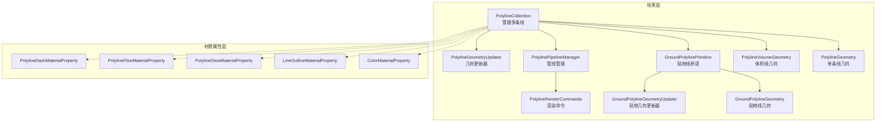
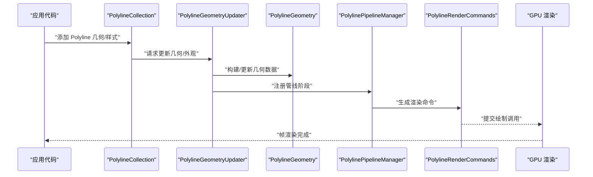
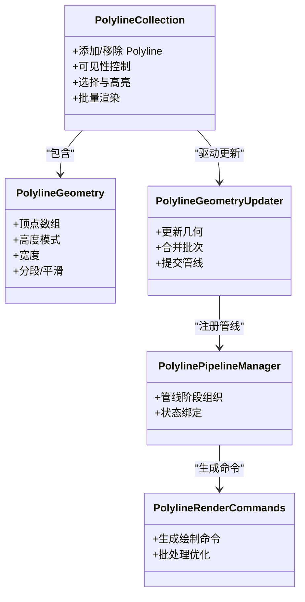
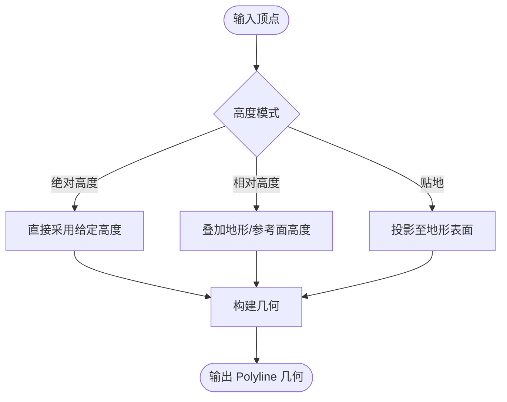
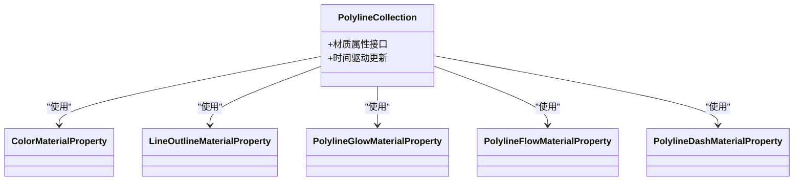
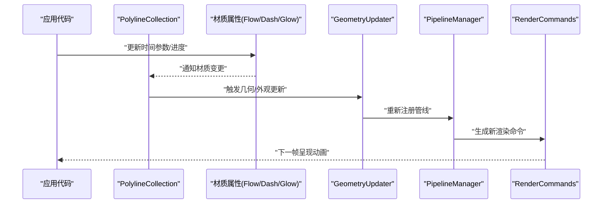
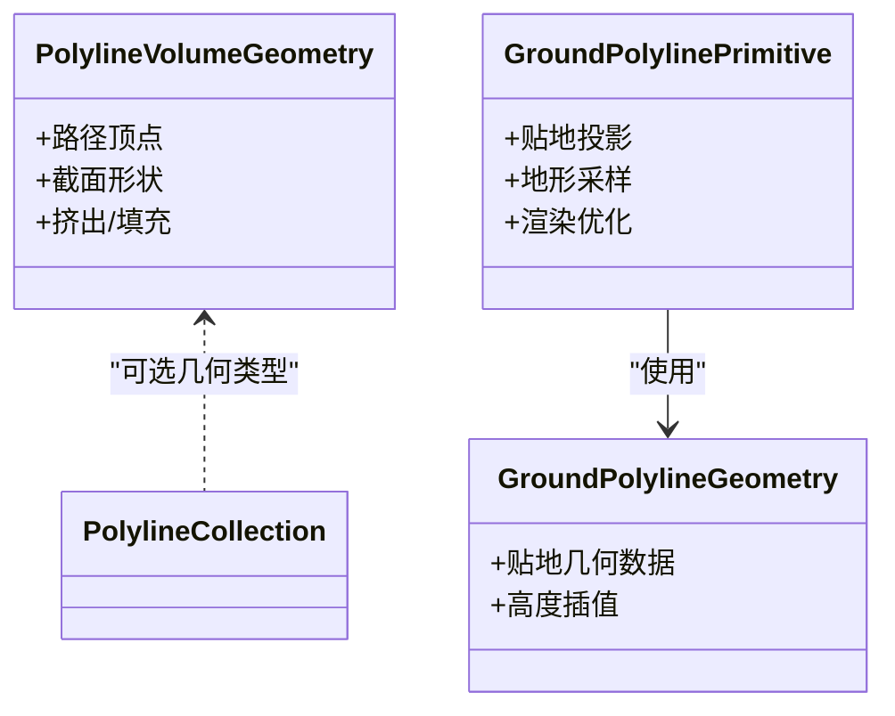
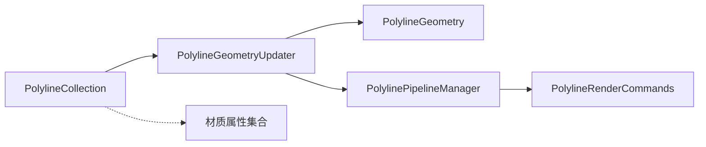

# 线几何体

<cite>
**本文引用的文件**   
- [PolylineCollection.js](file://Source/Scene/PolylineCollection.js)
- [PolylineGeometry.js](file://Source/Scene/PolylineGeometry.js)
- [PolylineMaterialAppearance.js](file://Source/Scene/MaterialAppearance/PolylineMaterialAppearance.js)
- [LineOutlineMaterialProperty.js](file://Source/DataSources/LineOutlineMaterialProperty.js)
- [ColorMaterialProperty.js](file://Source/DataSources/ColorMaterialProperty.js)
- [PolylineGlowMaterialProperty.js](file://Source/DataSources/PolylineGlowMaterialProperty.js)
- [PolylineFlowMaterialProperty.js](file://Source/DataSources/PolylineFlowMaterialProperty.js)
- [PolylineDashMaterialProperty.js](file://Source/DataSources/PolylineDashMaterialProperty.js)
- [PolylineVolumeGeometry.js](file://Source/Scene/PolylineVolumeGeometry.js)
- [GroundPolylinePrimitive.js](file://Source/Scene/GroundPolylinePrimitive.js)
- [GroundPolylineGeometry.js](file://Source/Scene/GroundPolylineGeometry.js)
- [GroundPolylineMaterialAppearance.js](file://Source/Scene/MaterialAppearance/GroundPolylineMaterialAppearance.js)
- [PolylinePipelineManager.js](file://Source/Scene/PolylinePipelineManager.js)
- [PolylineRenderCommands.js](file://Source/Scene/PolylineRenderCommands.js)
- [PolylineGeometryUpdater.js](file://Source/Scene/GeometryUpdaters/PolylineGeometryUpdater.js)
- [GroundPolylineGeometryUpdater.js](file://Source/Scene/GeometryUpdaters/GroundPolylineGeometryUpdater.js)
- [PolylineCollectionSpecs.js](file://Specs/Scene/PolylineCollectionSpecs.js)
- [PolylineGeometrySpecs.js](file://Specs/Scene/PolylineGeometrySpecs.js)
- [GroundPolylinePrimitiveSpecs.js](file://Specs/Scene/GroundPolylinePrimitiveSpecs.js)
</cite>

## 目录
1. [简介](#简介)
2. [项目结构](#项目结构)
3. [核心组件](#核心组件)
4. [架构总览](#架构总览)
5. [详细组件分析](#详细组件分析)
6. [依赖关系分析](#依赖关系分析)
7. [性能考虑](#性能考虑)
8. [故障排查指南](#故障排查指南)
9. [结论](#结论)
10. [附录](#附录) 

## 简介
本技术文档聚焦于 Cesium 的线几何体体系，围绕 Polyline 与 PolylineCollection 的实现原理、使用方式与最佳实践展开。内容涵盖：
- 顶点坐标定义与高度模式（绝对高度、相对椭球面、贴地）
- 宽度设置与屏幕空间缩放
- 颜色与材质（纯色、渐变、发光、流动、虚线等）
- 轮廓线与阴影效果
- 动画能力（路径动画、流动效果、动态长度变化）
- 大数据量渲染优化与内存管理建议

## 项目结构
Cesium 的线相关实现主要分布在 Source/Scene 与 Source/DataSources 两个层次：
- Scene 层负责几何构造、管线与渲染命令生成
- DataSources 层提供面向数据源的材质属性封装，便于在 Entity/DataSource 场景中使用

图表来源
- [PolylineCollection.js](file://Source/Scene/PolylineCollection.js)
- [PolylineGeometry.js](file://Source/Scene/PolylineGeometry.js)
- [PolylineVolumeGeometry.js](file://Source/Scene/PolylineVolumeGeometry.js)
- [GroundPolylinePrimitive.js](file://Source/Scene/GroundPolylinePrimitive.js)
- [GroundPolylineGeometry.js](file://Source/Scene/GroundPolylineGeometry.js)
- [PolylinePipelineManager.js](file://Source/Scene/PolylinePipelineManager.js)
- [PolylineRenderCommands.js](file://Source/Scene/PolylineRenderCommands.js)
- [PolylineGeometryUpdater.js](file://Source/Scene/GeometryUpdaters/PolylineGeometryUpdater.js)
- [GroundPolylineGeometryUpdater.js](file://Source/Scene/GeometryUpdaters/GroundPolylineGeometryUpdater.js)
- [ColorMaterialProperty.js](file://Source/DataSources/ColorMaterialProperty.js)
- [LineOutlineMaterialProperty.js](file://Source/DataSources/LineOutlineMaterialProperty.js)
- [PolylineGlowMaterialProperty.js](file://Source/DataSources/PolylineGlowMaterialProperty.js)
- [PolylineFlowMaterialProperty.js](file://Source/DataSources/PolylineFlowMaterialProperty.js)
- [PolylineDashMaterialProperty.js](file://Source/DataSources/PolylineDashMaterialProperty.js)

章节来源
- [PolylineCollection.js](file://Source/Scene/PolylineCollection.js)
- [PolylineGeometry.js](file://Source/Scene/PolylineGeometry.js)
- [GroundPolylinePrimitive.js](file://Source/Scene/GroundPolylinePrimitive.js)
- [PolylinePipelineManager.js](file://Source/Scene/PolylinePipelineManager.js)
- [PolylineRenderCommands.js](file://Source/Scene/PolylineRenderCommands.js)

## 核心组件
- PolylineCollection：用于批量管理多条 Polyline 或 GroundPolyline，统一提交到渲染管线，支持按集合级别启用/禁用、可见性控制与选择交互。
- PolylineGeometry：描述一条或多条折线的几何信息，包括顶点数组、高度模式、宽度、是否闭合等。
- PolylineVolumeGeometry：基于路径生成“管状”体积几何，适合需要实体化管线的场景。
- GroundPolylinePrimitive / GroundPolylineGeometry：专门处理贴地线，自动投影到地形表面。
- 材质属性：通过 ColorMaterialProperty、LineOutlineMaterialProperty、PolylineGlowMaterialProperty、PolylineFlowMaterialProperty、PolylineDashMaterialProperty 等对颜色、轮廓、发光、流动、虚线等进行声明式配置。

章节来源
- [PolylineCollection.js](file://Source/Scene/PolylineCollection.js)
- [PolylineGeometry.js](file://Source/Scene/PolylineGeometry.js)
- [PolylineVolumeGeometry.js](file://Source/Scene/PolylineVolumeGeometry.js)
- [GroundPolylinePrimitive.js](file://Source/Scene/GroundPolylinePrimitive.js)
- [GroundPolylineGeometry.js](file://Source/Scene/GroundPolylineGeometry.js)
- [ColorMaterialProperty.js](file://Source/DataSources/ColorMaterialProperty.js)
- [LineOutlineMaterialProperty.js](file://Source/DataSources/LineOutlineMaterialProperty.js)
- [PolylineGlowMaterialProperty.js](file://Source/DataSources/PolylineGlowMaterialProperty.js)
- [PolylineFlowMaterialProperty.js](file://Source/DataSources/PolylineFlowMaterialProperty.js)
- [PolylineDashMaterialProperty.js](file://Source/DataSources/PolylineDashMaterialProperty.js)

## 架构总览
从创建到渲染的关键流程如下：

图表来源
- [PolylineCollection.js](file://Source/Scene/PolylineCollection.js)
- [PolylineGeometryUpdater.js](file://Source/Scene/GeometryUpdaters/PolylineGeometryUpdater.js)
- [PolylineGeometry.js](file://Source/Scene/PolylineGeometry.js)
- [PolylinePipelineManager.js](file://Source/Scene/PolylinePipelineManager.js)
- [PolylineRenderCommands.js](file://Source/Scene/PolylineRenderCommands.js)

## 详细组件分析

### Polyline 与 PolylineCollection
- 职责分工
  - PolylineGeometry：描述单条折线的几何参数（顶点、高度模式、宽度、分段数等）。
  - PolylineCollection：聚合多条 Polyline，统一进行可见性、选择、着色与渲染批处理。
- 关键特性
  - 支持屏幕空间宽度与模型空间宽度的切换
  - 支持轮廓线（外描边）与阴影
  - 支持多种材质属性（纯色、发光、流动、虚线等）
  - 支持动画（时间驱动的材质属性与几何更新）

图表来源
- [PolylineCollection.js](file://Source/Scene/PolylineCollection.js)
- [PolylineGeometry.js](file://Source/Scene/PolylineGeometry.js)
- [PolylineGeometryUpdater.js](file://Source/Scene/GeometryUpdaters/PolylineGeometryUpdater.js)
- [PolylinePipelineManager.js](file://Source/Scene/PolylinePipelineManager.js)
- [PolylineRenderCommands.js](file://Source/Scene/PolylineRenderCommands.js)

章节来源
- [PolylineCollection.js](file://Source/Scene/PolylineCollection.js)
- [PolylineGeometry.js](file://Source/Scene/PolylineGeometry.js)
- [PolylineGeometryUpdater.js](file://Source/Scene/GeometryUpdaters/PolylineGeometryUpdater.js)
- [PolylinePipelineManager.js](file://Source/Scene/PolylinePipelineManager.js)
- [PolylineRenderCommands.js](file://Source/Scene/PolylineRenderCommands.js)

### 顶点坐标与高度模式
- 顶点坐标
  - 通常以经纬度（WGS84）或三维笛卡尔坐标表示，支持多段折线。
- 高度模式
  - 绝对高度：相对于椭球面的固定高度
  - 相对高度：相对于地形或参考表面的偏移
  - 贴地显示：通过 GroundPolyline 系列将线投影到地形表面

图表来源
- [PolylineGeometry.js](file://Source/Scene/PolylineGeometry.js)
- [GroundPolylineGeometry.js](file://Source/Scene/GroundPolylineGeometry.js)
- [GroundPolylinePrimitive.js](file://Source/Scene/GroundPolylinePrimitive.js)

章节来源
- [PolylineGeometry.js](file://Source/Scene/PolylineGeometry.js)
- [GroundPolylineGeometry.js](file://Source/Scene/GroundPolylineGeometry.js)
- [GroundPolylinePrimitive.js](file://Source/Scene/GroundPolylinePrimitive.js)

### 宽度设置与屏幕空间缩放
- 屏幕空间宽度：在屏幕像素维度保持视觉一致，适合标注与轨迹线
- 模型空间宽度：在世界单位维度保持一致，适合真实尺度建模
- 宽度随距离衰减与抗锯齿策略影响最终视觉效果

章节来源
- [PolylineGeometry.js](file://Source/Scene/PolylineGeometry.js)
- [PolylineCollection.js](file://Source/Scene/PolylineCollection.js)

### 颜色渐变与材质系统
- 纯色材质：ColorMaterialProperty
- 轮廓线：LineOutlineMaterialProperty
- 发光材质：PolylineGlowMaterialProperty
- 流动材质：PolylineFlowMaterialProperty
- 虚线材质：PolylineDashMaterialProperty

图表来源
- [PolylineCollection.js](file://Source/Scene/PolylineCollection.js)
- [ColorMaterialProperty.js](file://Source/DataSources/ColorMaterialProperty.js)
- [LineOutlineMaterialProperty.js](file://Source/DataSources/LineOutlineMaterialProperty.js)
- [PolylineGlowMaterialProperty.js](file://Source/DataSources/PolylineGlowMaterialProperty.js)
- [PolylineFlowMaterialProperty.js](file://Source/DataSources/PolylineFlowMaterialProperty.js)
- [PolylineDashMaterialProperty.js](file://Source/DataSources/PolylineDashMaterialProperty.js)

章节来源
- [PolylineCollection.js](file://Source/Scene/PolylineCollection.js)
- [ColorMaterialProperty.js](file://Source/DataSources/ColorMaterialProperty.js)
- [LineOutlineMaterialProperty.js](file://Source/DataSources/LineOutlineMaterialProperty.js)
- [PolylineGlowMaterialProperty.js](file://Source/DataSources/PolylineGlowMaterialProperty.js)
- [PolylineFlowMaterialProperty.js](file://Source/DataSources/PolylineFlowMaterialProperty.js)
- [PolylineDashMaterialProperty.js](file://Source/DataSources/PolylineDashMaterialProperty.js)

### 轮廓线与阴影效果
- 轮廓线：通过 Outline 材质属性为线条增加描边，提升对比度
- 阴影：在光照场景中可启用阴影投射/接收，增强立体感

章节来源
- [LineOutlineMaterialProperty.js](file://Source/DataSources/LineOutlineMaterialProperty.js)
- [PolylineCollection.js](file://Source/Scene/PolylineCollection.js)

### 动画实现
- 路径动画：通过时间驱动的材质属性（如流动方向、进度）实现沿路径移动的效果
- 流动效果：利用 Flow 材质属性产生连续流动纹理
- 动态长度变化：实时更新顶点数组或裁剪范围，配合更新器刷新几何

图表来源
- [PolylineCollection.js](file://Source/Scene/PolylineCollection.js)
- [PolylineFlowMaterialProperty.js](file://Source/DataSources/PolylineFlowMaterialProperty.js)
- [PolylineGeometryUpdater.js](file://Source/Scene/GeometryUpdaters/PolylineGeometryUpdater.js)
- [PolylinePipelineManager.js](file://Source/Scene/PolylinePipelineManager.js)
- [PolylineRenderCommands.js](file://Source/Scene/PolylineRenderCommands.js)

章节来源
- [PolylineCollection.js](file://Source/Scene/PolylineCollection.js)
- [PolylineFlowMaterialProperty.js](file://Source/DataSources/PolylineFlowMaterialProperty.js)
- [PolylineGeometryUpdater.js](file://Source/Scene/GeometryUpdaters/PolylineGeometryUpdater.js)
- [PolylinePipelineManager.js](file://Source/Scene/PolylinePipelineManager.js)
- [PolylineRenderCommands.js](file://Source/Scene/PolylineRenderCommands.js)

### 体积线与贴地线
- 体积线（PolylineVolumeGeometry）：将路径拉伸为管状几何，适用于需要实体化的管线展示
- 贴地线（GroundPolyline*）：自动贴合地形，避免悬空或不自然的高度

图表来源
- [PolylineVolumeGeometry.js](file://Source/Scene/PolylineVolumeGeometry.js)
- [GroundPolylinePrimitive.js](file://Source/Scene/GroundPolylinePrimitive.js)
- [GroundPolylineGeometry.js](file://Source/Scene/GroundPolylineGeometry.js)

章节来源
- [PolylineVolumeGeometry.js](file://Source/Scene/PolylineVolumeGeometry.js)
- [GroundPolylinePrimitive.js](file://Source/Scene/GroundPolylinePrimitive.js)
- [GroundPolylineGeometry.js](file://Source/Scene/GroundPolylineGeometry.js)

## 依赖关系分析
- 低耦合设计
  - PolylineCollection 作为上层容器，不直接参与底层几何计算，而是委托给 GeometryUpdater 与 PipelineManager
  - 材质属性与几何解耦，通过统一的材质接口接入
- 潜在循环依赖
  - 管线与渲染命令之间单向依赖，避免循环引用
- 外部集成点
  - 地形服务（贴地线）、光照与阴影系统（阴影效果）、时间系统（动画）

图表来源
- [PolylineCollection.js](file://Source/Scene/PolylineCollection.js)
- [PolylineGeometryUpdater.js](file://Source/Scene/GeometryUpdaters/PolylineGeometryUpdater.js)
- [PolylineGeometry.js](file://Source/Scene/PolylineGeometry.js)
- [PolylinePipelineManager.js](file://Source/Scene/PolylinePipelineManager.js)
- [PolylineRenderCommands.js](file://Source/Scene/PolylineRenderCommands.js)

章节来源
- [PolylineCollection.js](file://Source/Scene/PolylineCollection.js)
- [PolylineGeometryUpdater.js](file://Source/Scene/GeometryUpdaters/PolylineGeometryUpdater.js)
- [PolylinePipelineManager.js](file://Source/Scene/PolylinePipelineManager.js)
- [PolylineRenderCommands.js](file://Source/Scene/PolylineRenderCommands.js)

## 性能考虑
- 批处理与合并
  - 尽量将相同样式的线放入同一集合，减少状态切换
  - 使用 GeometryUpdater 的合并机制降低绘制调用次数
- 几何简化
  - 远距离视口下减少顶点密度，按需细分
  - 使用分段/平滑参数平衡精度与性能
- 材质复用
  - 共享材质实例，避免频繁创建销毁
  - 对于大量线，优先使用纯色或简单材质，复杂材质（发光/流动）谨慎使用
- 贴地线优化
  - 合理设置贴地采样步长，避免过密采样导致地形查询开销过大
- 内存管理
  - 及时移除不再使用的线对象
  - 重用缓冲区与几何对象，避免每帧分配新内存

[本节为通用性能指导，无需具体文件引用]

## 故障排查指南
- 常见问题
  - 线未显示：检查可见性、相机视锥剔除、高度模式与地形遮挡
  - 宽度异常：确认屏幕空间/模型空间宽度设置与分辨率适配
  - 材质不生效：确认材质属性是否正确绑定且未被覆盖
  - 动画卡顿：检查时间驱动更新的频率与复杂度
- 定位方法
  - 使用测试用例对照行为差异
  - 逐步关闭材质特效，定位问题来源
  - 监控几何更新与渲染命令数量，评估性能瓶颈

章节来源
- [PolylineCollectionSpecs.js](file://Specs/Scene/PolylineCollectionSpecs.js)
- [PolylineGeometrySpecs.js](file://Specs/Scene/PolylineGeometrySpecs.js)
- [GroundPolylinePrimitiveSpecs.js](file://Specs/Scene/GroundPolylinePrimitiveSpecs.js)

## 结论
Cesium 的线几何体体系通过清晰的层次划分与模块化设计，提供了丰富的样式与动画能力。合理使用 PolylineCollection 与各类材质属性，结合贴地与体积线方案，可在保证性能的前提下实现高质量的线可视化效果。针对大数据量场景，应重点关注批处理、几何简化与材质复用，以获得稳定流畅的渲染体验。

[本节为总结性内容，无需具体文件引用]

## 附录
- 示例与参考
  - 查看 Specs 中的单元测试用例，了解常见用法与边界条件
  - 参考 Apps 中的示例页面，观察实际运行效果

章节来源
- [PolylineCollectionSpecs.js](file://Specs/Scene/PolylineCollectionSpecs.js)
- [PolylineGeometrySpecs.js](file://Specs/Scene/PolylineGeometrySpecs.js)
- [GroundPolylinePrimitiveSpecs.js](file://Specs/Scene/GroundPolylinePrimitiveSpecs.js)