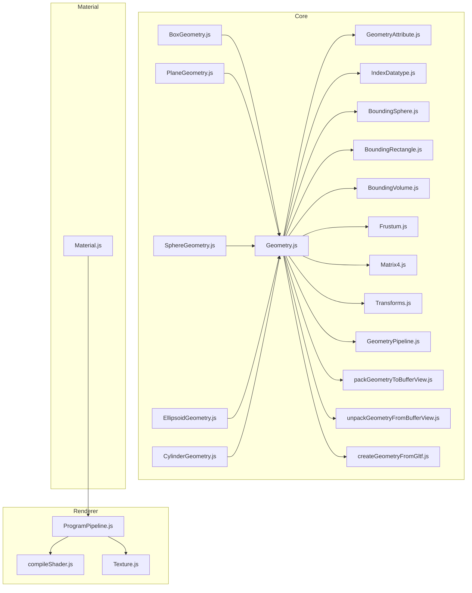
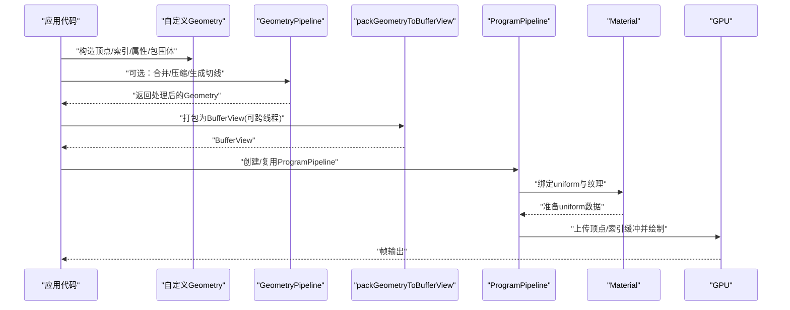
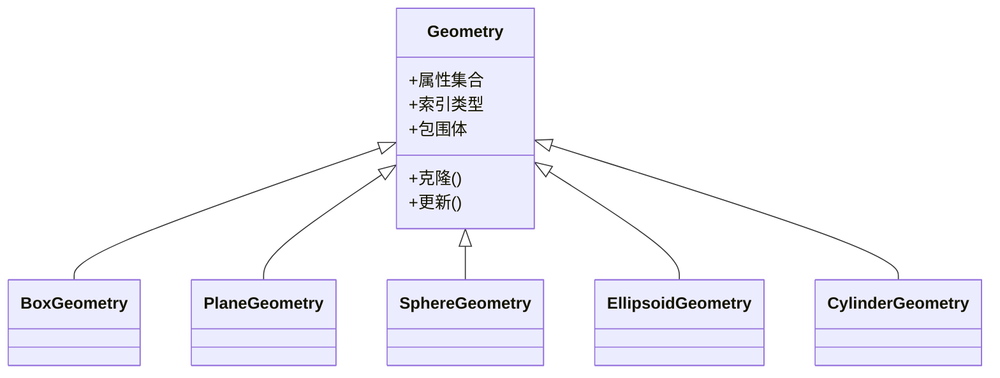
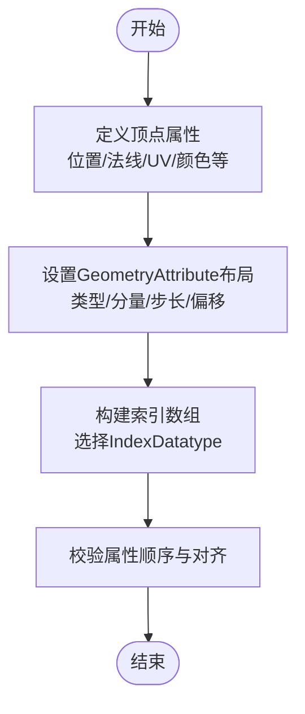
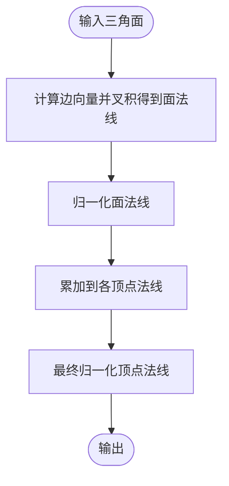
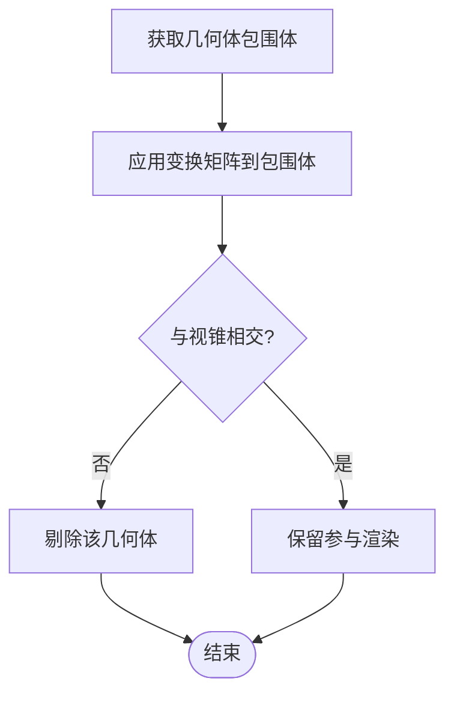
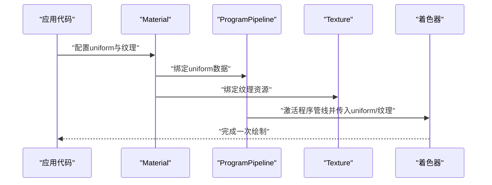
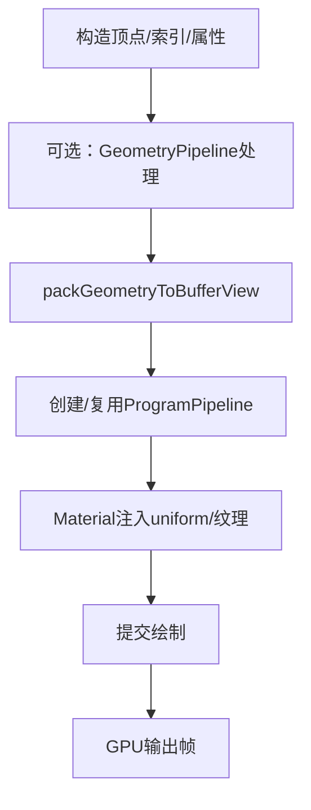
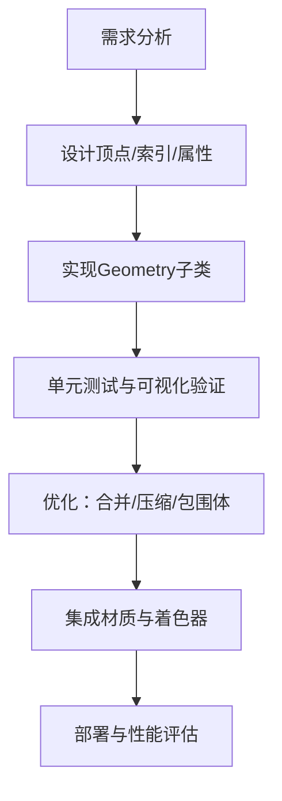
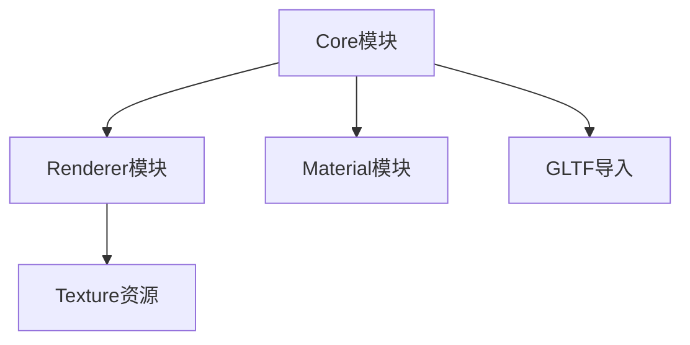

# 自定义几何体

<cite>
**本文引用的文件**   
- [Geometry.js](file://Source/Core/Geometry.js)
- [BoxGeometry.js](file://Source/Core/BoxGeometry.js)
- [PlaneGeometry.js](file://Source/Core/PlaneGeometry.js)
- [SphereGeometry.js](file://Source/Core/SphereGeometry.js)
- [EllipsoidGeometry.js](file://Source/Core/EllipsoidGeometry.js)
- [CylinderGeometry.js](file://Source/Core/CylinderGeometry.js)
- [createGeometryFromGltf.js](file://Source/Core/createGeometryFromGltf.js)
- [Primitive.js](file://Source/Core/Primitive.js)
- [GeometryAttribute.js](file://Source/Core/GeometryAttribute.js)
- [IndexDatatype.js](file://Source/Core/IndexDatatype.js)
- [BoundingSphere.js](file://Source/Core/BoundingSphere.js)
- [BoundingRectangle.js](file://Source/Core/BoundingRectangle.js)
- [BoundingVolume.js](file://Source/Core/BoundingVolume.js)
- [Frustum.js](file://Source/Core/Frustum.js)
- [Matrix4.js](file://Source/Core/Matrix4.js)
- [Transforms.js](file://Source/Core/Transforms.js)
- [packGeometryToBufferView.js](file://Source/Core/packGeometryToBufferView.js)
- [unpackGeometryFromBufferView.js](file://Source/Core/unpackGeometryFromBufferView.js)
- [GeometryPipeline.js](file://Source/Core/GeometryPipeline.js)
- [compileShader.js](file://Source/Renderer/compileShader.js)
- [ProgramPipeline.js](file://Source/Renderer/ProgramPipeline.js)
- [Texture.js](file://Source/Renderer/Texture.js)
- [Material.js](file://Source/MaterialSpecs/Material.js)
</cite>

## 目录
1. [简介](#简介)
2. [项目结构](#项目结构)
3. [核心组件](#核心组件)
4. [架构总览](#架构总览)
5. [详细组件分析](#详细组件分析)
6. [依赖关系分析](#依赖关系分析)
7. [性能考量](#性能考量)
8. [故障排查指南](#故障排查指南)
9. [结论](#结论)
10. [附录](#附录)

## 简介
本指南面向希望在 Cesium 中实现自定义几何体的开发者，系统讲解 Geometry 类的继承机制、顶点数据组织、索引数组与法向量计算、边界体积与视锥剔除优化、着色器集成与属性绑定、uniform 传递，以及从顶点到渲染的完整流程。文档同时提供调试工具使用、性能分析方法与常见问题解决方案，并给出最佳实践与高级优化建议。

## 项目结构
Cesium 引擎将“几何体定义”和“渲染管线”解耦：
- 几何体定义位于 Source/Core，负责描述顶点、索引、属性、包围体等；
- 渲染管线位于 Source/Renderer，负责编译着色器、创建 ProgramPipeline、上传缓冲区、执行绘制；
- 材质与着色器在 Source/MaterialSpecs 与示例应用中组合使用；
- 测试与示例位于 Specs 与 Apps，便于验证与学习。

图表来源
- [Geometry.js:1-200](file://Source/Core/Geometry.js#L1-L200)
- [GeometryAttribute.js:1-120](file://Source/Core/GeometryAttribute.js#L1-L120)
- [IndexDatatype.js:1-80](file://Source/Core/IndexDatatype.js#L1-L80)
- [BoundingSphere.js:1-120](file://Source/Core/BoundingSphere.js#L1-L120)
- [BoundingRectangle.js:1-120](file://Source/Core/BoundingRectangle.js#L1-L120)
- [BoundingVolume.js:1-120](file://Source/Core/BoundingVolume.js#L1-L120)
- [Frustum.js:1-120](file://Source/Core/Frustum.js#L1-L120)
- [Matrix4.js:1-120](file://Source/Core/Matrix4.js#L1-L120)
- [Transforms.js:1-120](file://Source/Core/Transforms.js#L1-L120)
- [GeometryPipeline.js:1-200](file://Source/Core/GeometryPipeline.js#L1-L200)
- [packGeometryToBufferView.js:1-120](file://Source/Core/packGeometryToBufferView.js#L1-L120)
- [unpackGeometryFromBufferView.js:1-120](file://Source/Core/unpackGeometryFromBufferView.js#L1-L120)
- [createGeometryFromGltf.js:1-120](file://Source/Core/createGeometryFromGltf.js#L1-L120)
- [BoxGeometry.js:1-200](file://Source/Core/BoxGeometry.js#L1-L200)
- [PlaneGeometry.js:1-200](file://Source/Core/PlaneGeometry.js#L1-L200)
- [SphereGeometry.js:1-200](file://Source/Core/SphereGeometry.js#L1-L200)
- [EllipsoidGeometry.js:1-200](file://Source/Core/EllipsoidGeometry.js#L1-L200)
- [CylinderGeometry.js:1-200](file://Source/Core/CylinderGeometry.js#L1-L200)
- [compileShader.js:1-120](file://Source/Renderer/compileShader.js#L1-L120)
- [ProgramPipeline.js:1-200](file://Source/Renderer/ProgramPipeline.js#L1-L200)
- [Texture.js:1-120](file://Source/Renderer/Texture.js#L1-L120)
- [Material.js:1-120](file://Source/MaterialSpecs/Material.js#L1-L120)

章节来源
- [Geometry.js:1-200](file://Source/Core/Geometry.js#L1-L200)
- [GeometryAttribute.js:1-120](file://Source/Core/GeometryAttribute.js#L1-L120)
- [IndexDatatype.js:1-80](file://Source/Core/IndexDatatype.js#L1-L80)
- [BoundingSphere.js:1-120](file://Source/Core/BoundingSphere.js#L1-L120)
- [BoundingRectangle.js:1-120](file://Source/Core/BoundingRectangle.js#L1-L120)
- [BoundingVolume.js:1-120](file://Source/Core/BoundingVolume.js#L1-L120)
- [Frustum.js:1-120](file://Source/Core/Frustum.js#L1-L120)
- [Matrix4.js:1-120](file://Source/Core/Matrix4.js#L1-L120)
- [Transforms.js:1-120](file://Source/Core/Transforms.js#L1-L120)
- [GeometryPipeline.js:1-200](file://Source/Core/GeometryPipeline.js#L1-L200)
- [packGeometryToBufferView.js:1-120](file://Source/Core/packGeometryToBufferView.js#L1-L120)
- [unpackGeometryFromBufferView.js:1-120](file://Source/Core/unpackGeometryFromBufferView.js#L1-L120)
- [createGeometryFromGltf.js:1-120](file://Source/Core/createGeometryFromGltf.js#L1-L120)
- [BoxGeometry.js:1-200](file://Source/Core/BoxGeometry.js#L1-L200)
- [PlaneGeometry.js:1-200](file://Source/Core/PlaneGeometry.js#L1-L200)
- [SphereGeometry.js:1-200](file://Source/Core/SphereGeometry.js#L1-L200)
- [EllipsoidGeometry.js:1-200](file://Source/Core/EllipsoidGeometry.js#L1-L200)
- [CylinderGeometry.js:1-200](file://Source/Core/CylinderGeometry.js#L1-L200)
- [compileShader.js:1-120](file://Source/Renderer/compileShader.js#L1-L120)
- [ProgramPipeline.js:1-200](file://Source/Renderer/ProgramPipeline.js#L1-L200)
- [Texture.js:1-120](file://Source/Renderer/Texture.js#L1-L120)
- [Material.js:1-120](file://Source/MaterialSpecs/Material.js#L1-L120)

## 核心组件
- Geometry 基类：定义几何体的通用接口，包括顶点属性集合、索引类型、包围体、更新与克隆语义等。
- GeometryAttribute：描述单个属性的布局（数据类型、分量数、是否归一化、步长、偏移）。
- IndexDatatype：统一索引缓冲的数据类型（如 Uint16Array/Uint32Array）。
- 包围体与视锥剔除：BoundingSphere、BoundingRectangle、BoundingVolume、Frustum 用于快速剔除不可见几何体。
- 变换矩阵：Matrix4、Transforms 提供模型视图投影变换与坐标转换。
- 打包/解包：packGeometryToBufferView、unpackGeometryFromBufferView 支持序列化与跨线程传输。
- GLTF 导入：createGeometryFromGltf 将 glTF 网格转换为 Cesium Geometry。
- 几何管线：GeometryPipeline 提供合并、压缩、切线空间生成等预处理能力。
- 渲染管线：compileShader、ProgramPipeline、Texture 完成着色器编译、程序管线构建与纹理绑定。
- 材质：Material 将着色器与 uniform 变量关联，驱动最终渲染。

章节来源
- [Geometry.js:1-200](file://Source/Core/Geometry.js#L1-L200)
- [GeometryAttribute.js:1-120](file://Source/Core/GeometryAttribute.js#L1-L120)
- [IndexDatatype.js:1-80](file://Source/Core/IndexDatatype.js#L1-L80)
- [BoundingSphere.js:1-120](file://Source/Core/BoundingSphere.js#L1-L120)
- [BoundingRectangle.js:1-120](file://Source/Core/BoundingRectangle.js#L1-L120)
- [BoundingVolume.js:1-120](file://Source/Core/BoundingVolume.js#L1-L120)
- [Frustum.js:1-120](file://Source/Core/Frustum.js#L1-L120)
- [Matrix4.js:1-120](file://Source/Core/Matrix4.js#L1-L120)
- [Transforms.js:1-120](file://Source/Core/Transforms.js#L1-L120)
- [packGeometryToBufferView.js:1-120](file://Source/Core/packGeometryToBufferView.js#L1-L120)
- [unpackGeometryFromBufferView.js:1-120](file://Source/Core/unpackGeometryFromBufferView.js#L1-L120)
- [createGeometryFromGltf.js:1-120](file://Source/Core/createGeometryFromGltf.js#L1-L120)
- [GeometryPipeline.js:1-200](file://Source/Core/GeometryPipeline.js#L1-L200)
- [compileShader.js:1-120](file://Source/Renderer/compileShader.js#L1-L120)
- [ProgramPipeline.js:1-200](file://Source/Renderer/ProgramPipeline.js#L1-L200)
- [Texture.js:1-120](file://Source/Renderer/Texture.js#L1-L120)
- [Material.js:1-120](file://Source/MaterialSpecs/Material.js#L1-L120)

## 架构总览
下图展示了从“自定义几何体定义”到“GPU 渲染”的关键路径，涵盖几何体构造、包围体计算、视锥剔除、属性打包、着色器编译与管线绑定、材质 uniform 注入与绘制调用。

图表来源
- [Geometry.js:1-200](file://Source/Core/Geometry.js#L1-L200)
- [GeometryPipeline.js:1-200](file://Source/Core/GeometryPipeline.js#L1-L200)
- [packGeometryToBufferView.js:1-120](file://Source/Core/packGeometryToBufferView.js#L1-L120)
- [ProgramPipeline.js:1-200](file://Source/Renderer/ProgramPipeline.js#L1-L200)
- [Material.js:1-120](file://Source/MaterialSpecs/Material.js#L1-L120)

## 详细组件分析

### Geometry 基类与继承机制
- 职责：声明几何体公共接口（属性集合、索引类型、包围体、克隆/更新语义），并提供默认实现或辅助方法。
- 继承模式：具体几何体（如 Box、Plane、Sphere、Ellipsoid、Cylinder）通过扩展基类，重写必要的构造逻辑与包围体计算。
- 关键点：
  - 属性命名与布局需与着色器一致；
  - 索引类型选择影响内存与绘制性能；
  - 包围体应尽可能紧致以提升剔除效率。

图表来源
- [Geometry.js:1-200](file://Source/Core/Geometry.js#L1-L200)
- [BoxGeometry.js:1-200](file://Source/Core/BoxGeometry.js#L1-L200)
- [PlaneGeometry.js:1-200](file://Source/Core/PlaneGeometry.js#L1-L200)
- [SphereGeometry.js:1-200](file://Source/Core/SphereGeometry.js#L1-L200)
- [EllipsoidGeometry.js:1-200](file://Source/Core/EllipsoidGeometry.js#L1-L200)
- [CylinderGeometry.js:1-200](file://Source/Core/CylinderGeometry.js#L1-L200)

章节来源
- [Geometry.js:1-200](file://Source/Core/Geometry.js#L1-L200)
- [BoxGeometry.js:1-200](file://Source/Core/BoxGeometry.js#L1-L200)
- [PlaneGeometry.js:1-200](file://Source/Core/PlaneGeometry.js#L1-L200)
- [SphereGeometry.js:1-200](file://Source/Core/SphereGeometry.js#L1-L200)
- [EllipsoidGeometry.js:1-200](file://Source/Core/EllipsoidGeometry.js#L1-L200)
- [CylinderGeometry.js:1-200](file://Source/Core/CylinderGeometry.js#L1-L200)

### 顶点数据结构与索引数组
- 顶点属性：位置、法向量、切线、副切线、纹理坐标、颜色等，每个属性由 GeometryAttribute 描述其数据类型、分量数、步长与偏移。
- 索引数组：使用 IndexDatatype 指定类型，减少重复顶点，提升缓存命中率。
- 布局对齐：确保属性按着色器期望的顺序与对齐方式排列，避免运行时解析错误。

图表来源
- [GeometryAttribute.js:1-120](file://Source/Core/GeometryAttribute.js#L1-L120)
- [IndexDatatype.js:1-80](file://Source/Core/IndexDatatype.js#L1-L80)

章节来源
- [GeometryAttribute.js:1-120](file://Source/Core/GeometryAttribute.js#L1-L120)
- [IndexDatatype.js:1-80](file://Source/Core/IndexDatatype.js#L1-L80)

### 法向量计算方法
- 面法线：对三角形三个顶点进行叉积并归一化。
- 顶点法线：累加相邻面的法线并按面积或角度加权后归一化，以获得平滑表面。
- 切线与副切线：用于切线空间光照，需要 UV 导数与面法线共同求解。
- 注意事项：
  - 保持顶点顺序一致（顺时针/逆时针）以确保法线方向正确；
  - 对于非流形或退化三角形，需特殊处理以避免异常法线。

图表来源
- [Geometry.js:1-200](file://Source/Core/Geometry.js#L1-L200)
- [GeometryPipeline.js:1-200](file://Source/Core/GeometryPipeline.js#L1-L200)

章节来源
- [Geometry.js:1-200](file://Source/Core/Geometry.js#L1-L200)
- [GeometryPipeline.js:1-200](file://Source/Core/GeometryPipeline.js#L1-L200)

### 边界体积与视锥剔除
- 包围体：BoundingSphere、BoundingRectangle、BoundingVolume 提供不同形状的近似包围体；
- 视锥剔除：Frustum 与包围体求交，快速丢弃不在视锥内的几何体；
- 变换：Matrix4、Transforms 将局部包围体变换到世界/视图坐标系，再进行剔除判断。

图表来源
- [BoundingSphere.js:1-120](file://Source/Core/BoundingSphere.js#L1-L120)
- [BoundingRectangle.js:1-120](file://Source/Core/BoundingRectangle.js#L1-L120)
- [BoundingVolume.js:1-120](file://Source/Core/BoundingVolume.js#L1-L120)
- [Frustum.js:1-120](file://Source/Core/Frustum.js#L1-L120)
- [Matrix4.js:1-120](file://Source/Core/Matrix4.js#L1-L120)
- [Transforms.js:1-120](file://Source/Core/Transforms.js#L1-L120)

章节来源
- [BoundingSphere.js:1-120](file://Source/Core/BoundingSphere.js#L1-L120)
- [BoundingRectangle.js:1-120](file://Source/Core/BoundingRectangle.js#L1-L120)
- [BoundingVolume.js:1-120](file://Source/Core/BoundingVolume.js#L1-L120)
- [Frustum.js:1-120](file://Source/Core/Frustum.js#L1-L120)
- [Matrix4.js:1-120](file://Source/Core/Matrix4.js#L1-L120)
- [Transforms.js:1-120](file://Source/Core/Transforms.js#L1-L120)

### 着色器集成、属性绑定与 Uniform 传递
- 属性绑定：Geometry 的属性名称必须与着色器中的 attribute 变量名一致；
- Uniform 传递：Material 将 uniform 值注入 ProgramPipeline，供顶点/片段着色器使用；
- 纹理绑定：Texture 对象绑定到着色器采样器，配合 UV 属性进行采样；
- 管线复用：ProgramPipeline 可被多次复用，减少编译与状态切换开销。

图表来源
- [Material.js:1-120](file://Source/MaterialSpecs/Material.js#L1-L120)
- [ProgramPipeline.js:1-200](file://Source/Renderer/ProgramPipeline.js#L1-L200)
- [Texture.js:1-120](file://Source/Renderer/Texture.js#L1-L120)
- [compileShader.js:1-120](file://Source/Renderer/compileShader.js#L1-L120)

章节来源
- [Material.js:1-120](file://Source/MaterialSpecs/Material.js#L1-L120)
- [ProgramPipeline.js:1-200](file://Source/Renderer/ProgramPipeline.js#L1-L200)
- [Texture.js:1-120](file://Source/Renderer/Texture.js#L1-L120)
- [compileShader.js:1-120](file://Source/Renderer/compileShader.js#L1-L120)

### 从顶点数据到最终渲染的完整流程
- 步骤概览：
  1) 构造自定义 Geometry（顶点、索引、属性、包围体）；
  2) 可选：使用 GeometryPipeline 进行合并/压缩/切线生成；
  3) 打包为 BufferView（支持跨线程）；
  4) 创建/复用 ProgramPipeline，绑定 Material 与 Texture；
  5) 提交绘制命令，GPU 执行着色器并输出帧。

图表来源
- [Geometry.js:1-200](file://Source/Core/Geometry.js#L1-L200)
- [GeometryPipeline.js:1-200](file://Source/Core/GeometryPipeline.js#L1-L200)
- [packGeometryToBufferView.js:1-120](file://Source/Core/packGeometryToBufferView.js#L1-L120)
- [ProgramPipeline.js:1-200](file://Source/Renderer/ProgramPipeline.js#L1-L200)
- [Material.js:1-120](file://Source/MaterialSpecs/Material.js#L1-L120)

章节来源
- [Geometry.js:1-200](file://Source/Core/Geometry.js#L1-L200)
- [GeometryPipeline.js:1-200](file://Source/Core/GeometryPipeline.js#L1-L200)
- [packGeometryToBufferView.js:1-120](file://Source/Core/packGeometryToBufferView.js#L1-L120)
- [ProgramPipeline.js:1-200](file://Source/Renderer/ProgramPipeline.js#L1-L200)
- [Material.js:1-120](file://Source/MaterialSpecs/Material.js#L1-L120)

### 常见几何体实现要点
- BoxGeometry：六面立方体，注意共享顶点与法线一致性；
- PlaneGeometry：平面网格，常用于地面或面板；
- SphereGeometry：球体细分策略影响质量与性能；
- EllipsoidGeometry：椭球体，适合地理场景；
- CylinderGeometry：圆柱体，常用于柱状图或管道。

章节来源
- [BoxGeometry.js:1-200](file://Source/Core/BoxGeometry.js#L1-L200)
- [PlaneGeometry.js:1-200](file://Source/Core/PlaneGeometry.js#L1-L200)
- [SphereGeometry.js:1-200](file://Source/Core/SphereGeometry.js#L1-L200)
- [EllipsoidGeometry.js:1-200](file://Source/Core/EllipsoidGeometry.js#L1-L200)
- [CylinderGeometry.js:1-200](file://Source/Core/CylinderGeometry.js#L1-L200)

### 概念性总览
以下流程图展示自定义几何体开发的一般思路，不直接映射到具体源码文件。

[本节为概念性内容，无需图表来源]

## 依赖关系分析
- 低耦合高内聚：Geometry 仅关注几何数据与包围体；渲染相关逻辑由 Renderer 与 Material 承担；
- 外部依赖：glTF 导入、纹理资源、着色器编译与程序管线；
- 潜在循环依赖：应避免在 Core 与 Renderer 之间形成双向引用，通常通过接口或回调解耦。

图表来源
- [Geometry.js:1-200](file://Source/Core/Geometry.js#L1-L200)
- [ProgramPipeline.js:1-200](file://Source/Renderer/ProgramPipeline.js#L1-L200)
- [Texture.js:1-120](file://Source/Renderer/Texture.js#L1-L120)
- [Material.js:1-120](file://Source/MaterialSpecs/Material.js#L1-L120)
- [createGeometryFromGltf.js:1-120](file://Source/Core/createGeometryFromGltf.js#L1-L120)

章节来源
- [Geometry.js:1-200](file://Source/Core/Geometry.js#L1-L200)
- [ProgramPipeline.js:1-200](file://Source/Renderer/ProgramPipeline.js#L1-L200)
- [Texture.js:1-120](file://Source/Renderer/Texture.js#L1-L120)
- [Material.js:1-120](file://Source/MaterialSpecs/Material.js#L1-L120)
- [createGeometryFromGltf.js:1-120](file://Source/Core/createGeometryFromGltf.js#L1-L120)

## 性能考量
- 顶点重用与索引：尽量共享顶点并使用索引缓冲，降低带宽与缓存压力；
- 包围体紧致：更紧致的包围体提升视锥剔除效率；
- 几何合并：使用 GeometryPipeline 合并相近几何体，减少绘制批次；
- 纹理与材质：复用纹理与 ProgramPipeline，减少状态切换；
- 数据类型：选择合适的 IndexDatatype 与属性类型，平衡精度与内存占用；
- 异步与跨线程：利用 packGeometryToBufferView 进行序列化，结合 Worker 加速构建。

[本节为通用指导，无需章节来源]

## 故障排查指南
- 属性未匹配：检查 Geometry 属性名与着色器 attribute 名称是否一致；
- 法线异常：确认顶点顺序与面法线计算逻辑，必要时启用背面剔除开关进行对比；
- 包围体过大：调整包围体计算，避免过于松散的近似导致剔除失效；
- 着色器报错：使用 compileShader 的错误信息定位语法或变量缺失问题；
- 纹理未生效：检查 Texture 绑定与采样器名称，确认 UV 范围与纹理尺寸；
- 性能瓶颈：使用浏览器性能面板与 Cesium 内置统计，识别 CPU/GPU 热点。

章节来源
- [compileShader.js:1-120](file://Source/Renderer/compileShader.js#L1-L120)
- [ProgramPipeline.js:1-200](file://Source/Renderer/ProgramPipeline.js#L1-L200)
- [Texture.js:1-120](file://Source/Renderer/Texture.js#L1-L120)
- [Geometry.js:1-200](file://Source/Core/Geometry.js#L1-L200)

## 结论
自定义几何体在 Cesium 中遵循清晰的职责划分：Core 负责几何数据与包围体，Renderer 负责着色器与管线，Material 负责 uniform 与纹理注入。通过合理的顶点组织、索引策略、法线计算与包围体优化，并结合 GeometryPipeline 与 ProgramPipeline 的复用，可以在保证视觉效果的同时获得良好的性能表现。建议在开发过程中持续进行可视化验证与性能评估，逐步迭代优化。

[本节为总结性内容，无需章节来源]

## 附录
- 参考示例：查看 Apps 与 Specs 下的几何体与材质示例，理解实际用法；
- 调试工具：使用浏览器开发者工具的 WebGL 面板与 Cesium 统计面板进行诊断；
- 最佳实践：
  - 明确属性命名规范并与着色器保持一致；
  - 优先使用紧凑的包围体与合适的索引类型；
  - 复用 ProgramPipeline 与纹理资源；
  - 在复杂场景中分层管理几何体，按需加载与剔除。

[本节为补充信息，无需章节来源]