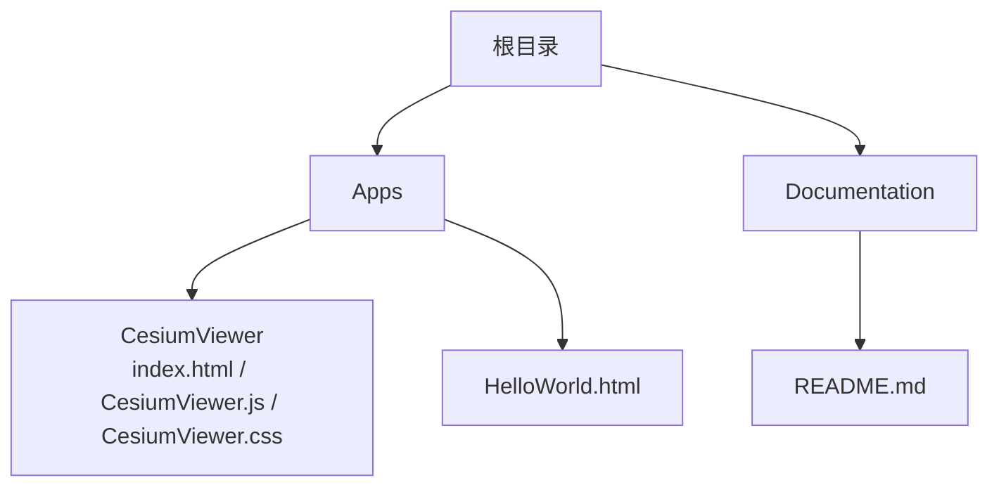
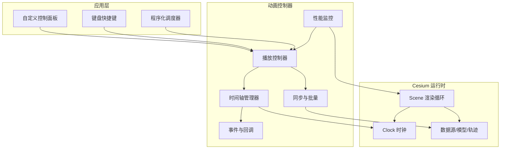
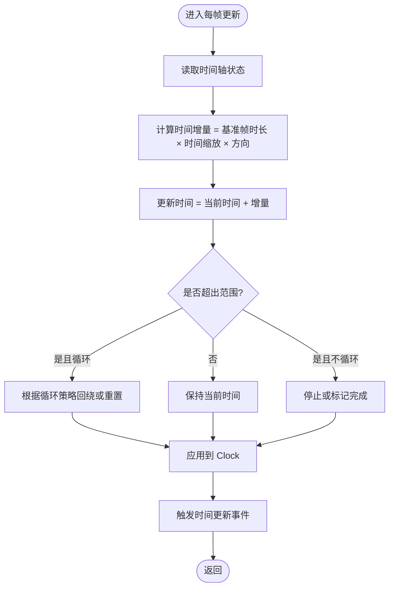
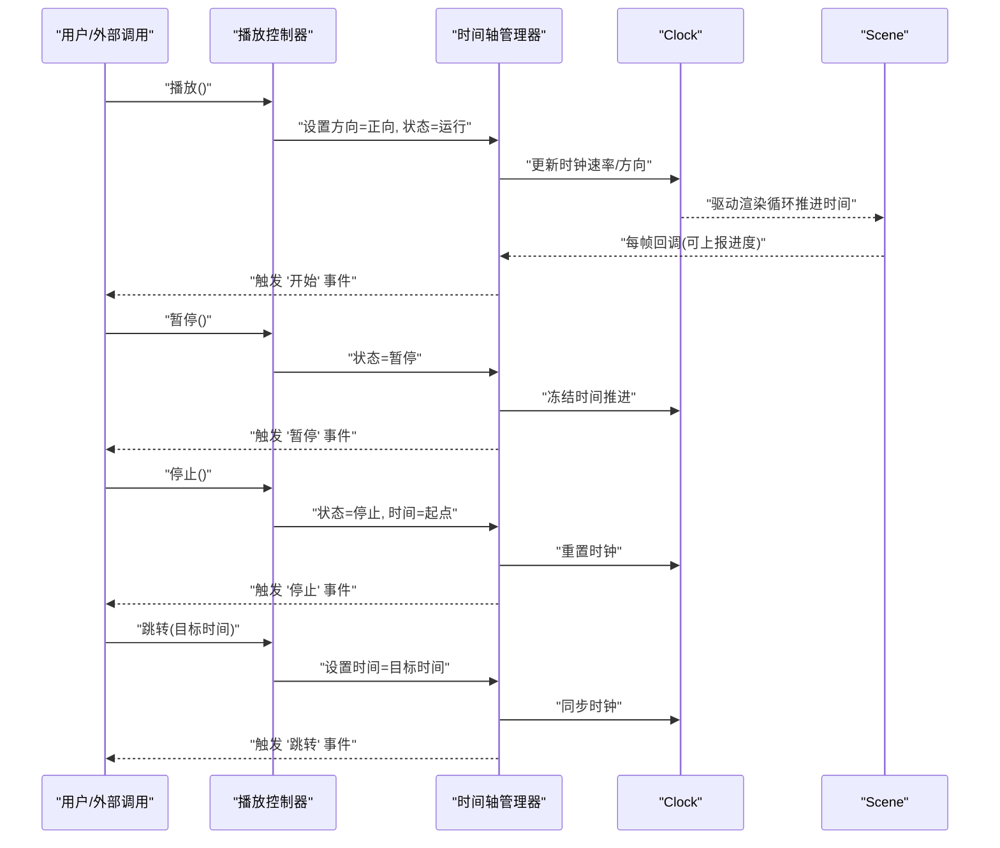
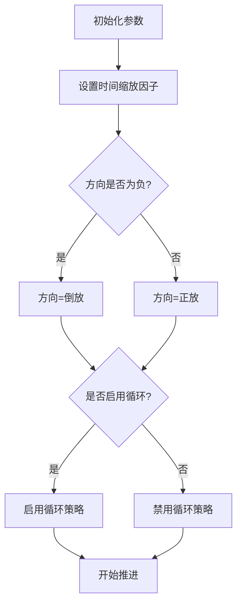
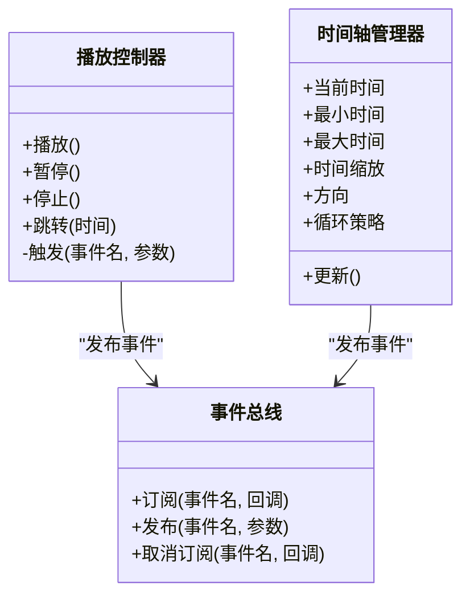
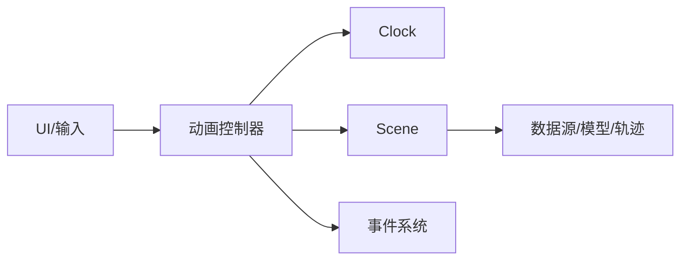

# 动画控制器

<cite>
**本文引用的文件**   
- [index.html](file://Apps/CesiumViewer/index.html)
- [CesiumViewer.js](file://Apps/CesiumViewer/CesiumViewer.js)
- [CesiumViewer.css](file://Apps/CesiumViewer/CesiumViewer.css)
- [HelloWorld.html](file://Apps/HelloWorld.html)
- [README.md](file://Documentation/README.md)
</cite>

## 目录
1. [简介](#简介)
2. [项目结构](#项目结构)
3. [核心组件](#核心组件)
4. [架构总览](#架构总览)
5. [详细组件分析](#详细组件分析)
6. [依赖分析](#依赖分析)
7. [性能考虑](#性能考虑)
8. [故障排查指南](#故障排查指南)
9. [结论](#结论)
10. [附录](#附录)

## 简介
本技术文档聚焦于 Cesium 的“动画控制器”能力，围绕时间轴管理、播放控制接口（播放、暂停、停止、跳转）、时间缩放与倒放、循环播放、事件系统与回调机制展开。同时提供自定义控制面板、键盘快捷键控制以及程序化动画调度的实践思路，并给出同步、批量控制与性能监控的实现建议。

说明：
- 本仓库包含示例应用与文档资源，未直接暴露名为“AnimationController”的单一模块。动画相关能力通常通过 Viewer 的时间系统、Clock 与 Scene 渲染管线协同实现。
- 本文档在概念层面阐述动画控制器设计，并在“示例与参考”部分指向仓库中的入口页面与示例，便于读者快速上手。

## 项目结构
仓库根目录下的 Apps 目录提供了可直接运行的示例页面；Documentation 目录包含贡献者指南与离线使用指南等文档。

图表来源
- [index.html](file://Apps/CesiumViewer/index.html)
- [CesiumViewer.js](file://Apps/CesiumViewer/CesiumViewer.js)
- [CesiumViewer.css](file://Apps/CesiumViewer/CesiumViewer.css)
- [HelloWorld.html](file://Apps/HelloWorld.html)
- [README.md](file://Documentation/README.md)

章节来源
- [index.html](file://Apps/CesiumViewer/index.html)
- [CesiumViewer.js](file://Apps/CesiumViewer/CesiumViewer.js)
- [CesiumViewer.css](file://Apps/CesiumViewer/CesiumViewer.css)
- [HelloWorld.html](file://Apps/HelloWorld.html)
- [README.md](file://Documentation/README.md)

## 核心组件
从概念上，一个完整的“动画控制器”应包含以下职责：
- 时间轴管理：维护当前时间、起止范围、时钟速率（时间缩放）、方向（正放/倒放）与循环策略。
- 播放控制：提供播放、暂停、停止、跳转到指定时刻等统一接口。
- 事件与回调：在开始、结束、循环、时间更新等关键节点触发回调，供 UI 或业务逻辑响应。
- 同步与批量：在多对象或多场景时，保证时间一致性并提供批量操作能力。
- 性能监控：统计帧率、时间推进开销、渲染压力指标，辅助优化。

在本仓库中，上述能力通常由 Viewer 的时间系统（Clock）与 Scene 渲染循环共同驱动。示例页面展示了如何加载资源并运行场景，可作为构建自定义动画控制器的基础。

章节来源
- [CesiumViewer.js](file://Apps/CesiumViewer/CesiumViewer.js)
- [index.html](file://Apps/CesiumViewer/index.html)

## 架构总览
下图展示了一个概念性的“动画控制器”与 Cesium 渲染管线的交互关系。该图用于帮助理解整体流程，并非对具体源码文件的映射。

[此图为概念性架构图，不直接对应具体源码文件]

## 详细组件分析

### 时间轴管理与时钟驱动
- 时间轴状态：当前时间、最小/最大时间、是否循环、时间缩放因子、播放方向。
- 时钟驱动：将时间轴状态映射到 Cesium 的 Clock 属性，使 Scene 按期望速率推进。
- 边界处理：到达终点时的行为（停止、回绕、继续前进）。

[此图为概念流程图，不直接对应具体源码文件]

### 播放控制接口
- 播放：启动或恢复时间推进，设置方向为正。
- 暂停：冻结时间推进，保留当前时间。
- 停止：回到起始时间或终止时间，并清除播放状态。
- 跳转：将时间设置为指定值，必要时触发边界检查与事件。

[此图为概念时序图，不直接对应具体源码文件]

### 时间缩放、倒放与循环播放
- 时间缩放：以倍数调整时间推进速度，支持小数与负数（负数表示倒放）。
- 倒放：方向为负时，时间递减；需确保边界回绕与事件顺序正确。
- 循环播放：到达终点后自动回绕至起点，或根据配置选择其他策略。

[此图为概念流程图，不直接对应具体源码文件]

### 事件系统与回调机制
- 生命周期事件：开始、暂停、停止、跳转、循环、结束。
- 时间更新事件：每帧或固定间隔触发，携带当前时间与进度。
- 错误与异常：非法时间、越界、无效参数等事件的统一上报。

[此图为概念类图，不直接对应具体源码文件]

### 示例与参考
- 示例页面入口：可通过浏览器打开 Apps/CesiumViewer/index.html 查看基于 Cesium 的场景运行效果，作为构建自定义动画控制器的参考。
- 简单示例：Apps/HelloWorld.html 可用于快速验证环境。
- 文档与离线指南：Documentation/README.md 提供离线使用与构建说明，有助于本地调试与扩展。

章节来源
- [index.html](file://Apps/CesiumViewer/index.html)
- [HelloWorld.html](file://Apps/HelloWorld.html)
- [README.md](file://Documentation/README.md)

## 依赖分析
从概念角度，动画控制器依赖以下子系统：
- 渲染循环：Scene 每帧回调驱动时间推进。
- 时钟系统：Clock 负责时间推进与速率控制。
- 数据源：模型、轨迹、粒子等随时间变化的内容。
- UI 与输入：控制面板与键盘事件驱动播放控制。

[此图为概念依赖图，不直接对应具体源码文件]

## 性能考虑
- 节流与合并：避免每帧创建大量对象，复用数据结构，减少 GC 压力。
- 事件频率：时间更新事件可按固定间隔触发，而非每帧，降低 UI 刷新成本。
- 批量更新：对多对象进行批量时间同步，减少重复计算。
- 渲染压力：在高复杂度场景下，适当降低时间分辨率或采用插值平滑。
- 监控指标：记录帧率、时间推进耗时、事件分发耗时，定位瓶颈。

[本节为通用指导，不涉及具体源码文件]

## 故障排查指南
- 现象：动画不推进或卡顿
  - 检查是否被暂停或停止；确认时间缩放因子非零。
  - 确认 Scene 渲染循环正常执行。
- 现象：跳转无效或跳变异常
  - 校验目标时间是否在有效范围内；检查边界与循环策略。
- 现象：事件丢失或重复
  - 检查事件订阅是否正确；避免在回调中再次触发相同事件导致递归。
- 现象：内存增长
  - 排查每帧分配的对象；使用对象池或缓存。

[本节为通用指导，不涉及具体源码文件]

## 结论
动画控制器在 Cesium 应用中承担时间轴与播放控制的核心职责。通过清晰的时间轴状态机、稳定的事件系统与合理的性能策略，可实现流畅、可控且可扩展的动画体验。结合示例页面与文档，开发者可以快速搭建自定义控制面板、键盘快捷键与程序化调度，满足复杂可视化需求。

[本节为总结性内容，不涉及具体源码文件]

## 附录
- 快速开始
  - 打开 Apps/CesiumViewer/index.html 运行示例。
  - 参考 Documentation/README.md 进行离线部署与构建。
- 扩展建议
  - 将播放控制封装为独立模块，通过事件总线与 UI 解耦。
  - 引入批量同步接口，支持多场景/多对象一致推进。
  - 增加性能埋点，输出关键指标以便持续优化。

[本节为补充信息，不涉及具体源码文件]