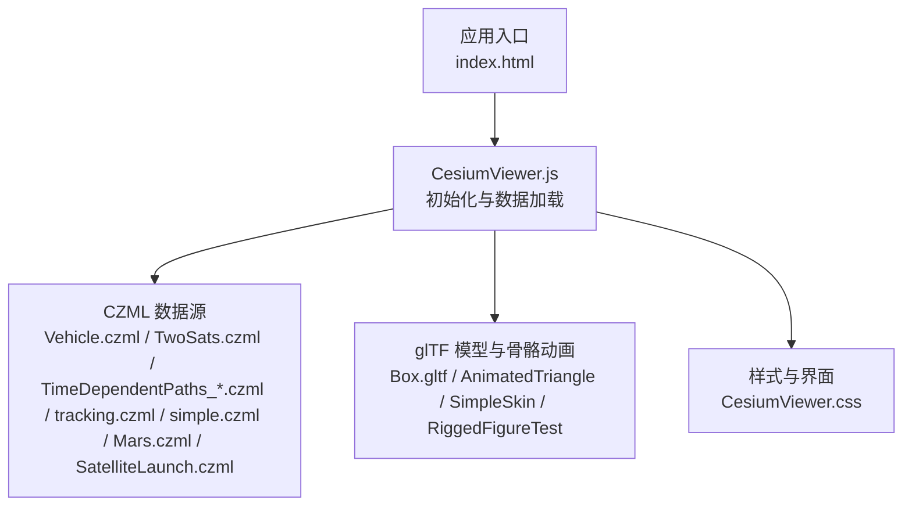
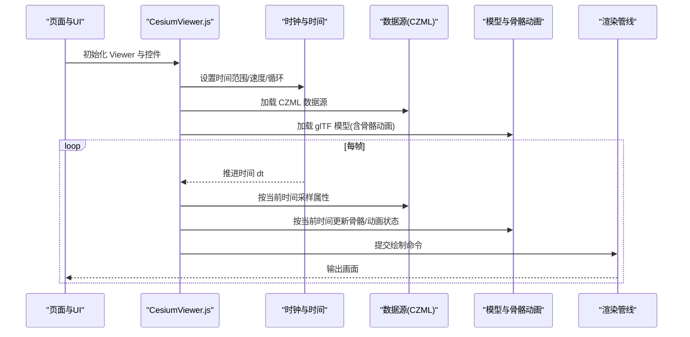
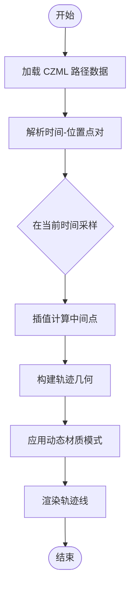
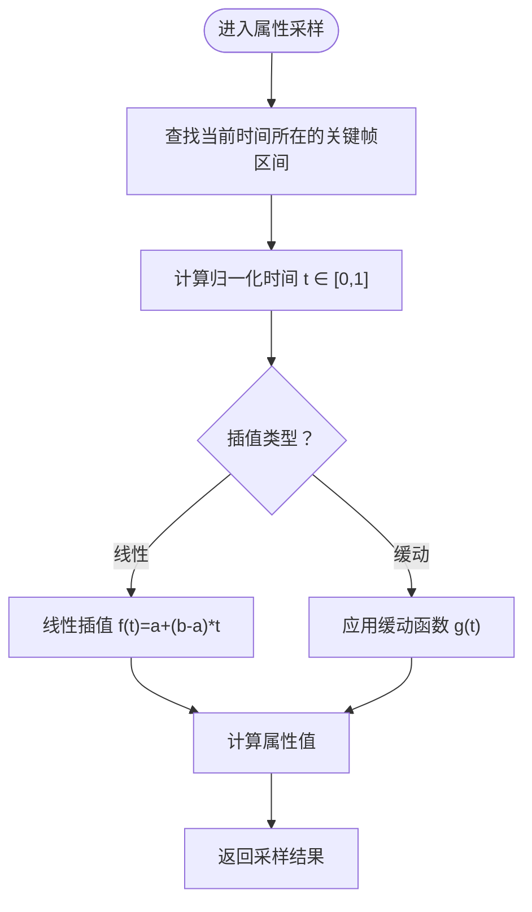
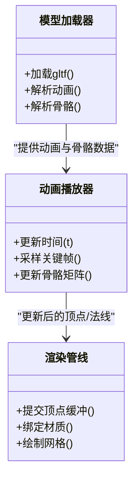
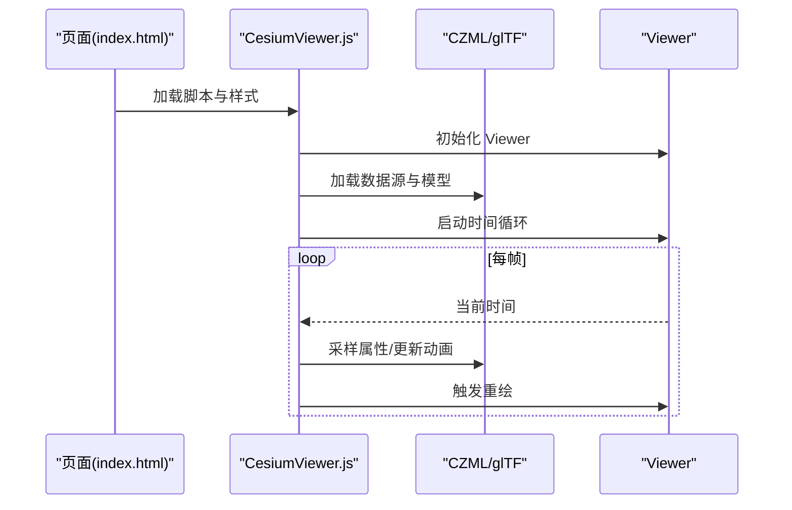
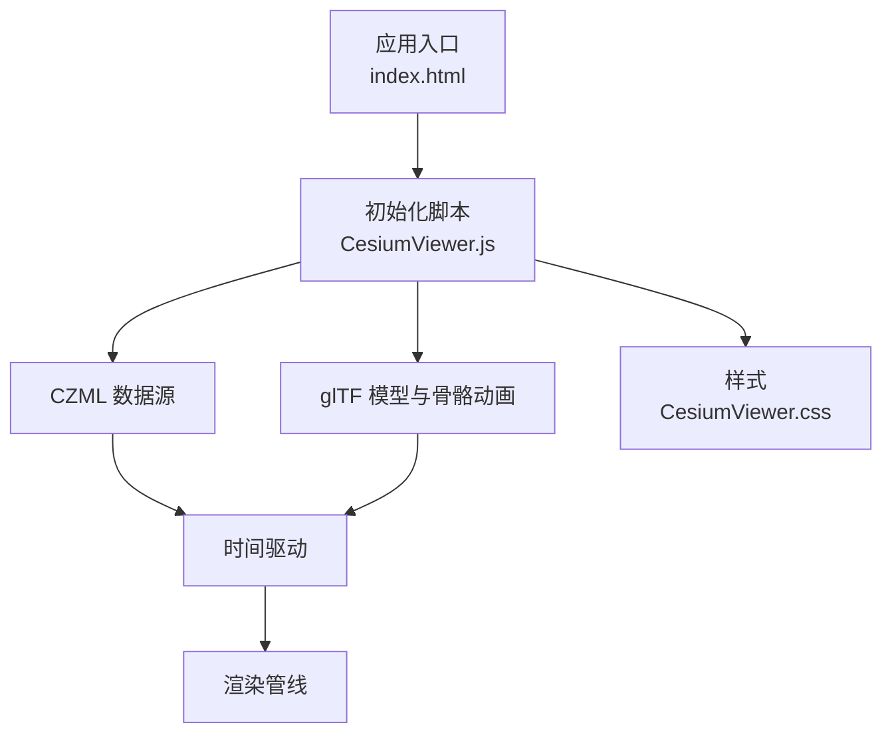

# 动画系统

<cite>
**本文引用的文件**   
- [index.html](file://Apps/HelloWorld.html)
- [CesiumViewer.js](file://Apps/CesiumViewer/CesiumViewer.js)
- [CesiumViewer.css](file://Apps/CesiumViewer/CesiumViewer.css)
- [Vehicle.czml](file://Apps/SampleData/Vehicle.czml)
- [TwoSats.czml](file://Apps/SampleData/TwoSats.czml)
- [TimeDependentPaths_Whole.czml](file://Apps/SampleData/TimeDependentPaths_Whole.czml)
- [TimeDependentPaths_Portions.czml](file://Apps/SampleData/TimeDependentPaths_Portions.czml)
- [TimeDependentPaths_VaryingMaterialMode.czml](file://Apps/SampleData/TimeDependentPaths_VaryingMaterialMode.czml)
- [tracking.czml](file://Apps/SampleData/tracking.czml)
- [simple.czml](file://Apps/SampleData/simple.czml)
- [Mars.czml](file://Apps/SampleData/Mars.czml)
- [SatelliteLaunch.czml](file://Apps/SampleData/SatelliteLaunch.czml)
- [Box.gltf](file://Specs/Data/Models/glTF-2.0/Box/gltf/Box.gltf)
- [AnimatedTriangle](file://Specs/Data/Models/glTF-2.0/AnimatedTriangle)
- [SimpleSkin](file://Specs/Data/Models/glTF-2.0/SimpleSkin)
- [RiggedFigureTest](file://Specs/Data/Models/glTF-2.0/RiggedFigureTest)
</cite>

## 目录
1. [简介](#简介)
2. [项目结构](#项目结构)
3. [核心组件](#核心组件)
4. [架构总览](#架构总览)
5. [详细组件分析](#详细组件分析)
6. [依赖分析](#依赖分析)
7. [性能考虑](#性能考虑)
8. [故障排查指南](#故障排查指南)
9. [结论](#结论)
10. [附录](#附录)

## 简介
本技术文档聚焦于 Cesium 的动画系统，围绕以下目标展开：
- 解释动画框架的核心概念与时间管理机制
- 深入说明路径动画的实现原理，包括 CZML 路径定义与实时轨迹可视化
- 阐述属性动画的工作原理（线性插值、缓动函数、关键帧）
- 解释模型骨骼动画的加载与播放机制
- 提供丰富的代码示例路径，展示动画效果的创建、控制与同步
- 给出动画性能优化策略与内存管理最佳实践

## 项目结构
仓库包含应用入口、示例数据与测试资源。与动画相关的重点位置如下：
- 应用入口与初始化脚本：用于创建 Viewer、加载数据源、驱动时间轴
- CZML 示例数据：描述对象随时间变化的位置、方向、材质等属性
- glTF 模型与骨骼动画样本：用于演示模型与骨骼动画的加载与播放

图表来源
- [index.html:1-200](file://Apps/HelloWorld.html#L1-L200)
- [CesiumViewer.js:1-200](file://Apps/CesiumViewer/CesiumViewer.js#L1-L200)
- [CesiumViewer.css:1-200](file://Apps/CesiumViewer/CesiumViewer.css#L1-L200)
- [Vehicle.czml:1-200](file://Apps/SampleData/Vehicle.czml#L1-L200)
- [TwoSats.czml:1-200](file://Apps/SampleData/TwoSats.czml#L1-L200)
- [TimeDependentPaths_Whole.czml:1-200](file://Apps/SampleData/TimeDependentPaths_Whole.czml#L1-L200)
- [TimeDependentPaths_Portions.czml:1-200](file://Apps/SampleData/TimeDependentPaths_Portions.czml#L1-L200)
- [TimeDependentPaths_VaryingMaterialMode.czml:1-200](file://Apps/SampleData/TimeDependentPaths_VaryingMaterialMode.czml#L1-L200)
- [tracking.czml:1-200](file://Apps/SampleData/tracking.czml#L1-L200)
- [simple.czml:1-200](file://Apps/SampleData/simple.czml#L1-L200)
- [Mars.czml:1-200](file://Apps/SampleData/Mars.czml#L1-L200)
- [SatelliteLaunch.czml:1-200](file://Apps/SampleData/SatelliteLaunch.czml#L1-L200)
- [Box.gltf:1-200](file://Specs/Data/Models/glTF-2.0/Box/gltf/Box.gltf#L1-L200)

章节来源
- [index.html:1-200](file://Apps/HelloWorld.html#L1-L200)
- [CesiumViewer.js:1-200](file://Apps/CesiumViewer/CesiumViewer.js#L1-L200)
- [CesiumViewer.css:1-200](file://Apps/CesiumViewer/CesiumViewer.css#L1-L200)

## 核心组件
- 时间与时钟子系统
  - 负责模拟真实世界时间或虚拟时间，驱动场景更新频率与时间步长
  - 支持循环播放、暂停、加速/减速、时间范围限制等
- 数据源与属性系统
  - 通过 CZML 描述对象在时间维度上的变化（位置、方向、缩放、颜色、材质等）
  - 解析为可查询的属性表，供渲染管线按当前时间采样
- 路径与轨迹可视化
  - 基于时间相关的路径数据生成几何线串，并支持动态材质模式（整段、分段、变材质）
- 模型与骨骼动画
  - 加载 glTF 模型，解析其动画与骨骼信息，按时间推进更新顶点与法线等属性

章节来源
- [CesiumViewer.js:1-200](file://Apps/CesiumViewer/CesiumViewer.js#L1-L200)
- [Vehicle.czml:1-200](file://Apps/SampleData/Vehicle.czml#L1-L200)
- [TwoSats.czml:1-200](file://Apps/SampleData/TwoSats.czml#L1-L200)
- [TimeDependentPaths_Whole.czml:1-200](file://Apps/SampleData/TimeDependentPaths_Whole.czml#L1-L200)
- [TimeDependentPaths_Portions.czml:1-200](file://Apps/SampleData/TimeDependentPaths_Portions.czml#L1-L200)
- [TimeDependentPaths_VaryingMaterialMode.czml:1-200](file://Apps/SampleData/TimeDependentPaths_VaryingMaterialMode.czml#L1-L200)
- [tracking.czml:1-200](file://Apps/SampleData/tracking.czml#L1-L200)
- [simple.czml:1-200](file://Apps/SampleData/simple.czml#L1-L200)
- [Mars.czml:1-200](file://Apps/SampleData/Mars.czml#L1-L200)
- [SatelliteLaunch.czml:1-200](file://Apps/SampleData/SatelliteLaunch.czml#L1-L200)
- [Box.gltf:1-200](file://Specs/Data/Models/glTF-2.0/Box/gltf/Box.gltf#L1-L200)

## 架构总览
下图展示了从应用入口到数据源与渲染的关键流程，以及时间驱动如何贯穿整个动画链路。

图表来源
- [CesiumViewer.js:1-200](file://Apps/CesiumViewer/CesiumViewer.js#L1-L200)
- [Vehicle.czml:1-200](file://Apps/SampleData/Vehicle.czml#L1-L200)
- [TwoSats.czml:1-200](file://Apps/SampleData/TwoSats.czml#L1-L200)
- [TimeDependentPaths_Whole.czml:1-200](file://Apps/SampleData/TimeDependentPaths_Whole.czml#L1-L200)
- [TimeDependentPaths_Portions.czml:1-200](file://Apps/SampleData/TimeDependentPaths_Portions.czml#L1-L200)
- [TimeDependentPaths_VaryingMaterialMode.czml:1-200](file://Apps/SampleData/TimeDependentPaths_VaryingMaterialMode.czml#L1-L200)
- [tracking.czml:1-200](file://Apps/SampleData/tracking.czml#L1-L200)
- [simple.czml:1-200](file://Apps/SampleData/simple.czml#L1-L200)
- [Mars.czml:1-200](file://Apps/SampleData/Mars.czml#L1-L200)
- [SatelliteLaunch.czml:1-200](file://Apps/SampleData/SatelliteLaunch.czml#L1-L200)
- [Box.gltf:1-200](file://Specs/Data/Models/glTF-2.0/Box/gltf/Box.gltf#L1-L200)

## 详细组件分析

### 时间管理与时钟
- 职责
  - 维护当前仿真时间、时间增量、是否循环、时间范围
  - 为数据源与模型动画提供统一的时间基准
- 关键点
  - 时间步进需与帧率解耦，保证在不同设备上稳定的物理/动画进度
  - 支持暂停、倍速、跳转至指定时间点
- 典型用法
  - 在应用初始化时配置时间范围与速度，并在每帧推进时间
  - 将时间传递给数据源与模型以进行属性采样与动画更新

章节来源
- [CesiumViewer.js:1-200](file://Apps/CesiumViewer/CesiumViewer.js#L1-L200)

### 路径动画与 CZML 轨迹可视化
- 路径定义
  - CZML 中通过时间相关的位置数组描述路径点序列，每个点包含时间戳与坐标
  - 支持整段路径、分段路径与不同材质模式的组合
- 实时轨迹可视化
  - 根据当前时间对路径点进行插值，生成连续轨迹线
  - 支持动态材质（如渐变、分段着色），增强可视化表达
- 示例数据
  - 整段路径：[TimeDependentPaths_Whole.czml:1-200](file://Apps/SampleData/TimeDependentPaths_Whole.czml#L1-L200)
  - 分段路径：[TimeDependentPaths_Portions.czml:1-200](file://Apps/SampleData/TimeDependentPaths_Portions.czml#L1-L200)
  - 变材质模式：[TimeDependentPaths_VaryingMaterialMode.czml:1-200](file://Apps/SampleData/TimeDependentPaths_VaryingMaterialMode.czml#L1-L200)
  - 跟踪轨迹：[tracking.czml:1-200](file://Apps/SampleData/tracking.czml#L1-L200)

图表来源
- [TimeDependentPaths_Whole.czml:1-200](file://Apps/SampleData/TimeDependentPaths_Whole.czml#L1-L200)
- [TimeDependentPaths_Portions.czml:1-200](file://Apps/SampleData/TimeDependentPaths_Portions.czml#L1-L200)
- [TimeDependentPaths_VaryingMaterialMode.czml:1-200](file://Apps/SampleData/TimeDependentPaths_VaryingMaterialMode.czml#L1-L200)
- [tracking.czml:1-200](file://Apps/SampleData/tracking.czml#L1-L200)

章节来源
- [TimeDependentPaths_Whole.czml:1-200](file://Apps/SampleData/TimeDependentPaths_Whole.czml#L1-L200)
- [TimeDependentPaths_Portions.czml:1-200](file://Apps/SampleData/TimeDependentPaths_Portions.czml#L1-L200)
- [TimeDependentPaths_VaryingMaterialMode.czml:1-200](file://Apps/SampleData/TimeDependentPaths_VaryingMaterialMode.czml#L1-L200)
- [tracking.czml:1-200](file://Apps/SampleData/tracking.czml#L1-L200)

### 属性动画：线性插值、缓动函数与关键帧
- 关键帧与时间轴
  - CZML 中的属性（位置、方向、颜色、材质等）以关键帧形式组织，每个关键帧包含时间与对应值
- 插值与采样
  - 线性插值：在相邻关键帧之间按时间比例计算中间值
  - 缓动函数：在关键帧区间内应用非线性映射，实现更自然的过渡效果
- 示例数据
  - 简单对象动画：[simple.czml:1-200](file://Apps/SampleData/simple.czml#L1-L200)
  - 多对象轨道与姿态：[TwoSats.czml:1-200](file://Apps/SampleData/TwoSats.czml#L1-L200)
  - 车辆运动与外观变化：[Vehicle.czml:1-200](file://Apps/SampleData/Vehicle.czml#L1-L200)
  - 火星场景与卫星发射：[Mars.czml:1-200](file://Apps/SampleData/Mars.czml#L1-L200), [SatelliteLaunch.czml:1-200](file://Apps/SampleData/SatelliteLaunch.czml#L1-L200)

图表来源
- [simple.czml:1-200](file://Apps/SampleData/simple.czml#L1-L200)
- [TwoSats.czml:1-200](file://Apps/SampleData/TwoSats.czml#L1-L200)
- [Vehicle.czml:1-200](file://Apps/SampleData/Vehicle.czml#L1-L200)
- [Mars.czml:1-200](file://Apps/SampleData/Mars.czml#L1-L200)
- [SatelliteLaunch.czml:1-200](file://Apps/SampleData/SatelliteLaunch.czml#L1-L200)

章节来源
- [simple.czml:1-200](file://Apps/SampleData/simple.czml#L1-L200)
- [TwoSats.czml:1-200](file://Apps/SampleData/TwoSats.czml#L1-L200)
- [Vehicle.czml:1-200](file://Apps/SampleData/Vehicle.czml#L1-L200)
- [Mars.czml:1-200](file://Apps/SampleData/Mars.czml#L1-L200)
- [SatelliteLaunch.czml:1-200](file://Apps/SampleData/SatelliteLaunch.czml#L1-L200)

### 模型骨骼动画的加载与播放
- 加载机制
  - 使用 glTF 格式描述模型、纹理、材质与动画；骨骼动画由动画通道驱动骨骼矩阵
  - 示例模型与骨骼动画：
    - 基础模型：[Box.gltf:1-200](file://Specs/Data/Models/glTF-2.0/Box/gltf/Box.gltf#L1-L200)
    - 三角面动画：[AnimatedTriangle](file://Specs/Data/Models/glTF-2.0/AnimatedTriangle)
    - 简单皮肤动画：[SimpleSkin](file://Specs/Data/Models/glTF-2.0/SimpleSkin)
    - 复杂角色动画：[RiggedFigureTest](file://Specs/Data/Models/glTF-2.0/RiggedFigureTest)
- 播放机制
  - 解析动画片段与关键帧，按当前时间更新骨骼矩阵
  - 将骨骼变换应用到网格顶点，完成形变与姿态更新
- 控制方式
  - 支持播放/暂停、循环、时间偏移、混合多个动画片段

图表来源
- [Box.gltf:1-200](file://Specs/Data/Models/glTF-2.0/Box/gltf/Box.gltf#L1-L200)
- [AnimatedTriangle:1-200](file://Specs/Data/Models/glTF-2.0/AnimatedTriangle#L1-L200)
- [SimpleSkin:1-200](file://Specs/Data/Models/glTF-2.0/SimpleSkin#L1-L200)
- [RiggedFigureTest:1-200](file://Specs/Data/Models/glTF-2.0/RiggedFigureTest#L1-L200)

章节来源
- [Box.gltf:1-200](file://Specs/Data/Models/glTF-2.0/Box/gltf/Box.gltf#L1-L200)
- [AnimatedTriangle:1-200](file://Specs/Data/Models/glTF-2.0/AnimatedTriangle#L1-L200)
- [SimpleSkin:1-200](file://Specs/Data/Models/glTF-2.0/SimpleSkin#L1-L200)
- [RiggedFigureTest:1-200](file://Specs/Data/Models/glTF-2.0/RiggedFigureTest#L1-L200)

### 应用集成与控制流
- 初始化步骤
  - 在页面中引入脚本与样式，创建 Viewer 实例
  - 配置时间范围与速度，加载 CZML 数据源与 glTF 模型
- 运行时控制
  - 通过 UI 控件控制播放/暂停、时间跳转、速度调节
  - 监听时间变化事件，联动其他业务逻辑（如日志、统计）

图表来源
- [index.html:1-200](file://Apps/HelloWorld.html#L1-L200)
- [CesiumViewer.js:1-200](file://Apps/CesiumViewer/CesiumViewer.js#L1-L200)
- [CesiumViewer.css:1-200](file://Apps/CesiumViewer/CesiumViewer.css#L1-L200)

章节来源
- [index.html:1-200](file://Apps/HelloWorld.html#L1-L200)
- [CesiumViewer.js:1-200](file://Apps/CesiumViewer/CesiumViewer.js#L1-L200)
- [CesiumViewer.css:1-200](file://Apps/CesiumViewer/CesiumViewer.css#L1-L200)

## 依赖分析
- 模块耦合
  - 应用入口与数据源强耦合：需要确保数据源可用且时间范围匹配
  - 模型与骨骼动画依赖于 glTF 解析与动画播放器
- 外部依赖
  - CZML 解析器、glTF 加载器、渲染管线
- 潜在循环依赖
  - 应避免在数据源与渲染管线之间形成直接双向依赖，通常通过时间驱动与属性接口解耦

图表来源
- [index.html:1-200](file://Apps/HelloWorld.html#L1-L200)
- [CesiumViewer.js:1-200](file://Apps/CesiumViewer/CesiumViewer.js#L1-L200)
- [CesiumViewer.css:1-200](file://Apps/CesiumViewer/CesiumViewer.css#L1-L200)

章节来源
- [index.html:1-200](file://Apps/HelloWorld.html#L1-L200)
- [CesiumViewer.js:1-200](file://Apps/CesiumViewer/CesiumViewer.js#L1-L200)
- [CesiumViewer.css:1-200](file://Apps/CesiumViewer/CesiumViewer.css#L1-L200)

## 性能考虑
- 时间采样与插值
  - 减少不必要的频繁采样，合并关键帧密度，避免过密导致插值开销过大
- 路径与轨迹
  - 合理分段与简化路径点数量，按需更新轨迹几何
  - 使用合适的材质模式，避免每帧重建复杂材质
- 模型与骨骼动画
  - 复用模型与动画资源，避免重复加载
  - 控制同时播放的动画片段数量，必要时进行动画混合与裁剪
- 渲染与内存
  - 及时释放不再使用的数据源与模型
  - 使用批处理与实例化渲染降低绘制调用次数
  - 监控 GPU 内存与 CPU 占用，避免峰值抖动

## 故障排查指南
- 常见问题
  - 时间范围不匹配：CZML 关键帧时间超出设定范围，导致无法采样
  - 路径点缺失或顺序错误：轨迹断裂或异常折返
  - glTF 模型未正确加载：检查路径与格式，确认动画与骨骼存在
- 定位方法
  - 打印当前时间与关键帧区间，验证插值区间是否正确
  - 检查数据源加载状态与错误日志
  - 使用浏览器开发者工具观察网络请求与资源加载情况

章节来源
- [CesiumViewer.js:1-200](file://Apps/CesiumViewer/CesiumViewer.js#L1-L200)
- [Vehicle.czml:1-200](file://Apps/SampleData/Vehicle.czml#L1-L200)
- [TwoSats.czml:1-200](file://Apps/SampleData/TwoSats.czml#L1-L200)
- [TimeDependentPaths_Whole.czml:1-200](file://Apps/SampleData/TimeDependentPaths_Whole.czml#L1-L200)
- [TimeDependentPaths_Portions.czml:1-200](file://Apps/SampleData/TimeDependentPaths_Portions.czml#L1-L200)
- [TimeDependentPaths_VaryingMaterialMode.czml:1-200](file://Apps/SampleData/TimeDependentPaths_VaryingMaterialMode.czml#L1-L200)
- [tracking.czml:1-200](file://Apps/SampleData/tracking.czml#L1-L200)
- [simple.czml:1-200](file://Apps/SampleData/simple.czml#L1-L200)
- [Mars.czml:1-200](file://Apps/SampleData/Mars.czml#L1-L200)
- [SatelliteLaunch.czml:1-200](file://Apps/SampleData/SatelliteLaunch.czml#L1-L200)
- [Box.gltf:1-200](file://Specs/Data/Models/glTF-2.0/Box/gltf/Box.gltf#L1-L200)

## 结论
Cesium 的动画系统以时间为轴心，结合 CZML 属性系统与 glTF 骨骼动画，实现了从路径轨迹到复杂模型动画的全面覆盖。通过合理的插值策略、材质模式与资源管理，可以在保证视觉效果的同时获得良好的性能表现。建议在实际项目中遵循上述优化与排障建议，以获得稳定高效的动画体验。

## 附录
- 示例数据清单
  - CZML：[Vehicle.czml:1-200](file://Apps/SampleData/Vehicle.czml#L1-L200)、[TwoSats.czml:1-200](file://Apps/SampleData/TwoSats.czml#L1-L200)、[TimeDependentPaths_Whole.czml:1-200](file://Apps/SampleData/TimeDependentPaths_Whole.czml#L1-L200)、[TimeDependentPaths_Portions.czml:1-200](file://Apps/SampleData/TimeDependentPaths_Portions.czml#L1-L200)、[TimeDependentPaths_VaryingMaterialMode.czml:1-200](file://Apps/SampleData/TimeDependentPaths_VaryingMaterialMode.czml#L1-L200)、[tracking.czml:1-200](file://Apps/SampleData/tracking.czml#L1-L200)、[simple.czml:1-200](file://Apps/SampleData/simple.czml#L1-L200)、[Mars.czml:1-200](file://Apps/SampleData/Mars.czml#L1-L200)、[SatelliteLaunch.czml:1-200](file://Apps/SampleData/SatelliteLaunch.czml#L1-L200)
  - glTF 与骨骼动画：[Box.gltf:1-200](file://Specs/Data/Models/glTF-2.0/Box/gltf/Box.gltf#L1-L200)、[AnimatedTriangle](file://Specs/Data/Models/glTF-2.0/AnimatedTriangle)、[SimpleSkin](file://Specs/Data/Models/glTF-2.0/SimpleSkin)、[RiggedFigureTest](file://Specs/Data/Models/glTF-2.0/RiggedFigureTest)
- 参考实现路径
  - 应用入口与初始化：[index.html:1-200](file://Apps/HelloWorld.html#L1-L200)、[CesiumViewer.js:1-200](file://Apps/CesiumViewer/CesiumViewer.js#L1-L200)、[CesiumViewer.css:1-200](file://Apps/CesiumViewer/CesiumViewer.css#L1-L200)