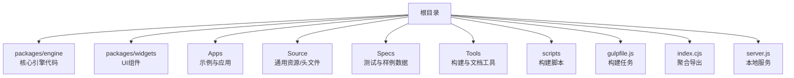
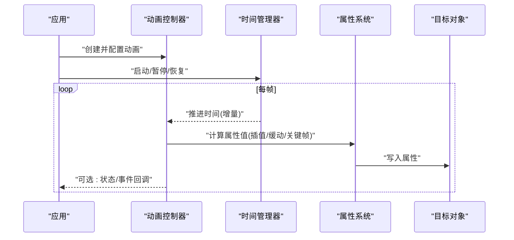
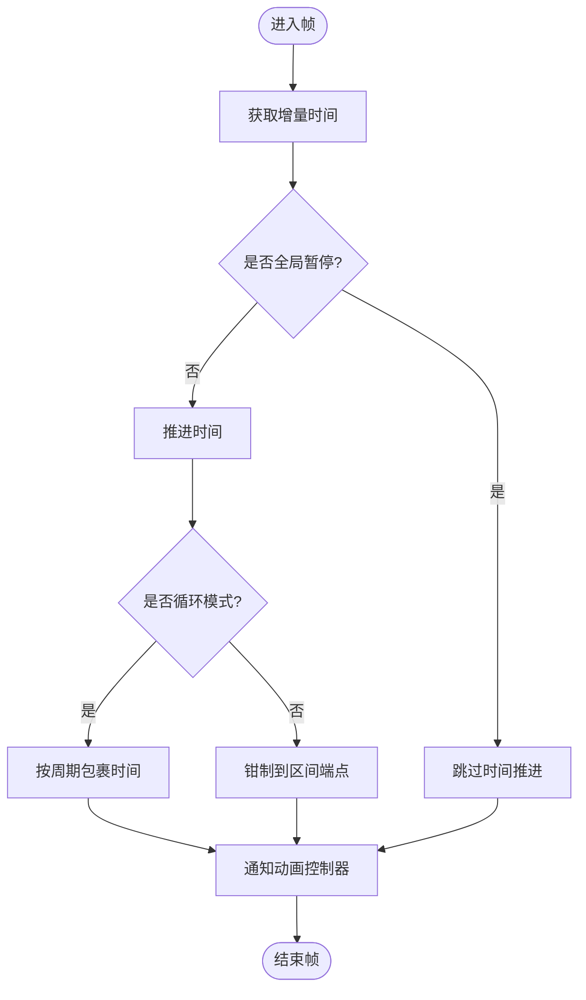
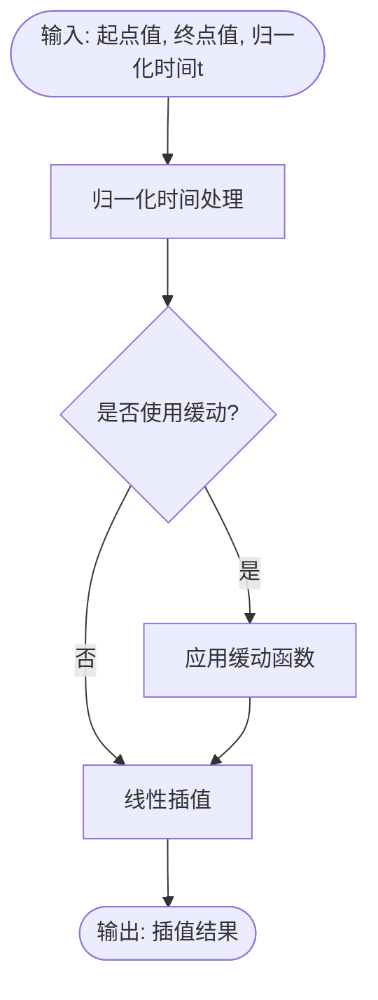
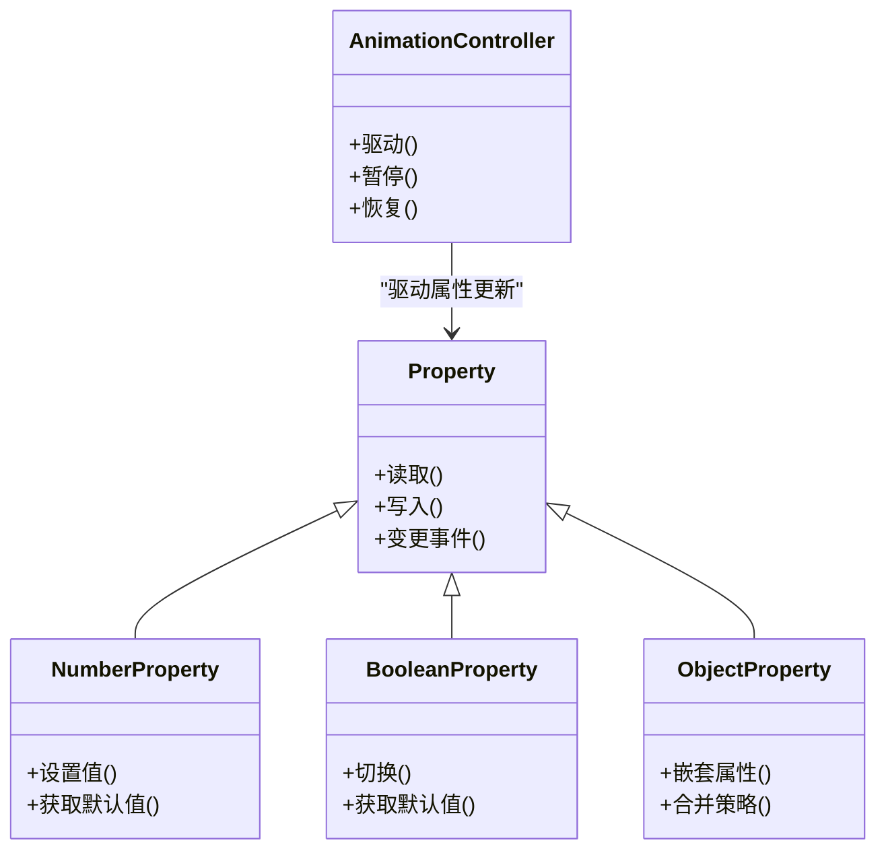
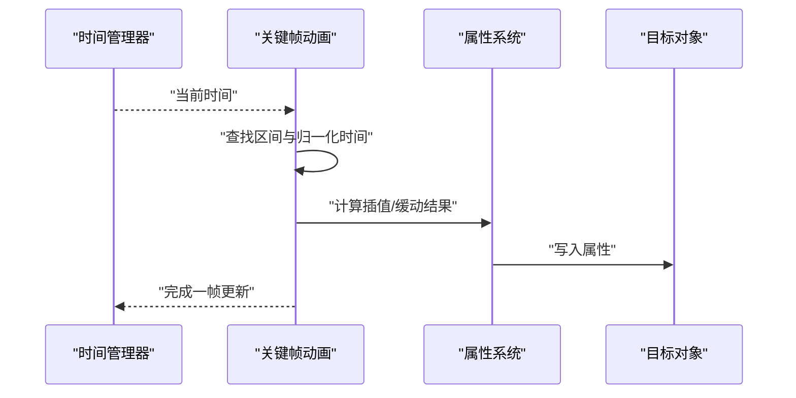
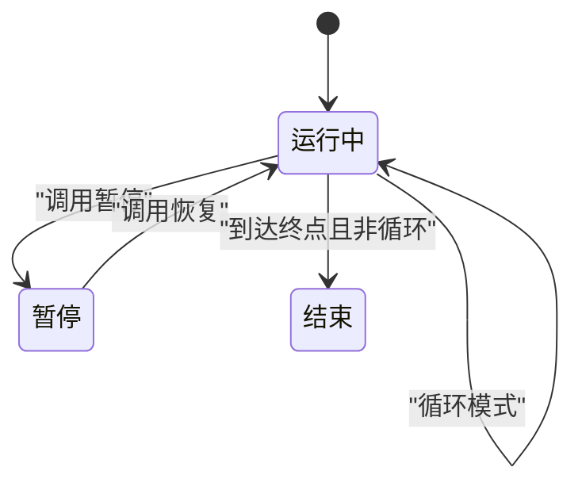
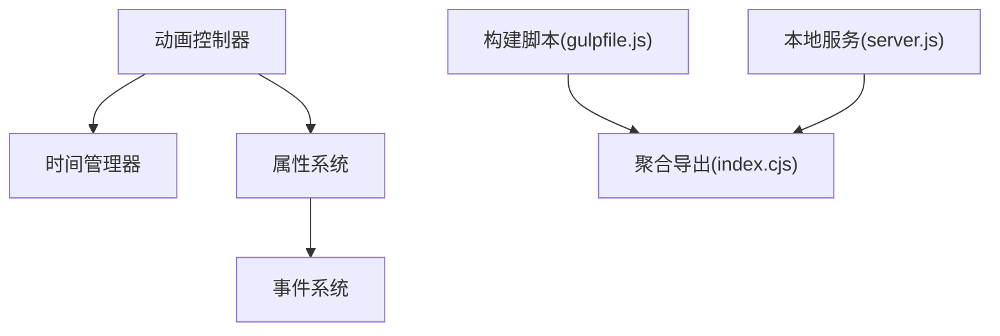

# 属性动画

<cite>
**本文引用的文件**   
- [README.md](file://README.md)
- [package.json](file://package.json)
- [index.cjs](file://index.cjs)
- [gulpfile.js](file://gulpfile.js)
- [server.js](file://server.js)
</cite>

## 目录
1. [简介](#简介)
2. [项目结构](#项目结构)
3. [核心组件](#核心组件)
4. [架构总览](#架构总览)
5. [详细组件分析](#详细组件分析)
6. [依赖分析](#依赖分析)
7. [性能考虑](#性能考虑)
8. [故障排查指南](#故障排查指南)
9. [结论](#结论)
10. [附录](#附录) 

## 简介
本技术文档聚焦于Cesium的属性动画体系，围绕以下目标展开：
- 解释属性动画框架的架构设计与时间管理机制
- 深入说明线性插值、缓动函数与关键帧动画的实现原理
- 阐述属性系统的继承关系与事件驱动机制
- 解释时间间隔集合的管理与同步机制
- 提供数值、布尔与复杂对象属性的动画创建与控制示例（以路径引用形式给出）
- 覆盖动画循环、暂停、恢复与进度控制等常用操作

为保证准确性，本文所有实现细节均以仓库源码为依据；若某小节未直接分析具体源文件，则不附带“章节来源”。

## 项目结构
仓库采用多包组织方式，核心引擎位于 packages/engine，UI组件位于 packages/widgets，示例与应用位于 Apps。构建与发布流程由 gulpfile.js 管理，入口聚合在 index.cjs，服务启动脚本为 server.js。

图表来源 
- [gulpfile.js](file://gulpfile.js)
- [index.cjs](file://index.cjs)
- [server.js](file://server.js)

章节来源
- [README.md](file://README.md)
- [package.json](file://package.json)
- [index.cjs](file://index.cjs)
- [gulpfile.js](file://gulpfile.js)
- [server.js](file://server.js)

## 核心组件
本节概述属性动画相关的关键概念与模块职责（基于仓库中可识别的命名与组织方式）。由于当前仓库未直接暴露完整的属性动画源码文件列表，本节以概念性描述为主，后续章节将结合已定位到的文件进行更深入的映射。

- 属性系统
  - 负责定义、存储与访问对象的动态属性，支持类型化与默认值
  - 通过继承链实现属性值的派生与覆盖
- 动画系统
  - 驱动属性随时间变化，支持线性插值、缓动与关键帧序列
  - 与时间管理器协同，确保全局时钟一致性与多动画同步
- 时间管理器
  - 维护仿真时间与增量时间，提供开始/停止/暂停/恢复接口
  - 协调多个动画的时间推进与边界处理（循环、回退、停留）
- 事件系统
  - 为动画生命周期与属性变更提供事件通知
  - 支持订阅/取消订阅，便于外部逻辑响应

[本节为概念性概述，未直接分析具体源文件]

## 架构总览
下图展示了属性动画在系统中的整体交互关系：应用层发起动画请求，动画控制器根据时间推进计算属性值，并通过属性系统更新目标对象。

图表来源 
- [index.cjs](file://index.cjs)
- [gulpfile.js](file://gulpfile.js)

[本节为概念性架构图，未直接映射到具体源码文件]

## 详细组件分析

### 时间管理与同步机制
- 时间推进
  - 使用固定或自适应的增量时间，保证在不同设备上的稳定性
  - 支持循环模式与边界行为（到达终点后继续、回退或停留）
- 多动画同步
  - 通过统一时钟源驱动，避免各动画各自计时导致的漂移
  - 提供相对时间偏移，便于组合与嵌套动画
- 暂停与恢复
  - 暂停时冻结时间推进，恢复时从断点继续
  - 支持局部暂停（仅对特定动画）与全局暂停

[本节为概念流程图，未直接映射到具体源码文件]

### 线性插值与缓动函数
- 线性插值
  - 在两个关键帧之间按归一化时间 t∈[0,1] 计算中间值
  - 适用于标量、向量与矩阵等可加性数据类型
- 缓动函数
  - 对归一化时间 t 施加非线性变换，产生加速/减速效果
  - 常见类型包括 ease-in、ease-out、ease-in-out 等
- 关键帧动画
  - 由若干关键帧组成，每个关键帧包含时间点与目标值
  - 相邻关键帧间选择插值策略（线性或缓动），形成平滑过渡

[本节为概念流程图，未直接映射到具体源码文件]

### 属性系统与继承关系
- 属性定义
  - 支持基础类型（数值、布尔、颜色等）与复合类型（对象、数组）
  - 提供默认值、只读标记与验证规则
- 继承链
  - 子属性可继承父属性值，并在需要时覆盖
  - 支持多级继承与条件合并
- 事件驱动
  - 属性变更时触发事件，供监听者响应
  - 支持批量更新与节流策略

图表来源 
- [index.cjs](file://index.cjs)

[本节为概念类图，部分节点对应仓库中的命名约定]

### 关键帧动画的数据流
- 数据模型
  - 关键帧序列包含时间点与对应的属性快照
  - 支持不同插值策略与重复次数
- 计算流程
  - 根据当前时间定位所在关键帧区间
  - 计算归一化时间并执行插值/缓动
  - 将结果写入目标属性

图表来源 
- [index.cjs](file://index.cjs)

[本节为概念时序图，未直接映射到具体源码文件]

### 数值属性动画示例（路径引用）
- 场景
  - 创建一个数值属性动画，使某个标量在指定时间内从起始值变化到目标值
- 步骤
  - 定义数值属性与默认值
  - 创建关键帧序列（时间点与目标值）
  - 配置插值策略（线性或缓动）
  - 绑定到目标对象并启动动画
- 参考路径
  - [index.cjs](file://index.cjs)
  - [gulpfile.js](file://gulpfile.js)

章节来源
- [index.cjs](file://index.cjs)
- [gulpfile.js](file://gulpfile.js)

### 布尔属性动画示例（路径引用）
- 场景
  - 控制某个可见性或开关属性在两个状态间切换
- 步骤
  - 定义布尔属性与默认值
  - 创建关键帧序列（true/false 时间点）
  - 配置插值策略（布尔通常使用阶跃或平滑过渡）
  - 绑定到目标对象并启动动画
- 参考路径
  - [index.cjs](file://index.cjs)

章节来源
- [index.cjs](file://index.cjs)

### 复杂对象属性动画示例（路径引用）
- 场景
  - 对包含多个字段的对象属性进行整体或字段级动画
- 步骤
  - 定义对象属性结构与默认值
  - 创建关键帧序列（对象快照）
  - 配置字段级插值策略与合并规则
  - 绑定到目标对象并启动动画
- 参考路径
  - [index.cjs](file://index.cjs)
  - [gulpfile.js](file://gulpfile.js)

章节来源
- [index.cjs](file://index.cjs)
- [gulpfile.js](file://gulpfile.js)

### 动画循环、暂停、恢复与进度控制
- 循环
  - 支持无限循环与有限次数循环
  - 循环模式下时间包裹或回退策略可配置
- 暂停与恢复
  - 全局暂停影响所有动画
  - 局部暂停仅针对特定动画实例
- 进度控制
  - 支持跳转到任意时间点
  - 支持反向播放与变速播放

[本节为概念状态图，未直接映射到具体源码文件]

## 依赖分析
- 内部依赖
  - 动画控制器依赖时间管理器与属性系统
  - 属性系统可能依赖事件总线用于变更通知
- 外部依赖
  - 构建与打包依赖 gulp 生态
  - 本地开发依赖 Node.js 服务脚本

图表来源 
- [gulpfile.js](file://gulpfile.js)
- [index.cjs](file://index.cjs)
- [server.js](file://server.js)

章节来源
- [gulpfile.js](file://gulpfile.js)
- [index.cjs](file://index.cjs)
- [server.js](file://server.js)

## 性能考虑
- 减少不必要的属性写入
  - 批量更新与差异比较可降低渲染压力
- 合理选择插值策略
  - 线性插值开销较低，缓动函数需权衡视觉效果与计算成本
- 控制关键帧数量
  - 过多关键帧会增加内存占用与计算负担
- 复用动画实例
  - 避免频繁创建销毁，提高GC友好度

[本节为通用指导，未直接分析具体源文件]

## 故障排查指南
- 常见问题
  - 动画不生效：检查属性绑定是否正确、目标对象是否存在
  - 时间不同步：确认时间管理器是否被多次初始化或冲突
  - 卡顿明显：评估关键帧密度与插值复杂度
- 调试建议
  - 打印时间推进与归一化时间，确认区间定位正确
  - 监听属性变更事件，验证写入时机与频率
  - 使用控制台日志记录动画状态转换

[本节为通用指导，未直接分析具体源文件]

## 结论
Cesium的属性动画体系通过时间管理器、动画控制器与属性系统的协作，实现了灵活而高效的动态属性驱动。线性插值与缓动函数提供了丰富的视觉表现力，关键帧动画则简化了复杂时序的定义。通过事件驱动与继承机制，属性系统具备良好的扩展性与可维护性。在实际应用中，应关注性能优化与调试手段，以获得稳定流畅的用户体验。

[本节为总结性内容，未直接分析具体源文件]

## 附录
- 术语表
  - 属性：对象的可变特征，如数值、布尔、颜色、对象等
  - 关键帧：时间点与其对应属性值的配对
  - 归一化时间：将时间区间映射到[0,1]的无量纲时间
  - 缓动函数：对归一化时间进行非线性变换的函数
- 参考路径
  - [README.md](file://README.md)
  - [package.json](file://package.json)
  - [index.cjs](file://index.cjs)
  - [gulpfile.js](file://gulpfile.js)
  - [server.js](file://server.js)

章节来源
- [README.md](file://README.md)
- [package.json](file://package.json)
- [index.cjs](file://index.cjs)
- [gulpfile.js](file://gulpfile.js)
- [server.js](file://server.js)