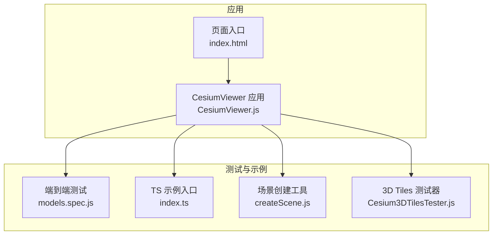
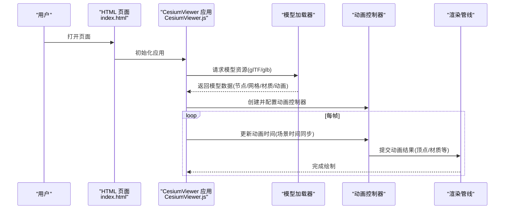
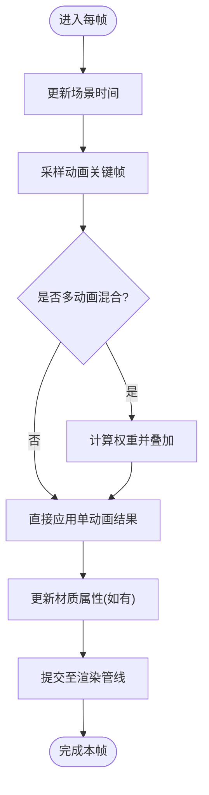
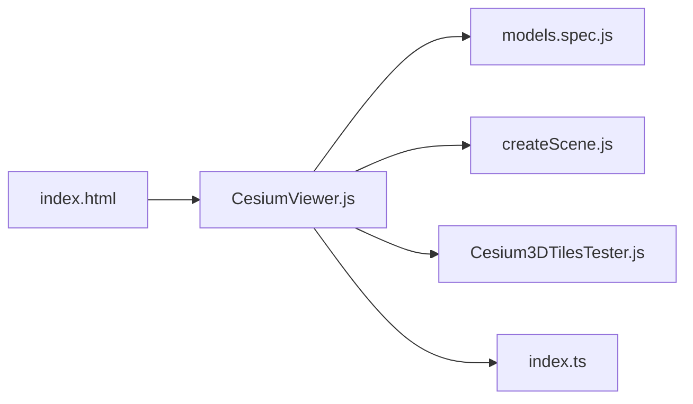

# 模型动画

<cite>
**本文引用的文件**   
- [Cesium3DTilesTester.js](file://Specs/Cesium3DTilesTester.js)
- [createScene.js](file://Specs/createScene.js)
- [models.spec.js](file://Specs/e2e/models.spec.js)
- [index.ts](file://Specs/TypeScript/index.ts)
- [CesiumViewer.js](file://Apps/CesiumViewer/CesiumViewer.js)
- [index.html](file://Apps/CesiumViewer/index.html)
</cite>

## 目录
1. [简介](#简介)
2. [项目结构](#项目结构)
3. [核心组件](#核心组件)
4. [架构总览](#架构总览)
5. [详细组件分析](#详细组件分析)
6. [依赖分析](#依赖分析)
7. [性能考虑](#性能考虑)
8. [故障排查指南](#故障排查指南)
9. [结论](#结论)
10. [附录](#附录)

## 简介
本技术文档聚焦于Cesium中glTF模型动画的加载与播放机制，涵盖骨骼动画、变换动画与材质动画的处理方式；阐述动画状态管理（混合、权重与时序同步）、资源缓存与优化策略；解释模型动画与场景时间的同步机制；并提供丰富的示例路径，帮助读者快速上手单动画播放、多动画混合、事件监听与自定义控制。同时给出性能优化技巧与内存管理最佳实践，便于在复杂场景中稳定高效地运行模型动画。

## 项目结构
仓库采用分层组织：应用示例位于 Apps，测试与样例数据位于 Specs，引擎与UI库位于 packages。与模型动画相关的入口与示例主要分布在以下位置：
- 应用示例：CesiumViewer 应用用于演示加载与展示模型的能力
- 端到端测试：e2e/models.spec.js 覆盖模型相关行为
- TypeScript 示例：Specs/TypeScript/index.ts 提供类型化使用参考
- 测试工具：Specs/Cesium3DTilesTester.js 与 createScene.js 提供场景与测试辅助

图表来源
- [CesiumViewer.js:1-200](file://Apps/CesiumViewer/CesiumViewer.js#L1-L200)
- [index.html:1-200](file://Apps/CesiumViewer/index.html#L1-L200)
- [models.spec.js:1-200](file://Specs/e2e/models.spec.js#L1-L200)
- [index.ts:1-200](file://Specs/TypeScript/index.ts#L1-L200)
- [createScene.js:1-200](file://Specs/createScene.js#L1-L200)
- [Cesium3DTilesTester.js:1-200](file://Specs/Cesium3DTilesTester.js#L1-L200)

章节来源
- [CesiumViewer.js:1-200](file://Apps/CesiumViewer/CesiumViewer.js#L1-L200)
- [index.html:1-200](file://Apps/CesiumViewer/index.html#L1-L200)
- [models.spec.js:1-200](file://Specs/e2e/models.spec.js#L1-L200)
- [index.ts:1-200](file://Specs/TypeScript/index.ts#L1-L200)
- [createScene.js:1-200](file://Specs/createScene.js#L1-L200)
- [Cesium3DTilesTester.js:1-200](file://Specs/Cesium3DTilesTester.js#L1-L200)

## 核心组件
围绕模型动画的核心能力，通常涉及如下职责划分：
- 模型加载与解析：负责读取 glTF/glb 资源，构建节点树、网格、材质与动画片段
- 动画控制器：维护动画时间线、播放状态、混合权重与循环策略
- 渲染管线集成：将动画结果（顶点、法线、UV、材质属性等）注入到每帧渲染
- 资源缓存：对已加载的模型与动画数据进行复用，避免重复解码与上传
- 场景时间同步：将系统时钟或外部时间源映射为动画时间，支持暂停、快进、倒放

在本仓库中，上述能力通过应用层与测试用例进行组合与验证。例如：
- 应用层通过 CesiumViewer 初始化并加载模型，驱动动画播放
- e2e 测试覆盖模型加载、交互与动画相关断言
- TS 示例提供类型化的调用方式，便于理解 API 边界与参数约束

章节来源
- [CesiumViewer.js:1-200](file://Apps/CesiumViewer/CesiumViewer.js#L1-L200)
- [models.spec.js:1-200](file://Specs/e2e/models.spec.js#L1-L200)
- [index.ts:1-200](file://Specs/TypeScript/index.ts#L1-L200)

## 架构总览
下图展示了从页面到模型动画播放的整体流程，包括资源加载、动画状态管理与渲染同步的关键环节。

图表来源
- [index.html:1-200](file://Apps/CesiumViewer/index.html#L1-L200)
- [CesiumViewer.js:1-200](file://Apps/CesiumViewer/CesiumViewer.js#L1-L200)

## 详细组件分析

### 模型加载与动画资源解析
- 目标：将 glTF 中的节点层次、网格几何、材质与动画片段解析为可播放的内部表示
- 关键点：
  - 节点与层级：确保父子关系正确，以便变换动画按层级传播
  - 网格与材质：将动画驱动的顶点/UV/颜色等属性与材质通道绑定
  - 动画片段：识别关键帧插值模式（线性、阶跃、贝塞尔），计算每帧采样点
- 示例路径：
  - 应用层加载与初始化：[CesiumViewer.js:1-200](file://Apps/CesiumViewer/CesiumViewer.js#L1-L200)
  - 端到端测试中对模型的断言与交互：[models.spec.js:1-200](file://Specs/e2e/models.spec.js#L1-L200)
  - TypeScript 类型化用法参考：[index.ts:1-200](file://Specs/TypeScript/index.ts#L1-L200)

章节来源
- [CesiumViewer.js:1-200](file://Apps/CesiumViewer/CesiumViewer.js#L1-L200)
- [models.spec.js:1-200](file://Specs/e2e/models.spec.js#L1-L200)
- [index.ts:1-200](file://Specs/TypeScript/index.ts#L1-L200)

### 动画控制器与状态管理
- 目标：统一管理多个动画片段的播放、混合、权重与时序
- 关键能力：
  - 单动画播放：设置起止时间、循环模式、播放速率
  - 多动画混合：按权重叠加不同动画的影响，实现动作过渡
  - 时序同步：将场景时间映射为动画时间，支持暂停、快进、倒放
  - 事件监听：在关键帧或状态变化时触发回调（如开始、结束、切换）
- 示例路径：
  - 场景创建与控制器初始化：[createScene.js:1-200](file://Specs/createScene.js#L1-L200)
  - 3D Tiles 测试器中的动画相关逻辑：[Cesium3DTilesTester.js:1-200](file://Specs/Cesium3DTilesTester.js#L1-L200)

章节来源
- [createScene.js:1-200](file://Specs/createScene.js#L1-L200)
- [Cesium3DTilesTester.js:1-200](file://Specs/Cesium3DTilesTester.js#L1-L200)

### 渲染管线集成与时间同步
- 目标：将动画结果应用到渲染阶段，并与场景时间保持一致
- 关键点：
  - 每帧更新：根据当前时间计算各动画采样点，合并后写入 GPU 缓冲
  - 材质动画：更新材质属性（如颜色、粗糙度、金属度、纹理偏移）
  - 变换动画：更新节点矩阵，影响子节点的最终变换
- 示例路径：
  - 应用层驱动渲染循环：[CesiumViewer.js:1-200](file://Apps/CesiumViewer/CesiumViewer.js#L1-L200)
  - 页面生命周期与初始化：[index.html:1-200](file://Apps/CesiumViewer/index.html#L1-L200)

章节来源
- [CesiumViewer.js:1-200](file://Apps/CesiumViewer/CesiumViewer.js#L1-L200)
- [index.html:1-200](file://Apps/CesiumViewer/index.html#L1-L200)

### 动画流程图（概念性）
下面的流程图概括了“单动画播放”的典型步骤，便于理解整体处理顺序。

[此图为概念性流程，不直接映射具体源码文件]

## 依赖分析
模型动画涉及的模块耦合关系如下：
- 应用层（CesiumViewer）依赖页面入口（index.html）进行初始化
- 应用层依赖测试工具（createScene.js、Cesium3DTilesTester.js）以构造场景与执行断言
- 端到端测试（models.spec.js）与应用层协同，验证模型与动画行为
- TypeScript 示例（index.ts）提供类型化接口参考，辅助开发者正确使用

图表来源
- [index.html:1-200](file://Apps/CesiumViewer/index.html#L1-L200)
- [CesiumViewer.js:1-200](file://Apps/CesiumViewer/CesiumViewer.js#L1-L200)
- [models.spec.js:1-200](file://Specs/e2e/models.spec.js#L1-L200)
- [createScene.js:1-200](file://Specs/createScene.js#L1-L200)
- [Cesium3DTilesTester.js:1-200](file://Specs/Cesium3DTilesTester.js#L1-L200)
- [index.ts:1-200](file://Specs/TypeScript/index.ts#L1-L200)

章节来源
- [index.html:1-200](file://Apps/CesiumViewer/index.html#L1-L200)
- [CesiumViewer.js:1-200](file://Apps/CesiumViewer/CesiumViewer.js#L1-L200)
- [models.spec.js:1-200](file://Specs/e2e/models.spec.js#L1-L200)
- [createScene.js:1-200](file://Specs/createScene.js#L1-L200)
- [Cesium3DTilesTester.js:1-200](file://Specs/Cesium3DTilesTester.js#L1-L200)
- [index.ts:1-200](file://Specs/TypeScript/index.ts#L1-L200)

## 性能考虑
- 资源缓存与复用
  - 对相同 glTF/glb 路径进行去重，避免重复下载与解码
  - 共享材质与纹理对象，减少 GPU 内存占用
- 动画采样优化
  - 合理设置关键帧密度，避免过密导致采样开销过大
  - 对静态或低频变化的动画降低更新频率
- 混合与权重
  - 限制同时混合的动画数量，优先使用过渡与淡入淡出减少突变
- 渲染批次
  - 合并同材质网格，减少 draw call
- 内存管理
  - 及时释放不再使用的模型与动画资源
  - 监控 GPU 内存峰值，必要时降级或延迟加载

[本节为通用指导，不直接分析具体源码文件]

## 故障排查指南
- 常见问题定位
  - 模型未显示：检查资源路径与跨域策略，确认页面初始化成功
  - 动画不播放：确认动画控制器已创建且时间更新正常
  - 混合异常：检查权重范围与动画时长对齐情况
- 调试建议
  - 在关键帧采样与权重计算处添加日志输出
  - 使用浏览器开发者工具的 Performance 面板分析帧耗时
  - 针对特定模型进行最小复现，逐步缩小问题范围
- 参考示例路径
  - 应用层初始化与错误处理：[CesiumViewer.js:1-200](file://Apps/CesiumViewer/CesiumViewer.js#L1-L200)
  - 端到端测试中的断言与用例：[models.spec.js:1-200](file://Specs/e2e/models.spec.js#L1-L200)
  - 场景工具与测试器：[createScene.js:1-200](file://Specs/createScene.js#L1-L200)、[Cesium3DTilesTester.js:1-200](file://Specs/Cesium3DTilesTester.js#L1-L200)

章节来源
- [CesiumViewer.js:1-200](file://Apps/CesiumViewer/CesiumViewer.js#L1-L200)
- [models.spec.js:1-200](file://Specs/e2e/models.spec.js#L1-L200)
- [createScene.js:1-200](file://Specs/createScene.js#L1-L200)
- [Cesium3DTilesTester.js:1-200](file://Specs/Cesium3DTilesTester.js#L1-L200)

## 结论
通过对仓库中应用与测试文件的梳理，可以清晰看到模型动画从加载、解析、状态管理到渲染集成的完整链路。结合场景时间同步、资源缓存与性能优化策略，能够在复杂场景中稳定高效地呈现骨骼、变换与材质动画。建议在实际项目中遵循本文提供的最佳实践，并结合测试用例进行持续验证与回归。

[本节为总结性内容，不直接分析具体源码文件]

## 附录
- 示例与参考路径
  - 单动画播放：参考应用层初始化与控制器配置
    - [CesiumViewer.js:1-200](file://Apps/CesiumViewer/CesiumViewer.js#L1-L200)
  - 多动画混合：参考场景工具与测试器中的混合逻辑
    - [createScene.js:1-200](file://Specs/createScene.js#L1-L200)
    - [Cesium3DTilesTester.js:1-200](file://Specs/Cesium3DTilesTester.js#L1-L200)
  - 动画事件监听：参考端到端测试中的断言与回调
    - [models.spec.js:1-200](file://Specs/e2e/models.spec.js#L1-L200)
  - 自定义动画控制：参考 TypeScript 示例的类型化用法
    - [index.ts:1-200](file://Specs/TypeScript/index.ts#L1-L200)
  - 页面生命周期与初始化：参考页面入口
    - [index.html:1-200](file://Apps/CesiumViewer/index.html#L1-L200)

[本节为补充信息，不直接分析具体源码文件]