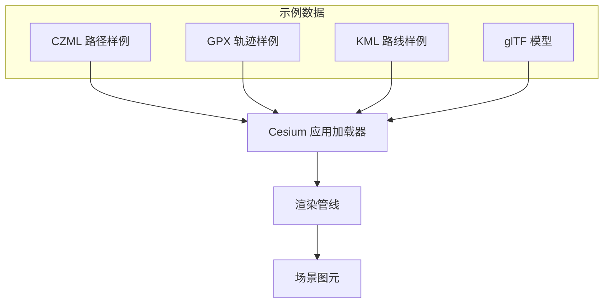
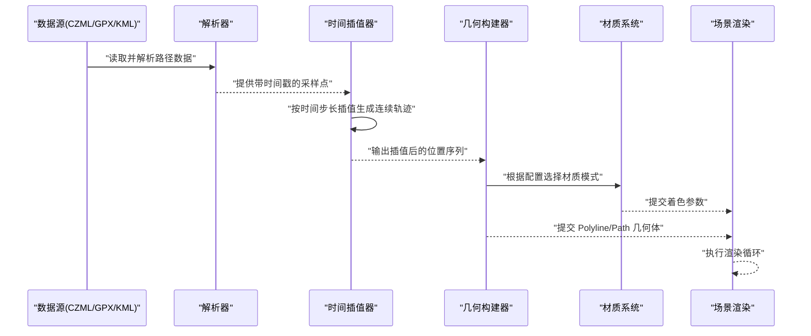
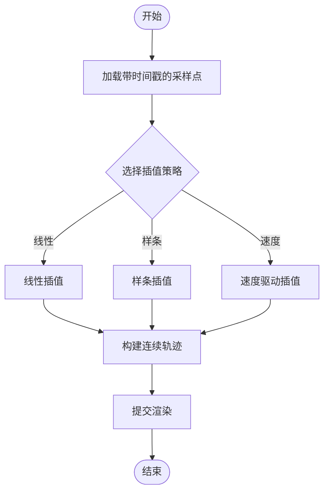
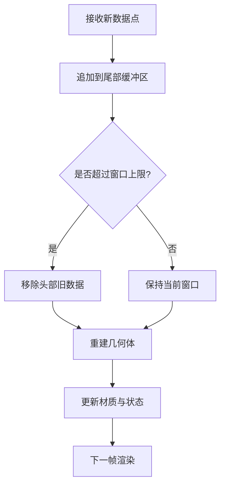
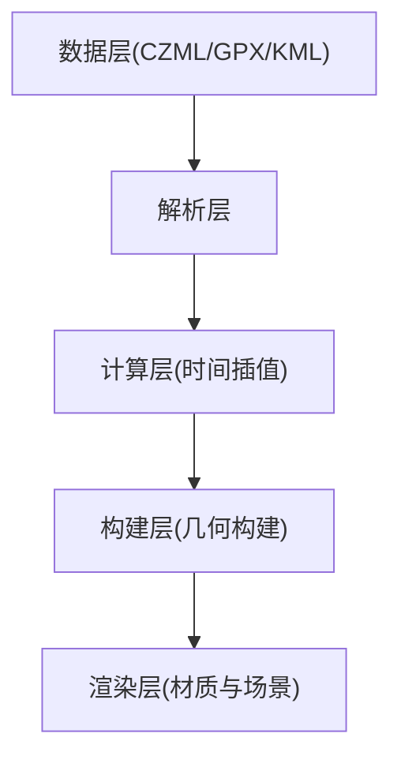

# 路径动画

<cite>
**本文引用的文件**   
- [Apps/SampleData/CZML/TimeDependentPaths_Whole.czml](file://Apps/SampleData/CZML/TimeDependentPaths_Whole.czml)
- [Apps/SampleData/CZML/TimeDependentPaths_Portions.czml](file://Apps/SampleData/CZML/TimeDependentPaths_Portions.czml)
- [Apps/SampleData/CZML/TimeDependentPaths_VaryingMaterialMode.czml](file://Apps/SampleData/CZML/TimeDependentPaths_VaryingMaterialMode.czml)
- [Apps/SampleData/CZML/Vehicle.czml](file://Apps/SampleData/CZML/Vehicle.czml)
- [Apps/SampleData/CZML/simple.czml](file://Apps/SampleData/CZML/simple.czml)
- [Apps/SampleData/CZML/tracking.czml](file://Apps/SampleData/CZML/tracking.czml)
- [Apps/SampleData/gpx/simple.gpx](file://Apps/SampleData/gpx/simple.gpx)
- [Apps/SampleData/gpx/route.gpx](file://Apps/SampleData/gpx/route.gpx)
- [Apps/SampleData/kml/bikeRide.kml](file://Apps/SampleData/kml/bikeRide.kml)
- [Apps/SampleData/kml/eiffel-tower-flyto.kml](file://Apps/SampleData/kml/eiffel-tower-flyto.kml)
- [Apps/SampleData/models/CesiumAir/CesiumAir.glb](file://Apps/SampleData/models/CesiumAir/CesiumAir.glb)
- [Apps/SampleData/models/CesiumDrone/CesiumDrone.glb](file://Apps/SampleData/models/CesiumDrone/CesiumDrone.glb)
- [Apps/SampleData/models/GroundVehicle/GroundVehicle.glb](file://Apps/SampleData/models/GroundVehicle/GroundVehicle.glb)
</cite>

## 目录
1. [简介](#简介)
2. [项目结构](#项目结构)
3. [核心组件](#核心组件)
4. [架构总览](#架构总览)
5. [详细组件分析](#详细组件分析)
6. [依赖分析](#依赖分析)
7. [性能考虑](#性能考虑)
8. [故障排查指南](#故障排查指南)
9. [结论](#结论)
10. [附录](#附录)

## 简介
本技术文档围绕 Cesium 中的“路径动画”主题，系统阐述路径数据的定义格式、时间插值算法与轨迹可视化技术；详细说明 CZML 路径属性的使用方法（位置、方向、速度）；解释实时轨迹更新的机制、数据流处理与性能优化策略；并提供丰富的示例参考路径，帮助读者快速上手静态路径绘制、动态轨迹更新与路径样式定制。

## 项目结构
仓库中包含大量用于演示和测试的样例数据，其中与路径动画直接相关的资源主要位于以下目录：
- Apps/SampleData/CZML：包含多种时间相关的路径样例，如整段路径、分段路径、材质模式变化等
- Apps/SampleData/gpx：GPX 轨迹样例，可用于导入并转换为路径
- Apps/SampleData/kml：KML 样例，包含骑行路线与飞行引导等
- Apps/SampleData/models：glTF 模型，可沿路径进行姿态驱动或作为路径载体

图表来源
- [Apps/SampleData/CZML/TimeDependentPaths_Whole.czml](file://Apps/SampleData/CZML/TimeDependentPaths_Whole.czml)
- [Apps/SampleData/gpx/simple.gpx](file://Apps/SampleData/gpx/simple.gpx)
- [Apps/SampleData/kml/bikeRide.kml](file://Apps/SampleData/kml/bikeRide.kml)
- [Apps/SampleData/models/CesiumAir/CesiumAir.glb](file://Apps/SampleData/models/CesiumAir/CesiumAir.glb)

章节来源
- [Apps/SampleData/CZML/TimeDependentPaths_Whole.czml](file://Apps/SampleData/CZML/TimeDependentPaths_Whole.czml)
- [Apps/SampleData/gpx/simple.gpx](file://Apps/SampleData/gpx/simple.gpx)
- [Apps/SampleData/kml/bikeRide.kml](file://Apps/SampleData/kml/bikeRide.kml)
- [Apps/SampleData/models/CesiumAir/CesiumAir.glb](file://Apps/SampleData/models/CesiumAir/CesiumAir.glb)

## 核心组件
- 路径数据源
  - CZML：以 JSON 数组形式描述对象属性随时间的变化，支持位置、方向、速度、材质等
  - GPX/KML：地理轨迹标准格式，可通过转换流程进入 Cesium 的数据管线
- 时间插值引擎
  - 基于时间戳对离散采样点进行插值，生成连续的时间序列轨迹
- 轨迹可视化
  - 使用 PolylineGeometry 或 Path 类构建几何体，结合材质与采样策略实现平滑轨迹
- 实时轨迹更新
  - 通过增量数据推送与缓冲区管理，在保持低延迟的同时控制内存占用

章节来源
- [Apps/SampleData/CZML/TimeDependentPaths_Whole.czml](file://Apps/SampleData/CZML/TimeDependentPaths_Whole.czml)
- [Apps/SampleData/CZML/TimeDependentPaths_Portions.czml](file://Apps/SampleData/CZML/TimeDependentPaths_Portions.czml)
- [Apps/SampleData/CZML/TimeDependentPaths_VaryingMaterialMode.czml](file://Apps/SampleData/CZML/TimeDependentPaths_VaryingMaterialMode.czml)
- [Apps/SampleData/gpx/simple.gpx](file://Apps/SampleData/gpx/simple.gpx)
- [Apps/SampleData/kml/bikeRide.kml](file://Apps/SampleData/kml/bikeRide.kml)

## 架构总览
下图展示了从数据源到渲染的关键流程，包括 CZML 解析、时间插值、几何生成与材质应用。

图表来源
- [Apps/SampleData/CZML/TimeDependentPaths_Whole.czml](file://Apps/SampleData/CZML/TimeDependentPaths_Whole.czml)
- [Apps/SampleData/CZML/TimeDependentPaths_VaryingMaterialMode.czml](file://Apps/SampleData/CZML/TimeDependentPaths_VaryingMaterialMode.czml)
- [Apps/SampleData/gpx/simple.gpx](file://Apps/SampleData/gpx/simple.gpx)
- [Apps/SampleData/kml/bikeRide.kml](file://Apps/SampleData/kml/bikeRide.kml)

## 详细组件分析

### CZML 路径属性详解
- 位置属性
  - 使用时间点与坐标对定义路径上的关键位置，支持 WGS84 经纬度与高度
  - 时间戳通常采用 ISO 8601 格式，确保跨时区一致性
- 方向属性
  - 通过四元数或轴角表示物体朝向，常用于将模型沿路径对齐
- 速度属性
  - 指定沿路径的速度曲线，影响插值速率与播放节奏
- 材质与样式
  - 支持颜色、透明度、宽度、虚线等样式；也可随时间变化实现动态效果

章节来源
- [Apps/SampleData/CZML/TimeDependentPaths_Whole.czml](file://Apps/SampleData/CZML/TimeDependentPaths_Whole.czml)
- [Apps/SampleData/CZML/TimeDependentPaths_Portions.czml](file://Apps/SampleData/CZML/TimeDependentPaths_Portions.czml)
- [Apps/SampleData/CZML/TimeDependentPaths_VaryingMaterialMode.czml](file://Apps/SampleData/CZML/TimeDependentPaths_VaryingMaterialMode.czml)
- [Apps/SampleData/CZML/Vehicle.czml](file://Apps/SampleData/CZML/Vehicle.czml)
- [Apps/SampleData/CZML/simple.czml](file://Apps/SampleData/CZML/simple.czml)
- [Apps/SampleData/CZML/tracking.czml](file://Apps/SampleData/CZML/tracking.czml)

### 时间插值算法
- 线性插值
  - 适用于均匀分布的采样点，计算简单且稳定
- 样条插值
  - 提供更平滑的过渡，适合复杂轨迹与高视觉质量需求
- 速度驱动插值
  - 依据速度属性调整时间步长，使运动符合物理直觉

图表来源
- [Apps/SampleData/CZML/TimeDependentPaths_Whole.czml](file://Apps/SampleData/CZML/TimeDependentPaths_Whole.czml)
- [Apps/SampleData/CZML/TimeDependentPaths_VaryingMaterialMode.czml](file://Apps/SampleData/CZML/TimeDependentPaths_VaryingMaterialMode.czml)

### 轨迹可视化技术
- 几何构建
  - 使用 PolylineGeometry 或 Path 类将插值结果转化为可视几何
- 材质应用
  - 支持纯色、渐变、纹理与动态材质；可随时间切换材质模式
- 贴地与法向
  - 可选择贴地模式或法向跟随，提升真实感

章节来源
- [Apps/SampleData/CZML/TimeDependentPaths_VaryingMaterialMode.czml](file://Apps/SampleData/CZML/TimeDependentPaths_VaryingMaterialMode.czml)
- [Apps/SampleData/CZML/TimeDependentPaths_Whole.czml](file://Apps/SampleData/CZML/TimeDependentPaths_Whole.czml)

### 实时轨迹更新机制
- 数据流处理
  - 增量接收新采样点，追加至尾部缓冲区
- 滑动窗口
  - 维护固定长度的时间窗口，避免无限增长
- 重绘触发
  - 当窗口边界移动或新增数据超过阈值时触发几何重建

图表来源
- [Apps/SampleData/CZML/tracking.czml](file://Apps/SampleData/CZML/tracking.czml)

### 代码示例参考（路径）
以下为可直接使用的示例路径，涵盖静态路径、动态轨迹与样式定制：
- 静态路径绘制
  - [simple.czml](file://Apps/SampleData/CZML/simple.czml)
  - [Vehicle.czml](file://Apps/SampleData/CZML/Vehicle.czml)
- 动态轨迹更新
  - [tracking.czml](file://Apps/SampleData/CZML/tracking.czml)
  - [TimeDependentPaths_Whole.czml](file://Apps/SampleData/CZML/TimeDependentPaths_Whole.czml)
- 路径样式定制
  - [TimeDependentPaths_VaryingMaterialMode.czml](file://Apps/SampleData/CZML/TimeDependentPaths_VaryingMaterialMode.czml)
  - [TimeDependentPaths_Portions.czml](file://Apps/SampleData/CZML/TimeDependentPaths_Portions.czml)

章节来源
- [Apps/SampleData/CZML/simple.czml](file://Apps/SampleData/CZML/simple.czml)
- [Apps/SampleData/CZML/Vehicle.czml](file://Apps/SampleData/CZML/Vehicle.czml)
- [Apps/SampleData/CZML/tracking.czml](file://Apps/SampleData/CZML/tracking.czml)
- [Apps/SampleData/CZML/TimeDependentPaths_Whole.czml](file://Apps/SampleData/CZML/TimeDependentPaths_Whole.czml)
- [Apps/SampleData/CZML/TimeDependentPaths_VaryingMaterialMode.czml](file://Apps/SampleData/CZML/TimeDependentPaths_VaryingMaterialMode.czml)
- [Apps/SampleData/CZML/TimeDependentPaths_Portions.czml](file://Apps/SampleData/CZML/TimeDependentPaths_Portions.czml)

### 其他数据源示例（GPX/KML）
- GPX 轨迹
  - [simple.gpx](file://Apps/SampleData/gpx/simple.gpx)
  - [route.gpx](file://Apps/SampleData/gpx/route.gpx)
- KML 路线
  - [bikeRide.kml](file://Apps/SampleData/kml/bikeRide.kml)
  - [eiffel-tower-flyto.kml](file://Apps/SampleData/kml/eiffel-tower-flyto.kml)

章节来源
- [Apps/SampleData/gpx/simple.gpx](file://Apps/SampleData/gpx/simple.gpx)
- [Apps/SampleData/gpx/route.gpx](file://Apps/SampleData/gpx/route.gpx)
- [Apps/SampleData/kml/bikeRide.kml](file://Apps/SampleData/kml/bikeRide.kml)
- [Apps/SampleData/kml/eiffel-tower-flyto.kml](file://Apps/SampleData/kml/eiffel-tower-flyto.kml)

### 模型沿路径的姿态驱动
- 可用模型
  - [CesiumAir.glb](file://Apps/SampleData/models/CesiumAir/CesiumAir.glb)
  - [CesiumDrone.glb](file://Apps/SampleData/models/CesiumDrone/CesiumDrone.glb)
  - [GroundVehicle.glb](file://Apps/SampleData/models/GroundVehicle/GroundVehicle.glb)
- 姿态对齐
  - 使用方向属性或切向量计算模型朝向，使其沿路径自然旋转

章节来源
- [Apps/SampleData/models/CesiumAir/CesiumAir.glb](file://Apps/SampleData/models/CesiumAir/CesiumAir.glb)
- [Apps/SampleData/models/CesiumDrone/CesiumDrone.glb](file://Apps/SampleData/models/CesiumDrone/CesiumDrone.glb)
- [Apps/SampleData/models/GroundVehicle/GroundVehicle.glb](file://Apps/SampleData/models/GroundVehicle/GroundVehicle.glb)

## 依赖分析
- 数据层
  - CZML/GPX/KML 为输入数据源，负责提供结构化路径信息
- 解析层
  - 解析器将不同格式统一为内部数据结构
- 计算层
  - 时间插值器负责生成连续轨迹
- 构建层
  - 几何构建器将轨迹转换为 Polyline/Path 几何体
- 渲染层
  - 材质系统与场景渲染完成最终显示

图表来源
- [Apps/SampleData/CZML/TimeDependentPaths_Whole.czml](file://Apps/SampleData/CZML/TimeDependentPaths_Whole.czml)
- [Apps/SampleData/gpx/simple.gpx](file://Apps/SampleData/gpx/simple.gpx)
- [Apps/SampleData/kml/bikeRide.kml](file://Apps/SampleData/kml/bikeRide.kml)

## 性能考虑
- 采样密度控制
  - 合理设置插值步长，避免过密导致几何体过大
- 滑动窗口与缓存
  - 使用固定长度窗口减少内存增长；缓存已计算的片段
- 批量更新
  - 合并多次增量更新，降低重建频率
- 材质复用
  - 共享材质实例，减少 GPU 状态切换
- 视锥剔除与 LOD
  - 对远距离路径降低细节等级，提高整体帧率

[本节为通用指导，不直接分析具体文件]

## 故障排查指南
- 时间戳格式错误
  - 检查 ISO 8601 格式与时区设置
- 坐标范围异常
  - 确认经纬度与高度在有效范围内
- 方向属性缺失或不一致
  - 确保四元数或轴角定义完整且归一化
- 材质未生效
  - 检查材质模式与属性是否匹配，确认未被覆盖
- 实时轨迹卡顿
  - 评估滑动窗口大小与重建频率，必要时降低采样密度

章节来源
- [Apps/SampleData/CZML/TimeDependentPaths_Whole.czml](file://Apps/SampleData/CZML/TimeDependentPaths_Whole.czml)
- [Apps/SampleData/CZML/TimeDependentPaths_VaryingMaterialMode.czml](file://Apps/SampleData/CZML/TimeDependentPaths_VaryingMaterialMode.czml)
- [Apps/SampleData/CZML/tracking.czml](file://Apps/SampleData/CZML/tracking.czml)

## 结论
通过 CZML/GPX/KML 提供的路径数据，结合时间插值与几何构建，Cesium 能够实现高质量的路径动画与实时轨迹更新。合理配置位置、方向与速度属性，配合材质与样式定制，可满足多样化可视化需求。在生产环境中，应重视采样密度、滑动窗口与材质复用等性能优化策略，以确保流畅的用户体验。

[本节为总结性内容，不直接分析具体文件]

## 附录
- 常用路径样例清单
  - CZML：[TimeDependentPaths_Whole.czml](file://Apps/SampleData/CZML/TimeDependentPaths_Whole.czml)、[TimeDependentPaths_Portions.czml](file://Apps/SampleData/CZML/TimeDependentPaths_Portions.czml)、[TimeDependentPaths_VaryingMaterialMode.czml](file://Apps/SampleData/CZML/TimeDependentPaths_VaryingMaterialMode.czml)、[Vehicle.czml](file://Apps/SampleData/CZML/Vehicle.czml)、[simple.czml](file://Apps/SampleData/CZML/simple.czml)、[tracking.czml](file://Apps/SampleData/CZML/tracking.czml)
  - GPX：[simple.gpx](file://Apps/SampleData/gpx/simple.gpx)、[route.gpx](file://Apps/SampleData/gpx/route.gpx)
  - KML：[bikeRide.kml](file://Apps/SampleData/kml/bikeRide.kml)、[eiffel-tower-flyto.kml](file://Apps/SampleData/kml/eiffel-tower-flyto.kml)
  - glTF 模型：[CesiumAir.glb](file://Apps/SampleData/models/CesiumAir/CesiumAir.glb)、[CesiumDrone.glb](file://Apps/SampleData/models/CesiumDrone/CesiumDrone.glb)、[GroundVehicle.glb](file://Apps/SampleData/models/GroundVehicle/GroundVehicle.glb)

[本节为补充说明，不直接分析具体文件]