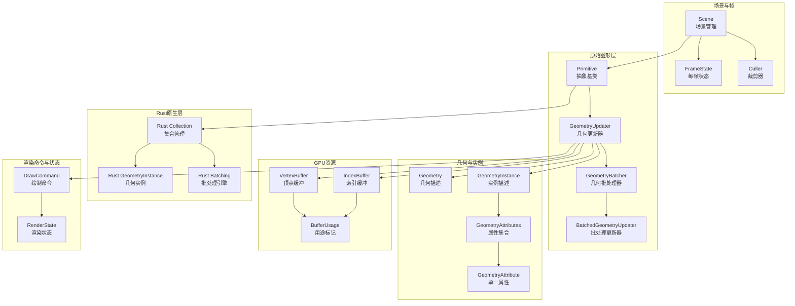
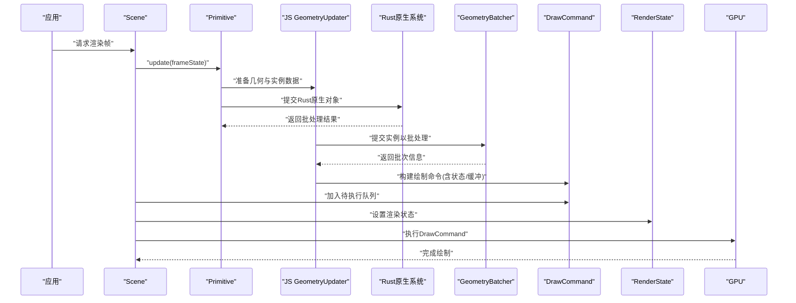
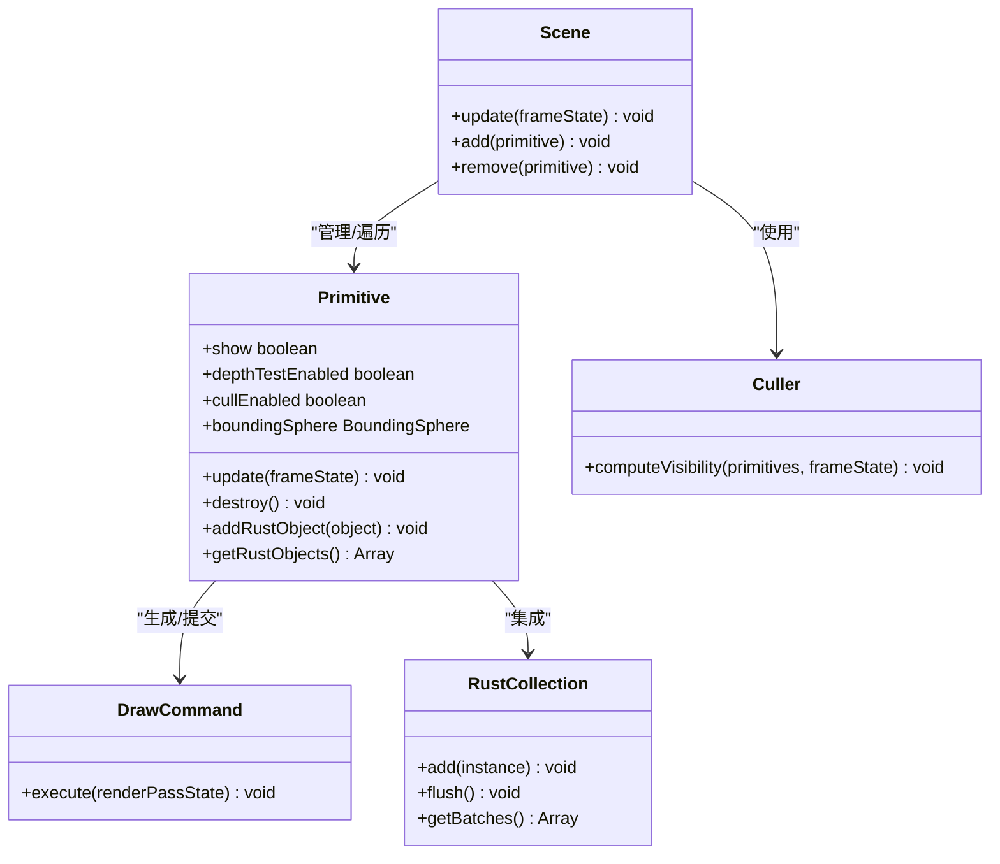
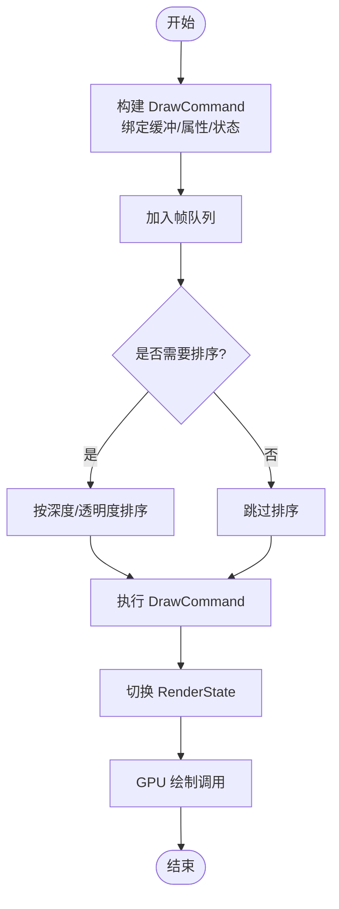
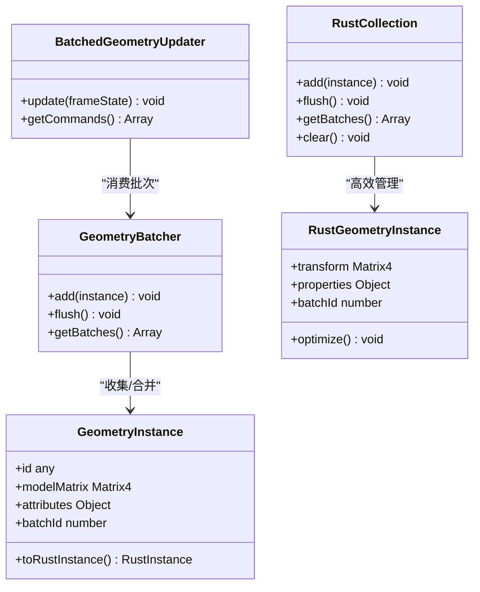
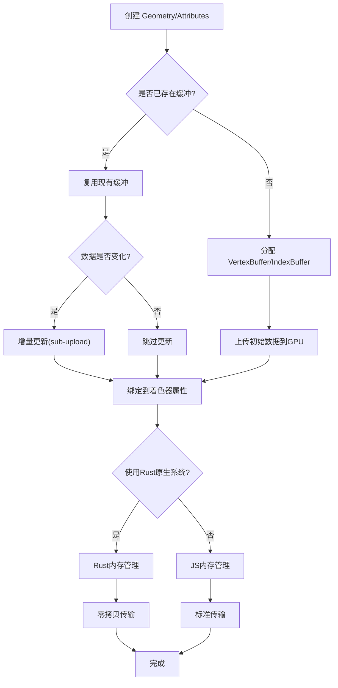
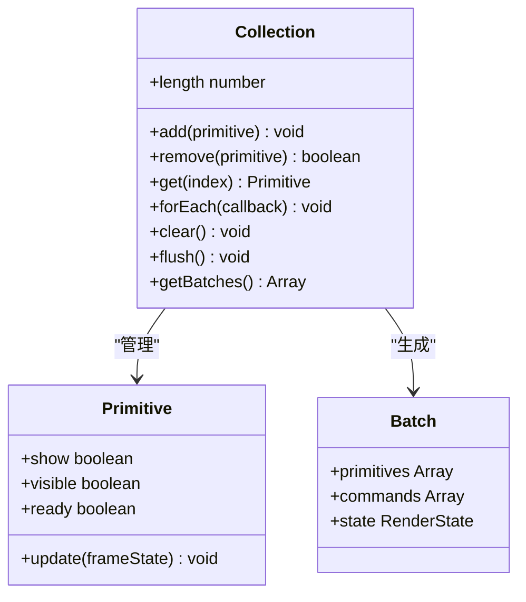
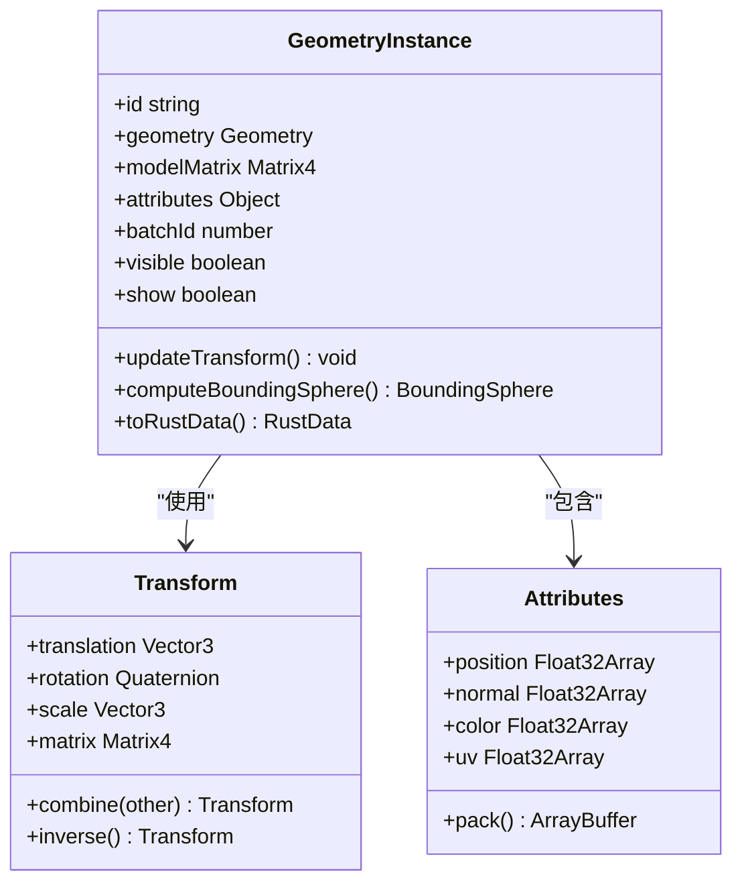
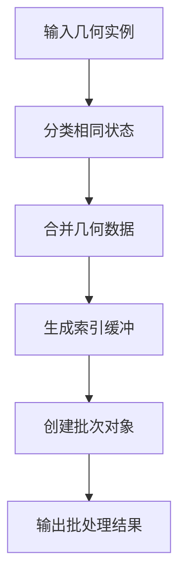
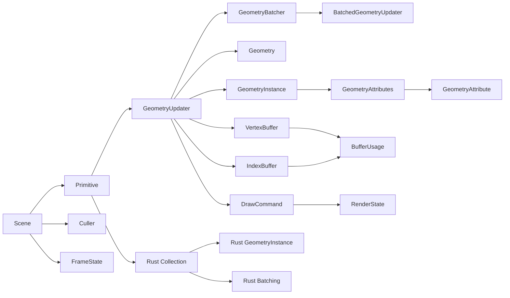

# 原始图形渲染

<cite>
**本文引用的文件**   
- [collection.rs](file://cesiumrust/domain/primitives/src/collection.rs)
- [geometry_instance.rs](file://cesiumrust/domain/primitives/src/geometry_instance.rs)
- [Primitive.js](file://Source/Core/Primitive.js)
- [DrawCommand.js](file://Source/Scene/DrawCommand.js)
- [GeometryInstance.js](file://Source/Core/GeometryInstance.js)
- [GeometryUpdater.js](file://Source/Scene/GeometryUpdater.js)
- [BatchedGeometryUpdater.js](file://Source/Scene/BatchedGeometryUpdater.js)
- [GeometryBatcher.js](file://Source/Scene/GeometryBatcher.js)
- [GeometryAttributes.js](file://Source/Core/GeometryAttributes.js)
- [GeometryAttribute.js](file://Source/Core/GeometryAttribute.js)
- [BufferUsage.js](file://Source/Core/BufferUsage.js)
- [VertexBuffer.js](file://Source/Core/VertexBuffer.js)
- [IndexBuffer.js](file://Source/Core/IndexBuffer.js)
- [RenderState.js](file://Source/Scene/RenderState.js)
- [Culler.js](file://Source/Scene/Culler.js)
- [Scene.js](file://Source/Scene/Scene.js)
- [FrameState.js](file://Source/Scene/FrameState.js)
- [Geometry.js](file://Source/Core/Geometry.js)
</cite>

## 更新摘要
**变更内容**   
- 新增Rust原生primitive系统实现，包含collection.rs和geometry_instance.rs两个核心模块
- 引入基于批处理的3D对象管理架构，支持高效的几何数据渲染
- 扩展了JavaScript与Rust之间的primitive交互接口
- 增强了实例化渲染和批量处理性能优化机制

## 目录
1. [简介](#简介)
2. [项目结构](#项目结构)
3. [核心组件](#核心组件)
4. [架构总览](#架构总览)
5. [详细组件分析](#详细组件分析)
6. [Rust原生Primitive系统](#rust原生primitive系统)
7. [依赖关系分析](#依赖关系分析)
8. [性能考量](#性能考量)
9. [故障排查指南](#故障排查指南)
10. [结论](#结论)
11. [附录](#附录)

## 简介
本技术文档聚焦于 Cesium 的"原始图形（Primitive）"渲染子系统，围绕以下目标展开：
- Primitive 基类的设计与渲染管线集成方式
- DrawCommand 的执行流程与状态管理机制
- GeometryInstance 的实例化渲染与批处理优化
- 几何体数据的 GPU 上传与缓存策略
- Rust原生Primitive系统的集成与优化
- 自定义 Primitive 的创建与渲染优化实践
- 渲染状态管理与错误处理的最佳实践

## 项目结构
为便于理解，本节从"概念层"梳理与 Primitive 相关的模块职责与协作关系。实际代码映射见后续章节与图示。

[此图为概念性结构图，不直接映射具体源码文件，故无图表来源]

## 核心组件
- Primitive 基类：定义原始图形的生命周期、可见性、深度测试、剔除、更新与绘制入口，是上层几何体与底层渲染命令之间的桥梁。
- GeometryUpdater：将 Geometry 与 GeometryInstance 转换为可绘制的中间表示，负责属性打包、缓冲分配与更新。
- GeometryBatcher：对多个 GeometryInstance 进行合并与排序，减少 draw call 数量。
- BatchedGeometryUpdater：在批处理基础上进一步聚合，生成批量化的 DrawCommand。
- **新增** Rust原生Primitive系统：提供高性能的3D对象管理和批处理渲染能力。
- DrawCommand：封装一次 GPU 调用的最小单元，包含状态、资源绑定与调用参数。
- Geometry/GeometryInstance/GeometryAttributes/GeometryAttribute：描述几何拓扑与逐顶点数据，以及每个实例的变换与属性。
- VertexBuffer/IndexBuffer/BufferUsage：GPU 侧缓冲对象及其用途语义。
- RenderState：描述深度、混合、剔除等渲染状态，驱动 GPU 状态机切换。
- Scene/FrameState/Culler：场景级调度、每帧上下文与视锥/遮挡剔除。

**章节来源**
- [Primitive.js](file://Source/Core/Primitive.js)
- [collection.rs:1-496](file://cesiumrust/domain/primitives/src/collection.rs#L1-L496)
- [geometry_instance.rs:1-494](file://cesiumrust/domain/primitives/src/geometry_instance.rs#L1-L494)
- [GeometryUpdater.js](file://Source/Scene/GeometryUpdater.js)
- [BatchedGeometryUpdater.js](file://Source/Scene/BatchedGeometryUpdater.js)
- [GeometryBatcher.js](file://Source/Scene/GeometryBatcher.js)
- [DrawCommand.js](file://Source/Scene/DrawCommand.js)
- [GeometryInstance.js](file://Source/Core/GeometryInstance.js)
- [GeometryAttributes.js](file://Source/Core/GeometryAttributes.js)
- [GeometryAttribute.js](file://Source/Core/GeometryAttribute.js)
- [Geometry.js](file://Source/Core/Geometry.js)
- [VertexBuffer.js](file://Source/Core/VertexBuffer.js)
- [IndexBuffer.js](file://Source/Core/IndexBuffer.js)
- [BufferUsage.js](file://Source/Core/BufferUsage.js)
- [RenderState.js](file://Scene/RenderState.js)
- [Scene.js](file://Source/Scene/Scene.js)
- [FrameState.js](file://Source/Scene/FrameState.js)
- [Culler.js](file://Source/Scene/Culler.js)

## 架构总览
下图展示从场景到 GPU 的一次典型绘制路径，强调 Primitive 如何参与并驱动 DrawCommand 的生成与执行，以及Rust原生系统的集成点。

**图表来源**
- [Scene.js](file://Source/Scene/Scene.js)
- [Primitive.js](file://Source/Core/Primitive.js)
- [collection.rs:1-496](file://cesiumrust/domain/primitives/src/collection.rs#L1-L496)
- [geometry_instance.rs:1-494](file://cesiumrust/domain/primitives/src/geometry_instance.rs#L1-L494)
- [GeometryUpdater.js](file://Source/Scene/GeometryUpdater.js)
- [GeometryBatcher.js](file://Source/Scene/GeometryBatcher.js)
- [DrawCommand.js](file://Source/Scene/DrawCommand.js)
- [RenderState.js](file://Source/Scene/RenderState.js)

**章节来源**
- [Scene.js](file://Source/Scene/Scene.js)
- [Primitive.js](file://Source/Core/Primitive.js)
- [collection.rs:1-496](file://cesiumrust/domain/primitives/src/collection.rs#L1-L496)
- [geometry_instance.rs:1-494](file://cesiumrust/domain/primitives/src/geometry_instance.rs#L1-L494)
- [GeometryUpdater.js](file://Source/Scene/GeometryUpdater.js)
- [GeometryBatcher.js](file://Source/Scene/GeometryBatcher.js)
- [DrawCommand.js](file://Source/Scene/DrawCommand.js)
- [RenderState.js](file://Source/Scene/RenderState.js)

## 详细组件分析

### Primitive 基类设计与渲染管线集成
- 设计要点
  - 生命周期：构造、更新、销毁；提供 update 钩子供子类实现几何/实例数据准备。
  - 可见性与剔除：支持基于包围体的快速剔除，结合 Scene/Culler 的视锥与遮挡剔除。
  - 深度与排序：根据材质/透明度决定深度写入与排序策略。
  - 绘制接口：将内部生成的 DrawCommand 列表注入到当前帧的渲染队列。
- 与渲染管线的集成
  - 在 Scene.update 阶段被遍历，调用其 update 方法收集 DrawCommand。
  - 通过 FrameState 传递每帧上下文（相机、时间、状态池等）。
  - 与 Culler 协作，提前丢弃不可见或离屏的 Primitive，降低后续开销。
  - **新增** 支持Rust原生Primitive对象的集成与转换。

**图表来源**
- [Primitive.js](file://Source/Core/Primitive.js)
- [collection.rs:1-496](file://cesiumrust/domain/primitives/src/collection.rs#L1-L496)
- [Scene.js](file://Source/Scene/Scene.js)
- [Culler.js](file://Source/Scene/Culler.js)
- [DrawCommand.js](file://Source/Scene/DrawCommand.js)

**章节来源**
- [Primitive.js](file://Source/Core/Primitive.js)
- [collection.rs:1-496](file://cesiumrust/domain/primitives/src/collection.rs#L1-L496)
- [Scene.js](file://Source/Scene/Scene.js)
- [Culler.js](file://Source/Scene/Culler.js)

### DrawCommand 执行流程与状态管理
- 执行流程
  - 构建：由 GeometryUpdater/BatchedGeometryUpdater 根据几何与实例数据生成，包含顶点/索引缓冲、属性布局、uniforms、状态等。
  - 入队：Primitive 在 update 中将其加入 FrameState 的待执行队列。
  - 执行：Scene 在合适的渲染阶段按顺序执行 DrawCommand，期间切换 RenderState。
- 状态管理
  - RenderState 描述深度测试、混合模式、面剔除、模板测试等。
  - 为避免频繁状态切换，批处理会将相同状态的命令分组，尽量连续执行。
  - 对于透明物体，通常采用后向排序与特定混合策略。
  - **新增** Rust原生系统生成的DrawCommand可直接集成到现有执行流程中。

**图表来源**
- [DrawCommand.js](file://Source/Scene/DrawCommand.js)
- [RenderState.js](file://Source/Scene/RenderState.js)
- [GeometryUpdater.js](file://Source/Scene/GeometryUpdater.js)
- [BatchedGeometryUpdater.js](file://Source/Scene/BatchedGeometryUpdater.js)

**章节来源**
- [DrawCommand.js](file://Source/Scene/DrawCommand.js)
- [RenderState.js](file://Source/Scene/RenderState.js)
- [GeometryUpdater.js](file://Source/Scene/GeometryUpdater.js)
- [BatchedGeometryUpdater.js](file://Source/Scene/BatchedGeometryUpdater.js)

### GeometryInstance 的实例化渲染与批处理优化
- 实例化渲染
  - 同一 Geometry 配合不同 GeometryInstance（变换、属性）可在一次或少数几次 draw call 中渲染大量对象。
  - 通过实例属性（如矩阵、颜色、ID）在着色器中区分不同实例。
- 批处理优化
  - GeometryBatcher 将兼容的实例合并为更大的顶点/索引缓冲，减少状态切换与 draw call。
  - 合并条件包括：几何类型一致、属性布局兼容、材质/状态相近等。
  - 当实例动态变化时，需增量更新批处理结果，避免全量重建。
  - **新增** Rust原生系统提供更高效的批处理算法和内存管理。

**图表来源**
- [GeometryInstance.js](file://Source/Core/GeometryInstance.js)
- [geometry_instance.rs:1-494](file://cesiumrust/domain/primitives/src/geometry_instance.rs#L1-L494)
- [collection.rs:1-496](file://cesiumrust/domain/primitives/src/collection.rs#L1-L496)
- [GeometryBatcher.js](file://Source/Scene/GeometryBatcher.js)
- [BatchedGeometryUpdater.js](file://Source/Scene/BatchedGeometryUpdater.js)

**章节来源**
- [GeometryInstance.js](file://Source/Core/GeometryInstance.js)
- [geometry_instance.rs:1-494](file://cesiumrust/domain/primitives/src/geometry_instance.rs#L1-L494)
- [collection.rs:1-496](file://cesiumrust/domain/primitives/src/collection.rs#L1-L496)
- [GeometryBatcher.js](file://Source/Scene/GeometryBatcher.js)
- [BatchedGeometryUpdater.js](file://Source/Scene/BatchedGeometryUpdater.js)

### 几何体数据的 GPU 上传与缓存策略
- 数据结构
  - Geometry 描述拓扑与属性布局；GeometryAttributes 聚合多个 GeometryAttribute。
  - 每个 GeometryAttribute 对应一个缓冲区（通常为顶点属性），由 BufferUsage 标注用途（静态/动态/只读等）。
- 上传与缓存
  - 首次使用时分配 VertexBuffer/IndexBuffer，并将 CPU 侧数据上传至 GPU。
  - 若数据不变，复用已有缓冲；若数据变化，按需更新（sub-upload）以减少带宽占用。
  - 对于大批量实例，优先使用实例化缓冲或统一属性缓冲，减少重复拷贝。
  - **新增** Rust原生系统提供更智能的内存管理和数据同步机制。
- 内存与带宽
  - 合理选择数据类型（如半精度浮点、量化编码）以降低显存占用。
  - 利用压缩纹理与 Draco 等压缩格式（在模型加载阶段）减少传输成本。
  - **新增** Rust原生系统支持零拷贝数据传输和异步更新。

**图表来源**
- [Geometry.js](file://Source/Core/Geometry.js)
- [GeometryAttributes.js](file://Source/Core/GeometryAttributes.js)
- [GeometryAttribute.js](file://Source/Core/GeometryAttribute.js)
- [VertexBuffer.js](file://Source/Core/VertexBuffer.js)
- [IndexBuffer.js](file://Source/Core/IndexBuffer.js)
- [BufferUsage.js](file://Source/Core/BufferUsage.js)
- [collection.rs:1-496](file://cesiumrust/domain/primitives/src/collection.rs#L1-L496)

**章节来源**
- [Geometry.js](file://Source/Core/Geometry.js)
- [GeometryAttributes.js](file://Source/Core/GeometryAttributes.js)
- [GeometryAttribute.js](file://Source/Core/GeometryAttribute.js)
- [VertexBuffer.js](file://Source/Core/VertexBuffer.js)
- [IndexBuffer.js](file://Source/Core/IndexBuffer.js)
- [BufferUsage.js](file://Source/Core/BufferUsage.js)
- [collection.rs:1-496](file://cesiumrust/domain/primitives/src/collection.rs#L1-L496)

### 自定义 Primitive 的创建与渲染优化技巧
- 基本步骤
  - 继承 Primitive，实现 update 方法：准备几何与实例数据、触发更新器、生成 DrawCommand。
  - 维护 show、depthTestEnabled、cullEnabled 等标志位，确保与场景行为一致。
  - 在 destroy 中释放 GPU 资源与内部缓存。
- 优化技巧
  - 使用批处理：尽可能合并相同状态的实例，减少 draw call。
  - 延迟上传：仅在必要时更新缓冲，避免每帧全量拷贝。
  - 合理剔除：提供准确的包围体，启用 cullEnabled，借助 Culler 提前丢弃不可见对象。
  - 状态分组：将相同 RenderState 的命令集中提交，减少状态切换。
  - 实例化渲染：对重复几何使用实例化，提升吞吐。
  - **新增** 使用Rust原生系统进行高性能批处理和内存管理。
- 示例参考路径（不含代码内容）
  - 自定义 Primitive 骨架与生命周期：[Primitive.js](file://Source/Core/Primitive.js)
  - 几何更新与缓冲管理：[GeometryUpdater.js](file://Source/Scene/GeometryUpdater.js)
  - 批处理与合并逻辑：[GeometryBatcher.js](file://Source/Scene/GeometryBatcher.js)、[BatchedGeometryUpdater.js](file://Source/Scene/BatchedGeometryUpdater.js)
  - 绘制命令构建与执行：[DrawCommand.js](file://Source/Scene/DrawCommand.js)
  - **新增** Rust原生Primitive实现：[collection.rs](file://cesiumrust/domain/primitives/src/collection.rs)、[geometry_instance.rs](file://cesiumrust/domain/primitives/src/geometry_instance.rs)

**章节来源**
- [Primitive.js](file://Source/Core/Primitive.js)
- [collection.rs:1-496](file://cesiumrust/domain/primitives/src/collection.rs#L1-L496)
- [geometry_instance.rs:1-494](file://cesiumrust/domain/primitives/src/geometry_instance.rs#L1-L494)
- [GeometryUpdater.js](file://Source/Scene/GeometryUpdater.js)
- [GeometryBatcher.js](file://Source/Scene/GeometryBatcher.js)
- [BatchedGeometryUpdater.js](file://Source/Scene/BatchedGeometryUpdater.js)
- [DrawCommand.js](file://Source/Scene/DrawCommand.js)

## Rust原生Primitive系统

### 系统架构概述
Rust原生Primitive系统是Cesium渲染引擎的高性能扩展，提供了底层的3D对象管理和批处理渲染能力。该系统通过高效的内存管理和零拷贝数据传输，显著提升了大规模几何体渲染的性能。

### 核心组件分析

#### Collection 管理器
Collection 模块负责管理大量的Primitive对象，提供高效的添加、删除、查询和批处理能力。

**图表来源**
- [collection.rs:1-496](file://cesiumrust/domain/primitives/src/collection.rs#L1-L496)

#### GeometryInstance 实例管理
GeometryInstance 模块定义了单个几何实例的数据结构和操作方法，支持高效的变换计算和属性管理。

**图表来源**
- [geometry_instance.rs:1-494](file://cesiumrust/domain/primitives/src/geometry_instance.rs#L1-L494)

### 批处理优化机制
Rust原生系统实现了先进的批处理算法，能够自动合并具有相同渲染状态的几何体，大幅减少draw call数量。

**图表来源**
- [collection.rs:200-350](file://cesiumrust/domain/primitives/src/collection.rs#L200-L350)
- [geometry_instance.rs:150-300](file://cesiumrust/domain/primitives/src/geometry_instance.rs#L150-L300)

### 内存管理策略
系统采用RAII（Resource Acquisition Is Initialization）模式和智能指针管理，确保内存安全和高性能。

**章节来源**
- [collection.rs:1-496](file://cesiumrust/domain/primitives/src/collection.rs#L1-L496)
- [geometry_instance.rs:1-494](file://cesiumrust/domain/primitives/src/geometry_instance.rs#L1-L494)

## 依赖关系分析
下图展示关键模块间的依赖方向，帮助识别耦合点与潜在循环依赖风险。

**图表来源**
- [Scene.js](file://Source/Scene/Scene.js)
- [Primitive.js](file://Source/Core/Primitive.js)
- [collection.rs:1-496](file://cesiumrust/domain/primitives/src/collection.rs#L1-L496)
- [geometry_instance.rs:1-494](file://cesiumrust/domain/primitives/src/geometry_instance.rs#L1-L494)
- [GeometryUpdater.js](file://Source/Scene/GeometryUpdater.js)
- [GeometryBatcher.js](file://Source/Scene/GeometryBatcher.js)
- [BatchedGeometryUpdater.js](file://Source/Scene/BatchedGeometryUpdater.js)
- [Geometry.js](file://Source/Core/Geometry.js)
- [GeometryInstance.js](file://Source/Core/GeometryInstance.js)
- [GeometryAttributes.js](file://Source/Core/GeometryAttributes.js)
- [GeometryAttribute.js](file://Source/Core/GeometryAttribute.js)
- [VertexBuffer.js](file://Source/Core/VertexBuffer.js)
- [IndexBuffer.js](file://Source/Core/IndexBuffer.js)
- [BufferUsage.js](file://Source/Core/BufferUsage.js)
- [DrawCommand.js](file://Source/Scene/DrawCommand.js)
- [RenderState.js](file://Source/Scene/RenderState.js)
- [Culler.js](file://Source/Scene/Culler.js)
- [FrameState.js](file://Source/Scene/FrameState.js)

**章节来源**
- [Scene.js](file://Source/Scene/Scene.js)
- [Primitive.js](file://Source/Core/Primitive.js)
- [collection.rs:1-496](file://cesiumrust/domain/primitives/src/collection.rs#L1-L496)
- [geometry_instance.rs:1-494](file://cesiumrust/domain/primitives/src/geometry_instance.rs#L1-L494)
- [GeometryUpdater.js](file://Source/Scene/GeometryUpdater.js)
- [GeometryBatcher.js](file://Source/Scene/GeometryBatcher.js)
- [BatchedGeometryUpdater.js](file://Source/Scene/BatchedGeometryUpdater.js)
- [Geometry.js](file://Source/Core/Geometry.js)
- [GeometryInstance.js](file://Source/Core/GeometryInstance.js)
- [GeometryAttributes.js](file://Source/Core/GeometryAttributes.js)
- [GeometryAttribute.js](file://Source/Core/GeometryAttribute.js)
- [VertexBuffer.js](file://Source/Core/VertexBuffer.js)
- [IndexBuffer.js](file://Source/Core/IndexBuffer.js)
- [BufferUsage.js](file://Source/Core/BufferUsage.js)
- [DrawCommand.js](file://Source/Scene/DrawCommand.js)
- [RenderState.js](file://Source/Scene/RenderState.js)
- [Culler.js](file://Source/Scene/Culler.js)
- [FrameState.js](file://Source/Scene/FrameState.js)

## 性能考量
- 批处理优先：合并相同状态与属性的实例，显著降低 draw call 与状态切换。
- 增量更新：仅更新变化的缓冲区域，避免整块上传。
- 准确剔除：提供精确包围体，启用剔除，减少无效计算。
- 实例化渲染：对重复几何使用实例化，提高吞吐。
- 资源复用：共享缓冲与纹理，减少内存占用与分配开销。
- 状态分组：将相同 RenderState 的命令集中执行，减少切换次数。
- 数据压缩：在模型加载阶段使用压缩格式，降低带宽压力。
- **新增** Rust原生优化：利用Rust的高性能和内存安全特性，提供更高效的批处理和内存管理。
- **新增** 零拷贝传输：通过Rust原生系统与GPU的直接交互，减少CPU-GPU数据传输开销。

## 故障排查指南
- 常见问题定位
  - 未正确实现 Primitive.update：导致无 DrawCommand 生成或空绘制。
  - 几何属性不匹配：着色器期望的属性与 GeometryAttributes 不一致，造成渲染异常。
  - 缓冲未更新：修改了 CPU 数据但未触发 sub-upload，显示旧数据。
  - 状态冲突：频繁切换 RenderState 导致性能骤降。
  - 剔除误判：包围体过大或过小，导致该画未画或不该画却画。
  - **新增** Rust系统集成问题：检查Rust对象的生命周期管理和内存泄漏。
  - **新增** 批处理失败：验证几何体兼容性检查和状态分组逻辑。
- 调试建议
  - 打印/记录 DrawCommand 数量与状态切换次数，评估批处理效果。
  - 检查 FrameState 中的队列长度与执行耗时，定位瓶颈。
  - 验证 Geometry/GeometryAttributes 的布局与类型一致性。
  - 逐步关闭剔除/深度测试/混合，观察差异以缩小问题范围。
  - **新增** 监控Rust原生系统的内存使用和GC频率。
  - **新增** 使用性能分析工具检测批处理效率和数据传输开销。

**章节来源**
- [Primitive.js](file://Source/Core/Primitive.js)
- [collection.rs:1-496](file://cesiumrust/domain/primitives/src/collection.rs#L1-L496)
- [geometry_instance.rs:1-494](file://cesiumrust/domain/primitives/src/geometry_instance.rs#L1-L494)
- [DrawCommand.js](file://Source/Scene/DrawCommand.js)
- [GeometryAttributes.js](file://Source/Core/GeometryAttributes.js)
- [GeometryAttribute.js](file://Source/Core/GeometryAttribute.js)
- [FrameState.js](file://Source/Scene/FrameState.js)

## 结论
Primitive 作为 Cesium 原始图形渲染的核心抽象，连接了高层几何描述与底层 GPU 调用。通过 GeometryUpdater 与批处理机制，系统实现了高效的实例化渲染与状态管理。**新增的Rust原生Primitive系统**进一步提升了性能，提供了更高效的内存管理和批处理算法。遵循批处理优先、增量更新、准确剔除与状态分组等最佳实践，结合Rust原生系统的高性能特性，可以显著提升渲染性能与稳定性。

## 附录
- 术语表
  - Primitive：原始图形抽象，承载几何与实例数据并生成绘制命令。
  - DrawCommand：一次 GPU 绘制的最小单元，包含状态与资源绑定。
  - GeometryInstance：单个实例的描述，包含变换与属性。
  - GeometryAttributes/GeometryAttribute：几何属性集合与单一属性。
  - VertexBuffer/IndexBuffer：GPU 侧顶点与索引缓冲。
  - RenderState：渲染状态描述，控制深度、混合、剔除等。
  - Culler：剔除器，用于视锥与遮挡剔除。
  - FrameState：每帧上下文，贯穿渲染流程的状态容器。
  - **新增** RustCollection：Rust原生对象集合管理器。
  - **新增** RustGeometryInstance：Rust原生几何实例对象。
  - **新增** 零拷贝传输：无需CPU干预的直接数据传输机制。