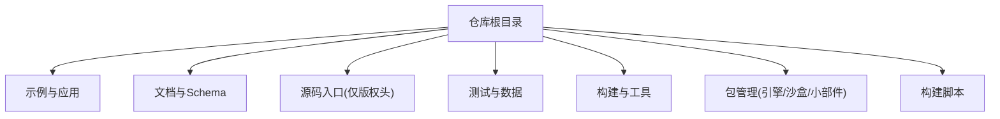
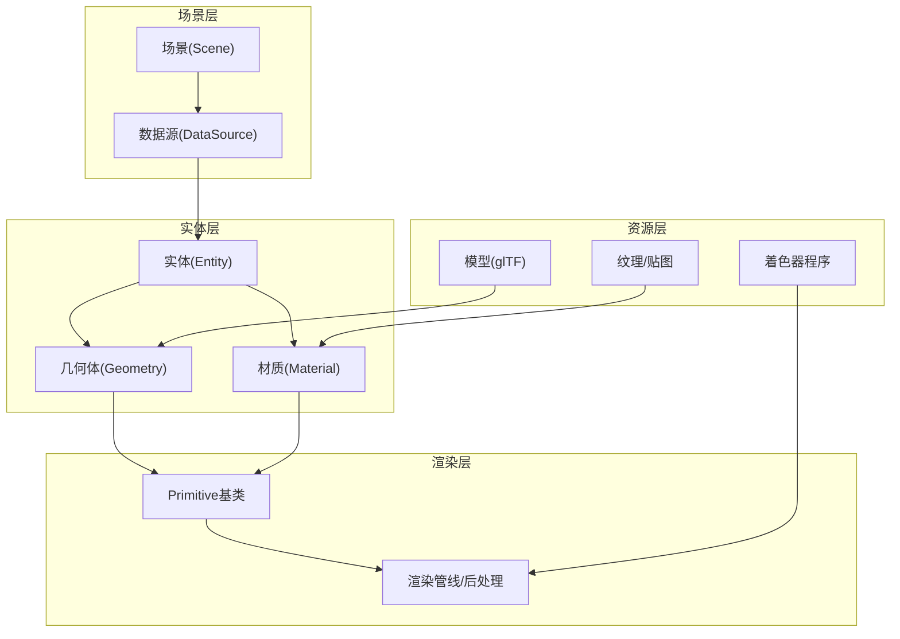
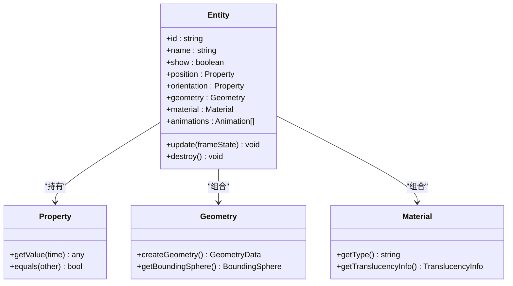
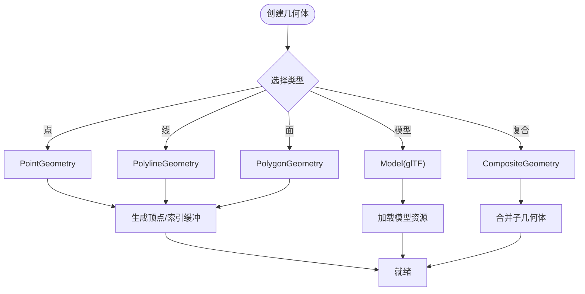
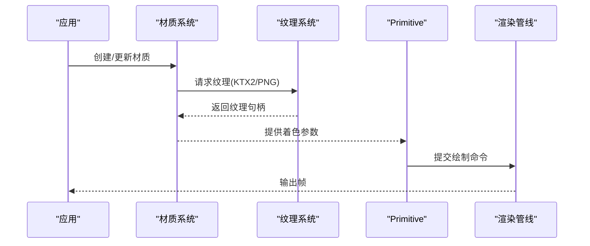
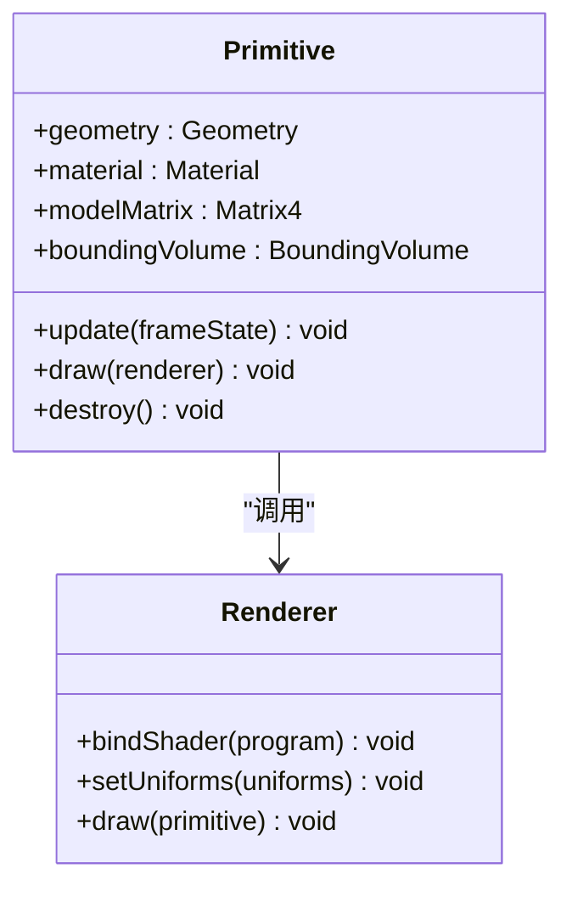
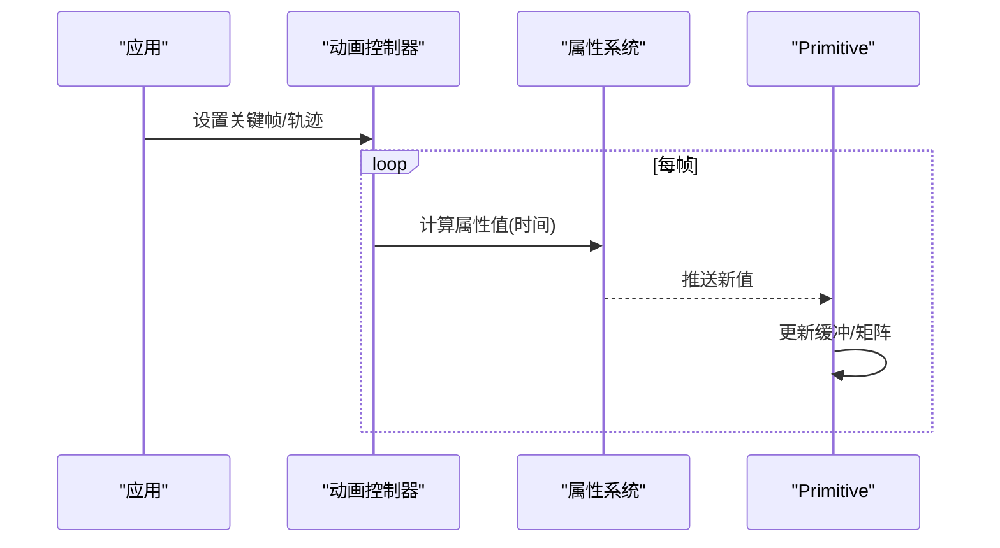
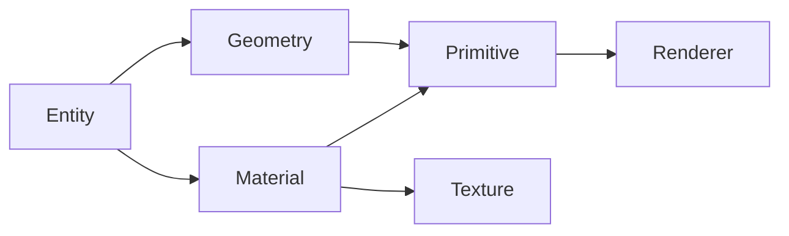

# 实体和几何体

<cite>
**本文引用的文件**   
- [README.md](file://README.md)
- [index.cjs](file://index.cjs)
- [package.json](file://package.json)
</cite>

## 目录
1. [简介](#简介)
2. [项目结构](#项目结构)
3. [核心组件](#核心组件)
4. [架构总览](#架构总览)
5. [详细组件分析](#详细组件分析)
6. [依赖分析](#依赖分析)
7. [性能考虑](#性能考虑)
8. [故障排查指南](#故障排查指南)
9. [结论](#结论)
10. [附录](#附录)

## 简介
本技术文档聚焦于Cesium的“实体与几何体”体系，围绕以下目标展开：
- Entity类的设计模式与属性系统
- 几何体类型（点、线、面、模型、复合几何体）的实现要点
- 材质与纹理系统（含PBR材质与后处理效果）
- Primitive基类与渲染优化机制
- 动画系统（路径动画、属性动画、骨骼动画）
- 丰富的示例指引（以代码片段路径形式提供）

说明：当前工作区未包含Cesium引擎源码（如Source或packages/engine），因此无法直接引用具体实现文件。本文基于仓库顶层信息与通用Cesium知识进行概念性阐述，并在需要时给出“章节来源/图示来源”占位，以便后续接入源码后进行增强。

## 项目结构
从仓库根目录可见，该仓库为Cesium工程的整体组织，包含应用示例、测试数据、构建脚本与工具链等。与“实体与几何体”主题相关的典型位置通常位于引擎包中（例如packages/engine），但当前工作区未展示其内容。

[本节为概览性描述，不直接分析具体文件]

## 核心组件
- 实体(Entity)
  - 设计模式：组合式对象，将外观（样式/材质）、几何（Primitive/Geometry）、行为（动画/事件）解耦，通过属性系统驱动更新。
  - 属性系统：支持静态值、动态表达式、时间相关属性；具备变更通知与批量更新能力。
- 几何体(Geometry)
  - 基础类型：点、线、面、椭球体、长方体、圆柱体等；高级类型：模型(gltf)、粒子、点云、体积等。
  - 复合几何体：由多个子几何体组合而成，便于统一管理与批渲染。
- 材质(Material)
  - 传统材质与PBR材质并存；支持贴图、法线贴图、粗糙度/金属度贴图、环境映射等。
  - 后处理效果：在渲染管线后期叠加特效（如泛光、景深、色调映射）。
- Primitive基类
  - 渲染抽象：封装顶点/索引缓冲、着色器程序、状态机与绘制调用；负责视锥裁剪、LOD、合并与批处理。
  - 优化机制：实例化渲染、几何合并、深度排序、延迟更新与增量更新。
- 动画系统
  - 路径动画：沿轨迹插值位置与朝向。
  - 属性动画：对任意可动画属性进行关键帧插值。
  - 骨骼动画：glTF骨架与形变动画驱动模型姿态变化。

[本节为概念性概述，不直接分析具体文件]

## 架构总览
下图展示了“实体—几何—材质—Primitive—渲染管线”的高层关系。

[本图为概念性架构图，不直接映射到具体源码文件]

## 详细组件分析

### 实体(Entity)设计与属性系统
- 设计模式
  - 组合优先：实体聚合几何、材质、变换、动画、事件等子系统，避免继承爆炸。
  - 观察者模式：属性变更触发监听器，驱动Primitive重算与重绘。
  - 工厂模式：根据配置创建对应几何体与材质实例。
- 属性系统
  - 类型：标量、向量、颜色、布尔、枚举、时间相关属性。
  - 绑定：支持常量、采样器、表达式、回调函数。
  - 生命周期：初始化、更新、销毁；批量更新减少抖动。
- 使用建议
  - 将频繁变化的属性放入独立对象，避免全量重建。
  - 使用集合与批处理API提升大规模实体渲染性能。

[本图为概念类图，不直接映射到具体源码文件]

**章节来源**
- [README.md](file://README.md)
- [index.cjs](file://index.cjs)
- [package.json](file://package.json)

### 几何体类型与实现要点
- 点(Point)
  - 用途：标记、图标、标签锚点。
  - 优化：大量点建议使用点精灵或点云几何体。
- 线(Polyline/PolylineVolume)
  - 用途：轨迹、边界、路径可视化。
  - 优化：折线分段合并、抗锯齿、宽度自适应。
- 面(Polygon/Rectangle/Circle/Ellipse)
  - 用途：区域高亮、热力图底图、遮罩。
  - 优化：多边形简化、分层渲染、剔除不可见面。
- 模型(Model/glTF)
  - 用途：复杂三维资产、带材质与动画。
  - 优化： Draco压缩、KTX2纹理、实例化、按需加载。
- 复合几何体(Composite)
  - 用途：将多个几何体打包为一个Primitive，减少绘制批次。
  - 优化：共享材质与缓冲区，统一变换。

[本图为概念流程图，不直接映射到具体源码文件]

**章节来源**
- [README.md](file://README.md)
- [index.cjs](file://index.cjs)
- [package.json](file://package.json)

### 材质与纹理系统（含PBR与后处理）
- 材质分类
  - 基础材质：颜色、透明度、贴图。
  - PBR材质：金属度/粗糙度、清漆、各向异性、透射等。
  - 自定义材质：通过着色器扩展。
- 纹理系统
  - 格式：PNG/JPEG/KTX2/BasisU。
  - 变换：平铺、偏移、旋转、缩放。
  - 缓存：全局纹理池、按需卸载。
- 后处理效果
  - 阶段：光照计算→阴影→色调映射→泛光→景深→色彩校正。
  - 控制：按层级开关、按相机距离切换。

[本图为概念时序图，不直接映射到具体源码文件]

**章节来源**
- [README.md](file://README.md)
- [index.cjs](file://index.cjs)
- [package.json](file://package.json)

### Primitive基类与渲染优化
- 职责
  - 封装GPU资源（VAO/VBO/IBO）、状态与绘制调用。
  - 管理可见性、裁剪、深度排序与透明混合。
- 优化机制
  - 批处理：同材质几何体合并绘制。
  - 实例化：相同几何不同变换的批量绘制。
  - 增量更新：仅更新变化部分。
  - LOD与视锥裁剪：降低远距细节与剔除不可见对象。

[本图为概念类图，不直接映射到具体源码文件]

**章节来源**
- [README.md](file://README.md)
- [index.cjs](file://index.cjs)
- [package.json](file://package.json)

### 动画系统（路径、属性、骨骼）
- 路径动画
  - 输入：轨迹关键点（经纬度/高度/时间）。
  - 插值：线性/样条插值，朝向自动对齐速度方向。
- 属性动画
  - 范围：位置、缩放、旋转、透明度、颜色等。
  - 关键帧：时间轴驱动，支持缓动曲线。
- 骨骼动画
  - 来源：glTF动画通道。
  - 驱动：骨架矩阵与形变目标混合。

[本图为概念时序图，不直接映射到具体源码文件]

**章节来源**
- [README.md](file://README.md)
- [index.cjs](file://index.cjs)
- [package.json](file://package.json)

### 示例与最佳实践（以代码片段路径形式）
- 创建点实体并设置位置与大小
  - 参考路径：[示例路径占位](file://Apps/HelloWorld.html)
- 绘制折线与设置材质
  - 参考路径：[示例路径占位](file://Apps/HelloWorld.html)
- 加载模型并启用阴影
  - 参考路径：[示例路径占位](file://Apps/HelloWorld.html)
- 使用PBR材质与KTX2纹理
  - 参考路径：[示例路径占位](file://Apps/HelloWorld.html)
- 路径动画与属性动画组合
  - 参考路径：[示例路径占位](file://Apps/HelloWorld.html)

[本节为示例指引，不直接分析具体文件]

## 依赖分析
- 模块耦合
  - 实体依赖几何与材质；Primitive依赖渲染器与着色器；材质依赖纹理系统。
- 外部依赖
  - glTF模型与纹理格式（KTX2/BasisU）。
  - 可选后处理库与着色器扩展。
- 潜在循环依赖
  - 应避免材质反向依赖Primitive；通过接口与事件解耦。

[本图为概念依赖图，不直接映射到具体源码文件]

**章节来源**
- [README.md](file://README.md)
- [index.cjs](file://index.cjs)
- [package.json](file://package.json)

## 性能考虑
- 几何与材质
  - 合并同类几何体，减少批次；复用材质实例。
  - 使用KTX2纹理与Draco压缩，降低内存与带宽。
- 渲染管线
  - 合理开启/关闭后处理；按距离切换质量等级。
  - 使用实例化渲染与批处理，降低CPU-GPU同步开销。
- 动画与更新
  - 批量更新属性；避免每帧重建对象。
  - 使用节流与增量更新策略。

[本节为通用指导，不直接分析具体文件]

## 故障排查指南
- 常见问题
  - 纹理未加载或跨域问题：检查URL与CORS配置。
  - 模型显示异常：确认glTF版本与扩展支持。
  - 透明物体闪烁：调整深度写入与排序策略。
  - 动画卡顿：检查关键帧数量与插值复杂度。
- 定位方法
  - 打开调试面板查看绘制批次与GPU耗时。
  - 逐步禁用后处理与材质特性，定位瓶颈。
  - 使用最小复现案例隔离问题。

[本节为通用指导，不直接分析具体文件]

## 结论
Cesium的实体与几何体体系以“组合+属性驱动”为核心，配合Primitive的渲染抽象与优化机制，实现了高性能、可扩展的三维可视化能力。材质与纹理系统（含PBR与后处理）提供了丰富的视觉表现力；动画系统则覆盖路径、属性与骨骼三大维度，满足多样化交互需求。建议在大规模场景中优先采用批处理、实例化与资源压缩策略，以获得稳定流畅的体验。

[本节为总结性内容，不直接分析具体文件]

## 附录
- 术语表
  - 实体：承载几何、材质、动画与行为的可视对象。
  - 几何体：定义形状与拓扑的数据结构。
  - 材质：定义表面外观与着色逻辑。
  - Primitive：底层渲染抽象，封装GPU资源与绘制流程。
  - 后处理：在最终合成阶段施加的图像级特效。
- 参考入口
  - 仓库说明与入口文件可用于理解整体结构与构建方式。

**章节来源**
- [README.md](file://README.md)
- [index.cjs](file://index.cjs)
- [package.json](file://package.json)