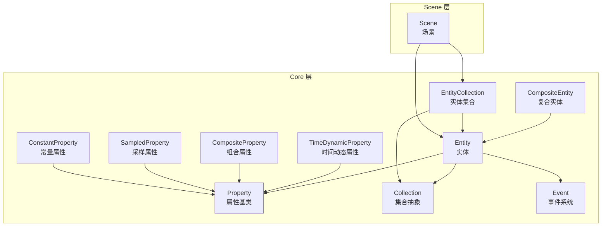
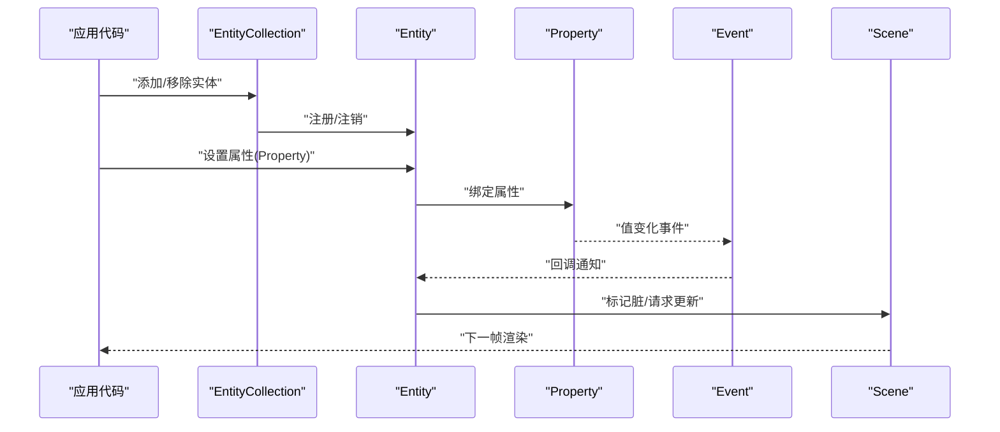
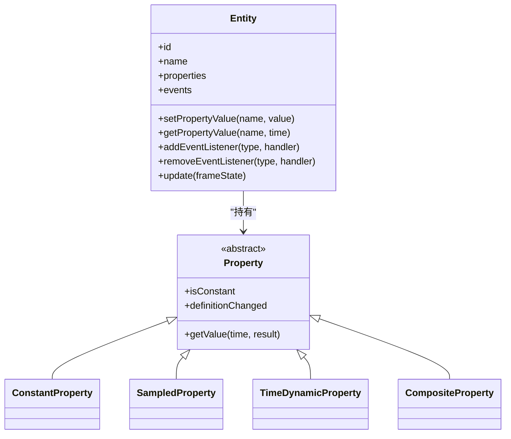
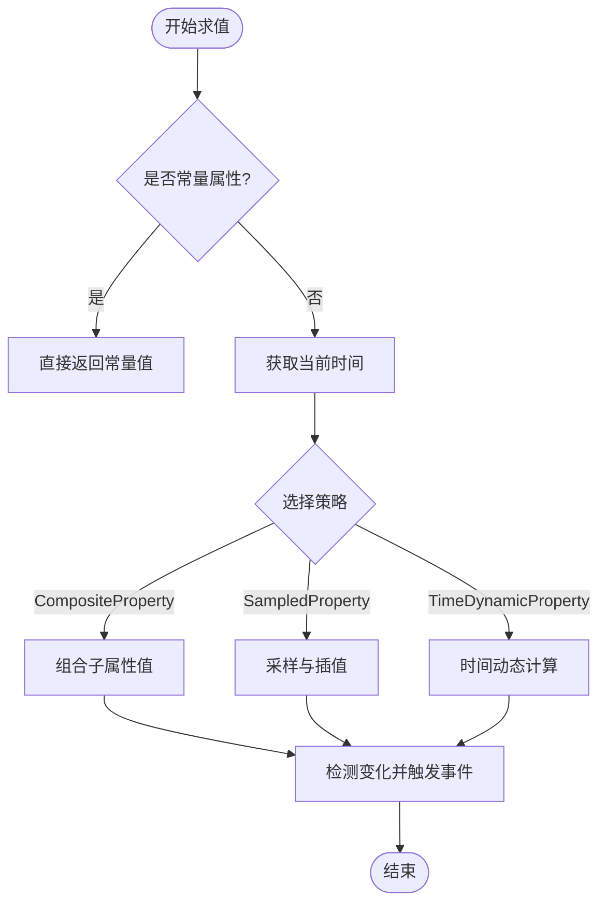
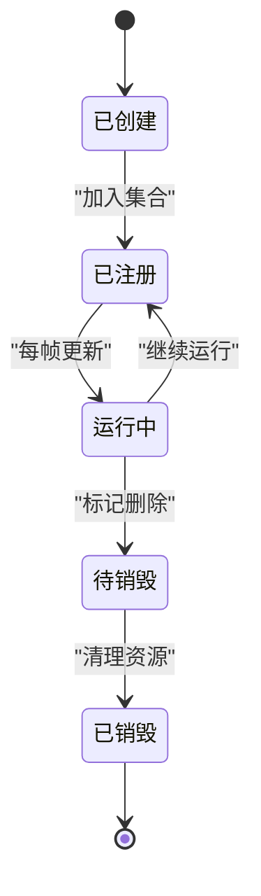
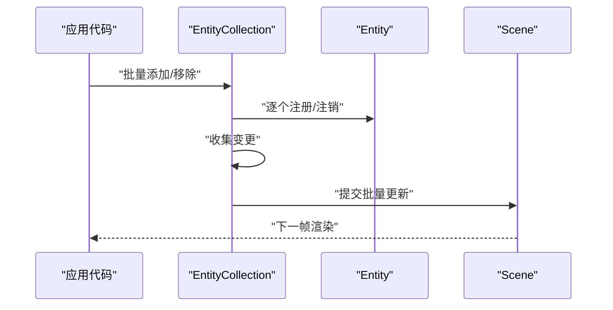
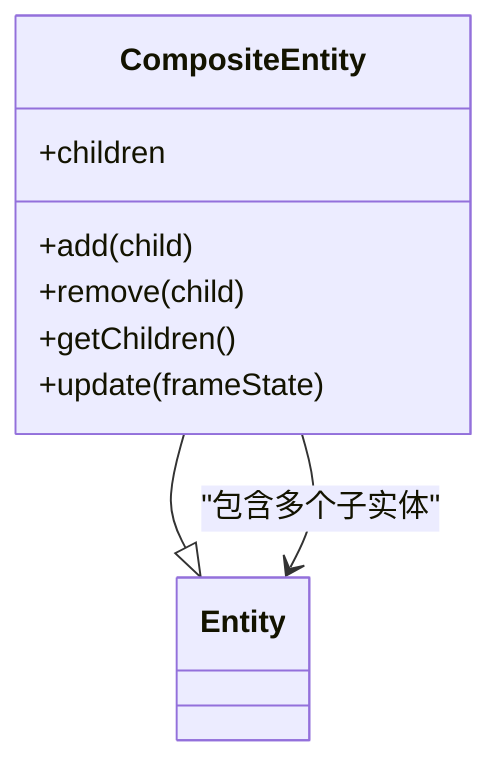
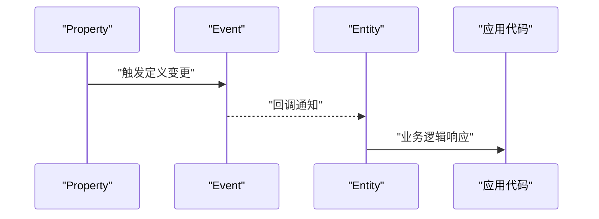
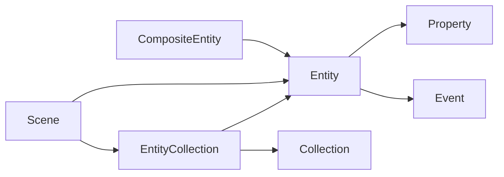

# 实体系统

<cite>
**本文引用的文件**   
- [Entity.js](file://Source/Core/Entity.js)
- [Property.js](file://Source/Core/Property.js)
- [CompositeEntity.js](file://Source/Core/CompositeEntity.js)
- [Collection.js](file://Source/Core/Collection.js)
- [Event.js](file://Source/Core/Event.js)
- [TimeDynamicProperty.js](file://Source/Core/TimeDynamicProperty.js)
- [ConstantProperty.js](file://Source/Core/ConstantProperty.js)
- [SampledProperty.js](file://Source/Core/SampledProperty.js)
- [CompositeProperty.js](file://Source/Core/CompositeProperty.js)
- [Scene.js](file://Source/Scene/Scene.js)
- [EntityCollection.js](file://Source/Core/EntityCollection.js)
</cite>

## 目录
1. [简介](#简介)
2. [项目结构](#项目结构)
3. [核心组件](#核心组件)
4. [架构总览](#架构总览)
5. [详细组件分析](#详细组件分析)
6. [依赖关系分析](#依赖关系分析)
7. [性能考量](#性能考量)
8. [故障排查指南](#故障排查指南)
9. [结论](#结论)
10. [附录](#附录)

## 简介
本技术文档聚焦于 Cesium 的实体（Entity）系统，系统性阐述 Entity 类的设计模式与属性系统架构、实体的生命周期管理、父子关系与集合操作、Property 系统的实现原理（动态属性、时间相关属性、表达式求值）、CompositeEntity 复合实体机制，以及实体与场景图的关系。文档同时提供最佳实践与常见问题排查建议，帮助读者在复杂场景中高效使用实体系统。

## 项目结构
Cesium 的实体系统主要位于 Source/Core 与 Source/Scene 目录下：
- Core 层负责实体模型、属性系统与集合抽象
- Scene 层将实体渲染到场景中，并维护场景图

图表来源
- [Entity.js:1-200](file://Source/Core/Entity.js#L1-L200)
- [Property.js:1-200](file://Source/Core/Property.js#L1-L200)
- [CompositeEntity.js:1-200](file://Source/Core/CompositeEntity.js#L1-L200)
- [Collection.js:1-200](file://Source/Core/Collection.js#L1-L200)
- [EntityCollection.js:1-200](file://Source/Core/EntityCollection.js#L1-L200)
- [Event.js:1-200](file://Source/Core/Event.js#L1-L200)
- [TimeDynamicProperty.js:1-200](file://Source/Core/TimeDynamicProperty.js#L1-L200)
- [CompositeProperty.js:1-200](file://Source/Core/CompositeProperty.js#L1-L200)
- [SampledProperty.js:1-200](file://Source/Core/SampledProperty.js#L1-L200)
- [ConstantProperty.js:1-200](file://Source/Core/ConstantProperty.js#L1-L200)
- [Scene.js:1-200](file://Source/Scene/Scene.js#L1-L200)

章节来源
- [Entity.js:1-200](file://Source/Core/Entity.js#L1-L200)
- [Property.js:1-200](file://Source/Core/Property.js#L1-L200)
- [CompositeEntity.js:1-200](file://Source/Core/CompositeEntity.js#L1-L200)
- [Collection.js:1-200](file://Source/Core/Collection.js#L1-L200)
- [EntityCollection.js:1-200](file://Source/Core/EntityCollection.js#L1-L200)
- [Event.js:1-200](file://Source/Core/Event.js#L1-L200)
- [TimeDynamicProperty.js:1-200](file://Source/Core/TimeDynamicProperty.js#L1-L200)
- [CompositeProperty.js:1-200](file://Source/Core/CompositeProperty.js#L1-L200)
- [SampledProperty.js:1-200](file://Source/Core/SampledProperty.js#L1-L200)
- [ConstantProperty.js:1-200](file://Source/Core/ConstantProperty.js#L1-L200)
- [Scene.js:1-200](file://Source/Scene/Scene.js#L1-L200)

## 核心组件
- Entity：场景中的可视化对象，封装位置、方向、几何体、材质等属性，支持事件与集合操作
- Property：属性的抽象基类，统一了静态与动态值的获取接口，支持时间相关求值
- CompositeEntity：复合实体，聚合多个子实体，形成层次化结构
- Collection/EntityCollection：通用集合与实体集合，提供增删改查、遍历与批量更新能力
- Event：轻量事件总线，用于订阅/发布实体状态变化或自定义事件
- TimeDynamicProperty/SampledProperty/CompositeProperty/ConstantProperty：不同策略的属性实现，分别对应时间动态、采样插值、组合与常量

章节来源
- [Entity.js:1-200](file://Source/Core/Entity.js#L1-L200)
- [Property.js:1-200](file://Source/Core/Property.js#L1-L200)
- [CompositeEntity.js:1-200](file://Source/Core/CompositeEntity.js#L1-L200)
- [Collection.js:1-200](file://Source/Core/Collection.js#L1-L200)
- [EntityCollection.js:1-200](file://Source/Core/EntityCollection.js#L1-L200)
- [Event.js:1-200](file://Source/Core/Event.js#L1-L200)
- [TimeDynamicProperty.js:1-200](file://Source/Core/TimeDynamicProperty.js#L1-L200)
- [CompositeProperty.js:1-200](file://Source/Core/CompositeProperty.js#L1-L200)
- [SampledProperty.js:1-200](file://Source/Core/SampledProperty.js#L1-L200)
- [ConstantProperty.js:1-200](file://Source/Core/ConstantProperty.js#L1-L200)

## 架构总览
实体系统采用“数据驱动 + 事件通知”的架构：
- 所有可观察的值通过 Property 暴露，Entity 持有若干 Property 实例
- 时间推进时，Property 根据当前时间计算最新值；当值发生变化时触发事件
- Entity 监听其内部属性的变更，更新自身状态并在需要时向 Scene 发出渲染请求
- CompositeEntity 作为容器，将子实体的可视结果合并，便于层级化管理
- EntityCollection 提供批量操作与遍历，配合 Scene 进行高效的场景图构建与更新

图表来源
- [EntityCollection.js:1-200](file://Source/Core/EntityCollection.js#L1-L200)
- [Entity.js:1-200](file://Source/Core/Entity.js#L1-L200)
- [Property.js:1-200](file://Source/Core/Property.js#L1-L200)
- [Event.js:1-200](file://Source/Core/Event.js#L1-L200)
- [Scene.js:1-200](file://Source/Scene/Scene.js#L1-L200)

## 详细组件分析

### Entity 类设计与属性系统
- 设计模式
  - 组合模式：Entity 由多个 Property 组成，每个属性独立实现求值逻辑
  - 观察者模式：Property 变更通过 Event 通知 Entity，Entity 再通知 Scene
  - 工厂/策略：不同 Property 类型（常量、采样、时间动态、组合）以策略方式注入
- 关键职责
  - 维护属性字典与默认值
  - 处理父子关系（若为 CompositeEntity）
  - 协调集合操作与事件分发
  - 与 Scene 交互，提交渲染所需的状态

图表来源
- [Entity.js:1-200](file://Source/Core/Entity.js#L1-L200)
- [Property.js:1-200](file://Source/Core/Property.js#L1-L200)
- [ConstantProperty.js:1-200](file://Source/Core/ConstantProperty.js#L1-L200)
- [SampledProperty.js:1-200](file://Source/Core/SampledProperty.js#L1-L200)
- [TimeDynamicProperty.js:1-200](file://Source/Core/TimeDynamicProperty.js#L1-L200)
- [CompositeProperty.js:1-200](file://Source/Core/CompositeProperty.js#L1-L200)

章节来源
- [Entity.js:1-200](file://Source/Core/Entity.js#L1-L200)
- [Property.js:1-200](file://Source/Core/Property.js#L1-L200)
- [ConstantProperty.js:1-200](file://Source/Core/ConstantProperty.js#L1-L200)
- [SampledProperty.js:1-200](file://Source/Core/SampledProperty.js#L1-L200)
- [TimeDynamicProperty.js:1-200](file://Source/Core/TimeDynamicProperty.js#L1-L200)
- [CompositeProperty.js:1-200](file://Source/Core/CompositeProperty.js#L1-L200)

### 属性系统实现原理
- 动态属性与时间相关属性
  - Property.getValue(time, result)：按时间求值，返回可变结果对象以减少分配
  - isConstant：标识是否常量属性，优化求值路径
  - definitionChanged：定义变更事件，用于通知上层重新求值
- 表达式求值
  - CompositeProperty 组合多个子属性，按规则合成最终值
  - SampledProperty 基于时间序列采样与插值，生成平滑过渡
  - TimeDynamicProperty 直接随时间变化，适合轨迹、动画等场景
- 性能要点
  - 复用结果对象，避免频繁 GC
  - 常量属性短路求值
  - 批量更新时减少事件风暴

图表来源
- [Property.js:1-200](file://Source/Core/Property.js#L1-L200)
- [CompositeProperty.js:1-200](file://Source/Core/CompositeProperty.js#L1-L200)
- [SampledProperty.js:1-200](file://Source/Core/SampledProperty.js#L1-L200)
- [TimeDynamicProperty.js:1-200](file://Source/Core/TimeDynamicProperty.js#L1-L200)

章节来源
- [Property.js:1-200](file://Source/Core/Property.js#L1-L200)
- [CompositeProperty.js:1-200](file://Source/Core/CompositeProperty.js#L1-L200)
- [SampledProperty.js:1-200](file://Source/Core/SampledProperty.js#L1-L200)
- [TimeDynamicProperty.js:1-200](file://Source/Core/TimeDynamicProperty.js#L1-L200)

### 生命周期管理与父子关系
- 生命周期
  - 创建：初始化属性与事件
  - 注册：加入 EntityCollection，进入场景图
  - 更新：每帧根据时间求值，必要时标记脏
  - 销毁：从集合移除，释放资源与事件订阅
- 父子关系
  - CompositeEntity 作为父节点，聚合子实体
  - 父级变换影响子级可视结果
  - 集合操作需保证父子一致性

图表来源
- [CompositeEntity.js:1-200](file://Source/Core/CompositeEntity.js#L1-L200)
- [EntityCollection.js:1-200](file://Source/Core/EntityCollection.js#L1-L200)
- [Entity.js:1-200](file://Source/Core/Entity.js#L1-L200)

章节来源
- [CompositeEntity.js:1-200](file://Source/Core/CompositeEntity.js#L1-L200)
- [EntityCollection.js:1-200](file://Source/Core/EntityCollection.js#L1-L200)
- [Entity.js:1-200](file://Source/Core/Entity.js#L1-L200)

### 集合操作与批量更新
- 集合抽象
  - Collection 提供通用的增删改查与迭代接口
  - EntityCollection 扩展实体特有行为（如可见性、排序、批量更新）
- 批量更新
  - 在集合级别触发一次性更新，减少中间状态抖动
  - 结合事件节流，降低渲染压力

图表来源
- [Collection.js:1-200](file://Source/Core/Collection.js#L1-L200)
- [EntityCollection.js:1-200](file://Source/Core/EntityCollection.js#L1-L200)
- [Scene.js:1-200](file://Source/Scene/Scene.js#L1-L200)

章节来源
- [Collection.js:1-200](file://Source/Core/Collection.js#L1-L200)
- [EntityCollection.js:1-200](file://Source/Core/EntityCollection.js#L1-L200)
- [Scene.js:1-200](file://Source/Scene/Scene.js#L1-L200)

### CompositeEntity 复合实体机制
- 作用
  - 将多个子实体组织成树形结构，统一控制显示/隐藏、变换与事件
  - 简化复杂场景的层级管理
- 关键点
  - 子实体继承父级上下文（如坐标系、可见性）
  - 复合实体本身不直接渲染，而是汇总子实体结果

图表来源
- [CompositeEntity.js:1-200](file://Source/Core/CompositeEntity.js#L1-L200)
- [Entity.js:1-200](file://Source/Core/Entity.js#L1-L200)

章节来源
- [CompositeEntity.js:1-200](file://Source/Core/CompositeEntity.js#L1-L200)
- [Entity.js:1-200](file://Source/Core/Entity.js#L1-L200)

### 事件处理与调试
- 事件系统
  - Event 提供订阅/发布机制，支持自定义事件类型
  - Property.definitionChanged 与 Entity 内部事件联动
- 调试建议
  - 监听关键事件（如属性变更、集合更新）
  - 记录事件频率与耗时，定位热点

图表来源
- [Event.js:1-200](file://Source/Core/Event.js#L1-L200)
- [Property.js:1-200](file://Source/Core/Property.js#L1-L200)
- [Entity.js:1-200](file://Source/Core/Entity.js#L1-L200)

章节来源
- [Event.js:1-200](file://Source/Core/Event.js#L1-L200)
- [Property.js:1-200](file://Source/Core/Property.js#L1-L200)
- [Entity.js:1-200](file://Source/Core/Entity.js#L1-L200)

## 依赖关系分析
- 耦合与内聚
  - Entity 与 Property 低耦合，通过统一接口交互
  - CompositeEntity 对子实体有强依赖，但保持单一职责
  - EntityCollection 与 Collection 解耦，便于扩展
- 外部集成点
  - Scene 作为渲染入口，接收实体状态并提交绘制任务
  - Event 作为跨模块通信通道，避免硬编码依赖

图表来源
- [Entity.js:1-200](file://Source/Core/Entity.js#L1-L200)
- [Property.js:1-200](file://Source/Core/Property.js#L1-L200)
- [CompositeEntity.js:1-200](file://Source/Core/CompositeEntity.js#L1-L200)
- [EntityCollection.js:1-200](file://Source/Core/EntityCollection.js#L1-L200)
- [Collection.js:1-200](file://Source/Core/Collection.js#L1-L200)
- [Event.js:1-200](file://Source/Core/Event.js#L1-L200)
- [Scene.js:1-200](file://Source/Scene/Scene.js#L1-L200)

章节来源
- [Entity.js:1-200](file://Source/Core/Entity.js#L1-L200)
- [Property.js:1-200](file://Source/Core/Property.js#L1-L200)
- [CompositeEntity.js:1-200](file://Source/Core/CompositeEntity.js#L1-L200)
- [EntityCollection.js:1-200](file://Source/Core/EntityCollection.js#L1-L200)
- [Collection.js:1-200](file://Source/Core/Collection.js#L1-L200)
- [Event.js:1-200](file://Source/Core/Event.js#L1-L200)
- [Scene.js:1-200](file://Source/Scene/Scene.js#L1-L200)

## 性能考量
- 属性层面
  - 优先使用常量属性以减少求值开销
  - 合理设置采样间隔，避免过密采样导致插值成本过高
  - 使用组合属性时注意子属性数量与复杂度
- 实体层面
  - 批量更新集合，减少逐条更新带来的抖动
  - 合理使用 CompositeEntity 组织层级，避免过深嵌套
- 事件层面
  - 对高频事件进行节流或合并处理
  - 仅在必要处订阅事件，避免全局监听造成泄漏
- 渲染层面
  - 与 Scene 协作，利用脏标记与按需更新
  - 控制可见性与裁剪，减少无效绘制

[本节为通用指导，无需特定文件引用]

## 故障排查指南
- 常见问题
  - 属性未更新：检查是否正确设置 Property 并监听 definitionChanged
  - 事件未触发：确认事件订阅未被意外移除或覆盖
  - 集合操作异常：确保在合适的时机进行批量更新
  - 复合实体无效果：验证子实体是否已正确注册且可见
- 诊断步骤
  - 打印属性求值时间与次数，识别热点
  - 使用最小复现案例隔离问题
  - 检查事件链路与回调参数

章节来源
- [Event.js:1-200](file://Source/Core/Event.js#L1-L200)
- [Property.js:1-200](file://Source/Core/Property.js#L1-L200)
- [EntityCollection.js:1-200](file://Source/Core/EntityCollection.js#L1-L200)
- [CompositeEntity.js:1-200](file://Source/Core/CompositeEntity.js#L1-L200)

## 结论
Cesium 的实体系统以 Property 为核心，通过组合与事件机制实现了灵活、可扩展的动态属性体系。Entity 与 CompositeEntity 提供了清晰的层级结构与生命周期管理，EntityCollection 则保障了批量操作的效率。结合 Scene 的渲染管线，实体系统能够在大规模场景中保持良好性能与易用性。遵循本文的最佳实践与排查建议，可在复杂应用中稳定高效地使用实体系统。

[本节为总结，无需特定文件引用]

## 附录
- 示例参考路径（不包含具体代码内容）
  - 实体创建与属性绑定：参见 [Entity.js](file://Source/Core/Entity.js) 与 [Property.js](file://Source/Core/Property.js)
  - 时间相关属性与采样：参见 [TimeDynamicProperty.js](file://Source/Core/TimeDynamicProperty.js)、[SampledProperty.js](file://Source/Core/SampledProperty.js)
  - 组合属性与常量属性：参见 [CompositeProperty.js](file://Source/Core/CompositeProperty.js)、[ConstantProperty.js](file://Source/Core/ConstantProperty.js)
  - 集合操作与批量更新：参见 [EntityCollection.js](file://Source/Core/EntityCollection.js)、[Collection.js](file://Source/Core/Collection.js)
  - 事件处理与调试：参见 [Event.js](file://Source/Core/Event.js)
  - 与场景集成：参见 [Scene.js](file://Source/Scene/Scene.js)

[本节为附录，无需特定文件引用]