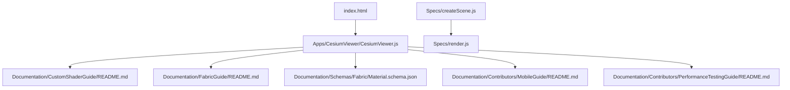
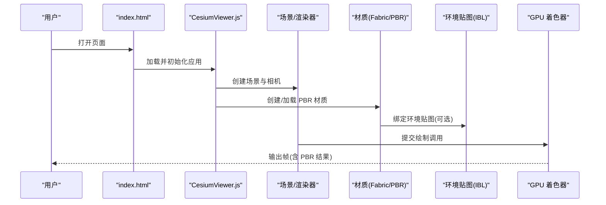
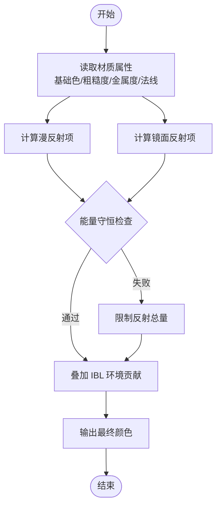
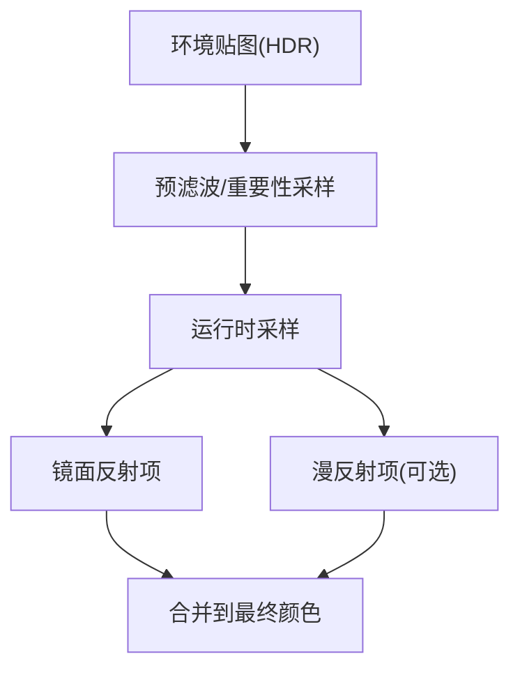
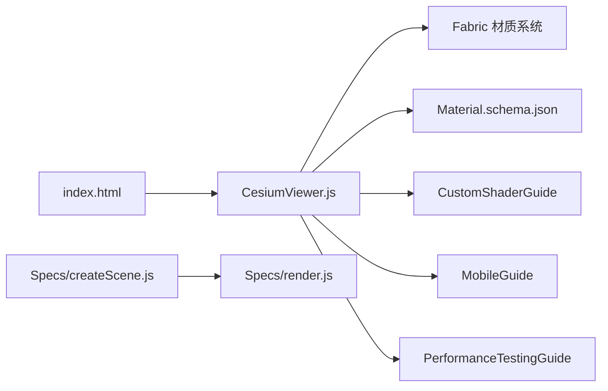

# PBR物理材质

<cite>
**本文引用的文件**   
- [README.md](file://README.md)
- [index.html](file://index.html)
- [CesiumViewer.js](file://Apps/CesiumViewer/CesiumViewer.js)
- [CustomShaderGuide/README.md](file://Documentation/CustomShaderGuide/README.md)
- [FabricGuide/README.md](file://Documentation/FabricGuide/README.md)
- [Material.schema.json](file://Documentation/Schemas/Fabric/Material.schema.json)
- [MobileGuide/README.md](file://Documentation/Contributors/MobileGuide/README.md)
- [PerformanceTestingGuide/README.md](file://Documentation/Contributors/PerformanceTestingGuide/README.md)
- [createScene.js](file://Specs/createScene.js)
- [render.js](file://Specs/render.js)
</cite>

## 目录
1. [简介](#简介)
2. [项目结构](#项目结构)
3. [核心组件](#核心组件)
4. [架构总览](#架构总览)
5. [详细组件分析](#详细组件分析)
6. [依赖关系分析](#依赖关系分析)
7. [性能考虑](#性能考虑)
8. [故障排查指南](#故障排查指南)
9. [结论](#结论)
10. [附录](#附录)

## 简介
本技术文档聚焦于在 Cesium 中实现与使用基于物理的渲染（PBR）材质，系统阐述 PBR 管线的工作原理、能量守恒原则、IBL（基于图像的照明）与环境贴图的作用，并提供金属、塑料、玻璃等典型材质的参数调优思路与示例路径。同时给出移动端适配与性能优化建议，帮助读者在真实项目中获得稳定且高保真的视觉效果。

## 项目结构
仓库采用多包与示例分离的组织方式：
- 应用示例位于 Apps 下，包含最小可运行的 CesiumViewer 示例与大量 glTF/3DTiles 测试数据。
- 文档位于 Documentation 下，涵盖自定义着色器、Fabric 材质系统与移动端/性能指南。
- 规格与测试位于 Specs 下，提供场景创建与渲染流程的参考实现。
- 根目录 index.html 为默认入口页面，便于快速启动本地服务并验证效果。

图表来源
- [index.html](file://index.html)
- [CesiumViewer.js](file://Apps/CesiumViewer/CesiumViewer.js)
- [CustomShaderGuide/README.md](file://Documentation/CustomShaderGuide/README.md)
- [FabricGuide/README.md](file://Documentation/FabricGuide/README.md)
- [Material.schema.json](file://Documentation/Schemas/Fabric/Material.schema.json)
- [MobileGuide/README.md](file://Documentation/Contributors/MobileGuide/README.md)
- [PerformanceTestingGuide/README.md](file://Documentation/Contributors/PerformanceTestingGuide/README.md)
- [createScene.js](file://Specs/createScene.js)
- [render.js](file://Specs/render.js)

章节来源
- [README.md](file://README.md)
- [index.html](file://index.html)
- [CesiumViewer.js](file://Apps/CesiumViewer/CesiumViewer.js)

## 核心组件
- PBR 材质属性与语义
  - 漫反射（基础色/反照率）：描述表面非镜面反射的光谱吸收特性，通常以线性空间颜色表示。
  - 镜面反射（Fresnel）：由入射角与折射率决定，金属与非金属的反射行为差异显著。
  - 粗糙度：控制微表面法线分布，影响高光扩散范围与强度。
  - 金属度：区分导体（金属）与绝缘体（非金属），影响菲涅尔反射基值与吸收模型。
  - 法线贴图：在不增加几何复杂度的前提下提升微观细节。
  - 环境贴图（IBL）：提供全局间接光照与反射信息，显著提升真实感。
- 能量守恒
  - 反射与透射/散射之和不超过入射能量；金属度越高，漫反射越低，镜面反射越强。
- IBL 与环境贴图
  - 通过预积分的辐射度图或立方体贴图进行环境采样，贡献间接反射与漫反射项。
- 材质定义与 Fabric
  - 使用 Fabric 材质系统与 Material.schema.json 定义的字段，结合 glTF PBR 工作流进行材质配置。
- 自定义着色器
  - 通过 Custom Shader Guide 扩展或替换标准 PBR 计算，满足特殊需求。

章节来源
- [CustomShaderGuide/README.md](file://Documentation/CustomShaderGuide/README.md)
- [FabricGuide/README.md](file://Documentation/FabricGuide/README.md)
- [Material.schema.json](file://Documentation/Schemas/Fabric/Material.schema.json)

## 架构总览
下图展示了从应用入口到渲染的关键路径，以及 PBR 材质与环境贴图在其中的作用位置。

图表来源
- [index.html](file://index.html)
- [CesiumViewer.js](file://Apps/CesiumViewer/CesiumViewer.js)
- [Material.schema.json](file://Documentation/Schemas/Fabric/Material.schema.json)

## 详细组件分析

### PBR 材质属性与能量守恒
- 漫反射项
  - 由基础色与粗糙度共同决定，遵循 Lamber 近似或更精确的 BRDF 模型。
- 镜面反射项
  - 使用 Fresnel-Schlick 近似，金属度控制基反射率，粗糙度控制分布宽度。
- 能量守恒约束
  - 金属度上升时，漫反射衰减，镜面反射增强，确保总反射不超入射能量。
- 粗糙度与法线
  - 粗糙度越大，高光越扩散；法线贴图改变局部法线方向，影响反射分布。
- IBL 贡献
  - 环境贴图提供间接反射与漫反射项，使材质在不同光照环境下保持一致性。

图表来源
- [Material.schema.json](file://Documentation/Schemas/Fabric/Material.schema.json)
- [CustomShaderGuide/README.md](file://Documentation/CustomShaderGuide/README.md)

章节来源
- [Material.schema.json](file://Documentation/Schemas/Fabric/Material.schema.json)
- [CustomShaderGuide/README.md](file://Documentation/CustomShaderGuide/README.md)

### IBL 与环境贴图
- 环境贴图类型
  - 立方体贴图或球谐函数表示的辐射度图，用于间接光照与反射。
- 预过滤与重要性采样
  - 对高频环境数据进行预滤波，降低运行时采样成本。
- 与材质交互
  - 金属表面主要受反射项影响；非金属表面受漫反射与环境光影响较小但仍有贡献。
- 资源准备
  - 建议使用高质量 HDR 环境贴图，并进行适当的色调映射与白平衡。

图表来源
- [Material.schema.json](file://Documentation/Schemas/Fabric/Material.schema.json)
- [CustomShaderGuide/README.md](file://Documentation/CustomShaderGuide/README.md)

章节来源
- [Material.schema.json](file://Documentation/Schemas/Fabric/Material.schema.json)
- [CustomShaderGuide/README.md](file://Documentation/CustomShaderGuide/README.md)

### 材质创建与参数调优示例
以下为常见材质的参数调优思路与示例路径指引（不直接展示代码内容）：
- 金属材质
  - 基础色：低亮度、带有色偏（如铜、金、银）。
  - 粗糙度：较低以获得清晰高光；中等至较高用于做旧效果。
  - 金属度：接近 1。
  - 示例路径：[CesiumViewer.js](file://Apps/CesiumViewer/CesiumViewer.js)
- 塑料材质
  - 基础色：任意颜色，注意线性空间。
  - 粗糙度：中高范围，模拟磨砂或光滑塑料。
  - 金属度：接近 0。
  - 示例路径：[CesiumViewer.js](file://Apps/CesiumViewer/CesiumViewer.js)
- 玻璃材质
  - 基础色：极低吸收（接近透明）。
  - 粗糙度：极低以获得锐利反射。
  - 金属度：接近 0。
  - 透射/半透明：根据需求启用相关材质通道（参考 Fabric 材质系统）。
  - 示例路径：[CesiumViewer.js](file://Apps/CesiumViewer/CesiumViewer.js)

章节来源
- [CesiumViewer.js](file://Apps/CesiumViewer/CesiumViewer.js)
- [FabricGuide/README.md](file://Documentation/FabricGuide/README.md)
- [Material.schema.json](file://Documentation/Schemas/Fabric/Material.schema.json)

### 自定义着色器与 PBR 扩展
- 何时使用
  - 需要替代标准 BRDF、加入各向异性、清漆层或次表面散射等高级特性。
- 如何集成
  - 依据 Custom Shader Guide 提供的接口，注入顶点/片段着色器逻辑，并与 Fabric 材质字段对接。
- 注意事项
  - 保持能量守恒与线性色彩空间；避免过度分支与高精度运算。

章节来源
- [CustomShaderGuide/README.md](file://Documentation/CustomShaderGuide/README.md)
- [FabricGuide/README.md](file://Documentation/FabricGuide/README.md)

## 依赖关系分析
- 应用入口与示例
  - index.html 作为页面入口，加载 CesiumViewer.js 完成场景初始化与材质演示。
- 材质系统与规范
  - Fabric 材质系统与 Material.schema.json 定义了材质字段与校验规则。
- 测试与基准
  - Specs 下的 createScene.js 与 render.js 提供了场景构建与渲染流程的参考实现，可用于验证 PBR 效果与性能。

图表来源
- [index.html](file://index.html)
- [CesiumViewer.js](file://Apps/CesiumViewer/CesiumViewer.js)
- [Material.schema.json](file://Documentation/Schemas/Fabric/Material.schema.json)
- [CustomShaderGuide/README.md](file://Documentation/CustomShaderGuide/README.md)
- [MobileGuide/README.md](file://Documentation/Contributors/MobileGuide/README.md)
- [PerformanceTestingGuide/README.md](file://Documentation/Contributors/PerformanceTestingGuide/README.md)
- [createScene.js](file://Specs/createScene.js)
- [render.js](file://Specs/render.js)

章节来源
- [index.html](file://index.html)
- [CesiumViewer.js](file://Apps/CesiumViewer/CesiumViewer.js)
- [Material.schema.json](file://Documentation/Schemas/Fabric/Material.schema.json)
- [createScene.js](file://Specs/createScene.js)
- [render.js](file://Specs/render.js)

## 性能考虑
- 纹理与 IBL
  - 使用合适分辨率的环境贴图与纹理，避免过大的 HDR 贴图导致带宽与内存压力。
  - 预滤波与压缩格式（如 KTX2）可降低传输与解码开销。
- 材质复杂度
  - 减少不必要的材质切换与状态变更；尽量复用材质实例。
- 移动端适配
  - 降低纹理尺寸与精度；关闭或降级高级特效（如清漆层、各向异性）。
  - 关注功耗与热节流，合理设置帧率与视锥剔除策略。
- 基准与监控
  - 利用 PerformanceTestingGuide 的方法进行性能回归与对比。

章节来源
- [MobileGuide/README.md](file://Documentation/Contributors/MobileGuide/README.md)
- [PerformanceTestingGuide/README.md](file://Documentation/Contributors/PerformanceTestingGuide/README.md)

## 故障排查指南
- 材质不生效或显示异常
  - 检查材质字段是否符合 Material.schema.json 的定义；确认基础色是否在正确的色彩空间。
  - 若使用自定义着色器，核对输入变量与常量是否匹配。
- 反射过亮或过暗
  - 调整粗糙度与金属度组合；检查环境贴图强度与色调映射设置。
- 移动端卡顿
  - 降低纹理分辨率与数量；减少材质种类与切换频率；评估 IBL 预滤波质量。
- 调试手段
  - 使用 Specs 中的 createScene.js 与 render.js 搭建最小复现场景，逐步定位问题。

章节来源
- [Material.schema.json](file://Documentation/Schemas/Fabric/Material.schema.json)
- [CustomShaderGuide/README.md](file://Documentation/CustomShaderGuide/README.md)
- [createScene.js](file://Specs/createScene.js)
- [render.js](file://Specs/render.js)

## 结论
在 Cesium 中使用 PBR 材质，关键在于正确理解与配置基础色、粗糙度、金属度与法线贴图，并结合高质量的 IBL 环境贴图实现真实感。遵循能量守恒原则与线性色彩空间，配合 Fabric 材质系统与自定义着色器扩展，可在不同平台上获得一致且高效的渲染效果。通过合理的性能优化与移动端适配策略，能够在保证视觉质量的同时维持流畅体验。

## 附录
- 快速上手
  - 运行 index.html 并在 CesiumViewer.js 中修改材质参数，观察实时变化。
- 进一步阅读
  - 参考 CustomShaderGuide 与 FabricGuide 了解材质系统与着色器扩展方法。
  - 查阅 MobileGuide 与 PerformanceTestingGuide 获取平台与性能最佳实践。