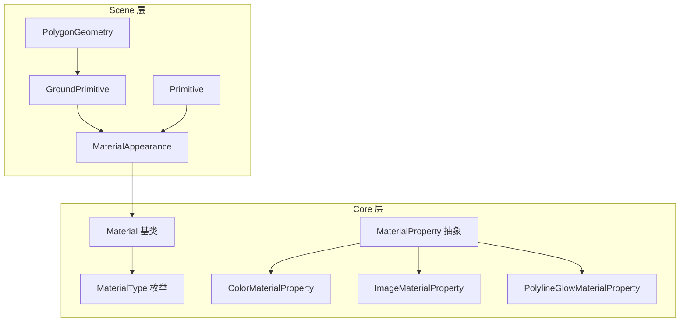
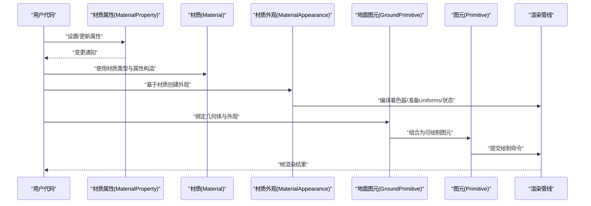
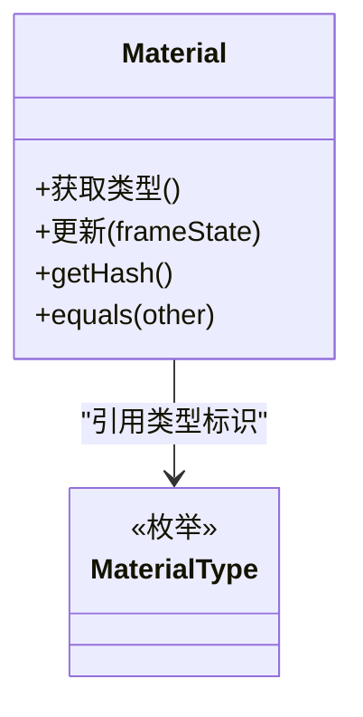
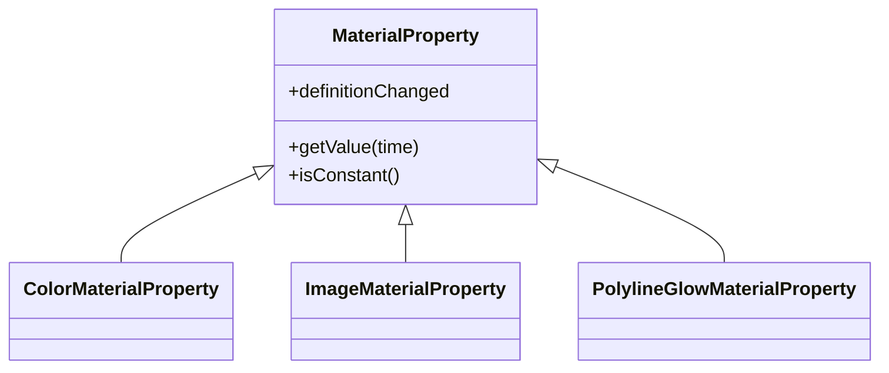
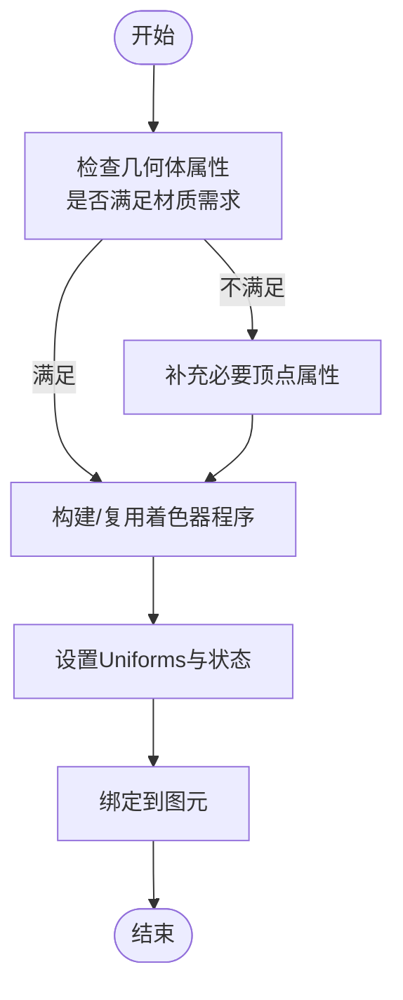
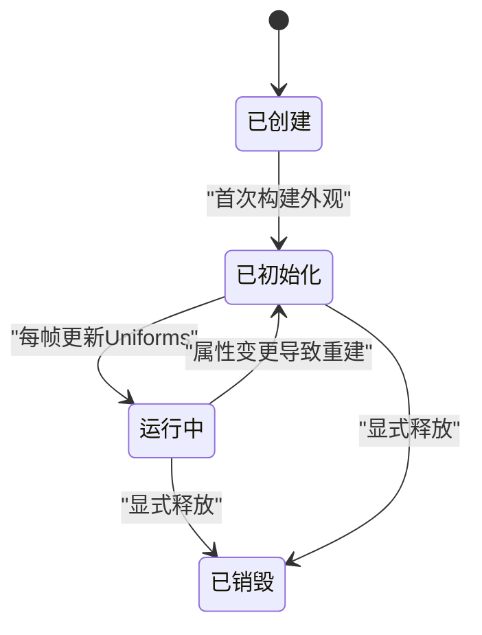
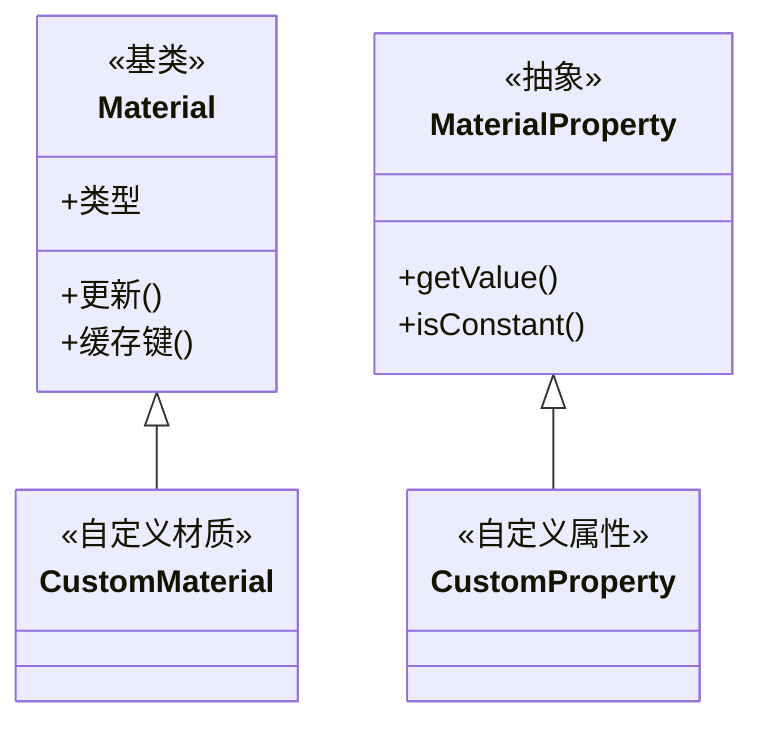
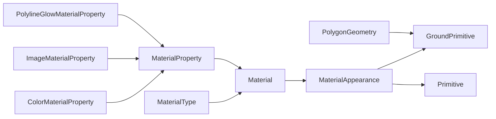

# 材质基础

<cite>
**本文引用的文件**   
- [Material.js](file://Source/Core/Material.js)
- [MaterialAppearance.js](file://Source/Scene/MaterialAppearance.js)
- [MaterialType.js](file://Source/Core/MaterialType.js)
- [MaterialProperty.js](file://Source/Core/MaterialProperty.js)
- [ColorMaterialProperty.js](file://Source/Core/ColorMaterialProperty.js)
- [ImageMaterialProperty.js](file://Source/Core/ImageMaterialProperty.js)
- [PolylineGlowMaterialProperty.js](file://Source/Core/PolylineGlowMaterialProperty.js)
- [PolygonGeometry.js](file://Source/Scene/GroundPrimitive/PolygonGeometry.js)
- [GroundPrimitive.js](file://Source/Scene/GroundPrimitive.js)
- [Primitive.js](file://Source/Scene/Primitive.js)
</cite>

## 目录
1. [简介](#简介)
2. [项目结构](#项目结构)
3. [核心组件](#核心组件)
4. [架构总览](#架构总览)
5. [详细组件分析](#详细组件分析)
6. [依赖关系分析](#依赖关系分析)
7. [性能考虑](#性能考虑)
8. [故障排查指南](#故障排查指南)
9. [结论](#结论)
10. [附录](#附录)

## 简介
本章节面向初学者，系统梳理 Cesium 材质系统的基础概念与工作方式。重点包括：
- Material 基类的设计目标、职责边界与扩展点
- 材质类型系统与属性定义机制
- 材质生命周期管理与渲染状态同步
- MaterialAppearance 的作用及其与几何体的绑定关系
- 常见材质的创建模式与常用属性配置方法
- 材质继承体系与扩展机制

## 项目结构
Cesium 的“材质”相关代码主要分布在 Source/Core 与 Source/Scene 两个层次：
- Core 层负责材质抽象、材质属性（MaterialProperty）与具体材质类型（如纯色、图像等）
- Scene 层负责将材质与渲染管线衔接，提供 MaterialAppearance 作为“材质到渲染状态”的桥梁，并与 Primitive/GroundPrimitive 等场景对象协作完成绘制

图表来源
- [Material.js:1-200](file://Source/Core/Material.js#L1-L200)
- [MaterialType.js:1-120](file://Source/Core/MaterialType.js#L1-L120)
- [MaterialProperty.js:1-150](file://Source/Core/MaterialProperty.js#L1-L150)
- [ColorMaterialProperty.js:1-120](file://Source/Core/ColorMaterialProperty.js#L1-L120)
- [ImageMaterialProperty.js:1-150](file://Source/Core/ImageMaterialProperty.js#L1-L150)
- [PolylineGlowMaterialProperty.js:1-150](file://Source/Core/PolylineGlowMaterialProperty.js#L1-L150)
- [MaterialAppearance.js:1-200](file://Source/Scene/MaterialAppearance.js#L1-L200)
- [PolygonGeometry.js:1-120](file://Source/Scene/GroundPrimitive/PolygonGeometry.js#L1-L120)
- [GroundPrimitive.js:1-200](file://Source/Scene/GroundPrimitive.js#L1-L200)
- [Primitive.js:1-200](file://Source/Scene/Primitive.js#L1-L200)

章节来源
- [Material.js:1-200](file://Source/Core/Material.js#L1-L200)
- [MaterialAppearance.js:1-200](file://Source/Scene/MaterialAppearance.js#L1-L200)
- [MaterialType.js:1-120](file://Source/Core/MaterialType.js#L1-L120)
- [MaterialProperty.js:1-150](file://Source/Core/MaterialProperty.js#L1-L150)
- [ColorMaterialProperty.js:1-120](file://Source/Core/ColorMaterialProperty.js#L1-L120)
- [ImageMaterialProperty.js:1-150](file://Source/Core/ImageMaterialProperty.js#L1-L150)
- [PolylineGlowMaterialProperty.js:1-150](file://Source/Core/PolylineGlowMaterialProperty.js#L1-L150)
- [PolygonGeometry.js:1-120](file://Source/Scene/GroundPrimitive/PolygonGeometry.js#L1-L120)
- [GroundPrimitive.js:1-200](file://Source/Scene/GroundPrimitive.js#L1-L200)
- [Primitive.js:1-200](file://Source/Scene/Primitive.js#L1-L200)

## 核心组件
本节从职责与交互角度，概述材质系统的核心构件：
- Material 基类：定义材质通用接口、类型标识、更新策略与缓存键生成规则，是材质类型的统一抽象
- MaterialType：集中管理材质类型常量，用于区分不同着色器与渲染路径
- MaterialProperty：材质属性的抽象，支持时间变化、表达式求值与变更通知
- 具体材质属性：如 ColorMaterialProperty、ImageMaterialProperty、PolylineGlowMaterialProperty 等，封装特定视觉效果的参数
- MaterialAppearance：将材质转换为渲染所需的 ShaderProgram、Uniforms、State 等，并维护与几何体绑定的状态
- 几何体与图元：PolygonGeometry 描述多边形几何；GroundPrimitive/Primitive 负责将几何体与外观（含材质）组合并提交渲染

章节来源
- [Material.js:1-200](file://Source/Core/Material.js#L1-L200)
- [MaterialType.js:1-120](file://Source/Core/MaterialType.js#L1-L120)
- [MaterialProperty.js:1-150](file://Source/Core/MaterialProperty.js#L1-L150)
- [ColorMaterialProperty.js:1-120](file://Source/Core/ColorMaterialProperty.js#L1-L120)
- [ImageMaterialProperty.js:1-150](file://Source/Core/ImageMaterialProperty.js#L1-L150)
- [PolylineGlowMaterialProperty.js:1-150](file://Source/Core/PolylineGlowMaterialProperty.js#L1-L150)
- [MaterialAppearance.js:1-200](file://Source/Scene/MaterialAppearance.js#L1-L200)
- [PolygonGeometry.js:1-120](file://Source/Scene/GroundPrimitive/PolygonGeometry.js#L1-L120)
- [GroundPrimitive.js:1-200](file://Source/Scene/GroundPrimitive.js#L1-L200)
- [Primitive.js:1-200](file://Source/Scene/Primitive.js#L1-L200)

## 架构总览
下图展示了从“材质属性”到“渲染状态”的关键流程：用户通过材质属性表达视觉效果，MaterialAppearance 将其编译为可执行的着色程序与 Uniforms，最终由 Primitive/GroundPrimitive 提交给 GPU。

图表来源
- [Material.js:1-200](file://Source/Core/Material.js#L1-L200)
- [MaterialAppearance.js:1-200](file://Source/Scene/MaterialAppearance.js#L1-L200)
- [GroundPrimitive.js:1-200](file://Source/Scene/GroundPrimitive.js#L1-L200)
- [Primitive.js:1-200](file://Source/Scene/Primitive.js#L1-L200)

## 详细组件分析

### Material 基类与材质类型系统
- 设计要点
  - 统一的材质类型标识与版本控制，确保相同逻辑的着色器可复用
  - 定义材质更新钩子与缓存键生成策略，减少重复编译与状态切换
  - 暴露材质属性访问接口，供上层 MaterialProperty 驱动
- 材质类型系统
  - 通过 MaterialType 枚举集中声明材质类别，便于在外观层快速分支选择对应着色器
  - 新增材质时，需注册类型并实现对应的更新与缓存键逻辑

图表来源
- [Material.js:1-200](file://Source/Core/Material.js#L1-L200)
- [MaterialType.js:1-120](file://Source/Core/MaterialType.js#L1-L120)

章节来源
- [Material.js:1-200](file://Source/Core/Material.js#L1-L200)
- [MaterialType.js:1-120](file://Source/Core/MaterialType.js#L1-L120)

### 材质属性（MaterialProperty）与具体实现
- 抽象层
  - MaterialProperty 定义属性求值接口、时间变化支持与变更通知机制
  - 支持在每帧或按需重新计算，避免不必要的开销
- 具体属性示例
  - ColorMaterialProperty：颜色材质属性，常用于纯色填充
  - ImageMaterialProperty：图像材质属性，支持贴图与变换
  - PolylineGlowMaterialProperty：发光线材质属性，用于高亮路径

图表来源
- [MaterialProperty.js:1-150](file://Source/Core/MaterialProperty.js#L1-L150)
- [ColorMaterialProperty.js:1-120](file://Source/Core/ColorMaterialProperty.js#L1-L120)
- [ImageMaterialProperty.js:1-150](file://Source/Core/ImageMaterialProperty.js#L1-L150)
- [PolylineGlowMaterialProperty.js:1-150](file://Source/Core/PolylineGlowMaterialProperty.js#L1-L150)

章节来源
- [MaterialProperty.js:1-150](file://Source/Core/MaterialProperty.js#L1-L150)
- [ColorMaterialProperty.js:1-120](file://Source/Core/ColorMaterialProperty.js#L1-L120)
- [ImageMaterialProperty.js:1-150](file://Source/Core/ImageMaterialProperty.js#L1-L150)
- [PolylineGlowMaterialProperty.js:1-150](file://Source/Core/PolylineGlowMaterialProperty.js#L1-L150)

### MaterialAppearance：材质到渲染状态的桥梁
- 作用
  - 根据材质类型与属性，生成或复用 ShaderProgram
  - 将材质属性映射为 Uniforms，并在必要时处理 State（如混合、深度测试）
  - 维护与几何体的绑定关系，确保顶点属性与着色器输入一致
- 与几何体的绑定
  - GroundPrimitive/Primitive 持有 Geometry 与 MaterialAppearance
  - 在绘制前，MaterialAppearance 会校验几何体是否满足当前材质所需的最小属性集（如位置、法线、纹理坐标等）

图表来源
- [MaterialAppearance.js:1-200](file://Source/Scene/MaterialAppearance.js#L1-L200)
- [PolygonGeometry.js:1-120](file://Source/Scene/GroundPrimitive/PolygonGeometry.js#L1-L120)
- [GroundPrimitive.js:1-200](file://Source/Scene/GroundPrimitive.js#L1-L200)
- [Primitive.js:1-200](file://Source/Scene/Primitive.js#L1-L200)

章节来源
- [MaterialAppearance.js:1-200](file://Source/Scene/MaterialAppearance.js#L1-L200)
- [PolygonGeometry.js:1-120](file://Source/Scene/GroundPrimitive/PolygonGeometry.js#L1-L120)
- [GroundPrimitive.js:1-200](file://Source/Scene/GroundPrimitive.js#L1-L200)
- [Primitive.js:1-200](file://Source/Scene/Primitive.js#L1-L200)

### 材质生命周期管理与渲染状态同步
- 生命周期阶段
  - 创建：实例化材质与材质属性，确定材质类型
  - 初始化：MaterialAppearance 首次编译着色器、分配 Uniforms
  - 更新：属性变化触发重算，必要时重建缓存键或更新 Uniforms
  - 销毁：释放着色器与资源，解除与图元的绑定
- 渲染状态同步
  - 通过变更通知与缓存键机制，避免重复编译
  - 在每帧绘制前，MaterialAppearance 确保 Uniforms 与当前帧状态一致

图表来源
- [Material.js:1-200](file://Source/Core/Material.js#L1-L200)
- [MaterialAppearance.js:1-200](file://Source/Scene/MaterialAppearance.js#L1-L200)

章节来源
- [Material.js:1-200](file://Source/Core/Material.js#L1-L200)
- [MaterialAppearance.js:1-200](file://Source/Scene/MaterialAppearance.js#L1-L200)

### 材质创建的基本模式与常用属性配置
- 基本模式
  - 使用具体材质属性（如颜色、图像）驱动材质类型
  - 将材质与外观结合，再绑定到图元进行绘制
- 常用属性
  - 颜色：用于纯色填充或叠加透明度
  - 图像：用于贴图的加载、平铺与变换
  - 发光：用于线条的高亮效果
- 实践建议
  - 尽量复用材质与外观实例，减少频繁创建带来的开销
  - 对动态属性使用合适的更新频率，避免每帧都触发昂贵操作

章节来源
- [ColorMaterialProperty.js:1-120](file://Source/Core/ColorMaterialProperty.js#L1-L120)
- [ImageMaterialProperty.js:1-150](file://Source/Core/ImageMaterialProperty.js#L1-L150)
- [PolylineGlowMaterialProperty.js:1-150](file://Source/Core/PolylineGlowMaterialProperty.js#L1-L150)
- [MaterialAppearance.js:1-200](file://Source/Scene/MaterialAppearance.js#L1-L200)

### 材质继承体系与扩展机制
- 继承体系
  - Material 基类提供统一接口，具体材质类型通过类型标识与更新策略差异化
  - MaterialProperty 抽象层允许自定义属性类型，支持时间变化与表达式求值
- 扩展机制
  - 新增材质类型：注册新类型、实现更新与缓存键逻辑，并在 MaterialAppearance 中适配
  - 自定义属性：实现 MaterialProperty 接口，提供 getValue 与 isConstant 等方法
  - 与几何体绑定：确保材质所需的顶点属性在几何体中存在或由外观层补充

图表来源
- [Material.js:1-200](file://Source/Core/Material.js#L1-L200)
- [MaterialProperty.js:1-150](file://Source/Core/MaterialProperty.js#L1-L150)

章节来源
- [Material.js:1-200](file://Source/Core/Material.js#L1-L200)
- [MaterialProperty.js:1-150](file://Source/Core/MaterialProperty.js#L1-L150)

## 依赖关系分析
- 耦合与内聚
  - Material 与 MaterialType 低耦合，通过类型标识解耦具体实现
  - MaterialAppearance 与材质类型存在一定耦合，但通过统一接口降低复杂度
  - 材质属性与材质之间通过 MaterialProperty 抽象解耦，提升可替换性
- 外部依赖与集成点
  - 与几何体（PolygonGeometry）和图元（GroundPrimitive/Primitive）的集成点在于顶点属性与外观绑定
  - 与渲染管线的集成点在 MaterialAppearance 的着色器与 Uniforms 设置

图表来源
- [Material.js:1-200](file://Source/Core/Material.js#L1-L200)
- [MaterialType.js:1-120](file://Source/Core/MaterialType.js#L1-L120)
- [MaterialProperty.js:1-150](file://Source/Core/MaterialProperty.js#L1-L150)
- [ColorMaterialProperty.js:1-120](file://Source/Core/ColorMaterialProperty.js#L1-L120)
- [ImageMaterialProperty.js:1-150](file://Source/Core/ImageMaterialProperty.js#L1-L150)
- [PolylineGlowMaterialProperty.js:1-150](file://Source/Core/PolylineGlowMaterialProperty.js#L1-L150)
- [MaterialAppearance.js:1-200](file://Source/Scene/MaterialAppearance.js#L1-L200)
- [PolygonGeometry.js:1-120](file://Source/Scene/GroundPrimitive/PolygonGeometry.js#L1-L120)
- [GroundPrimitive.js:1-200](file://Source/Scene/GroundPrimitive.js#L1-L200)
- [Primitive.js:1-200](file://Source/Scene/Primitive.js#L1-L200)

章节来源
- [Material.js:1-200](file://Source/Core/Material.js#L1-L200)
- [MaterialAppearance.js:1-200](file://Source/Scene/MaterialAppearance.js#L1-L200)
- [MaterialType.js:1-120](file://Source/Core/MaterialType.js#L1-L120)
- [MaterialProperty.js:1-150](file://Source/Core/MaterialProperty.js#L1-L150)
- [ColorMaterialProperty.js:1-120](file://Source/Core/ColorMaterialProperty.js#L1-L120)
- [ImageMaterialProperty.js:1-150](file://Source/Core/ImageMaterialProperty.js#L1-L150)
- [PolylineGlowMaterialProperty.js:1-150](file://Source/Core/PolylineGlowMaterialProperty.js#L1-L150)
- [PolygonGeometry.js:1-120](file://Source/Scene/GroundPrimitive/PolygonGeometry.js#L1-L120)
- [GroundPrimitive.js:1-200](file://Source/Scene/GroundPrimitive.js#L1-L200)
- [Primitive.js:1-200](file://Source/Scene/Primitive.js#L1-L200)

## 性能考虑
- 材质与外观复用：避免频繁创建与销毁，减少着色器编译与状态切换
- 属性更新频率：对高频变化的属性采用合理的更新策略，避免每帧都触发昂贵计算
- 几何体属性完备：确保几何体包含材质所需的最小属性集，减少运行时补全开销
- 缓存键优化：合理设计材质缓存键，提高命中率和复用率

[本节为通用指导，无需源码引用]

## 故障排查指南
- 常见问题
  - 材质未生效：检查材质类型与外观是否匹配，确认 Uniforms 是否正确设置
  - 几何体属性缺失：确认几何体包含必要的顶点属性（如位置、法线、纹理坐标）
  - 性能抖动：排查是否存在频繁的材质/外观重建或属性重算
- 定位步骤
  - 查看材质类型与 MaterialType 是否一致
  - 检查 MaterialAppearance 的构建日志与缓存键变化
  - 验证材质属性变更通知是否按预期触发

章节来源
- [Material.js:1-200](file://Source/Core/Material.js#L1-L200)
- [MaterialAppearance.js:1-200](file://Source/Scene/MaterialAppearance.js#L1-L200)
- [PolygonGeometry.js:1-120](file://Source/Scene/GroundPrimitive/PolygonGeometry.js#L1-L120)

## 结论
Cesium 的材质系统以 Material 基类为核心，配合 MaterialType 与 MaterialProperty 抽象，形成可扩展的类型与属性体系。MaterialAppearance 承担“材质到渲染状态”的转换职责，并与几何体和图元紧密协作。理解其生命周期、属性机制与状态同步，有助于高效地创建与扩展材质，获得稳定且高性能的渲染效果。

[本节为总结，无需源码引用]

## 附录
- 术语表
  - 材质（Material）：描述表面视觉效果的抽象
  - 材质类型（MaterialType）：用于区分不同着色器与渲染路径的标识
  - 材质属性（MaterialProperty）：驱动材质参数的可求值对象
  - 材质外观（MaterialAppearance）：将材质转换为渲染所需的状态与程序
  - 图元（Primitive/GroundPrimitive）：承载几何体与外观的可绘制实体

[本节为概念说明，无需源码引用]