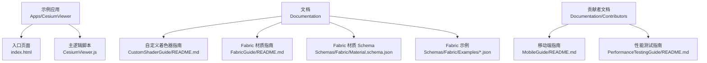
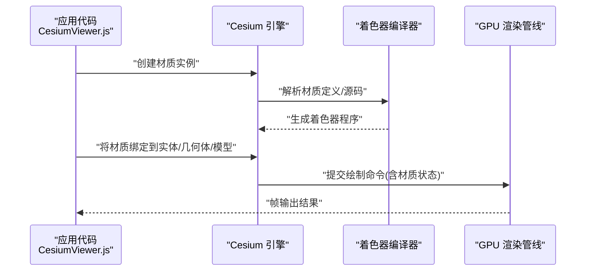
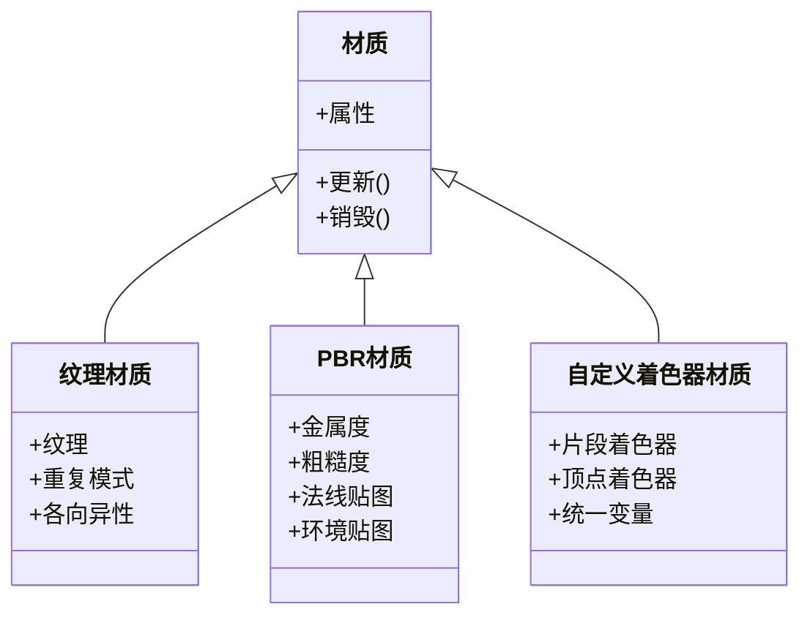
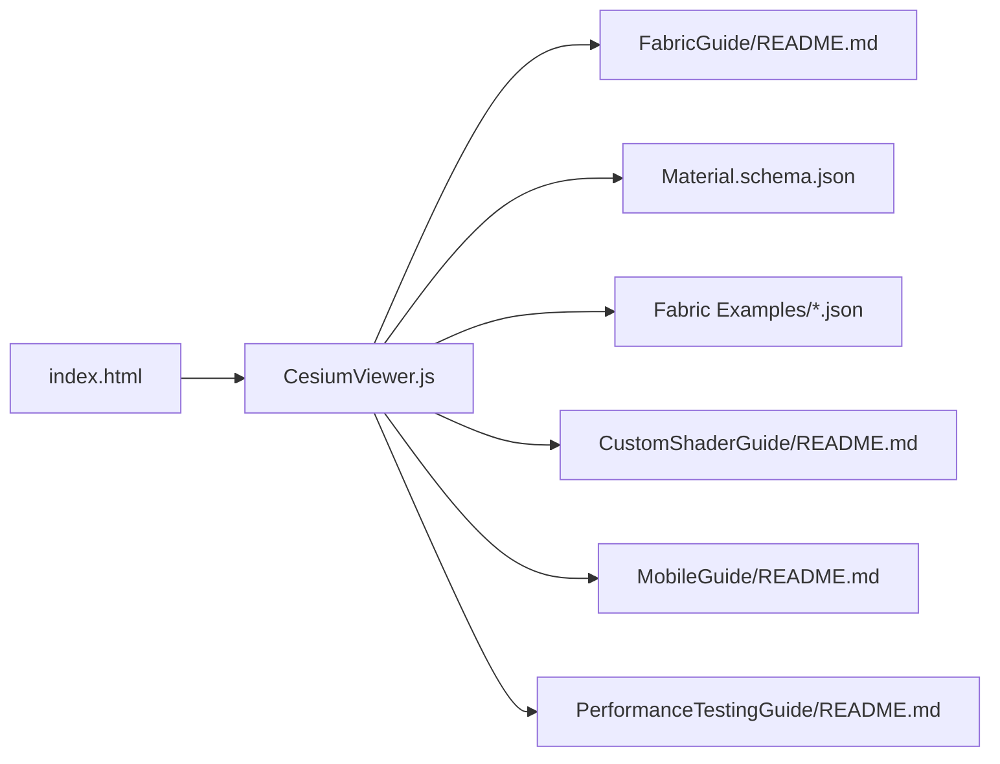

# 材质示例与最佳实践

<cite>
**本文引用的文件**   
- [README.md](file://README.md)
- [CesiumViewer.js](file://Apps/CesiumViewer/CesiumViewer.js)
- [index.html](file://Apps/CesiumViewer/index.html)
- [CustomShaderGuide/README.md](file://Documentation/CustomShaderGuide/README.md)
- [FabricGuide/README.md](file://Documentation/FabricGuide/README.md)
- [Material.schema.json](file://Documentation/Schemas/Fabric/Material.schema.json)
- [Components.json](file://Documentation/Schemas/Fabric/Examples/Components.json)
- [TextureUniforms.json](file://Documentation/Schemas/Fabric/Examples/TextureUniforms.json)
- [VectorUniforms.json](file://Documentation/Schemas/Fabric/Examples/VectorUniforms.json)
- [MatrixUniforms.json](file://Documentation/Schemas/Fabric/Examples/MatrixUniforms.json)
- [Source.json](file://Documentation/Schemas/Fabric/Examples/Source.json)
- [MobileGuide/README.md](file://Documentation/Contributors/MobileGuide/README.md)
- [PerformanceTestingGuide/README.md](file://Documentation/Contributors/PerformanceTestingGuide/README.md)
</cite>

## 目录
1. [简介](#简介)
2. [项目结构](#项目结构)
3. [核心组件](#核心组件)
4. [架构总览](#架构总览)
5. [详细组件分析](#详细组件分析)
6. [依赖分析](#依赖分析)
7. [性能考虑](#性能考虑)
8. [故障排查指南](#故障排查指南)
9. [结论](#结论)
10. [附录](#附录)

## 简介
本文件面向在 Cesium 中高效使用材质的开发者，提供从基础到进阶的实用示例、选择策略、光照适配、调试方法与移动端优化经验。内容基于仓库中的文档与示例工程组织，帮助读者快速掌握：
- 常见材质类型（纯色、纹理、透明、金属粗糙度等）的创建与配置方法
- 不同场景下的材质选择策略与渲染管线影响
- 水面、草地、金属表面等典型效果的实现思路
- 在不同光照条件下的参数调整建议
- 材质调试工具与常见问题定位方法
- 移动端性能优化与内存管理实践

## 项目结构
仓库包含示例应用、文档与 Fabric 材质 Schema 示例，便于理解材质在 Cesium 中的定义方式与使用路径。

图表来源
- [index.html](file://Apps/CesiumViewer/index.html)
- [CesiumViewer.js](file://Apps/CesiumViewer/CesiumViewer.js)
- [CustomShaderGuide/README.md](file://Documentation/CustomShaderGuide/README.md)
- [FabricGuide/README.md](file://Documentation/FabricGuide/README.md)
- [Material.schema.json](file://Documentation/Schemas/Fabric/Material.schema.json)
- [Components.json](file://Documentation/Schemas/Fabric/Examples/Components.json)
- [TextureUniforms.json](file://Documentation/Schemas/Fabric/Examples/TextureUniforms.json)
- [VectorUniforms.json](file://Documentation/Schemas/Fabric/Examples/VectorUniforms.json)
- [MatrixUniforms.json](file://Documentation/Schemas/Fabric/Examples/MatrixUniforms.json)
- [Source.json](file://Documentation/Schemas/Fabric/Examples/Source.json)
- [MobileGuide/README.md](file://Documentation/Contributors/MobileGuide/README.md)
- [PerformanceTestingGuide/README.md](file://Documentation/Contributors/PerformanceTestingGuide/README.md)

章节来源
- [README.md](file://README.md)
- [index.html](file://Apps/CesiumViewer/index.html)
- [CesiumViewer.js](file://Apps/CesiumViewer/CesiumViewer.js)

## 核心组件
- 示例应用入口
  - index.html：加载页面与资源，初始化 Viewer 并引入主逻辑脚本。
  - CesiumViewer.js：示例应用的主逻辑，演示如何创建实体、几何体或模型，并为其设置材质。
- 文档与 Schema
  - CustomShaderGuide/README.md：自定义着色器编写与集成指南，适用于高级材质效果。
  - FabricGuide/README.md：Fabric 材质系统的使用说明，涵盖材质定义、属性与生命周期。
  - Material.schema.json：Fabric 材质 JSON 结构的权威定义，用于校验与自动补全。
  - Examples/*.json：Fabric 材质示例，展示纹理、向量、矩阵等统一变量的用法。
- 贡献者文档
  - MobileGuide/README.md：移动端性能优化与兼容性注意事项。
  - PerformanceTestingGuide/README.md：性能测试方法与指标采集建议。

章节来源
- [index.html](file://Apps/CesiumViewer/index.html)
- [CesiumViewer.js](file://Apps/CesiumViewer/CesiumViewer.js)
- [CustomShaderGuide/README.md](file://Documentation/CustomShaderGuide/README.md)
- [FabricGuide/README.md](file://Documentation/FabricGuide/README.md)
- [Material.schema.json](file://Documentation/Schemas/Fabric/Material.schema.json)
- [Components.json](file://Documentation/Schemas/Fabric/Examples/Components.json)
- [TextureUniforms.json](file://Documentation/Schemas/Fabric/Examples/TextureUniforms.json)
- [VectorUniforms.json](file://Documentation/Schemas/Fabric/Examples/VectorUniforms.json)
- [MatrixUniforms.json](file://Documentation/Schemas/Fabric/Examples/MatrixUniforms.json)
- [MobileGuide/README.md](file://Documentation/Contributors/MobileGuide/README.md)
- [PerformanceTestingGuide/README.md](file://Documentation/Contributors/PerformanceTestingGuide/README.md)

## 架构总览
下图展示了材质在 Cesium 中的关键参与方与数据流：应用层通过 API 创建材质对象，引擎将其编译为 GPU 可执行的着色器程序，并在渲染阶段结合光照与环境进行计算。

图表来源
- [CesiumViewer.js](file://Apps/CesiumViewer/CesiumViewer.js)
- [CustomShaderGuide/README.md](file://Documentation/CustomShaderGuide/README.md)
- [FabricGuide/README.md](file://Documentation/FabricGuide/README.md)

## 详细组件分析

### 材质类型与创建示例
- 纯色材质
  - 适用场景：简单标识、线框、调试可视化。
  - 关键点：颜色、透明度、深度写控制。
- 纹理材质
  - 适用场景：地表贴图、模型表面细节。
  - 关键点：纹理尺寸与压缩格式、重复模式、各向异性过滤。
- 透明材质
  - 适用场景：玻璃、水面、半透标志。
  - 关键点：混合模式、排序与深度缓冲、背面剔除。
- PBR 材质（金属/粗糙度/法线）
  - 适用场景：真实感模型、工业设备、车辆。
  - 关键点：环境映射、粗糙度与金属度曲线、法线强度。
- 动态材质（时间/位置驱动）
  - 适用场景：波浪、火焰、粒子、扫描线。
  - 关键点：uniform 更新频率、避免每帧分配对象。

章节来源
- [FabricGuide/README.md](file://Documentation/FabricGuide/README.md)
- [Material.schema.json](file://Documentation/Schemas/Fabric/Material.schema.json)
- [TextureUniforms.json](file://Documentation/Schemas/Fabric/Examples/TextureUniforms.json)
- [VectorUniforms.json](file://Documentation/Schemas/Fabric/Examples/VectorUniforms.json)
- [MatrixUniforms.json](file://Documentation/Schemas/Fabric/Examples/MatrixUniforms.json)
- [Source.json](file://Documentation/Schemas/Fabric/Examples/Source.json)

### 典型效果实现方案
- 水面效果
  - 思路：多层纹理叠加 + 菲涅尔反射 + 波纹扰动；或使用自定义着色器实现更真实的折射与高光。
  - 参数要点：反射强度、波纹速度、法线缩放、透明度阈值。
- 草地效果
  - 思路：多尺度噪声纹理 + 顶点扰动（风动）+ 双向反射分布函数（BRDF）近似。
  - 参数要点：噪声强度、风向与风速、叶片密度、阴影接收。
- 金属表面
  - 思路：PBR 金属度通道 + 粗糙度贴图 + 环境贴图反射。
  - 参数要点：金属度值、粗糙度范围、环境强度、镜面高光宽度。

章节来源
- [CustomShaderGuide/README.md](file://Documentation/CustomShaderGuide/README.md)
- [FabricGuide/README.md](file://Documentation/FabricGuide/README.md)
- [Material.schema.json](file://Documentation/Schemas/Fabric/Material.schema.json)

### 光照条件与参数调整
- 白天强光
  - 降低反射强度，提高漫反射权重；适当增加环境光贡献。
- 黄昏/夜晚
  - 提升自发光或发射贴图强度；增强镜面高光以突出轮廓。
- 室内弱光
  - 减少全局反射，提高局部光源影响；注意阴影质量与采样数。
- 雾与大气散射
  - 根据距离衰减调整材质对比度；避免过度饱和。

章节来源
- [CustomShaderGuide/README.md](file://Documentation/CustomShaderGuide/README.md)
- [FabricGuide/README.md](file://Documentation/FabricGuide/README.md)

### 材质调试工具与问题排查
- 常用手段
  - 使用纯色材质替换复杂材质，逐步恢复以定位问题。
  - 开启/关闭阴影、反射、透明混合，观察差异。
  - 检查纹理尺寸是否为 2 的幂次，是否启用合适的压缩格式。
- 常见问题
  - 透明物体闪烁：调整深度写入与混合顺序。
  - 反射过曝：限制环境强度或裁剪高亮区域。
  - 移动端掉帧：降低纹理分辨率、减少逐帧 uniform 更新。

章节来源
- [PerformanceTestingGuide/README.md](file://Documentation/Contributors/PerformanceTestingGuide/README.md)
- [MobileGuide/README.md](file://Documentation/Contributors/MobileGuide/README.md)

### 面向对象类图（概念性）
以下类图为概念示意，帮助理解材质在系统中的角色与关系。

[此图为概念性图示，不直接映射具体源文件]

## 依赖分析
- 应用层依赖
  - 示例应用通过 index.html 引入 Cesium 资源，并在 CesiumViewer.js 中调用 API 创建材质。
- 文档与 Schema
  - Fabric 材质定义遵循 Material.schema.json，示例 JSON 文件提供了统一变量与纹理绑定的参考。
- 贡献者文档
  - 移动端与性能测试指南为优化与排障提供方法论支撑。

图表来源
- [index.html](file://Apps/CesiumViewer/index.html)
- [CesiumViewer.js](file://Apps/CesiumViewer/CesiumViewer.js)
- [FabricGuide/README.md](file://Documentation/FabricGuide/README.md)
- [Material.schema.json](file://Documentation/Schemas/Fabric/Material.schema.json)
- [Components.json](file://Documentation/Schemas/Fabric/Examples/Components.json)
- [TextureUniforms.json](file://Documentation/Schemas/Fabric/Examples/TextureUniforms.json)
- [VectorUniforms.json](file://Documentation/Schemas/Fabric/Examples/VectorUniforms.json)
- [MatrixUniforms.json](file://Documentation/Schemas/Fabric/Examples/MatrixUniforms.json)
- [Source.json](file://Documentation/Schemas/Fabric/Examples/Source.json)
- [CustomShaderGuide/README.md](file://Documentation/CustomShaderGuide/README.md)
- [MobileGuide/README.md](file://Documentation/Contributors/MobileGuide/README.md)
- [PerformanceTestingGuide/README.md](file://Documentation/Contributors/PerformanceTestingGuide/README.md)

章节来源
- [index.html](file://Apps/CesiumViewer/index.html)
- [CesiumViewer.js](file://Apps/CesiumViewer/CesiumViewer.js)
- [FabricGuide/README.md](file://Documentation/FabricGuide/README.md)
- [Material.schema.json](file://Documentation/Schemas/Fabric/Material.schema.json)
- [CustomShaderGuide/README.md](file://Documentation/CustomShaderGuide/README.md)
- [MobileGuide/README.md](file://Documentation/Contributors/MobileGuide/README.md)
- [PerformanceTestingGuide/README.md](file://Documentation/Contributors/PerformanceTestingGuide/README.md)

## 性能考虑
- 纹理与内存
  - 优先使用压缩纹理（如 KTX2），合理切分大图，避免重复加载相同纹理。
  - 控制纹理尺寸与层级（mipmap），减少显存占用与带宽压力。
- 材质复杂度
  - 减少逐帧更新的 uniform 数量与频率，批量更新优于频繁分配。
  - 透明材质尽量合并批次，避免过多深度排序开销。
- 光照与后处理
  - 谨慎开启全局阴影与反射，按视锥体与 LOD 动态调节质量。
  - 夜间或弱光场景下，适度降低环境贴图分辨率与采样次数。
- 移动端专项
  - 降低像素比、减少抗锯齿等级、禁用不必要的后处理。
  - 使用 WebGL 能力探测与降级策略，保障低端设备流畅运行。

章节来源
- [MobileGuide/README.md](file://Documentation/Contributors/MobileGuide/README.md)
- [PerformanceTestingGuide/README.md](file://Documentation/Contributors/PerformanceTestingGuide/README.md)

## 故障排查指南
- 现象：透明物体闪烁或穿透
  - 排查：检查混合模式与深度写入；确认背面剔除设置；调整渲染顺序。
- 现象：反射过曝或失真
  - 排查：限制环境贴图强度；裁剪高光区域；验证法线贴图方向与强度。
- 现象：移动端掉帧或卡顿
  - 排查：统计纹理大小与数量；减少逐帧更新；降低阴影与反射质量；启用纹理压缩。
- 现象：材质不生效或报错
  - 排查：依据 Material.schema.json 校验 JSON；检查纹理路径与跨域；确认着色器语法与统一变量命名。

章节来源
- [Material.schema.json](file://Documentation/Schemas/Fabric/Material.schema.json)
- [PerformanceTestingGuide/README.md](file://Documentation/Contributors/PerformanceTestingGuide/README.md)
- [MobileGuide/README.md](file://Documentation/Contributors/MobileGuide/README.md)

## 结论
通过合理的材质选择、参数调优与性能策略，可以在保证视觉效果的同时获得稳定的帧率与较低的内存占用。建议在开发过程中：
- 以简单材质起步，逐步增加复杂度并持续评估性能
- 利用 Fabric 材质 Schema 与示例进行规范化管理
- 针对移动端制定明确的降级与优化清单
- 建立材质调试流程，快速定位问题根因

## 附录
- 快速上手
  - 打开 Apps/CesiumViewer/index.html，查看 CesiumViewer.js 中的材质设置示例。
- 深入学习
  - 阅读 Documentation/FabricGuide/README.md 与 Documentation/CustomShaderGuide/README.md，了解材质系统与自定义着色器的使用方法。
  - 参考 Documentation/Schemas/Fabric/Material.schema.json 与 Examples/*.json，掌握材质定义的字段与统一变量用法。
- 优化与排障
  - 结合 Documentation/Contributors/MobileGuide/README.md 与 Documentation/Contributors/PerformanceTestingGuide/README.md，制定移动端优化与性能测试计划。