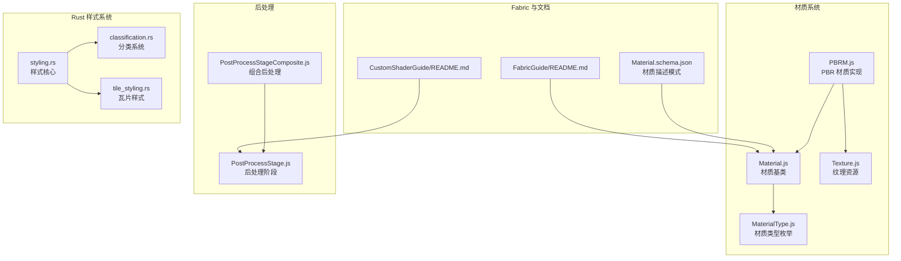
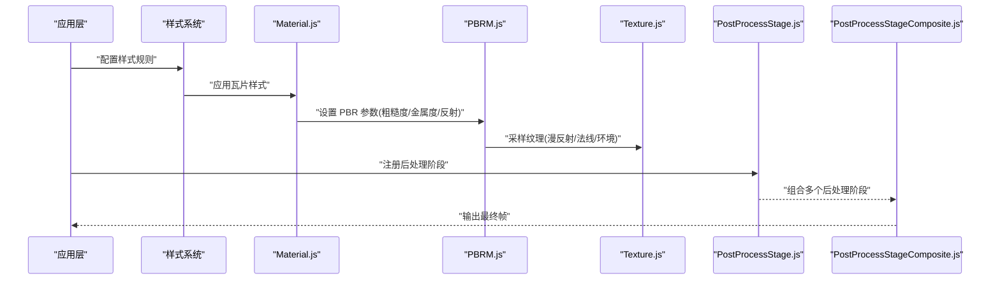
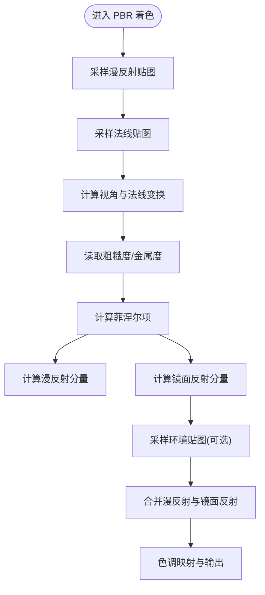
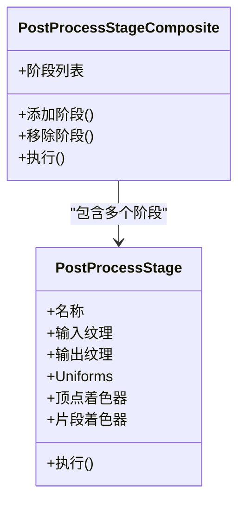
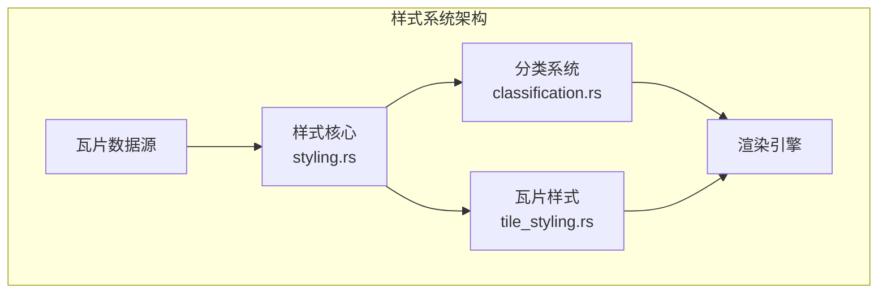
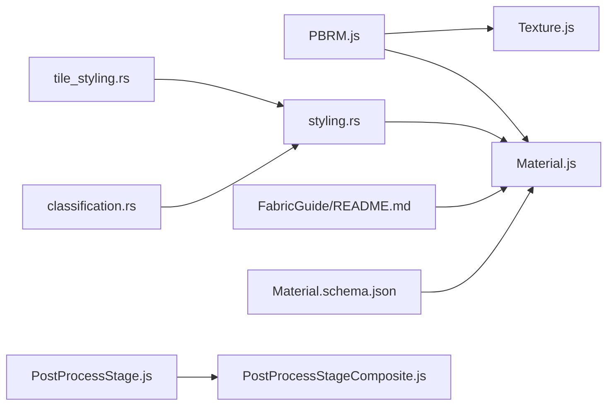

# 材质系统

<cite>
**本文引用的文件**   
- [README.md](file://README.md)
- [CustomShaderGuide/README.md](file://Documentation/CustomShaderGuide/README.md)
- [FabricGuide/README.md](file://Documentation/FabricGuide/README.md)
- [Material.schema.json](file://Documentation/Schemas/Fabric/Material.schema.json)
- [Texture.js](file://packages/engine/Source/Scene/Texture.js)
- [Material.js](file://packages/engine/Source/Scene/Material.js)
- [PBRM.js](file://packages/engine/Source/Scene/PBRM.js)
- [MaterialType.js](file://packages/engine/Source/Scene/MaterialType.js)
- [PostProcessStage.js](file://packages/engine/Source/Scene/PostProcessStage.js)
- [PostProcessStageComposite.js](file://packages/engine/Source/Scene/PostProcessStageComposite.js)
- [styling.rs](file://cesiumrust/domain/styling/src/styling.rs)
- [classification.rs](file://cesiumrust/domain/styling/src/classification.rs)
- [tile_styling.rs](file://cesiumrust/domain/styling/src/tile_styling.rs)
</cite>

## 更新摘要
**所做更改**   
- 新增基于瓦片的样式和分类系统章节
- 更新架构总览以包含新的样式系统组件
- 添加Rust后端样式系统的详细说明
- 扩展依赖关系分析以反映新的样式模块集成

## 目录
1. [简介](#简介)
2. [项目结构](#项目结构)
3. [核心组件](#核心组件)
4. [架构总览](#架构总览)
5. [详细组件分析](#详细组件分析)
6. [基于瓦片的样式系统](#基于瓦片的样式系统)
7. [依赖关系分析](#依赖关系分析)
8. [性能考虑](#性能考虑)
9. [故障排查指南](#故障排查指南)
10. [结论](#结论)
11. [附录](#附录)

## 简介
本技术文档聚焦于 Cesium 的"材质系统"，围绕以下目标展开：
- 解释 Material 基类的设计与材质类型体系
- 深入阐述 PBR 材质的物理渲染原理（漫反射、镜面反射、粗糙度、金属度）
- 说明纹理映射、法线贴图与环境贴图的实现机制
- 介绍后处理效果的集成方式与自定义着色器的编写方法
- **新增** 详细介绍基于瓦片的样式和分类系统
- 提供丰富的代码示例路径，展示材质创建、参数调整与动态更新
- 总结材质性能优化技巧与跨平台兼容性注意事项

## 项目结构
Cesium 的材质系统主要位于 engine 包的 Scene 模块中，配合 Fabric 材质系统与 PBR 材质实现。同时，新的 Rust 后端引入了基于瓦片的样式和分类系统。关键目录与文件包括：
- 材质基类与类型定义：Scene/Material.js、Scene/MaterialType.js
- PBR 材质实现：Scene/PBRM.js
- 纹理资源：Scene/Texture.js
- 后处理管线：Scene/PostProcessStage.js、Scene/PostProcessStageComposite.js
- 材质描述与 Fabric 系统：Documentation/Schemas/Fabric/Material.schema.json、Documentation/FabricGuide/README.md
- 自定义着色器指南：Documentation/CustomShaderGuide/README.md
- **新增** Rust 样式系统：cesiumrust/domain/styling/

**图表来源**
- [Material.js](file://packages/engine/Source/Scene/Material.js)
- [MaterialType.js](file://packages/engine/Source/Scene/MaterialType.js)
- [PBRM.js](file://packages/engine/Source/Scene/PBRM.js)
- [Texture.js](file://packages/engine/Source/Scene/Texture.js)
- [PostProcessStage.js](file://packages/engine/Source/Scene/PostProcessStage.js)
- [PostProcessStageComposite.js](file://packages/engine/Source/Scene/PostProcessStageComposite.js)
- [Material.schema.json](file://Documentation/Schemas/Fabric/Material.schema.json)
- [FabricGuide/README.md](file://Documentation/FabricGuide/README.md)
- [CustomShaderGuide/README.md](file://Documentation/CustomShaderGuide/README.md)
- [styling.rs](file://cesiumrust/domain/styling/src/styling.rs)
- [classification.rs](file://cesiumrust/domain/styling/src/classification.rs)
- [tile_styling.rs](file://cesiumrust/domain/styling/src/tile_styling.rs)

## 核心组件
- Material 基类：提供材质通用接口、属性生命周期管理、与渲染管线的绑定点。
- MaterialType：集中定义材质类型标识，便于运行时分发与选择。
- PBRM：基于物理的渲染材质，支持漫反射、镜面反射、粗糙度、金属度等关键参数。
- Texture：封装纹理资源加载、采样、格式与压缩适配。
- PostProcessStage/Composite：后处理阶段与组合器，用于叠加全局效果。
- Fabric 材质系统：通过 JSON 描述材质，驱动 Shader 生成与参数注入。
- **新增** Rust 样式系统：提供基于瓦片的样式和分类能力，支持高性能的大规模数据可视化。

## 架构总览
下图展示了材质系统在渲染流程中的位置与交互关系，以及新增的样式系统如何与现有架构集成：应用层通过 Fabric 或 API 创建材质，样式系统根据瓦片数据和分类规则动态应用样式，材质在绘制前将参数上传至 GPU；PBR 材质根据光照模型计算最终颜色；后处理阶段对帧缓冲进行二次处理。

**图表来源**
- [Material.js](file://packages/engine/Source/Scene/Material.js)
- [PBRM.js](file://packages/engine/Source/Scene/PBRM.js)
- [Texture.js](file://packages/engine/Source/Scene/Texture.js)
- [PostProcessStage.js](file://packages/engine/Source/Scene/PostProcessStage.js)
- [PostProcessStageComposite.js](file://packages/engine/Source/Scene/PostProcessStageComposite.js)
- [styling.rs](file://cesiumrust/domain/styling/src/styling.rs)

## 详细组件分析

### Material 基类与材质类型系统
- 设计要点
  - 统一材质接口：为所有材质类型提供一致的属性访问与生命周期钩子。
  - 类型分发：通过 MaterialType 区分不同材质，驱动对应的 Shader 与参数上传逻辑。
  - 参数同步：在每帧或参数变更时，将 JS 侧参数同步到 GPU Uniform。
- 扩展建议
  - 新增材质类型时，优先继承 Material 并实现必要的参数同步与 Shader 绑定。
  - 使用 MaterialType 注册新类型，确保渲染管线能正确识别。

**章节来源**
- [Material.js](file://packages/engine/Source/Scene/Material.js)
- [MaterialType.js](file://packages/engine/Source/Scene/MaterialType.js)

### PBR 材质（PBRM）与物理渲染原理
- 物理基础
  - 漫反射（Diffuse）：由表面粗糙度与入射光方向决定，遵循能量守恒。
  - 镜面反射（Specular）：受粗糙度控制高光分布宽度，金属度影响反射强度与颜色。
  - 粗糙度（Roughness）：越大越扩散，越小越尖锐。
  - 金属度（Metallic）：金属表面反射强且带色，非金属接近白色反射。
- 实现要点
  - 参数映射：将 JS 侧的 roughness/metallic/specular 等参数映射到 PBR 着色器。
  - 采样通道：漫反射贴图、法线贴图、环境贴图参与最终颜色计算。
  - 能量守恒：合理混合漫反射与镜面反射，避免过亮或不真实的高光。
- 典型用法路径
  - 创建 PBR 材质并设置参数：参见 [PBRM.js](file://packages/engine/Source/Scene/PBRM.js)
  - 关联纹理资源：参见 [Texture.js](file://packages/engine/Source/Scene/Texture.js)

**图表来源**
- [PBRM.js](file://packages/engine/Source/Scene/PBRM.js)
- [Texture.js](file://packages/engine/Source/Scene/Texture.js)

**章节来源**
- [PBRM.js](file://packages/engine/Source/Scene/PBRM.js)
- [Texture.js](file://packages/engine/Source/Scene/Texture.js)

### 纹理映射、法线贴图与环境贴图
- 纹理映射
  - 漫反射贴图：提供表面基础颜色信息。
  - 法线贴图：在不改变几何的前提下增强表面细节。
  - 环境贴图：用于反射与间接照明近似。
- 实现机制
  - 纹理加载与缓存：Texture.js 负责加载、格式转换与复用。
  - UV 变换与过滤：支持重复、偏移、缩放与滤波策略。
  - 多通道与压缩：针对不同平台选择合适的纹理压缩格式。
- 参考路径
  - 纹理资源与采样：参见 [Texture.js](file://packages/engine/Source/Scene/Texture.js)

**章节来源**
- [Texture.js](file://packages/engine/Source/Scene/Texture.js)

### 后处理效果集成与自定义着色器
- 后处理阶段
  - PostProcessStage：定义单个后处理步骤（输入/输出、Uniforms、Shader）。
  - PostProcessStageComposite：组合多个阶段，按顺序执行以形成最终画面。
- 自定义着色器
  - 参考指南：参见 [CustomShaderGuide/README.md](file://Documentation/CustomShaderGuide/README.md)
  - 常见流程：编写顶点/片段着色器，注册为后处理阶段，传入所需 Uniform。
- 集成方式
  - 在场景初始化后添加后处理阶段，按需启用/禁用。
  - 利用 Composite 管理复杂效果链，提升可维护性。

**图表来源**
- [PostProcessStage.js](file://packages/engine/Source/Scene/PostProcessStage.js)
- [PostProcessStageComposite.js](file://packages/engine/Source/Scene/PostProcessStageComposite.js)

**章节来源**
- [PostProcessStage.js](file://packages/engine/Source/Scene/PostProcessStage.js)
- [PostProcessStageComposite.js](file://packages/engine/Source/Scene/PostProcessStageComposite.js)
- [CustomShaderGuide/README.md](file://Documentation/CustomShaderGuide/README.md)

### Fabric 材质系统与材质描述模式
- Fabric 材质
  - 通过 JSON 描述材质结构与参数，自动生成 Shader 与绑定逻辑。
  - 适合声明式材质配置与快速迭代。
- 材质模式
  - Material.schema.json 定义了材质属性的字段、类型与约束。
- 参考路径
  - 材质描述模式：参见 [Material.schema.json](file://Documentation/Schemas/Fabric/Material.schema.json)
  - Fabric 指南：参见 [FabricGuide/README.md](file://Documentation/FabricGuide/README.md)

**章节来源**
- [Material.schema.json](file://Documentation/Schemas/Fabric/Material.schema.json)
- [FabricGuide/README.md](file://Documentation/FabricGuide/README.md)

## 基于瓦片的样式系统

### 样式系统架构
Cesium 的新版样式系统采用 Rust 后端实现，提供了高性能的基于瓦片的样式和分类能力。该系统主要包括三个核心组件：

- **样式核心（styling.rs）**：提供样式定义、解析和应用的核心逻辑
- **分类系统（classification.rs）**：支持基于属性值的条件分类和数据驱动的样式应用
- **瓦片样式（tile_styling.rs）**：专门处理 3D Tiles 数据的样式化，支持动态样式更新

**图表来源**
- [styling.rs](file://cesiumrust/domain/styling/src/styling.rs)
- [classification.rs](file://cesiumrust/domain/styling/src/classification.rs)
- [tile_styling.rs](file://cesiumrust/domain/styling/src/tile_styling.rs)

### 样式定义与应用流程
样式系统支持多种样式定义方式，包括静态样式配置和动态表达式：

1. **样式定义**：通过 JSON 或程序化 API 定义样式规则
2. **分类处理**：根据数据属性值进行分类和条件判断
3. **瓦片适配**：针对 3D Tiles 数据结构进行优化
4. **材质映射**：将样式结果映射到具体的材质参数
5. **动态更新**：支持运行时样式修改和实时更新

### 与现有材质系统的集成
新的样式系统与现有的材质系统无缝集成：

- **样式到材质映射**：样式规则自动转换为材质参数
- **批量处理**：支持大规模瓦片数据的批量样式应用
- **性能优化**：利用 Rust 的高性能特性减少 CPU 开销
- **内存管理**：智能的资源管理和垃圾回收

**章节来源**
- [styling.rs](file://cesiumrust/domain/styling/src/styling.rs)
- [classification.rs](file://cesiumrust/domain/styling/src/classification.rs)
- [tile_styling.rs](file://cesiumrust/domain/styling/src/tile_styling.rs)

## 依赖关系分析
- 组件耦合
  - PBRM 依赖 Material 基类与 Texture 资源。
  - 后处理阶段独立于具体材质，但作用于最终帧缓冲。
  - **新增** 样式系统作为中间层，连接数据源和材质系统。
- 外部依赖
  - 纹理压缩与格式适配在不同平台存在差异，需关注 WebGL/WebGL2 能力检测。
  - **新增** Rust 样式系统需要与 JavaScript 前端进行高效通信。
- 循环依赖
  - 材质与纹理之间应避免直接循环引用，通过资源管理器解耦。
  - **新增** 样式系统通过接口抽象避免与具体材质实现的紧耦合。

**图表来源**
- [PBRM.js](file://packages/engine/Source/Scene/PBRM.js)
- [Material.js](file://packages/engine/Source/Scene/Material.js)
- [Texture.js](file://packages/engine/Source/Scene/Texture.js)
- [PostProcessStage.js](file://packages/engine/Source/Scene/PostProcessStage.js)
- [PostProcessStageComposite.js](file://packages/engine/Source/Scene/PostProcessStageComposite.js)
- [FabricGuide/README.md](file://Documentation/FabricGuide/README.md)
- [Material.schema.json](file://Documentation/Schemas/Fabric/Material.schema.json)
- [styling.rs](file://cesiumrust/domain/styling/src/styling.rs)
- [classification.rs](file://cesiumrust/domain/styling/src/classification.rs)
- [tile_styling.rs](file://cesiumrust/domain/styling/src/tile_styling.rs)

**章节来源**
- [PBRM.js](file://packages/engine/Source/Scene/PBRM.js)
- [Material.js](file://packages/engine/Source/Scene/Material.js)
- [Texture.js](file://packages/engine/Source/Scene/Texture.js)
- [PostProcessStage.js](file://packages/engine/Source/Scene/PostProcessStage.js)
- [PostProcessStageComposite.js](file://packages/engine/Source/Scene/PostProcessStageComposite.js)
- [FabricGuide/README.md](file://Documentation/FabricGuide/README.md)
- [Material.schema.json](file://Documentation/Schemas/Fabric/Material.schema.json)
- [styling.rs](file://cesiumrust/domain/styling/src/styling.rs)
- [classification.rs](file://cesiumrust/domain/styling/src/classification.rs)
- [tile_styling.rs](file://cesiumrust/domain/styling/src/tile_styling.rs)

## 性能考虑
- 纹理优化
  - 使用合适的压缩格式与 mipmaps，减少带宽与显存占用。
  - 避免频繁切换纹理，尽量批处理相同材质的绘制调用。
- 材质参数更新
  - 仅在必要时更新 Uniform，避免每帧全量同步。
  - 合并多次参数修改，降低 CPU-GPU 通信开销。
- 后处理阶段
  - 谨慎启用高成本的后处理效果，按需开启/关闭。
  - 使用复合后处理器组织阶段，减少状态切换。
- 平台兼容
  - 检测 WebGL/WebGL2 特性，降级策略保证移动端稳定运行。
  - 针对低端设备限制纹理分辨率与后处理复杂度。
- **新增** 样式系统性能优化
  - 利用 Rust 的高性能特性处理大规模数据样式化。
  - 实现增量样式更新，避免全量重算。
  - 缓存样式计算结果，提高重复查询性能。
  - 异步样式处理，避免阻塞主线程。

## 故障排查指南
- 材质未生效
  - 检查材质类型是否正确注册与选择。
  - 确认参数已同步到 GPU，查看相关日志与断点。
- 纹理异常
  - 验证纹理路径与加载成功，检查格式与压缩是否受支持。
  - 确认 UV 范围与重复模式符合预期。
- 后处理无效果
  - 检查阶段是否添加到组合器并按序执行。
  - 确认着色器编译无误，Uniform 传递正确。
- **新增** 样式系统问题
  - 检查样式规则语法是否正确，验证 JSON 格式。
  - 确认瓦片数据属性与样式表达式匹配。
  - 监控样式计算性能，避免内存泄漏。
  - 调试样式到材质的映射关系。
- 参考路径
  - 材质与类型：参见 [Material.js](file://packages/engine/Source/Scene/Material.js)、[MaterialType.js](file://packages/engine/Source/Scene/MaterialType.js)
  - 纹理资源：参见 [Texture.js](file://packages/engine/Source/Scene/Texture.js)
  - 后处理：参见 [PostProcessStage.js](file://packages/engine/Source/Scene/PostProcessStage.js)、[PostProcessStageComposite.js](file://packages/engine/Source/Scene/PostProcessStageComposite.js)
  - **新增** 样式系统：参见 [styling.rs](file://cesiumrust/domain/styling/src/styling.rs)、[classification.rs](file://cesiumrust/domain/styling/src/classification.rs)、[tile_styling.rs](file://cesiumrust/domain/styling/src/tile_styling.rs)

**章节来源**
- [Material.js](file://packages/engine/Source/Scene/Material.js)
- [MaterialType.js](file://packages/engine/Source/Scene/MaterialType.js)
- [Texture.js](file://packages/engine/Source/Scene/Texture.js)
- [PostProcessStage.js](file://packages/engine/Source/Scene/PostProcessStage.js)
- [PostProcessStageComposite.js](file://packages/engine/Source/Scene/PostProcessStageComposite.js)
- [styling.rs](file://cesiumrust/domain/styling/src/styling.rs)
- [classification.rs](file://cesiumrust/domain/styling/src/classification.rs)
- [tile_styling.rs](file://cesiumrust/domain/styling/src/tile_styling.rs)

## 结论
Cesium 的材质系统以 Material 基类为核心，结合 PBR 材质与 Fabric 描述模式，提供了灵活而高效的渲染能力。**新增的基于瓦片的样式系统**进一步增强了大规模数据可视化的能力，通过 Rust 后端实现高性能的样式处理和分类功能。通过合理的纹理管理、后处理集成、样式系统优化与性能优化策略，可以在多平台上获得一致且高质量的视觉效果。建议在开发中遵循本文档提供的最佳实践，并结合实际场景进行调优。

## 附录
- 示例与参考路径
  - 创建与配置 PBR 材质：参见 [PBRM.js](file://packages/engine/Source/Scene/PBRM.js)
  - 纹理资源管理与采样：参见 [Texture.js](file://packages/engine/Source/Scene/Texture.js)
  - 后处理阶段注册与组合：参见 [PostProcessStage.js](file://packages/engine/Source/Scene/PostProcessStage.js)、[PostProcessStageComposite.js](file://packages/engine/Source/Scene/PostProcessStageComposite.js)
  - Fabric 材质描述与模式：参见 [Material.schema.json](file://Documentation/Schemas/Fabric/Material.schema.json)、[FabricGuide/README.md](file://Documentation/FabricGuide/README.md)
  - 自定义着色器指南：参见 [CustomShaderGuide/README.md](file://Documentation/CustomShaderGuide/README.md)
  - **新增** 样式系统实现：参见 [styling.rs](file://cesiumrust/domain/styling/src/styling.rs)、[classification.rs](file://cesiumrust/domain/styling/src/classification.rs)、[tile_styling.rs](file://cesiumrust/domain/styling/src/tile_styling.rs)

**章节来源**
- [PBRM.js](file://packages/engine/Source/Scene/PBRM.js)
- [Texture.js](file://packages/engine/Source/Scene/Texture.js)
- [PostProcessStage.js](file://packages/engine/Source/Scene/PostProcessStage.js)
- [PostProcessStageComposite.js](file://packages/engine/Source/Scene/PostProcessStageComposite.js)
- [Material.schema.json](file://Documentation/Schemas/Fabric/Material.schema.json)
- [FabricGuide/README.md](file://Documentation/FabricGuide/README.md)
- [CustomShaderGuide/README.md](file://Documentation/CustomShaderGuide/README.md)
- [styling.rs](file://cesiumrust/domain/styling/src/styling.rs)
- [classification.rs](file://cesiumrust/domain/styling/src/classification.rs)
- [tile_styling.rs](file://cesiumrust/domain/styling/src/tile_styling.rs)