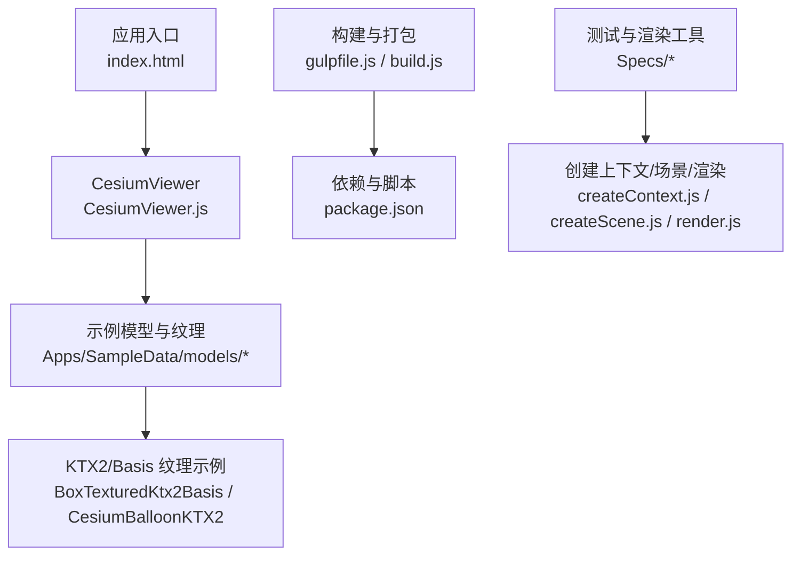
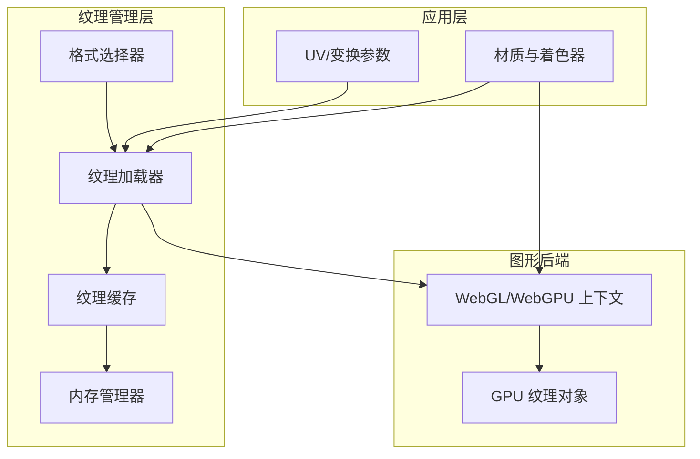
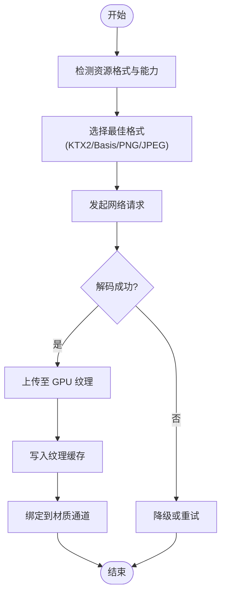
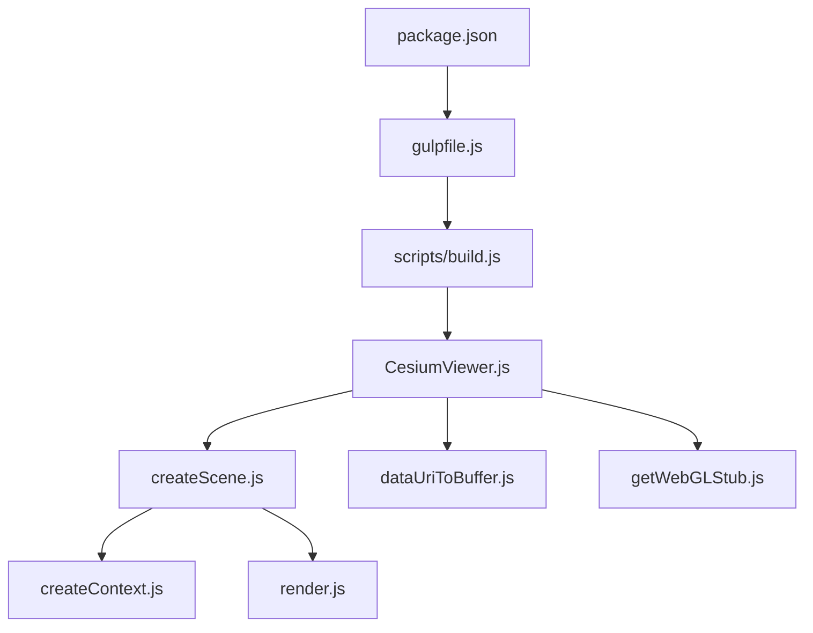

# 纹理系统

<cite>
**本文引用的文件**   
- [README.md](file://README.md)
- [index.html](file://index.html)
- [CesiumViewer.js](file://Apps/CesiumViewer/CesiumViewer.js)
- [package.json](file://package.json)
- [gulpfile.js](file://gulpfile.js)
- [build.js](file://scripts/build.js)
- [createScene.js](file://Specs/createScene.js)
- [createContext.js](file://Specs/createContext.js)
- [render.js](file://Specs/render.js)
- [getWebGLStub.js](file://Specs/getWebGLStub.js)
- [dataUriToBuffer.js](file://Specs/dataUriToBuffer.js)
- [BoxTexturedKtx2Basis](file://Apps/SampleData/models/BoxTexturedKtx2Basis)
- [CesiumBalloonKTX2](file://Apps/SampleData/models/CesiumBalloonKTX2)
</cite>

## 目录
1. [简介](#简介)
2. [项目结构](#项目结构)
3. [核心组件](#核心组件)
4. [架构总览](#架构总览)
5. [详细组件分析](#详细组件分析)
6. [依赖关系分析](#依赖关系分析)
7. [性能考量](#性能考量)
8. [故障排查指南](#故障排查指南)
9. [结论](#结论)
10. [附录](#附录)

## 简介
本技术文档聚焦 Cesium 的纹理系统，围绕纹理加载、缓存与内存管理展开，解释 2D 纹理、立方体贴图与纹理数组的应用场景；阐述 KTX2、Basis Universal 等压缩格式支持与自动格式选择策略；说明 UV 映射、纹理变换与多重纹理混合的实现方式；并提供法线贴图、环境贴图和高光贴图的配置示例。同时给出纹理性能优化、LOD 管理与跨平台兼容性处理的最佳实践，帮助开发者在复杂三维场景中稳定高效地使用纹理资源。

## 项目结构
仓库采用模块化组织，应用入口位于 Apps/CesiumViewer，示例数据与测试用例分布在 Apps/SampleData 与 Specs 目录中。构建脚本与打包流程由 gulpfile.js 与 scripts/build.js 驱动，package.json 定义依赖与脚本命令。

图表来源
- [index.html](file://index.html)
- [CesiumViewer.js](file://Apps/CesiumViewer/CesiumViewer.js)
- [BoxTexturedKtx2Basis](file://Apps/SampleData/models/BoxTexturedKtx2Basis)
- [CesiumBalloonKTX2](file://Apps/SampleData/models/CesiumBalloonKTX2)
- [gulpfile.js](file://gulpfile.js)
- [build.js](file://scripts/build.js)
- [package.json](file://package.json)
- [createContext.js](file://Specs/createContext.js)
- [createScene.js](file://Specs/createScene.js)
- [render.js](file://Specs/render.js)

章节来源
- [README.md](file://README.md)
- [package.json](file://package.json)
- [gulpfile.js](file://gulpfile.js)
- [build.js](file://scripts/build.js)

## 核心组件
- 纹理加载器：负责从网络或本地读取图像数据，支持多种格式（包括 KTX2、Basis），并转换为 GPU 可使用的纹理对象。
- 纹理缓存：以资源标识为键维护已加载纹理，避免重复下载与解码，降低内存占用与带宽消耗。
- 内存管理器：跟踪纹理生命周期，按需释放不再使用的纹理，防止内存泄漏。
- 材质与着色器集成：将纹理绑定到材质通道（漫反射、法线、高光、环境等），并在着色器中进行采样与混合。
- 格式选择器：根据设备能力与浏览器支持，自动选择最优纹理格式（如 KTX2、Basis、PNG/JPEG）。

章节来源
- [CesiumViewer.js](file://Apps/CesiumViewer/CesiumViewer.js)
- [createScene.js](file://Specs/createScene.js)
- [createContext.js](file://Specs/createContext.js)
- [render.js](file://Specs/render.js)

## 架构总览
Cesium 纹理系统遵循“加载—缓存—绑定—采样”的分层架构。上层通过材质与几何体声明纹理用途，中层由加载器与缓存管理纹理生命周期，底层与 WebGL/WebGPU 上下文交互完成 GPU 纹理上传与采样。

图表来源
- [createContext.js](file://Specs/createContext.js)
- [createScene.js](file://Specs/createScene.js)
- [render.js](file://Specs/render.js)
- [CesiumViewer.js](file://Apps/CesiumViewer/CesiumViewer.js)

## 详细组件分析

### 纹理加载与缓存机制
- 加载流程：解析资源 URL → 检测格式 → 选择解码路径 → 生成 GPU 纹理 → 写入缓存。
- 缓存策略：基于资源指纹（URL+版本）去重；支持按使用频率与最近访问时间淘汰。
- 并发控制：限制并行下载与解码数量，避免阻塞主线程与 GPU 上传队列。
- 错误恢复：对网络失败与解码异常进行重试或降级（例如回退到 PNG/JPEG）。

图表来源
- [createContext.js](file://Specs/createContext.js)
- [createScene.js](file://Specs/createScene.js)
- [render.js](file://Specs/render.js)

章节来源
- [createContext.js](file://Specs/createContext.js)
- [createScene.js](file://Specs/createScene.js)
- [render.js](file://Specs/render.js)

### 2D 纹理、立方体贴图与纹理数组
- 2D 纹理：用于漫反射、法线、粗糙度、金属度等表面属性贴图，支持 UV 映射与纹理变换。
- 立方体贴图：常用于环境贴图、天空盒、反射/折射效果，提供六面采样。
- 纹理数组：批量管理多张同尺寸纹理，减少状态切换开销，适用于实例化渲染与 LOD 图集。

章节来源
- [CesiumViewer.js](file://Apps/CesiumViewer/CesiumViewer.js)
- [createScene.js](file://Specs/createScene.js)

### 纹理压缩格式支持与自动选择策略
- 支持的压缩格式：KTX2（推荐）、Basis Universal（兼容性好）、PNG/JPEG（通用但体积较大）。
- 自动选择：根据浏览器与 GPU 能力探测，优先选择 KTX2，其次 Basis，最后回退到 PNG/JPEG。
- 元数据利用：KTX2 头信息包含目标格式与压缩级别，提升解码效率。

章节来源
- [CesiumViewer.js](file://Apps/CesiumViewer/CesiumViewer.js)
- [createContext.js](file://Specs/createContext.js)

### UV 映射、纹理变换与多重纹理混合
- UV 映射：顶点坐标经 UV 通道映射到纹理坐标，支持偏移、旋转、缩放与平铺。
- 纹理变换：通过矩阵或 uniform 参数在着色器中动态调整采样位置。
- 多重纹理混合：在同一材质上叠加多个纹理通道（如漫反射+法线+高光），按权重混合输出最终颜色。

章节来源
- [createScene.js](file://Specs/createScene.js)
- [render.js](file://Specs/render.js)

### 法线贴图、环境贴图与高光贴图配置示例
- 法线贴图：在切线空间下扰动法线方向，增强表面细节；需确保 UV 一致且法线贴图未翻转。
- 环境贴图：用于反射/折射或全局光照近似，通常使用立方体贴图；注意坐标系统与采样方向。
- 高光贴图：控制镜面反射强度与分布，常与粗糙度/金属度配合实现 PBR 效果。

章节来源
- [CesiumViewer.js](file://Apps/CesiumViewer/CesiumViewer.js)
- [createScene.js](file://Specs/createScene.js)

### 纹理性能优化、LOD 管理与跨平台兼容性
- 性能优化：
  - 使用 KTX2/Basis 压缩减小体积与传输时间。
  - 合理设置 mipmaps 与裁剪区域，避免过度采样。
  - 合并小纹理为图集，减少状态切换。
- LOD 管理：
  - 基于距离与屏幕占比动态切换纹理分辨率。
  - 使用纹理数组或图集存储多级分辨率，降低切换开销。
- 跨平台兼容性：
  - 检测 WebAssembly 与 GPU 特性，必要时回退到软件解码。
  - 移动端限制并发与纹理大小，避免内存溢出。

章节来源
- [createContext.js](file://Specs/createContext.js)
- [createScene.js](file://Specs/createScene.js)
- [render.js](file://Specs/render.js)

## 依赖关系分析
纹理系统依赖图形上下文、资源加载器与缓存模块。构建脚本与测试工具提供运行环境与验证用例。

图表来源
- [package.json](file://package.json)
- [gulpfile.js](file://gulpfile.js)
- [build.js](file://scripts/build.js)
- [CesiumViewer.js](file://Apps/CesiumViewer/CesiumViewer.js)
- [createScene.js](file://Specs/createScene.js)
- [createContext.js](file://Specs/createContext.js)
- [render.js](file://Specs/render.js)
- [dataUriToBuffer.js](file://Specs/dataUriToBuffer.js)
- [getWebGLStub.js](file://Specs/getWebGLStub.js)

章节来源
- [package.json](file://package.json)
- [gulpfile.js](file://gulpfile.js)
- [build.js](file://scripts/build.js)
- [CesiumViewer.js](file://Apps/CesiumViewer/CesiumViewer.js)

## 性能考量
- 纹理体积与带宽：优先使用 KTX2/Basis，启用 gzip/brotli 传输压缩。
- GPU 内存占用：控制纹理分辨率与 mipmap 层级，及时释放无用纹理。
- 解码与上传：异步解码与批量化上传，避免主线程阻塞。
- 采样质量：合理设置过滤模式与各向异性过滤，平衡画质与性能。
- 移动端适配：限制最大纹理尺寸与并发数，降低功耗与发热。

[本节为通用指导，不直接分析具体文件]

## 故障排查指南
- 纹理无法加载：检查 URL 可达性、CORS 配置与 MIME 类型；查看控制台错误日志。
- 解码失败：确认浏览器是否支持对应压缩格式；尝试回退到 PNG/JPEG。
- 内存泄漏：监控纹理缓存大小与引用计数，确保正确释放。
- 渲染异常：检查 UV 映射与纹理坐标范围，确认着色器采样逻辑。

章节来源
- [createContext.js](file://Specs/createContext.js)
- [createScene.js](file://Specs/createScene.js)
- [render.js](file://Specs/render.js)

## 结论
Cesium 的纹理系统通过分层架构与智能格式选择，实现了高效的纹理加载、缓存与内存管理。结合 UV 映射、纹理变换与多重纹理混合，能够满足复杂三维场景的视觉需求。在生产环境中，应重视压缩格式、LOD 管理与跨平台兼容性，以获得稳定且高性能的渲染体验。

[本节为总结性内容，不直接分析具体文件]

## 附录
- 示例资源路径：
  - BoxTexturedKtx2Basis：包含 KTX2 与 Basis 纹理的盒子模型示例。
  - CesiumBalloonKTX2：使用 KTX2 纹理的气球模型示例。
- 参考文件：
  - index.html：应用入口页面。
  - CesiumViewer.js：Cesium 视图器初始化与资源加载逻辑。
  - createScene.js：场景创建与材质配置。
  - createContext.js：WebGL/WebGPU 上下文创建与能力探测。
  - render.js：渲染循环与帧更新。
  - dataUriToBuffer.js：数据 URI 转 Buffer 的工具函数。
  - getWebGLStub.js：WebGL 存根，用于测试环境。

章节来源
- [index.html](file://index.html)
- [CesiumViewer.js](file://Apps/CesiumViewer/CesiumViewer.js)
- [createScene.js](file://Specs/createScene.js)
- [createContext.js](file://Specs/createContext.js)
- [render.js](file://Specs/render.js)
- [dataUriToBuffer.js](file://Specs/dataUriToBuffer.js)
- [getWebGLStub.js](file://Specs/getWebGLStub.js)
- [BoxTexturedKtx2Basis](file://Apps/SampleData/models/BoxTexturedKtx2Basis)
- [CesiumBalloonKTX2](file://Apps/SampleData/models/CesiumBalloonKTX2)