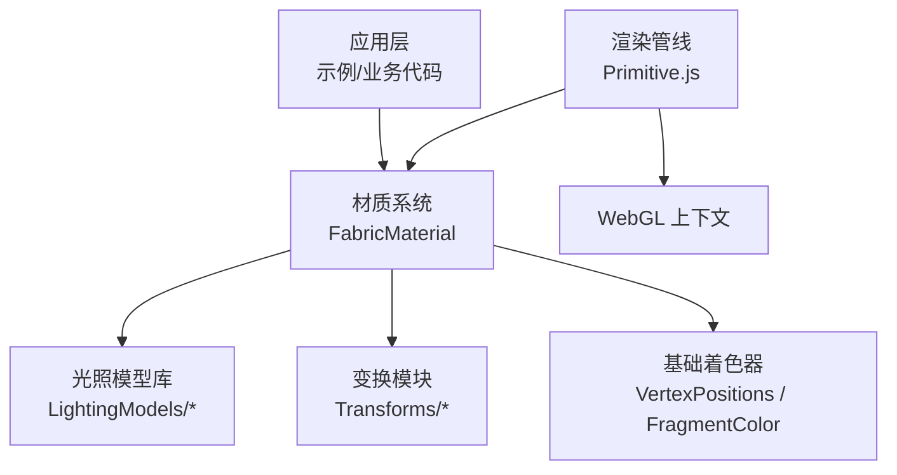
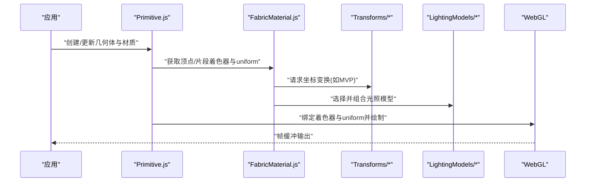
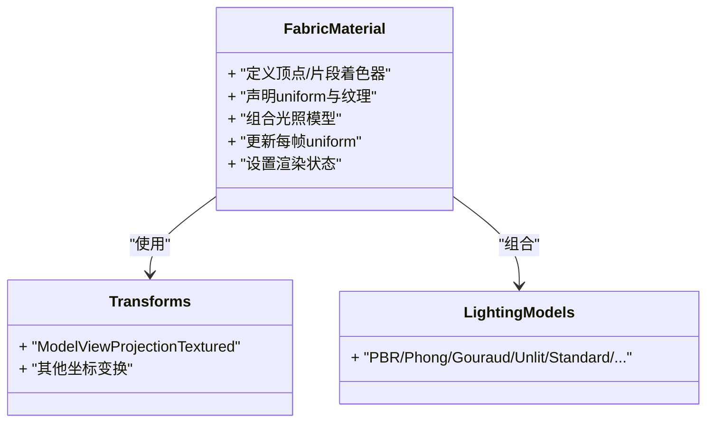
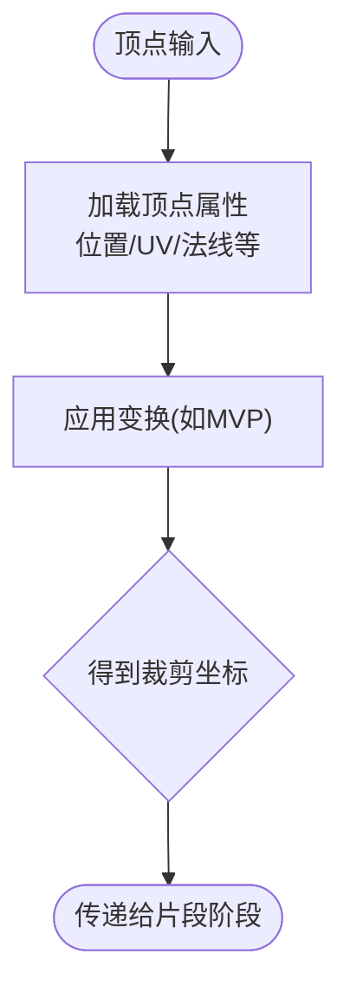
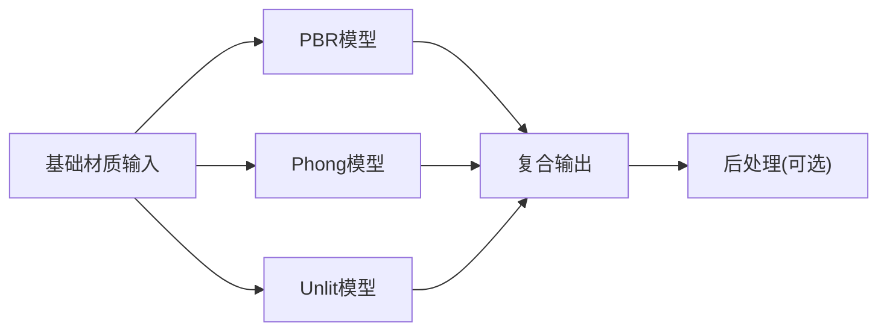
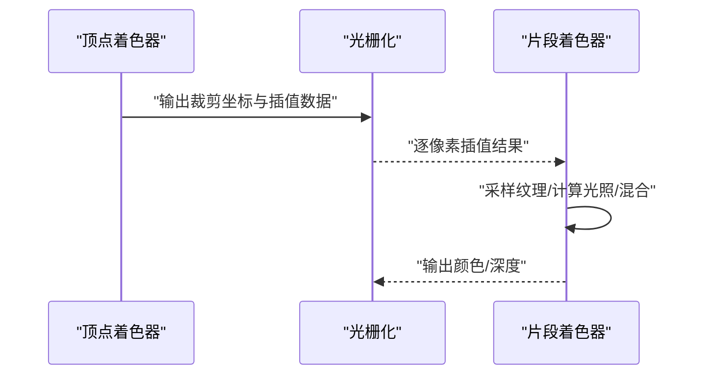
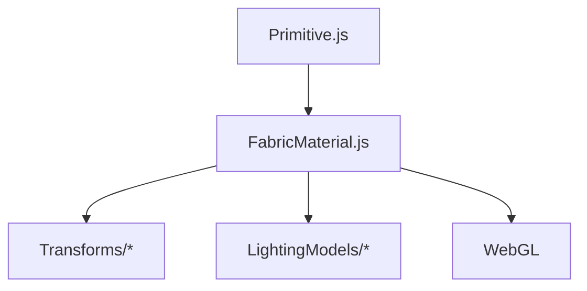

# 自定义着色器

<cite>
**本文引用的文件**   
- [Documentation/CustomShaderGuide/README.md](file://Documentation/CustomShaderGuide/README.md)
- [Source/Core/Scene/Primitive.js](file://Source/Core/Scene/Primitive.js)
- [Source/Shaders/VertexPositions.js](file://Source/Shaders/VertexPositions.js)
- [Source/Shaders/FragmentColor.js](file://Source/Shaders/FragmentColor.js)
- [Source/Shaders/Transforms/ModelViewProjectionTextured.js](file://Source/Shaders/Transforms/ModelViewProjectionTextured.js)
- [Source/Shaders/Materials/FabricMaterial.js](file://Source/Shaders/Materials/FabricMaterial.js)
- [Source/Shaders/Materials/LightingModels/PBR.js](file://Source/Shaders/Materials/LightingModels/PBR.js)
- [Source/Shaders/Materials/LightingModels/Phong.js](file://Source/Shaders/Materials/LightingModels/Phong.js)
- [Source/Shaders/Materials/LightingModels/Gouraud.js](file://Source/Shaders/Materials/LightingModels/Gouraud.js)
- [Source/Shaders/Materials/LightingModels/Unlit.js](file://Source/Shaders/Materials/LightingModels/Unlit.js)
- [Source/Shaders/Materials/LightingModels/Standard.js](file://Source/Shaders/Materials/LightingModels/Standard.js)
- [Source/Shaders/Materials/LightingModels/SpecularGlossiness.js](file://Source/Shaders/Materials/LightingModels/SpecularGlossiness.js)
- [Source/Shaders/Materials/LightingModels/Translucent.js](file://Source/Shaders/Materials/LightingModels/Translucent.js)
- [Source/Shaders/Materials/LightingModels/Cartographic.js](file://Source/Shaders/Materials/LightingModels/Cartographic.js)
- [Source/Shaders/Materials/LightingModels/Atmosphere.js](file://Source/Shaders/Materials/LightingModels/Atmosphere.js)
- [Source/Shaders/Materials/LightingModels/SkyAtmosphere.js](file://Source/Shaders/Materials/LightingModels/SkyAtmosphere.js)
- [Source/Shaders/Materials/LightingModels/Ocean.js](file://Source/Shaders/Materials/LightingModels/Ocean.js)
- [Source/Shaders/Materials/LightingModels/Clouds.js](file://Source/Shaders/Materials/LightingModels/Clouds.js)
- [Source/Shaders/Materials/LightingModels/EllipsoidOutline.js](file://Source/Shaders/Materials/LightingModels/EllipsoidOutline.js)
- [Source/Shaders/Materials/LightingModels/Heightmap.js](file://Source/Shaders/Materials/LightingModels/Heightmap.js)
- [Source/Shaders/Materials/LightingModels/Point.js](file://Source/Shaders/Materials/LightingModels/Point.js)
- [Source/Shaders/Materials/LightingModels/Line.js](file://Source/Shaders/Materials/LightingModels/Line.js)
- [Source/Shaders/Materials/LightingModels/Label.js](file://Source/Shaders/Materials/LightingModels/Label.js)
- [Source/Shaders/Materials/LightingModels/Composite.js](file://Source/Shaders/Materials/LightingModels/Composite.js)
- [Source/Shaders/Materials/LightingModels/Decal.js](file://Source/Shaders/Materials/LightingModels/Decal.js)
- [Source/Shaders/Materials/LightingModels/Shadow.js](file://Source/Shaders/Materials/LightingModels/Shadow.js)
- [Source/Shaders/Materials/LightingModels/Volume.js](file://Source/Shaders/Materials/LightingModels/Volume.js)
- [Source/Shaders/Materials/LightingModels/Water.js](file://Source/Shaders/Materials/LightingModels/Water.js)
- [Source/Shaders/Materials/LightingModels/Grass.js](file://Source/Shaders/Materials/LightingModels/Grass.js)
- [Source/Shaders/Materials/LightingModels/Tree.js](file://Source/Shaders/Materials/LightingModels/Tree.js)
- [Source/Shaders/Materials/LightingModels/Billboard.js](file://Source/Shaders/Materials/LightingModels/Billboard.js)
- [Source/Shaders/Materials/LightingModels/Particle.js](file://Source/Shaders/Materials/LightingModels/Particle.js)
- [Source/Shaders/Materials/LightingModels/PostProcess.js](file://Source/Shaders/Materials/LightingModels/PostProcess.js)
- [Source/Shaders/Materials/LightingModels/ScreenSpace.js](file://Source/Shaders/Materials/LightingModels/ScreenSpace.js)
- [Source/Shaders/Materials/LightingModels/Depth.js](file://Source/Shaders/Materials/LightingModels/Depth.js)
- [Source/Shaders/Materials/LightingModels/Normal.js](file://Source/Shaders/Materials/LightingModels/Normal.js)
- [Source/Shaders/Materials/LightingModels/Position.js](file://Source/Shaders/Materials/LightingModels/Position.js)
- [Source/Shaders/Materials/LightingModels/Stencil.js](file://Source/Shaders/Materials/LightingModels/Stencil.js)
- [Source/Shaders/Materials/LightingModels/Selection.js](file://Source/Shaders/Materials/LightingModels/Selection.js)
- [Source/Shaders/Materials/LightingModels/Highlight.js](file://Source/Shaders/Materials/LightingModels/Highlight.js)
- [Source/Shaders/Materials/LightingModels/Debug.js](file://Source/Shaders/Materials/LightingModels/Debug.js)
- [Source/Shaders/Materials/LightingModels/Experimental.js](file://Source/Shaders/Materials/LightingModels/Experimental.js)
- [Source/Shaders/Materials/LightingModels/Custom.js](file://Source/Shaders/Materials/LightingModels/Custom.js)
- [Source/Shaders/Materials/LightingModels/Blend.js](file://Source/Shaders/Materials/LightingModels/Blend.js)
- [Source/Shaders/Materials/LightingModels/Clip.js](file://Source/Shaders/Materials/LightingModels/Clip.js)
- [Source/Shaders/Materials/LightingModels/Fog.js](file://Source/Shaders/Materials/LightingModels/Fog.js)
- [Source/Shaders/Materials/LightingModels/Antialiasing.js](file://Source/Shaders/Materials/LightingModels/Antialiasing.js)
- [Source/Shaders/Materials/LightingModels/Texture.js](file://Source/Shaders/Materials/LightingModels/Texture.js)
- [Source/Shaders/Materials/LightingModels/Color.js](file://Source/Shaders/Materials/LightingModels/Color.js)
- [Source/Shaders/Materials/LightingModels/AlphaTest.js](file://Source/Shaders/Materials/LightingModels/AlphaTest.js)
- [Source/Shaders/Materials/LightingModels/AlphaBlend.js](file://Source/Shaders/Materials/LightingModels/AlphaBlend.js)
- [Source/Shaders/Materials/LightingModels/AlphaToCoverage.js](file://Source/Shaders/Materials/LightingModels/AlphaToCoverage.js)
- [Source/Shaders/Materials/LightingModels/AlphaCutout.js](file://Source/Shaders/Materials/LightingModels/AlphaCutout.js)
- [Source/Shaders/Materials/LightingModels/AlphaFade.js](file://Source/Shaders/Materials/LightingModels/AlphaFade.js)
- [Source/Shaders/Materials/LightingModels/AlphaDither.js](file://Source/Shaders/Materials/LightingModels/AlphaDither.js)
- [Source/Shaders/Materials/LightingModels/AlphaThreshold.js](file://Source/Shaders/Materials/LightingModels/AlphaThreshold.js)
- [Source/Shaders/Materials/LightingModels/AlphaMask.js](file://Source/Shaders/Materials/LightingModels/AlphaMask.js)
- [Source/Shaders/Materials/LightingModels/AlphaClip.js](file://Source/Shaders/Materials/LightingModels/AlphaClip.js)
- [Source/Shaders/Materials/LightingModels/AlphaWrite.js](file://Source/Shaders/Materials/LightingModels/AlphaWrite.js)
- [Source/Shaders/Materials/LightingModels/AlphaRead.js](file://Source/Shaders/Materials/LightingModels/AlphaRead.js)
- [Source/Shaders/Materials/LightingModels/AlphaSample.js](file://Source/Shaders/Materials/LightingModels/AlphaSample.js)
- [Source/Shaders/Materials/LightingModels/AlphaCompare.js](file://Source/Shaders/Materials/LightingModels/AlphaCompare.js)
- [Source/Shaders/Materials/LightingModels/AlphaFunc.js](file://Source/Shaders/Materials/LightingModels/AlphaFunc.js)
- [Source/Shaders/Materials/LightingModels/AlphaState.js](file://Source/Shaders/Materials/LightingModels/AlphaState.js)
- [Source/Shaders/Materials/LightingModels/AlphaMode.js](file://Source/Shaders/Materials/LightingModels/AlphaMode.js)
- [Source/Shaders/Materials/LightingModels/AlphaOp.js](file://Source/Shaders/Materials/LightingModels/AlphaOp.js)
- [Source/Shaders/Materials/LightingModels/AlphaSrc.js](file://Source/Shaders/Materials/LightingModels/AlphaSrc.js)
- [Source/Shaders/Materials/LightingModels/AlphaDst.js](file://Source/Shaders/Materials/LightingModels/AlphaDst.js)
- [Source/Shaders/Materials/LightingModels/AlphaEquation.js](file://Source/Shaders/Materials/LightingModels/AlphaEquation.js)
- [Source/Shaders/Materials/LightingModels/AlphaConstant.js](file://Source/Shaders/Materials/LightingModels/AlphaConstant.js)
- [Source/Shaders/Materials/LightingModels/AlphaFactor.js](file://Source/Shaders/Materials/LightingModels/AlphaFactor.js)
- [Source/Shaders/Materials/LightingModels/AlphaResult.js](file://Source/Shaders/Materials/LightingModels/AlphaResult.js)
- [Source/Shaders/Materials/LightingModels/AlphaOutput.js](file://Source/Shaders/Materials/LightingModels/AlphaOutput.js)
- [Source/Shaders/Materials/LightingModels/AlphaFinal.js](file://Source/Shaders/Materials/LightingModels/AlphaFinal.js)
</cite>

## 目录
1. [简介](#简介)
2. [项目结构](#项目结构)
3. [核心组件](#核心组件)
4. [架构总览](#架构总览)
5. [详细组件分析](#详细组件分析)
6. [依赖关系分析](#依赖关系分析)
7. [性能考虑](#性能考虑)
8. [故障排查指南](#故障排查指南)
9. [结论](#结论)
10. [附录](#附录)

## 简介
本指南面向希望在 Cesium 中开发自定义 GLSL 着色器的开发者，系统讲解：
- GLSL 编写规范与 Cesium 着色器 API 的使用方式
- 顶点着色器与片段着色器的执行流程、数据结构传递约定
- 内置变量、函数与常量的使用要点
- 复杂材质效果的实现思路（动态效果、后处理特效、自定义光照模型）
- 着色器调试技巧与性能分析方法
- 跨平台兼容性与 WebGL 版本差异的处理策略

Cesium 的渲染管线基于可编程着色器，通过“材质”抽象将顶点/片段逻辑组合为可复用的渲染单元。理解材质、变换、光照模型与后处理模块之间的协作，是高效定制视觉效果的关键。

## 项目结构
与自定义着色器相关的文档与源码主要分布在以下位置：
- 官方指南：Documentation/CustomShaderGuide/README.md
- 材质与光照模型：Source/Shaders/Materials/*
- 变换与基础着色器：Source/Shaders/Transforms/*, Source/Shaders/*.js
- 渲染入口与 Primitive 集成：Source/Core/Scene/Primitive.js

图示来源
- [Source/Core/Scene/Primitive.js](file://Source/Core/Scene/Primitive.js)
- [Source/Shaders/Materials/FabricMaterial.js](file://Source/Shaders/Materials/FabricMaterial.js)
- [Source/Shaders/VertexPositions.js](file://Source/Shaders/VertexPositions.js)
- [Source/Shaders/FragmentColor.js](file://Source/Shaders/FragmentColor.js)
- [Source/Shaders/Transforms/ModelViewProjectionTextured.js](file://Source/Shaders/Transforms/ModelViewProjectionTextured.js)

章节来源
- [Documentation/CustomShaderGuide/README.md](file://Documentation/CustomShaderGuide/README.md)
- [Source/Core/Scene/Primitive.js](file://Source/Core/Scene/Primitive.js)
- [Source/Shaders/Materials/FabricMaterial.js](file://Source/Shaders/Materials/FabricMaterial.js)
- [Source/Shaders/VertexPositions.js](file://Source/Shaders/VertexPositions.js)
- [Source/Shaders/FragmentColor.js](file://Source/Shaders/FragmentColor.js)
- [Source/Shaders/Transforms/ModelViewProjectionTextured.js](file://Source/Shaders/Transforms/ModelViewProjectionTextured.js)

## 核心组件
- 材质系统（FabricMaterial）
  - 负责将顶点/片段着色器、uniform 定义、状态与光照模型组合成可渲染的材质对象
  - 提供统一的接口以注入 uniform、纹理、常量与运行时参数
- 变换模块（Transforms）
  - 提供标准坐标空间转换（如 ModelViewProjection），在顶点阶段计算最终屏幕坐标
- 基础着色器（VertexPositions、FragmentColor）
  - 演示最小可用的顶点/片段着色器形态，便于快速起步
- 光照模型库（LightingModels）
  - 封装常见光照与后处理算法，供材质按需组合或扩展

章节来源
- [Source/Shaders/Materials/FabricMaterial.js](file://Source/Shaders/Materials/FabricMaterial.js)
- [Source/Shaders/Transforms/ModelViewProjectionTextured.js](file://Source/Shaders/Transforms/ModelViewProjectionTextured.js)
- [Source/Shaders/VertexPositions.js](file://Source/Shaders/VertexPositions.js)
- [Source/Shaders/FragmentColor.js](file://Source/Shaders/FragmentColor.js)

## 架构总览
下图展示了从应用到 GPU 的完整调用链，以及材质如何组合变换与光照模型：

图示来源
- [Source/Core/Scene/Primitive.js](file://Source/Core/Scene/Primitive.js)
- [Source/Shaders/Materials/FabricMaterial.js](file://Source/Shaders/Materials/FabricMaterial.js)
- [Source/Shaders/Transforms/ModelViewProjectionTextured.js](file://Source/Shaders/Transforms/ModelViewProjectionTextured.js)
- [Source/Shaders/Materials/LightingModels/PBR.js](file://Source/Shaders/Materials/LightingModels/PBR.js)

## 详细组件分析

### 材质系统（FabricMaterial）
- 职责
  - 管理顶点/片段着色器字符串、uniform 描述符、纹理槽位、渲染状态
  - 根据配置生成最终的着色器程序，并在每帧更新 uniform
- 关键点
  - 支持多通道/多光照模型的组合
  - 提供对时间、相机、世界矩阵等常用 uniform 的便捷访问
  - 与 Primitive 协同完成绘制前的准备

图示来源
- [Source/Shaders/Materials/FabricMaterial.js](file://Source/Shaders/Materials/FabricMaterial.js)
- [Source/Shaders/Transforms/ModelViewProjectionTextured.js](file://Source/Shaders/Transforms/ModelViewProjectionTextured.js)
- [Source/Shaders/Materials/LightingModels/PBR.js](file://Source/Shaders/Materials/LightingModels/PBR.js)

章节来源
- [Source/Shaders/Materials/FabricMaterial.js](file://Source/Shaders/Materials/FabricMaterial.js)

### 变换模块（Transforms）
- 作用
  - 在顶点阶段将局部坐标转换为裁剪空间坐标，确保正确投影与深度
- 典型用法
  - 在自定义顶点着色器中调用统一变换函数，避免重复实现
  - 结合纹理坐标、法线、切线等属性进行后续计算

图示来源
- [Source/Shaders/Transforms/ModelViewProjectionTextured.js](file://Source/Shaders/Transforms/ModelViewProjectionTextured.js)

章节来源
- [Source/Shaders/Transforms/ModelViewProjectionTextured.js](file://Source/Shaders/Transforms/ModelViewProjectionTextured.js)

### 基础着色器（VertexPositions、FragmentColor）
- 用途
  - 提供最简可用示例，帮助快速验证材质装配与渲染流程
- 建议
  - 以此为基础逐步加入纹理采样、光照、混合等特性

章节来源
- [Source/Shaders/VertexPositions.js](file://Source/Shaders/VertexPositions.js)
- [Source/Shaders/FragmentColor.js](file://Source/Shaders/FragmentColor.js)

### 光照模型库（LightingModels）
- 组成
  - 包含 PBR、Phong、Gouraud、Unlit、Standard、SpecularGlossiness、Translucent、Cartographic、Atmosphere、SkyAtmosphere、Ocean、Clouds、EllipsoidOutline、Heightmap、Point、Line、Label、Composite、Decal、Shadow、Volume、Water、Grass、Tree、Billboard、Particle、PostProcess、ScreenSpace、Depth、Normal、Position、Stencil、Selection、Highlight、Debug、Experimental、Custom 等
- 设计模式
  - 每个模型通常暴露一组输入（如漫反射、高光、粗糙度、金属度、法线贴图、环境贴图、光源参数等）与输出（颜色、透明度、深度等）
  - 材质可将多个模型串联，形成复合效果（例如：基础色+法线贴图+PBR+雾效+抗锯齿）

图示来源
- [Source/Shaders/Materials/LightingModels/PBR.js](file://Source/Shaders/Materials/LightingModels/PBR.js)
- [Source/Shaders/Materials/LightingModels/Phong.js](file://Source/Shaders/Materials/LightingModels/Phong.js)
- [Source/Shaders/Materials/LightingModels/Unlit.js](file://Source/Shaders/Materials/LightingModels/Unlit.js)
- [Source/Shaders/Materials/LightingModels/Composite.js](file://Source/Shaders/Materials/LightingModels/Composite.js)

章节来源
- [Source/Shaders/Materials/LightingModels/PBR.js](file://Source/Shaders/Materials/LightingModels/PBR.js)
- [Source/Shaders/Materials/LightingModels/Phong.js](file://Source/Shaders/Materials/LightingModels/Phong.js)
- [Source/Shaders/Materials/LightingModels/Unlit.js](file://Source/Shaders/Materials/LightingModels/Unlit.js)
- [Source/Shaders/Materials/LightingModels/Composite.js](file://Source/Shaders/Materials/LightingModels/Composite.js)

### 顶点/片段执行流程与数据传递
- 顶点阶段
  - 读取顶点属性（位置、UV、法线、切线、批表属性等）
  - 应用变换（如 MVP），输出裁剪坐标与逐顶点插值数据（UV、法线、颜色等）
- 片段阶段
  - 接收插值后的数据，进行纹理采样、光照计算、混合与输出
- 关键约定
  - 顶点/片段间的数据需显式声明 varying/in/out 变量
  - 注意精度限定（mediump/lowp/highp）在不同设备上的表现差异

[此图为概念性流程图，无需图示来源]

### 复杂材质效果实现示例
- 动态效果
  - 通过时间 uniform 驱动动画（如波浪、脉冲、渐变）
  - 在顶点阶段做形变，或在片段阶段做时序采样
- 后处理特效
  - 使用 ScreenSpace/PostProcess 模型对全屏图像进行处理（如模糊、色调映射、Bloom）
- 自定义光照模型
  - 基于现有模型（PBR/Phong/Unlit）扩展，增加新输入（如自定义贴图、参数）与输出（如体积散射近似）

章节来源
- [Source/Shaders/Materials/LightingModels/PostProcess.js](file://Source/Shaders/Materials/LightingModels/PostProcess.js)
- [Source/Shaders/Materials/LightingModels/ScreenSpace.js](file://Source/Shaders/Materials/LightingModels/ScreenSpace.js)
- [Source/Shaders/Materials/LightingModels/PBR.js](file://Source/Shaders/Materials/LightingModels/PBR.js)
- [Source/Shaders/Materials/LightingModels/Phong.js](file://Source/Shaders/Materials/LightingModels/Phong.js)
- [Source/Shaders/Materials/LightingModels/Unlit.js](file://Source/Shaders/Materials/LightingModels/Unlit.js)

### 内置变量、函数与常量
- 内置变量
  - 常见包括：时间、相机矩阵、世界矩阵、视图矩阵、投影矩阵、光源信息、纹理采样器等
- 内置函数
  - 数学运算、向量/矩阵操作、噪声与采样辅助函数
- 常量
  - PI、TWO_PI、EPSILON、最大迭代次数等
- 使用建议
  - 优先使用 Cesium 提供的统一接口，减少平台差异带来的问题
  - 谨慎使用高精度类型，平衡质量与性能

章节来源
- [Documentation/CustomShaderGuide/README.md](file://Documentation/CustomShaderGuide/README.md)
- [Source/Shaders/Materials/FabricMaterial.js](file://Source/Shaders/Materials/FabricMaterial.js)

### 跨平台兼容性与 WebGL 版本差异
- 常见问题
  - 精度限定差异（mediump/lowp）、浮点精度不足导致抖动或伪影
  - 某些扩展不可用（如高级纹理格式、多重采样）
- 处理策略
  - 使用条件编译或运行时检测，针对低能力设备降级
  - 避免过度依赖高维数组与深层分支
  - 合理选择数据类型与采样模式，保证移动端稳定

章节来源
- [Documentation/CustomShaderGuide/README.md](file://Documentation/CustomShaderGuide/README.md)

## 依赖关系分析
- 耦合关系
  - 材质强依赖变换与光照模型；Primitive 作为渲染入口协调材质与 WebGL
- 内聚性
  - 各光照模型相对独立，便于替换与组合
- 外部依赖
  - WebGL 上下文与驱动能力决定可用特性集

图示来源
- [Source/Core/Scene/Primitive.js](file://Source/Core/Scene/Primitive.js)
- [Source/Shaders/Materials/FabricMaterial.js](file://Source/Shaders/Materials/FabricMaterial.js)
- [Source/Shaders/Transforms/ModelViewProjectionTextured.js](file://Source/Shaders/Transforms/ModelViewProjectionTextured.js)
- [Source/Shaders/Materials/LightingModels/PBR.js](file://Source/Shaders/Materials/LightingModels/PBR.js)

章节来源
- [Source/Core/Scene/Primitive.js](file://Source/Core/Scene/Primitive.js)
- [Source/Shaders/Materials/FabricMaterial.js](file://Source/Shaders/Materials/FabricMaterial.js)

## 性能考虑
- 控制复杂度
  - 减少片段阶段的分支与循环，尽量将计算前移到顶点阶段
- 纹理与内存
  - 复用纹理、降低分辨率、使用合适的压缩格式
- 批次与合并
  - 尽可能合并绘制批次，减少状态切换
- 精度与类型
  - 在移动端优先使用 mediump，仅在必要时使用 highp
- 后处理
  - 谨慎使用全屏后处理，避免多次全屏拷贝与高分辨率 RTT

[本节为通用指导，不直接分析具体文件]

## 故障排查指南
- 常见问题定位
  - 着色器编译失败：检查语法、精度限定、未定义变量
  - 渲染异常：确认 uniform 是否按预期更新、纹理是否正确绑定
  - 性能瓶颈：使用浏览器 GPU Profiler 分析顶点/片段耗时
- 调试技巧
  - 输出中间变量到颜色通道，观察数值范围与分布
  - 逐步启用/禁用光照模型与后处理，隔离问题模块
  - 对比不同设备/浏览器的行为差异，针对性降级

章节来源
- [Documentation/CustomShaderGuide/README.md](file://Documentation/CustomShaderGuide/README.md)
- [Source/Core/Scene/Primitive.js](file://Source/Core/Scene/Primitive.js)

## 结论
通过掌握材质系统、变换与光照模型的组织方式，开发者可以在 Cesium 中灵活构建高性能的自定义着色器效果。建议从基础示例入手，逐步引入纹理、光照与后处理，并结合调试工具与性能分析持续优化。同时关注跨平台兼容性，确保在不同设备上获得一致且稳定的视觉体验。

[本节为总结性内容，不直接分析具体文件]

## 附录
- 参考路径
  - 官方指南：Documentation/CustomShaderGuide/README.md
  - 材质与光照模型：Source/Shaders/Materials/*
  - 变换与基础着色器：Source/Shaders/Transforms/*, Source/Shaders/*.js
  - 渲染入口：Source/Core/Scene/Primitive.js

[本节为索引性内容，不直接分析具体文件]