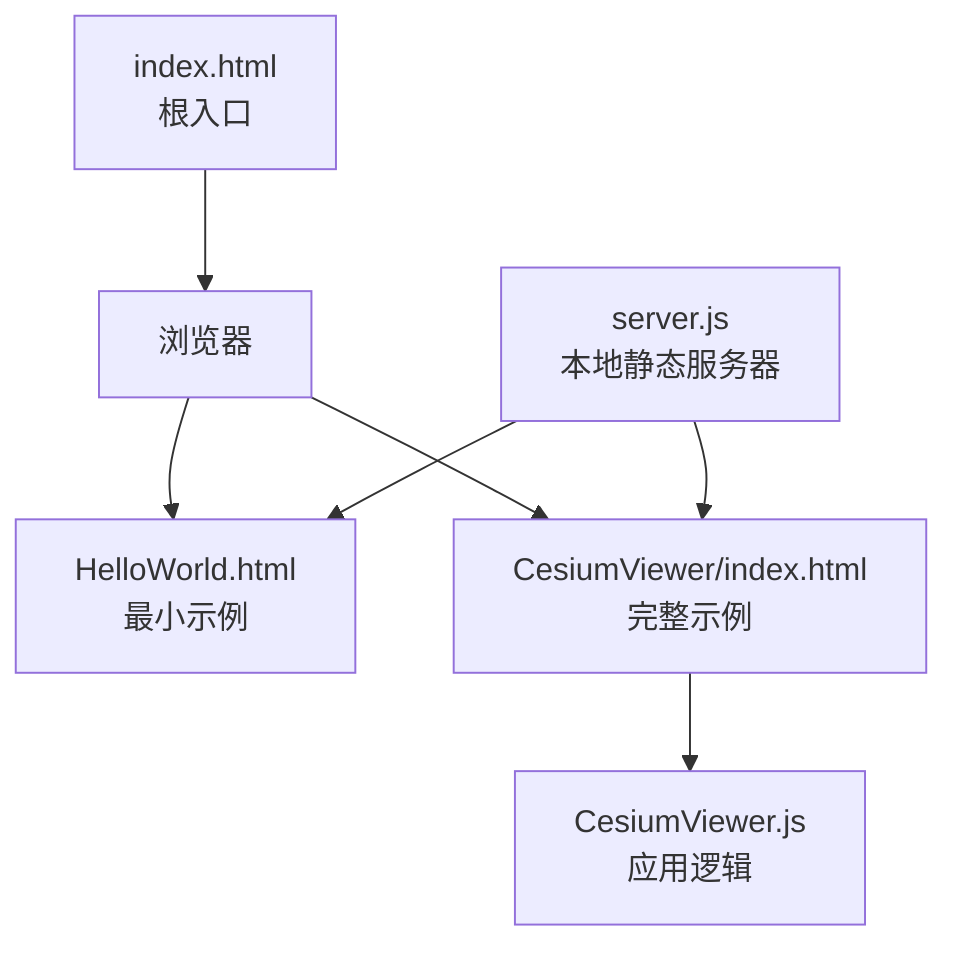
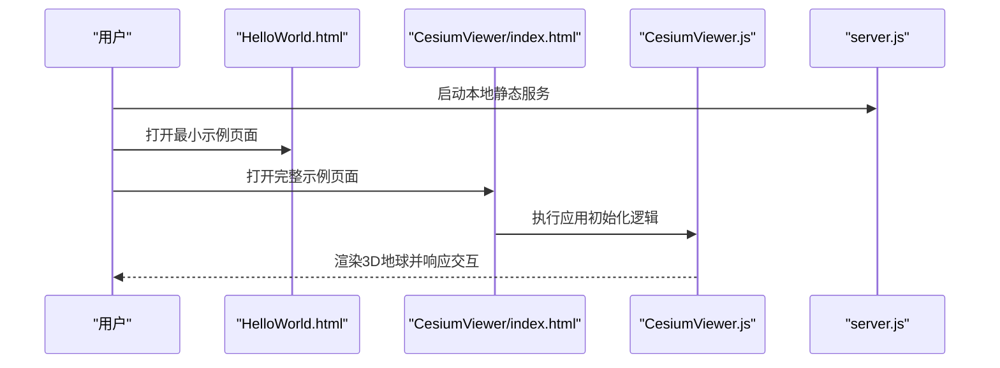
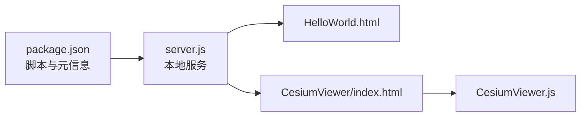

# 快速开始

<cite>
**本文引用的文件**   
- [README.md](file://README.md)
- [package.json](file://package.json)
- [index.html](file://index.html)
- [Apps/HelloWorld.html](file://Apps/HelloWorld.html)
- [Apps/CesiumViewer/index.html](file://Apps/CesiumViewer/index.html)
- [Apps/CesiumViewer/CesiumViewer.js](file://Apps/CesiumViewer/CesiumViewer.js)
- [server.js](file://server.js)
</cite>

## 目录
1. [简介](#简介)
2. [项目结构](#项目结构)
3. [核心组件](#核心组件)
4. [架构总览](#架构总览)
5. [详细组件分析](#详细组件分析)
6. [依赖分析](#依赖分析)
7. [性能考虑](#性能考虑)
8. [故障排除指南](#故障排除指南)
9. [结论](#结论)
10. [附录](#附录)

## 简介
本指南面向希望在10分钟内运行第一个Cesium 3D地球应用的开发者。你将学到：
- 多种安装与引入方式（npm、CDN、本地构建）
- 最简地球初始化步骤与关键配置项说明
- 一个可直接运行的完整示例，包含基础场景、相机控制与数据加载
- 常见问题排查建议

## 项目结构
仓库提供了开箱即用的示例页面与最小化服务脚本，便于快速体验：
- Apps/HelloWorld.html：最简单的入门示例页面
- Apps/CesiumViewer/index.html 与 CesiumViewer.js：更完整的查看器示例
- index.html：仓库根级入口页面
- server.js：用于本地静态资源服务的脚本
- package.json：包管理与脚本定义
- README.md：仓库概览与使用说明

图表来源
- [Apps/HelloWorld.html](file://Apps/HelloWorld.html)
- [Apps/CesiumViewer/index.html](file://Apps/CesiumViewer/index.html)
- [Apps/CesiumViewer/CesiumViewer.js](file://Apps/CesiumViewer/CesiumViewer.js)
- [server.js](file://server.js)
- [index.html](file://index.html)

章节来源
- [README.md](file://README.md)
- [package.json](file://package.json)
- [index.html](file://index.html)
- [Apps/HelloWorld.html](file://Apps/HelloWorld.html)
- [Apps/CesiumViewer/index.html](file://Apps/CesiumViewer/index.html)
- [Apps/CesiumViewer/CesiumViewer.js](file://Apps/CesiumViewer/CesiumViewer.js)
- [server.js](file://server.js)

## 核心组件
- Viewer（查看器）：封装了Scene、Camera、Canvas、控件等，是创建3D地球的最常用入口。
- Scene（场景）：负责渲染管线、光照、材质、实体与图层的绘制。
- Camera（相机）：提供视角控制、飞行与导航交互。
- ImageryProvider（影像提供者）：加载底图瓦片或自定义影像源。
- TerrainProvider（地形提供者）：加载地形高程数据。
- Entity/DataSource（实体/数据源）：以声明式方式添加点、线、面、模型、轨迹等。

章节来源
- [Apps/CesiumViewer/CesiumViewer.js](file://Apps/CesiumViewer/CesiumViewer.js)
- [Apps/CesiumViewer/index.html](file://Apps/CesiumViewer/index.html)

## 架构总览
下图展示了“浏览器—示例页面—Cesium引擎”的调用关系与数据流向。

图表来源
- [Apps/HelloWorld.html](file://Apps/HelloWorld.html)
- [Apps/CesiumViewer/index.html](file://Apps/CesiumViewer/index.html)
- [Apps/CesiumViewer/CesiumViewer.js](file://Apps/CesiumViewer/CesiumViewer.js)
- [server.js](file://server.js)

## 详细组件分析

### 最小示例：HelloWorld
- 作用：在单个HTML文件中引入Cesium资源，创建一个默认地球，具备鼠标拖拽、滚轮缩放等基础交互。
- 关键点：
  - 通过CDN或本地路径引入Cesium样式与脚本
  - 在页面中放置一个容器元素（如div）
  - 初始化Viewer并挂载到容器
- 适用场景：快速验证环境、学习API、演示概念

章节来源
- [Apps/HelloWorld.html](file://Apps/HelloWorld.html)

### 完整示例：CesiumViewer
- 作用：展示更贴近真实项目的结构，包含HTML模板与独立JS逻辑文件。
- 关键点：
  - HTML中引入样式与脚本，准备容器
  - JS中创建Viewer、配置基础选项、加载示例数据
  - 可结合本地服务避免跨域问题
- 适用场景：作为项目脚手架、扩展功能的基础

章节来源
- [Apps/CesiumViewer/index.html](file://Apps/CesiumViewer/index.html)
- [Apps/CesiumViewer/CesiumViewer.js](file://Apps/CesiumViewer/CesiumViewer.js)

### 本地开发服务器
- 作用：提供静态文件服务，解决直接打开HTML时的跨域与资源加载问题。
- 使用方式：在项目根目录运行服务脚本后，通过浏览器访问对应页面。

章节来源
- [server.js](file://server.js)

## 依赖分析
- 运行时依赖：浏览器WebGL能力、Cesium库（样式与脚本）
- 开发期依赖：Node.js与包管理器（用于本地构建与服务）
- 示例依赖：仓库内置的静态资源与示例数据

图表来源
- [package.json](file://package.json)
- [server.js](file://server.js)
- [Apps/HelloWorld.html](file://Apps/HelloWorld.html)
- [Apps/CesiumViewer/index.html](file://Apps/CesiumViewer/index.html)
- [Apps/CesiumViewer/CesiumViewer.js](file://Apps/CesiumViewer/CesiumViewer.js)

章节来源
- [package.json](file://package.json)
- [server.js](file://server.js)

## 性能考虑
- 优先使用按需加载与CDN缓存，减少首屏时间
- 合理设置初始视口与LOD，避免一次性加载过多数据
- 对大数据集采用分层/分块加载策略（如3D Tiles）
- 关闭不必要的特效（阴影、大气、反射等）以提升低端设备性能

[本节为通用指导，不直接分析具体文件]

## 故障排除指南
- 无法显示地图或黑屏
  - 检查浏览器是否支持WebGL
  - 确认网络能访问Cesium CDN或本地资源路径正确
- 跨域错误
  - 不要直接双击打开HTML，使用本地静态服务器
  - 确保请求的资源域名与页面一致或使用正确的CORS配置
- 资源加载失败
  - 检查控制台网络面板，确认样式与脚本URL可达
  - 若使用本地构建产物，核对输出目录与引用路径
- 示例页面空白
  - 确认容器元素存在且尺寸非零
  - 检查初始化代码是否在DOM就绪后执行

章节来源
- [Apps/HelloWorld.html](file://Apps/HelloWorld.html)
- [Apps/CesiumViewer/index.html](file://Apps/CesiumViewer/index.html)
- [Apps/CesiumViewer/CesiumViewer.js](file://Apps/CesiumViewer/CesiumViewer.js)
- [server.js](file://server.js)

## 结论
通过以上步骤，你可以在10分钟内完成从安装到运行第一个Cesium 3D地球应用的全过程。建议以HelloWorld为起点，逐步迁移到CesiumViewer的结构，再按需扩展影像、地形、实体与交互。

[本节为总结性内容，不直接分析具体文件]

## 附录

### 安装与引入方式
- npm安装
  - 在项目中安装Cesium包，并在构建流程中引入其样式与脚本
  - 参考仓库的包管理配置与脚本定义
- CDN引入
  - 在HTML中通过CDN链接引入Cesium样式与脚本
  - 适合快速原型与无需本地构建的场景
- 本地构建
  - 根据仓库文档进行构建，生成发布产物
  - 将构建产物部署到静态服务器后访问

章节来源
- [README.md](file://README.md)
- [package.json](file://package.json)

### 第一个完整应用清单
- 准备容器元素
- 引入Cesium样式与脚本（CDN或本地）
- 初始化Viewer并挂载到容器
- 可选：设置初始位置、启用控件、加载示例数据
- 使用本地静态服务器运行页面

章节来源
- [Apps/HelloWorld.html](file://Apps/HelloWorld.html)
- [Apps/CesiumViewer/index.html](file://Apps/CesiumViewer/index.html)
- [Apps/CesiumViewer/CesiumViewer.js](file://Apps/CesiumViewer/CesiumViewer.js)
- [server.js](file://server.js)