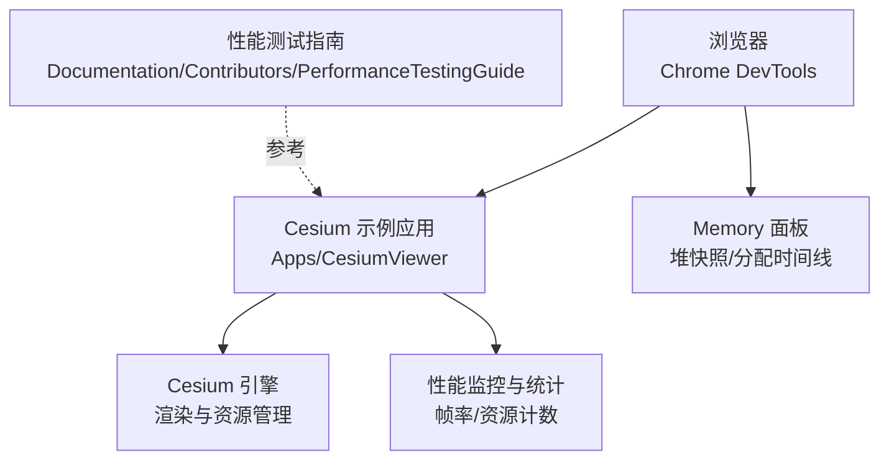
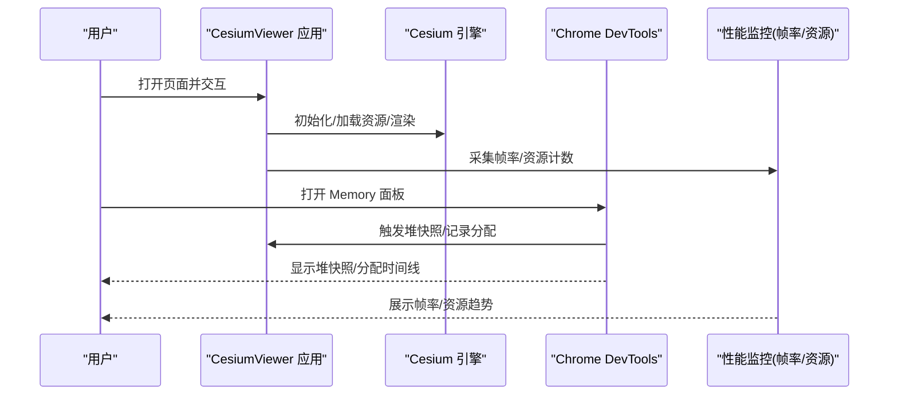
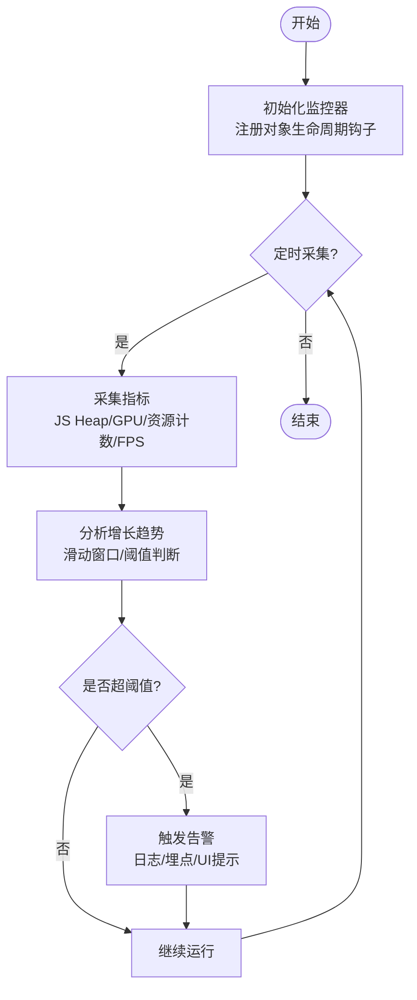
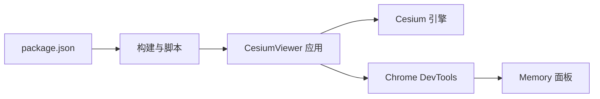

# 内存监控与分析

<cite>
**本文引用的文件**   
- [README.md](file://README.md)
- [PerformanceTestingGuide/README.md](file://Documentation/Contributors/PerformanceTestingGuide/README.md)
- [CesiumViewer.js](file://Apps/CesiumViewer/CesiumViewer.js)
- [index.html](file://Apps/CesiumViewer/index.html)
- [package.json](file://package.json)
</cite>

## 目录
1. [简介](#简介)
2. [项目结构](#项目结构)
3. [核心组件](#核心组件)
4. [架构总览](#架构总览)
5. [详细组件分析](#详细组件分析)
6. [依赖关系分析](#依赖关系分析)
7. [性能考虑](#性能考虑)
8. [故障排查指南](#故障排查指南)
9. [结论](#结论)
10. [附录](#附录)

## 简介
本指南面向在浏览器中运行 Cesium 的开发者，聚焦“内存监控与分析”的实用方法。内容涵盖：
- 使用 Chrome DevTools Memory 面板进行堆快照对比与分配时间线分析
- Cesium 内置性能监控工具（如帧率、资源统计）的使用要点
- 自定义内存监控指标的实现思路（关键对象引用跟踪、增长检测与健康度评估）
- 常见内存问题的诊断流程（泄漏定位、瓶颈分析、优化验证）
- 实际项目中的优化案例与最佳实践总结

## 项目结构
仓库包含示例应用与文档，便于快速上手与复现问题：
- Apps/CesiumViewer：最小可运行的 Cesium 示例应用，适合挂载调试与采集数据
- Documentation/Contributors/PerformanceTestingGuide：贡献者性能测试指南，提供性能相关方法论
- package.json：构建与脚本入口，便于集成自动化测试与报告

图表来源
- [CesiumViewer.js](file://Apps/CesiumViewer/CesiumViewer.js)
- [index.html](file://Apps/CesiumViewer/index.html)
- [PerformanceTestingGuide/README.md](file://Documentation/Contributors/PerformanceTestingGuide/README.md)

章节来源
- [README.md](file://README.md)
- [PerformanceTestingGuide/README.md](file://Documentation/Contributors/PerformanceTestingGuide/README.md)
- [CesiumViewer.js](file://Apps/CesiumViewer/CesiumViewer.js)
- [index.html](file://Apps/CesiumViewer/index.html)

## 核心组件
- 示例应用（CesiumViewer）
  - 作用：初始化 Cesium Viewer、加载基础图层与示例数据，作为内存分析的承载载体
  - 关键点：页面生命周期内创建/销毁的对象（Viewer、Tileset、DataSource、纹理等）是内存分析的重点
- 性能测试指南
  - 作用：定义性能测试策略、基准场景与回归检查建议
  - 关键点：将内存指标纳入持续集成或手动回归流程，确保优化效果可量化
- 构建与脚本（package.json）
  - 作用：提供本地开发、打包与运行脚本，便于在不同环境下复现与对比

章节来源
- [CesiumViewer.js](file://Apps/CesiumViewer/CesiumViewer.js)
- [index.html](file://Apps/CesiumViewer/index.html)
- [PerformanceTestingGuide/README.md](file://Documentation/Contributors/PerformanceTestingGuide/README.md)
- [package.json](file://package.json)

## 架构总览
下图展示从用户操作到内存数据采集与可视化的整体链路：

图表来源
- [CesiumViewer.js](file://Apps/CesiumViewer/CesiumViewer.js)
- [index.html](file://Apps/CesiumViewer/index.html)

## 详细组件分析

### 使用 Chrome DevTools Memory 面板
- 堆快照对比（Heap Snapshot Diff）
  - 操作步骤：在两个时间点分别拍摄堆快照，选择“Comparison”视图，按“Detached DOM nodes”“JS Heap”“Shallow Size”排序，定位新增对象与残留引用
  - 关注点：长生命周期对象（Viewer、Tileset、DataSource、纹理、事件监听器）是否被意外持有
- 分配时间线（Allocation Timeline）
  - 操作步骤：开启“Record heap allocations”，执行典型业务路径后停止录制，查看分配热点与调用栈
  - 关注点：高频分配的大对象（几何体、纹理、数组缓冲）、循环分配未释放的场景
- 采样与基线
  - 建议在相同设备与网络条件下采集，固定初始状态（关闭无关标签页、禁用扩展），建立基线用于回归对比

章节来源
- [CesiumViewer.js](file://Apps/CesiumViewer/CesiumViewer.js)
- [index.html](file://Apps/CesiumViewer/index.html)

### Cesium 内置性能监控与统计
- 帧率监控
  - 通过 Viewer 的性能统计接口获取 FPS 与绘制开销信息，结合 DevTools 的 Performance 面板观察主线程耗时
- 资源使用统计
  - 关注纹理、几何体、瓦片集等资源数量与大小变化，配合 Memory 面板确认是否存在持续增长
- 报警机制
  - 当 FPS 低于阈值或资源占用超过上限时，可在应用层触发告警（控制台输出、UI 提示或上报埋点）

章节来源
- [CesiumViewer.js](file://Apps/CesiumViewer/CesiumViewer.js)

### 自定义内存监控指标
- 关键对象引用跟踪
  - 维护一个弱引用集合或计数器，记录关键对象（Viewer、Tileset、DataSource、纹理、事件回调）的创建与销毁
  - 在对象销毁钩子中减少计数，避免强引用导致无法回收
- 内存增长检测
  - 周期性读取 JS Heap 大小与 GPU 资源占用，计算单位时间增量；若连续 N 次超过阈值则判定为异常增长
- 健康度评估
  - 综合指标：FPS、JS Heap 增长率、GPU 内存峰值、活跃资源数、事件监听器数量
  - 评分模型：对各项指标加权打分，输出健康分并设置告警阈值

[此图为概念流程图，无需源码映射]

### 常见内存问题诊断流程
- 内存泄漏定位
  - 步骤：在典型操作前后拍两次堆快照，比较差异；优先检查 Detached DOM nodes、闭包持有、全局变量、事件监听器未移除
  - 针对 Cesium：重点检查 Tileset、DataSource、Material、Texture、Primitive 的显式释放
- 性能瓶颈分析
  - 步骤：使用 Performance 面板录制交互过程，识别长任务与频繁 GC；结合 Allocation Timeline 定位热点分配
- 优化效果验证
  - 步骤：在相同场景下重复采集，对比 Heap 增长曲线与 FPS 分布，确认优化有效且无回归

章节来源
- [PerformanceTestingGuide/README.md](file://Documentation/Contributors/PerformanceTestingGuide/README.md)
- [CesiumViewer.js](file://Apps/CesiumViewer/CesiumViewer.js)

### 实际项目中的优化案例与最佳实践
- 案例一：动态加载与卸载 3D Tiles
  - 现象：长时间浏览后内存持续增长
  - 处理：在离开区域或切换场景时主动销毁不再使用的 Tileset 与关联资源；复用共享纹理与材质
- 案例二：大数据量点云渲染
  - 现象：高负载下帧率下降与内存尖峰
  - 处理：降低可见 LOD、启用 Draco 压缩、分批加载与按需更新；限制同时活跃的缓冲区数量
- 案例三：事件与回调泄漏
  - 现象：页面跳转后仍有对象存活
  - 处理：统一事件总线管理，组件销毁时移除所有监听器；避免匿名函数持有外部上下文

章节来源
- [PerformanceTestingGuide/README.md](file://Documentation/Contributors/PerformanceTestingGuide/README.md)
- [CesiumViewer.js](file://Apps/CesiumViewer/CesiumViewer.js)

## 依赖关系分析
- 示例应用依赖 Cesium 引擎与浏览器环境
- 性能监控与内存分析依赖 DevTools 与浏览器 API
- 构建脚本与包管理提供开发与测试基础设施

图表来源
- [package.json](file://package.json)
- [CesiumViewer.js](file://Apps/CesiumViewer/CesiumViewer.js)
- [index.html](file://Apps/CesiumViewer/index.html)

章节来源
- [package.json](file://package.json)
- [CesiumViewer.js](file://Apps/CesiumViewer/CesiumViewer.js)
- [index.html](file://Apps/CesiumViewer/index.html)

## 性能考虑
- 控制并发与批处理：避免一次性创建大量大对象，采用队列与节流
- 资源复用与池化：纹理、几何体、缓冲区尽量复用，减少分配抖动
- 合理 LOD 与视锥剔除：仅加载与渲染必要细节，降低内存与 GPU 压力
- 定期清理与边界检查：在路由切换、场景切换时主动释放资源，防止累积
- 监控与回归：将内存与帧率指标纳入日常测试，发现回归及时修复

[本节为通用指导，不直接分析具体文件]

## 故障排查指南
- 快速定位
  - 使用 Allocation Timeline 捕获异常分配热点，结合调用栈定位代码位置
  - 使用 Heap Snapshot 对比，筛选“Detached DOM nodes”和“JS Heap”差异
- 常见问题清单
  - 事件监听器未移除
  - 全局变量或闭包持有大对象
  - 未显式销毁 Tileset/DataSource/Texture
  - 频繁创建临时大数组或 Buffer
- 验证与回归
  - 在相同场景下重复采集，确认指标改善且无新泄漏
  - 将关键指标写入测试报告，形成基线与阈值

章节来源
- [PerformanceTestingGuide/README.md](file://Documentation/Contributors/PerformanceTestingGuide/README.md)
- [CesiumViewer.js](file://Apps/CesiumViewer/CesiumViewer.js)

## 结论
通过系统化的内存监控与分析方法，结合 Chrome DevTools 与 Cesium 性能统计，可以在复杂三维场景中稳定地定位与解决内存问题。建议将监控指标纳入日常开发与回归流程，持续优化资源管理与渲染策略，保障用户体验与系统稳定性。

[本节为总结性内容，不直接分析具体文件]

## 附录
- 常用命令与入口
  - 本地运行示例应用：参考 package.json 中的脚本命令
  - 打开 DevTools：F12 或右键“检查”，进入 Memory 与 Performance 面板
- 参考文档
  - 性能测试指南：Documentation/Contributors/PerformanceTestingGuide/README.md

章节来源
- [package.json](file://package.json)
- [PerformanceTestingGuide/README.md](file://Documentation/Contributors/PerformanceTestingGuide/README.md)