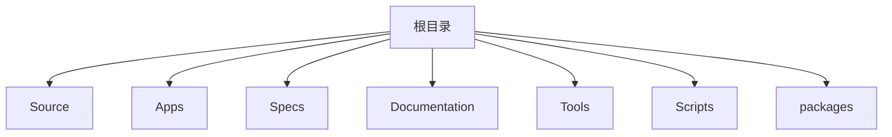
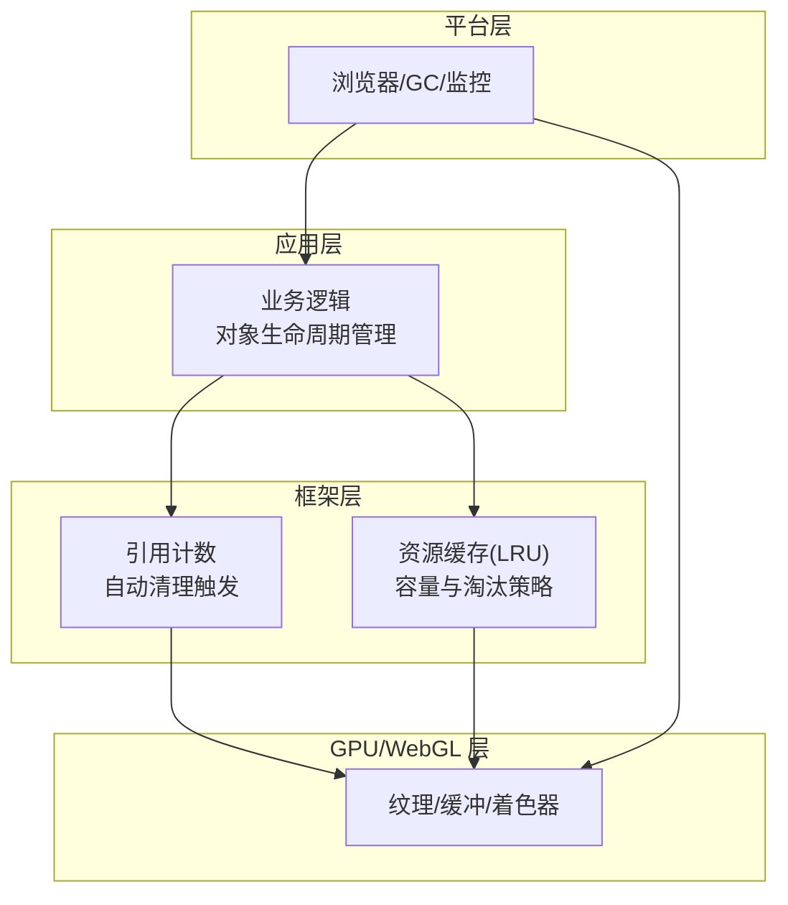
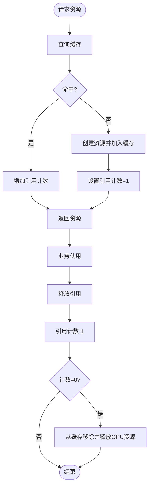
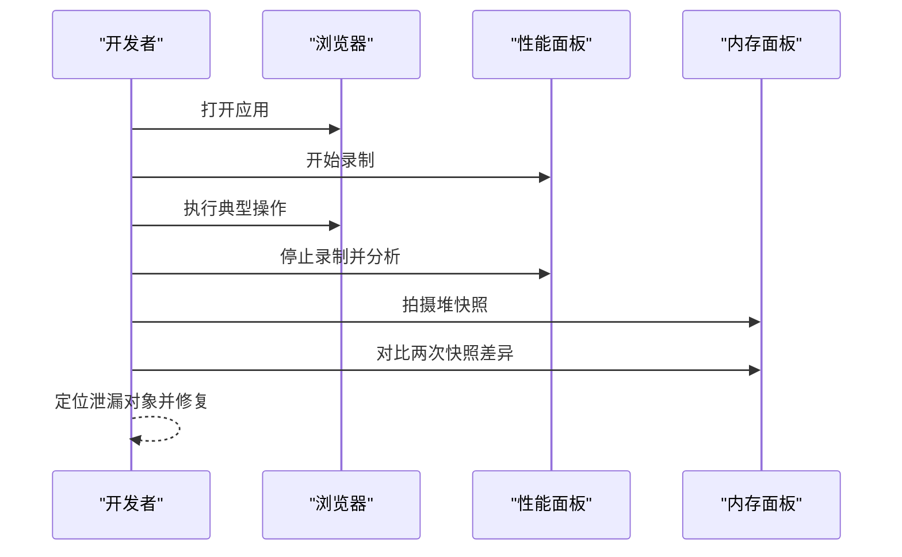
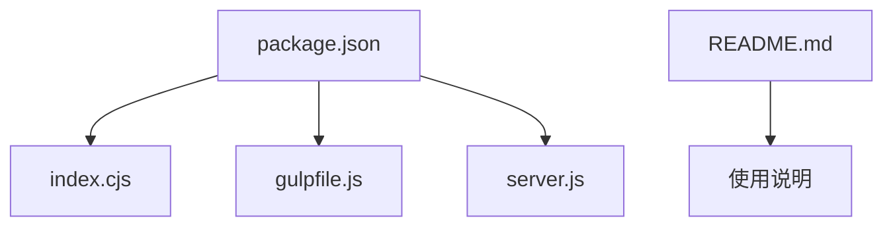

# 内存管理

<cite>
**本文引用的文件**   
- [README.md](file://README.md)
- [index.cjs](file://index.cjs)
- [server.js](file://server.js)
- [gulpfile.js](file://gulpfile.js)
- [package.json](file://package.json)
</cite>

## 目录
1. [简介](#简介)
2. [项目结构](#项目结构)
3. [核心组件](#核心组件)
4. [架构总览](#架构总览)
5. [详细组件分析](#详细组件分析)
6. [依赖关系分析](#依赖关系分析)
7. [性能考量](#性能考量)
8. [故障排查指南](#故障排查指南)
9. [结论](#结论)
10. [附录](#附录)

## 简介
本文件面向使用 Cesium 的开发者，提供一份关于“内存管理”的综合指导。内容涵盖资源缓存系统（LRU、引用计数与自动清理）、垃圾回收最佳实践（对象生命周期、循环引用预防、手动释放）、内存泄漏常见原因与检测方法（事件监听器、定时器、DOM 引用残留），以及纹理与几何体的优化技巧（压缩、实例化、共享资源）。同时给出内存监控工具的使用指南与性能分析案例，帮助识别和解决内存问题。

说明：当前仓库为 Cesium 源码工程，包含示例、测试数据与构建脚本等。由于未直接包含运行时引擎实现细节，本文在涉及具体实现时以概念性说明为主，并在需要处标注“本节不分析具体源文件”。

## 项目结构
该仓库采用多包与示例分离的组织方式：
- Source：Cesium 核心源码入口与版权头
- Apps：示例应用与演示页面
- Specs：测试用例与测试数据
- Documentation：文档与贡献者指南
- Tools：构建与文档生成工具链
- Scripts：构建与打包脚本
- packages：子包（engine、sandcastle、widgets）

[本节为概览性描述，不直接分析具体源文件]

## 核心组件
围绕内存管理的核心关注点包括：
- 资源缓存策略：LRU 淘汰、容量上限、命中/未命中统计
- 引用计数与自动清理：对象创建、持有、释放的生命周期闭环
- 垃圾回收最佳实践：避免循环引用、显式释放、弱引用替代
- 内存泄漏检测：事件监听器、定时器、DOM 引用、WebGL 资源
- 纹理与几何体优化：压缩格式、实例化渲染、共享资源池

[本节为概念性概述，不直接分析具体源文件]

## 架构总览
从应用视角看，Cesium 的内存管理通常由以下层次协作完成：
- 应用层：负责对象的创建、注册、销毁与生命周期管理
- 框架层：提供资源缓存、引用计数、自动清理机制
- GPU/WebGL 层：纹理、缓冲、着色器等资源的分配与释放
- 平台层：浏览器 GC 与内存监控工具

[本节为概念性架构图，不直接映射到具体源文件]

## 详细组件分析

### 资源缓存系统（LRU、引用计数、自动清理）
- LRU 缓存策略
  - 设计目标：在有限内存下最大化热点资源命中率
  - 关键行为：访问更新顺序、达到上限后淘汰最久未使用项
  - 适用场景：纹理、模型、瓦片、材质等高频复用资源
- 引用计数与自动清理
  - 设计目标：当资源不再被任何消费者持有时自动释放
  - 关键行为：创建时计数置一；每次新增引用+1；释放引用-1；归零时触发清理
  - 适用场景：共享纹理、几何体、材质、动画状态机
- 缓存与计数的协同
  - 缓存命中仅增加引用计数，不重复创建
  - 缓存淘汰前检查引用计数，确保无外部引用再释放

[本节为概念流程图，不直接映射到具体源文件]

### 垃圾回收最佳实践
- 对象生命周期管理
  - 明确创建点与销毁点，遵循“谁创建、谁负责销毁”的原则
  - 对长生命周期对象建立集中管理表，便于统一释放
- 循环引用预防
  - 避免父子双向强引用；必要时将一方改为弱引用或事件回调
  - 使用观察者模式时，确保订阅方在合适时机取消订阅
- 手动释放策略
  - 显式调用释放接口（如 dispose/clear/close）
  - 批量释放：在页面切换或模块卸载时统一清理

[本节为通用实践建议，不直接分析具体源文件]

### 内存泄漏常见原因与检测方法
- 事件监听器泄漏
  - 现象：全局或父级对象持有大量回调引用
  - 检测：在浏览器性能面板中观察事件回调数量增长；对比销毁前后引用数
  - 修复：在合适时机 removeEventListener 或取消订阅
- 定时器未清理
  - 现象：setInterval/setTimeout 持续运行导致对象无法回收
  - 检测：Performance/Timeline 查看长时间运行的任务；断点定位
  - 修复：在停止条件满足时 clearTimer
- DOM 引用残留
  - 现象：闭包或全局变量持有已移除节点引用
  - 检测：Memory 快照对比，查找 retained nodes
  - 修复：及时清空引用、解除事件绑定

[本节为通用排查方法，不直接分析具体源文件]

### 纹理与几何体的内存优化技巧
- 纹理压缩
  - 优先使用 GPU 原生压缩格式（如 KTX2/Basis），减少显存占用与带宽
  - 根据设备能力选择合适压缩方案与降级路径
- 几何体实例化
  - 使用实例化渲染批量绘制相同几何体，降低顶点缓冲与 draw call
  - 通过批处理 ID 或属性区分不同实例
- 共享资源使用
  - 纹理、材质、几何体等资源集中管理，多处复用
  - 结合引用计数确保共享安全释放

[本节为通用优化建议，不直接分析具体源文件]

### 内存监控工具与性能分析案例
- 浏览器内置工具
  - Performance：录制时间线，定位长时间运行任务与频繁 GC
  - Memory：Heap Snapshot 对比，查找 retained objects 与 DOM Nodes
  - Network：监控大资源加载与缓存命中情况
- 指标与阈值
  - 关注峰值内存、平均内存、GC 频率与停顿时长
  - 设定基线与告警阈值，回归测试中自动比对
- 分析案例（概念流程）
  - 步骤：打开页面 -> 录制 Performance -> 执行操作 -> 导出快照 -> 对比差异 -> 定位泄漏点 -> 修复验证

[本节为概念序列图，不直接映射到具体源文件]

## 依赖关系分析
从仓库顶层可见的入口与配置如下：
- index.cjs：主入口之一，用于 CommonJS 环境引入
- server.js：本地开发服务器脚本
- gulpfile.js：构建与打包任务定义
- package.json：项目元信息与脚本命令
- README.md：项目说明与快速上手

**图表来源**
- [index.cjs](file://index.cjs)
- [server.js](file://server.js)
- [gulpfile.js](file://gulpfile.js)
- [package.json](file://package.json)
- [README.md](file://README.md)

**章节来源**
- [index.cjs](file://index.cjs)
- [server.js](file://server.js)
- [gulpfile.js](file://gulpfile.js)
- [package.json](file://package.json)
- [README.md](file://README.md)

## 性能考量
- 控制并发加载：限制同时加载的资源数量，避免瞬时峰值内存过高
- 分块与延迟加载：按需加载区域与层级，减少首屏压力
- 资源复用与去重：合并相似纹理与几何体，减少冗余
- 合理设置缓存上限：依据目标设备内存与显存预算调整
- 监控与回归：在 CI 中加入内存快照对比，防止退化

[本节为通用性能建议，不直接分析具体源文件]

## 故障排查指南
- 快速定位
  - 使用 Performance 录制异常时段，寻找 CPU 抖动与频繁 GC
  - 使用 Memory 快照对比，筛选 retained size 增长的对象
- 常见问题清单
  - 事件监听器未移除
  - 定时器未清理
  - DOM 引用未清空
  - WebGL 资源未释放（纹理、缓冲、着色器）
  - 全局变量滥用导致意外保留
- 修复验证
  - 修复后再次录制与快照对比，确认内存曲线回落且稳定

[本节为通用排查建议，不直接分析具体源文件]

## 结论
有效的内存管理需要在应用层、框架层与 GPU 层协同配合：以 LRU 与引用计数为核心，辅以严格的对象生命周期管理与泄漏检测手段，并结合纹理与几何体的优化策略，才能在大规模三维场景中保持稳定的内存与性能表现。建议在项目中建立完善的监控与回归流程，持续发现并消除内存隐患。

[本节为总结性内容，不直接分析具体源文件]

## 附录
- 术语
  - LRU：最近最少使用淘汰策略
  - 引用计数：记录对象被引用的次数，归零时释放
  - 实例化渲染：一次绘制调用渲染多个相同几何体
  - 压缩纹理：GPU 原生支持的压缩格式，降低显存占用
- 参考
  - 浏览器性能与内存面板官方文档
  - glTF/KTX2 相关规范与最佳实践

[本节为补充信息，不直接分析具体源文件]