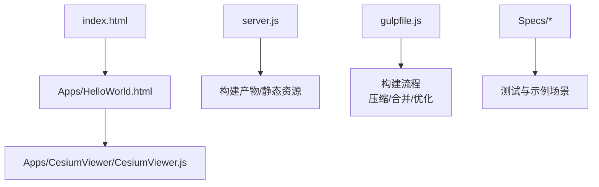
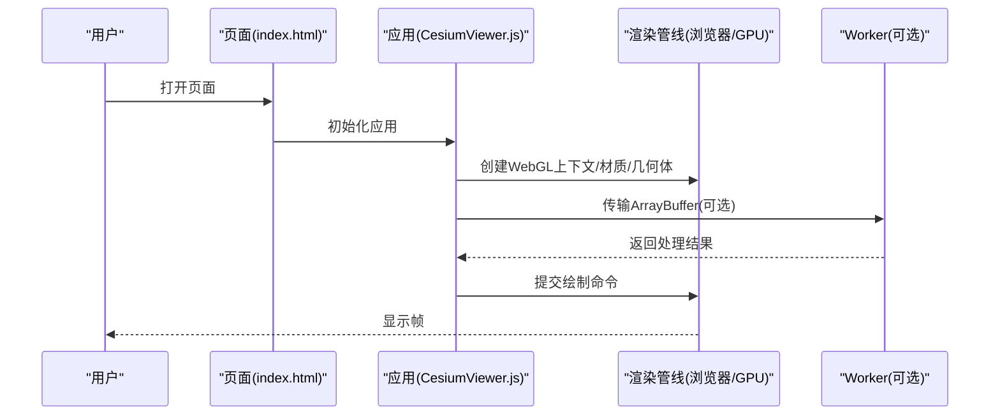
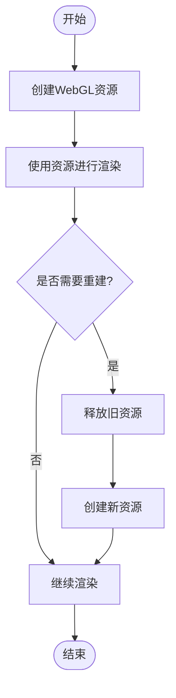
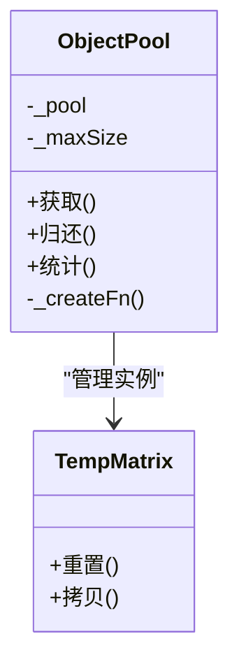
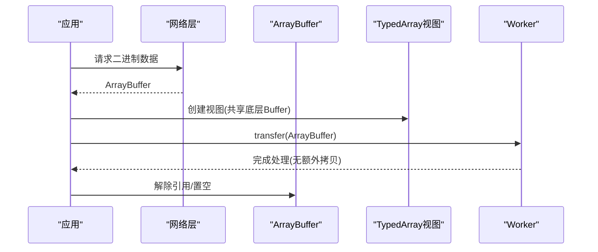
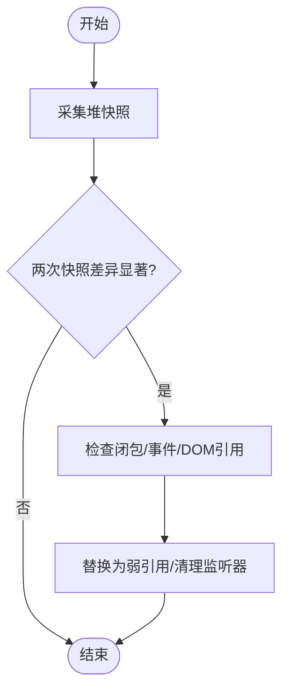
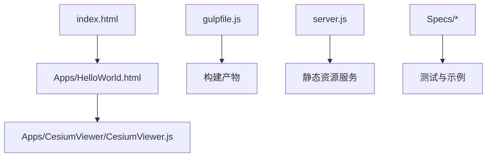

# 垃圾回收优化

<cite>
**本文引用的文件**   
- [README.md](file://README.md)
- [package.json](file://package.json)
- [gulpfile.js](file://gulpfile.js)
- [server.js](file://server.js)
- [index.html](file://index.html)
- [Apps/HelloWorld.html](file://Apps/HelloWorld.html)
- [Apps/CesiumViewer/CesiumViewer.js](file://Apps/CesiumViewer/CesiumViewer.js)
- [Scripts/ContextCache.js](file://scripts/ContextCache.js)
- [Specs/createScene.js](file://Specs/createScene.js)
- [Specs/createCanvas.js](file://Specs/createCanvas.js)
- [Specs/createContext.js](file://Specs/createContext.js)
- [Specs/render.js](file://Specs/render.js)
- [Specs/TestWorkers/transferArrayBuffer.js](file://Specs/TestWorkers/transferArrayBuffer.js)
</cite>

## 目录
1. [简介](#简介)
2. [项目结构](#项目结构)
3. [核心组件](#核心组件)
4. [架构总览](#架构总览)
5. [详细组件分析](#详细组件分析)
6. [依赖关系分析](#依赖关系分析)
7. [性能考量](#性能考量)
8. [故障排查指南](#故障排查指南)
9. [结论](#结论)
10. [附录](#附录) 

## 简介
本指南聚焦于在Cesium等3D图形应用中如何进行JavaScript垃圾回收（GC）优化，重点覆盖以下方面：
- WebGL对象生命周期管理与内存碎片化问题
- ObjectPool对象池模式的使用与最佳实践（复用策略、池大小配置、性能监控）
- 二进制数据加载的内存优化（ArrayBuffer管理、视图共享、及时释放）
- 循环引用检测与预防（弱引用、事件监听器清理、DOM引用管理）
- 实际内存泄漏案例与修复方案

目标读者包括前端工程师、图形开发者与性能调优人员。文档既提供高层概念，也给出可落地的工程建议与可视化流程。

## 项目结构
仓库包含示例应用、构建脚本、测试与工具链。与GC优化密切相关的入口与资源如下：
- 示例页面与应用：用于演示渲染与资源加载场景
- 构建与服务器脚本：影响打包产物体积与运行时行为
- 测试与Worker：涉及ArrayBuffer传输与上下文创建/销毁

图表来源
- [index.html:1-200](file://index.html#L1-L200)
- [Apps/HelloWorld.html:1-200](file://Apps/HelloWorld.html#L1-L200)
- [Apps/CesiumViewer/CesiumViewer.js:1-200](file://Apps/CesiumViewer/CesiumViewer.js#L1-L200)
- [server.js:1-200](file://server.js#L1-L200)
- [gulpfile.js:1-200](file://gulpfile.js#L1-L200)

章节来源
- [README.md:1-200](file://README.md#L1-L200)
- [package.json:1-200](file://package.json#L1-L200)
- [gulpfile.js:1-200](file://gulpfile.js#L1-L200)
- [server.js:1-200](file://server.js#L1-L200)
- [index.html:1-200](file://index.html#L1-L200)
- [Apps/HelloWorld.html:1-200](file://Apps/HelloWorld.html#L1-L200)
- [Apps/CesiumViewer/CesiumViewer.js:1-200](file://Apps/CesiumViewer/CesiumViewer.js#L1-L200)

## 核心组件
- 示例应用与页面：展示典型3D场景初始化、资源加载与渲染流程，便于观察内存占用变化
- 构建与服务器：通过构建优化减少冗余代码与资源，降低GC压力
- 测试与Worker：验证大数据传输与上下文切换时的内存行为

章节来源
- [Apps/CesiumViewer/CesiumViewer.js:1-200](file://Apps/CesiumViewer/CesiumViewer.js#L1-L200)
- [Apps/HelloWorld.html:1-200](file://Apps/HelloWorld.html#L1-L200)
- [gulpfile.js:1-200](file://gulpfile.js#L1-L200)
- [server.js:1-200](file://server.js#L1-L200)

## 架构总览
下图展示了从页面到渲染的关键路径，以及可能产生内存压力的环节（纹理、几何体、缓冲区、事件监听器等）。

图表来源
- [index.html:1-200](file://index.html#L1-L200)
- [Apps/CesiumViewer/CesiumViewer.js:1-200](file://Apps/CesiumViewer/CesiumViewer.js#L1-L200)
- [Specs/TestWorkers/transferArrayBuffer.js:1-200](file://Specs/TestWorkers/transferArrayBuffer.js#L1-L200)

## 详细组件分析

### WebGL对象生命周期与内存碎片化
- 生命周期要点
  - 纹理、缓冲、着色器程序等资源需显式释放或交由框架统一回收
  - 频繁创建/销毁大对象易导致堆碎片化，应结合对象池与批处理
- 常见风险点
  - 未移除的事件监听器持有DOM或对象引用
  - 缓存中保留不再使用的资源引用
  - Worker间传递后仍持有原ArrayBuffer引用

章节来源
- [Specs/createScene.js:1-200](file://Specs/createScene.js#L1-L200)
- [Specs/createCanvas.js:1-200](file://Specs/createCanvas.js#L1-L200)
- [Specs/createContext.js:1-200](file://Specs/createContext.js#L1-L200)
- [Specs/render.js:1-200](file://Specs/render.js#L1-L200)

### ObjectPool对象池模式
- 适用场景
  - 高频创建/销毁的对象（如相机矩阵、向量、临时几何体描述符）
- 设计要点
  - 池容量上限与扩容策略
  - 对象归还与状态重置
  - 线程安全（若跨Worker）
- 监控指标
  - 分配次数、命中率、池内最大深度、平均驻留时间

章节来源
- [Specs/createScene.js:1-200](file://Specs/createScene.js#L1-L200)
- [Specs/render.js:1-200](file://Specs/render.js#L1-L200)

### 二进制数据加载与ArrayBuffer优化
- 关键技巧
  - 优先使用ArrayBuffer并避免不必要的拷贝
  - 使用TypedArray视图共享同一底层Buffer以减少复制
  - 数据处理完成后及时解除引用，必要时转移所有权至Worker
- 注意事项
  - 视图共享时注意并发访问与生命周期一致性
  - 大对象分块处理，避免主线程阻塞

图表来源
- [Specs/TestWorkers/transferArrayBuffer.js:1-200](file://Specs/TestWorkers/transferArrayBuffer.js#L1-L200)

章节来源
- [Specs/TestWorkers/transferArrayBuffer.js:1-200](file://Specs/TestWorkers/transferArrayBuffer.js#L1-L200)

### 循环引用检测与预防
- 检测方法
  - 使用浏览器性能面板的“堆快照”对比，定位增长对象
  - 关注闭包、事件回调、全局缓存中的强引用
- 预防措施
  - 使用WeakMap/WeakRef保存非关键引用
  - 组件销毁时主动解绑事件监听器与定时器
  - DOM节点引用在卸载时清空

章节来源
- [Specs/createScene.js:1-200](file://Specs/createScene.js#L1-L200)
- [Specs/render.js:1-200](file://Specs/render.js#L1-L200)

### 实际内存泄漏案例与修复方案
- 案例一：纹理未及时释放
  - 现象：长时间运行后GPU内存持续增长
  - 修复：在资源切换或场景卸载时显式释放纹理与相关缓冲
- 案例二：事件监听器未移除
  - 现象：页面跳转后仍有回调触发，持有旧对象引用
  - 修复：在组件销毁阶段统一移除所有监听器
- 案例三：ArrayBuffer重复拷贝
  - 现象：CPU峰值高且内存抖动明显
  - 修复：使用视图共享与Worker传输，避免中间拷贝

章节来源
- [Specs/createScene.js:1-200](file://Specs/createScene.js#L1-L200)
- [Specs/render.js:1-200](file://Specs/render.js#L1-L200)
- [Specs/TestWorkers/transferArrayBuffer.js:1-200](file://Specs/TestWorkers/transferArrayBuffer.js#L1-L200)

## 依赖关系分析
- 应用与页面
  - index.html作为入口，加载示例页面与应用逻辑
- 构建与服务器
  - gulpfile.js负责构建流程；server.js提供本地服务
- 测试与示例
  - Specs下提供场景创建、渲染与Worker测试用例

图表来源
- [index.html:1-200](file://index.html#L1-L200)
- [Apps/HelloWorld.html:1-200](file://Apps/HelloWorld.html#L1-L200)
- [Apps/CesiumViewer/CesiumViewer.js:1-200](file://Apps/CesiumViewer/CesiumViewer.js#L1-L200)
- [gulpfile.js:1-200](file://gulpfile.js#L1-L200)
- [server.js:1-200](file://server.js#L1-L200)

章节来源
- [package.json:1-200](file://package.json#L1-L200)
- [gulpfile.js:1-200](file://gulpfile.js#L1-L200)
- [server.js:1-200](file://server.js#L1-L200)

## 性能考量
- 构建期优化
  - 压缩与Tree Shaking减少无用代码，降低初始GC压力
- 运行期优化
  - 对象池减少分配频率
  - 批量更新与延迟计算降低瞬时峰值
  - 合理设置纹理与几何体LOD，控制显存占用
- 监控与度量
  - 使用性能面板记录分配曲线、堆快照与帧耗时
  - 建立回归基线，持续跟踪优化效果

[本节为通用指导，不直接分析具体文件]

## 故障排查指南
- 快速定位
  - 对比不同阶段的堆快照，识别异常增长对象
  - 过滤“Detached DOM nodes”“ArrayBuffer”“ImageBitmap”等类别
- 常见根因
  - 未清理的全局缓存与单例
  - 长生命周期对象持有短生命周期对象引用
  - 事件总线未解绑导致的隐式引用
- 修复步骤
  - 明确对象生命周期边界，集中释放
  - 引入弱引用替代非必要强引用
  - 对大数据采用分片与异步处理

章节来源
- [Specs/createScene.js:1-200](file://Specs/createScene.js#L1-L200)
- [Specs/render.js:1-200](file://Specs/render.js#L1-L200)

## 结论
在3D图形应用中，GC优化的关键在于：
- 明确资源生命周期，避免长期持有短期对象
- 使用对象池与批处理降低分配抖动
- 合理使用ArrayBuffer与视图共享，减少拷贝
- 系统性地检测和预防循环引用
- 以构建与运行期双管齐下的方式持续监控与改进

[本节为总结性内容，不直接分析具体文件]

## 附录
- 术语
  - GC：垃圾回收
  - LOD：细节层次
  - TypedArray：类型化数组视图
- 参考入口
  - 示例页面与应用：用于复现与验证优化策略
  - 测试与Worker：验证大数据传输与上下文行为

[本节为补充信息，不直接分析具体文件]