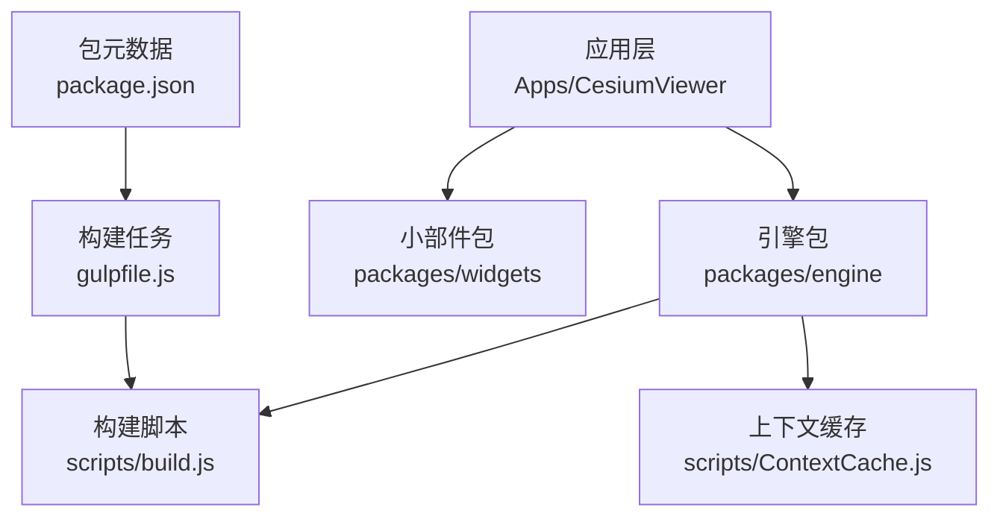
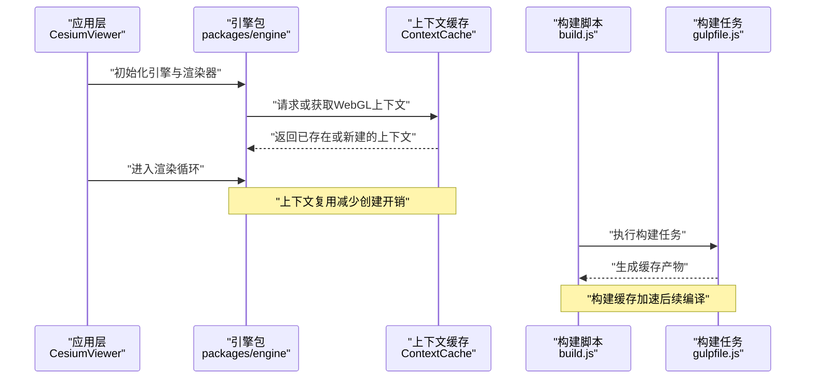
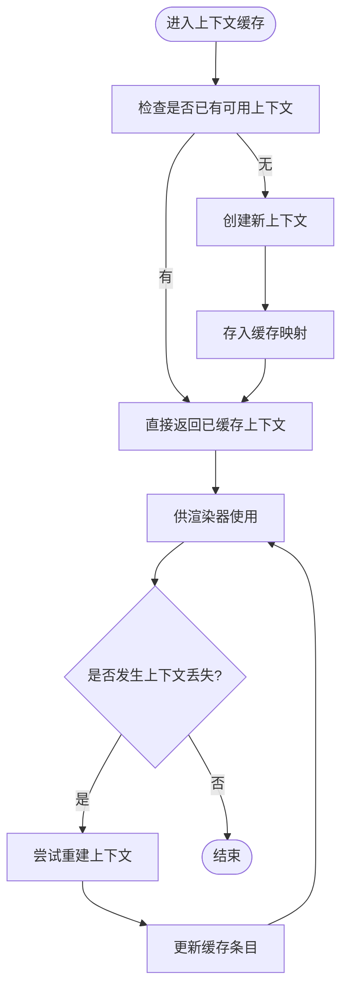
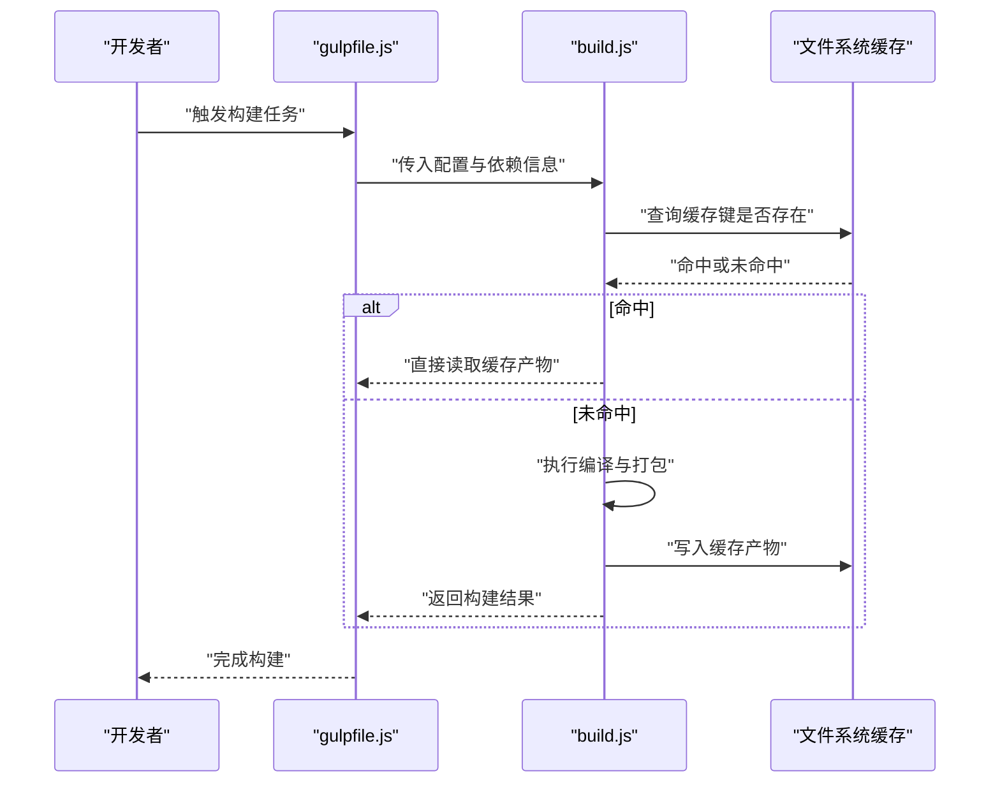
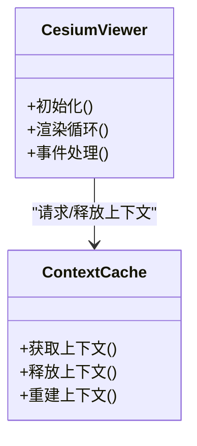
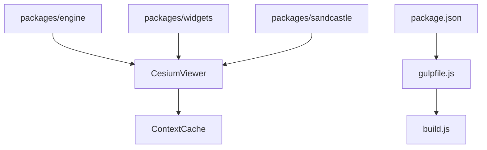

# 性能缓存系统

<cite>
**本文引用的文件**   
- [README.md](file://README.md)
- [package.json](file://package.json)
- [gulpfile.js](file://gulpfile.js)
- [scripts/ContextCache.js](file://scripts/ContextCache.js)
- [Source/copyrightHeader.js](file://Source/copyrightHeader.js)
- [Apps/CesiumViewer/CesiumViewer.js](file://Apps/CesiumViewer/CesiumViewer.js)
- [Apps/CesiumViewer/index.html](file://Apps/CesiumViewer/index.html)
- [Scripts/build.js](file://scripts/build.js)
- [packages/engine/package.json](file://packages/engine/package.json)
- [packages/widgets/package.json](file://packages/widgets/package.json)
- [packages/sandcastle/package.json](file://packages/sandcastle/package.json)
</cite>

## 目录
1. [简介](#简介)
2. [项目结构](#项目结构)
3. [核心组件](#核心组件)
4. [架构总览](#架构总览)
5. [详细组件分析](#详细组件分析)
6. [依赖关系分析](#依赖关系分析)
7. [性能考量](#性能考量)
8. [故障排查指南](#故障排查指南)
9. [结论](#结论)
10. [附录](#附录)

## 简介
本文件围绕 Cesium 代码库中的“性能缓存系统”进行系统化梳理，重点聚焦于 WebGL 上下文缓存与构建期资源缓存策略。通过解析关键脚本与入口配置，说明缓存的触发时机、生命周期管理、失效策略以及与渲染管线和构建流程的集成方式，帮助读者在不深入源码细节的前提下理解整体设计与优化要点。

## 项目结构
Cesium 仓库采用多包（packages）与示例应用（Apps）并行的组织方式：
- packages/engine、packages/widgets、packages/sandcastle 等子包提供核心能力与工具；
- Apps/CesiumViewer 为演示应用，展示如何加载引擎与使用缓存相关能力；
- scripts 目录包含构建与运行时辅助脚本，其中 ContextCache.js 是 WebGL 上下文缓存的关键实现之一；
- gulpfile.js 与 package.json 定义构建任务与依赖关系，影响资源打包与缓存策略。

图表来源
- [Apps/CesiumViewer/CesiumViewer.js](file://Apps/CesiumViewer/CesiumViewer.js)
- [scripts/ContextCache.js](file://scripts/ContextCache.js)
- [scripts/build.js](file://scripts/build.js)
- [gulpfile.js](file://gulpfile.js)
- [package.json](file://package.json)

章节来源
- [README.md](file://README.md)
- [package.json](file://package.json)
- [gulpfile.js](file://gulpfile.js)

## 核心组件
- WebGL 上下文缓存（ContextCache）
  - 负责复用或限制 WebGL 上下文实例，避免重复创建带来的开销；
  - 在页面初始化或首次渲染前建立缓存，并在必要时清理或重建；
  - 与沙箱环境、测试框架及调试工具协同工作，确保上下文隔离与可恢复性。
- 构建期资源缓存与产物管理
  - 通过构建脚本对中间产物与最终包进行缓存，减少重复编译与打包时间；
  - 结合包元数据与任务编排，控制增量构建与依赖更新时的缓存命中。

章节来源
- [scripts/ContextCache.js](file://scripts/ContextCache.js)
- [scripts/build.js](file://scripts/build.js)
- [gulpfile.js](file://gulpfile.js)
- [package.json](file://package.json)

## 架构总览
下图展示了从应用启动到渲染主循环中，上下文缓存与构建缓存的协作关系。应用层加载引擎与小部件，构建阶段产出可缓存的包；运行期由上下文缓存统一管理 WebGL 上下文的生命周期，提升渲染稳定性与性能。

图表来源
- [Apps/CesiumViewer/CesiumViewer.js](file://Apps/CesiumViewer/CesiumViewer.js)
- [scripts/ContextCache.js](file://scripts/ContextCache.js)
- [scripts/build.js](file://scripts/build.js)
- [gulpfile.js](file://gulpfile.js)

## 详细组件分析

### WebGL 上下文缓存（ContextCache）
- 职责
  - 维护全局或作用域内的上下文实例映射；
  - 根据配置决定上下文数量上限、共享策略与销毁时机；
  - 处理上下文丢失事件，尝试恢复或重建。
- 关键行为
  - 初始化时检查是否存在可用上下文，若不存在则创建；
  - 在测试或沙箱环境中隔离上下文，避免污染；
  - 在页面卸载或模块销毁时释放资源，防止内存泄漏。
- 复杂度与性能
  - 查找与插入操作通常为 O(1)（哈希表）；
  - 上下文创建与销毁成本较高，应尽量避免频繁切换；
  - 合理设置最大上下文数，平衡内存占用与并发需求。

图表来源
- [scripts/ContextCache.js](file://scripts/ContextCache.js)

章节来源
- [scripts/ContextCache.js](file://scripts/ContextCache.js)

### 构建期资源缓存（build.js 与 gulpfile.js）
- 职责
  - 编排构建任务，生成可缓存的中间产物与最终包；
  - 依据输入变更与依赖图决定是否命中缓存；
  - 输出稳定的文件名或内容哈希，便于浏览器与服务端缓存。
- 关键行为
  - 读取包元数据（package.json）确定依赖版本与入口；
  - 执行编译、合并、压缩等步骤，并将结果写入缓存目录；
  - 在 CI 或本地开发中利用缓存缩短构建时间。
- 复杂度与性能
  - 增量构建依赖输入指纹与依赖图，命中率越高构建越快；
  - 合理的缓存键设计能避免误命中与脏读；
  - 大文件与并行任务需权衡 I/O 与 CPU 使用。

图表来源
- [scripts/build.js](file://scripts/build.js)
- [gulpfile.js](file://gulpfile.js)

章节来源
- [scripts/build.js](file://scripts/build.js)
- [gulpfile.js](file://gulpfile.js)
- [package.json](file://package.json)

### 应用层集成（CesiumViewer）
- 职责
  - 加载引擎与小部件，初始化场景与渲染器；
  - 在初始化阶段与上下文缓存交互，确保获得可用的 WebGL 上下文；
  - 处理用户交互与资源加载，配合缓存机制减少重复开销。
- 关键行为
  - 页面加载后创建 Viewer 实例；
  - 绑定事件回调，按需刷新或重建上下文；
  - 与沙箱或测试框架集成，保证上下文隔离。

图表来源
- [Apps/CesiumViewer/CesiumViewer.js](file://Apps/CesiumViewer/CesiumViewer.js)
- [scripts/ContextCache.js](file://scripts/ContextCache.js)

章节来源
- [Apps/CesiumViewer/CesiumViewer.js](file://Apps/CesiumViewer/CesiumViewer.js)
- [Apps/CesiumViewer/index.html](file://Apps/CesiumViewer/index.html)

## 依赖关系分析
- 包依赖
  - packages/engine、packages/widgets、packages/sandcastle 各自声明依赖与入口；
  - 应用层依赖这些包，并通过构建脚本统一打包。
- 构建依赖
  - gulpfile.js 编排任务，调用 build.js 执行具体构建逻辑；
  - package.json 提供版本与脚本命令，驱动构建与发布流程。
- 运行时依赖
  - CesiumViewer 依赖引擎与小部件，间接依赖上下文缓存；
  - 上下文缓存依赖底层 WebGL API 与浏览器环境。

图表来源
- [packages/engine/package.json](file://packages/engine/package.json)
- [packages/widgets/package.json](file://packages/widgets/package.json)
- [packages/sandcastle/package.json](file://packages/sandcastle/package.json)
- [gulpfile.js](file://gulpfile.js)
- [scripts/build.js](file://scripts/build.js)
- [package.json](file://package.json)
- [Apps/CesiumViewer/CesiumViewer.js](file://Apps/CesiumViewer/CesiumViewer.js)
- [scripts/ContextCache.js](file://scripts/ContextCache.js)

章节来源
- [packages/engine/package.json](file://packages/engine/package.json)
- [packages/widgets/package.json](file://packages/widgets/package.json)
- [packages/sandcastle/package.json](file://packages/sandcastle/package.json)
- [gulpfile.js](file://gulpfile.js)
- [scripts/build.js](file://scripts/build.js)
- [package.json](file://package.json)
- [Apps/CesiumViewer/CesiumViewer.js](file://Apps/CesiumViewer/CesiumViewer.js)
- [scripts/ContextCache.js](file://scripts/ContextCache.js)

## 性能考量
- 上下文缓存
  - 减少 WebGL 上下文创建与销毁次数，降低 GPU 驱动开销；
  - 合理设置最大上下文数，避免内存占用过高；
  - 处理上下文丢失事件，保障渲染连续性。
- 构建缓存
  - 使用稳定缓存键，提高命中率；
  - 增量构建仅重算变更部分，缩短冷启动时间；
  - 并行化任务与 I/O 操作，充分利用多核 CPU。
- 资源加载
  - 对纹理、模型等大资源启用浏览器缓存与服务端缓存；
  - 按需加载与懒加载，减少首屏压力。

[本节为通用指导，不直接分析具体文件]

## 故障排查指南
- 常见问题
  - 上下文丢失导致渲染黑屏或崩溃；
  - 构建缓存命中异常，出现旧代码或依赖不一致；
  - 多标签页或多窗口下上下文冲突。
- 排查步骤
  - 检查上下文缓存日志与状态，确认是否成功重建；
  - 清理构建缓存目录，重新执行构建任务；
  - 验证浏览器兼容性设置与 WebGL 支持情况。
- 修复建议
  - 增加上下文恢复重试次数与超时阈值；
  - 使用内容哈希文件名，避免缓存污染；
  - 在沙箱或 Worker 中隔离上下文，避免相互干扰。

章节来源
- [scripts/ContextCache.js](file://scripts/ContextCache.js)
- [scripts/build.js](file://scripts/build.js)
- [gulpfile.js](file://gulpfile.js)

## 结论
Cesium 的性能缓存系统通过 WebGL 上下文缓存与构建期资源缓存两大支柱，显著提升了渲染稳定性与开发效率。上下文缓存减少了昂贵的 GPU 上下文创建开销，构建缓存加速了迭代与发布流程。合理配置与监控这两类缓存，能够在复杂应用中保持高性能与低延迟。

[本节为总结性内容，不直接分析具体文件]

## 附录
- 相关文件路径
  - 上下文缓存实现：scripts/ContextCache.js
  - 构建脚本：scripts/build.js
  - 构建任务：gulpfile.js
  - 包元数据：package.json、packages/*/package.json
  - 应用入口：Apps/CesiumViewer/CesiumViewer.js、Apps/CesiumViewer/index.html
  - 版权头模板：Source/copyrightHeader.js

章节来源
- [scripts/ContextCache.js](file://scripts/ContextCache.js)
- [scripts/build.js](file://scripts/build.js)
- [gulpfile.js](file://gulpfile.js)
- [package.json](file://package.json)
- [packages/engine/package.json](file://packages/engine/package.json)
- [packages/widgets/package.json](file://packages/widgets/package.json)
- [packages/sandcastle/package.json](file://packages/sandcastle/package.json)
- [Apps/CesiumViewer/CesiumViewer.js](file://Apps/CesiumViewer/CesiumViewer.js)
- [Apps/CesiumViewer/index.html](file://Apps/CesiumViewer/index.html)
- [Source/copyrightHeader.js](file://Source/copyrightHeader.js)