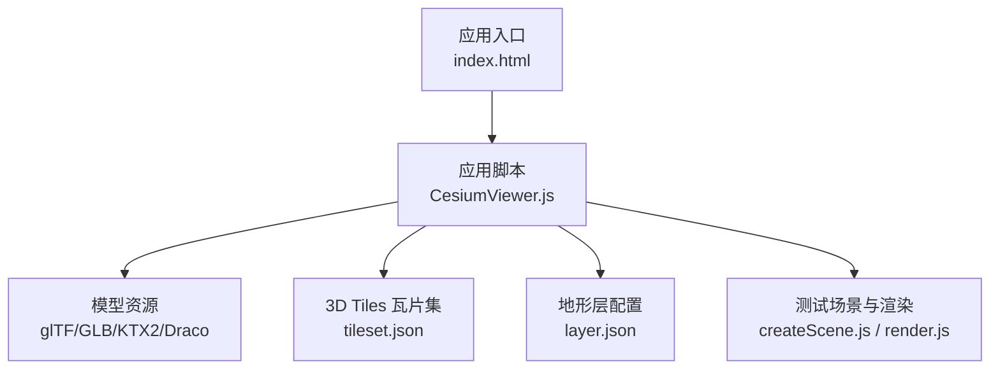
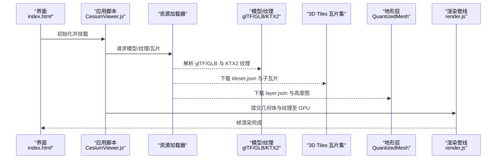
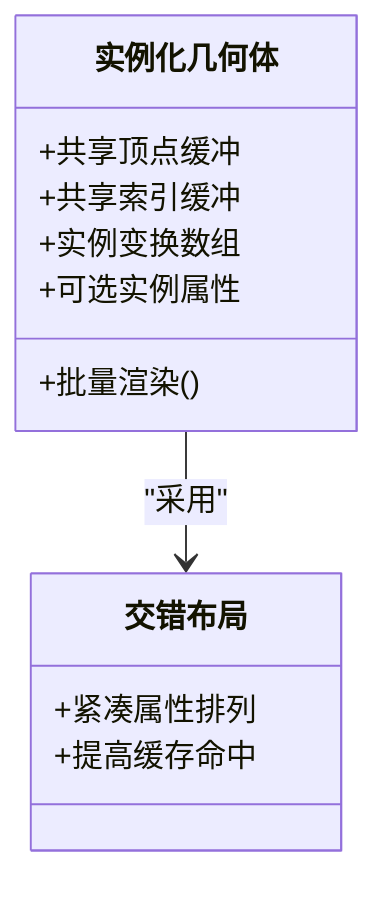
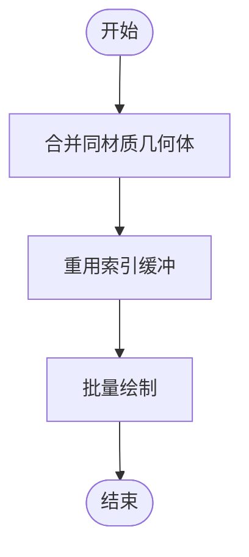
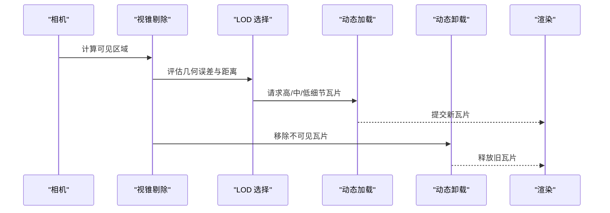
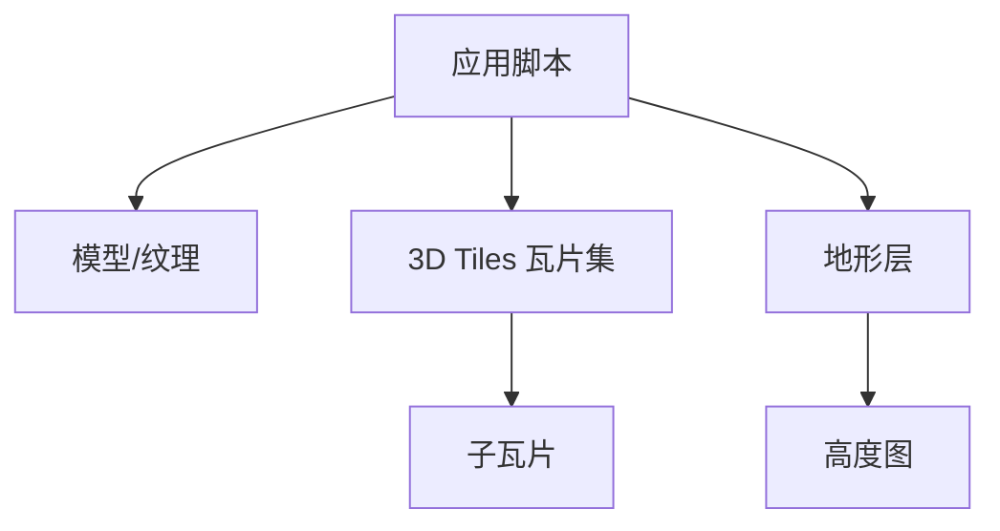

# 纹理与几何体内存优化

<cite>
**本文引用的文件**   
- [README.md](file://README.md)
- [CesiumViewer.js](file://Apps/CesiumViewer/CesiumViewer.js)
- [index.html](file://Apps/CesiumViewer/index.html)
- [BoxInstanced.gltf](file://Apps/SampleData/models/BoxInstanced/BoxInstanced.gltf)
- [box-instanced.gltf](file://Specs/Data/Models/glTF-2.0/BoxInstanced/glTF/box-instanced.gltf)
- [box-instanced-interleaved.gltf](file://Specs/Data/Models/glTF-2.0/BoxInstancedInterleaved/glTF/box-instanced-interleaved.gltf)
- [CesiumMilkTruck.dae](file://Apps/SampleData/models/CesiumMilkTruck/CesiumMilkTruck.dae)
- [CesiumDrone.glb](file://Apps/SampleData/models/CesiumDrone/CesiumDrone.glb)
- [CesiumMan.glb](file://Apps/SampleData/models/CesiumMan/CesiumMan.glb)
- [CesiumBalloonKTX2.glb](file://Apps/SampleData/models/CesiumBalloonKTX2/CesiumBalloonKTX2.glb)
- [CesiumAir.glb](file://Apps/SampleData/models/CesiumAir/CesiumAir.glb)
- [CesiumMilkTruck.glb](file://Apps/SampleData/models/CesiumMilkTruck/CesiumMilkTruck.glb)
- [CesiumMilkTruck.gltf](file://Apps/SampleData/models/DracoCompressed/CesiumMilkTruck.gltf)
- [tileset.json](file://Apps/SampleData/Cesium3DTiles/Tilesets/Tileset/tileset.json)
- [tileset_1.1.json](file://Apps/SampleData/Cesium3DTiles/EastNorthUpContent/tileset_1.1.json)
- [sample-cities-spain-v02.tileset.json](file://Apps/SampleData/vector/sample-cities-spain-v02.tileset.json)
- [sample-us-states-v02.tileset.json](file://Apps/SampleData/vector/sample-us-states-v02.tileset.json)
- [layer.json](file://Specs/Data/CesiumTerrainTileJson/QuantizedMesh/layer.json)
- [createScene.js](file://Specs/createScene.js)
- [render.js](file://Specs/render.js)
- [createContext.js](file://Specs/createContext.js)
</cite>

## 目录
1. [简介](#简介)
2. [项目结构](#项目结构)
3. [核心组件](#核心组件)
4. [架构总览](#架构总览)
5. [详细组件分析](#详细组件分析)
6. [依赖分析](#依赖分析)
7. [性能考量](#性能考量)
8. [故障排查指南](#故障排查指南)
9. [结论](#结论)
10. [附录](#附录)

## 简介
本指导聚焦于在大规模三维场景中实现“纹理与几何体”的内存优化，覆盖以下关键主题：
- 纹理压缩格式选择与使用（KTX2、Basis Universal），以及转换工具链建议
- 几何体实例化（InstancedGeometry）的原理、属性共享与渲染优化
- 几何体合并与批处理（顶点缓冲、索引重用、绘制调用减少）
- 大场景内存管理策略（视锥剔除、LOD、动态加载卸载）
- 纹理与几何体的内存监控与性能分析方法

## 项目结构
仓库包含示例应用、测试数据与规格样例，其中与纹理和几何体优化相关的资源主要分布在：
- 示例应用入口与初始化脚本
- glTF/glb 模型样本（含 KTX2 纹理与 Draco 压缩）
- 3D Tiles 瓦片集（用于 LOD 与分块加载）
- 地形层配置（量化网格等）
- 测试场景创建与渲染管线

图表来源
- [index.html](file://Apps/CesiumViewer/index.html)
- [CesiumViewer.js](file://Apps/CesiumViewer/CesiumViewer.js)
- [CesiumBalloonKTX2.glb](file://Apps/SampleData/models/CesiumBalloonKTX2/CesiumBalloonKTX2.glb)
- [tileset.json](file://Apps/SampleData/Cesium3DTiles/Tilesets/Tileset/tileset.json)
- [layer.json](file://Specs/Data/CesiumTerrainTileJson/QuantizedMesh/layer.json)
- [createScene.js](file://Specs/createScene.js)
- [render.js](file://Specs/render.js)

章节来源
- [README.md](file://README.md)
- [index.html](file://Apps/CesiumViewer/index.html)
- [CesiumViewer.js](file://Apps/CesiumViewer/CesiumViewer.js)

## 核心组件
- 纹理资源与压缩格式
  - KTX2/Basis Universal：适合 GPU 直接解码，显著降低显存占用与带宽压力；需考虑目标平台支持度与转码成本。
  - glTF 内嵌或外部纹理：通过 glTF 描述纹理元数据与采样参数，结合 KTX2 可提升加载与渲染效率。
- 几何体与实例化
  - InstancedGeometry：通过共享顶点与索引，仅存储每实例变换与可选属性，极大减少重复几何体内存与绘制开销。
  - 交错布局（interleaved）：将顶点属性紧凑排列，提高缓存命中与带宽利用率。
- 几何体合并与批处理
  - 合并相近材质/着色器的几何体，复用索引与顶点缓冲，减少状态切换与 draw call。
- 大场景资源管理
  - 3D Tiles 瓦片集：基于距离与几何误差进行 LOD 与按需加载，配合视锥剔除控制内存峰值。
  - 地形量化网格：以量化坐标与法线编码降低体积，按需加载不同分辨率层级。

章节来源
- [CesiumBalloonKTX2.glb](file://Apps/SampleData/models/CesiumBalloonKTX2/CesiumBalloonKTX2.glb)
- [BoxInstanced.gltf](file://Apps/SampleData/models/BoxInstanced/BoxInstanced.gltf)
- [box-instanced.gltf](file://Specs/Data/Models/glTF-2.0/BoxInstanced/glTF/box-instanced.gltf)
- [box-instanced-interleaved.gltf](file://Specs/Data/Models/glTF-2.0/BoxInstancedInterleaved/glTF/box-instanced-interleaved.gltf)
- [tileset.json](file://Apps/SampleData/Cesium3DTiles/Tilesets/Tileset/tileset.json)
- [layer.json](file://Specs/Data/CesiumTerrainTileJson/QuantizedMesh/layer.json)

## 架构总览
下图展示从应用启动到资源加载、渲染的关键路径，突出纹理与几何体在内存中的组织方式与优化点。

图表来源
- [index.html](file://Apps/CesiumViewer/index.html)
- [CesiumViewer.js](file://Apps/CesiumViewer/CesiumViewer.js)
- [CesiumBalloonKTX2.glb](file://Apps/SampleData/models/CesiumBalloonKTX2/CesiumBalloonKTX2.glb)
- [tileset.json](file://Apps/SampleData/Cesium3DTiles/Tilesets/Tileset/tileset.json)
- [layer.json](file://Specs/Data/CesiumTerrainTileJson/QuantizedMesh/layer.json)
- [render.js](file://Specs/render.js)

## 详细组件分析

### 纹理压缩格式选择与使用（KTX2、Basis Universal）
- 优势
  - 显存占用低：GPU 原生压缩格式避免解压后的大体积纹理。
  - 带宽友好：减少传输与拷贝开销，提升首帧与流式加载体验。
  - 多目标兼容：KTX2 提供多种后端（如 Basis Universal），可在运行时按设备能力选择最优格式。
- 注意事项
  - 质量与体积权衡：根据视觉需求调整压缩等级。
  - 平台支持差异：移动端与桌面端对特定压缩格式的支持不同，需要回退策略。
  - 转换工具链：建议使用成熟的离线转码工具生成 KTX2/Basis 资源，并在构建流程中集成。
- 参考资源
  - 示例模型中包含 KTX2 纹理的 glb 资源，可用于验证加载与显示效果。

章节来源
- [CesiumBalloonKTX2.glb](file://Apps/SampleData/models/CesiumBalloonKTX2/CesiumBalloonKTX2.glb)

### 几何体实例化（InstancedGeometry）原理与优化
- 原理
  - 共享几何体：多个实例共用同一份顶点与索引缓冲。
  - 实例属性：每个实例仅存储变换矩阵与可选属性（如颜色、缩放、旋转）。
  - 渲染优化：一次 draw call 渲染大量实例，显著降低 CPU-GPU 通信与状态切换开销。
- 属性共享与交错布局
  - 交错布局将顶点属性紧凑存放，提高缓存命中率与带宽利用。
- 参考资源
  - 示例 glTF 展示了基础实例化与交错布局两种模式，便于对比内存与性能差异。

图表来源
- [BoxInstanced.gltf](file://Apps/SampleData/models/BoxInstanced/BoxInstanced.gltf)
- [box-instanced.gltf](file://Specs/Data/Models/glTF-2.0/BoxInstanced/glTF/box-instanced.gltf)
- [box-instanced-interleaved.gltf](file://Specs/Data/Models/glTF-2.0/BoxInstancedInterleaved/glTF/box-instanced-interleaved.gltf)

章节来源
- [BoxInstanced.gltf](file://Apps/SampleData/models/BoxInstanced/BoxInstanced.gltf)
- [box-instanced.gltf](file://Specs/Data/Models/glTF-2.0/BoxInstanced/glTF/box-instanced.gltf)
- [box-instanced-interleaved.gltf](file://Specs/Data/Models/glTF-2.0/BoxInstancedInterleaved/glTF/box-instanced-interleaved.gltf)

### 几何体合并与批处理（顶点缓冲、索引重用、绘制调用减少）
- 技术要点
  - 合并相同材质/着色器的几何体，统一顶点布局，减少状态切换。
  - 重用索引缓冲，避免重复顶点数据，降低显存占用。
  - 通过实例化或合并减少 draw call，提升吞吐。
- 实践建议
  - 在导入阶段进行几何体合并与索引去重。
  - 对频繁更新的几何体采用动态缓冲更新策略，避免重建。
- 参考资源
  - 示例模型与测试数据可用于验证合并前后的内存与帧率变化。

[此图为概念流程图，不映射具体源码文件]

### 大场景内存管理（视锥剔除、LOD、动态加载卸载）
- 视锥剔除
  - 仅加载与渲染相机可见区域，减少无效资源占用。
- LOD 系统
  - 基于距离与几何误差选择合适细节级别，平衡画质与内存。
- 动态加载卸载
  - 3D Tiles 瓦片集与地形层按需加载，随相机移动动态替换。
- 参考资源
  - 3D Tiles 瓦片集 JSON 定义结构与子瓦片组织。
  - 地形层配置说明量化网格与可用范围。

图表来源
- [tileset.json](file://Apps/SampleData/Cesium3DTiles/Tilesets/Tileset/tileset.json)
- [tileset_1.1.json](file://Apps/SampleData/Cesium3DTiles/EastNorthUpContent/tileset_1.1.json)
- [layer.json](file://Specs/Data/CesiumTerrainTileJson/QuantizedMesh/layer.json)

章节来源
- [tileset.json](file://Apps/SampleData/Cesium3DTiles/Tilesets/Tileset/tileset.json)
- [tileset_1.1.json](file://Apps/SampleData/Cesium3DTiles/EastNorthUpContent/tileset_1.1.json)
- [layer.json](file://Specs/Data/CesiumTerrainTileJson/QuantizedMesh/layer.json)

### 纹理与几何体的内存监控与性能分析案例
- 监控维度
  - 纹理：原始大小、压缩后大小、显存占用、解码耗时。
  - 几何体：顶点数、索引数、缓冲大小、实例数量、draw call 次数。
- 分析方法
  - 使用浏览器开发者工具的 Performance 与 Memory 面板记录关键指标。
  - 对比启用/禁用纹理压缩与实例化后的内存与帧率差异。
- 参考资源
  - 测试场景创建与渲染脚本可作为基准用例，复现实验条件。

章节来源
- [createScene.js](file://Specs/createScene.js)
- [render.js](file://Specs/render.js)

## 依赖分析
- 资源依赖关系
  - 应用脚本依赖模型、纹理、瓦片集与地形层配置。
  - 3D Tiles 瓦片集依赖子瓦片与元数据，形成树状加载结构。
  - 地形层依赖高度图与元数据，按层级与范围加载。
- 潜在耦合点
  - 纹理格式与平台支持：需在加载前检测能力并选择回退。
  - 实例化与合并策略：需与材质/着色器一致，避免额外状态切换。

图表来源
- [CesiumViewer.js](file://Apps/CesiumViewer/CesiumViewer.js)
- [tileset.json](file://Apps/SampleData/Cesium3DTiles/Tilesets/Tileset/tileset.json)
- [layer.json](file://Specs/Data/CesiumTerrainTileJson/QuantizedMesh/layer.json)

章节来源
- [CesiumViewer.js](file://Apps/CesiumViewer/CesiumViewer.js)
- [tileset.json](file://Apps/SampleData/Cesium3DTiles/Tilesets/Tileset/tileset.json)
- [layer.json](file://Specs/Data/CesiumTerrainTileJson/QuantizedMesh/layer.json)

## 性能考量
- 纹理
  - 优先使用 KTX2/Basis 压缩，结合平台能力选择最优后端。
  - 合理设置 mipmaps 与过滤模式，平衡清晰度与带宽。
- 几何体
  - 使用实例化与交错布局减少内存与带宽。
  - 合并与批处理降低 draw call，提升吞吐。
- 场景
  - 启用视锥剔除与 LOD，限制同时驻留内存的资源规模。
  - 动态加载卸载，避免一次性加载全部资源。

[本节为通用指导，不直接分析具体文件]

## 故障排查指南
- 常见问题
  - 纹理无法显示：检查 KTX2 支持回退与路径正确性。
  - 实例化异常：确认实例属性与顶点布局匹配。
  - 瓦片加载失败：校验 tileset.json 结构与网络可达性。
- 调试步骤
  - 使用开发者工具查看网络请求与资源大小。
  - 对比启用/禁用优化选项后的内存与帧率曲线。
- 参考资源
  - 测试场景与渲染脚本可作为复现与定位问题的基线。

章节来源
- [createScene.js](file://Specs/createScene.js)
- [render.js](file://Specs/render.js)

## 结论
通过采用现代纹理压缩格式、几何体实例化与合并批处理、以及大场景的分块与 LOD 管理，可以显著降低纹理与几何体的内存占用，提升渲染性能与用户体验。建议在构建流程中集成转码与资源优化，并在测试环境中持续监控关键指标，确保在不同平台上的稳定表现。

[本节为总结，不直接分析具体文件]

## 附录
- 相关示例资源
  - 模型与纹理：CesiumMilkTruck、CesiumDrone、CesiumMan、CesiumAir 等
  - 压缩与 Draco：CesiumMilkTruck.glb、CesiumMilkTruck.gltf（Draco 压缩）
  - 矢量瓦片：sample-cities-spain-v02.tileset.json、sample-us-states-v02.tileset.json

章节来源
- [CesiumMilkTruck.dae](file://Apps/SampleData/models/CesiumMilkTruck/CesiumMilkTruck.dae)
- [CesiumDrone.glb](file://Apps/SampleData/models/CesiumDrone/CesiumDrone.glb)
- [CesiumMan.glb](file://Apps/SampleData/models/CesiumMan/CesiumMan.glb)
- [CesiumAir.glb](file://Apps/SampleData/models/CesiumAir/CesiumAir.glb)
- [CesiumMilkTruck.glb](file://Apps/SampleData/models/CesiumMilkTruck/CesiumMilkTruck.glb)
- [CesiumMilkTruck.gltf](file://Apps/SampleData/models/DracoCompressed/CesiumMilkTruck.gltf)
- [sample-cities-spain-v02.tileset.json](file://Apps/SampleData/vector/sample-cities-spain-v02.tileset.json)
- [sample-us-states-v02.tileset.json](file://Apps/SampleData/vector/sample-us-states-v02.tileset.json)