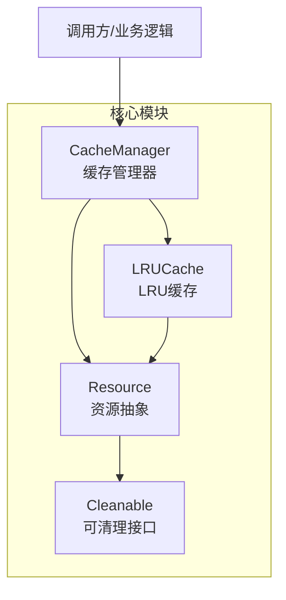
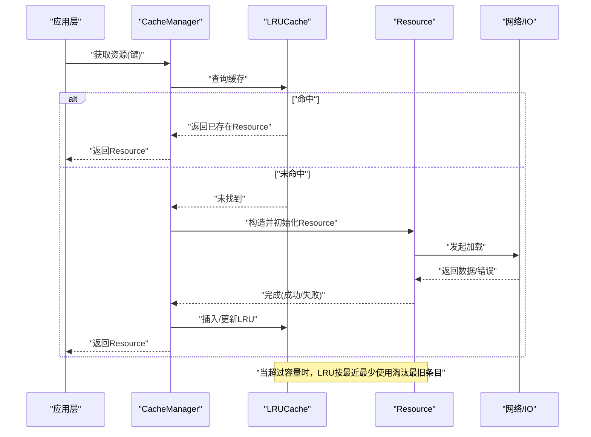
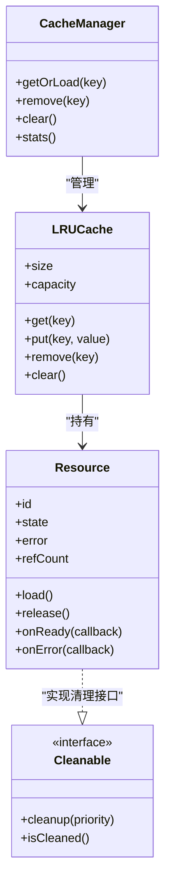
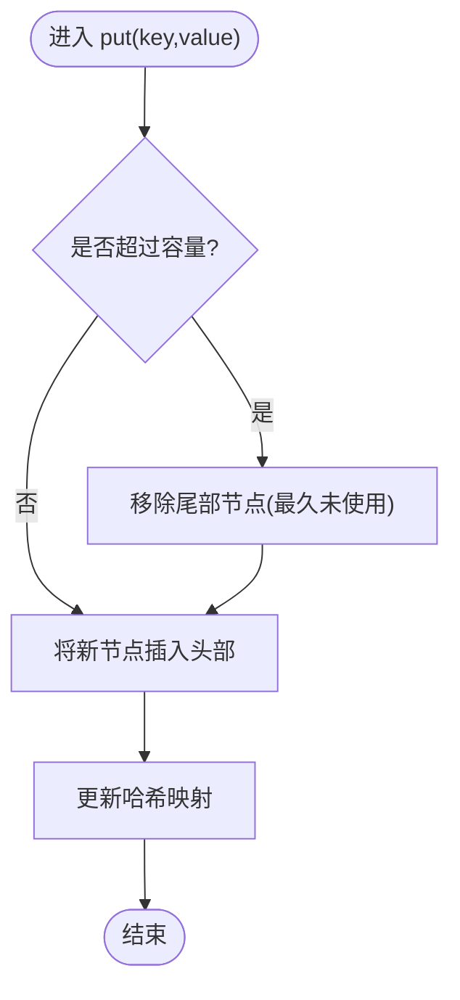
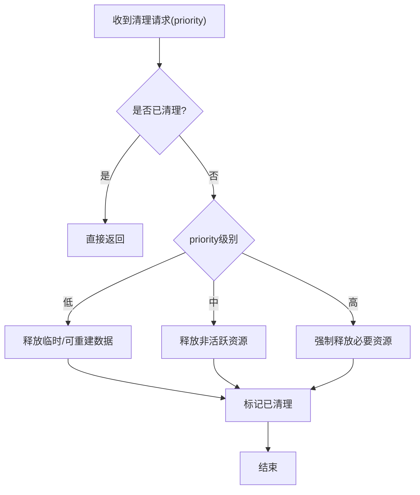
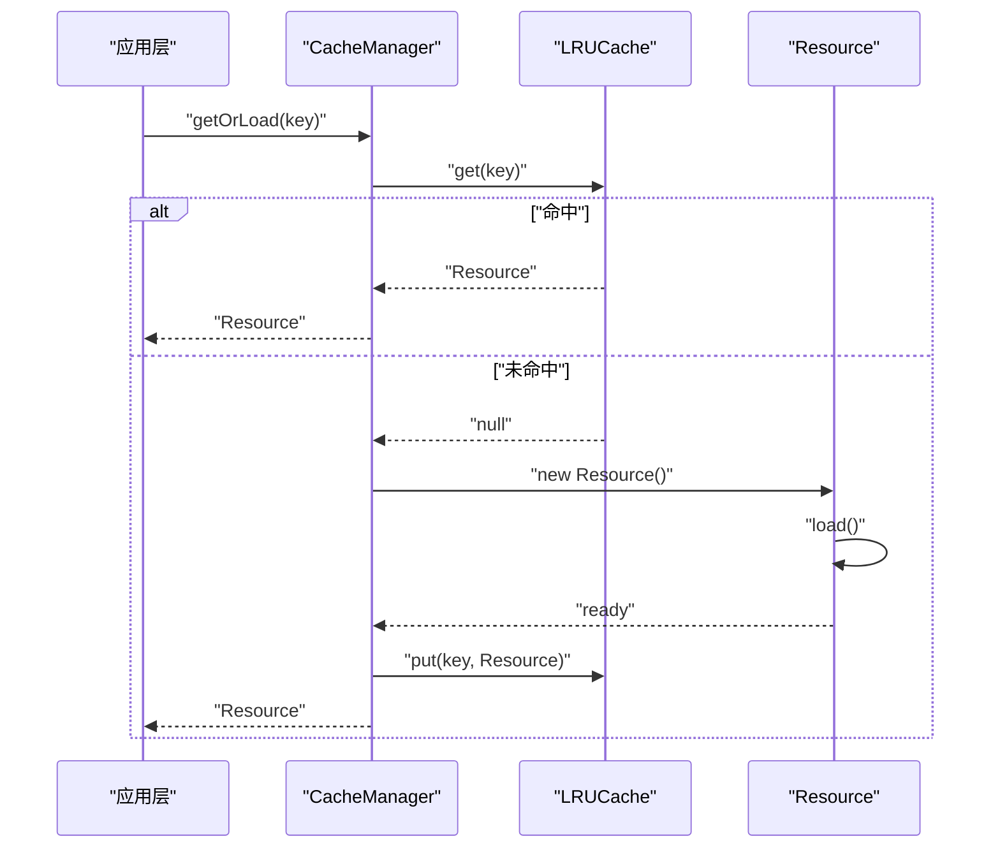
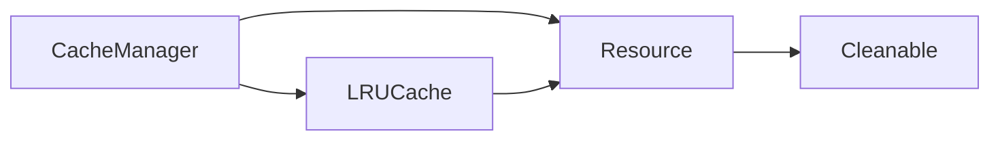

# 资源缓存系统

<cite>
**本文引用的文件**   
- [Resource.js](file://Source/Core/Resource.js)
- [LRUCache.js](file://Source/Core/LRUCache.js)
- [CacheManager.js](file://Source/Core/CacheManager.js)
- [Cleanable.js](file://Source/Core/Cleanable.js)
</cite>

## 目录
1. [简介](#简介)
2. [项目结构](#项目结构)
3. [核心组件](#核心组件)
4. [架构总览](#架构总览)
5. [详细组件分析](#详细组件分析)
6. [依赖关系分析](#依赖关系分析)
7. [性能考量](#性能考量)
8. [故障排查指南](#故障排查指南)
9. [结论](#结论)
10. [附录](#附录)

## 简介
本文件面向Cesium资源缓存系统的实现与使用，重点覆盖以下主题：
- LRU（最近最少使用）缓存策略的实现原理、配置项与调优建议
- Cleanable接口的清理机制：自动触发条件、手动清理方法与优先级管理
- Resource类的生命周期管理：加载、缓存、引用计数与释放流程
- 缓存命中率监控与性能分析方法
- 正确使用缓存API的实践路径与优化策略

## 项目结构
资源缓存相关代码主要分布在Core模块中，包含资源抽象、LRU缓存、缓存管理与可清理对象接口等。下图给出高层结构与交互关系。

图表来源
- [Resource.js:1-200](file://Source/Core/Resource.js#L1-L200)
- [LRUCache.js:1-200](file://Source/Core/LRUCache.js#L1-L200)
- [CacheManager.js:1-200](file://Source/Core/CacheManager.js#L1-L200)
- [Cleanable.js:1-100](file://Source/Core/Cleanable.js#L1-L100)

章节来源
- [Resource.js:1-200](file://Source/Core/Resource.js#L1-L200)
- [LRUCache.js:1-200](file://Source/Core/LRUCache.js#L1-L200)
- [CacheManager.js:1-200](file://Source/Core/CacheManager.js#L1-L200)
- [Cleanable.js:1-100](file://Source/Core/Cleanable.js#L1-L100)

## 核心组件
- Resource：资源的统一抽象，封装加载、状态、错误处理、引用计数与释放语义。
- LRUCache：基于键值映射与双向链表的LRU实现，支持容量限制、命中统计与淘汰策略。
- CacheManager：对外暴露的缓存入口，负责创建/获取/删除资源、维护LRU实例、协调清理。
- Cleanable：定义统一的清理能力与优先级，供LRU或外部调度在内存紧张时回收。

章节来源
- [Resource.js:1-200](file://Source/Core/Resource.js#L1-L200)
- [LRUCache.js:1-200](file://Source/Core/LRUCache.js#L1-L200)
- [CacheManager.js:1-200](file://Source/Core/CacheManager.js#L1-L200)
- [Cleanable.js:1-100](file://Source/Core/Cleanable.js#L1-L100)

## 架构总览
下图展示从请求到缓存命中/未命中的完整流程，以及LRU淘汰与资源释放的关键路径。

图表来源
- [CacheManager.js:1-200](file://Source/Core/CacheManager.js#L1-L200)
- [LRUCache.js:1-200](file://Source/Core/LRUCache.js#L1-L200)
- [Resource.js:1-200](file://Source/Core/Resource.js#L1-L200)

## 详细组件分析

### Resource类：生命周期与引用计数
- 生命周期阶段
  - 新建：分配标识、初始状态、注册到缓存
  - 加载中：异步加载数据，更新进度与错误状态
  - 就绪：数据可用，可被渲染/消费
  - 释放：引用计数归零后执行清理，归还底层资源
- 引用计数
  - 获取时+1，释放时-1；归零时触发释放流程
  - 避免重复释放与悬挂引用
- 错误处理
  - 记录错误码/信息，提供重试或降级策略钩子
- 与LRU协作
  - 作为LRU节点参与访问顺序更新
  - 被LRU淘汰时若仍有引用则延迟释放，直到引用计数归零

图表来源
- [Resource.js:1-200](file://Source/Core/Resource.js#L1-L200)
- [LRUCache.js:1-200](file://Source/Core/LRUCache.js#L1-L200)
- [CacheManager.js:1-200](file://Source/Core/CacheManager.js#L1-L200)
- [Cleanable.js:1-100](file://Source/Core/Cleanable.js#L1-L100)

章节来源
- [Resource.js:1-200](file://Source/Core/Resource.js#L1-L200)

### LRUCache：策略、数据结构与复杂度
- 数据结构
  - 哈希表：O(1)查找键对应的节点
  - 双向链表：维护访问顺序，头部为最近使用，尾部为最久未使用
- 操作复杂度
  - get/put/remove/clear：均摊O(1)
  - size/capacity：O(1)
- 淘汰策略
  - 超出容量时移除尾部节点（最久未使用）
- 统计指标
  - 命中次数、未命中次数、命中率、当前大小、容量上限

图表来源
- [LRUCache.js:1-200](file://Source/Core/LRUCache.js#L1-L200)

章节来源
- [LRUCache.js:1-200](file://Source/Core/LRUCache.js#L1-L200)

### Cleanable接口：清理机制与优先级
- 设计目标
  - 为LRU淘汰或外部压力场景提供统一清理入口
- 关键方法
  - cleanup(priority)：根据优先级执行清理动作
  - isCleaned()：标记是否已完成清理，防止重复释放
- 优先级管理
  - 低优先级：可丢弃的中间态数据
  - 中优先级：非活跃但可能复用的资源
  - 高优先级：仅允许强制释放且需保证一致性
- 触发条件
  - 自动：LRU达到容量阈值、内存告警回调
  - 手动：显式调用清理或重置缓存

图表来源
- [Cleanable.js:1-100](file://Source/Core/Cleanable.js#L1-L100)

章节来源
- [Cleanable.js:1-100](file://Source/Core/Cleanable.js#L1-L100)

### CacheManager：对外API与协调职责
- 职责
  - 提供统一的资源获取/删除/清空接口
  - 维护LRUCache实例与全局统计
  - 协调Resource的生命周期与LRU的存取
- 典型流程
  - getOrLoad(key)：命中则返回，未命中则创建并加载，完成后入LRU
  - remove(key)/clear()：从LRU移除并触发引用计数与释放
  - stats()：汇总命中率、容量、大小等指标

图表来源
- [CacheManager.js:1-200](file://Source/Core/CacheManager.js#L1-L200)
- [LRUCache.js:1-200](file://Source/Core/LRUCache.js#L1-L200)
- [Resource.js:1-200](file://Source/Core/Resource.js#L1-L200)

章节来源
- [CacheManager.js:1-200](file://Source/Core/CacheManager.js#L1-L200)

## 依赖关系分析
- 耦合关系
  - CacheManager强依赖LRUCache与Resource
  - LRUCache以Resource为值类型，不反向依赖CacheManager
  - Resource实现Cleanable，解耦具体清理逻辑
- 外部依赖
  - 网络/IO用于资源加载
  - 可选的统计/日志设施用于命中率与性能追踪

图表来源
- [CacheManager.js:1-200](file://Source/Core/CacheManager.js#L1-L200)
- [LRUCache.js:1-200](file://Source/Core/LRUCache.js#L1-L200)
- [Resource.js:1-200](file://Source/Core/Resource.js#L1-L200)
- [Cleanable.js:1-100](file://Source/Core/Cleanable.js#L1-L100)

章节来源
- [CacheManager.js:1-200](file://Source/Core/CacheManager.js#L1-L200)
- [LRUCache.js:1-200](file://Source/Core/LRUCache.js#L1-L200)
- [Resource.js:1-200](file://Source/Core/Resource.js#L1-L200)
- [Cleanable.js:1-100](file://Source/Core/Cleanable.js#L1-L100)

## 性能考量
- 容量规划
  - 根据热点资源数量与平均大小设置LRU容量，避免频繁淘汰
- 命中率优化
  - 合理选择缓存键，减少冷数据进入缓存
  - 对大对象采用分片或懒加载
- 淘汰策略
  - 默认LRU适合时间局部性强的场景；如需空间局部性可考虑LFU扩展
- 并发与锁
  - 在高并发下确保LRU操作的原子性与线程安全
- 统计与观测
  - 持续采集命中率、淘汰率、P95/P99延迟，结合业务峰值动态调整

[本节为通用指导，无需列出具体文件来源]

## 故障排查指南
- 常见问题
  - 命中率偏低：检查键设计、缓存容量与访问模式
  - 内存持续增长：确认引用计数是否正确递减、是否存在循环引用
  - 频繁淘汰：评估容量与热点分布，必要时引入预热
- 定位手段
  - 通过统计接口输出命中率、容量、大小、淘汰次数
  - 在LRU与Resource关键路径增加日志，观察淘汰与释放时机
- 恢复策略
  - 手动清理非活跃资源或重置缓存
  - 降低并发度或分批加载，缓解瞬时峰值

章节来源
- [LRUCache.js:1-200](file://Source/Core/LRUCache.js#L1-L200)
- [Resource.js:1-200](file://Source/Core/Resource.js#L1-L200)
- [CacheManager.js:1-200](file://Source/Core/CacheManager.js#L1-L200)

## 结论
Cesium资源缓存系统以Resource为核心抽象，借助LRUCache实现高效的时间局部性缓存，并通过Cleanable接口提供可控的清理能力。配合合理的容量规划、键设计与监控手段，可在复杂场景中取得稳定的命中率与内存占用表现。

[本节为总结性内容，无需列出具体文件来源]

## 附录
- 最佳实践清单
  - 明确资源粒度与键规范
  - 设置合理的LRU容量与淘汰阈值
  - 始终遵循引用计数语义，避免悬挂引用
  - 定期采集并分析命中率与淘汰率
  - 对大对象采用分片/懒加载/压缩策略
- 参考路径
  - 资源抽象与生命周期：[Resource.js](file://Source/Core/Resource.js)
  - LRU实现与统计：[LRUCache.js](file://Source/Core/LRUCache.js)
  - 缓存入口与管理：[CacheManager.js](file://Source/Core/CacheManager.js)
  - 清理接口与优先级：[Cleanable.js](file://Source/Core/Cleanable.js)