# 性能优化

<cite>
**本文引用的文件**   
- [PerformanceTestingGuide/README.md](file://Documentation/Contributors/PerformanceTestingGuide/README.md)
- [CesiumViewer.js](file://Apps/CesiumViewer/CesiumViewer.js)
- [index.html](file://Apps/CesiumViewer/index.html)
- [CustomShaderGuide/README.md](file://Documentation/CustomShaderGuide/README.md)
- [MobileGuide/README.md](file://Documentation/Contributors/MobileGuide/README.md)
</cite>

## 目录
1. [简介](#简介)
2. [项目结构](#项目结构)
3. [核心组件](#核心组件)
4. [架构总览](#架构总览)
5. [详细组件分析](#详细组件分析)
6. [依赖分析](#依赖分析)
7. [性能考量](#性能考量)
8. [故障排查指南](#故障排查指南)
9. [结论](#结论)
10. [附录](#附录)

## 简介
本指南聚焦于在 Cesium 中实现高性能渲染与资源管理，围绕以下主题展开：
- LOD（细节层次）系统的工作原理与配置策略
- 视锥剔除、遮挡剔除与批处理渲染的实现机制
- 内存管理策略：资源缓存、垃圾回收与泄漏预防
- 渲染优化技术：着色器优化、纹理压缩与 GPU 实例化
- 性能监控与分析工具使用指南
- 实际性能测试案例与优化前后对比方法

为保证可追溯性，文中涉及具体实现或流程的章节均提供“章节来源”，并尽量以路径引用代替直接代码片段。

## 项目结构
仓库包含示例应用、文档与测试数据等关键目录。与性能优化密切相关的入口与文档如下：
- Apps/CesiumViewer：示例应用的视图与脚本入口，便于进行性能观测与调参
- Documentation/Contributors/PerformanceTestingGuide：官方性能测试指南，涵盖基准测试方法与指标
- Documentation/CustomShaderGuide：自定义着色器指南，有助于理解着色器层面的优化点
- Documentation/Contributors/MobileGuide：移动端优化建议，对功耗与帧率有直接影响

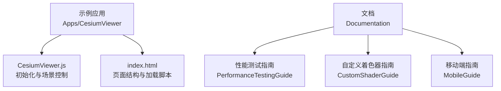

**图表来源** 
- [CesiumViewer.js](file://Apps/CesiumViewer/CesiumViewer.js)
- [index.html](file://Apps/CesiumViewer/index.html)
- [PerformanceTestingGuide/README.md](file://Documentation/Contributors/PerformanceTestingGuide/README.md)
- [CustomShaderGuide/README.md](file://Documentation/CustomShaderGuide/README.md)
- [MobileGuide/README.md](file://Documentation/Contributors/MobileGuide/README.md)

**章节来源**
- [CesiumViewer.js](file://Apps/CesiumViewer/CesiumViewer.js)
- [index.html](file://Apps/CesiumViewer/index.html)
- [PerformanceTestingGuide/README.md](file://Documentation/Contributors/PerformanceTestingGuide/README.md)
- [CustomShaderGuide/README.md](file://Documentation/CustomShaderGuide/README.md)
- [MobileGuide/README.md](file://Documentation/Contributors/MobileGuide/README.md)

## 核心组件
本节从概念层面梳理与性能相关的关键子系统，帮助读者建立整体认知：
- 场景图与渲染管线：负责对象组织、可见性判断与绘制调用
- 瓦片与LOD：基于几何误差与距离的动态细节切换
- 剔除系统：视锥剔除与遮挡剔除减少无效绘制
- 批处理与实例化：合并绘制调用，降低CPU-GPU通信开销
- 资源与内存：纹理、模型与缓冲区的生命周期管理
- 着色器与材质：GPU端计算复杂度与分支控制
- 性能监控：帧率、绘制调用数、三角面数、显存占用等指标采集

[本节为概念性概述，不直接分析具体文件]

## 架构总览
下图展示示例应用与性能相关文档之间的交互关系，以及典型优化关注点。

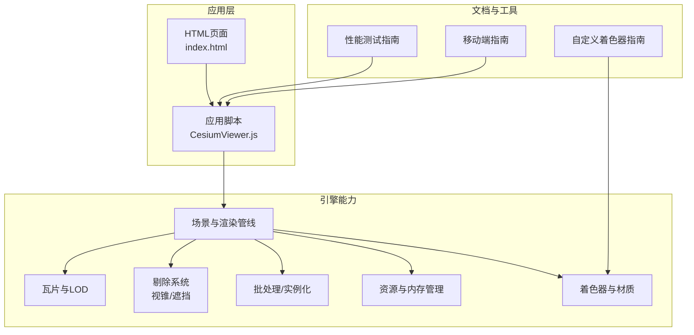

**图表来源** 
- [CesiumViewer.js](file://Apps/CesiumViewer/CesiumViewer.js)
- [index.html](file://Apps/CesiumViewer/index.html)
- [PerformanceTestingGuide/README.md](file://Documentation/Contributors/PerformanceTestingGuide/README.md)
- [CustomShaderGuide/README.md](file://Documentation/CustomShaderGuide/README.md)
- [MobileGuide/README.md](file://Documentation/Contributors/MobileGuide/README.md)

## 详细组件分析

### LOD（细节层次）系统与配置策略
- 工作原理
  - 基于瓦片的几何误差与相机距离动态选择合适细节级别
  - 通过子树元数据与层级结构快速决策加载与替换
- 配置要点
  - 合理设置几何误差阈值，平衡视觉质量与带宽/内存
  - 利用请求体积（Request Volume）限制并发与优先级
  - 结合显存预算与设备能力调整最大同时加载瓦片数
- 实践建议
  - 对大规模地形与倾斜摄影优先采用瓦片化与LOD
  - 避免过细的LOD导致频繁替换与抖动
  - 针对热点区域预取相邻层级，提升交互流畅度

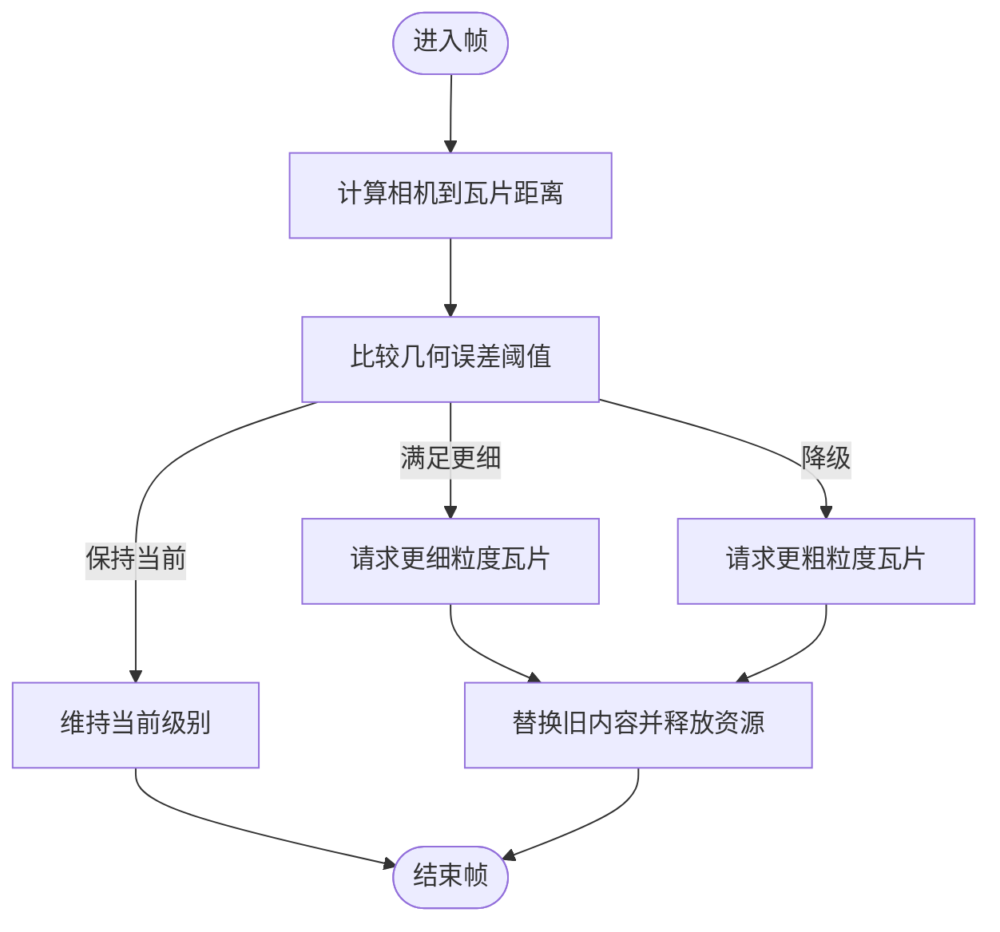

**图表来源** 
- [PerformanceTestingGuide/README.md](file://Documentation/Contributors/PerformanceTestingGuide/README.md)

**章节来源**
- [PerformanceTestingGuide/README.md](file://Documentation/Contributors/PerformanceTestingGuide/README.md)

### 视锥剔除与遮挡剔除
- 视锥剔除
  - 在CPU侧快速排除不在相机视野内的对象，减少后续处理
- 遮挡剔除
  - 借助深度缓冲或硬件 occlusion query 进一步剔除被遮挡对象
- 实现机制
  - 将瓦片边界体与场景对象投影至屏幕空间进行快速测试
  - 对复杂场景分层剔除，先粗后细，降低计算压力
- 优化建议
  - 合理划分瓦片边界体，避免过大导致剔除失效
  - 对静态背景启用遮挡剔除，对动态对象谨慎使用

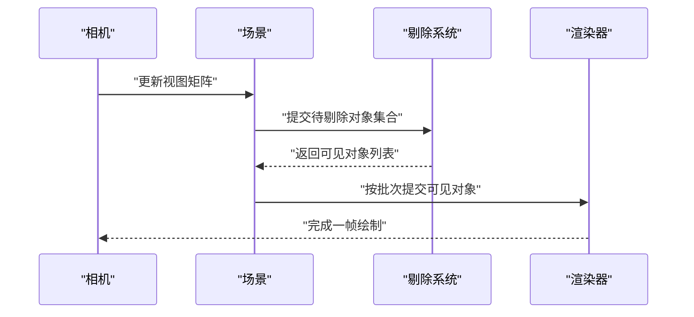

**图表来源** 
- [PerformanceTestingGuide/README.md](file://Documentation/Contributors/PerformanceTestingGuide/README.md)

**章节来源**
- [PerformanceTestingGuide/README.md](file://Documentation/Contributors/PerformanceTestingGuide/README.md)

### 批处理渲染与GPU实例化
- 批处理
  - 将相同材质与状态的多个对象合并为单次绘制调用，降低CPU开销
- GPU实例化
  - 通过一次调用渲染大量相似对象，仅传递实例属性（如变换）
- 适用场景
  - 大量重复元素（树木、路灯、UI图标等）
  - 粒子系统与点云批量渲染
- 注意事项
  - 确保材质一致性与状态稳定，避免频繁切换
  - 控制实例数量与属性大小，防止顶点缓冲区溢出

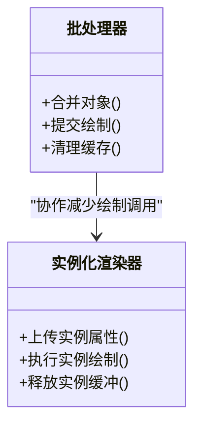

**图表来源** 
- [PerformanceTestingGuide/README.md](file://Documentation/Contributors/PerformanceTestingGuide/README.md)

**章节来源**
- [PerformanceTestingGuide/README.md](file://Documentation/Contributors/PerformanceTestingGuide/README.md)

### 内存管理与资源缓存
- 资源缓存
  - 复用纹理、模型与缓冲区，避免重复创建与销毁
- 垃圾回收
  - 及时解除对象引用，避免强引用链导致无法回收
- 泄漏预防
  - 监听对象生命周期事件，确保在卸载时释放GPU资源
  - 避免闭包持有大对象引用
- 最佳实践
  - 使用弱引用或池化模式管理高频对象
  - 对大数据集采用流式加载与按需释放

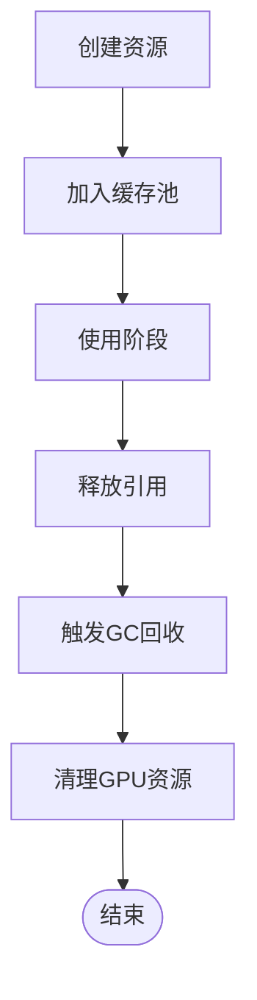

**图表来源** 
- [PerformanceTestingGuide/README.md](file://Documentation/Contributors/PerformanceTestingGuide/README.md)

**章节来源**
- [PerformanceTestingGuide/README.md](file://Documentation/Contributors/PerformanceTestingGuide/README.md)

### 渲染优化：着色器、纹理与实例化
- 着色器优化
  - 减少分支与条件判断，合并计算步骤
  - 合理使用精度与数据类型，避免过度计算
- 纹理压缩
  - 使用KTX2/Basis等现代压缩格式，降低带宽与显存占用
  - 根据目标平台选择合适的压缩方案
- GPU实例化
  - 将重复几何与材质合并，仅传递差异属性
  - 控制实例数量与属性布局，提高吞吐

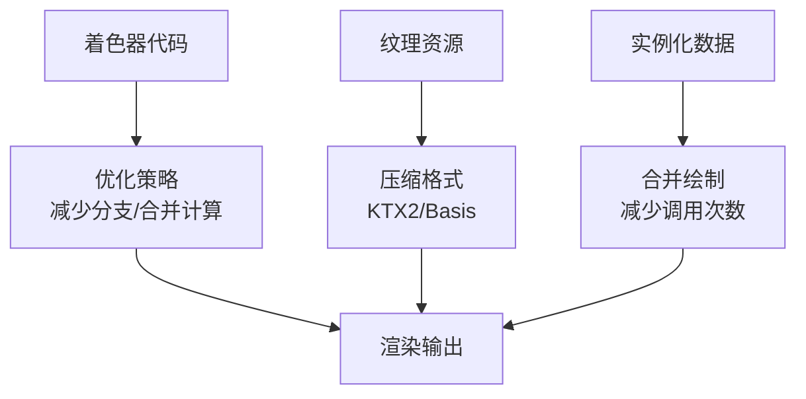

**图表来源** 
- [CustomShaderGuide/README.md](file://Documentation/CustomShaderGuide/README.md)
- [PerformanceTestingGuide/README.md](file://Documentation/Contributors/PerformanceTestingGuide/README.md)

**章节来源**
- [CustomShaderGuide/README.md](file://Documentation/CustomShaderGuide/README.md)
- [PerformanceTestingGuide/README.md](file://Documentation/Contributors/PerformanceTestingGuide/README.md)

### 性能监控与分析工具
- 指标采集
  - 帧率、绘制调用数、三角面数、显存占用、网络带宽
- 工具使用
  - 浏览器开发者工具的性能面板与GPU捕获
  - 自定义统计钩子记录关键路径耗时
- 分析方法
  - 定位高耗时函数与绘制调用热点
  - 对比不同配置下的指标变化，验证优化效果

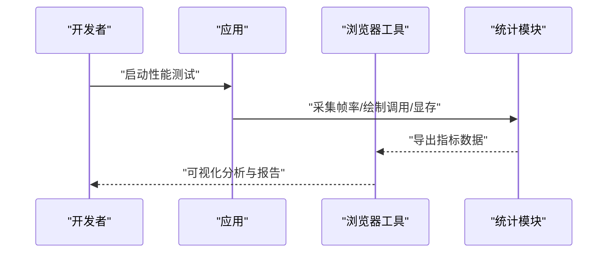

**图表来源** 
- [PerformanceTestingGuide/README.md](file://Documentation/Contributors/PerformanceTestingGuide/README.md)

**章节来源**
- [PerformanceTestingGuide/README.md](file://Documentation/Contributors/PerformanceTestingGuide/README.md)

### 实际性能测试案例与对比方法
- 测试设计
  - 固定场景与相机路径，对比不同LOD阈值与剔除策略
  - 在不同设备上运行，评估移动端与桌面端的差异
- 数据采集
  - 记录平均帧率、最低帧率、绘制调用数与显存峰值
- 结果分析
  - 识别瓶颈环节（CPU/GPU/IO），针对性优化
  - 使用A/B测试验证优化收益

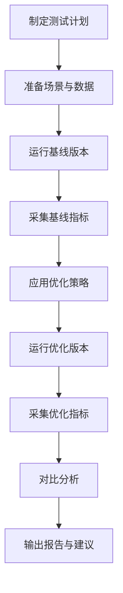

**图表来源** 
- [PerformanceTestingGuide/README.md](file://Documentation/Contributors/PerformanceTestingGuide/README.md)

**章节来源**
- [PerformanceTestingGuide/README.md](file://Documentation/Contributors/PerformanceTestingGuide/README.md)

### 示例应用中的性能切入点
- 入口与初始化
  - 页面结构与脚本加载顺序影响首屏性能
  - 建议在初始化阶段禁用不必要的特效与高精度计算
- 场景控制
  - 动态调整LOD阈值与剔除参数，观察帧率变化
  - 对热点区域启用预取与缓存，减少卡顿

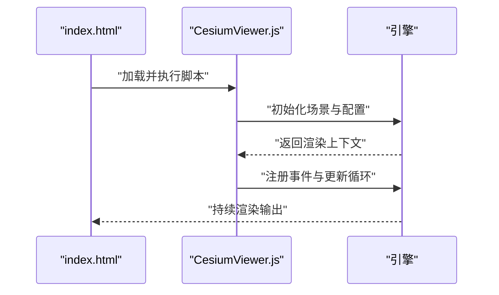

**图表来源** 
- [CesiumViewer.js](file://Apps/CesiumViewer/CesiumViewer.js)
- [index.html](file://Apps/CesiumViewer/index.html)

**章节来源**
- [CesiumViewer.js](file://Apps/CesiumViewer/CesiumViewer.js)
- [index.html](file://Apps/CesiumViewer/index.html)

## 依赖分析
- 应用层依赖
  - index.html 引入 CesiumViewer.js，作为示例应用入口
- 文档依赖
  - PerformanceTestingGuide 提供测试方法与指标定义
  - CustomShaderGuide 指导着色器优化方向
  - MobileGuide 给出移动端适配与功耗优化建议
- 耦合与内聚
  - 示例应用与引擎解耦，便于替换渲染后端
  - 文档与代码分离，利于独立维护与更新

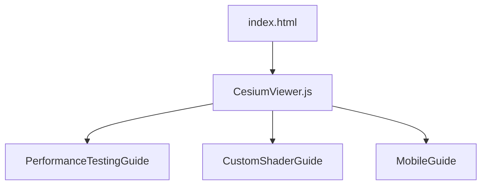

**图表来源** 
- [CesiumViewer.js](file://Apps/CesiumViewer/CesiumViewer.js)
- [index.html](file://Apps/CesiumViewer/index.html)
- [PerformanceTestingGuide/README.md](file://Documentation/Contributors/PerformanceTestingGuide/README.md)
- [CustomShaderGuide/README.md](file://Documentation/CustomShaderGuide/README.md)
- [MobileGuide/README.md](file://Documentation/Contributors/MobileGuide/README.md)

**章节来源**
- [CesiumViewer.js](file://Apps/CesiumViewer/CesiumViewer.js)
- [index.html](file://Apps/CesiumViewer/index.html)
- [PerformanceTestingGuide/README.md](file://Documentation/Contributors/PerformanceTestingGuide/README.md)
- [CustomShaderGuide/README.md](file://Documentation/CustomShaderGuide/README.md)
- [MobileGuide/README.md](file://Documentation/Contributors/MobileGuide/README.md)

## 性能考量
- 设备差异
  - 移动端需更注重功耗与内存占用，适当降低LOD与纹理分辨率
  - 桌面端可利用更高算力，提升细节与特效
- 网络与IO
  - 合理分块与压缩资源，减少首屏时间
  - 使用CDN与缓存策略，提升重复访问性能
- 稳定性与兼容性
  - 针对不同浏览器与WebGL版本进行回归测试
  - 对异常路径添加降级策略，保证基本可用性

[本节为通用指导，不直接分析具体文件]

## 故障排查指南
- 常见问题
  - 帧率骤降：检查绘制调用数与三角面数是否突增
  - 显存溢出：确认纹理与模型是否正确释放
  - 卡顿与掉帧：分析主线程阻塞与GPU等待
- 定位方法
  - 使用浏览器性能面板录制关键路径
  - 对比不同配置下的指标，缩小问题范围
- 修复建议
  - 减少不必要的重绘与状态切换
  - 优化着色器逻辑与纹理格式
  - 调整LOD与剔除参数，平衡质量与性能

**章节来源**
- [PerformanceTestingGuide/README.md](file://Documentation/Contributors/PerformanceTestingGuide/README.md)

## 结论
通过系统化地应用LOD、剔除、批处理与实例化等技术，并结合严格的性能测试与监控，可以显著提升Cesium应用在复杂场景下的表现。建议团队建立常态化的性能基线与回归流程，持续迭代优化策略，确保在不同设备与网络环境下均能提供流畅体验。

[本节为总结性内容，不直接分析具体文件]

## 附录
- 术语表
  - LOD：细节层次，用于动态调整渲染精度
  - 视锥剔除：排除不在相机视野内的对象
  - 遮挡剔除：排除被其他对象遮挡的对象
  - 批处理：合并绘制调用以减少CPU开销
  - GPU实例化：一次调用渲染多个相似对象
- 参考链接
  - 性能测试指南：[PerformanceTestingGuide/README.md](file://Documentation/Contributors/PerformanceTestingGuide/README.md)
  - 自定义着色器指南：[CustomShaderGuide/README.md](file://Documentation/CustomShaderGuide/README.md)
  - 移动端指南：[MobileGuide/README.md](file://Documentation/Contributors/MobileGuide/README.md)

[本节为补充信息，不直接分析具体文件]