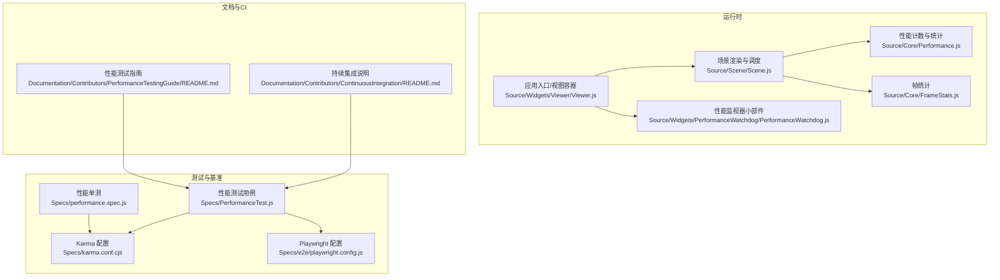
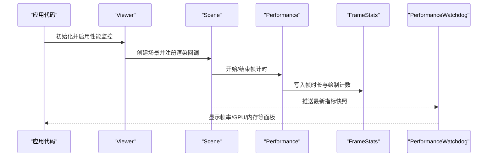
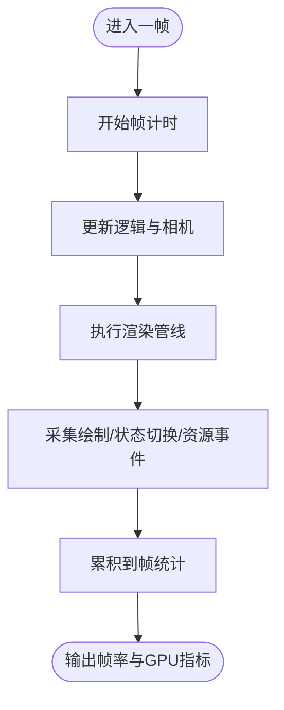
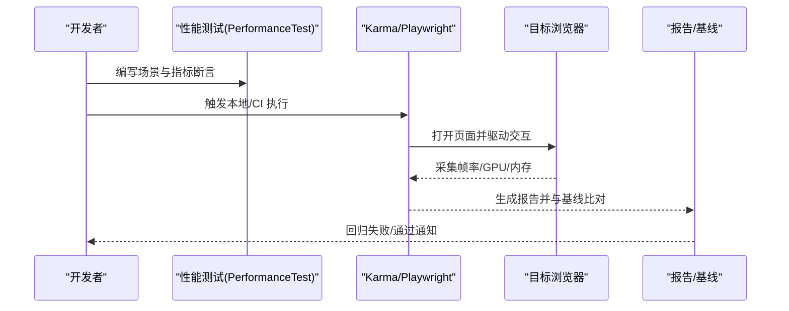
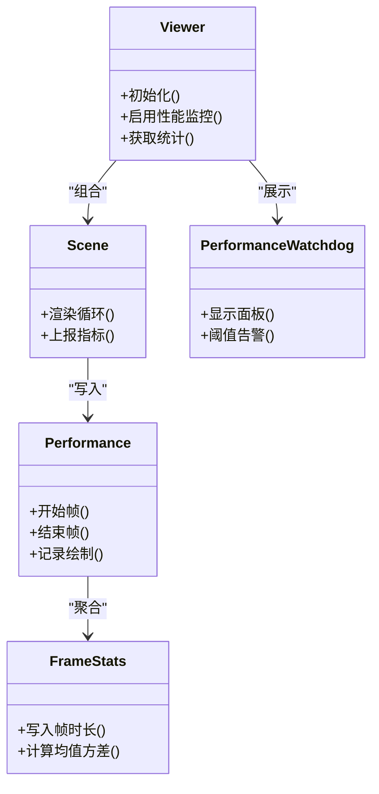

# 性能监控与分析

<cite>
**本文引用的文件**   
- [Performance.js](file://Source/Core/Performance.js)
- [FrameStats.js](file://Source/Core/FrameStats.js)
- [Scene.js](file://Source/Scene/Scene.js)
- [Viewer.js](file://Source/Widgets/Viewer/Viewer.js)
- [PerformanceWatchdog.js](file://Source/Widgets/PerformanceWatchdog/PerformanceWatchdog.js)
- [PerformanceTest.js](file://Specs/PerformanceTest.js)
- [performance.spec.js](file://Specs/performance.spec.js)
- [karma.conf.cjs](file://Specs/karma.conf.cjs)
- [playwright.config.js](file://Specs/e2e/playwright.config.js)
- [ContinuousIntegration/README.md](file://Documentation/Contributors/ContinuousIntegration/README.md)
- [PerformanceTestingGuide/README.md](file://Documentation/Contributors/PerformanceTestingGuide/README.md)
</cite>

## 目录
1. [简介](#简介)
2. [项目结构](#项目结构)
3. [核心组件](#核心组件)
4. [架构总览](#架构总览)
5. [详细组件分析](#详细组件分析)
6. [依赖关系分析](#依赖关系分析)
7. [性能考量](#性能考量)
8. [故障排查指南](#故障排查指南)
9. [结论](#结论)
10. [附录](#附录)

## 简介
本指南面向在 Cesium 中进行性能监控与优化的工程师，系统介绍内置性能监控工具的使用方法、瓶颈识别方法、基准测试构建与执行策略、常用分析工具配置以及持续集成实践。内容覆盖帧率监控、GPU 统计、内存使用分析、CPU/GPU/I/O 热点定位、自动化回归检测与 A/B 测试策略，并提供典型问题的诊断流程与优化建议。

## 项目结构
Cesium 的性能相关能力主要分布在以下位置：
- 运行时性能指标与统计：位于 Source/Core 下的性能模块（如帧统计、性能计数器）
- 渲染管线中的指标采集点：位于 Scene 层的关键绘制与调度阶段
- 开发者小部件：提供可视化面板与告警（如性能监视器）
- 测试与基准：Specs 下包含性能相关的单测与端到端脚本；文档 Contributors 下提供性能测试与 CI 指南

图表来源
- [Performance.js:1-200](file://Source/Core/Performance.js#L1-L200)
- [FrameStats.js:1-200](file://Source/Core/FrameStats.js#L1-L200)
- [Scene.js:1-300](file://Source/Scene/Scene.js#L1-L300)
- [Viewer.js:1-200](file://Source/Widgets/Viewer/Viewer.js#L1-L200)
- [PerformanceWatchdog.js:1-200](file://Source/Widgets/PerformanceWatchdog/PerformanceWatchdog.js#L1-L200)
- [PerformanceTest.js:1-200](file://Specs/PerformanceTest.js#L1-L200)
- [performance.spec.js:1-200](file://Specs/performance.spec.js#L1-L200)
- [karma.conf.cjs:1-200](file://Specs/karma.conf.cjs#L1-L200)
- [playwright.config.js:1-200](file://Specs/e2e/playwright.config.js#L1-L200)
- [ContinuousIntegration/README.md:1-200](file://Documentation/Contributors/ContinuousIntegration/README.md#L1-L200)
- [PerformanceTestingGuide/README.md:1-200](file://Documentation/Contributors/PerformanceTestingGuide/README.md#L1-L200)

章节来源
- [Performance.js:1-200](file://Source/Core/Performance.js#L1-L200)
- [FrameStats.js:1-200](file://Source/Core/FrameStats.js#L1-L200)
- [Scene.js:1-300](file://Source/Scene/Scene.js#L1-L300)
- [Viewer.js:1-200](file://Source/Widgets/Viewer/Viewer.js#L1-L200)
- [PerformanceWatchdog.js:1-200](file://Source/Widgets/PerformanceWatchdog/PerformanceWatchdog.js#L1-L200)
- [PerformanceTest.js:1-200](file://Specs/PerformanceTest.js#L1-L200)
- [performance.spec.js:1-200](file://Specs/performance.spec.js#L1-L200)
- [karma.conf.cjs:1-200](file://Specs/karma.conf.cjs#L1-L200)
- [playwright.config.js:1-200](file://Specs/e2e/playwright.config.js#L1-L200)
- [ContinuousIntegration/README.md:1-200](file://Documentation/Contributors/ContinuousIntegration/README.md#L1-L200)
- [PerformanceTestingGuide/README.md:1-200](file://Documentation/Contributors/PerformanceTestingGuide/README.md#L1-L200)

## 核心组件
- 性能计数与统计（Performance）
  - 负责收集与聚合运行时的关键指标，包括帧时间、绘制调用次数、状态切换等，供上层统计与可视化使用。
- 帧统计（FrameStats）
  - 维护每帧的时序数据与窗口化统计（均值、方差、分位数），用于计算稳定帧率与抖动评估。
- 场景渲染（Scene）
  - 在渲染循环中插入指标采集点，将底层 WebGL 调用与资源加载事件上报至性能子系统。
- 性能监视器小部件（PerformanceWatchdog）
  - 提供 UI 面板展示实时帧率、GPU/CPU 占用、内存峰值等，并支持阈值告警与导出。
- 应用入口（Viewer）
  - 组合场景与小部件，暴露统一的 API 以启用/禁用性能监控、读取统计结果。

章节来源
- [Performance.js:1-200](file://Source/Core/Performance.js#L1-L200)
- [FrameStats.js:1-200](file://Source/Core/FrameStats.js#L1-L200)
- [Scene.js:1-300](file://Source/Scene/Scene.js#L1-L300)
- [Viewer.js:1-200](file://Source/Widgets/Viewer/Viewer.js#L1-L200)
- [PerformanceWatchdog.js:1-200](file://Source/Widgets/PerformanceWatchdog/PerformanceWatchdog.js#L1-L200)

## 架构总览
下图展示了从应用启动到渲染循环中指标采集与可视化的整体流程。

图表来源
- [Viewer.js:1-200](file://Source/Widgets/Viewer/Viewer.js#L1-L200)
- [Scene.js:1-300](file://Source/Scene/Scene.js#L1-L300)
- [Performance.js:1-200](file://Source/Core/Performance.js#L1-L200)
- [FrameStats.js:1-200](file://Source/Core/FrameStats.js#L1-L200)
- [PerformanceWatchdog.js:1-200](file://Source/Widgets/PerformanceWatchdog/PerformanceWatchdog.js#L1-L200)

## 详细组件分析

### 帧率监控与 GPU 统计
- 帧率监控
  - 通过帧统计模块记录每帧耗时，计算滑动窗口内的平均帧率与抖动，帮助判断动画流畅度与卡顿分布。
- GPU 统计
  - 在渲染路径中统计 WebGL 绘制调用、状态切换、纹理上传等开销，结合浏览器 GPU 进程信息，定位 GPU 侧瓶颈。
- 内存使用分析
  - 跟踪纹理、几何体、模型等资源分配与释放，结合页面内存快照对比，识别泄漏与峰值风险。

图表来源
- [FrameStats.js:1-200](file://Source/Core/FrameStats.js#L1-L200)
- [Performance.js:1-200](file://Source/Core/Performance.js#L1-L200)
- [Scene.js:1-300](file://Source/Scene/Scene.js#L1-L300)

章节来源
- [FrameStats.js:1-200](file://Source/Core/FrameStats.js#L1-L200)
- [Performance.js:1-200](file://Source/Core/Performance.js#L1-L200)
- [Scene.js:1-300](file://Source/Scene/Scene.js#L1-L300)

### CPU 热点分析与 I/O 等待检测
- CPU 热点
  - 利用浏览器性能面板的时间线，结合 Cesium 自定义标记，识别主线程长任务与频繁 GC。
- I/O 等待
  - 关注网络请求与磁盘缓存命中情况，区分首屏加载与后续增量加载的阻塞点。
- 关联指标
  - 将帧内 CPU 时间与 GPU 时间对比，若 CPU 占比异常高，优先检查逻辑更新、坐标变换、样式计算等路径。

章节来源
- [Performance.js:1-200](file://Source/Core/Performance.js#L1-L200)
- [Scene.js:1-300](file://Source/Scene/Scene.js#L1-L300)

### 性能基准测试构建与执行
- 自动化测试框架
  - 基于 Karma 的单测与基于 Playwright 的端到端测试，可在不同浏览器与设备上复现性能场景。
- 性能回归检测
  - 将关键场景的帧率、绘制调用数、内存峰值作为断言条件，提交时自动比对基线，防止退化。
- A/B 测试策略
  - 在同一数据集上对比不同渲染参数或算法版本，统计显著性差异，辅助决策。

图表来源
- [PerformanceTest.js:1-200](file://Specs/PerformanceTest.js#L1-L200)
- [karma.conf.cjs:1-200](file://Specs/karma.conf.cjs#L1-L200)
- [playwright.config.js:1-200](file://Specs/e2e/playwright.config.js#L1-L200)

章节来源
- [PerformanceTest.js:1-200](file://Specs/PerformanceTest.js#L1-L200)
- [performance.spec.js:1-200](file://Specs/performance.spec.js#L1-L200)
- [karma.conf.cjs:1-200](file://Specs/karma.conf.cjs#L1-L200)
- [playwright.config.js:1-200](file://Specs/e2e/playwright.config.js#L1-L200)

### 性能分析工具配置与使用
- 浏览器开发者工具
  - 使用“性能”面板录制时间线，配合“内存”面板进行堆快照对比，定位内存增长与回收问题。
- Chrome Performance 面板
  - 开启 GPU 进程视图，观察绘制调用、着色器编译、纹理上传等阶段的耗时分布。
- 自定义指标收集
  - 在关键路径埋点，将业务指标（如瓦片加载耗时、特征查询延迟）汇入统一日志，便于跨端对比。

章节来源
- [PerformanceWatchdog.js:1-200](file://Source/Widgets/PerformanceWatchdog/PerformanceWatchdog.js#L1-L200)
- [Performance.js:1-200](file://Source/Core/Performance.js#L1-L200)

### 典型性能问题诊断流程与解决方案
- 低帧率且 GPU 占用高
  - 现象：绘制调用多、状态切换频繁。
  - 措施：合并批次、减少材质切换、降低阴影/反射质量、使用实例化渲染。
- 帧率波动大
  - 现象：平均帧率尚可但抖动明显。
  - 措施：避免主线程长任务、异步加载资源、预取与缓存瓦片。
- 内存持续增长
  - 现象：长时间运行后内存攀升。
  - 措施：及时销毁不再使用的对象、复用纹理与几何体、限制并发加载数量。
- I/O 阻塞导致卡顿
  - 现象：首屏或滚动时出现明显停顿。
  - 措施：启用压缩格式、CDN 加速、按需加载与懒加载、合理设置视锥剔除与细节层级。

章节来源
- [Scene.js:1-300](file://Source/Scene/Scene.js#L1-L300)
- [PerformanceWatchdog.js:1-200](file://Source/Widgets/PerformanceWatchdog/PerformanceWatchdog.js#L1-L200)

## 依赖关系分析
- 组件耦合
  - Viewer 组合 Scene 与 PerformanceWatchdog，形成“控制-渲染-可视化”的松耦合结构。
  - Scene 向 Performance 与 FrameStats 写入指标，二者对渲染路径侵入最小。
- 外部依赖
  - 浏览器 Web API（WebGL、PerformanceObserver、MemoryInfo）为指标来源。
  - 测试框架（Karma、Playwright）驱动多环境执行与数据采集。

图表来源
- [Viewer.js:1-200](file://Source/Widgets/Viewer/Viewer.js#L1-L200)
- [Scene.js:1-300](file://Source/Scene/Scene.js#L1-L300)
- [Performance.js:1-200](file://Source/Core/Performance.js#L1-L200)
- [FrameStats.js:1-200](file://Source/Core/FrameStats.js#L1-L200)
- [PerformanceWatchdog.js:1-200](file://Source/Widgets/PerformanceWatchdog/PerformanceWatchdog.js#L1-L200)

章节来源
- [Viewer.js:1-200](file://Source/Widgets/Viewer/Viewer.js#L1-L200)
- [Scene.js:1-300](file://Source/Scene/Scene.js#L1-L300)
- [Performance.js:1-200](file://Source/Core/Performance.js#L1-L200)
- [FrameStats.js:1-200](file://Source/Core/FrameStats.js#L1-L200)
- [PerformanceWatchdog.js:1-200](file://Source/Widgets/PerformanceWatchdog/PerformanceWatchdog.js#L1-L200)

## 性能考量
- 指标选择
  - 优先关注 P95/P99 帧时、绘制调用数、纹理上传字节数、内存峰值与增长率。
- 采样与开销
  - 在高负载场景下适度降采样，避免指标采集本身成为瓶颈。
- 环境与设备
  - 在不同 GPU 与 CPU 配置下验证稳定性，确保移动端与桌面端一致体验。
- 可观测性
  - 将关键指标接入统一监控平台，建立告警与趋势看板。

[本节为通用指导，不直接分析具体文件]

## 故障排查指南
- 快速定位
  - 使用性能监视器面板查看实时帧率与 GPU 占用，结合浏览器时间线确认热点函数。
- 回归定位
  - 运行性能回归测试，对比基线报告，定位引入退化的变更。
- 内存泄漏
  - 多次往返相同场景，比较堆快照差异，关注未释放的纹理与几何体引用。
- I/O 瓶颈
  - 检查网络瀑布图与缓存命中率，必要时调整加载策略与资源格式。

章节来源
- [PerformanceWatchdog.js:1-200](file://Source/Widgets/PerformanceWatchdog/PerformanceWatchdog.js#L1-L200)
- [PerformanceTest.js:1-200](file://Specs/PerformanceTest.js#L1-L200)
- [performance.spec.js:1-200](file://Specs/performance.spec.js#L1-L200)

## 结论
通过内置性能监控工具与完善的测试体系，Cesium 提供了从指标采集、可视化到回归检测的完整闭环。建议在开发过程中常态化启用性能面板与基准测试，结合浏览器分析工具与自定义埋点，持续优化渲染路径与资源管理，保障在多端与多设备上的稳定表现。

[本节为总结性内容，不直接分析具体文件]

## 附录
- 持续集成与性能测试
  - 参考持续集成与性能测试指南，了解如何在 CI 中执行性能用例、生成报告与阻断回归。

章节来源
- [ContinuousIntegration/README.md:1-200](file://Documentation/Contributors/ContinuousIntegration/README.md#L1-L200)
- [PerformanceTestingGuide/README.md:1-200](file://Documentation/Contributors/PerformanceTestingGuide/README.md#L1-L200)