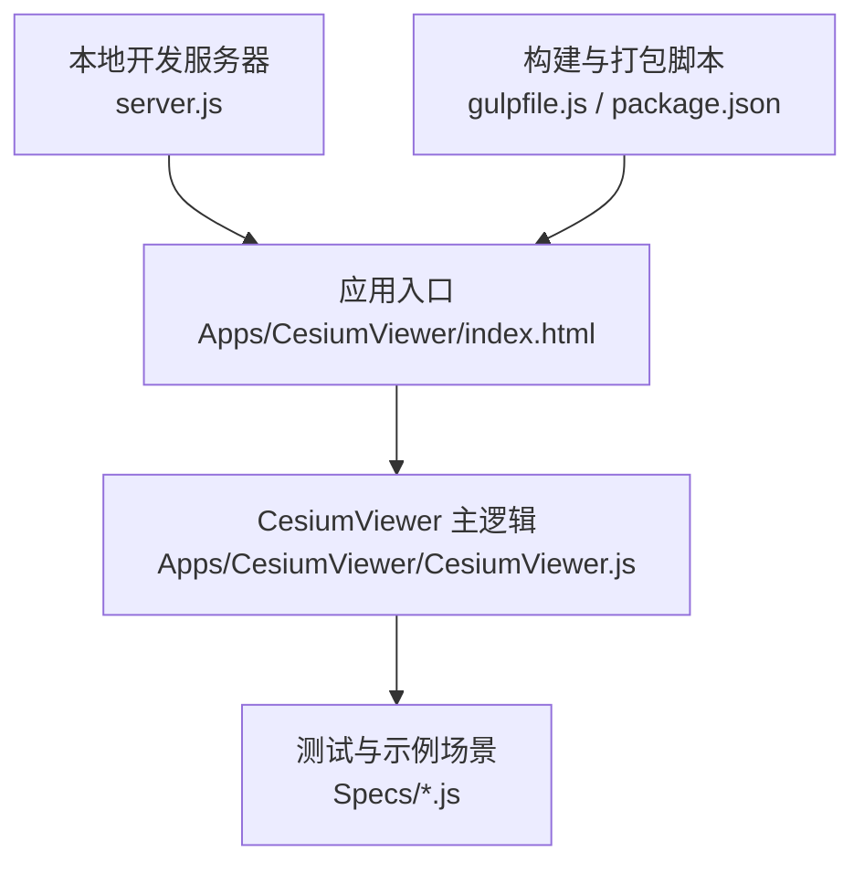
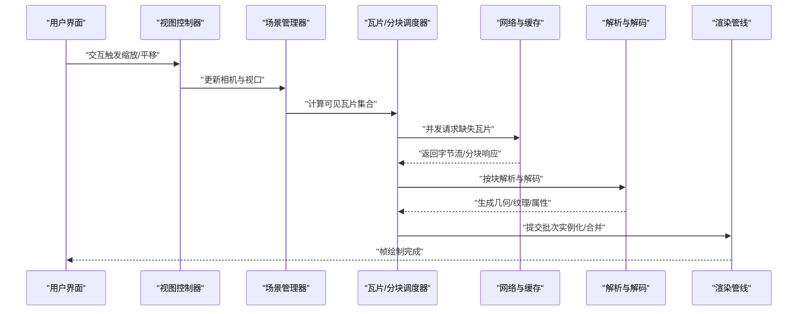
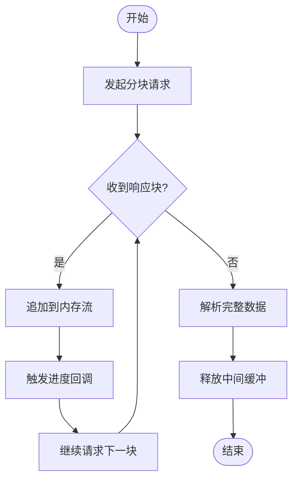
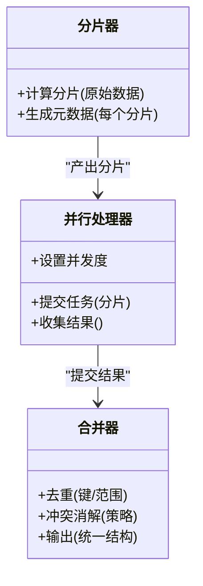
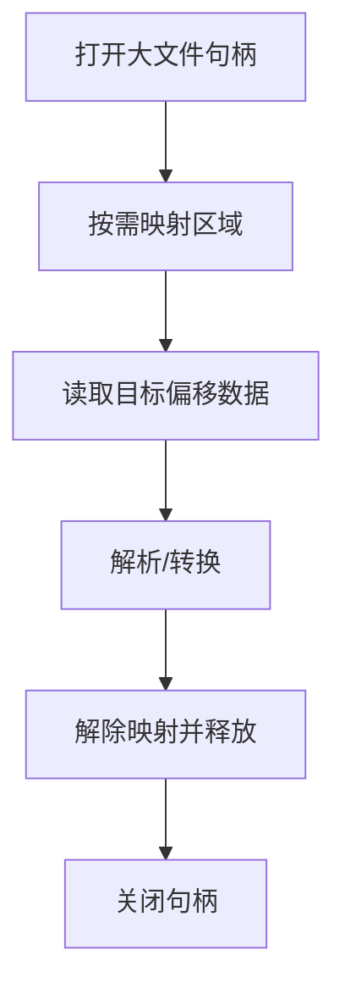
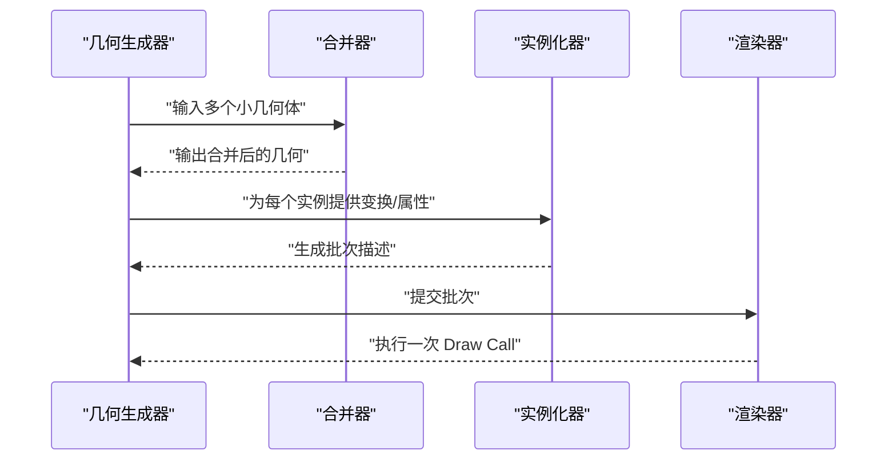
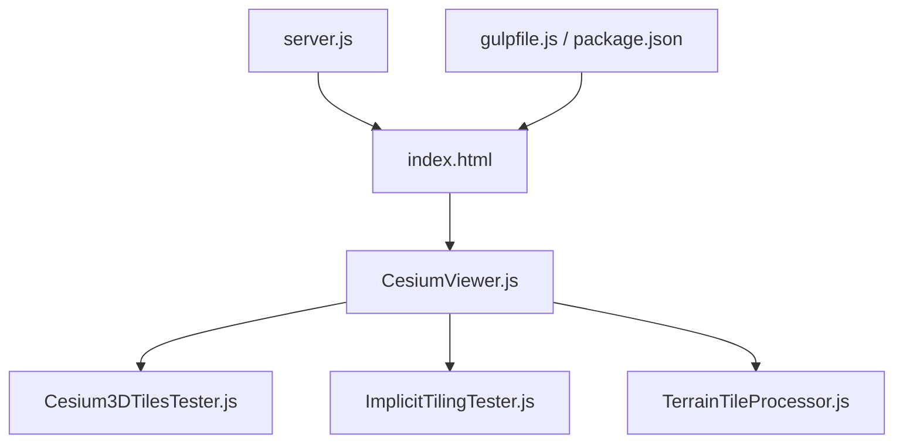

# 大数据集处理

<cite>
**本文引用的文件**   
- [README.md](file://README.md)
- [package.json](file://package.json)
- [server.js](file://server.js)
- [gulpfile.js](file://gulpfile.js)
- [CesiumViewer.js](file://Apps/CesiumViewer/CesiumViewer.js)
- [index.html](file://Apps/CesiumViewer/index.html)
- [createScene.js](file://Specs/createScene.js)
- [TerrainTileProcessor.js](file://Specs/TerrainTileProcessor.js)
- [Cesium3DTilesTester.js](file://Specs/Cesium3DTilesTester.js)
- [ImplicitTilingTester.js](file://Specs/ImplicitTilingTester.js)
</cite>

## 目录
1. [简介](#简介)
2. [项目结构](#项目结构)
3. [核心组件](#核心组件)
4. [架构总览](#架构总览)
5. [详细组件分析](#详细组件分析)
6. [依赖关系分析](#依赖关系分析)
7. [性能考量](#性能考量)
8. [故障排除指南](#故障排除指南)
9. [结论](#结论)
10. [附录](#附录)

## 简介
本技术文档聚焦于在 Cesium 生态中高效处理大数据集的方法与工程实践，涵盖流式加载、分块处理策略、内存映射思路、批处理渲染优化，以及海量点云、超大 3D 模型和高分辨率影像的专项方案。文档同时提供内存监控、性能分析与排障的实践案例，帮助读者在实际项目中构建稳定、可扩展的大数据可视化管线。

## 项目结构
仓库采用多包与示例分离的组织方式：
- 应用示例位于 Apps 目录，包含 CesiumViewer 演示入口与大量测试数据（3D Tiles、模型、矢量等）。
- Specs 目录包含测试场景与辅助工具，用于验证地形瓦片、3D Tiles、隐式瓦片等关键能力。
- 根级脚本与配置负责构建、打包与本地服务启动。

图表来源
- [index.html](file://Apps/CesiumViewer/index.html)
- [CesiumViewer.js](file://Apps/CesiumViewer/CesiumViewer.js)
- [server.js](file://server.js)
- [gulpfile.js](file://gulpfile.js)
- [package.json](file://package.json)

章节来源
- [README.md](file://README.md)
- [package.json](file://package.json)
- [server.js](file://server.js)
- [gulpfile.js](file://gulpfile.js)
- [CesiumViewer.js](file://Apps/CesiumViewer/CesiumViewer.js)
- [index.html](file://Apps/CesiumViewer/index.html)

## 核心组件
围绕大数据集处理的关键组件与职责如下：
- 资源加载与网络层：负责 HTTP 请求、缓存、重试与进度回调，支撑流式下载与断点续传。
- 瓦片与分块管理：基于 3D Tiles 或自定义分块协议，实现按需加载、LOD 切换与可见性裁剪。
- 解析与解码器：对二进制格式进行零拷贝或低拷贝解析，支持 Draco、KTX2 等压缩格式。
- 几何与实例化渲染：将分块数据转换为 GPU 可消费的结构，使用实例化与合并减少 Draw Call。
- 内存与生命周期管理：控制对象创建、引用计数与释放，避免峰值内存抖动。
- 可视性与调度：根据相机状态、视锥体与距离阈值动态调度加载与卸载。

章节来源
- [Cesium3DTilesTester.js](file://Specs/Cesium3DTilesTester.js)
- [ImplicitTilingTester.js](file://Specs/ImplicitTilingTester.js)
- [TerrainTileProcessor.js](file://Specs/TerrainTileProcessor.js)

## 架构总览
下图展示了从浏览器到 GPU 的数据路径，突出流式加载、分块处理与批渲染的关键环节。

图表来源
- [CesiumViewer.js](file://Apps/CesiumViewer/CesiumViewer.js)
- [Cesium3DTilesTester.js](file://Specs/Cesium3DTilesTester.js)
- [ImplicitTilingTester.js](file://Specs/ImplicitTilingTester.js)
- [TerrainTileProcessor.js](file://Specs/TerrainTileProcessor.js)

## 详细组件分析

### 流式加载与分块读取
- 分块读取：通过 Range 请求或分块传输协议，将大文件切分为固定大小的块，逐块写入内存缓冲区，降低首屏延迟与峰值内存占用。
- 进度回调：在下载阶段暴露进度事件，便于 UI 展示百分比、剩余时间与取消操作。
- 内存流处理：使用环形缓冲或分段数组聚合小块，避免频繁分配；在解析完成后及时释放中间缓冲。

章节来源
- [CesiumViewer.js](file://Apps/CesiumViewer/CesiumViewer.js)
- [Cesium3DTilesTester.js](file://Specs/Cesium3DTilesTester.js)

### 分块处理策略
- 数据分片算法：依据空间索引（如四叉树/八叉树）或时间序列划分，保证每块具备独立边界与元数据，便于并行与增量更新。
- 并行处理：限制并发度以避免阻塞主线程；优先处理近景与高优先级瓦片。
- 结果合并机制：在合并前进行去重与冲突消解，确保最终几何与属性的完整性与一致性。

章节来源
- [ImplicitTilingTester.js](file://Specs/ImplicitTilingTester.js)
- [Cesium3DTilesTester.js](file://Specs/Cesium3DTilesTester.js)

### 内存映射与虚拟内存管理
- 虚拟内存管理：在大文件访问场景中，优先使用流式与按需映射，避免一次性载入整个文件。
- 大文件访问优化：结合偏移量与长度参数定位数据片段，配合零拷贝解析减少复制开销。
- 垃圾回收策略：显式释放不再使用的缓冲与纹理；对临时对象采用池化复用，降低 GC 压力。

章节来源
- [TerrainTileProcessor.js](file://Specs/TerrainTileProcessor.js)

### 批处理渲染优化
- 实例化渲染：将相同几何体以实例形式批量提交，显著降低 CPU 到 GPU 的传输与驱动开销。
- 几何体合并：对静态且同材质的小几何体进行合并，减少顶点与索引重复。
- Draw Call 优化：按材质与着色器分组，合并批次，避免频繁切换状态。

章节来源
- [Cesium3DTilesTester.js](file://Specs/Cesium3DTilesTester.js)

### 海量点云数据处理
- 分块与 LOD：按空间范围与分辨率分层，近处高精度、远处低精度。
- 压缩与编码：颜色与法线采用量化或编码压缩，减小体积。
- 渲染策略：使用点精灵与批渲染，必要时启用深度预通或遮挡剔除。

章节来源
- [Cesium3DTilesTester.js](file://Specs/Cesium3DTilesTester.js)

### 超大 3D 模型处理
- 模型拆分：按部件或层级拆分为子资源，按需加载。
- 纹理与材质：使用 KTX2 等压缩纹理，按需加载不同 mip 级别。
- 动画与蒙皮：仅加载当前可见骨骼与关键帧，延迟初始化复杂动画。

章节来源
- [CesiumViewer.js](file://Apps/CesiumViewer/CesiumViewer.js)

### 高分辨率影像处理
- 金字塔与瓦片：构建多级分辨率瓦片，按视口动态选择合适层级。
- 流式拼接：边缘融合与色彩校正，避免拼接缝。
- 缓存策略：LRU 或基于访问频率的缓存，平衡命中率与内存占用。

章节来源
- [TerrainTileProcessor.js](file://Specs/TerrainTileProcessor.js)

## 依赖关系分析
- 应用入口依赖 CesiumViewer 主逻辑，后者协调场景、瓦片与渲染。
- 测试与示例模块提供关键能力的验证与基准，辅助定位性能瓶颈。
- 构建与服务器脚本为开发与调试提供基础设施。

图表来源
- [index.html](file://Apps/CesiumViewer/index.html)
- [CesiumViewer.js](file://Apps/CesiumViewer/CesiumViewer.js)
- [Cesium3DTilesTester.js](file://Specs/Cesium3DTilesTester.js)
- [ImplicitTilingTester.js](file://Specs/ImplicitTilingTester.js)
- [TerrainTileProcessor.js](file://Specs/TerrainTileProcessor.js)
- [server.js](file://server.js)
- [gulpfile.js](file://gulpfile.js)
- [package.json](file://package.json)

章节来源
- [CesiumViewer.js](file://Apps/CesiumViewer/CesiumViewer.js)
- [Cesium3DTilesTester.js](file://Specs/Cesium3DTilesTester.js)
- [ImplicitTilingTester.js](file://Specs/ImplicitTilingTester.js)
- [TerrainTileProcessor.js](file://Specs/TerrainTileProcessor.js)
- [server.js](file://server.js)
- [gulpfile.js](file://gulpfile.js)
- [package.json](file://package.json)

## 性能考量
- 并发与背压：合理设置最大并发数，避免网络拥塞与主线程阻塞。
- 内存峰值控制：限制单帧分配总量，采用对象池与零拷贝解析。
- 渲染成本：合并批次、减少状态切换，利用实例化与几何合并。
- 缓存命中：对瓦片、纹理与常用对象建立分级缓存，提升命中率。
- 渐进式体验：优先加载近景与关键内容，后台异步处理远景与次要资源。

## 故障排除指南
- 加载卡顿：检查并发队列是否饱和，确认是否存在同步阻塞调用。
- 内存泄漏：追踪未释放的缓冲与纹理，确认生命周期是否正确结束。
- 渲染掉帧：统计 Draw Call 数量与批次大小，优化合并策略。
- 瓦片缺失或闪烁：校验瓦片元数据与边界，确保可见性判断一致。
- 解码失败：验证压缩格式与版本兼容性，增加错误回退与重试。

章节来源
- [Cesium3DTilesTester.js](file://Specs/Cesium3DTilesTester.js)
- [ImplicitTilingTester.js](file://Specs/ImplicitTilingTester.js)
- [TerrainTileProcessor.js](file://Specs/TerrainTileProcessor.js)

## 结论
通过流式加载、分块处理、内存映射与批渲染的组合策略，可在浏览器环境中高效承载海量点云、超大模型与高分辨率影像。关键在于合理的分片与调度、严格的内存管理与持续的渲染优化。建议在生产环境引入完善的监控与指标采集，持续迭代以提升稳定性与用户体验。

## 附录
- 参考入口与示例：
  - 应用入口与主逻辑：[index.html](file://Apps/CesiumViewer/index.html)、[CesiumViewer.js](file://Apps/CesiumViewer/CesiumViewer.js)
  - 3D Tiles 与隐式瓦片测试：[Cesium3DTilesTester.js](file://Specs/Cesium3DTilesTester.js)、[ImplicitTilingTester.js](file://Specs/ImplicitTilingTester.js)
  - 地形瓦片处理：[TerrainTileProcessor.js](file://Specs/TerrainTileProcessor.js)
  - 构建与服务：[gulpfile.js](file://gulpfile.js)、[package.json](file://package.json)、[server.js](file://server.js)