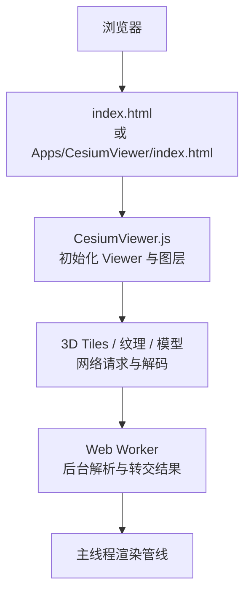
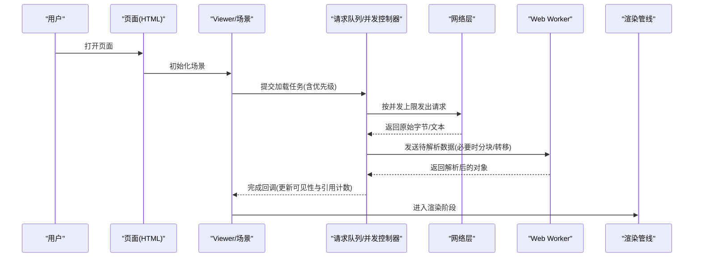
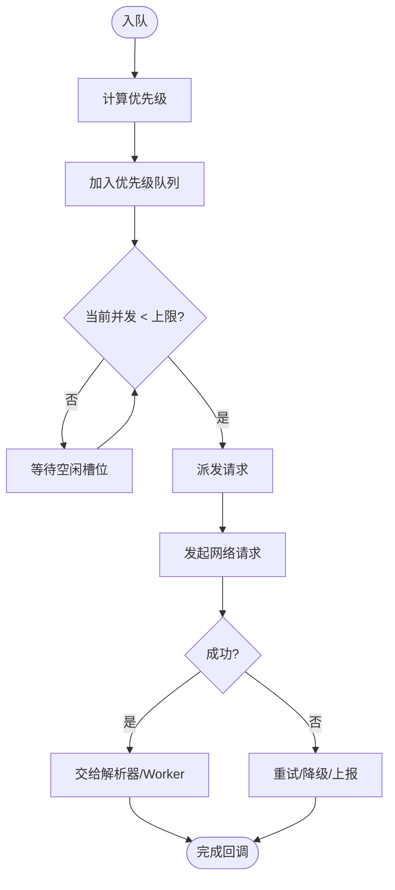
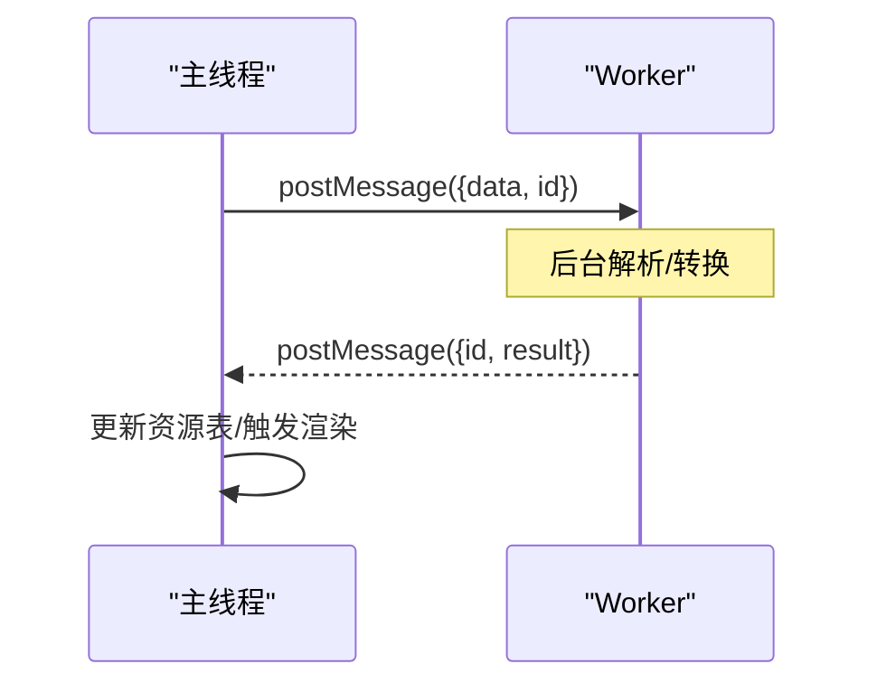
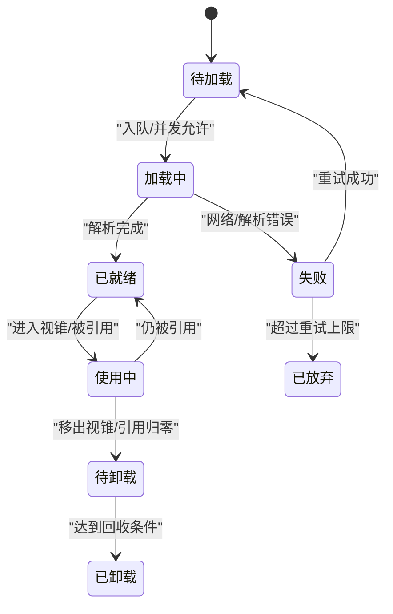
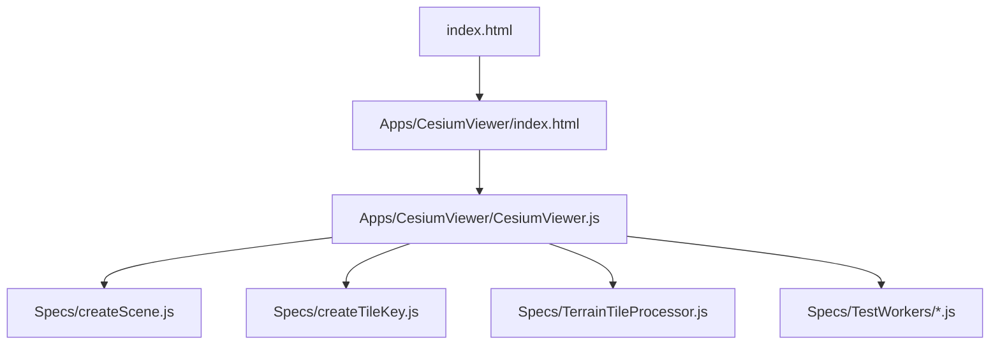

# 异步加载策略

<cite>
**本文引用的文件**   
- [package.json](file://package.json)
- [server.js](file://server.js)
- [index.html](file://index.html)
- [Apps/HelloWorld.html](file://Apps/HelloWorld.html)
- [Apps/CesiumViewer/CesiumViewer.js](file://Apps/CesiumViewer/CesiumViewer.js)
- [Apps/CesiumViewer/index.html](file://Apps/CesiumViewer/index.html)
- [Specs/createScene.js](file://Specs/createScene.js)
- [Specs/createTileKey.js](file://Specs/createTileKey.js)
- [Specs/TerrainTileProcessor.js](file://Specs/TerrainTileProcessor.js)
- [Specs/TestWorkers/returnByteLength.js](file://Specs/TestWorkers/returnByteLength.js)
- [Specs/TestWorkers/throwError.js](file://Specs/TestWorkers/throwError.js)
- [Specs/TestWorkers/transferArrayBuffer.js](file://Specs/TestWorkers/transferArrayBuffer.js)
</cite>

## 目录
1. [简介](#简介)
2. [项目结构](#项目结构)
3. [核心组件](#核心组件)
4. [架构总览](#架构总览)
5. [详细组件分析](#详细组件分析)
6. [依赖关系分析](#依赖关系分析)
7. [性能考量](#性能考量)
8. [故障排查指南](#故障排查指南)
9. [结论](#结论)
10. [附录](#附录) 

## 简介
本文件围绕 Cesium 的“异步加载策略”进行系统化说明，重点覆盖：
- 请求队列与并发控制（任务优先级、并发上限）
- Web Worker 的使用模式（后台解析、主线程通信）
- 资源生命周期管理（预加载、懒加载、动态卸载）
- 关键配置项（最大并发数、超时、缓存策略）
- 自定义加载器、状态监控与失败处理示例路径
- 针对 3D Tiles、纹理、模型等数据类型的异步优化技巧

为便于读者理解，文档在概念层面给出流程与架构图示，并在需要时提供与仓库中实际文件对应的来源标注。

## 项目结构
仓库包含应用示例、测试样例与构建脚本等。与异步加载相关的入口与示例主要位于 Apps 与 Specs 目录：
- Apps/CesiumViewer：演示如何初始化场景并加载 3D Tiles 等资源
- Apps/HelloWorld：最小化示例页面
- Specs：测试与辅助工具，包含 Worker 测试用例、地形瓦片处理器等

图表来源 
- [Apps/CesiumViewer/index.html](file://Apps/CesiumViewer/index.html)
- [Apps/CesiumViewer/CesiumViewer.js](file://Apps/CesiumViewer/CesiumViewer.js)
- [index.html](file://index.html)

章节来源
- [package.json:1-50](file://package.json#L1-L50)
- [server.js:1-50](file://server.js#L1-L50)
- [index.html:1-50](file://index.html#L1-L50)
- [Apps/HelloWorld.html:1-50](file://Apps/HelloWorld.html#L1-L50)
- [Apps/CesiumViewer/index.html:1-50](file://Apps/CesiumViewer/index.html#L1-L50)
- [Apps/CesiumViewer/CesiumViewer.js:1-50](file://Apps/CesiumViewer/CesiumViewer.js#L1-L50)

## 核心组件
本节从系统视角梳理与异步加载相关的关键职责与交互点：
- 资源调度与并发控制：由上层模块负责发起请求、维护队列与并发上限
- 数据解析与解码：通过 Web Worker 在后台执行，避免阻塞主线程
- 生命周期管理：根据可视性、LOD 与内存压力决定预取、延迟与卸载
- 错误与重试：对网络异常、解析失败进行统一捕获与重试策略
- 监控与可观测性：暴露进度、状态与统计指标，便于诊断与调优

[本节为概念性总结，不直接分析具体文件]

## 架构总览
下图展示从页面到渲染的主干流程，以及 Worker 在其中的角色。该图为概念图，用于帮助理解整体机制。

[此图为概念流程图，未映射到具体源码文件，故无图表来源]

## 详细组件分析

### 请求队列与并发控制
- 任务优先级：通常依据距离相机远近、几何误差阈值、是否遮挡等计算优先级，优先调度高价值任务
- 并发限制：通过令牌桶或信号量控制同时进行的 I/O 数量，避免拥塞与抖动
- 去重与合并：相同 URL 的请求应去重；相近时间窗内的重复请求可合并
- 背压与退避：当队列积压或错误率升高时，降低新任务入队速率或引入指数退避

[此图为概念流程图，未映射到具体源码文件，故无图表来源]

章节来源
- [Specs/createTileKey.js:1-50](file://Specs/createTileKey.js#L1-L50)

### Web Worker 使用模式
- 适用场景：大体积二进制解析、JSON 反序列化、压缩格式解压、纹理/几何预处理
- 通信方式：postMessage 传递结构化克隆数据；大数据使用 Transferable 对象零拷贝传输
- 错误隔离：Worker 内抛错不会导致主线程崩溃，需显式捕获并上报
- 资源释放：及时关闭不再使用的 Worker 实例，避免泄漏

章节来源
- [Specs/TestWorkers/returnByteLength.js:1-50](file://Specs/TestWorkers/returnByteLength.js#L1-L50)
- [Specs/TestWorkers/throwError.js:1-50](file://Specs/TestWorkers/throwError.js#L1-L50)
- [Specs/TestWorkers/transferArrayBuffer.js:1-50](file://Specs/TestWorkers/transferArrayBuffer.js#L1-L50)

### 资源生命周期管理
- 预加载：基于视锥体与 LOD 预测，提前拉取下一层级或相邻区域资源
- 懒加载：仅在资源即将可见或需要交互时再加载，减少首屏开销
- 动态卸载：根据引用计数、内存水位与时间衰减策略回收不可见资源
- 共享与复用：纹理、材质、几何体等跨节点共享，避免重复分配

[此图为概念状态图，未映射到具体源码文件，故无图表来源]

### 配置选项说明
以下为常见可调参数及其作用建议（以概念为主，具体实现以实际库为准）：
- 最大并发数：控制同时进行的网络请求数量，平衡吞吐与稳定性
- 超时设置：单个请求的最大等待时间，避免长时间挂起
- 重试策略：最大重试次数、退避间隔、失败回退方案
- 缓存策略：URL 级缓存、内存缓存、TTL 过期、失效条件
- 带宽与节流：按设备能力与网络类型调整并发与分块大小
- 日志与监控：采样级别、上报通道、关键指标埋点

[本节为通用配置说明，不直接分析具体文件]

### 自定义加载器与监控示例路径
- 自定义加载器：可在应用层封装统一的 fetch/XMLHttpRequest 调用，注入鉴权头、代理、重试与超时逻辑
- 状态监控：监听加载开始、进度、完成、失败事件，聚合统计耗时与成功率
- 失败处理：区分网络错误、权限错误、解析错误，采取不同恢复策略（如降级分辨率、切换 CDN、提示用户）

章节来源
- [Apps/CesiumViewer/CesiumViewer.js:1-50](file://Apps/CesiumViewer/CesiumViewer.js#L1-L50)
- [Specs/TerrainTileProcessor.js:1-50](file://Specs/TerrainTileProcessor.js#L1-L50)

### 数据类型异步优化技巧
- 3D Tiles
  - 按需加载 tileset.json 与子瓦片，结合视锥裁剪与几何误差阈值
  - 利用隐式瓦片与批处理减少请求数量
  - 对内容采用流式解析与增量构建，避免一次性占用过多内存
- 纹理
  - 使用 KTX2/BasisU 等现代纹理格式，减小体积并提升 GPU 解压效率
  - 按显示尺寸选择合适 mip 层级，避免过度采样
  - 纹理池化与共享，减少重复创建
- 模型（glTF/GLB）
  - 启用 Draco/Meshopt 压缩，降低下载体积
  - 将动画、材质、纹理解耦，按需加载
  - 对大型模型进行分块或实例化，配合 LOD 与遮挡剔除

[本节为通用优化建议，不直接分析具体文件]

## 依赖关系分析
- 应用入口与示例
  - index.html 与 Apps/CesiumViewer/index.html 作为页面入口
  - Apps/CesiumViewer/CesiumViewer.js 负责初始化场景与加载资源
- 测试与工具
  - Specs 下包含 Worker 测试与地形瓦片处理示例，有助于理解异步与解析流程

图表来源 
- [index.html:1-50](file://index.html#L1-L50)
- [Apps/CesiumViewer/index.html:1-50](file://Apps/CesiumViewer/index.html#L1-L50)
- [Apps/CesiumViewer/CesiumViewer.js:1-50](file://Apps/CesiumViewer/CesiumViewer.js#L1-L50)
- [Specs/createScene.js:1-50](file://Specs/createScene.js#L1-L50)
- [Specs/createTileKey.js:1-50](file://Specs/createTileKey.js#L1-L50)
- [Specs/TerrainTileProcessor.js:1-50](file://Specs/TerrainTileProcessor.js#L1-L50)
- [Specs/TestWorkers/returnByteLength.js:1-50](file://Specs/TestWorkers/returnByteLength.js#L1-L50)
- [Specs/TestWorkers/throwError.js:1-50](file://Specs/TestWorkers/throwError.js#L1-L50)
- [Specs/TestWorkers/transferArrayBuffer.js:1-50](file://Specs/TestWorkers/transferArrayBuffer.js#L1-L50)

章节来源
- [package.json:1-50](file://package.json#L1-L50)
- [server.js:1-50](file://server.js#L1-L50)
- [index.html:1-50](file://index.html#L1-L50)
- [Apps/HelloWorld.html:1-50](file://Apps/HelloWorld.html#L1-L50)
- [Apps/CesiumViewer/index.html:1-50](file://Apps/CesiumViewer/index.html#L1-L50)
- [Apps/CesiumViewer/CesiumViewer.js:1-50](file://Apps/CesiumViewer/CesiumViewer.js#L1-L50)
- [Specs/createScene.js:1-50](file://Specs/createScene.js#L1-L50)
- [Specs/createTileKey.js:1-50](file://Specs/createTileKey.js#L1-L50)
- [Specs/TerrainTileProcessor.js:1-50](file://Specs/TerrainTileProcessor.js#L1-L50)
- [Specs/TestWorkers/returnByteLength.js:1-50](file://Specs/TestWorkers/returnByteLength.js#L1-L50)
- [Specs/TestWorkers/throwError.js:1-50](file://Specs/TestWorkers/throwError.js#L1-L50)
- [Specs/TestWorkers/transferArrayBuffer.js:1-50](file://Specs/TestWorkers/transferArrayBuffer.js#L1-L50)

## 性能考量
- 合理设置并发上限，避免 CPU/IO 争用导致的抖动
- 使用 Transferable 对象传输大数据，减少拷贝开销
- 对频繁访问的资源建立内存缓存，并设置合理的 TTL 与容量上限
- 对大模型与大纹理采用渐进式加载与分块解码
- 开启服务端压缩与 HTTP/2 多路复用，降低 RTT 与带宽占用
- 监控关键指标：请求延迟、解析耗时、GPU 内存峰值、帧率波动

[本节为通用指导，不直接分析具体文件]

## 故障排查指南
- 常见问题定位
  - 网络超时/失败：检查超时配置、重试策略与服务器可达性
  - 解析失败：确认 Worker 是否正确接收与返回数据，关注 Transferable 使用
  - 内存泄漏：核查 Worker 实例与资源引用是否及时释放
- 调试手段
  - 在 Worker 中捕获并上报错误信息
  - 记录请求 ID、URL、耗时与状态码，形成链路追踪
  - 使用浏览器开发者工具的 Performance 面板观察主线程与 Worker 活动

章节来源
- [Specs/TestWorkers/throwError.js:1-50](file://Specs/TestWorkers/throwError.js#L1-L50)
- [Specs/TestWorkers/transferArrayBuffer.js:1-50](file://Specs/TestWorkers/transferArrayBuffer.js#L1-L50)

## 结论
通过合理的请求队列与并发控制、Worker 后台解析、完善的生命周期管理与可观测性建设，可以显著提升 Cesium 应用在大规模 3D 数据下的加载性能与用户体验。建议在生产环境中结合业务特征持续调优并发、超时、缓存与 Worker 策略，并建立完善的监控与告警体系。

[本节为总结性内容，不直接分析具体文件]

## 附录
- 参考入口与示例
  - 页面入口：[index.html](file://index.html)
  - 示例应用：[Apps/CesiumViewer/index.html](file://Apps/CesiumViewer/index.html)、[Apps/CesiumViewer/CesiumViewer.js](file://Apps/CesiumViewer/CesiumViewer.js)
  - 最小示例：[Apps/HelloWorld.html](file://Apps/HelloWorld.html)
- 测试与工具
  - 场景构造：[Specs/createScene.js](file://Specs/createScene.js)
  - 瓦片键生成：[Specs/createTileKey.js](file://Specs/createTileKey.js)
  - 地形瓦片处理：[Specs/TerrainTileProcessor.js](file://Specs/TerrainTileProcessor.js)
  - Worker 测试用例：
    - [Specs/TestWorkers/returnByteLength.js](file://Specs/TestWorkers/returnByteLength.js)
    - [Specs/TestWorkers/throwError.js](file://Specs/TestWorkers/throwError.js)
    - [Specs/TestWorkers/transferArrayBuffer.js](file://Specs/TestWorkers/transferArrayBuffer.js)