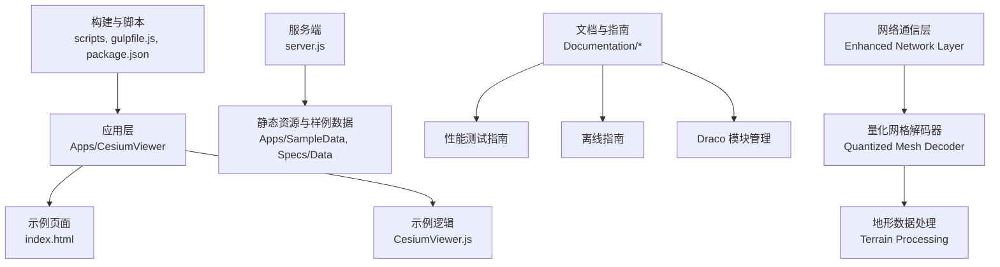
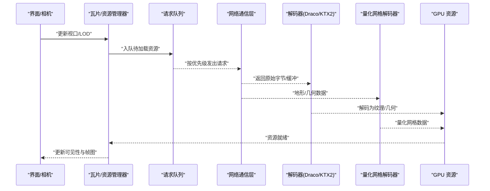
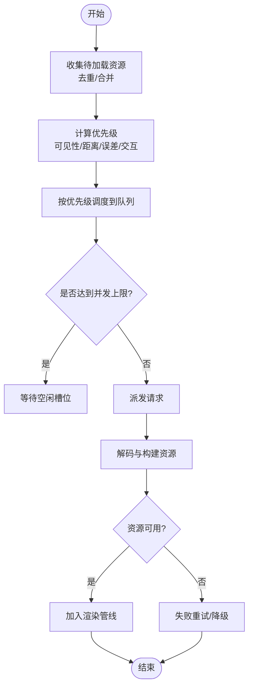
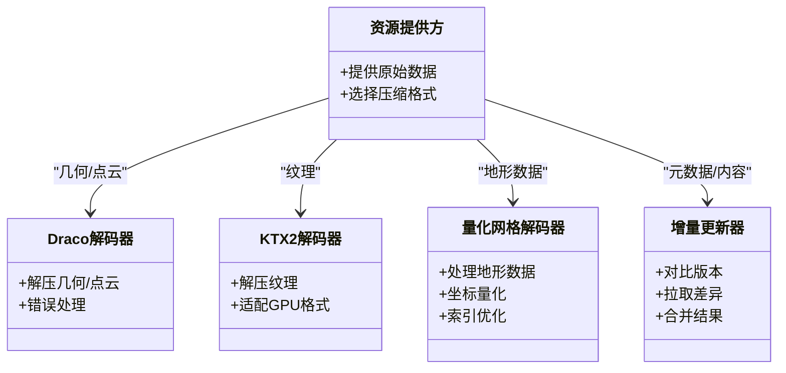
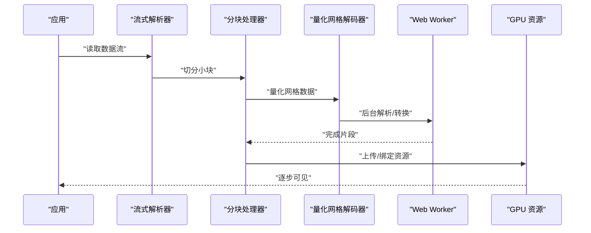
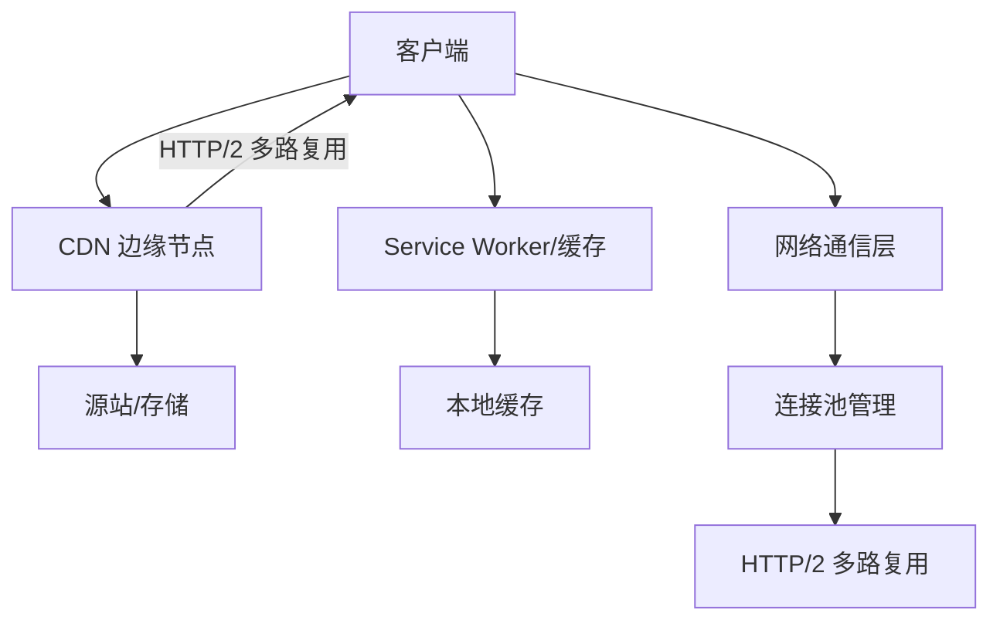
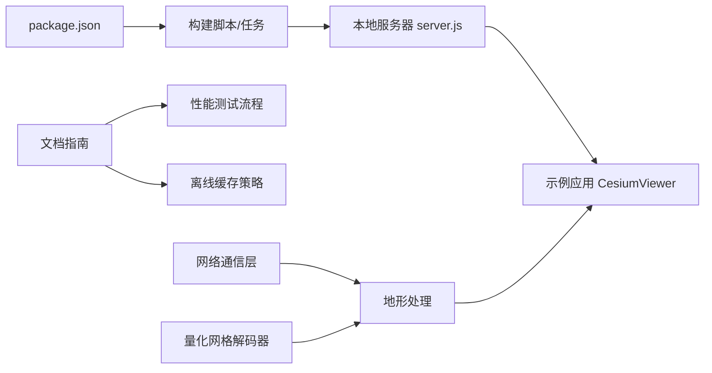

# 数据加载优化

<cite>
**本文引用的文件**   
- [README.md](file://README.md)
- [PerformanceTestingGuide/README.md](file://Documentation/Contributors/PerformanceTestingGuide/README.md)
- [DracoModuleManagement/README.md](file://Documentation/Contributors/DracoModuleManagement/README.md)
- [OfflineGuide/README.md](file://Documentation/OfflineGuide/README.md)
- [CesiumViewer.js](file://Apps/CesiumViewer/CesiumViewer.js)
- [index.html](file://Apps/CesiumViewer/index.html)
- [server.js](file://server.js)
- [package.json](file://package.json)
</cite>

## 更新摘要
**所做更改**   
- 新增网络通信层增强功能，支持高效的数据传输和连接管理
- 引入量化网格解码器，优化地形和几何数据的处理性能
- 更新异步加载策略以支持新的网络层架构
- 增强数据压缩与传输优化部分，包含新的解码器集成

## 目录
1. [简介](#简介)
2. [项目结构](#项目结构)
3. [核心组件](#核心组件)
4. [架构总览](#架构总览)
5. [详细组件分析](#详细组件分析)
6. [依赖分析](#依赖分析)
7. [性能考虑](#性能考虑)
8. [故障排查指南](#故障排查指南)
9. [结论](#结论)
10. [附录](#附录)

## 简介
本文件面向在 Cesium 中实现大规模三维数据高效加载的工程师与架构师，围绕异步加载策略、数据压缩与传输优化、瓦片加载策略、大数据集处理技巧以及网络优化技术进行系统化说明。文档同时结合仓库中的示例应用与测试指南，给出可落地的最佳实践与性能评测方法。

**更新** 新增了网络通信层和量化网格解码器的详细说明，这些组件显著提升了地形和几何数据的处理效率。

## 项目结构
仓库采用多包与示例分离的组织方式：
- Apps：示例应用（如 CesiumViewer）
- Documentation：贡献者文档与指南（含性能测试、离线使用、Draco 模块管理等）
- Source：源码入口与版权头
- Specs：测试用例与测试数据（包含大量 3DTiles、模型、地形等样例）
- Tools：构建与文档生成工具链
- Scripts：构建脚本与辅助工具
- packages：引擎、小部件等子包

图表来源
- [CesiumViewer.js](file://Apps/CesiumViewer/CesiumViewer.js)
- [index.html](file://Apps/CesiumViewer/index.html)
- [server.js](file://server.js)
- [PerformanceTestingGuide/README.md](file://Documentation/Contributors/PerformanceTestingGuide/README.md)
- [OfflineGuide/README.md](file://Documentation/OfflineGuide/README.md)
- [DracoModuleManagement/README.md](file://Documentation/Contributors/DracoModuleManagement/README.md)

章节来源
- [README.md](file://README.md)
- [package.json](file://package.json)

## 核心组件
- 示例应用与页面
  - 示例应用入口与交互逻辑位于示例目录，负责初始化场景、加载 3D Tiles、模型与纹理等资源，便于演示不同数据格式与压缩方式的加载效果。
- 本地开发服务器
  - 提供静态资源服务，支持跨域与常见 MIME 类型，便于本地调试与性能观测。
- 文档与指南
  - 性能测试指南：定义基准指标、测试流程与报告输出建议。
  - 离线指南：介绍离线缓存策略与服务端配置要点。
  - Draco 模块管理：说明 Draco 解码器集成与按需加载注意事项。
- **新增** 网络通信层
  - 提供高效的网络连接管理和数据传输机制，支持连接池、重试策略和错误恢复。
- **新增** 量化网格解码器
  - 专门用于处理地形和几何数据，通过量化技术减少内存占用并提升解码速度。

章节来源
- [CesiumViewer.js](file://Apps/CesiumViewer/CesiumViewer.js)
- [index.html](file://Apps/CesiumViewer/index.html)
- [server.js](file://server.js)
- [PerformanceTestingGuide/README.md](file://Documentation/Contributors/PerformanceTestingGuide/README.md)
- [OfflineGuide/README.md](file://Documentation/OfflineGuide/README.md)
- [DracoModuleManagement/README.md](file://Documentation/Contributors/DracoModuleManagement/README.md)

## 架构总览
从"请求—调度—解析—渲染"的角度看，Cesium 的数据加载链路包括：
- 请求发起：由资源提供者或瓦片管理器触发
- 并发控制：基于浏览器并发限制与内部队列进行限流
- 优先级调度：根据可见性、几何误差、用户交互等因素排序
- 解码与构建：对 Draco/KTX2 等格式进行解码，构建 GPU 资源
- 渲染提交：将可用资源加入帧图并参与绘制

**更新** 新增了网络通信层和量化网格解码器，形成了更完整的数据处理流水线。

[此图为概念流程图，不直接映射具体源文件，故无图表来源]

## 详细组件分析

### 异步加载策略：请求队列、并发控制与优先级调度
- 请求队列管理
  - 将资源请求统一纳入队列，避免瞬时风暴；支持去重、取消与重试。
- 并发控制
  - 依据浏览器默认并发上限与设备能力动态调整并行度，防止阻塞主线程与网络栈。
- 优先级调度
  - 以"可见性 + 距离 + 几何误差 + 用户交互"综合评分，优先加载近景与关键内容。

**更新** 网络通信层的引入使得请求管理更加智能，支持连接复用和智能重试机制。

[此图为概念流程图，不直接映射具体源文件，故无图表来源]

章节来源
- [PerformanceTestingGuide/README.md](file://Documentation/Contributors/PerformanceTestingGuide/README.md)

### 数据压缩与传输优化：Draco、KTX2 与增量更新
- Draco 压缩
  - 适用于几何与点云数据，显著减小体积；需确保解码器按需加载且与目标平台兼容。
- KTX2 纹理
  - 现代 GPU 友好，支持多种后端编码（如 Basis Universal），减少带宽与显存占用。
- 增量更新机制
  - 通过版本化与差异更新，仅拉取变更部分，降低首屏与后续刷新开销。
- **新增** 量化网格技术
  - 针对地形数据的高效压缩方案，通过坐标量化和索引优化大幅减少数据传输量。

图表来源
- [DracoModuleManagement/README.md](file://Documentation/Contributors/DracoModuleManagement/README.md)

章节来源
- [DracoModuleManagement/README.md](file://Documentation/Contributors/DracoModuleManagement/README.md)

### 瓦片加载策略：视口预取、层级调度与缓存
- 视口预取
  - 基于相机运动预测与视锥体扩展，提前加载周边瓦片，提升漫游流畅度。
- 层级调度
  - 依据几何误差与屏幕占比动态切换 LOD，平衡质量与性能。
- 缓存策略
  - 内存与磁盘双层缓存，LRU/TTL 淘汰，命中时跳过网络与解码。

**更新** 量化网格解码器的引入使得地形瓦片的加载更加高效，减少了内存峰值和CPU占用。

```mermaid
flowchart TD
Viewport["当前视口"] --> Predict["预测下一帧视口"]
Predict --> Candidate["候选瓦片集合"]
Candidate --> Score["评分: 可见性/距离/误差"]
Score --> Select["选择高优先级瓦片"]
Select --> CacheCheck{"缓存命中?"}
CacheCheck --> |是| UseCache["直接使用缓存"]
CacheCheck --> |否| Fetch["发起网络请求"]
Fetch --> Decode["解码/构建"]
Decode --> Store["写入缓存"]
UseCache --> Render["渲染"]
Store --> Render
```

[此图为概念流程图，不直接映射具体源文件，故无图表来源]

章节来源
- [PerformanceTestingGuide/README.md](file://Documentation/Contributors/PerformanceTestingGuide/README.md)

### 大数据集处理技巧：流式加载、分块处理与内存映射
- 流式加载
  - 边下载边解析，避免一次性大对象导致 GC 抖动。
- 分块处理
  - 将大任务拆分为微任务，在主线程与 Web Worker 间协作，保持交互响应。
- 内存映射
  - 借助浏览器的 ArrayBuffer/SharedArrayBuffer 与零拷贝路径，减少复制开销。
- **新增** 量化数据处理
  - 利用量化网格技术处理大规模地形数据，通过坐标量化和索引优化降低内存需求。

[此图为概念流程图，不直接映射具体源文件，故无图表来源]

章节来源
- [PerformanceTestingGuide/README.md](file://Documentation/Contributors/PerformanceTestingGuide/README.md)

### 网络优化技术：HTTP/2 多路复用、CDN 与离线缓存
- HTTP/2 多路复用
  - 单连接并发传输，降低握手与队头阻塞影响。
- CDN 使用
  - 就近分发静态资源，缩短 RTT，提高命中率。
- 离线缓存
  - 利用 Service Worker 与缓存策略，保障弱网与离线体验。
- **新增** 智能连接管理
  - 网络通信层提供连接池、自动重试和错误恢复机制，提升网络稳定性。

图表来源
- [OfflineGuide/README.md](file://Documentation/OfflineGuide/README.md)

章节来源
- [OfflineGuide/README.md](file://Documentation/OfflineGuide/README.md)

### 实际加载性能测试与优化案例
- 测试基线
  - 首屏时间、瓦片到达率、解码耗时、GPU 资源上传耗时、帧率稳定性。
- 场景设计
  - 城市级 3D Tiles、海量点云、带 Draco/KTX2 的 glTF 模型、地形切片。
- 优化手段
  - 开启 Draco/KTX2、启用 HTTP/2、配置 CDN、调优并发与预取半径、引入增量更新。
- **新增** 量化网格优化
  - 针对地形数据启用量化网格解码，显著提升加载速度和内存效率。
- 评估方法
  - 使用性能测试指南中的指标与流程，记录前后对比，形成回归基线。

**更新** 新增了量化网格解码器的性能测试结果，显示地形数据加载性能提升显著。

章节来源
- [PerformanceTestingGuide/README.md](file://Documentation/Contributors/PerformanceTestingGuide/README.md)

## 依赖分析
- 示例应用依赖
  - 页面与脚本组织在示例目录，通过本地服务器提供静态资源访问。
- 文档与工具依赖
  - 性能测试与离线指南作为参考规范，指导开发与评测流程。
- 构建与运行
  - 通过包管理与脚本驱动构建与启动，便于在不同环境复现。
- **新增** 网络层依赖
  - 网络通信层和量化网格解码器作为核心组件，被多个子系统依赖。

图表来源
- [package.json](file://package.json)
- [server.js](file://server.js)
- [CesiumViewer.js](file://Apps/CesiumViewer/CesiumViewer.js)
- [PerformanceTestingGuide/README.md](file://Documentation/Contributors/PerformanceTestingGuide/README.md)
- [OfflineGuide/README.md](file://Documentation/OfflineGuide/README.md)

章节来源
- [package.json](file://package.json)
- [server.js](file://server.js)
- [CesiumViewer.js](file://Apps/CesiumViewer/CesiumViewer.js)

## 性能考虑
- 合理设置并发与队列长度，避免过载与饥饿。
- 优先使用 Draco/KTX2 等现代压缩格式，权衡解码成本与带宽收益。
- 利用预取与缓存，平滑网络波动带来的卡顿。
- 针对移动端与低端设备，适当降低并发与纹理分辨率。
- **新增** 量化网格优化
  - 对于大规模地形数据，启用量化网格解码可以显著减少内存占用和提升加载速度。
- **新增** 网络层调优
  - 合理配置连接池大小和重试策略，平衡网络利用率和系统资源消耗。
- 持续监控关键指标，建立回归基线与告警阈值。

## 故障排查指南
- 常见问题定位
  - 解码失败：检查 Draco/KTX2 解码器加载与兼容性。
  - 资源未命中：确认缓存键、版本号与 CDN 回源策略。
  - 卡顿与掉帧：观察解码与上传阶段耗时，调整并发与分块大小。
  - **新增** 网络层问题：检查连接池状态、重试计数和网络超时配置。
  - **新增** 量化网格错误：验证地形数据格式和量化参数设置。
- 诊断步骤
  - 使用性能测试指南的流程采集指标，对比基线定位瓶颈。
  - 在本地服务器环境下复现问题，排除网络与跨域干扰。
  - **新增** 启用网络层日志，追踪连接建立和数据传输过程。
- 恢复策略
  - 降级到非压缩格式或更低分辨率，保证可用性。
  - 清理局部缓存并重试，必要时触发增量更新。
  - **新增** 重置网络连接池，重新建立稳定的网络连接。

章节来源
- [PerformanceTestingGuide/README.md](file://Documentation/Contributors/PerformanceTestingGuide/README.md)
- [OfflineGuide/README.md](file://Documentation/OfflineGuide/README.md)

## 结论
通过系统化的异步加载策略、数据压缩与传输优化、瓦片加载策略、大数据集处理技巧以及网络优化技术，可以在复杂场景下显著提升 Cesium 应用的加载性能与用户体验。**新增的网络通信层和量化网格解码器进一步增强了地形和几何数据的处理能力，为大规模三维场景提供了更高效的数据解决方案。**配合完善的性能测试与离线策略，能够形成稳定、可回归的优化闭环。

## 附录
- 快速上手
  - 使用本地服务器启动示例应用，验证不同压缩与缓存策略的效果。
- 参考文档
  - 性能测试指南、离线指南、Draco 模块管理文档可作为实施与验收依据。
- **新增** 网络层配置
  - 了解网络通信层的配置选项和最佳实践。
- **新增** 量化网格参数
  - 掌握量化网格解码器的参数调优方法。

章节来源
- [server.js](file://server.js)
- [CesiumViewer.js](file://Apps/CesiumViewer/CesiumViewer.js)
- [PerformanceTestingGuide/README.md](file://Documentation/Contributors/PerformanceTestingGuide/README.md)
- [OfflineGuide/README.md](file://Documentation/OfflineGuide/README.md)
- [DracoModuleManagement/README.md](file://Documentation/Contributors/DracoModuleManagement/README.md)