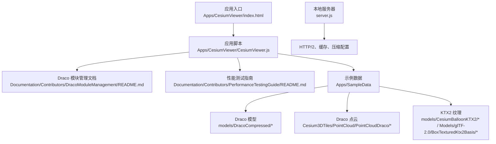
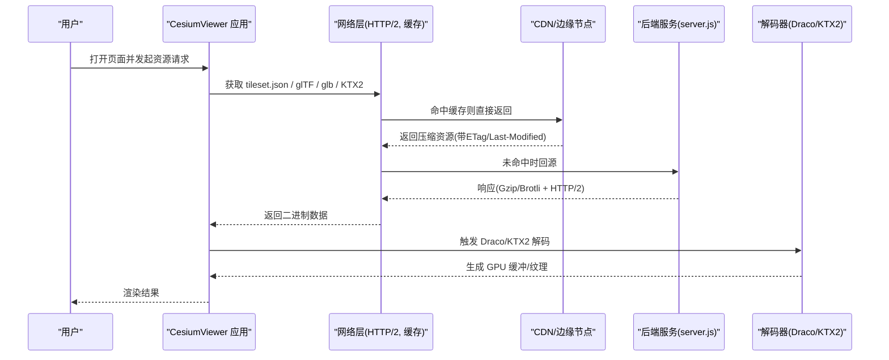
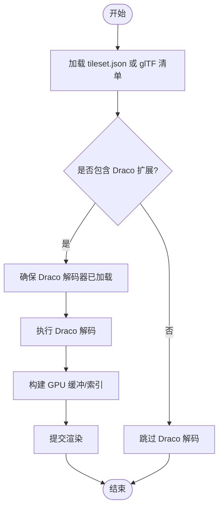
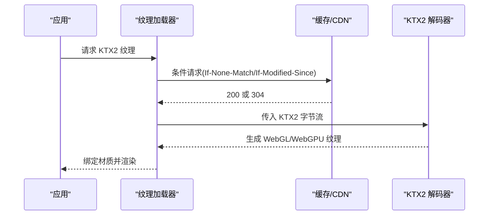
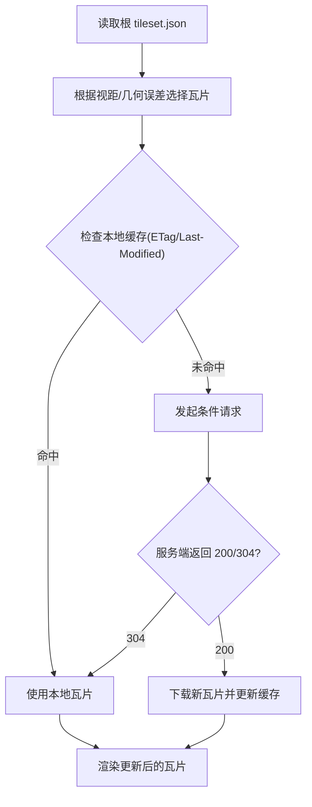
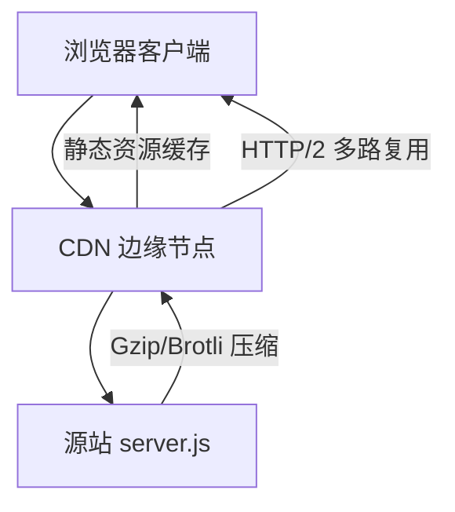
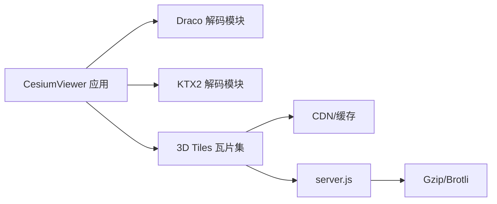

# 数据压缩与传输优化

<cite>
**本文引用的文件**   
- [README.md](file://README.md)
- [CesiumViewer.js](file://Apps/CesiumViewer/CesiumViewer.js)
- [index.html](file://Apps/CesiumViewer/index.html)
- [DracoModuleManagement/README.md](file://Documentation/Contributors/DracoModuleManagement/README.md)
- [PerformanceTestingGuide/README.md](file://Documentation/Contributors/PerformanceTestingGuide/README.md)
- [PointCloudDraco/tileset.json](file://Apps/SampleData/Cesium3DTiles/PointCloud/PointCloudDraco/tileset.json)
- [PointCloudTimeDynamicDraco/tileset.json](file://Apps/SampleData/Cesium3DTiles/PointCloud/PointCloudTimeDynamicDraco/tileset.json)
- [CesiumMilkTruck.gltf](file://Apps/SampleData/models/DracoCompressed/CesiumMilkTruck.gltf)
- [CesiumMilkTruck.glb](file://Apps/SampleData/models/DracoCompressed/CesiumMilkTruck.glb)
- [CesiumMan.gltf](file://Apps/SampleData/models/CesiumMan/glTF-Draco/CesiumMan.gltf)
- [CesiumMilkTruck.gltf](file://Apps/SampleData/models/CesiumMilkTruck/glTF-Draco/CesiumMilkTruck.gltf)
- [BoxTexturedKtx2Basis](file://Apps/SampleData/Models/glTF-2.0/BoxTexturedKtx2Basis)
- [CesiumBalloonKTX2](file://Apps/SampleData/models/CesiumBalloonKTX2)
- [server.js](file://server.js)
</cite>

## 目录
1. [简介](#简介)
2. [项目结构](#项目结构)
3. [核心组件](#核心组件)
4. [架构总览](#架构总览)
5. [详细组件分析](#详细组件分析)
6. [依赖分析](#依赖分析)
7. [性能考量](#性能考量)
8. [故障排查指南](#故障排查指南)
9. [结论](#结论)
10. [附录](#附录)

## 简介
本文件面向在 Cesium 中实现“数据压缩与传输优化”的工程师与内容生产者，聚焦以下主题：
- Draco 几何体压缩：参数配置、解码权衡与兼容性
- KTX2 纹理格式：Basis Universal 压缩、多平台支持与实时解码
- 增量更新机制：差异计算、版本管理与部分更新策略
- 网络传输优化：HTTP/2 多路复用、Gzip/Brotli 压缩与 CDN 加速
- 不同数据类型（3D 模型、纹理贴图、大场景）的最佳压缩方案对比
- 性能测试方法与效果评估思路

说明：仓库中包含大量示例资源与文档，用于验证上述技术在实际工程中的落地方式。本文所有具体引用均指向仓库内真实文件路径与行号范围。

## 项目结构
与压缩和传输相关的资源主要分布在如下位置：
- 示例应用与入口：Apps/CesiumViewer
- 贡献者文档：Documentation/Contributors（含 Draco 模块管理、性能测试指南等）
- 示例数据：Apps/SampleData（包含 Draco 压缩的 glTF/glb、KTX2 纹理、3D Tiles 点云等）
- 本地服务器：server.js（用于演示 HTTP/2、缓存与压缩）

图表来源
- [index.html](file://Apps/CesiumViewer/index.html)
- [CesiumViewer.js](file://Apps/CesiumViewer/CesiumViewer.js)
- [DracoModuleManagement/README.md](file://Documentation/Contributors/DracoModuleManagement/README.md)
- [PerformanceTestingGuide/README.md](file://Documentation/Contributors/PerformanceTestingGuide/README.md)
- [server.js](file://server.js)

章节来源
- [README.md](file://README.md)
- [CesiumViewer.js](file://Apps/CesiumViewer/CesiumViewer.js)
- [index.html](file://Apps/CesiumViewer/index.html)
- [DracoModuleManagement/README.md](file://Documentation/Contributors/DracoModuleManagement/README.md)
- [PerformanceTestingGuide/README.md](file://Documentation/Contributors/PerformanceTestingGuide/README.md)
- [server.js](file://server.js)

## 核心组件
- Draco 几何体压缩
  - 支持 glTF 扩展 dracoCompression 与 3D Tiles 点云的 Draco 编码
  - 通过 Draco 模块加载器按需启用，避免不必要的二进制体积
- KTX2 纹理
  - 基于 Basis Universal 的多格式压缩，浏览器端可实时解码
  - 在 glTF 中以 KHR_texture_basisu 或 glTF 2.0 原生 KTX2 支持加载
- 增量更新
  - 3D Tiles 提供 tileset.json 元数据与子瓦片组织，结合服务端缓存与条件请求可实现高效增量更新
- 网络传输优化
  - 使用 HTTP/2 多路复用、Gzip/Brotli 压缩、CDN 缓存与强缓存策略

章节来源
- [DracoModuleManagement/README.md](file://Documentation/Contributors/DracoModuleManagement/README.md)
- [PerformanceTestingGuide/README.md](file://Documentation/Contributors/PerformanceTestingGuide/README.md)
- [server.js](file://server.js)

## 架构总览
下图展示从应用到数据源的关键路径，包括 Draco/KTX2 解码与网络层优化。

图表来源
- [CesiumViewer.js](file://Apps/CesiumViewer/CesiumViewer.js)
- [server.js](file://server.js)

## 详细组件分析

### Draco 几何体压缩
- 适用对象
  - glTF 网格与属性（顶点位置、法线、切线、颜色等）
  - 3D Tiles 点云（PNTS）
- 关键要点
  - 压缩比与质量：更高压缩等级带来更小体积，但解码时间更长；需按设备能力与带宽权衡
  - 解码开销：WebAssembly 解码在低端设备上可能成为瓶颈，建议开启并行与限制并发
  - 兼容性：需要确保 Draco 解码模块正确加载，且目标浏览器支持相应特性
- 仓库证据
  - 示例 Draco 模型：glTF 与 glb 两种容器形式
  - 示例 Draco 点云：3D Tiles 点云瓦片集
  - 贡献者文档：Draco 模块管理说明

图表来源
- [PointCloudDraco/tileset.json](file://Apps/SampleData/Cesium3DTiles/PointCloud/PointCloudDraco/tileset.json)
- [CesiumMilkTruck.gltf](file://Apps/SampleData/models/DracoCompressed/CesiumMilkTruck.gltf)
- [CesiumMilkTruck.glb](file://Apps/SampleData/models/DracoCompressed/CesiumMilkTruck.glb)
- [CesiumMan.gltf](file://Apps/SampleData/models/CesiumMan/glTF-Draco/CesiumMan.gltf)
- [CesiumMilkTruck.gltf](file://Apps/SampleData/models/CesiumMilkTruck/glTF-Draco/CesiumMilkTruck.gltf)
- [DracoModuleManagement/README.md](file://Documentation/Contributors/DracoModuleManagement/README.md)

章节来源
- [DracoModuleManagement/README.md](file://Documentation/Contributors/DracoModuleManagement/README.md)
- [PointCloudDraco/tileset.json](file://Apps/SampleData/Cesium3DTiles/PointCloud/PointCloudDraco/tileset.json)
- [CesiumMilkTruck.gltf](file://Apps/SampleData/models/DracoCompressed/CesiumMilkTruck.gltf)
- [CesiumMilkTruck.glb](file://Apps/SampleData/models/DracoCompressed/CesiumMilkTruck.glb)
- [CesiumMan.gltf](file://Apps/SampleData/models/CesiumMan/glTF-Draco/CesiumMan.gltf)
- [CesiumMilkTruck.gltf](file://Apps/SampleData/models/CesiumMilkTruck/glTF-Draco/CesiumMilkTruck.gltf)

### KTX2 纹理格式
- 优势
  - Basis Universal 压缩：跨平台统一压缩管线，减少存储与带宽
  - 实时解码：浏览器端可直接解码为 GPU 纹理，无需中间转换
  - 多格式封装：适配多种 GPU 压缩格式，提升移动端与桌面端一致性
- 仓库证据
  - 示例 KTX2 纹理资源目录
  - glTF 中使用 KTX2 的纹理资源

图表来源
- [CesiumBalloonKTX2](file://Apps/SampleData/models/CesiumBalloonKTX2)
- [BoxTexturedKtx2Basis](file://Apps/SampleData/Models/glTF-2.0/BoxTexturedKtx2Basis)

章节来源
- [CesiumBalloonKTX2](file://Apps/SampleData/models/CesiumBalloonKTX2)
- [BoxTexturedKtx2Basis](file://Apps/SampleData/Models/glTF-2.0/BoxTexturedKtx2Basis)

### 增量更新机制（3D Tiles）
- 原理
  - 根 tileset.json 描述层级结构与可用区域，客户端按需请求子瓦片
  - 服务端对 tileset.json 与瓦片内容设置 ETag/Last-Modified，配合浏览器缓存实现条件请求
  - 当某瓦片内容变更时，仅下发差异部分（新瓦片或更新后的瓦片），降低带宽
- 仓库证据
  - 3D Tiles 点云瓦片集与 tileset.json
  - 时间动态点云示例（可用于演示增量更新场景）

图表来源
- [PointCloudDraco/tileset.json](file://Apps/SampleData/Cesium3DTiles/PointCloud/PointCloudDraco/tileset.json)
- [PointCloudTimeDynamicDraco/tileset.json](file://Apps/SampleData/Cesium3DTiles/PointCloud/PointCloudTimeDynamicDraco/tileset.json)

章节来源
- [PointCloudDraco/tileset.json](file://Apps/SampleData/Cesium3DTiles/PointCloud/PointCloudDraco/tileset.json)
- [PointCloudTimeDynamicDraco/tileset.json](file://Apps/SampleData/Cesium3DTiles/PointCloud/PointCloudTimeDynamicDraco/tileset.json)

### 网络传输优化
- HTTP/2 多路复用
  - 同一连接并行传输多个资源，减少握手与队头阻塞
- Gzip/Brotli 压缩
  - 对 JSON、JS、CSS 等文本资源进行高压缩比处理
- CDN 加速与缓存
  - 利用边缘节点就近分发，配合强缓存与条件请求提高命中率
- 仓库证据
  - 本地服务器配置示例，用于演示 HTTP/2、缓存与压缩

图表来源
- [server.js](file://server.js)

章节来源
- [server.js](file://server.js)

## 依赖分析
- 应用层依赖
  - CesiumViewer 应用依赖 Draco 模块与 KTX2 解码能力
- 数据层依赖
  - 3D Tiles 瓦片集与 glTF/glb 资源作为输入
- 网络层依赖
  - HTTP/2、缓存策略、CDN 与压缩算法

图表来源
- [CesiumViewer.js](file://Apps/CesiumViewer/CesiumViewer.js)
- [server.js](file://server.js)

章节来源
- [CesiumViewer.js](file://Apps/CesiumViewer/CesiumViewer.js)
- [server.js](file://server.js)

## 性能考量
- Draco 压缩
  - 压缩等级越高，体积越小，但解码耗时增加；建议在低端设备上降低等级或限制并发
  - 针对点云与复杂网格分别评估质量阈值，避免视觉退化
- KTX2 纹理
  - 选择合适的 Basis 编码与目标 GPU 压缩格式，平衡画质与解码速度
  - 对大图纹理采用多级分辨率（mipmaps）以提升采样效率
- 增量更新
  - 合理划分瓦片粒度，避免过大瓦片导致首帧延迟
  - 使用条件请求与缓存失效策略，减少重复下载
- 网络传输
  - 启用 HTTP/2 与 Brotli，优先压缩文本类资源
  - 配置 CDN 强缓存与合理的 TTL，结合 ETag 实现精准失效

[本节为通用指导，不直接分析具体文件]

## 故障排查指南
- Draco 解码失败
  - 确认 Draco 模块已正确加载与初始化
  - 检查浏览器是否支持相关 WebAssembly 特性
- KTX2 纹理无法显示
  - 确认资源为有效 KTX2 格式，且浏览器支持实时解码
  - 检查 MIME 类型与缓存策略是否正确
- 3D Tiles 瓦片不更新
  - 检查 tileset.json 与瓦片内容的 ETag/Last-Modified 是否生效
  - 确认 CDN 与服务端缓存配置一致
- 网络性能问题
  - 观察 HTTP/2 连接复用情况与并发数
  - 检查 Gzip/Brotli 压缩是否对必要资源生效

章节来源
- [DracoModuleManagement/README.md](file://Documentation/Contributors/DracoModuleManagement/README.md)
- [PerformanceTestingGuide/README.md](file://Documentation/Contributors/PerformanceTestingGuide/README.md)
- [server.js](file://server.js)

## 结论
通过在 Cesium 应用中系统性地引入 Draco 几何体压缩、KTX2 纹理压缩、3D Tiles 增量更新以及 HTTP/2/Gzip-Brotli/CDN 等网络优化手段，可以显著降低首屏加载时间与持续渲染时的带宽占用。实际效果需结合设备能力、网络环境与数据特征进行基准测试与调优。

[本节为总结性内容，不直接分析具体文件]

## 附录
- 参考示例资源路径
  - Draco 模型：[CesiumMilkTruck.gltf](file://Apps/SampleData/models/DracoCompressed/CesiumMilkTruck.gltf)、[CesiumMilkTruck.glb](file://Apps/SampleData/models/DracoCompressed/CesiumMilkTruck.glb)、[CesiumMan.gltf](file://Apps/SampleData/models/CesiumMan/glTF-Draco/CesiumMan.gltf)、[CesiumMilkTruck.gltf](file://Apps/SampleData/models/CesiumMilkTruck/glTF-Draco/CesiumMilkTruck.gltf)
  - Draco 点云：[PointCloudDraco/tileset.json](file://Apps/SampleData/Cesium3DTiles/PointCloud/PointCloudDraco/tileset.json)、[PointCloudTimeDynamicDraco/tileset.json](file://Apps/SampleData/Cesium3DTiles/PointCloud/PointCloudTimeDynamicDraco/tileset.json)
  - KTX2 纹理：[CesiumBalloonKTX2](file://Apps/SampleData/models/CesiumBalloonKTX2)、[BoxTexturedKtx2Basis](file://Apps/SampleData/Models/glTF-2.0/BoxTexturedKtx2Basis)
- 参考文档
  - Draco 模块管理：[DracoModuleManagement/README.md](file://Documentation/Contributors/DracoModuleManagement/README.md)
  - 性能测试指南：[PerformanceTestingGuide/README.md](file://Documentation/Contributors/PerformanceTestingGuide/README.md)
- 应用入口与服务器
  - 应用入口：[index.html](file://Apps/CesiumViewer/index.html)、[CesiumViewer.js](file://Apps/CesiumViewer/CesiumViewer.js)
  - 本地服务器：[server.js](file://server.js)