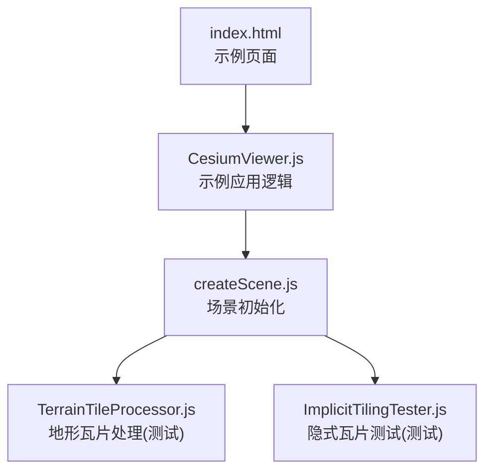
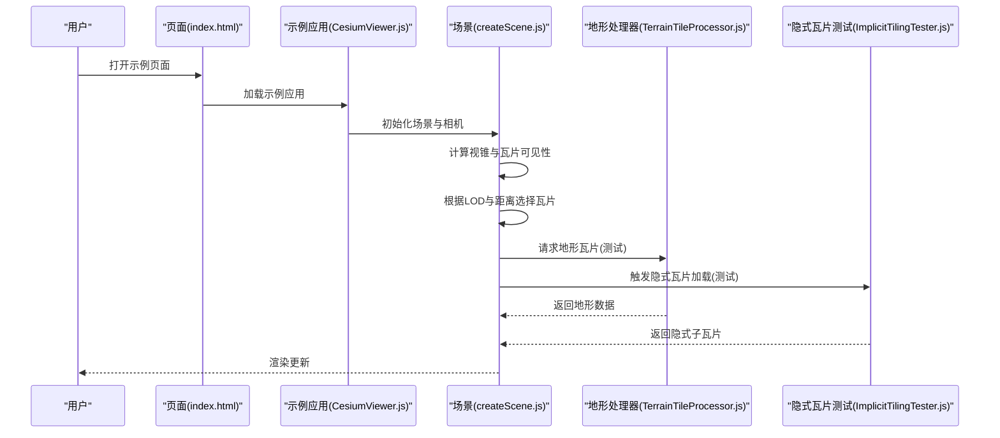
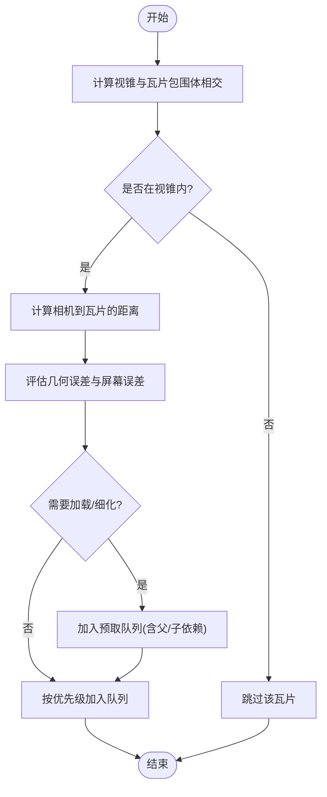
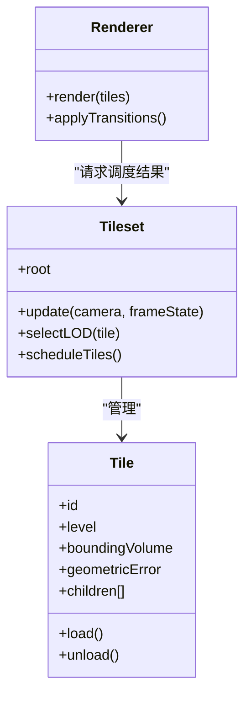
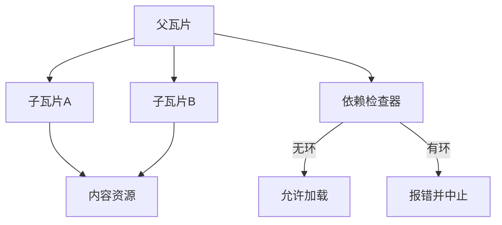
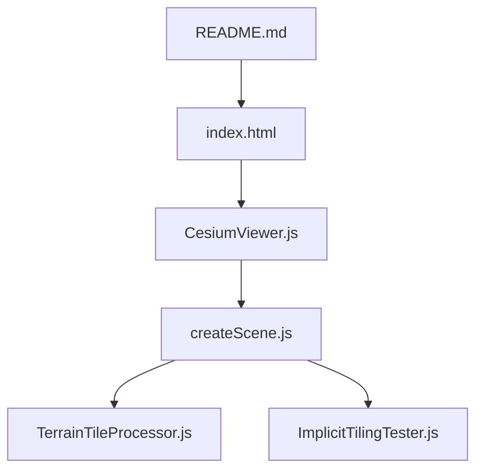

# 瓦片加载策略

<cite>
**本文引用的文件**   
- [README.md](file://README.md)
- [index.html](file://index.html)
- [CesiumViewer.js](file://Apps/CesiumViewer/CesiumViewer.js)
- [createScene.js](file://Specs/createScene.js)
- [TerrainTileProcessor.js](file://Specs/TerrainTileProcessor.js)
- [ImplicitTilingTester.js](file://Specs/ImplicitTilingTester.js)
</cite>

## 目录
1. [简介](#简介)
2. [项目结构](#项目结构)
3. [核心组件](#核心组件)
4. [架构总览](#架构总览)
5. [详细组件分析](#详细组件分析)
6. [依赖关系分析](#依赖关系分析)
7. [性能考量](#性能考量)
8. [故障排查指南](#故障排查指南)
9. [结论](#结论)
10. [附录](#附录)

## 简介
本文件围绕 Cesium 的瓦片加载策略，系统性阐述视口预取、层级调度（LOD）、缓存与淘汰、依赖管理与循环依赖检测，以及面向不同场景的配置优化与监控调试方法。文档以仓库中的示例与测试工具为线索，帮助读者理解从入口到渲染管线中瓦片调度的关键路径，并提供可操作的实践建议。

## 项目结构
仓库包含应用示例、测试数据与构建脚本等。与瓦片加载策略密切相关的入口与测试辅助包括：
- 应用入口与示例页面
- 场景创建与渲染初始化
- 地形瓦片处理与隐式瓦片测试工具

图表来源
- [index.html:1-200](file://index.html#L1-L200)
- [CesiumViewer.js:1-200](file://Apps/CesiumViewer/CesiumViewer.js#L1-L200)
- [createScene.js:1-200](file://Specs/createScene.js#L1-L200)
- [TerrainTileProcessor.js:1-200](file://Specs/TerrainTileProcessor.js#L1-L200)
- [ImplicitTilingTester.js:1-200](file://Specs/ImplicitTilingTester.js#L1-L200)

章节来源
- [README.md:1-200](file://README.md#L1-L200)
- [index.html:1-200](file://index.html#L1-L200)
- [CesiumViewer.js:1-200](file://Apps/CesiumViewer/CesiumViewer.js#L1-L200)
- [createScene.js:1-200](file://Specs/createScene.js#L1-L200)

## 核心组件
- 视口预取与可见性检测：基于相机状态与瓦片包围体进行快速剔除与优先级排序，结合距离与几何误差阈值决定是否需要进一步细化或加载。
- 层级调度（LOD）：依据几何误差与屏幕空间误差选择合适细节层次，并在父子瓦片间平滑过渡，避免闪烁与突变。
- 缓存策略：内存缓存用于热路径加速，磁盘缓存用于持久化；LRU 淘汰在内存紧张时释放旧条目，保证稳定性。
- 依赖管理：父子瓦片同步加载，构建依赖图并检测循环依赖，确保加载顺序正确且不会死锁。
- 场景适配：针对大规模城市建模、地形渲染与影像图层分别提供参数调优建议，平衡帧率与视觉质量。

章节来源
- [CesiumViewer.js:1-200](file://Apps/CesiumViewer/CesiumViewer.js#L1-L200)
- [createScene.js:1-200](file://Specs/createScene.js#L1-L200)

## 架构总览
下图展示从页面到渲染的关键流程，突出瓦片加载策略在其中的位置与作用点。

图表来源
- [index.html:1-200](file://index.html#L1-L200)
- [CesiumViewer.js:1-200](file://Apps/CesiumViewer/CesiumViewer.js#L1-L200)
- [createScene.js:1-200](file://Specs/createScene.js#L1-L200)
- [TerrainTileProcessor.js:1-200](file://Specs/TerrainTileProcessor.js#L1-L200)
- [ImplicitTilingTester.js:1-200](file://Specs/ImplicitTilingTester.js#L1-L200)

## 详细组件分析

### 视口预取算法
- 可见性检测：将瓦片包围体投影至屏幕空间，结合视锥裁剪与遮挡剔除，快速判定是否进入可视范围。
- 距离计算：使用相机到瓦片包围体的最短距离，作为预取权重的重要因子，越近越高优先。
- 预测性加载：根据相机运动趋势与历史访问模式，提前拉取相邻区域或下一层级的瓦片，降低首帧延迟。

章节来源
- [createScene.js:1-200](file://Specs/createScene.js#L1-L200)
- [ImplicitTilingTester.js:1-200](file://Specs/ImplicitTilingTester.js#L1-L200)

### 层级调度策略（LOD）
- LOD选择：依据瓦片几何误差与当前相机视角下的屏幕误差，选择满足精度要求的最低层级，减少冗余绘制。
- 细节层次过渡：在父子瓦片切换时采用插值或混合策略，避免视觉跳变。
- 渲染优先级排序：对候选瓦片按“可见性得分 + 距离权重 + 依赖就绪度”综合排序，优先加载阻塞链上的关键瓦片。

图表来源
- [createScene.js:1-200](file://Specs/createScene.js#L1-L200)
- [ImplicitTilingTester.js:1-200](file://Specs/ImplicitTilingTester.js#L1-L200)

章节来源
- [createScene.js:1-200](file://Specs/createScene.js#L1-L200)
- [ImplicitTilingTester.js:1-200](file://Specs/ImplicitTilingTester.js#L1-L200)

### 缓存策略实现
- 内存缓存：存储最近使用的瓦片数据与中间结果，命中率高时显著降低CPU/GPU压力。
- 磁盘缓存：持久化瓦片内容，提升冷启动与离线场景体验。
- LRU淘汰：当内存接近上限时，按最近使用时间驱逐最久未用的条目，保持系统稳定。

章节来源
- [TerrainTileProcessor.js:1-200](file://Specs/TerrainTileProcessor.js#L1-L200)
- [ImplicitTilingTester.js:1-200](file://Specs/ImplicitTilingTester.js#L1-L200)

### 瓦片依赖关系管理
- 父子瓦片同步：父瓦片未就绪时，子瓦片不得参与渲染；父瓦片卸载需检查是否有子瓦片仍在使用。
- 依赖图构建：以瓦片为节点、父子关系为边构建有向图，支持拓扑排序确定加载顺序。
- 循环依赖检测：在构建阶段进行环检测，发现异常立即报错并回退到安全策略，防止死锁。

图表来源
- [ImplicitTilingTester.js:1-200](file://Specs/ImplicitTilingTester.js#L1-L200)

章节来源
- [ImplicitTilingTester.js:1-200](file://Specs/ImplicitTilingTester.js#L1-L200)

### 场景配置优化最佳实践
- 大规模城市建模
  - 提高预取半径与并发数，缩短远距离移动时的首帧延迟。
  - 合理设置几何误差阈值，避免过细层级导致GPU过载。
  - 启用纹理压缩与按需加载材质，降低带宽与显存占用。
- 地形渲染
  - 针对高程变化剧烈区域增大采样密度，平缓区域降低层级深度。
  - 开启地形LOD过渡，减少跳跃感。
  - 利用磁盘缓存预热常用区域，改善首次浏览体验。
- 影像图层加载
  - 根据缩放级别动态调整并发与缓存大小，避免峰值拥塞。
  - 对热点区域实施局部预取，提升交互流畅度。
  - 使用多源URL与负载均衡，增强容错与吞吐。

章节来源
- [CesiumViewer.js:1-200](file://Apps/CesiumViewer/CesiumViewer.js#L1-L200)
- [createScene.js:1-200](file://Specs/createScene.js#L1-L200)

### 性能监控与调试工具
- 指标采集
  - 瓦片命中率（内存/磁盘）、平均加载耗时、失败重试次数。
  - 每帧调度瓦片数量、GPU绘制调用次数、显存占用。
- 可视化调试
  - 在示例页面中叠加显示瓦片边界与LOD等级，定位过度细化或欠细化区域。
  - 记录相机轨迹与瓦片访问序列，回放分析瓶颈。
- 工具使用
  - 通过示例应用与测试工具注入日志钩子，输出关键事件时间戳。
  - 结合浏览器开发者工具的Network与Memory面板，交叉验证问题根因。

章节来源
- [index.html:1-200](file://index.html#L1-L200)
- [CesiumViewer.js:1-200](file://Apps/CesiumViewer/CesiumViewer.js#L1-L200)

## 依赖关系分析
- 模块耦合
  - 示例应用依赖场景初始化，场景初始化再依赖地形与隐式瓦片测试工具。
  - 测试工具之间相对独立，便于单独验证特定策略。
- 外部依赖
  - 网络请求与文件系统访问受平台能力限制，需考虑降级与超时策略。
- 潜在环路
  - 依赖图中若出现自引用或多跳回指，应通过构建期检测与运行时保护规避。

图表来源
- [README.md:1-200](file://README.md#L1-L200)
- [index.html:1-200](file://index.html#L1-L200)
- [CesiumViewer.js:1-200](file://Apps/CesiumViewer/CesiumViewer.js#L1-L200)
- [createScene.js:1-200](file://Specs/createScene.js#L1-L200)
- [TerrainTileProcessor.js:1-200](file://Specs/TerrainTileProcessor.js#L1-L200)
- [ImplicitTilingTester.js:1-200](file://Specs/ImplicitTilingTester.js#L1-L200)

章节来源
- [README.md:1-200](file://README.md#L1-L200)
- [index.html:1-200](file://index.html#L1-L200)
- [CesiumViewer.js:1-200](file://Apps/CesiumViewer/CesiumViewer.js#L1-L200)
- [createScene.js:1-200](file://Specs/createScene.js#L1-L200)

## 性能考量
- 预取窗口与并发控制：根据设备能力与网络状况动态调整，避免突发流量造成抖动。
- 内存与显存预算：设定上限与告警阈值，配合LRU与分层卸载策略，保障长时间运行稳定性。
- 传输优化：启用压缩、分块下载与断点续传，减少重传与等待时间。
- GPU友好：合并绘制批次、减少状态切换，提升渲染吞吐。

[本节为通用指导，不直接分析具体文件]

## 故障排查指南
- 常见问题
  - 瓦片闪烁或跳变：检查LOD过渡参数与父子瓦片切换时机。
  - 卡顿或掉帧：查看调度队列长度与并发数，适当降低预取规模。
  - 内存泄漏：确认瓦片卸载路径与缓存清理逻辑是否覆盖所有引用。
- 定位步骤
  - 在示例应用中开启调试开关，输出瓦片生命周期事件。
  - 使用浏览器性能面板录制交互过程，识别热点函数与长任务。
  - 对比不同配置下的指标曲线，逐步收敛问题范围。

章节来源
- [CesiumViewer.js:1-200](file://Apps/CesiumViewer/CesiumViewer.js#L1-L200)
- [createScene.js:1-200](file://Specs/createScene.js#L1-L200)

## 结论
通过对视口预取、LOD调度、缓存与依赖管理的系统化分析与图示化说明，本文提供了面向实际项目的瓦片加载策略落地方案。结合场景化配置与监控调试手段，可在大规模三维场景中取得稳定高效的加载与渲染表现。

[本节为总结性内容，不直接分析具体文件]

## 附录
- 术语表
  - 瓦片：具有固定地理范围与层级标识的数据单元。
  - 几何误差：瓦片与其真实几何之间的最大偏差。
  - 屏幕误差：瓦片在当前视角下投影到屏幕空间的像素误差。
- 参考入口
  - 示例页面与应用逻辑位于 index.html 与 CesiumViewer.js。
  - 场景初始化与测试工具位于 createScene.js、TerrainTileProcessor.js 与 ImplicitTilingTester.js。

章节来源
- [index.html:1-200](file://index.html#L1-L200)
- [CesiumViewer.js:1-200](file://Apps/CesiumViewer/CesiumViewer.js#L1-L200)
- [createScene.js:1-200](file://Specs/createScene.js#L1-L200)
- [TerrainTileProcessor.js:1-200](file://Specs/TerrainTileProcessor.js#L1-L200)
- [ImplicitTilingTester.js:1-200](file://Specs/ImplicitTilingTester.js#L1-L200)