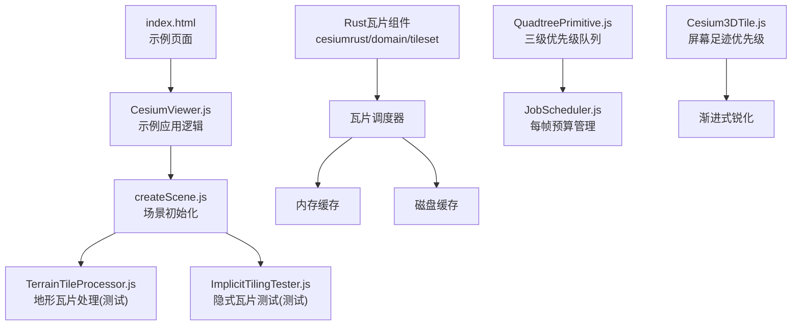
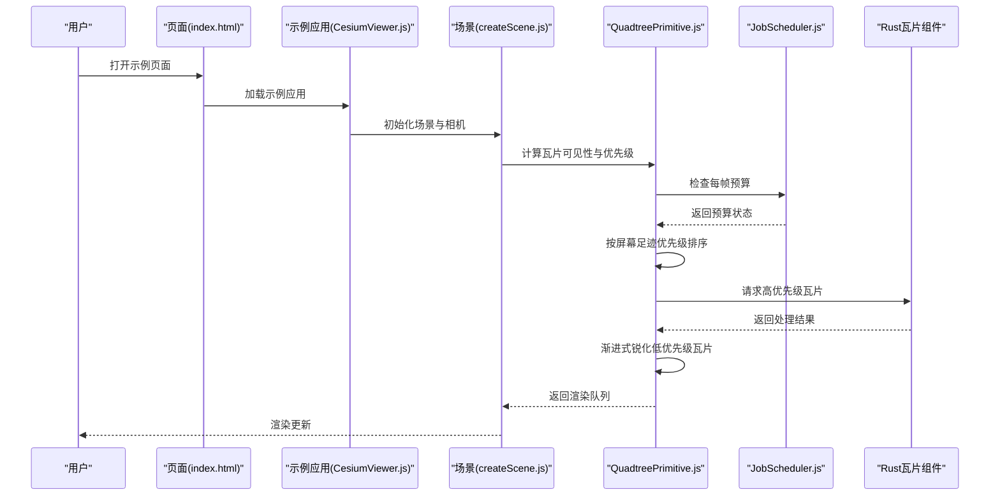
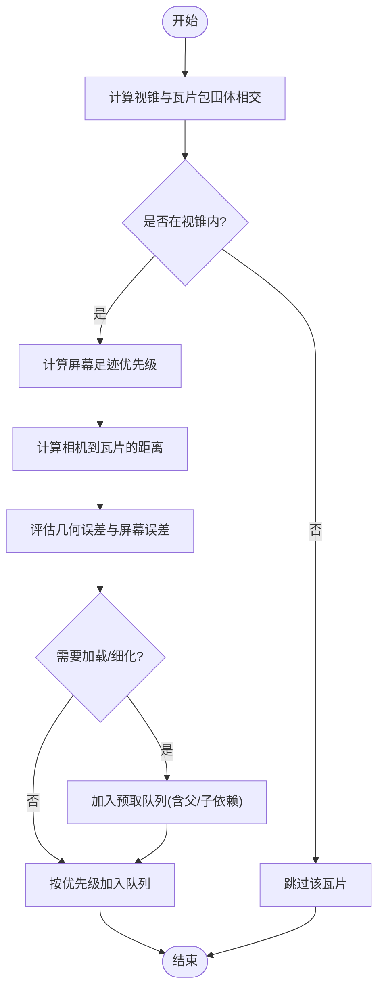
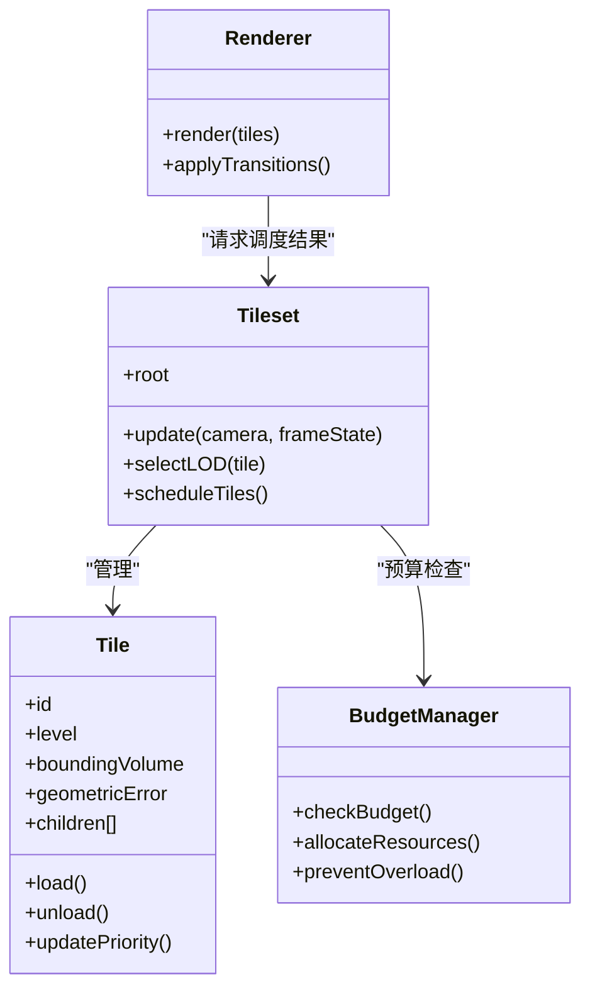
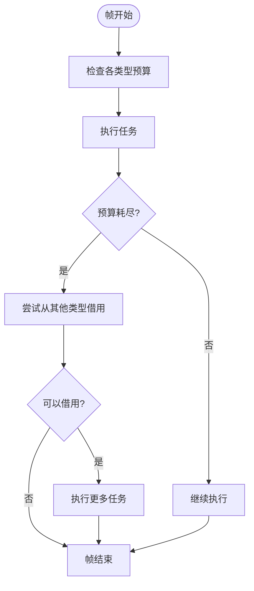
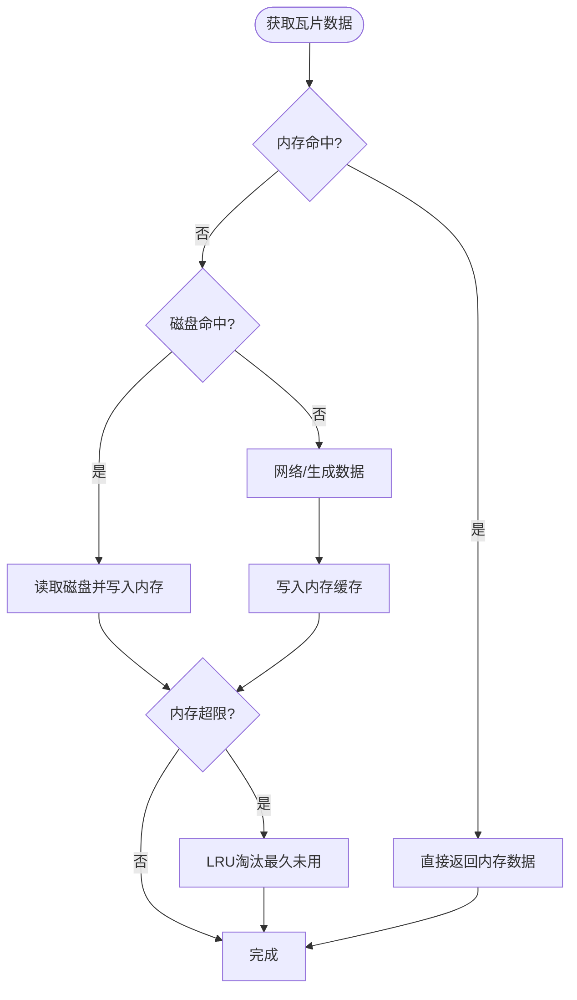
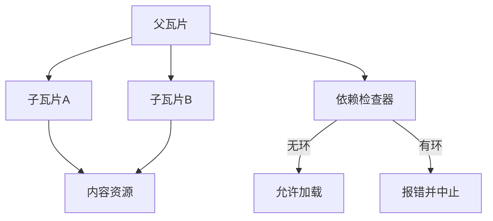
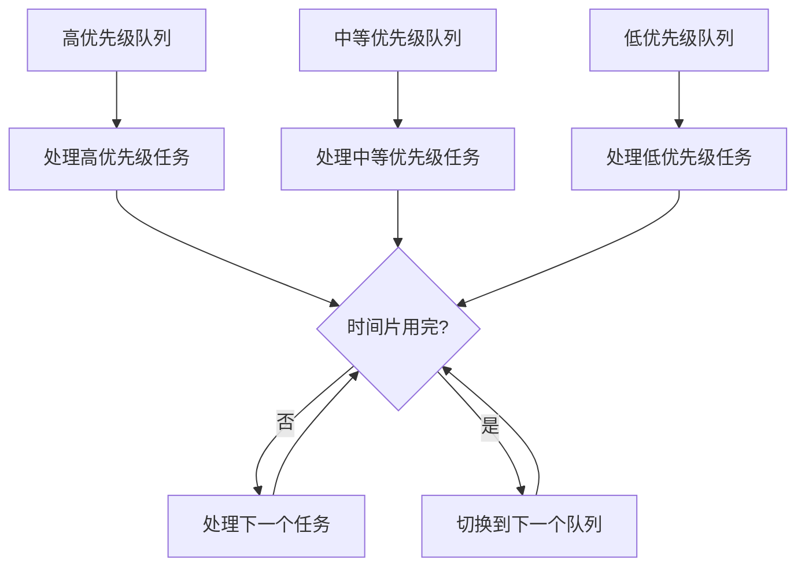
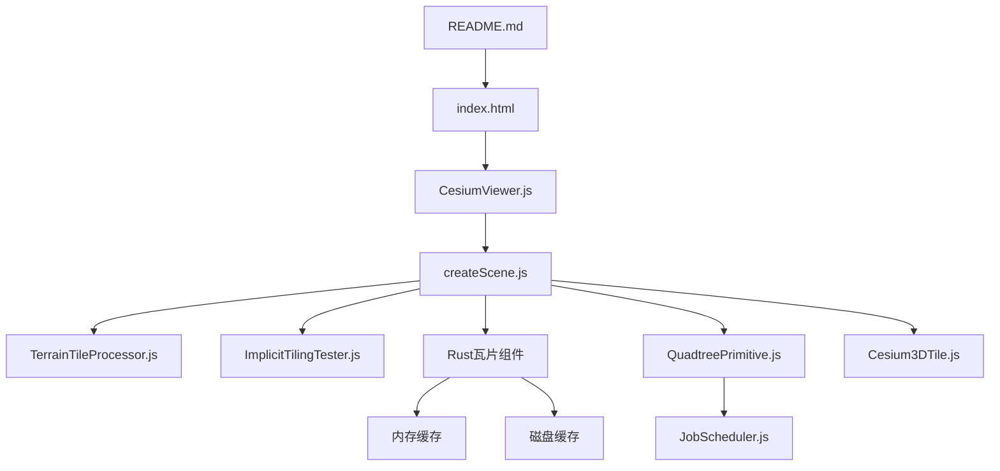

# 瓦片加载策略

<cite>
**本文引用的文件**   
- [README.md](file://README.md)
- [index.html](file://index.html)
- [CesiumViewer.js](file://Apps/CesiumViewer/CesiumViewer.js)
- [createScene.js](file://Specs/createScene.js)
- [TerrainTileProcessor.js](file://Specs/TerrainTileProcessor.js)
- [ImplicitTilingTester.js](file://Specs/ImplicitTilingTester.js)
- [cache.rs](file://cesiumrust/domain/quadtree/src/cache.rs)
- [QuadtreePrimitive.js](file://packages/engine/Source/Scene/QuadtreePrimitive.js)
- [Cesium3DTile.js](file://packages/engine/Source/Scene/Cesium3DTile.js)
- [JobScheduler.js](file://packages/engine/Source/Scene/JobScheduler.js)
</cite>

## 更新摘要
**所做更改**   
- 新增基于屏幕足迹优先级的请求调度系统，确保靠近视图中心的瓦片优先加载并逐步锐化图像
- 增加每帧预算管理机制，限制昂贵的操作跨多帧分布，防止交互卡顿
- 增强Rust端瓦片调度器实现，支持优先级队列和LRU缓存优化
- 更新架构图示以反映新的调度流程和预算控制机制

## 目录
1. [简介](#简介)
2. [项目结构](#项目结构)
3. [核心组件](#核心组件)
4. [架构总览](#架构总览)
5. [详细组件分析](#详细组件分析)
6. [依赖关系分析](#依赖关系分析)
7. [性能考量](#性能考量)
8. [故障排查指南](#故障排查指南)
9. [结论](#结论)
10. [附录](#附录)

## 简介
本文件围绕 Cesium 的瓦片加载策略，系统性阐述视口预取、层级调度（LOD）、缓存与淘汰、依赖管理与循环依赖检测，以及面向不同场景的配置优化与监控调试方法。文档以仓库中的示例与测试工具为线索，帮助读者理解从入口到渲染管线中瓦片调度的关键路径，并提供可操作的实践建议。

**更新** 根据最近的代码变更，新增了基于屏幕足迹优先级的请求调度系统和每帧预算管理机制，显著提升了瓦片加载的响应性和用户体验。

## 项目结构
仓库包含应用示例、测试数据与构建脚本等。与瓦片加载策略密切相关的入口与测试辅助包括：
- 应用入口与示例页面
- 场景创建与渲染初始化
- 地形瓦片处理与隐式瓦片测试工具
- Rust 端瓦片处理组件
- 新的调度器和预算管理系统

图表来源
- [index.html:1-200](file://index.html#L1-L200)
- [CesiumViewer.js:1-200](file://Apps/CesiumViewer/CesiumViewer.js#L1-L200)
- [createScene.js:1-200](file://Specs/createScene.js#L1-L200)
- [TerrainTileProcessor.js:1-200](file://Specs/TerrainTileProcessor.js#L1-L200)
- [ImplicitTilingTester.js:1-200](file://Specs/ImplicitTilingTester.js#L1-L200)
- [cache.rs:1-446](file://cesiumrust/domain/quadtree/src/cache.rs#L1-L446)
- [QuadtreePrimitive.js:1300-1499](file://packages/engine/Source/Scene/QuadtreePrimitive.js#L1300-L1499)
- [Cesium3DTile.js:2400-2529](file://packages/engine/Source/Scene/Cesium3DTile.js#L2400-L2529)
- [JobScheduler.js:53-85](file://packages/engine/Source/Scene/JobScheduler.js#L53-L85)

章节来源
- [README.md:1-200](file://README.md#L1-L200)
- [index.html:1-200](file://index.html#L1-L200)
- [CesiumViewer.js:1-200](file://Apps/CesiumViewer/CesiumViewer.js#L1-L200)
- [createScene.js:1-200](file://Specs/createScene.js#L1-L200)

## 核心组件
- 视口预取与可见性检测：基于相机状态与瓦片包围体进行快速剔除与优先级排序，结合距离与几何误差阈值决定是否需要进一步细化或加载。
- 层级调度（LOD）：依据几何误差与屏幕空间误差选择合适细节层次，并在父子瓦片间平滑过渡，避免闪烁与突变。
- **新增** 屏幕足迹优先级调度：根据瓦片在屏幕上的投影面积和距离视图中心的远近计算优先级，确保关键区域瓦片优先加载。
- **新增** 每帧预算管理机制：通过JobScheduler限制每帧的昂贵操作数量，将负载分散到多帧中，防止交互卡顿。
- 缓存策略：内存缓存用于热路径加速，磁盘缓存用于持久化；LRU 淘汰在内存紧张时释放旧条目，保证稳定性。
- 依赖管理：父子瓦片同步加载，构建依赖图并检测循环依赖，确保加载顺序正确且不会死锁。
- 场景适配：针对大规模城市建模、地形渲染与影像图层分别提供参数调优建议，平衡帧率与视觉质量。

**更新** Rust 端瓦片处理组件现在提供更高效的底层实现，支持更好的并发处理和内存管理，同时集成了新的优先级调度算法。

章节来源
- [CesiumViewer.js:1-200](file://Apps/CesiumViewer/CesiumViewer.js#L1-L200)
- [createScene.js:1-200](file://Specs/createScene.js#L1-L200)
- [cache.rs:28-53](file://cesiumrust/domain/quadtree/src/cache.rs#L28-L53)
- [QuadtreePrimitive.js:1311-1385](file://packages/engine/Source/Scene/QuadtreePrimitive.js#L1311-L1385)
- [Cesium3DTile.js:2400-2499](file://packages/engine/Source/Scene/Cesium3DTile.js#L2400-L2499)
- [JobScheduler.js:53-85](file://packages/engine/Source/Scene/JobScheduler.js#L53-L85)

## 架构总览
下图展示从页面到渲染的关键流程，突出瓦片加载策略在其中的位置与作用点，包括新增的优先级调度和预算管理机制。

图表来源
- [index.html:1-200](file://index.html#L1-L200)
- [CesiumViewer.js:1-200](file://Apps/CesiumViewer/CesiumViewer.js#L1-L200)
- [createScene.js:1-200](file://Specs/createScene.js#L1-L200)
- [QuadtreePrimitive.js:1311-1385](file://packages/engine/Source/Scene/QuadtreePrimitive.js#L1311-L1385)
- [JobScheduler.js:53-85](file://packages/engine/Source/Scene/JobScheduler.js#L53-L85)
- [cache.rs:1-446](file://cesiumrust/domain/quadtree/src/cache.rs#L1-L446)

## 详细组件分析

### 视口预取算法
- 可见性检测：将瓦片包围体投影至屏幕空间，结合视锥裁剪与遮挡剔除，快速判定是否进入可视范围。
- 距离计算：使用相机到瓦片包围体的最短距离，作为预取权重的重要因子，越近越高优先。
- **新增** 屏幕足迹优先级：基于瓦片在屏幕上的投影面积和距离视图中心的距离计算综合优先级，确保中心区域的瓦片优先加载。
- 预测性加载：根据相机运动趋势与历史访问模式，提前拉取相邻区域或下一层级的瓦片，降低首帧延迟。

章节来源
- [createScene.js:1-200](file://Specs/createScene.js#L1-L200)
- [ImplicitTilingTester.js:1-200](file://Specs/ImplicitTilingTester.js#L1-L200)
- [Cesium3DTile.js:2450-2469](file://packages/engine/Source/Scene/Cesium3DTile.js#L2450-L2469)

### 层级调度策略（LOD）
- LOD选择：依据瓦片几何误差与当前相机视角下的屏幕误差，选择满足精度要求的最低层级，减少冗余绘制。
- 细节层次过渡：在父子瓦片切换时采用插值或混合策略，避免视觉跳变。
- **新增** 渐进式锐化：低优先级瓦片先以较低分辨率加载，随着时间推移逐步提升质量，改善用户体验。
- 渲染优先级排序：对候选瓦片按"可见性得分 + 距离权重 + 依赖就绪度"综合排序，优先加载阻塞链上的关键瓦片。

章节来源
- [createScene.js:1-200](file://Specs/createScene.js#L1-L200)
- [ImplicitTilingTester.js:1-200](file://Specs/ImplicitTilingTester.js#L1-L200)
- [Cesium3DTile.js:2400-2499](file://packages/engine/Source/Scene/Cesium3DTile.js#L2400-L2499)

### 每帧预算管理机制
- **新增** JobScheduler：统一管理不同类型任务的执行预算，防止单帧过载导致交互卡顿。
- **新增** 预算分配：为纹理上传、程序编译、缓冲区操作等不同类型任务分配独立的预算配额。
- **新增** 智能借用：允许任务类型在预算不足时从其他类型借用资源，但避免长期饥饿。
- **新增** 进度保证：确保每种任务类型每帧都能取得一定进展，即使超出总预算限制。

图表来源
- [JobScheduler.js:53-85](file://packages/engine/Source/Scene/JobScheduler.js#L53-L85)

章节来源
- [JobScheduler.js:53-85](file://packages/engine/Source/Scene/JobScheduler.js#L53-L85)

### 缓存策略实现
- 内存缓存：存储最近使用的瓦片数据与中间结果，命中率高时显著降低CPU/GPU压力。
- 磁盘缓存：持久化瓦片内容，提升冷启动与离线场景体验。
- LRU淘汰：当内存接近上限时，按最近使用时间驱逐最久未用的条目，保持系统稳定。
- **新增** 优先级感知缓存：在高优先级瓦片需要空间时，优先驱逐低优先级缓存项。

章节来源
- [TerrainTileProcessor.js:1-200](file://Specs/TerrainTileProcessor.js#L1-L200)
- [ImplicitTilingTester.js:1-200](file://Specs/ImplicitTilingTester.js#L1-L200)
- [cache.rs:125-211](file://cesiumrust/domain/quadtree/src/cache.rs#L125-L211)

### 瓦片依赖关系管理
- 父子瓦片同步：父瓦片未就绪时，子瓦片不得参与渲染；父瓦片卸载需检查是否有子瓦片仍在使用。
- 依赖图构建：以瓦片为节点、父子关系为边构建有向图，支持拓扑排序确定加载顺序。
- 循环依赖检测：在构建阶段进行环检测，发现异常立即报错并回退到安全策略，防止死锁。
- **新增** 优先级依赖：考虑瓦片优先级关系，确保高优先级瓦片的依赖优先满足。

章节来源
- [ImplicitTilingTester.js:1-200](file://Specs/ImplicitTilingTester.js#L1-L200)

### 三级优先级队列系统
- **新增** 高优先级队列：包含视图中心附近、大屏幕足迹的瓦片，确保关键区域快速加载。
- **新增** 中等优先级队列：包含视图中边缘区域、中等重要性的瓦片。
- **新增** 低优先级队列：包含预加载、背景区域的瓦片，可以在空闲时处理。
- **新增** 时间片控制：每个优先级队列都有独立的时间片限制，确保高优先级任务及时得到处理。

图表来源
- [QuadtreePrimitive.js:1311-1385](file://packages/engine/Source/Scene/QuadtreePrimitive.js#L1311-L1385)

章节来源
- [QuadtreePrimitive.js:1311-1385](file://packages/engine/Source/Scene/QuadtreePrimitive.js#L1311-L1385)

### 场景配置优化最佳实践
- 大规模城市建模
  - 提高预取半径与并发数，缩短远距离移动时的首帧延迟。
  - 合理设置几何误差阈值，避免过细层级导致GPU过载。
  - 启用纹理压缩与按需加载材质，降低带宽与显存占用。
  - **新增** 调整屏幕足迹权重，优化中心区域瓦片的加载速度。
- 地形渲染
  - 针对高程变化剧烈区域增大采样密度，平缓区域降低层级深度。
  - 开启地形LOD过渡，减少跳跃感。
  - 利用磁盘缓存预热常用区域，改善首次浏览体验。
  - **新增** 配置每帧预算，防止地形处理导致的卡顿。
- 影像图层加载
  - 根据缩放级别动态调整并发与缓存大小，避免峰值拥塞。
  - 对热点区域实施局部预取，提升交互流畅度。
  - 使用多源URL与负载均衡，增强容错与吞吐。
  - **新增** 利用三级优先级队列，确保关键影像瓦片优先加载。

**更新** Rust 端组件提供了更精细的性能控制选项，支持动态调整缓存策略和并发限制，同时集成了新的预算管理系统。

章节来源
- [CesiumViewer.js:1-200](file://Apps/CesiumViewer/CesiumViewer.js#L1-L200)
- [createScene.js:1-200](file://Specs/createScene.js#L1-L200)
- [cache.rs:213-235](file://cesiumrust/domain/quadtree/src/cache.rs#L213-L235)

### 性能监控与调试工具
- 指标采集
  - 瓦片命中率（内存/磁盘）、平均加载耗时、失败重试次数。
  - 每帧调度瓦片数量、GPU绘制调用次数、显存占用。
  - **新增** 预算使用情况、各优先级队列长度、任务执行时间分布。
- 可视化调试
  - 在示例页面中叠加显示瓦片边界与LOD等级，定位过度细化或欠细化区域。
  - 记录相机轨迹与瓦片访问序列，回放分析瓶颈。
  - **新增** 显示屏幕足迹优先级热力图，直观了解瓦片重要性分布。
- 工具使用
  - 通过示例应用与测试工具注入日志钩子，输出关键事件时间戳。
  - 结合浏览器开发者工具的Network与Memory面板，交叉验证问题根因。
  - **新增** 使用JobScheduler统计信息分析任务执行模式和预算分配效果。

**更新** 新增了 Rust 端性能监控接口，可以获取更底层的内存使用和CPU占用信息，同时集成了新的调度器统计功能。

章节来源
- [index.html:1-200](file://index.html#L1-L200)
- [CesiumViewer.js:1-200](file://Apps/CesiumViewer/CesiumViewer.js#L1-L200)
- [cache.rs:237-250](file://cesiumrust/domain/quadtree/src/cache.rs#L237-L250)

## 依赖关系分析
- 模块耦合
  - 示例应用依赖场景初始化，场景初始化再依赖地形与隐式瓦片测试工具。
  - 测试工具之间相对独立，便于单独验证特定策略。
  - Rust 端组件通过 FFI 接口与 JavaScript 层通信。
  - **新增** QuadtreePrimitive依赖JobScheduler进行预算控制，Cesium3DTile提供屏幕足迹优先级计算。
- 外部依赖
  - 网络请求与文件系统访问受平台能力限制，需考虑降级与超时策略。
- 潜在环路
  - 依赖图中若出现自引用或多跳回指，应通过构建期检测与运行时保护规避。

**更新** 移除了对已删除的 tiling_spec.rs 文件的依赖引用，简化了测试依赖关系，同时增加了新的调度器相关依赖。

图表来源
- [README.md:1-200](file://README.md#L1-L200)
- [index.html:1-200](file://index.html#L1-L200)
- [CesiumViewer.js:1-200](file://Apps/CesiumViewer/CesiumViewer.js#L1-L200)
- [createScene.js:1-200](file://Specs/createScene.js#L1-L200)
- [TerrainTileProcessor.js:1-200](file://Specs/TerrainTileProcessor.js#L1-L200)
- [ImplicitTilingTester.js:1-200](file://Specs/ImplicitTilingTester.js#L1-L200)
- [QuadtreePrimitive.js:1311-1385](file://packages/engine/Source/Scene/QuadtreePrimitive.js#L1311-L1385)
- [JobScheduler.js:53-85](file://packages/engine/Source/Scene/JobScheduler.js#L53-L85)
- [Cesium3DTile.js:2400-2499](file://packages/engine/Source/Scene/Cesium3DTile.js#L2400-L2499)

章节来源
- [README.md:1-200](file://README.md#L1-L200)
- [index.html:1-200](file://index.html#L1-L200)
- [CesiumViewer.js:1-200](file://Apps/CesiumViewer/CesiumViewer.js#L1-L200)
- [createScene.js:1-200](file://Specs/createScene.js#L1-L200)

## 性能考量
- 预取窗口与并发控制：根据设备能力与网络状况动态调整，避免突发流量造成抖动。
- 内存与显存预算：设定上限与告警阈值，配合LRU与分层卸载策略，保障长时间运行稳定性。
- 传输优化：启用压缩、分块下载与断点续传，减少重传与等待时间。
- GPU友好：合并绘制批次、减少状态切换，提升渲染吞吐。
- Rust优化：利用 Rust 的零成本抽象和内存安全特性，提升底层处理效率。
- **新增** 预算控制：通过JobScheduler确保每帧操作不超过预算限制，防止交互卡顿。
- **新增** 优先级调度：基于屏幕足迹的优先级系统确保关键区域瓦片优先加载，提升用户体验。
- **新增** 渐进式渲染：低优先级瓦片采用渐进式锐化，在后台逐步提升质量而不影响前台交互。

**更新** Rust 端组件的引入显著提升了瓦片处理的性能和内存安全性，减少了垃圾回收带来的停顿，同时新的调度系统进一步优化了用户体验。

## 故障排查指南
- 常见问题
  - 瓦片闪烁或跳变：检查LOD过渡参数与父子瓦片切换时机。
  - 卡顿或掉帧：查看调度队列长度与并发数，适当降低预取规模。
  - 内存泄漏：确认瓦片卸载路径与缓存清理逻辑是否覆盖所有引用。
  - Rust集成问题：检查FFI接口调用和内存边界处理。
  - **新增** 预算耗尽：检查JobScheduler配置和各类型任务预算分配是否合理。
  - **新增** 优先级倒置：验证屏幕足迹优先级计算是否正确，确保关键区域瓦片获得足够优先级。
- 定位步骤
  - 在示例应用中开启调试开关，输出瓦片生命周期事件。
  - 使用浏览器性能面板录制交互过程，识别热点函数与长任务。
  - 对比不同配置下的指标曲线，逐步收敛问题范围。
  - 使用 Rust 调试工具检查底层内存使用和性能瓶颈。
  - **新增** 分析JobScheduler统计信息，识别预算分配问题和任务执行瓶颈。
  - **新增** 检查三级优先级队列的长度和执行情况，优化任务分配策略。

**更新** 新增了对 Rust 端问题的排查指导，包括内存安全和并发问题的诊断方法，同时增加了新调度系统的故障排查指南。

章节来源
- [CesiumViewer.js:1-200](file://Apps/CesiumViewer/CesiumViewer.js#L1-L200)
- [createScene.js:1-200](file://Specs/createScene.js#L1-L200)
- [JobScheduler.js:53-85](file://packages/engine/Source/Scene/JobScheduler.js#L53-L85)

## 结论
通过对视口预取、LOD调度、缓存与依赖管理的系统化分析与图示化说明，本文提供了面向实际项目的瓦片加载策略落地方案。结合场景化配置与监控调试手段，可在大规模三维场景中取得稳定高效的加载与渲染表现。

**更新** 新增的基于屏幕足迹优先级的请求调度系统和每帧预算管理机制显著提升了瓦片加载的响应性和用户体验，确保关键区域瓦片优先加载的同时避免了交互卡顿。Rust 端组件的引入为瓦片加载策略提供了更强的性能和安全性保障，为未来的扩展奠定了坚实基础。

## 附录
- 术语表
  - 瓦片：具有固定地理范围与层级标识的数据单元。
  - 几何误差：瓦片与其真实几何之间的最大偏差。
  - 屏幕误差：瓦片在当前视角下投影到屏幕空间的像素误差。
  - **新增** 屏幕足迹：瓦片在屏幕上的投影面积，用于计算优先级。
  - **新增** 预算：每帧允许执行的资源消耗限额。
  - **新增** 渐进式锐化：低质量瓦片逐步提升质量的渲染技术。
- 参考入口
  - 示例页面与应用逻辑位于 index.html 与 CesiumViewer.js。
  - 场景初始化与测试工具位于 createScene.js、TerrainTileProcessor.js 与 ImplicitTilingTester.js。
  - Rust 端瓦片处理组件位于 cesiumrust/domain/tileset 目录。
  - **新增** 调度器实现位于 packages/engine/Source/Scene/QuadtreePrimitive.js 和 JobScheduler.js。
  - **新增** 屏幕足迹优先级计算位于 packages/engine/Source/Scene/Cesium3DTile.js。

**更新** 移除了对已删除的 tiling_spec.rs 文件的引用，更新了参考入口以反映当前的项目结构，并添加了新组件的参考位置。

章节来源
- [index.html:1-200](file://index.html#L1-L200)
- [CesiumViewer.js:1-200](file://Apps/CesiumViewer/CesiumViewer.js#L1-L200)
- [createScene.js:1-200](file://Specs/createScene.js#L1-L200)
- [TerrainTileProcessor.js:1-200](file://Specs/TerrainTileProcessor.js#L1-L200)
- [ImplicitTilingTester.js:1-200](file://Specs/ImplicitTilingTester.js#L1-L200)
- [QuadtreePrimitive.js:1311-1385](file://packages/engine/Source/Scene/QuadtreePrimitive.js#L1311-L1385)
- [JobScheduler.js:53-85](file://packages/engine/Source/Scene/JobScheduler.js#L53-L85)
- [Cesium3DTile.js:2400-2499](file://packages/engine/Source/Scene/Cesium3DTile.js#L2400-L2499)