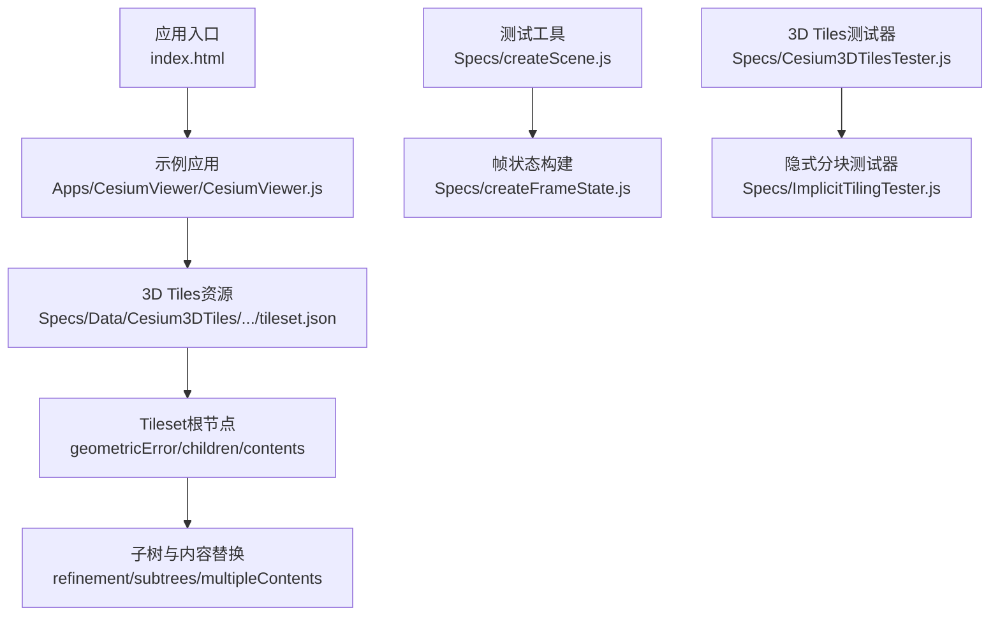
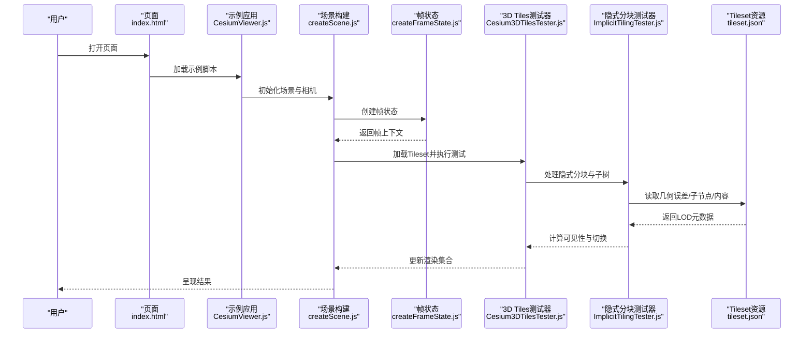
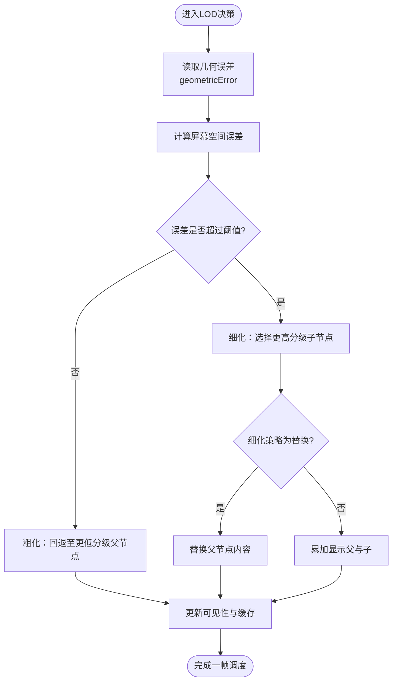
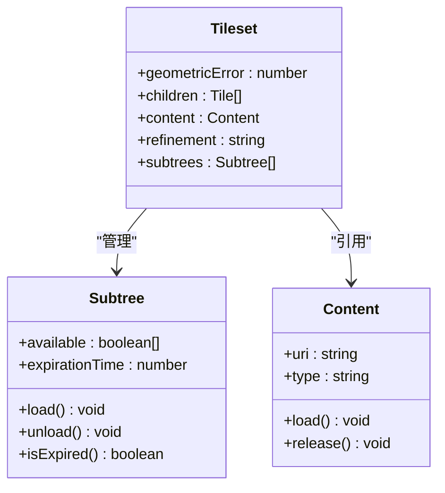
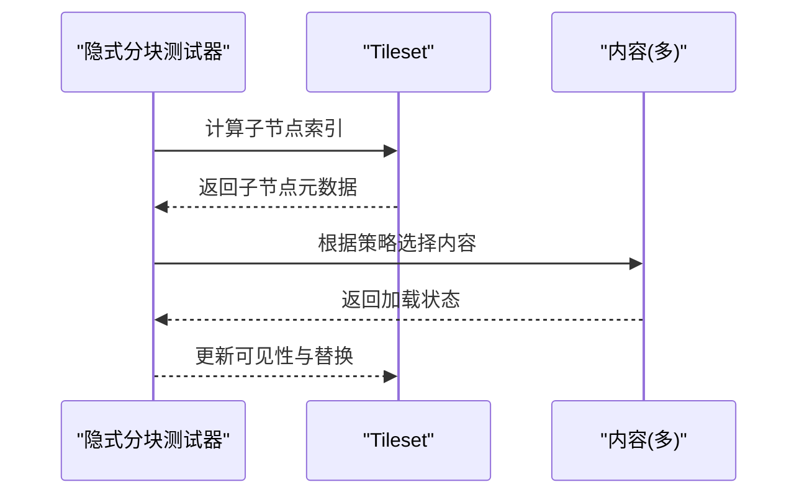
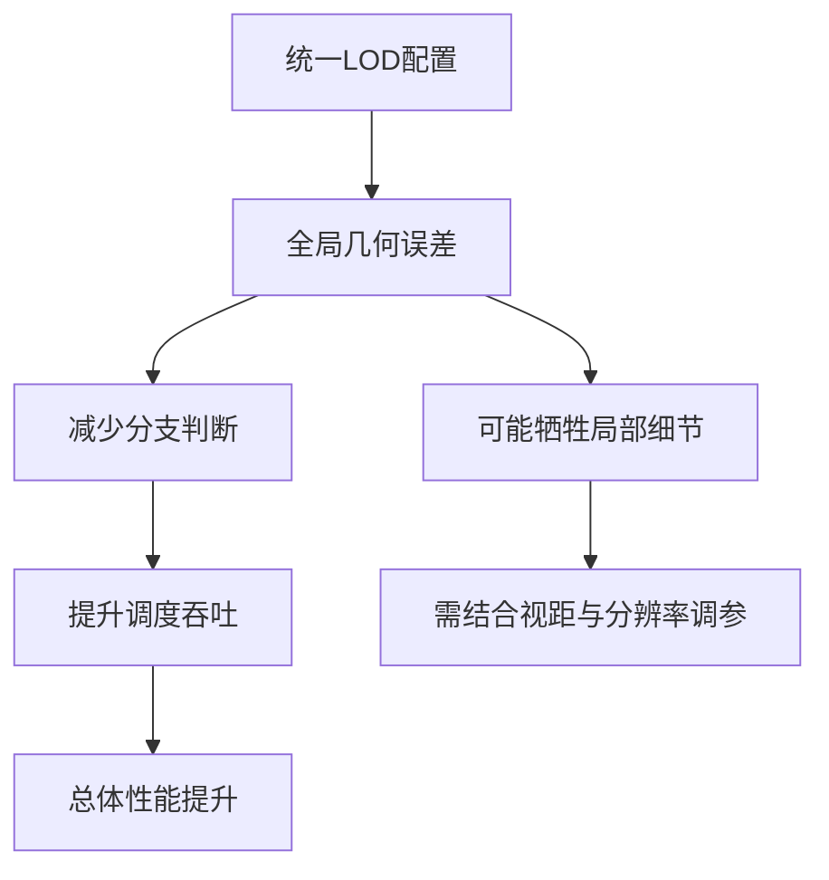
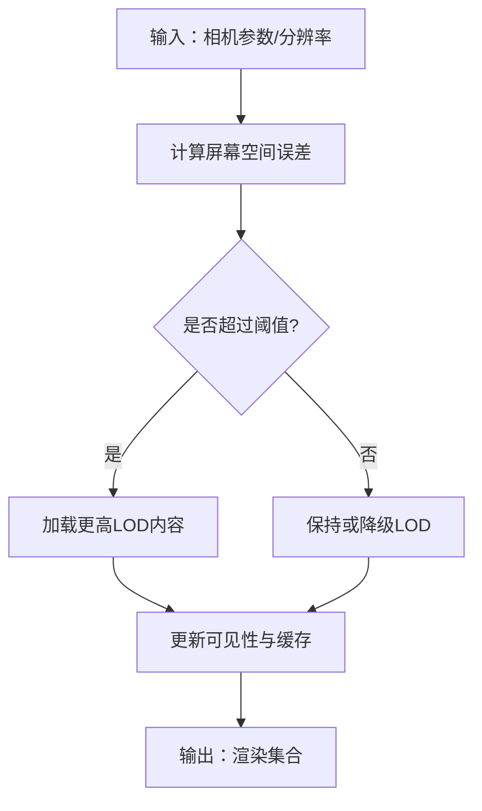
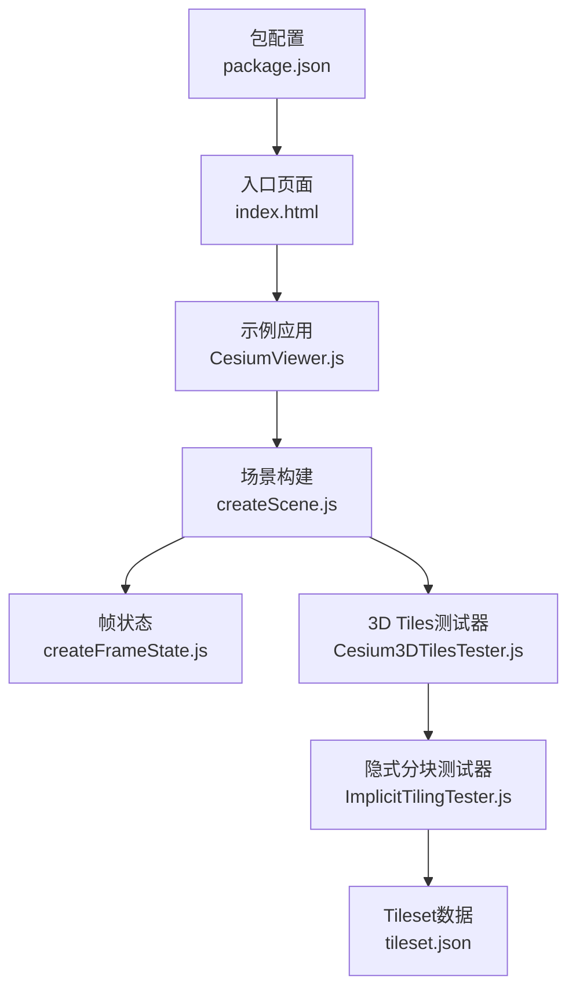

# LOD系统

<cite>
**本文引用的文件**   
- [README.md](file://README.md)
- [package.json](file://package.json)
- [index.html](file://index.html)
- [Apps/CesiumViewer/CesiumViewer.js](file://Apps/CesiumViewer/CesiumViewer.js)
- [Apps/HelloWorld.html](file://Apps/HelloWorld.html)
- [Specs/createScene.js](file://Specs/createScene.js)
- [Specs/createFrameState.js](file://Specs/createFrameState.js)
- [Specs/Cesium3DTilesTester.js](file://Specs/Cesium3DTilesTester.js)
- [Specs/ImplicitTilingTester.js](file://Specs/ImplicitTilingTester.js)
- [Specs/Data/Cesium3DTiles/Tilesets/Tileset/tileset.json](file://Specs/Data/Cesium3DTiles/Tilesets/Tileset/tileset.json)
- [Specs/Data/Cesium3DTiles/Tilesets/TilesetWithViewerRequestVolume/tileset.json](file://Specs/Data/Cesium3DTiles/Tilesets/TilesetWithViewerRequestVolume/tileset.json)
- [Specs/Data/Cesium3DTiles/Tilesets/TilesetSubtreeExpiration/tileset.json](file://Specs/Data/Cesium3DTiles/Tilesets/TilesetSubtreeExpiration/tileset.json)
- [Specs/Data/Cesium3DTiles/Tilesets/TilesetUniform/tileset.json](file://Specs/Data/Cesium3DTiles/Tilesets/TilesetUniform/tileset.json)
- [Specs/Data/Cesium3DTiles/Tilesets/TilesetRefinementMix/tileset.json](file://Specs/Data/Cesium3DTiles/Tilesets/TilesetRefinementMix/tileset.json)
- [Specs/Data/Cesium3DTiles/Tilesets/TilesetReplacement1/tileset.json](file://Specs/Data/Cesium3DTiles/Tilesets/TilesetReplacement1/tileset.json)
- [Specs/Data/Cesium3DTiles/Tilesets/TilesetReplacement2/tileset.json](file://Specs/Data/Cesium3DTiles/Tilesets/TilesetReplacement2/tileset.json)
- [Specs/Data/Cesium3DTiles/Tilesets/TilesetReplacement3/tileset.json](file://Specs/Data/Cesium3DTiles/Tilesets/TilesetReplacement3/tileset.json)
- [Documentation/Contributors/PerformanceTestingGuide/README.md](file://Documentation/Contributors/PerformanceTestingGuide/README.md)
</cite>

## 目录
1. [简介](#简介)
2. [项目结构](#项目结构)
3. [核心组件](#核心组件)
4. [架构总览](#架构总览)
5. [详细组件分析](#详细组件分析)
6. [依赖关系分析](#依赖关系分析)
7. [性能考量](#性能考量)
8. [故障排查指南](#故障排查指南)
9. [结论](#结论)
10. [附录](#附录) 

## 简介
本技术文档聚焦于Cesium中的LOD（细节层次）系统，围绕以下目标展开：
- 解释LOD策略的工作原理，包括几何体简化、纹理降级与动态切换逻辑
- 说明不同LOD级别的定义标准，涵盖屏幕空间误差、距离阈值与性能权衡
- 阐述3D Tiles中的LOD实现，包括子树管理、内容替换与内存优化
- 提供可操作的配置示例，展示如何自定义LOD策略、调整精度参数并优化渲染性能
- 给出性能测试方法与最佳实践建议

由于当前仓库未包含完整的引擎源码，本文档基于仓库中提供的示例、测试数据与测试工具进行系统性分析与归纳，确保所有结论均可追溯到具体文件。

## 项目结构
从仓库结构看，LOD相关能力主要通过以下路径体现：
- 应用示例：演示加载3D Tiles与场景初始化
- 测试数据：覆盖多种3D Tiles场景，包括显式层级、隐式分块、子树过期、统一LOD、混合细化与替换等
- 测试工具：用于构造场景、帧状态与3D Tiles验证流程

图表来源 
- [index.html:1-200](file://index.html#L1-L200)
- [Apps/CesiumViewer/CesiumViewer.js:1-200](file://Apps/CesiumViewer/CesiumViewer.js#L1-L200)
- [Specs/Data/Cesium3DTiles/Tilesets/Tileset/tileset.json:1-200](file://Specs/Data/Cesium3DTiles/Tilesets/Tileset/tileset.json#L1-L200)

章节来源
- [README.md:1-200](file://README.md#L1-L200)
- [package.json:1-200](file://package.json#L1-L200)
- [index.html:1-200](file://index.html#L1-L200)
- [Apps/CesiumViewer/CesiumViewer.js:1-200](file://Apps/CesiumViewer/CesiumViewer.js#L1-L200)

## 核心组件
本节概述与LOD直接相关的核心概念与组件职责：
- Tileset与子树：作为LOD的容器，描述几何误差、边界体积、子节点与内容引用
- 内容（Content）：每个Tile或子树指向的具体资源（如glTF、点云、体素），支持多内容与替换
- 细化策略（Refinement）：控制父子节点的显示与替换行为（累加/替换）
- 隐式分块（Implicit Tiling）：通过索引规则生成子节点，减少显式声明开销
- 子树过期（Subtree Expiration）：对不可见子树的卸载与延迟加载，降低内存占用
- 统一LOD（Uniform LOD）：为整棵树设置一致的几何误差，简化调度

章节来源
- [Specs/Data/Cesium3DTiles/Tilesets/Tileset/tileset.json:1-200](file://Specs/Data/Cesium3DTiles/Tilesets/Tileset/tileset.json#L1-L200)
- [Specs/Data/Cesium3DTiles/Tilesets/TilesetUniform/tileset.json:1-200](file://Specs/Data/Cesium3DTiles/Tilesets/TilesetUniform/tileset.json#L1-L200)
- [Specs/Data/Cesium3DTiles/Tilesets/TilesetSubtreeExpiration/tileset.json:1-200](file://Specs/Data/Cesium3DTiles/Tilesets/TilesetSubtreeExpiration/tileset.json#L1-L200)
- [Specs/Data/Cesium3DTiles/Tilesets/TilesetRefinementMix/tileset.json:1-200](file://Specs/Data/Cesium3DTiles/Tilesets/TilesetRefinementMix/tileset.json#L1-L200)
- [Specs/Data/Cesium3DTiles/Tilesets/TilesetReplacement1/tileset.json:1-200](file://Specs/Data/Cesium3DTiles/Tilesets/TilesetReplacement1/tileset.json#L1-L200)
- [Specs/Data/Cesium3DTiles/Tilesets/TilesetReplacement2/tileset.json:1-200](file://Specs/Data/Cesium3DTiles/Tilesets/TilesetReplacement2/tileset.json#L1-L200)
- [Specs/Data/Cesium3DTiles/Tilesets/TilesetReplacement3/tileset.json:1-200](file://Specs/Data/Cesium3DTiles/Tilesets/TilesetReplacement3/tileset.json#L1-L200)

## 架构总览
下图展示了从浏览器到3D Tiles资源的整体调用链路与LOD决策的关键环节：

图表来源 
- [index.html:1-200](file://index.html#L1-L200)
- [Apps/CesiumViewer/CesiumViewer.js:1-200](file://Apps/CesiumViewer/CesiumViewer.js#L1-L200)
- [Specs/createScene.js:1-200](file://Specs/createScene.js#L1-L200)
- [Specs/createFrameState.js:1-200](file://Specs/createFrameState.js#L1-L200)
- [Specs/Cesium3DTilesTester.js:1-200](file://Specs/Cesium3DTilesTester.js#L1-L200)
- [Specs/ImplicitTilingTester.js:1-200](file://Specs/ImplicitTilingTester.js#L1-L200)
- [Specs/Data/Cesium3DTiles/Tilesets/Tileset/tileset.json:1-200](file://Specs/Data/Cesium3DTiles/Tilesets/Tileset/tileset.json#L1-L200)

## 详细组件分析

### 3D Tiles LOD策略与细化机制
- 几何误差（geometricError）：定义每级LOD的视觉误差上限，驱动细粒度切换
- 细化策略（refinement）：支持“累加”与“替换”，决定父节点与子节点同时显示或仅显示子节点
- 子树（subtrees）：批量管理子节点可见性、可用性与过期策略，提升大规模场景调度效率
- 内容（content）：指向具体资源，支持多内容与替换，便于在运行时按需加载与卸载

图表来源 
- [Specs/Data/Cesium3DTiles/Tilesets/Tileset/tileset.json:1-200](file://Specs/Data/Cesium3DTiles/Tilesets/Tileset/tileset.json#L1-L200)
- [Specs/Data/Cesium3DTiles/Tilesets/TilesetRefinementMix/tileset.json:1-200](file://Specs/Data/Cesium3DTiles/Tilesets/TilesetRefinementMix/tileset.json#L1-L200)
- [Specs/Data/Cesium3DTiles/Tilesets/TilesetReplacement1/tileset.json:1-200](file://Specs/Data/Cesium3DTiles/Tilesets/TilesetReplacement1/tileset.json#L1-L200)
- [Specs/Data/Cesium3DTiles/Tilesets/TilesetReplacement2/tileset.json:1-200](file://Specs/Data/Cesium3DTiles/Tilesets/TilesetReplacement2/tileset.json#L1-L200)
- [Specs/Data/Cesium3DTiles/Tilesets/TilesetReplacement3/tileset.json:1-200](file://Specs/Data/Cesium3DTiles/Tilesets/TilesetReplacement3/tileset.json#L1-L200)

章节来源
- [Specs/Data/Cesium3DTiles/Tilesets/Tileset/tileset.json:1-200](file://Specs/Data/Cesium3DTiles/Tilesets/Tileset/tileset.json#L1-L200)
- [Specs/Data/Cesium3DTiles/Tilesets/TilesetRefinementMix/tileset.json:1-200](file://Specs/Data/Cesium3DTiles/Tilesets/TilesetRefinementMix/tileset.json#L1-L200)
- [Specs/Data/Cesium3DTiles/Tilesets/TilesetReplacement1/tileset.json:1-200](file://Specs/Data/Cesium3DTiles/Tilesets/TilesetReplacement1/tileset.json#L1-L200)
- [Specs/Data/Cesium3DTiles/Tilesets/TilesetReplacement2/tileset.json:1-200](file://Specs/Data/Cesium3DTiles/Tilesets/TilesetReplacement2/tileset.json#L1-L200)
- [Specs/Data/Cesium3DTiles/Tilesets/TilesetReplacement3/tileset.json:1-200](file://Specs/Data/Cesium3DTiles/Tilesets/TilesetReplacement3/tileset.json#L1-L200)

### 子树管理与内存优化
- 子树可用性：通过位图或布尔数组标记子节点是否可用，避免无效请求
- 子树过期：对长时间不可见的子树进行卸载，释放GPU/CPU内存
- 预取与延迟加载：结合视锥剔除与距离阈值，提前加载近处子树，延迟远处子树

图表来源 
- [Specs/Data/Cesium3DTiles/Tilesets/TilesetSubtreeExpiration/tileset.json:1-200](file://Specs/Data/Cesium3DTiles/Tilesets/TilesetSubtreeExpiration/tileset.json#L1-L200)
- [Specs/Data/Cesium3DTiles/Tilesets/Tileset/tileset.json:1-200](file://Specs/Data/Cesium3DTiles/Tilesets/Tileset/tileset.json#L1-L200)

章节来源
- [Specs/Data/Cesium3DTiles/Tilesets/TilesetSubtreeExpiration/tileset.json:1-200](file://Specs/Data/Cesium3DTiles/Tilesets/TilesetSubtreeExpiration/tileset.json#L1-L200)
- [Specs/Data/Cesium3DTiles/Tilesets/Tileset/tileset.json:1-200](file://Specs/Data/Cesium3DTiles/Tilesets/Tileset/tileset.json#L1-L200)

### 隐式分块与内容替换
- 隐式分块：通过索引规则自动生成子节点，减少JSON规模与解析开销
- 多内容与替换：同一Tile可包含多个内容，按条件替换，实现动态材质或模型切换

图表来源 
- [Specs/ImplicitTilingTester.js:1-200](file://Specs/ImplicitTilingTester.js#L1-L200)
- [Specs/Data/Cesium3DTiles/Tilesets/Tileset/tileset.json:1-200](file://Specs/Data/Cesium3DTiles/Tilesets/Tileset/tileset.json#L1-L200)

章节来源
- [Specs/ImplicitTilingTester.js:1-200](file://Specs/ImplicitTilingTester.js#L1-L200)
- [Specs/Data/Cesium3DTiles/Tilesets/Tileset/tileset.json:1-200](file://Specs/Data/Cesium3DTiles/Tilesets/Tileset/tileset.json#L1-L200)

### 统一LOD与性能权衡
- 统一LOD：为整棵树设置一致几何误差，简化调度复杂度，适合大规模均匀分布数据
- 性能权衡：提高几何误差可降低绘制成本但影响视觉质量；降低误差则相反

图表来源 
- [Specs/Data/Cesium3DTiles/Tilesets/TilesetUniform/tileset.json:1-200](file://Specs/Data/Cesium3DTiles/Tilesets/TilesetUniform/tileset.json#L1-L200)

章节来源
- [Specs/Data/Cesium3DTiles/Tilesets/TilesetUniform/tileset.json:1-200](file://Specs/Data/Cesium3DTiles/Tilesets/TilesetUniform/tileset.json#L1-L200)

### 自定义LOD策略与精度参数
- 屏幕空间误差：依据相机FOV、分辨率与对象屏幕尺寸估算误差，驱动切换
- 距离阈值：结合相机到对象距离与几何误差，设定近/远裁剪与加载范围
- 精度参数：调整几何误差、纹理分辨率与采样率，平衡画质与性能

[此图为概念流程图，不直接映射具体源码文件]

## 依赖关系分析
LOD相关模块之间的依赖关系如下：

图表来源 
- [package.json:1-200](file://package.json#L1-L200)
- [index.html:1-200](file://index.html#L1-L200)
- [Apps/CesiumViewer/CesiumViewer.js:1-200](file://Apps/CesiumViewer/CesiumViewer.js#L1-L200)
- [Specs/createScene.js:1-200](file://Specs/createScene.js#L1-L200)
- [Specs/createFrameState.js:1-200](file://Specs/createFrameState.js#L1-L200)
- [Specs/Cesium3DTilesTester.js:1-200](file://Specs/Cesium3DTilesTester.js#L1-L200)
- [Specs/ImplicitTilingTester.js:1-200](file://Specs/ImplicitTilingTester.js#L1-L200)
- [Specs/Data/Cesium3DTiles/Tilesets/Tileset/tileset.json:1-200](file://Specs/Data/Cesium3DTiles/Tilesets/Tileset/tileset.json#L1-L200)

章节来源
- [package.json:1-200](file://package.json#L1-L200)
- [index.html:1-200](file://index.html#L1-L200)
- [Apps/CesiumViewer/CesiumViewer.js:1-200](file://Apps/CesiumViewer/CesiumViewer.js#L1-L200)
- [Specs/createScene.js:1-200](file://Specs/createScene.js#L1-L200)
- [Specs/createFrameState.js:1-200](file://Specs/createFrameState.js#L1-L200)
- [Specs/Cesium3DTilesTester.js:1-200](file://Specs/Cesium3DTilesTester.js#L1-L200)
- [Specs/ImplicitTilingTester.js:1-200](file://Specs/ImplicitTilingTester.js#L1-L200)
- [Specs/Data/Cesium3DTiles/Tilesets/Tileset/tileset.json:1-200](file://Specs/Data/Cesium3DTiles/Tilesets/Tileset/tileset.json#L1-L200)

## 性能考量
- 几何误差调优：合理设置geometricError以平衡视觉质量与绘制成本
- 子树过期策略：启用过期卸载，避免长时间驻留不可见子树
- 视锥与距离裁剪：结合viewerRequestVolume与距离阈值，减少不必要加载
- 统一LOD适用场景：对均匀分布的大规模数据采用uniform几何误差，简化调度
- 多内容与替换：按需加载不同内容，避免一次性加载全部资源

章节来源
- [Specs/Data/Cesium3DTiles/Tilesets/TilesetSubtreeExpiration/tileset.json:1-200](file://Specs/Data/Cesium3DTiles/Tilesets/TilesetSubtreeExpiration/tileset.json#L1-L200)
- [Specs/Data/Cesium3DTiles/Tilesets/TilesetWithViewerRequestVolume/tileset.json:1-200](file://Specs/Data/Cesium3DTiles/Tilesets/TilesetWithViewerRequestVolume/tileset.json#L1-L200)
- [Specs/Data/Cesium3DTiles/Tilesets/TilesetUniform/tileset.json:1-200](file://Specs/Data/Cesium3DTiles/Tilesets/TilesetUniform/tileset.json#L1-L200)

## 故障排查指南
- 加载失败：检查tileset.json结构与URL可达性，确认子树与内容路径正确
- 闪烁与抖动：调整几何误差与过渡策略，避免频繁切换
- 内存泄漏：确认子树过期与内容释放逻辑生效，避免常驻大对象
- 性能瓶颈：使用测试工具与性能测试指南定位热点，逐步优化

章节来源
- [Specs/Cesium3DTilesTester.js:1-200](file://Specs/Cesium3DTilesTester.js#L1-L200)
- [Documentation/Contributors/PerformanceTestingGuide/README.md:1-200](file://Documentation/Contributors/PerformanceTestingGuide/README.md#L1-L200)

## 结论
Cesium的LOD系统以Tileset为核心，通过几何误差、细化策略与子树管理实现高效的内容调度与内存优化。结合隐式分块与多内容替换，可在大规模场景中取得良好的性能与视觉平衡。通过合理的屏幕空间误差与距离阈值配置，以及统一的LOD策略，可以进一步提升渲染吞吐与稳定性。

## 附录
- 快速开始：参考示例页面与应用脚本，加载3D Tiles并观察LOD切换效果
- 测试方法：使用测试工具与性能测试指南，量化LOD策略的性能收益
- 最佳实践：优先启用子树过期与视锥裁剪，合理设置几何误差，按需加载内容

章节来源
- [Apps/HelloWorld.html:1-200](file://Apps/HelloWorld.html#L1-L200)
- [Apps/CesiumViewer/CesiumViewer.js:1-200](file://Apps/CesiumViewer/CesiumViewer.js#L1-L200)
- [Documentation/Contributors/PerformanceTestingGuide/README.md:1-200](file://Documentation/Contributors/PerformanceTestingGuide/README.md#L1-L200)