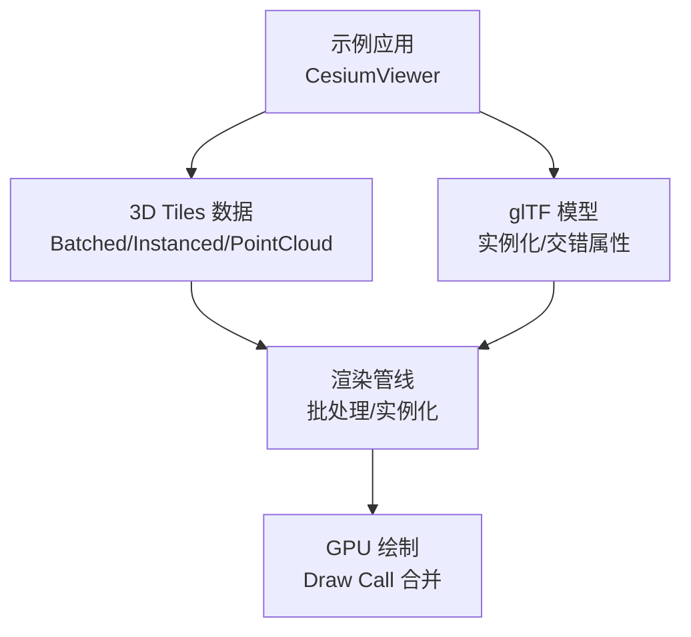
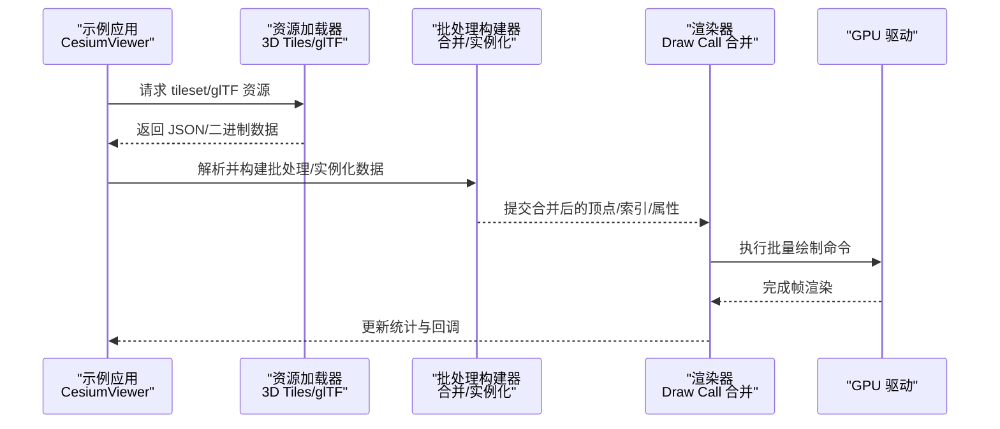
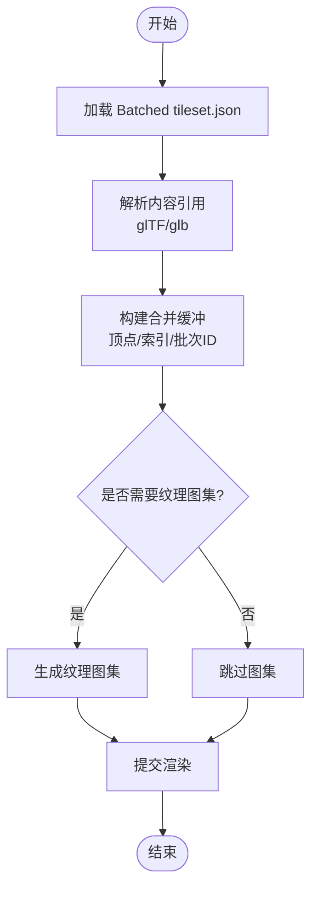
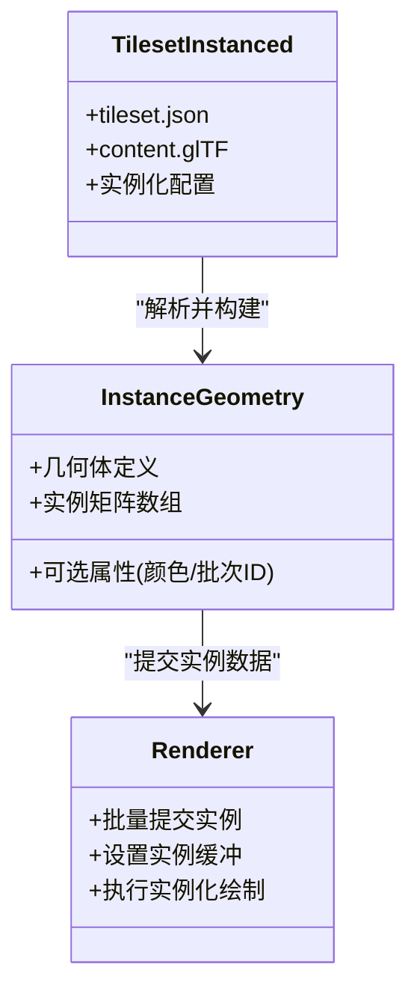
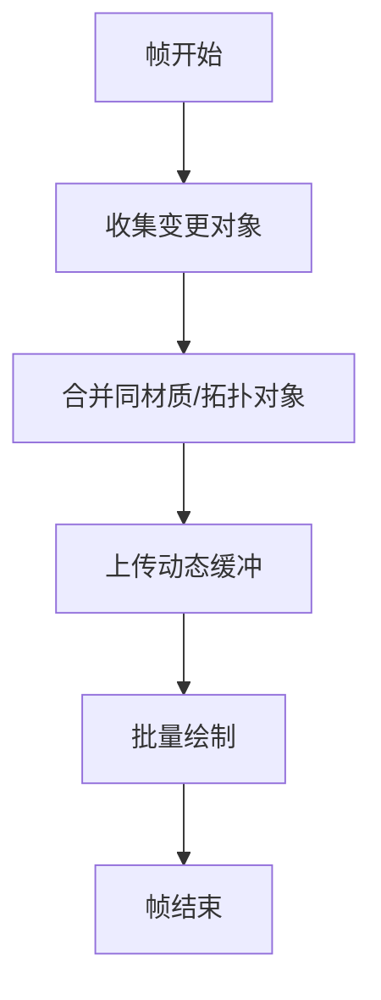
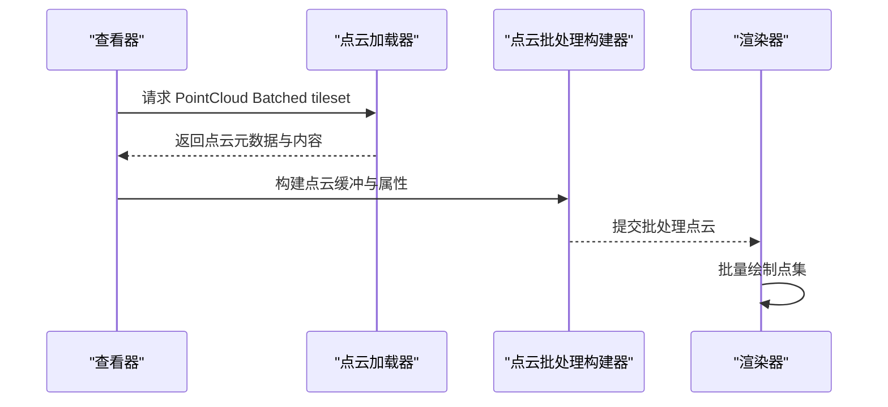
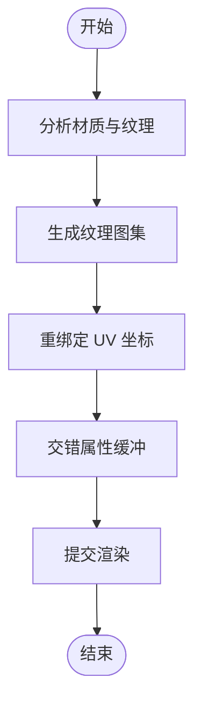
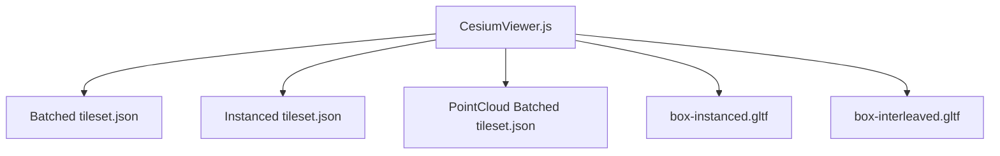

# 批处理渲染

<cite>
**本文引用的文件**   
- [README.md](file://README.md)
- [index.html](file://index.html)
- [CesiumViewer.js](file://Apps/CesiumViewer/CesiumViewer.js)
- [tileset.json（Batched）](file://Apps/SampleData/Cesium3DTiles/Batched/BatchedColors/tileset.json)
- [tileset.json（Instanced）](file://Apps/SampleData/Cesium3DTiles/Instanced/InstancedOrientation/tileset.json)
- [tileset.json（PointCloud Batched）](file://Apps/SampleData/Cesium3DTiles/PointCloud/PointCloudBatched/tileset.json)
- [BoxInstanced.gltf](file://Apps/SampleData/models/BoxInstanced/BoxInstanced.gltf)
- [box-instanced.gltf](file://Specs/Data/Models/glTF-2.0/BoxInstanced/glTF/box-instanced.gltf)
- [box-instanced-interleaved.gltf](file://Specs/Data/Models/glTF-2.0/BoxInterleaved/glTF/box-interleaved.gltf)
</cite>

## 目录
1. [简介](#简介)
2. [项目结构](#项目结构)
3. [核心组件](#核心组件)
4. [架构总览](#架构总览)
5. [详细组件分析](#详细组件分析)
6. [依赖关系分析](#依赖关系分析)
7. [性能考量](#性能考量)
8. [故障排查指南](#故障排查指南)
9. [结论](#结论)
10. [附录](#附录)

## 简介
本技术文档聚焦于 Cesium 的批处理渲染体系，围绕以下目标展开：
- 解释批处理渲染的核心原理：顶点合并策略、索引优化与 Draw Call 减少机制。
- 梳理不同批处理实现路径：静态几何体批处理、实例化渲染、动态对象合并。
- 阐述内存布局优化：顶点缓冲区组织、属性交错存储、纹理图集使用。
- 提供 API 使用示例与最佳实践，展示如何创建高效批处理、监控渲染性能与诊断瓶颈。

为便于读者快速上手，文档同时给出基于仓库内示例工程与测试数据的实操指引，并辅以架构图与流程图帮助理解数据流与控制流。

## 项目结构
仓库采用多包与示例分离的组织方式：
- Apps 目录包含可运行的示例应用与样例数据，涵盖 3D Tiles 的多种批处理场景（Batched、Instanced、PointCloud Batched）。
- Specs 目录包含大量 glTF 与 3D Tiles 测试用例，覆盖实例化、交错属性等关键特性。
- Source 与 packages 目录为核心引擎源码（本仓库中未直接列出具体实现文件，但通过示例与测试数据可反推其能力边界与使用方式）。

图表来源
- [CesiumViewer.js](file://Apps/CesiumViewer/CesiumViewer.js)
- [tileset.json（Batched）](file://Apps/SampleData/Cesium3DTiles/Batched/BatchedColors/tileset.json)
- [tileset.json（Instanced）](file://Apps/SampleData/Cesium3DTiles/Instanced/InstancedOrientation/tileset.json)
- [tileset.json（PointCloud Batched）](file://Apps/SampleData/Cesium3DTiles/PointCloud/PointCloudBatched/tileset.json)
- [BoxInstanced.gltf](file://Apps/SampleData/models/BoxInstanced/BoxInstanced.gltf)
- [box-instanced.gltf](file://Specs/Data/Models/glTF-2.0/BoxInstanced/glTF/box-instanced.gltf)
- [box-interleaved.gltf](file://Specs/Data/Models/glTF-2.0/BoxInterleaved/glTF/box-interleaved.gltf)

章节来源
- [README.md](file://README.md)
- [index.html](file://index.html)
- [CesiumViewer.js](file://Apps/CesiumViewer/CesiumViewer.js)

## 核心组件
- 3D Tiles 批处理（Batched）
  - 将多个几何体或特征合并到单一绘制调用中，通过批次 ID 在着色器阶段区分不同对象。
  - 典型数据入口：Batched tileset.json。
- 3D Tiles 实例化（Instanced）
  - 复用同一几何体，通过实例矩阵/变换批量绘制，显著降低重复几何体的开销。
  - 典型数据入口：Instanced tileset.json 与 glTF 扩展。
- 点云批处理（PointCloud Batched）
  - 对大规模点集进行批处理，结合颜色、法线、时间序列等属性提升吞吐。
  - 典型数据入口：PointCloud Batched tileset.json。
- glTF 实例化与交错属性
  - 通过 glTF 的实例化与交错缓冲组织，减少带宽与缓存缺失，提高 GPU 读取效率。
  - 参考文件：box-instanced.gltf、box-instanced-interleaved.gltf。

章节来源
- [tileset.json（Batched）](file://Apps/SampleData/Cesium3DTiles/Batched/BatchedColors/tileset.json)
- [tileset.json（Instanced）](file://Apps/SampleData/Cesium3DTiles/Instanced/InstancedOrientation/tileset.json)
- [tileset.json（PointCloud Batched）](file://Apps/SampleData/Cesium3DTiles/PointCloud/PointCloudBatched/tileset.json)
- [box-instanced.gltf](file://Specs/Data/Models/glTF-2.0/BoxInstanced/glTF/box-instanced.gltf)
- [box-instanced-interleaved.gltf](file://Specs/Data/Models/glTF-2.0/BoxInterleaved/glTF/box-interleaved.gltf)

## 架构总览
下图展示了从示例应用到渲染管线的整体流程，体现批处理与实例化在数据加载、构建与绘制阶段的协作关系。

图表来源
- [CesiumViewer.js](file://Apps/CesiumViewer/CesiumViewer.js)
- [tileset.json（Batched）](file://Apps/SampleData/Cesium3DTiles/Batched/BatchedColors/tileset.json)
- [tileset.json（Instanced）](file://Apps/SampleData/Cesium3DTiles/Instanced/InstancedOrientation/tileset.json)
- [box-instanced.gltf](file://Specs/Data/Models/glTF-2.0/BoxInstanced/glTF/box-instanced.gltf)

## 详细组件分析

### 静态几何体批处理（Batched）
- 核心思想
  - 将多个静态几何体合并为一个大的顶点/索引缓冲，并通过批次 ID 在着色器中区分不同对象。
  - 通过共享材质与纹理图集进一步减少状态切换。
- 数据入口与验证
  - 使用 Batched tileset.json 作为入口，检查 content 指向的 glTF/glb 是否包含必要的批次信息。
- 性能收益
  - 显著减少 Draw Call；适合城市建筑、静态设施等大批量静态对象。
- 注意事项
  - 批次大小需平衡内存占用与缓存命中率；过大可能导致缓存抖动。

图表来源
- [tileset.json（Batched）](file://Apps/SampleData/Cesium3DTiles/Batched/BatchedColors/tileset.json)

章节来源
- [tileset.json（Batched）](file://Apps/SampleData/Cesium3DTiles/Batched/BatchedColors/tileset.json)

### 实例化渲染（Instanced）
- 核心思想
  - 复用同一几何体，通过实例矩阵/变换批量绘制，避免重复上传几何体数据。
  - 支持缩放、旋转、平移等变换，并可结合批次表进行属性查询。
- 数据入口与验证
  - 使用 Instanced tileset.json 或 glTF 实例化扩展（如 box-instanced.gltf）作为入口。
- 性能收益
  - 极大降低几何体传输与顶点处理开销；适合树木、路灯、人群等重复对象。
- 注意事项
  - 实例数量与变换复杂度会影响 CPU 侧矩阵计算与 GPU 顶点着色阶段；建议合理分块与 LOD。

图表来源
- [tileset.json（Instanced）](file://Apps/SampleData/Cesium3DTiles/Instanced/InstancedOrientation/tileset.json)
- [box-instanced.gltf](file://Specs/Data/Models/glTF-2.0/BoxInstanced/glTF/box-instanced.gltf)

章节来源
- [tileset.json（Instanced）](file://Apps/SampleData/Cesium3DTiles/Instanced/InstancedOrientation/tileset.json)
- [box-instanced.gltf](file://Specs/Data/Models/glTF-2.0/BoxInstanced/glTF/box-instanced.gltf)

### 动态对象合并
- 适用场景
  - 频繁更新的少量对象（如车辆、无人机），可通过动态缓冲更新与合并绘制减少状态切换。
- 实现要点
  - 使用动态缓冲（Dynamic Buffer）承载变化数据；按帧或增量更新。
  - 将同材质/同拓扑的对象合并为一批，减少状态切换与 Draw Call。
- 注意事项
  - 动态更新频率高时，注意缓冲拷贝与同步开销；可采用双缓冲或异步上传。

[本节为概念性说明，不直接分析具体源文件]

### 点云批处理（PointCloud Batched）
- 核心思想
  - 将大规模点集合并为单个绘制调用，结合颜色、法线、时间序列等属性提升吞吐。
- 数据入口与验证
  - 使用 PointCloud Batched tileset.json 作为入口，检查点云格式与属性通道。
- 性能收益
  - 大幅减少 Draw Call；适合地形扫描、植被点云等海量点数据。
- 注意事项
  - 点云密度与属性维度影响内存与带宽；建议按需加载与可视距离控制。

图表来源
- [tileset.json（PointCloud Batched）](file://Apps/SampleData/Cesium3DTiles/PointCloud/PointCloudBatched/tileset.json)

章节来源
- [tileset.json（PointCloud Batched）](file://Apps/SampleData/Cesium3DTiles/PointCloud/PointCloudBatched/tileset.json)

### 内存布局优化：交错属性与纹理图集
- 交错属性（Interleaved Attributes）
  - 将位置、法线、UV 等属性交错存放，提升缓存局部性与带宽利用率。
  - 参考 glTF 交错示例：box-interleaved.gltf。
- 纹理图集（Texture Atlas）
  - 将多张纹理合并为一张大图，减少纹理切换与状态开销。
  - 适用于静态几何体批处理中的多材质对象。

图表来源
- [box-interleaved.gltf](file://Specs/Data/Models/glTF-2.0/BoxInterleaved/glTF/box-interleaved.gltf)

章节来源
- [box-interleaved.gltf](file://Specs/Data/Models/glTF-2.0/BoxInterleaved/glTF/box-interleaved.gltf)

## 依赖关系分析
- 示例应用依赖
  - CesiumViewer.js 负责初始化与加载 tileset/glTF 资源，驱动渲染管线。
- 数据依赖
  - Batched/Instanced/PointCloud Batched 的 tileset.json 分别对应不同的批处理模式。
  - glTF 实例化与交错属性示例用于验证内存布局优化效果。

图表来源
- [CesiumViewer.js](file://Apps/CesiumViewer/CesiumViewer.js)
- [tileset.json（Batched）](file://Apps/SampleData/Cesium3DTiles/Batched/BatchedColors/tileset.json)
- [tileset.json（Instanced）](file://Apps/SampleData/Cesium3DTiles/Instanced/InstancedOrientation/tileset.json)
- [tileset.json（PointCloud Batched）](file://Apps/SampleData/Cesium3DTiles/PointCloud/PointCloudBatched/tileset.json)
- [box-instanced.gltf](file://Specs/Data/Models/glTF-2.0/BoxInstanced/glTF/box-instanced.gltf)
- [box-interleaved.gltf](file://Specs/Data/Models/glTF-2.0/BoxInterleaved/glTF/box-interleaved.gltf)

章节来源
- [CesiumViewer.js](file://Apps/CesiumViewer/CesiumViewer.js)

## 性能考量
- Draw Call 合并
  - 优先合并同材质/同拓扑对象，减少状态切换与驱动开销。
- 实例化 vs 批处理
  - 高度重复对象优先实例化；差异较大对象考虑静态批处理。
- 内存与带宽
  - 使用交错属性与纹理图集降低带宽压力；合理控制批次大小。
- 动态更新
  - 动态对象采用增量更新与双缓冲，避免整块复制与同步阻塞。
- 可视范围与 LOD
  - 根据视距与屏幕占比动态调整细节级别，减少不必要的顶点与实例数量。

[本节为通用指导，不直接分析具体源文件]

## 故障排查指南
- 常见问题
  - 资源加载失败：检查 tileset.json 与 glTF 路径是否正确。
  - 渲染异常：确认批次 ID、实例矩阵与属性通道是否完整。
  - 性能瓶颈：观察 Draw Call 数量、顶点数与纹理切换次数。
- 定位步骤
  - 使用浏览器开发者工具的性能面板记录帧时间与 GPU 指标。
  - 逐步关闭批处理/实例化选项，对比性能差异以定位问题。
  - 针对点云场景，检查点密度与属性维度是否超出设备能力。

[本节为通用指导，不直接分析具体源文件]

## 结论
Cesium 的批处理渲染体系通过静态几何体批处理、实例化渲染与点云批处理等多种手段，有效降低了 Draw Call 与内存带宽压力。配合交错属性与纹理图集等内存布局优化，可在大规模场景中显著提升渲染性能。实践中应结合数据特征与应用需求选择合适的批处理策略，并利用示例与测试数据进行验证与调优。

[本节为总结性内容，不直接分析具体源文件]

## 附录
- 快速上手示例
  - 在 CesiumViewer 中加载 Batched/Instanced/PointCloud Batched 的 tileset.json，观察渲染效果与性能指标。
  - 使用 glTF 实例化与交错属性示例，验证内存布局优化的实际收益。
- 参考文件
  - [CesiumViewer.js](file://Apps/CesiumViewer/CesiumViewer.js)
  - [tileset.json（Batched）](file://Apps/SampleData/Cesium3DTiles/Batched/BatchedColors/tileset.json)
  - [tileset.json（Instanced）](file://Apps/SampleData/Cesium3DTiles/Instanced/InstancedOrientation/tileset.json)
  - [tileset.json（PointCloud Batched）](file://Apps/SampleData/Cesium3DTiles/PointCloud/PointCloudBatched/tileset.json)
  - [box-instanced.gltf](file://Specs/Data/Models/glTF-2.0/BoxInstanced/glTF/box-instanced.gltf)
  - [box-interleaved.gltf](file://Specs/Data/Models/glTF-2.0/BoxInterleaved/glTF/box-interleaved.gltf)

[本节为补充信息，不直接分析具体源文件]