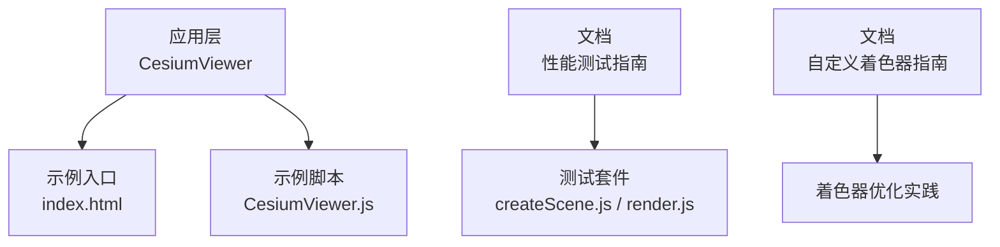
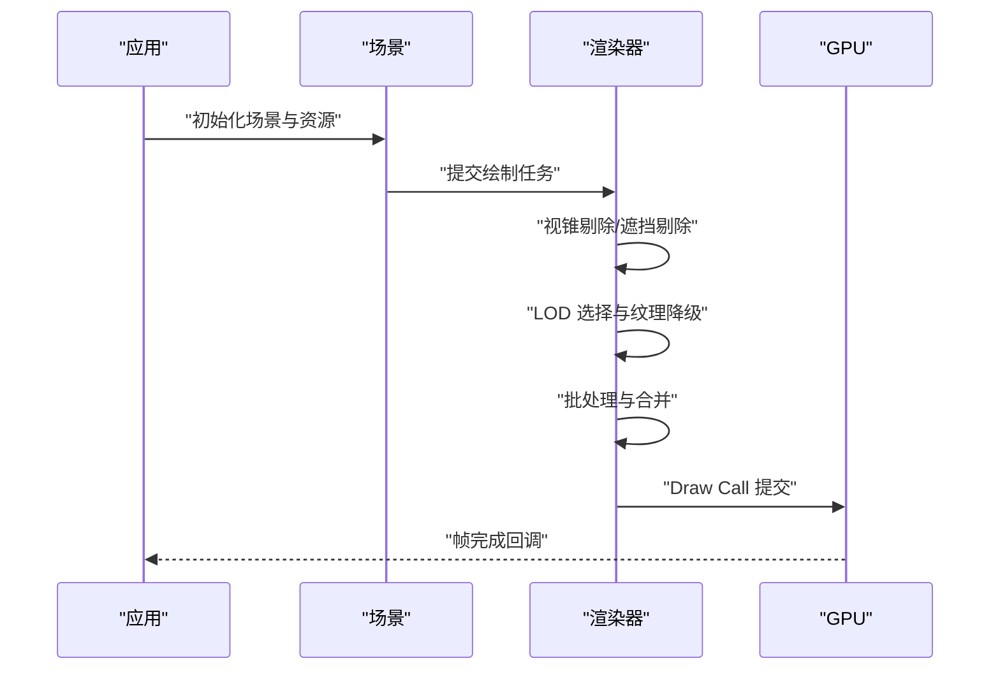
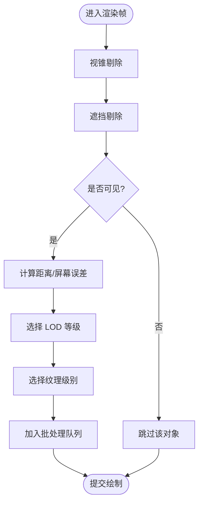
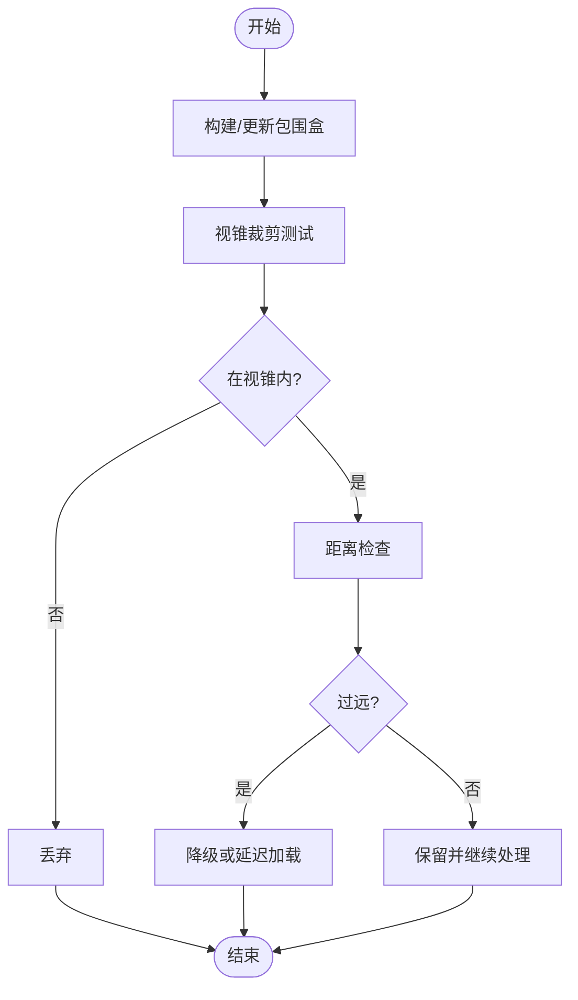
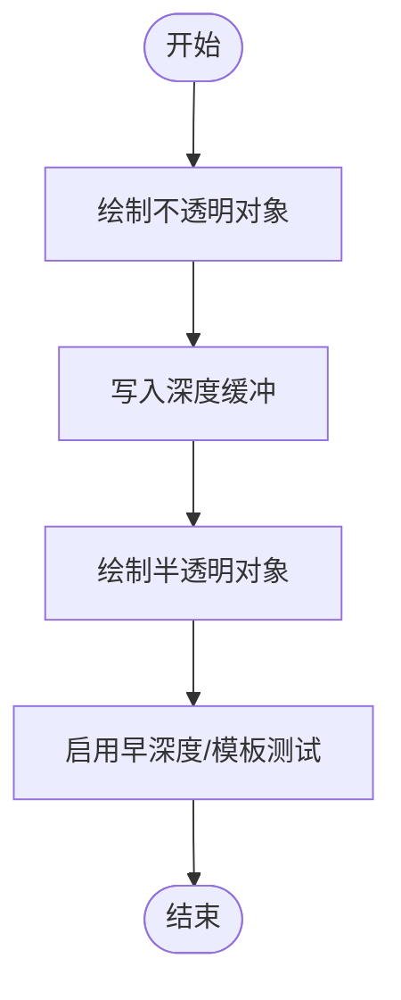
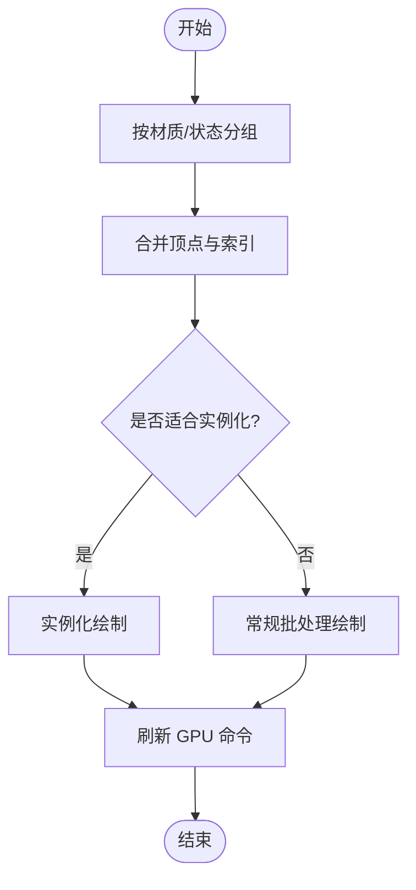
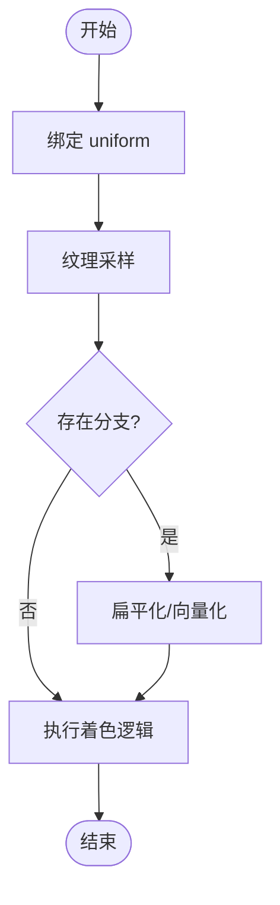
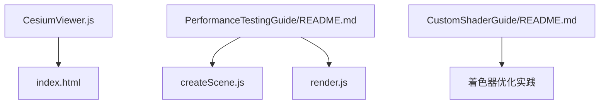

# 渲染优化

<cite>
**本文引用的文件**   
- [README.md](file://README.md)
- [PerformanceTestingGuide/README.md](file://Documentation/Contributors/PerformanceTestingGuide/README.md)
- [CustomShaderGuide/README.md](file://Documentation/CustomShaderGuide/README.md)
- [CesiumViewer.js](file://Apps/CesiumViewer/CesiumViewer.js)
- [index.html](file://Apps/CesiumViewer/index.html)
- [createScene.js](file://Specs/createScene.js)
- [render.js](file://Specs/render.js)
</cite>

## 目录
1. [简介](#简介)
2. [项目结构](#项目结构)
3. [核心组件](#核心组件)
4. [架构总览](#架构总览)
5. [详细组件分析](#详细组件分析)
6. [依赖关系分析](#依赖关系分析)
7. [性能考量](#性能考量)
8. [故障排查指南](#故障排查指南)
9. [结论](#结论)
10. [附录](#附录)

## 简介
本技术文档聚焦于 Cesium 的渲染优化，围绕以下关键主题展开：
- LOD（细节层次）系统：几何体简化、纹理降级与动态切换策略
- 视锥剔除：包围盒计算、距离检测与批量处理优化
- 遮挡剔除：深度缓冲利用与 GPU 辅助剔除
- 批处理渲染：顶点合并、索引优化与 Draw Call 减少
- 着色器优化：uniform 变量管理、纹理采样优化与分支预测
- 实践案例与测试方法：结合仓库中的示例与测试工具进行效果验证

## 项目结构
仓库采用多包与多应用组织方式。与渲染优化直接相关的资源包括：
- 应用示例：用于演示加载场景与渲染流程
- 文档：性能测试指南与自定义着色器指南
- 测试套件：提供创建场景、渲染循环等基础能力，便于复现实验

**图表来源**
- [CesiumViewer.js](file://Apps/CesiumViewer/CesiumViewer.js)
- [index.html](file://Apps/CesiumViewer/index.html)
- [PerformanceTestingGuide/README.md](file://Documentation/Contributors/PerformanceTestingGuide/README.md)
- [CustomShaderGuide/README.md](file://Documentation/CustomShaderGuide/README.md)
- [createScene.js](file://Specs/createScene.js)
- [render.js](file://Specs/render.js)

**章节来源**
- [README.md](file://README.md)
- [CesiumViewer.js](file://Apps/CesiumViewer/CesiumViewer.js)
- [index.html](file://Apps/CesiumViewer/index.html)
- [PerformanceTestingGuide/README.md](file://Documentation/Contributors/PerformanceTestingGuide/README.md)
- [CustomShaderGuide/README.md](file://Documentation/CustomShaderGuide/README.md)
- [createScene.js](file://Specs/createScene.js)
- [render.js](file://Specs/render.js)

## 核心组件
- 场景与渲染管线：通过示例与测试套件提供的场景创建与渲染循环，可观察不同优化策略对帧率、GPU 使用的影响
- 数据与资源：模型、瓦片集、纹理等资源在渲染前需进行预处理（如压缩、LOD 生成），以支持运行时高效切换
- 测试与度量：基于性能测试指南的方法，建立稳定的基准场景与指标采集流程

**章节来源**
- [PerformanceTestingGuide/README.md](file://Documentation/Contributors/PerformanceTestingGuide/README.md)
- [createScene.js](file://Specs/createScene.js)
- [render.js](file://Specs/render.js)

## 架构总览
下图展示从应用到渲染的关键路径，以及优化点的位置：

[此图为概念性流程图，不直接映射具体源码文件]

## 详细组件分析

### LOD（细节层次）系统
- 目标：在保持视觉质量的前提下降低几何复杂度与纹理带宽
- 实现要点：
  - 几何体简化：根据相机距离或屏幕空间误差阈值选择更粗/更细的网格版本
  - 纹理降级：按分辨率与可见性动态切换贴图级别，避免过采样
  - 动态切换策略：平滑过渡与抖动抑制，防止闪烁；批量更新以减少 CPU/GPU 同步开销
- 建议：
  - 为大型模型与瓦片集预生成多级 LOD
  - 将 LOD 决策与视锥剔除、遮挡剔除联动，优先剔除不可见区域再评估 LOD

[此图为概念性流程图，不直接映射具体源码文件]

### 视锥剔除算法
- 包围盒计算：使用 AABB/OBB/球体等近似体积快速判断是否在视锥内
- 距离检测：对远距离对象提前降质或直接剔除，减少后续计算
- 批量处理优化：
  - 将同类对象分组，统一矩阵变换与裁剪
  - 使用层级结构（如四叉树/八叉树）加速大范围剔除
- 建议：
  - 在 CPU 侧做粗剔除，在 GPU 侧做精细剔除（例如使用裁剪平面）
  - 对频繁移动的对象采用增量更新包围盒

[此图为概念性流程图，不直接映射具体源码文件]

### 遮挡剔除技术
- 深度缓冲利用：利用已写入的深度信息判断片段是否被遮挡
- GPU 辅助剔除：借助 GPU 的早深度/模板测试或 occlusion query 机制减少无效绘制
- 建议：
  - 先绘制不透明物体，再处理半透明物体
  - 合理设置深度范围与精度，避免 z-fighting 影响剔除效果

[此图为概念性流程图，不直接映射具体源码文件]

### 批处理渲染
- 原理：将多个相似图元合并为一次或少数几次 Draw Call，减少状态切换与驱动开销
- 关键技术：
  - 顶点合并：共享属性（材质、法线、UV）的图元合并
  - 索引优化：重排索引以提升缓存命中率
  - 实例化渲染：相同几何体不同变换的批量绘制
- 建议：
  - 控制批次大小，避免单次过大导致内存压力
  - 对动态变化的对象单独批处理，避免频繁重建缓冲区

[此图为概念性流程图，不直接映射具体源码文件]

### 着色器优化技巧
- uniform 变量管理：
  - 减少每帧更新频率，批量更新
  - 合并相近 uniform，减少绑定次数
- 纹理采样优化：
  - 使用合适的 mipmaps 与过滤模式
  - 避免跨图集采样，减少纹理切换
- 分支预测：
  - 尽量消除条件分支，使用数学函数替代
  - 将复杂计算移至 CPU 或离线阶段

[此图为概念性流程图，不直接映射具体源码文件]

**章节来源**
- [CustomShaderGuide/README.md](file://Documentation/CustomShaderGuide/README.md)

## 依赖关系分析
- 应用层与示例：
  - 应用入口与脚本负责初始化场景与资源，触发渲染循环
- 文档与测试：
  - 性能测试指南提供方法论与指标定义
  - 测试套件提供场景创建与渲染循环的基础能力，便于复现实验

**图表来源**
- [CesiumViewer.js](file://Apps/CesiumViewer/CesiumViewer.js)
- [index.html](file://Apps/CesiumViewer/index.html)
- [PerformanceTestingGuide/README.md](file://Documentation/Contributors/PerformanceTestingGuide/README.md)
- [CustomShaderGuide/README.md](file://Documentation/CustomShaderGuide/README.md)
- [createScene.js](file://Specs/createScene.js)
- [render.js](file://Specs/render.js)

**章节来源**
- [CesiumViewer.js](file://Apps/CesiumViewer/CesiumViewer.js)
- [index.html](file://Apps/CesiumViewer/index.html)
- [PerformanceTestingGuide/README.md](file://Documentation/Contributors/PerformanceTestingGuide/README.md)
- [CustomShaderGuide/README.md](file://Documentation/CustomShaderGuide/README.md)
- [createScene.js](file://Specs/createScene.js)
- [render.js](file://Specs/render.js)

## 性能考量
- 指标体系：
  - 帧率（FPS）、平均/分位耗时、Draw Call 数量、顶点/索引数量、纹理带宽占用
- 实验设计：
  - 固定相机路径与时间步长，确保可比性
  - 分别开启/关闭各优化项，对比差异
- 数据采集：
  - 使用浏览器开发者工具或 WebGL 扩展统计 GPU/CPU 耗时
  - 记录关键节点耗时（剔除、LOD、批处理、绘制）

[本节为通用指导，不直接分析具体文件]

## 故障排查指南
- 常见问题：
  - 闪烁与抖动：检查 LOD 切换阈值与过渡策略
  - 过度绘制：调整剔除顺序与深度写入策略
  - 卡顿：定位 Draw Call 峰值与状态切换热点
- 调试步骤：
  - 逐步启用优化项，定位瓶颈
  - 使用最小复现场景隔离问题
  - 对比不同硬件与驱动表现

[本节为通用指导，不直接分析具体文件]

## 结论
通过系统化的 LOD、视锥剔除、遮挡剔除、批处理与着色器优化，可在大规模场景中显著提升渲染效率。建议结合性能测试指南与测试套件，建立持续的性能回归与优化闭环。

[本节为总结性内容，不直接分析具体文件]

## 附录
- 参考文档：
  - 性能测试指南：提供指标定义与实验方法
  - 自定义着色器指南：涵盖 uniform、纹理与分支优化实践
- 示例与测试：
  - 应用示例：用于快速搭建渲染环境
  - 测试套件：用于稳定复现与对比实验

**章节来源**
- [PerformanceTestingGuide/README.md](file://Documentation/Contributors/PerformanceTestingGuide/README.md)
- [CustomShaderGuide/README.md](file://Documentation/CustomShaderGuide/README.md)
- [CesiumViewer.js](file://Apps/CesiumViewer/CesiumViewer.js)
- [index.html](file://Apps/CesiumViewer/index.html)
- [createScene.js](file://Specs/createScene.js)
- [render.js](file://Specs/render.js)