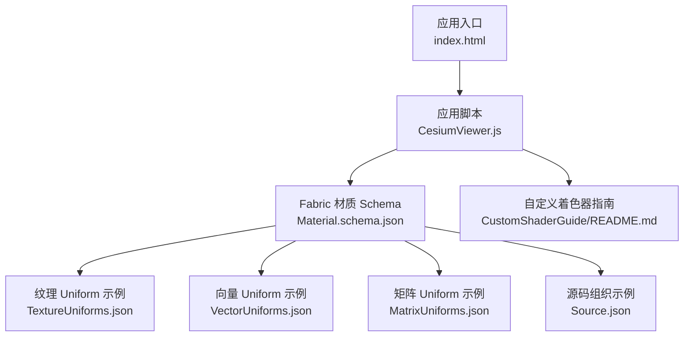
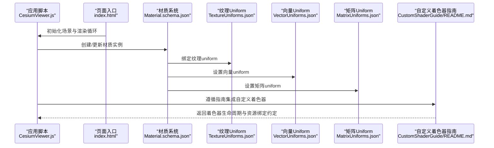
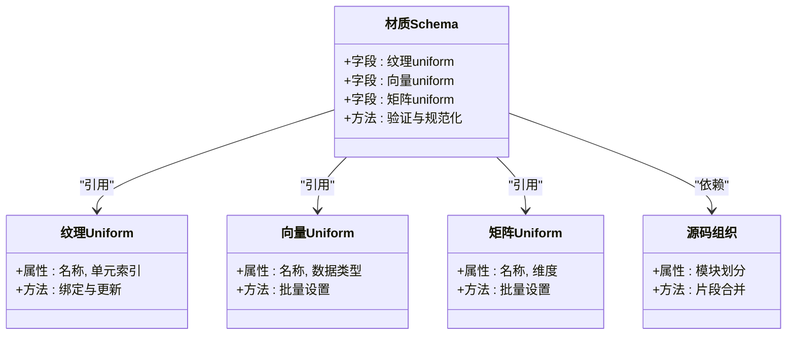
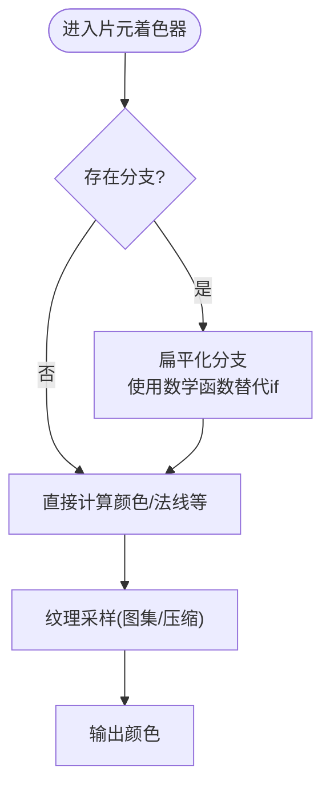
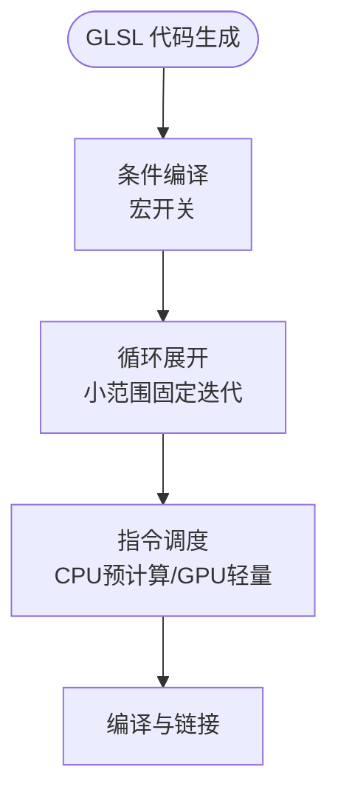
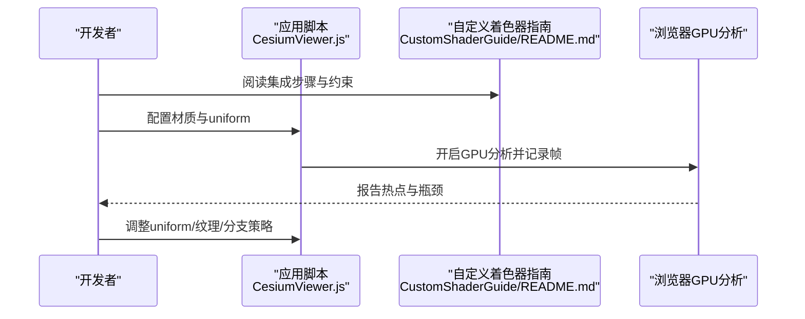
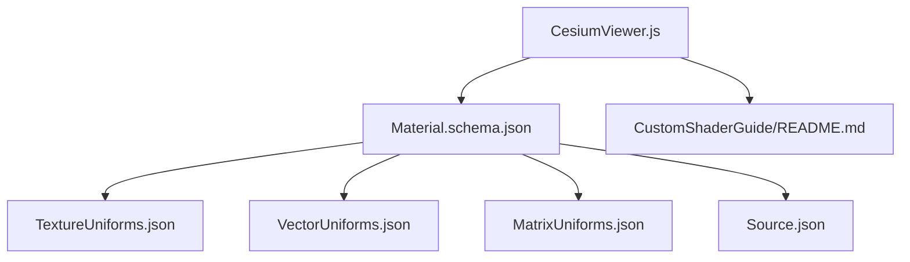

# 着色器优化

<cite>
**本文引用的文件**   
- [README.md](file://Documentation/CustomShaderGuide/README.md)
- [Material.schema.json](file://Documentation/Schemas/Fabric/Material.schema.json)
- [TextureUniforms.json](file://Documentation/Schemas/Fabric/Examples/TextureUniforms.json)
- [VectorUniforms.json](file://Documentation/Schemas/Fabric/Examples/VectorUniforms.json)
- [MatrixUniforms.json](file://Documentation/Schemas/Fabric/Examples/MatrixUniforms.json)
- [Source.json](file://Documentation/Schemas/Fabric/Examples/Source.json)
- [index.html](file://Apps/CesiumViewer/index.html)
- [CesiumViewer.js](file://Apps/CesiumViewer/CesiumViewer.js)
</cite>

## 目录
1. [简介](#简介)
2. [项目结构](#项目结构)
3. [核心组件](#核心组件)
4. [架构总览](#架构总览)
5. [详细组件分析](#详细组件分析)
6. [依赖分析](#依赖分析)
7. [性能考虑](#性能考虑)
8. [故障排查指南](#故障排查指南)
9. [结论](#结论)
10. [附录](#附录) 

## 简介
本技术文档聚焦于在 Cesium 中实现高性能的 WebGL 着色器与材质系统。内容覆盖 uniform 变量管理、纹理采样优化、分支预测技巧，以及材质缓存、状态管理与共享资源策略。同时提供 GLSL 编程最佳实践（循环展开、条件编译、指令调度）和调试与性能分析方法，帮助读者在复杂三维场景中稳定获得高帧率与低延迟。

## 项目结构
Cesium 仓库包含示例应用与 Fabric 材质系统的 Schema 定义，这些是理解材质与着色器工作流的关键入口：
- 自定义着色器指南：说明如何编写与集成自定义着色器到 Cesium 渲染管线。
- Fabric 材质 Schema：描述材质声明式配置的结构，包括纹理、向量与矩阵 uniform 的约定。
- 示例应用：展示如何在应用中加载并运行基于 Cesium 的可视化场景。

图表来源
- [index.html](file://Apps/CesiumViewer/index.html)
- [CesiumViewer.js](file://Apps/CesiumViewer/CesiumViewer.js)
- [Material.schema.json](file://Documentation/Schemas/Fabric/Material.schema.json)
- [TextureUniforms.json](file://Documentation/Schemas/Fabric/Examples/TextureUniforms.json)
- [VectorUniforms.json](file://Documentation/Schemas/Fabric/Examples/VectorUniforms.json)
- [MatrixUniforms.json](file://Documentation/Schemas/Fabric/Examples/MatrixUniforms.json)
- [Source.json](file://Documentation/Schemas/Fabric/Examples/Source.json)
- [README.md](file://Documentation/CustomShaderGuide/README.md)

章节来源
- [README.md](file://Documentation/CustomShaderGuide/README.md)
- [Material.schema.json](file://Documentation/Schemas/Fabric/Material.schema.json)
- [TextureUniforms.json](file://Documentation/Schemas/Fabric/Examples/TextureUniforms.json)
- [VectorUniforms.json](file://Documentation/Schemas/Fabric/Examples/VectorUniforms.json)
- [MatrixUniforms.json](file://Documentation/Schemas/Fabric/Examples/MatrixUniforms.json)
- [Source.json](file://Documentation/Schemas/Fabric/Examples/Source.json)
- [index.html](file://Apps/CesiumViewer/index.html)
- [CesiumViewer.js](file://Apps/CesiumViewer/CesiumViewer.js)

## 核心组件
- 材质系统与 Fabric Schema
  - 通过 Material.schema.json 定义材质的统一接口，约束纹理、向量与矩阵 uniform 的命名与类型，确保跨平台一致性与可组合性。
  - TextureUniforms.json、VectorUniforms.json、MatrixUniforms.json 提供了具体字段示例，便于开发者快速上手与对齐规范。
- 自定义着色器指南
  - CustomShaderGuide/README.md 指导如何将自定义着色器接入 Cesium 渲染流程，涵盖生命周期、输入输出与与引擎资源的绑定方式。
- 示例应用
  - Apps/CesiumViewer 中的 index.html 与 CesiumViewer.js 展示了从页面初始化到渲染循环的基本路径，可作为集成自定义材质与着色器的参考起点。

章节来源
- [Material.schema.json](file://Documentation/Schemas/Fabric/Material.schema.json)
- [TextureUniforms.json](file://Documentation/Schemas/Fabric/Examples/TextureUniforms.json)
- [VectorUniforms.json](file://Documentation/Schemas/Fabric/Examples/VectorUniforms.json)
- [MatrixUniforms.json](file://Documentation/Schemas/Fabric/Examples/MatrixUniforms.json)
- [README.md](file://Documentation/CustomShaderGuide/README.md)
- [index.html](file://Apps/CesiumViewer/index.html)
- [CesiumViewer.js](file://Apps/CesiumViewer/CesiumViewer.js)

## 架构总览
下图展示了从应用入口到材质与着色器执行的高层数据流，强调 Fabric 材质 Schema 对 uniform 与纹理的统一抽象，以及自定义着色器指南对集成方式的约束。

图表来源
- [index.html](file://Apps/CesiumViewer/index.html)
- [CesiumViewer.js](file://Apps/CesiumViewer/CesiumViewer.js)
- [Material.schema.json](file://Documentation/Schemas/Fabric/Material.schema.json)
- [TextureUniforms.json](file://Documentation/Schemas/Fabric/Examples/TextureUniforms.json)
- [VectorUniforms.json](file://Documentation/Schemas/Fabric/Examples/VectorUniforms.json)
- [MatrixUniforms.json](file://Documentation/Schemas/Fabric/Examples/MatrixUniforms.json)
- [README.md](file://Documentation/CustomShaderGuide/README.md)

## 详细组件分析

### 组件A：材质系统与 Fabric Schema 的优化机制
- 材质缓存
  - 依据 Material.schema.json 的字段约定，将相同语义的材质进行去重与复用，减少重复编译与状态切换。
  - 使用 Source.json 的组织模式，将材质片段按功能拆分，提高复用率与缓存命中率。
- 状态管理
  - 通过 VectorUniforms.json 与 MatrixUniforms.json 的字段分组，批量更新 uniform，降低驱动调用开销。
  - 纹理单元分配遵循 TextureUniforms.json 的命名空间，避免频繁切换纹理导致的流水线停顿。
- 共享资源
  - 将常用常量（如光照参数、时间戳）集中为全局 uniform，由材质系统统一注入，减少每帧重复上传。

图表来源
- [Material.schema.json](file://Documentation/Schemas/Fabric/Material.schema.json)
- [TextureUniforms.json](file://Documentation/Schemas/Fabric/Examples/TextureUniforms.json)
- [VectorUniforms.json](file://Documentation/Schemas/Fabric/Examples/VectorUniforms.json)
- [MatrixUniforms.json](file://Documentation/Schemas/Fabric/Examples/MatrixUniforms.json)
- [Source.json](file://Documentation/Schemas/Fabric/Examples/Source.json)

章节来源
- [Material.schema.json](file://Documentation/Schemas/Fabric/Material.schema.json)
- [TextureUniforms.json](file://Documentation/Schemas/Fabric/Examples/TextureUniforms.json)
- [VectorUniforms.json](file://Documentation/Schemas/Fabric/Examples/VectorUniforms.json)
- [MatrixUniforms.json](file://Documentation/Schemas/Fabric/Examples/MatrixUniforms.json)
- [Source.json](file://Documentation/Schemas/Fabric/Examples/Source.json)

### 组件B：WebGL 着色器优化策略
- Uniform 变量管理
  - 将高频更新的 uniform 与低频或静态 uniform 分离，采用批处理更新策略，减少 GPU-CPU 同步点。
  - 利用矩阵 uniform 的层级化组织，避免重复计算与冗余上传。
- 纹理采样优化
  - 控制纹理尺寸与格式，优先使用压缩纹理；合理选择 mipmap 与过滤模式，平衡质量与带宽。
  - 使用纹理图集减少纹理切换次数，提升批次绘制效率。
- 分支预测技巧
  - 在片元着色器中尽量避免深度嵌套分支，使用数学函数替代条件判断，提升并行度。
  - 将分支条件提升到顶点阶段或 CPU 侧，减少每像素分支开销。

[本节为概念性流程图，不直接映射具体源文件]

### 组件C：GLSL 编程最佳实践
- 循环展开
  - 对小规模固定迭代（如光照模型中的多次反射）进行手动展开，减少循环开销与分支。
- 条件编译
  - 使用预处理器宏剔除未启用功能的代码段，减小最终着色器体积与执行路径。
- 指令调度
  - 将昂贵计算（如三角函数、幂运算）尽量前置或在 CPU 端预计算，GPU 仅做插值与轻量合成。

[本节为概念性流程图，不直接映射具体源文件]

### 组件D：自定义着色器集成与调试
- 集成路径
  - 依据 CustomShaderGuide/README.md 的指引，将自定义着色器注册到渲染管线，明确输入输出与资源绑定契约。
  - 在应用脚本中按材质 Schema 配置 uniform 与纹理，确保运行时一致性。
- 调试工具
  - 使用浏览器开发者工具的 GPU 分析与帧时序面板，定位瓶颈（如纹理带宽、状态切换）。
  - 结合最小复现场景逐步引入着色器特性，隔离问题来源。

图表来源
- [README.md](file://Documentation/CustomShaderGuide/README.md)
- [CesiumViewer.js](file://Apps/CesiumViewer/CesiumViewer.js)

章节来源
- [README.md](file://Documentation/CustomShaderGuide/README.md)
- [CesiumViewer.js](file://Apps/CesiumViewer/CesiumViewer.js)

## 依赖分析
材质系统与着色器之间的依赖关系主要由 Fabric Schema 与示例应用构成。Schema 定义了材质与 uniform 的契约，示例应用则演示了如何将这些契约落地到实际渲染流程。

图表来源
- [Material.schema.json](file://Documentation/Schemas/Fabric/Material.schema.json)
- [TextureUniforms.json](file://Documentation/Schemas/Fabric/Examples/TextureUniforms.json)
- [VectorUniforms.json](file://Documentation/Schemas/Fabric/Examples/VectorUniforms.json)
- [MatrixUniforms.json](file://Documentation/Schemas/Fabric/Examples/MatrixUniforms.json)
- [Source.json](file://Documentation/Schemas/Fabric/Examples/Source.json)
- [CesiumViewer.js](file://Apps/CesiumViewer/CesiumViewer.js)
- [README.md](file://Documentation/CustomShaderGuide/README.md)

章节来源
- [Material.schema.json](file://Documentation/Schemas/Fabric/Material.schema.json)
- [TextureUniforms.json](file://Documentation/Schemas/Fabric/Examples/TextureUniforms.json)
- [VectorUniforms.json](file://Documentation/Schemas/Fabric/Examples/VectorUniforms.json)
- [MatrixUniforms.json](file://Documentation/Schemas/Fabric/Examples/MatrixUniforms.json)
- [Source.json](file://Documentation/Schemas/Fabric/Examples/Source.json)
- [CesiumViewer.js](file://Apps/CesiumViewer/CesiumViewer.js)
- [README.md](file://Documentation/CustomShaderGuide/README.md)

## 性能考虑
- 减少状态切换
  - 合并绘制批次，统一材质与纹理单元，避免频繁切换导致流水线停顿。
- 控制纹理带宽
  - 使用合适的分辨率与压缩格式，按需加载与释放纹理，避免峰值内存占用过高。
- 优化分支与循环
  - 在片元着色器中尽量减少分支与深层循环，必要时在 CPU 或顶点阶段完成更多计算。
- 监控与回归
  - 建立基准测试与回归检查，持续跟踪关键指标（帧时、GPU 利用率、纹理带宽）。

[本节为通用指导，不直接分析具体文件]

## 故障排查指南
- 常见问题
  - 着色器编译失败：检查 Shader 语法与宏定义，确认与 Schema 字段一致。
  - 纹理未生效：核对纹理单元绑定与采样器配置，确认路径与格式正确。
  - 性能抖动：观察 GPU 分析面板，定位状态切换与纹理带宽热点。
- 定位步骤
  - 最小化场景复现，逐步添加材质与着色器特性。
  - 使用浏览器开发者工具与 GPU 分析工具对比不同版本的差异。
  - 根据 CustomShaderGuide/README.md 的集成步骤逐项校验。

章节来源
- [README.md](file://Documentation/CustomShaderGuide/README.md)

## 结论
通过在 Cesium 中严格遵循 Fabric 材质 Schema 的约定，并结合 uniform 管理、纹理采样优化与分支预测技巧，可以显著提升着色器性能与稳定性。配合 GLSL 编程最佳实践与完善的调试与性能分析流程，能够在复杂三维场景中实现高质量与高帧率的渲染效果。

[本节为总结性内容，不直接分析具体文件]

## 附录
- 相关示例与资料
  - 自定义着色器指南：了解如何编写与集成自定义着色器。
  - Fabric 材质 Schema 与示例：掌握材质字段的标准化用法。
  - 示例应用：作为集成与调试的起点。

章节来源
- [README.md](file://Documentation/CustomShaderGuide/README.md)
- [Material.schema.json](file://Documentation/Schemas/Fabric/Material.schema.json)
- [TextureUniforms.json](file://Documentation/Schemas/Fabric/Examples/TextureUniforms.json)
- [VectorUniforms.json](file://Documentation/Schemas/Fabric/Examples/VectorUniforms.json)
- [MatrixUniforms.json](file://Documentation/Schemas/Fabric/Examples/MatrixUniforms.json)
- [Source.json](file://Documentation/Schemas/Fabric/Examples/Source.json)
- [index.html](file://Apps/CesiumViewer/index.html)
- [CesiumViewer.js](file://Apps/CesiumViewer/CesiumViewer.js)