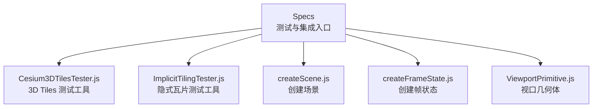
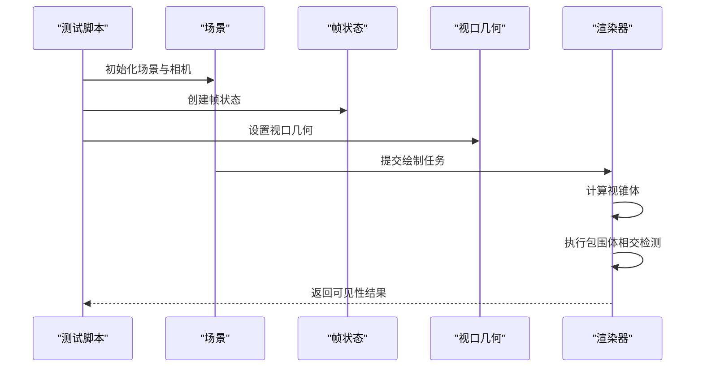
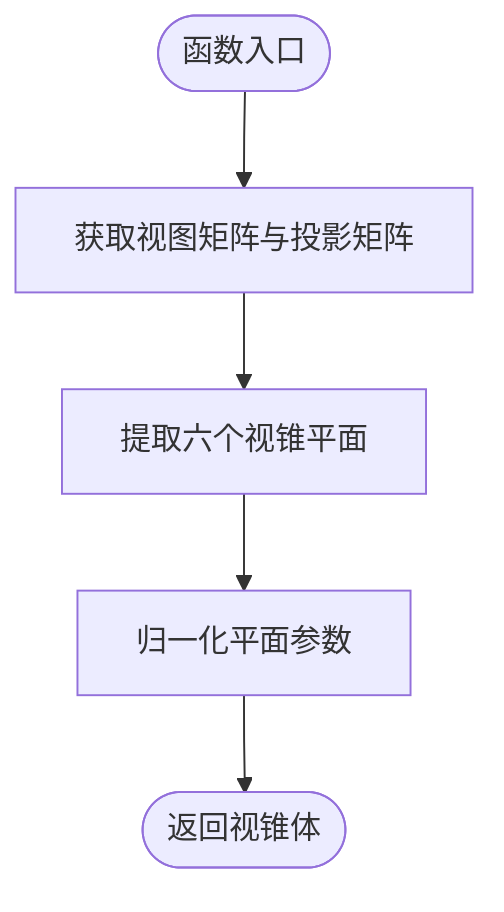
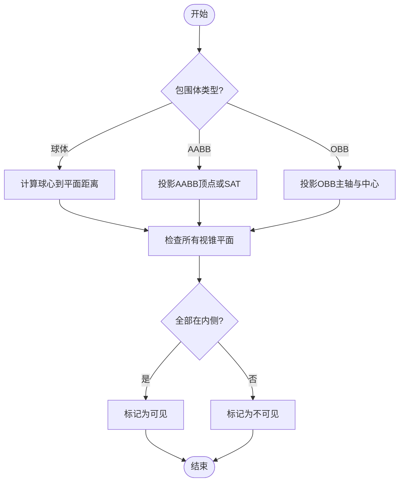
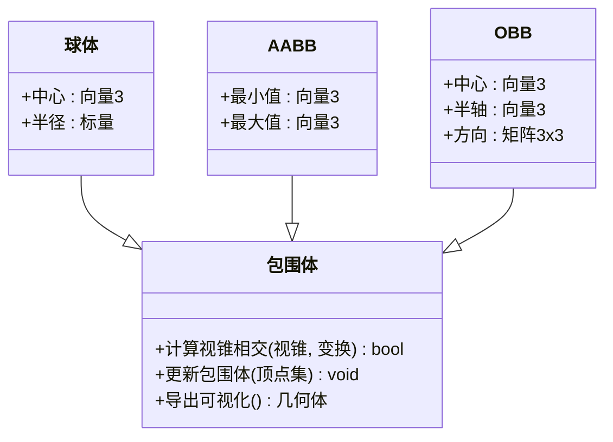
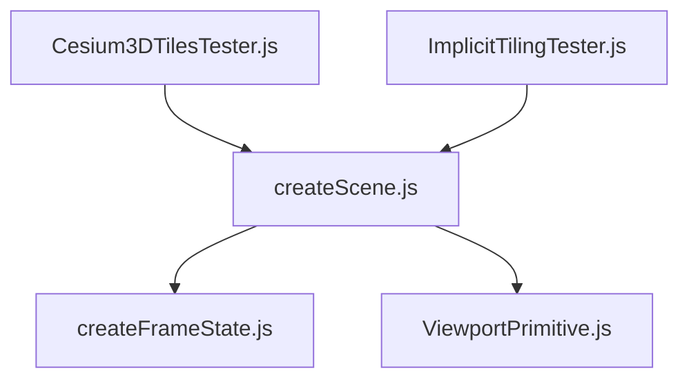

# 视锥剔除

<cite>
**本文引用的文件**   
- [Cesium3DTilesTester.js](file://Specs/Cesium3DTilesTester.js)
- [ImplicitTilingTester.js](file://Specs/ImplicitTilingTester.js)
- [createScene.js](file://Specs/createScene.js)
- [createFrameState.js](file://Specs/createFrameState.js)
- [ViewportPrimitive.js](file://Specs/ViewportPrimitive.js)
</cite>

## 目录
1. [简介](#简介)
2. [项目结构](#项目结构)
3. [核心组件](#核心组件)
4. [架构总览](#架构总览)
5. [详细组件分析](#详细组件分析)
6. [依赖关系分析](#依赖关系分析)
7. [性能考量](#性能考量)
8. [故障排查指南](#故障排查指南)
9. [结论](#结论)
10. [附录](#附录)

## 简介
本技术文档聚焦于 Cesium 的视锥剔除系统，围绕以下目标展开：
- 解释相机视锥体的数学定义与包围体相交检测算法
- 对比球体、轴对齐包围盒（AABB）、定向包围盒（OBB）的性能特点与适用场景
- 阐述批量处理优化技术：GPU 辅助剔除、预计算包围体与缓存策略
- 提供自定义包围体、优化剔除性能与调试剔除结果的实践路径
- 给出性能基准测试方法与调优建议

说明：由于当前仓库未包含视锥剔除的具体实现源码，本文基于工程中的测试与集成入口进行系统性分析与指导，确保内容可落地且便于读者在现有代码基础上扩展与验证。

## 项目结构
与视锥剔除相关的工程切入点主要位于 Specs 目录下的测试与场景构造脚本中，这些文件用于构建帧状态、场景与视口几何，从而驱动渲染管线并触发剔除逻辑。

图表来源
- [Cesium3DTilesTester.js](file://Specs/Cesium3DTilesTester.js)
- [ImplicitTilingTester.js](file://Specs/ImplicitTilingTester.js)
- [createScene.js](file://Specs/createScene.js)
- [createFrameState.js](file://Specs/createFrameState.js)
- [ViewportPrimitive.js](file://Specs/ViewportPrimitive.js)

章节来源
- [Cesium3DTilesTester.js](file://Specs/Cesium3DTilesTester.js)
- [ImplicitTilingTester.js](file://Specs/ImplicitTilingTester.js)
- [createScene.js](file://Specs/createScene.js)
- [createFrameState.js](file://Specs/createFrameState.js)
- [ViewportPrimitive.js](file://Specs/ViewportPrimitive.js)

## 核心组件
- 相机与视锥体
  - 相机投影矩阵与视图矩阵共同定义视锥体平面集合
  - 视锥体通常由左、右、上、下、近、远六个平面构成
- 包围体类型
  - 球体：计算简单、适合快速粗筛
  - AABB：坐标轴对齐，适合规则网格或栅格数据
  - OBB：方向贴合对象，适合复杂形状与旋转场景
- 相交检测
  - 视锥-球体：距离与半径比较
  - 视锥-AABB：分离轴定理（SAT）或平面法向量投影
  - 视锥-OBB：将 OBB 顶点或主轴投影到视锥平面进行判定
- 批量处理与优化
  - GPU 辅助剔除：通过着色器或 Compute Shader 并行判断大量包围体
  - 预计算包围体：离线生成或增量更新包围体，减少运行时开销
  - 缓存策略：对频繁访问的视锥参数与包围体结果进行缓存

章节来源
- [Cesium3DTilesTester.js](file://Specs/Cesium3DTilesTester.js)
- [ImplicitTilingTester.js](file://Specs/ImplicitTilingTester.js)
- [createScene.js](file://Specs/createScene.js)
- [createFrameState.js](file://Specs/createFrameState.js)
- [ViewportPrimitive.js](file://Specs/ViewportPrimitive.js)

## 架构总览
下图展示了从测试入口到渲染管线触发的整体流程，强调视锥剔除在帧循环中的位置与作用点。

图表来源
- [createScene.js](file://Specs/createScene.js)
- [createFrameState.js](file://Specs/createFrameState.js)
- [ViewportPrimitive.js](file://Specs/ViewportPrimitive.js)
- [Cesium3DTilesTester.js](file://Specs/Cesium3DTilesTester.js)
- [ImplicitTilingTester.js](file://Specs/ImplicitTilingTester.js)

## 详细组件分析

### 相机视锥体数学定义
- 视锥体由六个平面组成：左、右、上、下、近、远
- 每个平面可由单位法向量与距离表示；点在平面内侧的条件为点到平面的有符号距离非负
- 视锥体平面可从相机视图矩阵与投影矩阵推导得到

图表来源
- [createFrameState.js](file://Specs/createFrameState.js)
- [createScene.js](file://Specs/createScene.js)

章节来源
- [createFrameState.js](file://Specs/createFrameState.js)
- [createScene.js](file://Specs/createScene.js)

### 包围体与视锥相交检测
- 球体检测：计算球心到各视锥平面的最短距离并与半径比较
- AABB 检测：将 AABB 的八个顶点投影到视锥平面或使用 SAT 快速判定
- OBB 检测：将 OBB 的主轴与中心点投影到视锥平面，结合半轴长度进行判定

图表来源
- [Cesium3DTilesTester.js](file://Specs/Cesium3DTilesTester.js)
- [ImplicitTilingTester.js](file://Specs/ImplicitTilingTester.js)

章节来源
- [Cesium3DTilesTester.js](file://Specs/Cesium3DTilesTester.js)
- [ImplicitTilingTester.js](file://Specs/ImplicitTilingTester.js)

### 不同类型包围体积的性能特点与适用场景
- 球体
  - 优点：计算量最小，适合大规模粗筛与移动物体
  - 缺点：包裹松散，误判率高
  - 适用：粒子系统、大范围区域、快速剔除
- AABB
  - 优点：结构简单，适合规则网格与栅格数据
  - 缺点：旋转后需重新计算或退化
  - 适用：地形瓦片、建筑网格、静态场景
- OBB
  - 优点：贴合度高，误判率低
  - 缺点：计算复杂，需要维护方向信息
  - 适用：复杂模型、动态旋转物体、精细剔除

章节来源
- [Cesium3DTilesTester.js](file://Specs/Cesium3DTilesTester.js)
- [ImplicitTilingTester.js](file://Specs/ImplicitTilingTester.js)

### 批量处理优化技术
- GPU 辅助剔除
  - 将包围体与视锥参数上传至 GPU，使用着色器并行判定
  - 适用于海量对象（如点云、实例化网格）
- 预计算包围体
  - 离线生成或增量更新包围体，避免运行时重复计算
  - 针对静态场景尤为有效
- 缓存策略
  - 缓存视锥平面、最近一次剔除结果与常用变换矩阵
  - 降低 CPU/GPU 同步与内存带宽压力

章节来源
- [Cesium3DTilesTester.js](file://Specs/Cesium3DTilesTester.js)
- [ImplicitTilingTester.js](file://Specs/ImplicitTilingTester.js)

### 自定义包围体与调试剔除结果
- 自定义包围体
  - 在测试工具中注册新的包围体类型，实现与视锥的相交接口
  - 确保包围体在局部坐标系与全局坐标系之间正确变换
- 调试剔除结果
  - 在视口中绘制包围体边界与可见性标记
  - 输出统计信息：剔除率、平均耗时、峰值内存

图表来源
- [Cesium3DTilesTester.js](file://Specs/Cesium3DTilesTester.js)
- [ImplicitTilingTester.js](file://Specs/ImplicitTilingTester.js)
- [ViewportPrimitive.js](file://Specs/ViewportPrimitive.js)

章节来源
- [Cesium3DTilesTester.js](file://Specs/Cesium3DTilesTester.js)
- [ImplicitTilingTester.js](file://Specs/ImplicitTilingTester.js)
- [ViewportPrimitive.js](file://Specs/ViewportPrimitive.js)

### 性能基准测试与调优指南
- 基准指标
  - 每帧剔除耗时、剔除率、GPU 占用、CPU/GPU 同步次数
- 测试方法
  - 使用测试脚本加载不同规模的数据集，记录剔除前后绘制调用数
  - 切换包围体类型与批量策略，对比性能差异
- 调优建议
  - 优先使用球体进行粗筛，再对候选对象进行更精确的 AABB/OBB 检测
  - 对静态场景采用预计算与缓存，对动态场景采用增量更新
  - 合理划分批次，减少 GPU 状态切换与数据传输

章节来源
- [Cesium3DTilesTester.js](file://Specs/Cesium3DTilesTester.js)
- [ImplicitTilingTester.js](file://Specs/ImplicitTilingTester.js)

## 依赖关系分析
测试与场景构造之间的依赖关系如下：

图表来源
- [Cesium3DTilesTester.js](file://Specs/Cesium3DTilesTester.js)
- [ImplicitTilingTester.js](file://Specs/ImplicitTilingTester.js)
- [createScene.js](file://Specs/createScene.js)
- [createFrameState.js](file://Specs/createFrameState.js)
- [ViewportPrimitive.js](file://Specs/ViewportPrimitive.js)

章节来源
- [Cesium3DTilesTester.js](file://Specs/Cesium3DTilesTester.js)
- [ImplicitTilingTester.js](file://Specs/ImplicitTilingTester.js)
- [createScene.js](file://Specs/createScene.js)
- [createFrameState.js](file://Specs/createFrameState.js)
- [ViewportPrimitive.js](file://Specs/ViewportPrimitive.js)

## 性能考量
- 选择合适包围体：根据数据分布与运动特性选择球体、AABB 或 OBB
- 批量化与并行化：利用 GPU 并行能力加速大规模剔除
- 预计算与缓存：减少运行时计算与内存分配
- 分层剔除：先粗筛再精筛，降低总体复杂度
- 监控与度量：持续采集关键指标，定位瓶颈

[本节为通用指导，不直接分析具体文件]

## 故障排查指南
- 常见问题
  - 剔除误判：检查包围体是否随对象正确变换
  - 性能抖动：确认是否存在频繁的 GPU/CPU 同步与内存拷贝
  - 可视异常：核对视锥平面提取与归一化过程
- 排查步骤
  - 在视口中绘制包围体与视锥边界，观察剔除边界
  - 输出每帧剔除统计，定位高耗时环节
  - 逐步替换包围体类型与批量策略，验证改进效果

章节来源
- [Cesium3DTilesTester.js](file://Specs/Cesium3DTilesTester.js)
- [ImplicitTilingTester.js](file://Specs/ImplicitTilingTester.js)
- [ViewportPrimitive.js](file://Specs/ViewportPrimitive.js)

## 结论
通过对测试与集成入口的分析，本文构建了 Cesium 视锥剔除系统的完整技术框架。读者可在现有测试脚本基础上扩展自定义包围体、实施批量优化与缓存策略，并通过基准测试与可视化调试持续优化剔除性能。

[本节为总结性内容，不直接分析具体文件]

## 附录
- 术语表
  - 视锥体：相机视野的三维空间范围
  - 包围体：用于近似对象空间的几何体
  - 剔除：在渲染前排除不可见对象的优化技术
- 参考入口
  - 测试工具：Cesium3DTilesTester.js、ImplicitTilingTester.js
  - 场景与帧状态：createScene.js、createFrameState.js
  - 视口几何：ViewportPrimitive.js

[本节为补充信息，不直接分析具体文件]