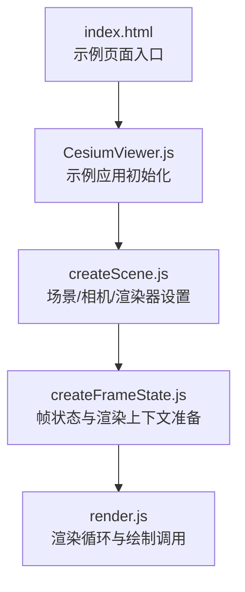
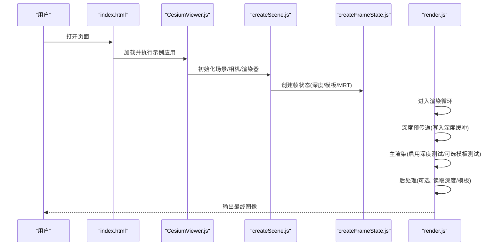
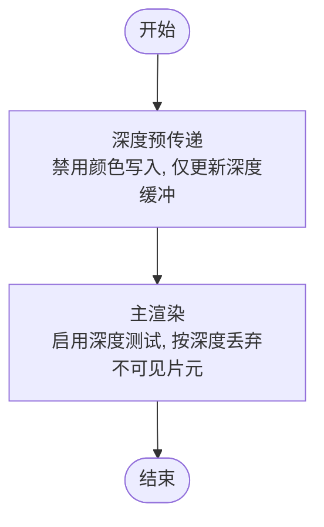
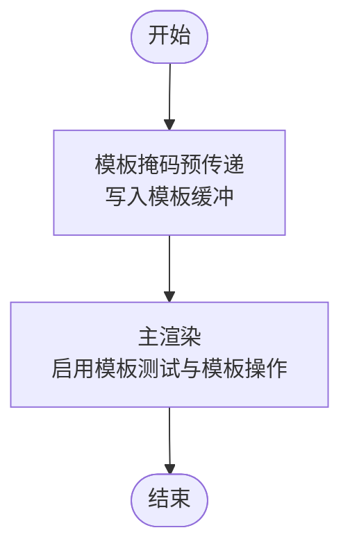
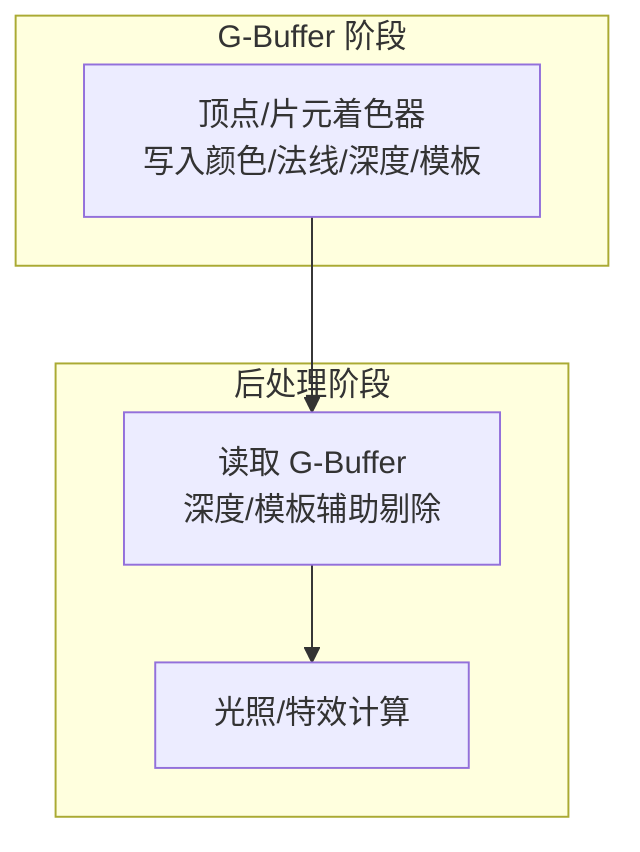
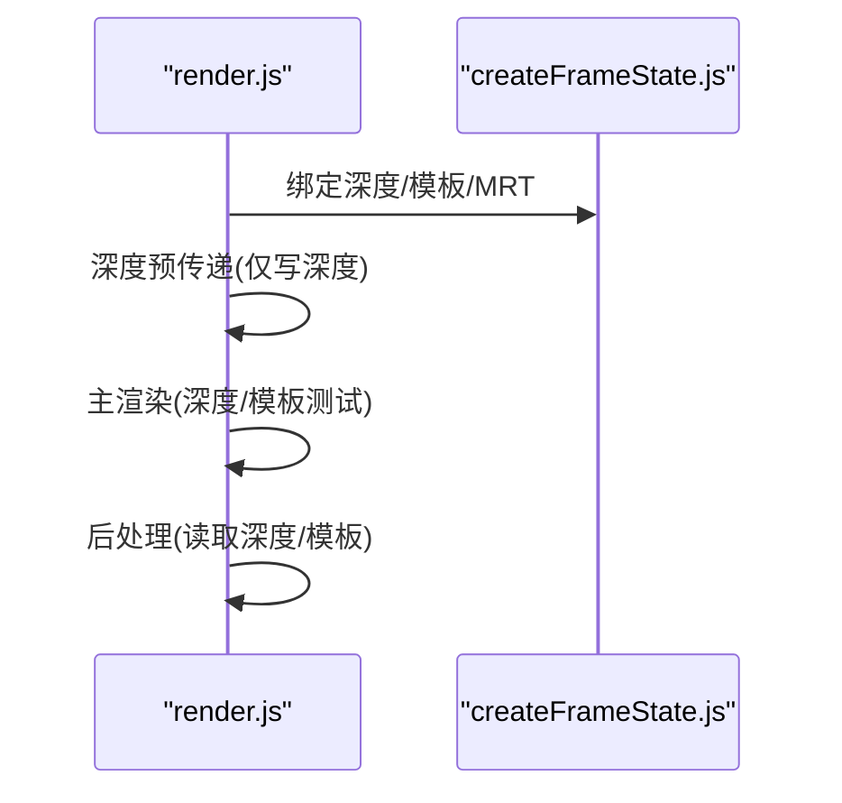
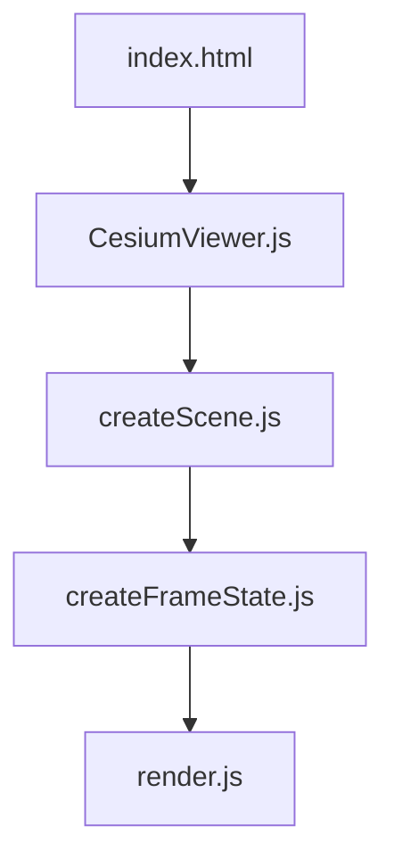

# 遮挡剔除

<cite>
**本文引用的文件**   
- [README.md](file://README.md)
- [index.html](file://index.html)
- [CesiumViewer.js](file://Apps/CesiumViewer/CesiumViewer.js)
- [createScene.js](file://Specs/createScene.js)
- [render.js](file://Specs/render.js)
- [createFrameState.js](file://Specs/createFrameState.js)
</cite>

## 目录
1. [简介](#简介)
2. [项目结构](#项目结构)
3. [核心组件](#核心组件)
4. [架构总览](#架构总览)
5. [详细组件分析](#详细组件分析)
6. [依赖分析](#依赖分析)
7. [性能考虑](#性能考虑)
8. [故障排查指南](#故障排查指南)
9. [结论](#结论)
10. [附录](#附录)

## 简介
本技术文档聚焦于 Cesium 的遮挡剔除系统，围绕以下目标展开：
- 解释遮挡剔除的技术原理：深度缓冲利用、GPU 辅助剔除与后处理管线集成。
- 梳理不同剔除策略：基于深度的剔除、模板测试与延迟着色器优化。
- 说明与渲染管线的集成方式：深度预传递、多重渲染目标（MRT）与后处理阶段。
- 提供配置选项与调优技巧，展示在不同场景下如何平衡准确性与性能。
- 给出实际案例分析与性能对比数据的方法论与指标建议。

## 项目结构
仓库包含示例应用、测试套件与构建脚本等。与遮挡剔除相关的工程化入口与测试资源主要位于 Apps 与 Specs 目录中：
- Apps/CesiumViewer：示例应用的运行入口与页面逻辑。
- Specs：测试与基准场景构造、帧状态创建与渲染流程控制。

图表来源
- [index.html:1-200](file://index.html#L1-L200)
- [CesiumViewer.js:1-200](file://Apps/CesiumViewer/CesiumViewer.js#L1-L200)
- [createScene.js:1-200](file://Specs/createScene.js#L1-L200)
- [createFrameState.js:1-200](file://Specs/createFrameState.js#L1-L200)
- [render.js:1-200](file://Specs/render.js#L1-L200)

章节来源
- [README.md:1-200](file://README.md#L1-L200)
- [index.html:1-200](file://index.html#L1-L200)
- [CesiumViewer.js:1-200](file://Apps/CesiumViewer/CesiumViewer.js#L1-L200)
- [createScene.js:1-200](file://Specs/createScene.js#L1-L200)
- [createFrameState.js:1-200](file://Specs/createFrameState.js#L1-L200)
- [render.js:1-200](file://Specs/render.js#L1-L200)

## 核心组件
- 示例应用入口与页面加载：负责初始化 WebGL 上下文、加载 Cesium 并启动渲染循环。
- 场景与相机：定义视锥体、投影矩阵与近远裁剪面，直接影响深度缓冲精度与剔除效果。
- 帧状态与渲染上下文：封装当前帧的渲染目标、深度/模板缓冲、混合与剔除状态。
- 渲染循环：组织多通道绘制（如深度预传递、主渲染、后处理），协调剔除相关状态切换。

章节来源
- [CesiumViewer.js:1-200](file://Apps/CesiumViewer/CesiumViewer.js#L1-L200)
- [createScene.js:1-200](file://Specs/createScene.js#L1-L200)
- [createFrameState.js:1-200](file://Specs/createFrameState.js#L1-L200)
- [render.js:1-200](file://Specs/render.js#L1-L200)

## 架构总览
下图展示了从页面到渲染循环的关键路径，以及遮挡剔除在其中的位置（深度预传递、主渲染、后处理）。

图表来源
- [index.html:1-200](file://index.html#L1-L200)
- [CesiumViewer.js:1-200](file://Apps/CesiumViewer/CesiumViewer.js#L1-L200)
- [createScene.js:1-200](file://Specs/createScene.js#L1-L200)
- [createFrameState.js:1-200](file://Specs/createFrameState.js#L1-L200)
- [render.js:1-200](file://Specs/render.js#L1-L200)

## 详细组件分析

### 深度缓冲与基于深度的剔除
- 原理要点
  - 深度缓冲记录每个像素的最小可见深度值，用于后续片元深度测试，避免对不可见片元的着色计算。
  - 通过合理的近/远裁剪面与深度精度分配，可提升深度测试的有效性，减少过度绘制。
- 实现关注点
  - 在深度预传递阶段仅写入深度，不写颜色，确保深度缓冲准确反映几何体的可见性。
  - 主渲染阶段开启深度测试，结合合适的深度函数（如小于等于）进行片元剔除。
- 复杂度与影响
  - 时间复杂度近似 O(N)（N 为参与绘制的图元数），但通过剔除显著降低片元着色成本。
  - 空间复杂度取决于深度缓冲分辨率与位深。

图表来源
- [createFrameState.js:1-200](file://Specs/createFrameState.js#L1-L200)
- [render.js:1-200](file://Specs/render.js#L1-L200)

章节来源
- [createFrameState.js:1-200](file://Specs/createFrameState.js#L1-L200)
- [render.js:1-200](file://Specs/render.js#L1-L200)

### 模板测试与 GPU 辅助剔除
- 原理要点
  - 模板缓冲可用于标记特定区域或对象，在主渲染时依据模板值决定是否绘制，从而实现更细粒度的剔除。
  - 典型用法：先绘制掩码（更新模板），再根据模板条件绘制目标对象。
- 实现关注点
  - 在预传递阶段写入模板值；主渲染阶段启用模板测试与模板操作。
  - 注意模板缓冲的格式与平台兼容性，必要时回退至基于深度的剔除。
- 复杂度与影响
  - 额外一次模板写入与一次模板测试，带来少量开销，但可大幅减少复杂场景中的片元着色。

图表来源
- [createFrameState.js:1-200](file://Specs/createFrameState.js#L1-L200)
- [render.js:1-200](file://Specs/render.js#L1-L200)

章节来源
- [createFrameState.js:1-200](file://Specs/createFrameState.js#L1-L200)
- [render.js:1-200](file://Specs/render.js#L1-L200)

### 延迟着色器优化与后处理管线集成
- 原理要点
  - 延迟着色将几何属性（法线、材质参数等）写入 G-Buffer（MRT），光照计算延后至后处理阶段。
  - 后处理阶段可读取深度/模板缓冲，实现基于屏幕空间的剔除与特效。
- 实现关注点
  - 使用多重渲染目标（MRT）同时写入多个纹理（如颜色、法线、深度、模板）。
  - 在后处理阶段按需采样深度/模板，结合剔除逻辑减少不必要的着色计算。
- 复杂度与影响
  - 增加 MRT 带宽与显存占用，但在高复杂度场景中可降低整体着色成本。

图表来源
- [createFrameState.js:1-200](file://Specs/createFrameState.js#L1-L200)
- [render.js:1-200](file://Specs/render.js#L1-L200)

章节来源
- [createFrameState.js:1-200](file://Specs/createFrameState.js#L1-L200)
- [render.js:1-200](file://Specs/render.js#L1-L200)

### 与渲染管线的集成方式
- 深度预传递
  - 目的：建立准确的深度信息，为主渲染阶段的深度测试提供基础。
  - 关键点：关闭颜色写入，仅更新深度缓冲；合理设置深度范围与精度。
- 多重渲染目标（MRT）
  - 目的：在一次绘制中写入多个缓冲区（颜色、法线、深度、模板），为延迟着色与后处理提供数据。
  - 关键点：管理 MRT 绑定与解绑，避免状态切换带来的开销。
- 后处理阶段
  - 目的：基于屏幕空间信息进行剔除、特效与合成。
  - 关键点：正确采样深度/模板，保证剔除逻辑与主渲染一致。

图表来源
- [createFrameState.js:1-200](file://Specs/createFrameState.js#L1-L200)
- [render.js:1-200](file://Specs/render.js#L1-L200)

章节来源
- [createFrameState.js:1-200](file://Specs/createFrameState.js#L1-L200)
- [render.js:1-200](file://Specs/render.js#L1-L200)

## 依赖分析
- 模块耦合
  - index.html 作为页面入口，加载 CesiumViewer.js。
  - CesiumViewer.js 初始化场景与渲染器，依赖 createScene.js 完成相机与渲染器配置。
  - createFrameState.js 提供帧状态与渲染上下文，供 render.js 在渲染循环中使用。
- 外部依赖
  - WebGL/WebGL2 上下文与扩展（深度/模板缓冲、MRT）。
  - Cesium 引擎（若示例应用直接引用）。

图表来源
- [index.html:1-200](file://index.html#L1-L200)
- [CesiumViewer.js:1-200](file://Apps/CesiumViewer/CesiumViewer.js#L1-L200)
- [createScene.js:1-200](file://Specs/createScene.js#L1-L200)
- [createFrameState.js:1-200](file://Specs/createFrameState.js#L1-L200)
- [render.js:1-200](file://Specs/render.js#L1-L200)

章节来源
- [index.html:1-200](file://index.html#L1-L200)
- [CesiumViewer.js:1-200](file://Apps/CesiumViewer/CesiumViewer.js#L1-L200)
- [createScene.js:1-200](file://Specs/createScene.js#L1-L200)
- [createFrameState.js:1-200](file://Specs/createFrameState.js#L1-L200)
- [render.js:1-200](file://Specs/render.js#L1-L200)

## 性能考虑
- 深度缓冲精度
  - 调整近/远裁剪面比例，避免深度精度不足导致的 z-fighting 或剔除失效。
- 剔除策略选择
  - 简单场景优先基于深度的剔除；复杂场景引入模板测试以提升剔除效率。
  - 延迟着色适用于高复杂度着色与大量片元着色器的场景。
- 渲染状态切换
  - 合并相同状态的绘制批次，减少状态切换开销。
- 内存与带宽
  - MRT 会增加显存占用与带宽压力，需权衡场景复杂度与设备能力。
- 测量与监控
  - 使用浏览器开发者工具的性能面板统计 GPU 耗时、绘制调用次数与片元着色成本。
  - 自定义计数器统计剔除前后片元着色次数与平均帧时间。

[本节为通用指导，无需具体文件分析]

## 故障排查指南
- 深度测试异常
  - 检查深度缓冲是否被正确写入与保留，确认深度函数设置是否符合预期。
  - 验证近/远裁剪面是否合理，避免深度精度问题。
- 模板测试无效
  - 确认模板缓冲格式与平台支持情况，必要时回退至基于深度的剔除。
  - 检查模板掩码写入与模板测试条件是否匹配。
- 后处理结果不正确
  - 核对 MRT 绑定顺序与解绑时机，确保深度/模板数据可用。
  - 验证后处理着色器采样坐标与纹理尺寸一致性。

章节来源
- [createFrameState.js:1-200](file://Specs/createFrameState.js#L1-L200)
- [render.js:1-200](file://Specs/render.js#L1-L200)

## 结论
遮挡剔除是提升渲染性能的关键技术。在 Cesium 中，可通过深度预传递、模板测试与延迟着色等多种策略组合，针对不同场景进行优化。合理配置深度缓冲与 MRT、选择合适的剔除策略，并结合性能监控持续调优，可在保证视觉质量的前提下显著提升帧率与稳定性。

[本节为总结性内容，无需具体文件分析]

## 附录
- 实际案例分析与性能对比数据
  - 建议方法：在同一场景下分别启用“仅深度剔除”、“深度+模板剔除”与“延迟着色+后处理剔除”，记录绘制调用次数、片元着色次数、GPU 耗时与平均帧时间。
  - 指标建议：FPS、Draw Calls、Overdraw、Pixel Shader Time、Depth Fail Rate、Stencil Pass Rate。
  - 数据来源：浏览器性能面板、自定义计数器、日志输出。

[本节为方法论与指标建议，无需具体文件分析]